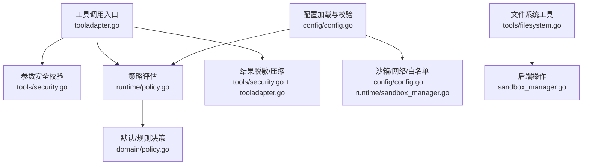
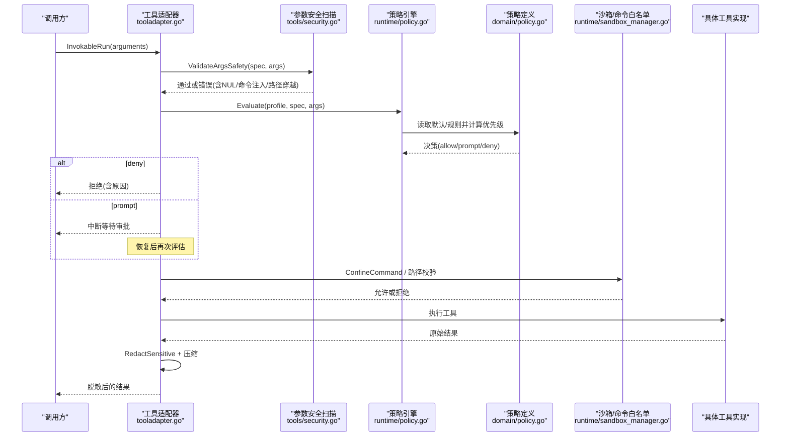
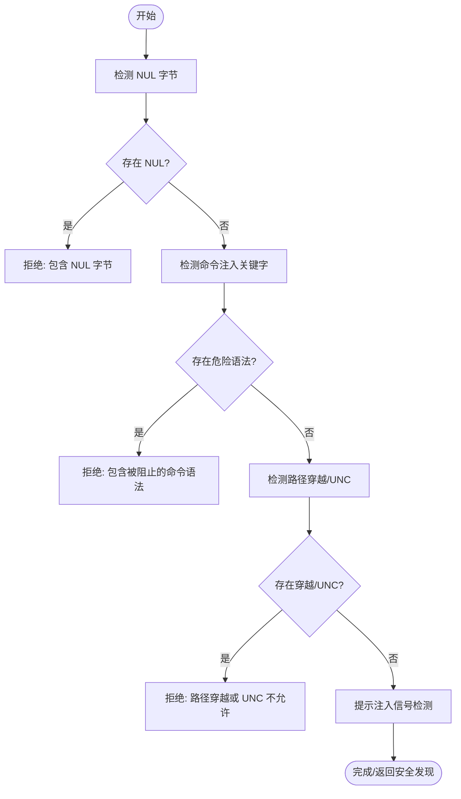
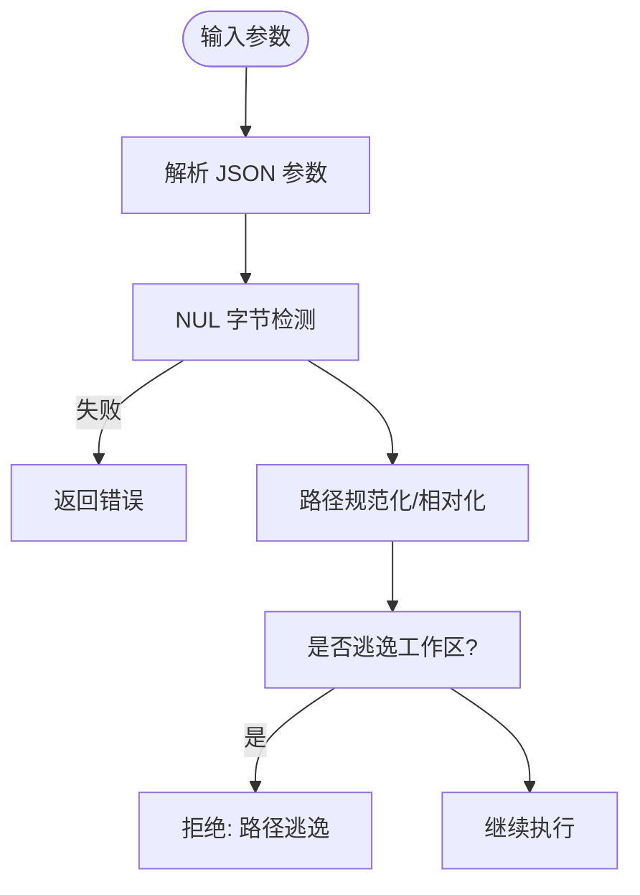
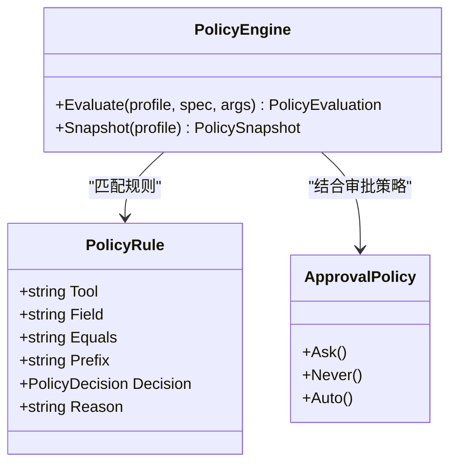
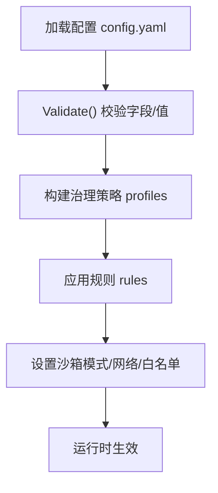
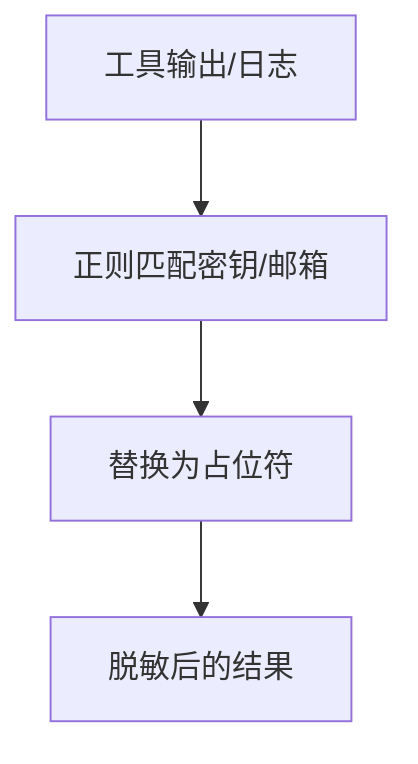
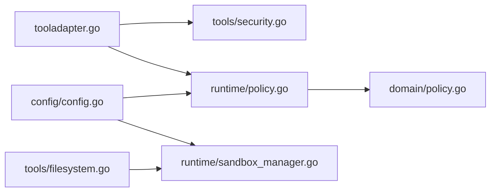

# 安全策略与访问控制

<cite>
**本文引用的文件**
- [internal/tools/security.go](file://internal/tools/security.go)
- [internal/runtime/policy.go](file://internal/runtime/policy.go)
- [internal/domain/policy.go](file://internal/domain/policy.go)
- [internal/config/config.go](file://internal/config/config.go)
- [internal/runtime/tooladapter.go](file://internal/runtime/tooladapter.go)
- [internal/tools/filesystem.go](file://internal/tools/filesystem.go)
- [internal/runtime/sandbox_manager.go](file://internal/runtime/sandbox_manager.go)
- [docs/secret-redaction-audit.md](file://docs/secret-redaction-audit.md)
</cite>

## 目录
1. [简介](#简介)
2. [项目结构](#项目结构)
3. [核心组件](#核心组件)
4. [架构总览](#架构总览)
5. [详细组件分析](#详细组件分析)
6. [依赖关系分析](#依赖关系分析)
7. [性能考量](#性能考量)
8. [故障排查指南](#故障排查指南)
9. [结论](#结论)
10. [附录](#附录)

## 简介
本文件系统性梳理 Vivy 运行时的安全策略与访问控制实现，覆盖提示注入检测、参数验证、路径遍历防护、命令注入防护、输入校验流程（NUL 字节检测、危险字符过滤、路径规范化）、访问控制模型（工具权限、资源限制、角色/模式控制）、安全策略配置（规则编写、风险评估、漏洞防护）与安全扫描机制（敏感信息检测、邮件地址脱敏、密钥模式识别）。文档同时提供可视化架构图与流程图，帮助读者快速理解并落地安全策略。

## 项目结构
围绕安全与访问控制的关键代码主要分布在以下模块：
- 工具层安全校验与脱敏：internal/tools/security.go
- 运行时策略引擎与审批策略：internal/runtime/policy.go、internal/domain/policy.go
- 配置加载与边界约束（含沙箱、网络、白名单等）：internal/config/config.go
- 工具调用适配与结果脱敏、压缩：internal/runtime/tooladapter.go
- 文件系统工具与参数解析：internal/tools/filesystem.go
- 沙箱执行与命令白名单：internal/runtime/sandbox_manager.go
- 密钥不持久化审计说明：docs/secret-redaction-audit.md

**图表来源**
- [internal/runtime/tooladapter.go:78-163](file://internal/runtime/tooladapter.go#L78-L163)
- [internal/tools/security.go:25-79](file://internal/tools/security.go#L25-L79)
- [internal/runtime/policy.go:96-135](file://internal/runtime/policy.go#L96-L135)
- [internal/domain/policy.go:1-46](file://internal/domain/policy.go#L1-L46)
- [internal/config/config.go:110-193](file://internal/config/config.go#L110-L193)
- [internal/runtime/sandbox_manager.go:135-173](file://internal/runtime/sandbox_manager.go#L135-L173)
- [internal/tools/filesystem.go:106-340](file://internal/tools/filesystem.go#L106-L340)

**章节来源**
- [internal/runtime/tooladapter.go:78-163](file://internal/runtime/tooladapter.go#L78-L163)
- [internal/tools/security.go:25-79](file://internal/tools/security.go#L25-L79)
- [internal/runtime/policy.go:96-135](file://internal/runtime/policy.go#L96-L135)
- [internal/domain/policy.go:1-46](file://internal/domain/policy.go#L1-L46)
- [internal/config/config.go:110-193](file://internal/config/config.go#L110-L193)
- [internal/runtime/sandbox_manager.go:135-173](file://internal/runtime/sandbox_manager.go#L135-L173)
- [internal/tools/filesystem.go:106-340](file://internal/tools/filesystem.go#L106-L340)

## 核心组件
- 工具参数安全校验与提示注入信号检测：对 path/filepath/file_path/command/cmd 字段进行 NUL 字节、命令注入关键字、路径穿越检查；对提示文本进行指令覆盖语言检测，输出不可见的安全发现。
- 策略引擎：基于配置文件中的治理策略（profile/rules），对工具调用进行 allow/prompt/deny 决策，支持按字段匹配与优先级排序。
- 审批策略：根据会话策略（ask/never/auto）与工具只读属性决定是否请求人工审批。
- 配置边界：严格 YAML 解码、未知字段拒绝、仅允许 env_key 引用密钥；沙箱模式、网络域白名单、命令白名单在启动时校验。
- 工具适配器：统一包装工具调用，串联参数校验、策略评估、审批中断、结果脱敏与大小限制。
- 沙箱与文件系统：工作区路径规范化与越界保护；命令执行白名单与只读模式限制。

**章节来源**
- [internal/tools/security.go:25-79](file://internal/tools/security.go#L25-L79)
- [internal/runtime/policy.go:96-135](file://internal/runtime/policy.go#L96-L135)
- [internal/runtime/policy.go:212-273](file://internal/runtime/policy.go#L212-L273)
- [internal/config/config.go:316-528](file://internal/config/config.go#L316-L528)
- [internal/runtime/tooladapter.go:78-183](file://internal/runtime/tooladapter.go#L78-L183)
- [internal/runtime/sandbox_manager.go:135-173](file://internal/runtime/sandbox_manager.go#L135-L173)

## 架构总览
下图展示一次工具调用的完整安全链路：从参数进入、安全扫描、策略评估、审批门控到最终执行与结果脱敏。

**图表来源**
- [internal/runtime/tooladapter.go:78-183](file://internal/runtime/tooladapter.go#L78-L183)
- [internal/tools/security.go:25-79](file://internal/tools/security.go#L25-L79)
- [internal/runtime/policy.go:96-135](file://internal/runtime/policy.go#L96-L135)
- [internal/domain/policy.go:1-46](file://internal/domain/policy.go#L1-L46)
- [internal/runtime/sandbox_manager.go:135-173](file://internal/runtime/sandbox_manager.go#L135-L173)

## 详细组件分析

### 提示注入检测与参数安全校验
- 提示注入检测：对包含“忽略/无视/覆盖先前系统指令”等语义的文本发出安全信号，便于上层 UI/审计消费而不回显敏感内容。
- 参数安全校验：针对 path/filepath/file_path/command/cmd 字段：
  - NUL 字节检测：直接拒绝。
  - 命令注入防护：禁止 &&、||、;、|、反引号、$( )、powershell、cmd.exe 等关键字。
  - 路径穿越防护：禁止 ..\、../、UNC 前缀等。
- 敏感信息脱敏：对常见密钥模式（如 sk-/rk-/pk- 前缀令牌、Bearer 令牌）与邮箱进行替换，避免进入模型上下文或持久化负载。

**图表来源**
- [internal/tools/security.go:25-79](file://internal/tools/security.go#L25-L79)

**章节来源**
- [internal/tools/security.go:25-79](file://internal/tools/security.go#L25-L79)

### 输入验证流程（NUL 字节、危险字符、路径规范化）
- NUL 字节检测：在工具参数安全阶段立即拦截，防止后续处理被截断或绕过。
- 危险字符过滤：命令字段中检测 shell 管道、子命令、脚本执行等危险组合。
- 路径规范化与越界保护：
  - 文件系统工具使用工作区相对路径，并在后端进行相对路径计算与越界判断。
  - 沙箱管理器在工作区写入模式下确保路径未逃逸工作区根目录。

**图表来源**
- [internal/tools/security.go:41-70](file://internal/tools/security.go#L41-L70)
- [internal/runtime/sandbox_manager.go:135-147](file://internal/runtime/sandbox_manager.go#L135-L147)
- [internal/tools/filesystem.go:106-340](file://internal/tools/filesystem.go#L106-L340)

**章节来源**
- [internal/tools/security.go:41-70](file://internal/tools/security.go#L41-L70)
- [internal/runtime/sandbox_manager.go:135-147](file://internal/runtime/sandbox_manager.go#L135-L147)
- [internal/tools/filesystem.go:106-340](file://internal/tools/filesystem.go#L106-L340)

### 访问控制模型（工具权限、资源限制、角色/模式控制）
- 工具权限管理：
  - 工具规格声明 readonly 与交互类型（question/effectful）。
  - 策略引擎依据 profile 与 rules 决定 allow/prompt/deny。
- 资源访问限制：
  - 文件系统工具限定工作区内读写，越界即拒绝。
  - 网络访问通过沙箱网络配置限制域名与私有 IP。
- 用户角色控制：
  - 通过治理策略 profile（default/plan/read_only/full_auto）与审批策略（ask/never/auto）组合控制不同场景下的执行强度。
  - 计划模式下效果性工具默认拒绝，避免在规划阶段产生副作用。

**图表来源**
- [internal/runtime/policy.go:19-135](file://internal/runtime/policy.go#L19-L135)
- [internal/runtime/policy.go:212-273](file://internal/runtime/policy.go#L212-L273)
- [internal/domain/policy.go:1-46](file://internal/domain/policy.go#L1-L46)

**章节来源**
- [internal/runtime/policy.go:19-135](file://internal/runtime/policy.go#L19-L135)
- [internal/runtime/policy.go:212-273](file://internal/runtime/policy.go#L212-L273)
- [internal/domain/policy.go:1-46](file://internal/domain/policy.go#L1-L46)

### 安全策略配置指南（规则编写、风险评估、漏洞防护）
- 策略规则编写：
  - 在 governance.profiles 下定义 default 与 rules，支持 tool/field/equals/prefix/decision/reason。
  - 字段限制为 command、cmd、path、filepath、file_path，避免误配。
- 风险评估方法：
  - 将 effectful 工具默认置于 prompt 或 deny，逐步放宽至 allow。
  - 结合审批策略 auto 白名单缩小需人工确认的范围。
- 漏洞防护措施：
  - 启用沙箱 read_only/workspace_write/danger_full_access 三种模式，默认 workspace_write。
  - 配置 execute_allowed_commands 白名单，仅允许必要命令。
  - 配置 network.allowed_domains 与 deny_private_ips，限制出站访问。
  - 使用 tools.approval.expiration 限制待审批有效期。

**图表来源**
- [internal/config/config.go:219-231](file://internal/config/config.go#L219-L231)
- [internal/config/config.go:460-528](file://internal/config/config.go#L460-L528)
- [internal/config/config.go:254-314](file://internal/config/config.go#L254-L314)

**章节来源**
- [internal/config/config.go:219-231](file://internal/config/config.go#L219-L231)
- [internal/config/config.go:460-528](file://internal/config/config.go#L460-L528)
- [internal/config/config.go:254-314](file://internal/config/config.go#L254-L314)

### 安全扫描机制（敏感信息检测、邮件脱敏、密钥模式识别）
- 敏感信息检测：对常见密钥模式（sk-/rk-/pk- 前缀、Bearer 令牌）进行正则匹配并替换。
- 邮件地址脱敏：对邮箱格式进行匹配并替换，避免泄露。
- 审计与证据：安全发现以结构化形式输出，供 UI/审计消费，不携带原始敏感数据。

**图表来源**
- [internal/tools/security.go:73-79](file://internal/tools/security.go#L73-L79)

**章节来源**
- [internal/tools/security.go:73-79](file://internal/tools/security.go#L73-L79)
- [docs/secret-redaction-audit.md:1-76](file://docs/secret-redaction-audit.md#L1-L76)

## 依赖关系分析
- tooladapter 依赖 tools/security 进行参数安全校验与结果脱敏。
- policy engine 依赖 domain 的策略定义与决策枚举。
- config 负责加载与校验策略、沙箱、网络、白名单等配置项。
- sandbox_manager 在执行阶段实施命令白名单与工作区路径限制。
- filesystem 工具通过 FileOperations 接口与后端交互，受策略与沙箱约束。

**图表来源**
- [internal/runtime/tooladapter.go:78-183](file://internal/runtime/tooladapter.go#L78-L183)
- [internal/tools/security.go:25-79](file://internal/tools/security.go#L25-L79)
- [internal/runtime/policy.go:96-135](file://internal/runtime/policy.go#L96-L135)
- [internal/domain/policy.go:1-46](file://internal/domain/policy.go#L1-L46)
- [internal/config/config.go:110-193](file://internal/config/config.go#L110-L193)
- [internal/runtime/sandbox_manager.go:135-173](file://internal/runtime/sandbox_manager.go#L135-L173)
- [internal/tools/filesystem.go:106-340](file://internal/tools/filesystem.go#L106-L340)

**章节来源**
- [internal/runtime/tooladapter.go:78-183](file://internal/runtime/tooladapter.go#L78-L183)
- [internal/tools/security.go:25-79](file://internal/tools/security.go#L25-L79)
- [internal/runtime/policy.go:96-135](file://internal/runtime/policy.go#L96-L135)
- [internal/domain/policy.go:1-46](file://internal/domain/policy.go#L1-L46)
- [internal/config/config.go:110-193](file://internal/config/config.go#L110-L193)
- [internal/runtime/sandbox_manager.go:135-173](file://internal/runtime/sandbox_manager.go#L135-L173)
- [internal/tools/filesystem.go:106-340](file://internal/tools/filesystem.go#L106-L340)

## 性能考量
- 工具结果压缩：对超出预算的工具输出进行头尾保留与中间标记，避免大响应阻塞模型上下文。
- 策略评估开销：规则匹配采用字段映射与简单字符串比较，复杂度低；可结合缓存提升高频场景性能。
- 脱敏与正则：正则匹配在短文本上开销可控；建议在生产环境开启最小必要扫描集。

[本节为通用指导，无需特定文件引用]

## 故障排查指南
- 参数校验失败：
  - 检查是否存在 NUL 字节、命令注入关键字或路径穿越序列。
  - 参考工具参数安全校验逻辑定位具体字段与原因。
- 策略拒绝：
  - 查看当前 profile 与 rules，确认 decision 与 reason。
  - 若处于 plan 模式且为 effectful 工具，将被拒绝。
- 审批中断：
  - 确认审批策略是否为 ask/auto，以及工具是否在自动批准白名单。
  - 检查待审批过期时间配置。
- 沙箱限制：
  - 检查命令是否在 execute_allowed_commands 白名单。
  - 检查工作区路径是否越界。
- 敏感信息泄露：
  - 确认结果已脱敏；核查日志与事件负载是否包含密钥。
  - 遵循密钥不持久化原则，仅通过环境变量注入。

**章节来源**
- [internal/tools/security.go:25-79](file://internal/tools/security.go#L25-L79)
- [internal/runtime/policy.go:96-135](file://internal/runtime/policy.go#L96-L135)
- [internal/runtime/policy.go:212-273](file://internal/runtime/policy.go#L212-L273)
- [internal/config/config.go:460-528](file://internal/config/config.go#L460-L528)
- [internal/runtime/sandbox_manager.go:135-173](file://internal/runtime/sandbox_manager.go#L135-L173)
- [docs/secret-redaction-audit.md:1-76](file://docs/secret-redaction-audit.md#L1-L76)

## 结论
Vivy 的安全策略与访问控制通过多层防线保障：参数级安全扫描、策略引擎决策、审批门控、沙箱执行与结果脱敏。配置层面提供严格的边界约束与白名单机制，确保在灵活性与安全性之间取得平衡。建议在生产环境中：
- 使用 read_only 或 workspace_write 模式，谨慎启用 danger_full_access。
- 明确配置 execute_allowed_commands 与 network.allowed_domains。
- 将 effectful 工具默认设为 prompt 或 deny，逐步放宽。
- 保持密钥仅通过环境变量注入，严禁落盘与日志泄露。

[本节为总结，无需特定文件引用]

## 附录
- 关键配置项速查：
  - 治理策略：governance.profile/governance.profiles.rules
  - 审批策略：tools.approval.expiration、runtime.sandbox.approval.default_policy/auto_approve_tools
  - 沙箱模式：runtime.sandbox.default_mode、workspace_root
  - 网络限制：runtime.sandbox.network.allowed_domains、deny_private_ips
  - 命令白名单：runtime.execute_allowed_commands

**章节来源**
- [internal/config/config.go:110-193](file://internal/config/config.go#L110-L193)
- [internal/config/config.go:254-314](file://internal/config/config.go#L254-L314)
- [internal/config/config.go:460-528](file://internal/config/config.go#L460-L528)