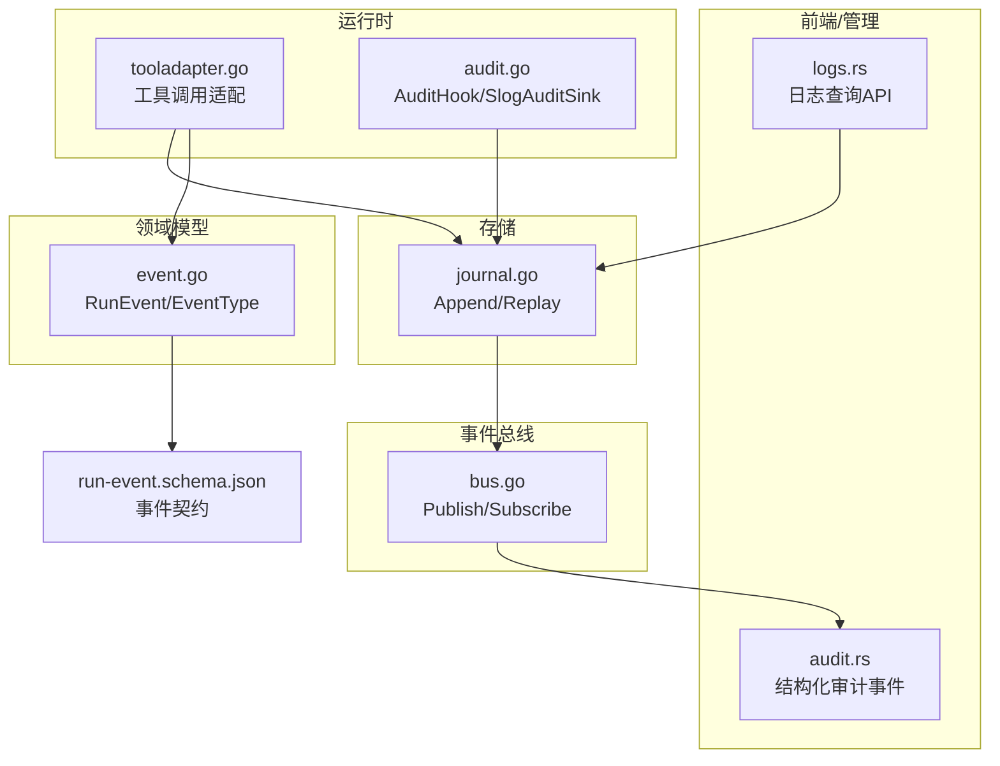
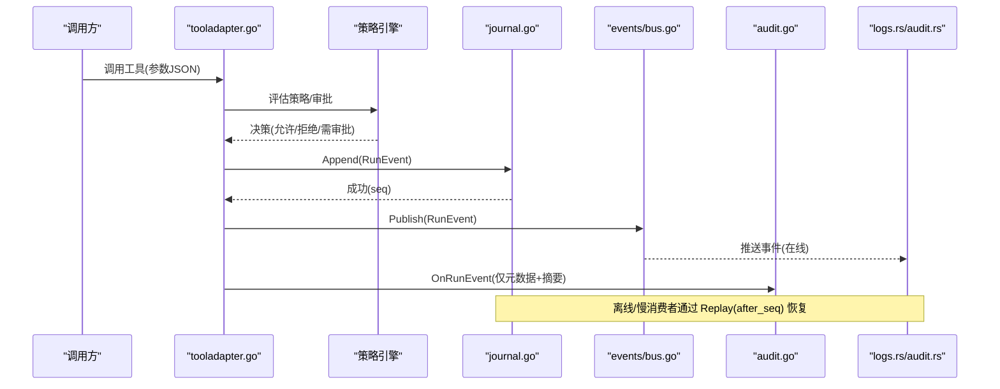
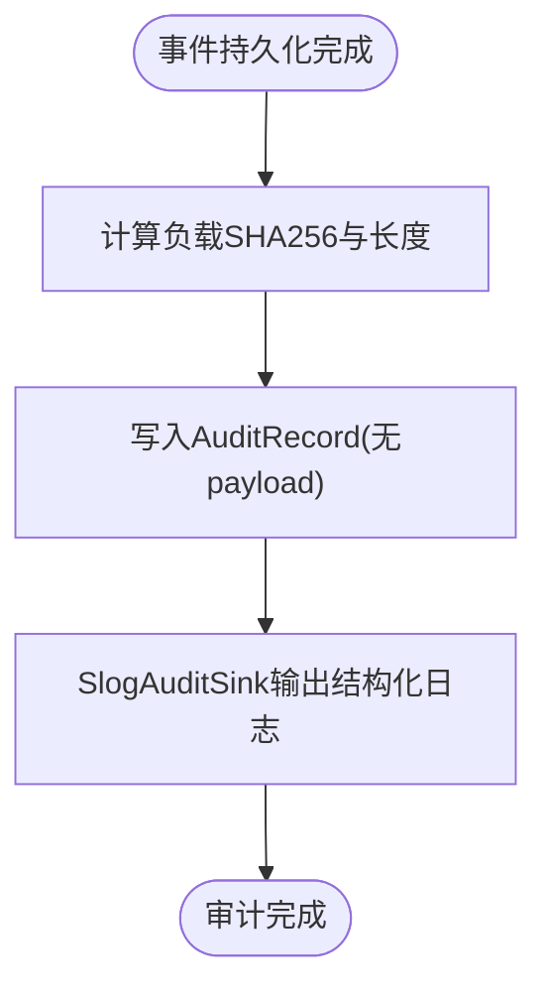
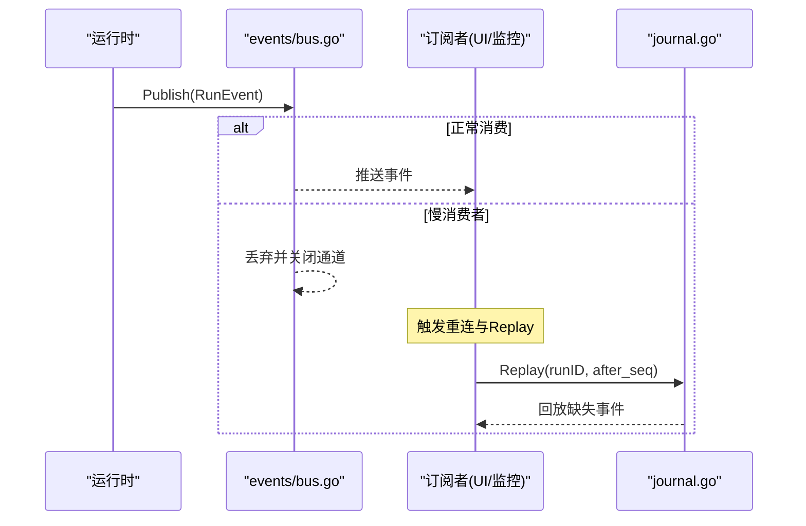
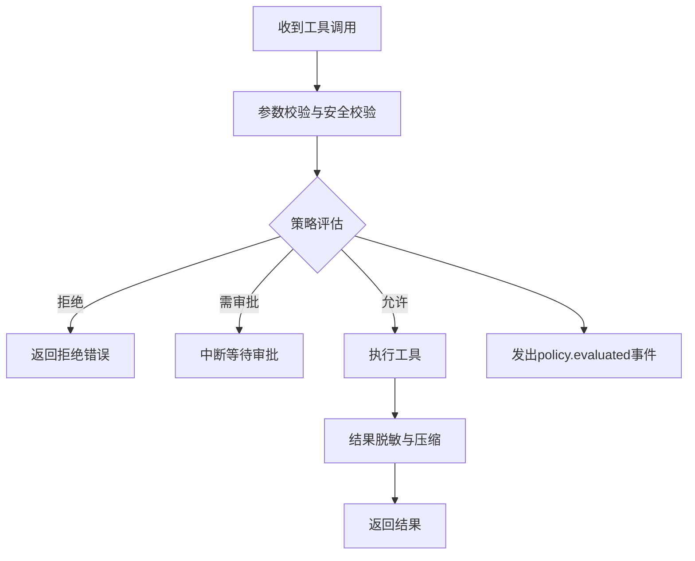
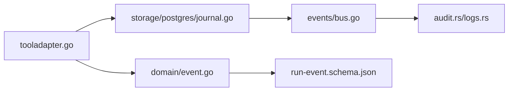

# 审计日志系统

<cite>
**本文引用的文件**
- [internal/runtime/audit.go](file://internal/runtime/audit.go)
- [internal/events/bus.go](file://internal/events/bus.go)
- [internal/domain/event.go](file://internal/domain/event.go)
- [internal/storage/postgres/journal.go](file://internal/storage/postgres/journal.go)
- [schemas/events/run-event.schema.json](file://schemas/events/run-event.schema.json)
- [internal/runtime/tooladapter.go](file://internal/runtime/tooladapter.go)
- [docs/secret-redaction-audit.md](file://docs/secret-redaction-audit.md)
- [ui/agent-diva-source/agent-diva-core/src/audit.rs](file://ui/agent-diva-source/agent-diva-core/src/audit.rs)
- [ui/agent-diva-source/agent-diva-manager/src/handlers/logs.rs](file://ui/agent-diva-source/agent-diva-manager/src/handlers/logs.rs)
</cite>

## 目录
1. [简介](#简介)
2. [项目结构](#项目结构)
3. [核心组件](#核心组件)
4. [架构总览](#架构总览)
5. [详细组件分析](#详细组件分析)
6. [依赖关系分析](#依赖关系分析)
7. [性能与可靠性](#性能与可靠性)
8. [故障排查指南](#故障排查指南)
9. [结论](#结论)
10. [附录：事件类型与合规报告](#附录事件类型与合规报告)

## 简介
本文件面向“审计日志系统”，覆盖以下目标：
- 操作审计机制：用户操作记录、工具调用追踪、状态变更日志。
- 安全事件记录：违规检测、异常行为标记、威胁告警。
- 合规报告生成：审计报表导出、合规性检查、审计报告格式。
- 事件总线架构：发布订阅、断线重连、事件回放。
- 日志脱敏：确保敏感信息不泄露到审计日志中。
- 审计分析方法：日志查询、趋势分析、异常检测。

本仓库采用“持久化事件即事实”的设计：所有关键运行事件以 RunEvent 形式写入 Journal（SQLite/Postgres），并通过内存事件总线向在线消费者广播；审计钩子仅记录元数据摘要，避免将完整负载或敏感信息落盘。

## 项目结构
围绕审计的关键代码分布在如下位置：
- internal/runtime：运行时审计钩子、工具调用适配与策略评估事件发射。
- internal/events：内存事件总线，负责按 runID 分发事件并处理慢消费者。
- internal/domain：事件类型定义、RunEvent 结构与终态约束。
- internal/storage：Journal 后端实现（Postgres）提供 Append/Replay。
- schemas/events：RunEvent 的 JSON Schema 契约。
- ui/agent-diva-source：前端侧的安全审计事件与日志查询 API。
- docs：密钥脱敏审计说明文档。

图表来源
- [internal/runtime/tooladapter.go:78-183](file://internal/runtime/tooladapter.go#L78-L183)
- [internal/runtime/audit.go:12-62](file://internal/runtime/audit.go#L12-L62)
- [internal/domain/event.go:1-129](file://internal/domain/event.go#L1-L129)
- [internal/storage/postgres/journal.go:14-120](file://internal/storage/postgres/journal.go#L14-L120)
- [internal/events/bus.go:10-115](file://internal/events/bus.go#L10-L115)
- [schemas/events/run-event.schema.json:1-76](file://schemas/events/run-event.schema.json#L1-L76)

章节来源
- [internal/runtime/audit.go:12-62](file://internal/runtime/audit.go#L12-L62)
- [internal/events/bus.go:10-115](file://internal/events/bus.go#L10-L115)
- [internal/domain/event.go:1-129](file://internal/domain/event.go#L1-L129)
- [internal/storage/postgres/journal.go:14-120](file://internal/storage/postgres/journal.go#L14-L120)
- [schemas/events/run-event.schema.json:1-76](file://schemas/events/run-event.schema.json#L1-L76)

## 核心组件
- 审计记录与钩子
  - AuditRecord：仅包含 RunID、Seq、Type、时间戳、负载大小与 SHA256 摘要，不包含实际负载内容，避免泄露敏感信息。
  - AuditHook：在事件已持久化且可见后，记录上述元数据。
  - SlogAuditSink：将审计元数据输出为结构化日志，便于外部采集。
- 事件总线
  - Bus：按 runID 维护订阅者集合，支持 Publish/Subscribe；对慢消费者直接丢弃并关闭通道，后续通过 Journal Replay 恢复。
- 事件模型与契约
  - RunEvent：包含 run_id、seq、type、created_at、payload_version、payload。
  - EventType：统一的事件词汇表，含运行生命周期、工具调用、策略评估、用户交互等。
  - run-event.schema.json：对外契约，保证 UI/RPC/运行时一致。
- 存储与回放
  - Postgres Journal：Append 时强制“每个 Run 恰好一个终态事件”的不变式；Replay 支持 after_seq 游标增量回放。
- 工具调用与策略评估
  - tooladapter：在执行前进行参数校验、策略评估、审批门控；通过后执行工具，并对结果进行脱敏与压缩。
  - 策略评估事件：policy.evaluated 会作为 RunEvent 发出，用于审计与合规。
- 前端审计与日志查询
  - audit.rs：定义结构化审计事件、严重级别、PII 检测等级等。
  - logs.rs：提供 /api/logs 查询接口，支持范围、游标分页、事件类型过滤。

章节来源
- [internal/runtime/audit.go:12-62](file://internal/runtime/audit.go#L12-L62)
- [internal/events/bus.go:10-115](file://internal/events/bus.go#L10-L115)
- [internal/domain/event.go:1-129](file://internal/domain/event.go#L1-L129)
- [internal/storage/postgres/journal.go:14-120](file://internal/storage/postgres/journal.go#L14-L120)
- [internal/runtime/tooladapter.go:78-183](file://internal/runtime/tooladapter.go#L78-L183)
- [schemas/events/run-event.schema.json:1-76](file://schemas/events/run-event.schema.json#L1-L76)
- [ui/agent-diva-source/agent-diva-core/src/audit.rs:1-31](file://ui/agent-diva-source/agent-diva-core/src/audit.rs#L1-L31)
- [ui/agent-diva-source/agent-diva-manager/src/handlers/logs.rs:254-297](file://ui/agent-diva-source/agent-diva-manager/src/handlers/logs.rs#L254-L297)

## 架构总览
审计日志系统遵循“持久化优先、在线广播为辅”的原则：
- 所有关键事件先写入 Journal（SQLite/Postgres），保证可回放与不可丢失。
- 内存事件总线将事件分发给在线订阅者（如 UI、监控），若订阅者落后则被丢弃，后续通过 Replay 从最后 seq 恢复。
- 审计钩子在事件持久化后记录元数据摘要，避免将完整负载或敏感信息写入审计日志。
- 工具调用路径集成策略评估与审批门控，并将 policy.evaluated 事件纳入审计。

图表来源
- [internal/runtime/tooladapter.go:78-183](file://internal/runtime/tooladapter.go#L78-L183)
- [internal/storage/postgres/journal.go:14-120](file://internal/storage/postgres/journal.go#L14-L120)
- [internal/events/bus.go:42-105](file://internal/events/bus.go#L42-L105)
- [internal/runtime/audit.go:35-62](file://internal/runtime/audit.go#L35-L62)

## 详细组件分析

### 审计记录与脱敏
- AuditRecord 仅记录 RunID、Seq、Type、CreatedAt、PayloadBytes、PayloadSHA256，不记录 payload 原文，从而避免敏感信息泄露。
- SlogAuditSink 将审计元数据输出为标准日志，便于集中采集与分析。
- 测试用例验证了审计记录不包含敏感字符串，仅保留摘要。

图表来源
- [internal/runtime/audit.go:12-62](file://internal/runtime/audit.go#L12-L62)

章节来源
- [internal/runtime/audit.go:12-62](file://internal/runtime/audit.go#L12-L62)
- [docs/secret-redaction-audit.md:1-76](file://docs/secret-redaction-audit.md#L1-L76)

### 事件总线：发布订阅与回放
- Bus 按 runID 维护订阅者，Publish 时将事件推送到各订阅通道；遇到终端事件则关闭并清理订阅。
- 若订阅者消费过慢导致通道阻塞，将被丢弃并关闭；后续通过 Journal Replay 从 last seen seq 恢复，保证不丢事件。
- Subscribe 返回 cancel 函数用于注销订阅。

图表来源
- [internal/events/bus.go:42-105](file://internal/events/bus.go#L42-L105)
- [internal/storage/postgres/journal.go:81-120](file://internal/storage/postgres/journal.go#L81-L120)

章节来源
- [internal/events/bus.go:10-115](file://internal/events/bus.go#L10-L115)
- [internal/storage/postgres/journal.go:81-120](file://internal/storage/postgres/journal.go#L81-L120)

### 工具调用追踪与策略评估
- tooladapter 在执行工具前进行参数校验与安全校验，随后进行策略评估；根据决策可能中断等待审批。
- 策略评估结果以 policy.evaluated 事件发出，进入审计流。
- 工具执行完成后，结果经过脱敏与压缩再返回给上层，避免大结果与敏感信息泄露。

图表来源
- [internal/runtime/tooladapter.go:78-183](file://internal/runtime/tooladapter.go#L78-L183)

章节来源
- [internal/runtime/tooladapter.go:78-183](file://internal/runtime/tooladapter.go#L78-L183)

### 安全事件记录：违规检测、异常行为标记、威胁告警
- 前端侧定义了结构化审计事件、严重级别（Low/Medium/High/Critical）、PII 检测等级（Warning/Error）。
- 安全检测模块可对注入攻击、指令冲突、工具输出可疑等进行判定，并产出 SecurityFinding，附带上下文（source_type、workspace_id、run_id、channel_id、tool_name）。
- 这些安全事件可通过日志查询 API 获取，用于威胁告警与异常行为标记。

章节来源
- [ui/agent-diva-source/agent-diva-core/src/audit.rs:1-31](file://ui/agent-diva-source/agent-diva-core/src/audit.rs#L1-L31)
- [ui/agent-diva-source/agent-diva-manager/src/handlers/logs.rs:254-297](file://ui/agent-diva-source/agent-diva-manager/src/handlers/logs.rs#L254-L297)

### 合规报告生成：审计报表导出、合规性检查、审计报告格式
- 事件契约由 schemas/events/run-event.schema.json 定义，确保跨组件一致性。
- 审计报表可由日志查询 API 拉取事件并按时间范围、事件类型过滤，结合业务规则生成合规性检查与报告。
- 报告可包含事件统计、违规计数、工具调用分布、策略评估结果等指标。

章节来源
- [schemas/events/run-event.schema.json:1-76](file://schemas/events/run-event.schema.json#L1-L76)
- [ui/agent-diva-source/agent-diva-manager/src/handlers/logs.rs:254-297](file://ui/agent-diva-source/agent-diva-manager/src/handlers/logs.rs#L254-L297)

## 依赖关系分析
- 运行时依赖 domain 事件模型与 storage Journal，通过 tooladapter 将策略评估与工具调用纳入审计。
- 事件总线依赖 domain.RunEvent，作为轻量级优化层，不拥有历史。
- 存储后端（Postgres）实现 Append/Replay，保障事件顺序与终态唯一性。
- 前端审计与日志查询依赖事件契约与日志 API。

图表来源
- [internal/runtime/tooladapter.go:78-183](file://internal/runtime/tooladapter.go#L78-L183)
- [internal/domain/event.go:1-129](file://internal/domain/event.go#L1-L129)
- [internal/storage/postgres/journal.go:14-120](file://internal/storage/postgres/journal.go#L14-L120)
- [internal/events/bus.go:10-115](file://internal/events/bus.go#L10-L115)
- [schemas/events/run-event.schema.json:1-76](file://schemas/events/run-event.schema.json#L1-L76)

章节来源
- [internal/runtime/tooladapter.go:78-183](file://internal/runtime/tooladapter.go#L78-L183)
- [internal/domain/event.go:1-129](file://internal/domain/event.go#L1-L129)
- [internal/storage/postgres/journal.go:14-120](file://internal/storage/postgres/journal.go#L14-L120)
- [internal/events/bus.go:10-115](file://internal/events/bus.go#L10-L115)
- [schemas/events/run-event.schema.json:1-76](file://schemas/events/run-event.schema.json#L1-L76)

## 性能与可靠性
- 事件总线使用有界缓冲，避免慢消费者阻塞生产端；超时则丢弃并关闭通道，降低背压风险。
- Journal Append 使用事务与行级锁，保证同一 run 的并发安全与终态唯一性。
- 审计钩子仅记录元数据摘要，减少 IO 与存储压力。
- 工具结果压缩与脱敏控制输出体积与敏感度，提升传输与展示效率。

[本节为通用指导，无需特定文件引用]

## 故障排查指南
- 订阅者掉线或丢事件
  - 现象：订阅通道关闭，未收到后续事件。
  - 原因：订阅者消费过慢被丢弃。
  - 处理：重新订阅并从 last seen seq 开始 Replay。
- 终态事件重复或冲突
  - 现象：Append 失败或报错。
  - 原因：违反“每个 Run 恰好一个终态事件”的不变式。
  - 处理：检查业务逻辑，确保仅在一次终态后停止追加。
- 审计日志缺失敏感字段
  - 现象：审计日志中没有 payload 原文。
  - 原因：设计如此，仅记录摘要。
  - 处理：如需定位问题，结合 RunEvent 回放与上游链路日志。

章节来源
- [internal/events/bus.go:42-105](file://internal/events/bus.go#L42-L105)
- [internal/storage/postgres/journal.go:14-79](file://internal/storage/postgres/journal.go#L14-L79)
- [internal/runtime/audit.go:12-62](file://internal/runtime/audit.go#L12-L62)

## 结论
本审计日志系统以“持久化事件 + 内存总线 + 审计钩子”为核心，实现了：
- 操作审计：工具调用、策略评估、用户交互等关键步骤均产生可审计事件。
- 安全事件：前端侧具备注入检测、PII 识别与严重级别分类，支持告警与异常标记。
- 合规报告：基于统一事件契约与日志查询 API，可导出审计报表并进行合规性检查。
- 事件总线：发布订阅模式配合 Journal Replay，保证可靠与可扩展。
- 日志脱敏：审计记录仅含摘要，避免敏感信息泄露。

[本节为总结，无需特定文件引用]

## 附录：事件类型与合规报告
- 事件类型涵盖运行生命周期、提供者重试/停滞、模型请求/增量/用量/完成、工具请求/审批/开始/结束、策略评估、钩子、用户问答、子任务等。
- 合规报告建议包含：
  - 事件统计：按类型、时间范围聚合。
  - 违规计数：policy.evaluated 拒绝次数、工具审批拒绝次数。
  - 工具调用分布：热门工具、调用耗时、失败率。
  - 安全事件：注入检测、PII 命中、严重级别分布。
  - 趋势分析：日/周/月维度变化，异常峰值预警。

章节来源
- [internal/domain/event.go:8-81](file://internal/domain/event.go#L8-L81)
- [schemas/events/run-event.schema.json:18-56](file://schemas/events/run-event.schema.json#L18-L56)
- [ui/agent-diva-source/agent-diva-manager/src/handlers/logs.rs:254-297](file://ui/agent-diva-source/agent-diva-manager/src/handlers/logs.rs#L254-L297)