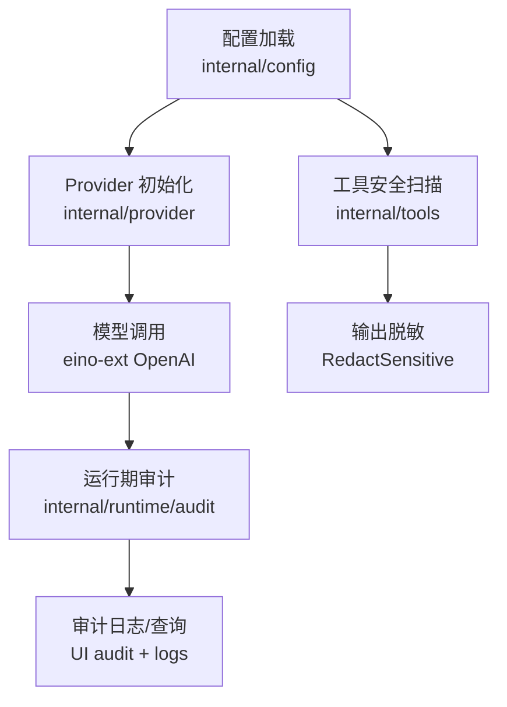
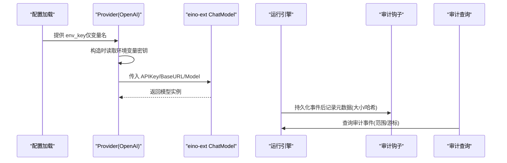
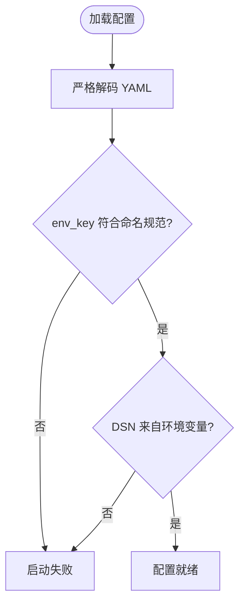
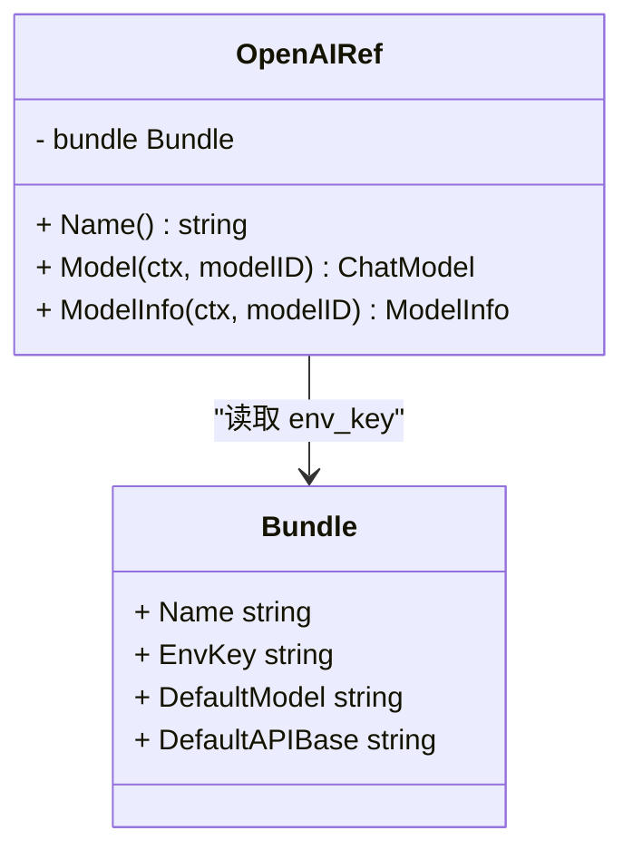
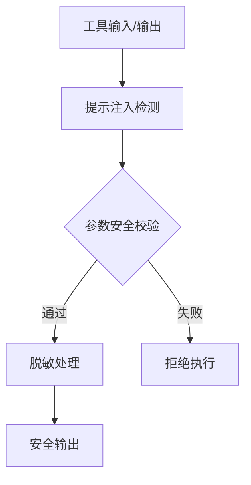
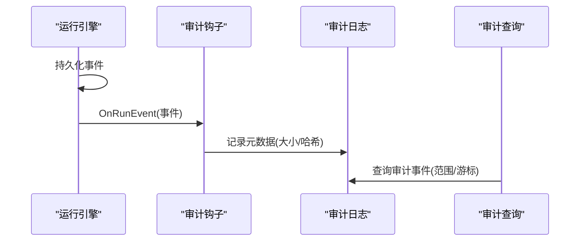
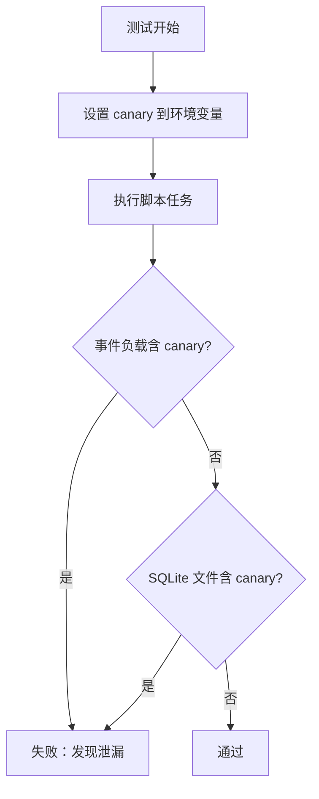
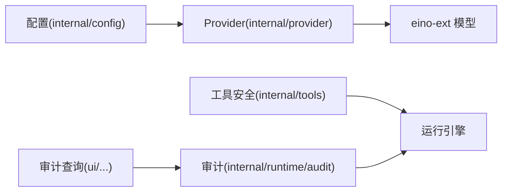

# 密钥管理与敏感信息保护

<cite>
**本文引用的文件**
- [config.go](file://internal/config/config.go)
- [openai.go](file://internal/provider/openai.go)
- [secret_audit_test.go](file://internal/provider/secret_audit_test.go)
- [secret_leak_test.go](file://internal/runtime/secret_leak_test.go)
- [audit.go](file://internal/runtime/audit.go)
- [security.go](file://internal/tools/security.go)
- [secret-redaction-audit.md](file://docs/secret-redaction-audit.md)
- [config.example.yaml](file://config.example.yaml)
- [audit.rs](file://ui/agent-diva-source/agent-diva-core/src/audit.rs)
- [logs.rs](file://ui/agent-diva-source/agent-diva-manager/src/handlers/logs.rs)
</cite>

## 目录
1. [简介](#简介)
2. [项目结构](#项目结构)
3. [核心组件](#核心组件)
4. [架构总览](#架构总览)
5. [详细组件分析](#详细组件分析)
6. [依赖关系分析](#依赖关系分析)
7. [性能考虑](#性能考虑)
8. [故障排查指南](#故障排查指南)
9. [结论](#结论)
10. [附录](#附录)

## 简介
本文件聚焦于 Vivy 的密钥管理与敏感信息保护，围绕“密钥不落地、读取边界收敛、输出脱敏、审计可追踪”的原则展开。内容覆盖：
- 密钥存储机制：环境变量引用、配置文件仅保存变量名、运行时按需注入。
- 敏感信息脱敏：API 密钥识别、邮箱过滤、令牌模式匹配与替换。
- 配置安全管理：配置项分类、访问权限控制、变更审计跟踪。
- 数据保护策略：传输加密（HTTPS）、存储加密（外部数据库/文件系统策略）、内存清理（按请求生命周期）。
- 密钥轮换机制：通过环境变量更新实现自动/手动轮换与版本兼容。
- 安全最佳实践：最小权限、定期审计、应急响应流程。

## 项目结构
Vivy 将密钥与敏感信息的处理集中在少数边界位置：
- 配置层：仅保存非敏感配置与“环境变量名称”，拒绝在配置中写入真实密钥。
- Provider 层：唯一允许读取密钥的环境变量入口，并在调用第三方模型时一次性使用。
- 工具与安全层：对输入/输出进行提示注入检测、命令参数安全校验、结果脱敏。
- 运行期审计：记录事件元数据（大小与哈希），避免日志成为第二份明文副本。
- UI 侧：审计事件查询接口与结构化告警级别定义。

**图示来源**
- [config.go:51-108](file://internal/config/config.go#L51-L108)
- [openai.go:61-78](file://internal/provider/openai.go#L61-L78)
- [security.go:25-79](file://internal/tools/security.go#L25-L79)
- [audit.go:12-62](file://internal/runtime/audit.go#L12-L62)
- [logs.rs:254-297](file://ui/agent-diva-source/agent-diva-manager/src/handlers/logs.rs#L254-L297)

**章节来源**
- [config.go:1-13](file://internal/config/config.go#L1-L13)
- [config.example.yaml:1-35](file://config.example.yaml#L1-L35)

## 核心组件
- 配置边界（Config）：严格解码 YAML，未知字段报错；Provider 仅以 env_key 引用环境变量名，禁止直接写入密钥。
- Provider 读取边界（OpenAI Ref）：仅在 Model() 构造时从环境变量读取密钥，不缓存、不持久化。
- 工具安全（Tools Security）：提示注入信号检测、命令/路径参数白名单与危险语法拦截、结果脱敏。
- 运行期审计（Audit）：对每个持久化事件记录元数据（类型、字节数、SHA-256），避免日志泄露。
- 审计与日志查询（UI）：提供结构化审计事件查询接口，支持范围、游标与统计。

**章节来源**
- [config.go:31-108](file://internal/config/config.go#L31-L108)
- [openai.go:14-78](file://internal/provider/openai.go#L14-L78)
- [security.go:12-79](file://internal/tools/security.go#L12-L79)
- [audit.go:12-62](file://internal/runtime/audit.go#L12-L62)
- [logs.rs:254-297](file://ui/agent-diva-source/agent-diva-manager/src/handlers/logs.rs#L254-L297)

## 架构总览
下图展示密钥从环境变量到模型调用的完整链路，以及审计与脱敏的旁路保障。

**图示来源**
- [config.go:102-108](file://internal/config/config.go#L102-L108)
- [openai.go:61-78](file://internal/provider/openai.go#L61-L78)
- [audit.go:35-62](file://internal/runtime/audit.go#L35-L62)
- [logs.rs:254-297](file://ui/agent-diva-source/agent-diva-manager/src/handlers/logs.rs#L254-L297)

## 详细组件分析

### 配置层：环境变量引用与严格校验
- 配置只保存环境变量名称（如 OPENAI_API_KEY、ANTHROPIC_API_KEY），并通过正则强制命名规范，拒绝任何字面量密钥。
- 对 Postgres DSN 同样采用 dsn_env 方式，不在配置中出现连接串。
- 启动时严格解码 YAML，未知字段直接失败，防止密钥通过隐藏字段进入系统。

**图示来源**
- [config.go:31-33](file://internal/config/config.go#L31-L33)
- [config.go:85-108](file://internal/config/config.go#L85-L108)
- [config.go:316-336](file://internal/config/config.go#L316-L336)
- [config.go:338-382](file://internal/config/config.go#L338-L382)

**章节来源**
- [config.go:1-13](file://internal/config/config.go#L1-L13)
- [config.go:31-33](file://internal/config/config.go#L31-L33)
- [config.go:85-108](file://internal/config/config.go#L85-L108)
- [config.go:316-382](file://internal/config/config.go#L316-L382)
- [config.example.yaml:13-35](file://config.example.yaml#L13-L35)

### Provider 层：运行时注入与最小暴露
- 唯一允许读取密钥的位置在 internal/provider；其他位置若读取 KEY/SECRET/TOKEN 类环境变量即视为违规。
- OpenAI Provider 在 Model() 构造时读取密钥，立即用于创建 ChatModel，之后不再持有或持久化。
- BaseURL 可通过环境变量覆盖，便于对接兼容网关，且不涉及密钥。

**图示来源**
- [openai.go:14-78](file://internal/provider/openai.go#L14-L78)

**章节来源**
- [openai.go:14-78](file://internal/provider/openai.go#L14-L78)
- [secret_audit_test.go:60-77](file://internal/provider/secret_audit_test.go#L60-L77)

### 工具安全：提示注入、参数校验与输出脱敏
- 提示注入检测：识别指令覆盖语言，向预检/UI/审计发出信号。
- 参数安全：对 path/filepath/command/cmd 等字段进行 NUL、命令拼接、路径穿越等检查。
- 输出脱敏：对常见密钥形式与邮箱地址进行替换，避免进入模型上下文或持久化负载。

**图示来源**
- [security.go:25-79](file://internal/tools/security.go#L25-L79)

**章节来源**
- [security.go:12-79](file://internal/tools/security.go#L12-L79)

### 运行期审计：事件元数据与不可见性
- 对每个持久化事件记录 RunID、Seq、Type、CreatedAt、PayloadBytes、PayloadSHA256。
- 审计 Sink 为附加能力，不影响主流程；Slog 输出仅包含稳定元数据，不包含实际负载。
- 结合 UI 的审计查询接口，可按时间范围、事件类型、游标分页检索。

**图示来源**
- [audit.go:12-62](file://internal/runtime/audit.go#L12-L62)
- [logs.rs:254-297](file://ui/agent-diva-source/agent-diva-manager/src/handlers/logs.rs#L254-L297)

**章节来源**
- [audit.go:12-62](file://internal/runtime/audit.go#L12-L62)
- [logs.rs:254-297](file://ui/agent-diva-source/agent-diva-manager/src/handlers/logs.rs#L254-L297)

### 端到端防泄漏验证
- 源码级审计：限制 os.Getenv 仅能在 internal/provider 读取密钥相关变量；生产代码禁止硬编码密钥字面量。
- 运行时断言：设置 canary 密钥到环境变量，执行完整脚本任务，断言 SQLite 文件与所有持久化事件均不包含该 canary。
- 错误消息安全：缺失密钥的错误仅包含变量名，绝不携带值。

**图示来源**
- [secret_leak_test.go:17-88](file://internal/runtime/secret_leak_test.go#L17-L88)
- [secret_audit_test.go:60-111](file://internal/provider/secret_audit_test.go#L60-L111)

**章节来源**
- [secret_leak_test.go:17-88](file://internal/runtime/secret_leak_test.go#L17-L88)
- [secret_audit_test.go:60-111](file://internal/provider/secret_audit_test.go#L60-L111)
- [secret-redaction-audit.md:9-24](file://docs/secret-redaction-audit.md#L9-L24)

## 依赖关系分析
- 配置模块仅依赖标准库与 YAML 解析，不引入网络或密钥值。
- Provider 依赖 eino-ext 模型组件，但密钥仅在构造时透传，不跨包传播。
- 工具安全模块独立于 Provider，对任意工具输入输出做通用防护。
- 审计模块解耦于业务流，仅记录元数据，降低耦合与泄露风险。

**图示来源**
- [config.go:51-108](file://internal/config/config.go#L51-L108)
- [openai.go:61-78](file://internal/provider/openai.go#L61-L78)
- [security.go:25-79](file://internal/tools/security.go#L25-L79)
- [audit.go:12-62](file://internal/runtime/audit.go#L12-L62)

**章节来源**
- [config.go:51-108](file://internal/config/config.go#L51-L108)
- [openai.go:61-78](file://internal/provider/openai.go#L61-L78)
- [security.go:25-79](file://internal/tools/security.go#L25-L79)
- [audit.go:12-62](file://internal/runtime/audit.go#L12-L62)

## 性能考虑
- 密钥读取仅在首次构造模型时发生，避免重复 I/O。
- 脱敏与安全检查基于正则与轻量字符串操作，开销可控。
- 审计仅记录元数据（大小与哈希），避免大对象序列化与额外 I/O。
- 配置严格解码在启动阶段完成，运行时零负担。

[本节为通用指导，无需特定文件来源]

## 故障排查指南
- 启动失败：检查配置中的 server.addr、storage.backend、providers.active、bundle_dir 等必填项；确认 env_key 符合命名规范。
- 密钥缺失：确认环境变量已设置对应键名；错误消息仅显示变量名，不含值。
- 审计无事件：确认审计 Sink 已接入；检查日志目标是否过滤了 target="audit"。
- 脱敏未生效：检查工具输出是否经过 RedactSensitive；确认正则匹配范围是否符合预期。

**章节来源**
- [config.go:338-382](file://internal/config/config.go#L338-L382)
- [openai.go:61-78](file://internal/provider/openai.go#L61-L78)
- [audit.go:35-62](file://internal/runtime/audit.go#L35-L62)
- [security.go:73-79](file://internal/tools/security.go#L73-L79)

## 结论
本项目通过“配置仅存变量名、Provider 唯一读取密钥、工具输出统一脱敏、审计仅记录元数据”的分层设计，实现了密钥不落地、读取边界收敛、输出可观测且安全的闭环。配合严格的源码级审计与运行时断言，有效降低了密钥泄露风险，并为运维与合规提供了可追溯依据。

[本节为总结，无需特定文件来源]

## 附录

### 密钥存储机制
- 环境变量引用：Provider 在构造时读取环境变量，不缓存、不持久化。
- 配置文件加密：当前实现不直接支持配置加密；建议通过部署平台注入环境变量或外部密钥管理服务。
- 运行时注入：BaseURL 可通过环境变量覆盖，便于多环境切换。

**章节来源**
- [openai.go:27-40](file://internal/provider/openai.go#L27-L40)
- [config.example.yaml:23-35](file://config.example.yaml#L23-L35)

### 敏感信息脱敏
- API 密钥识别：匹配 sk-/pk- 前缀及 Bearer 令牌模式。
- 邮箱地址过滤：识别并替换常见邮箱格式。
- 令牌模式匹配：对常见令牌片段进行替换，避免进入模型上下文或持久化负载。

**章节来源**
- [security.go:19-23](file://internal/tools/security.go#L19-L23)
- [security.go:73-79](file://internal/tools/security.go#L73-L79)

### 配置安全管理
- 配置项分类：server、storage、providers、runtime、tools、governance。
- 访问权限控制：server.allowed_origins 限制同源访问；sandbox 控制工具执行与网络访问。
- 变更审计跟踪：通过审计钩子记录事件元数据，结合 UI 查询接口进行回溯。

**章节来源**
- [config.go:51-153](file://internal/config/config.go#L51-L153)
- [audit.go:12-62](file://internal/runtime/audit.go#L12-L62)
- [logs.rs:254-297](file://ui/agent-diva-source/agent-diva-manager/src/handlers/logs.rs#L254-L297)

### 数据保护策略
- 传输加密：建议使用 HTTPS 访问外部服务；服务端监听地址与来源限制由配置管理。
- 存储加密：SQLite 默认本地文件；Postgres 可通过数据库层加密或磁盘加密策略实现。
- 内存清理：密钥仅在构造模型时使用，不缓存；审计仅记录元数据，避免长期驻留。

**章节来源**
- [config.go:61-68](file://internal/config/config.go#L61-L68)
- [audit.go:12-62](file://internal/runtime/audit.go#L12-L62)

### 密钥轮换机制
- 自动轮换：通过外部密钥管理服务动态更新环境变量，应用重启或下次构造模型时生效。
- 手动更新：直接修改环境变量并重启服务；确保新密钥正确设置。
- 版本兼容性：Provider 仅依赖 env_key 名称，更换密钥值不影响配置结构。

**章节来源**
- [openai.go:61-78](file://internal/provider/openai.go#L61-L78)
- [config.go:102-108](file://internal/config/config.go#L102-L108)

### 安全最佳实践
- 最小权限原则：仅允许 internal/provider 读取密钥；工具参数严格白名单。
- 定期审计：利用源码级审计与运行时断言，持续验证密钥不落地。
- 应急响应：发现泄露时立即轮换密钥、审查审计事件、定位泄露点并修复。

**章节来源**
- [secret_audit_test.go:60-111](file://internal/provider/secret_audit_test.go#L60-L111)
- [secret_leak_test.go:17-88](file://internal/runtime/secret_leak_test.go#L17-L88)
- [audit.rs:15-31](file://ui/agent-diva-source/agent-diva-core/src/audit.rs#L15-L31)