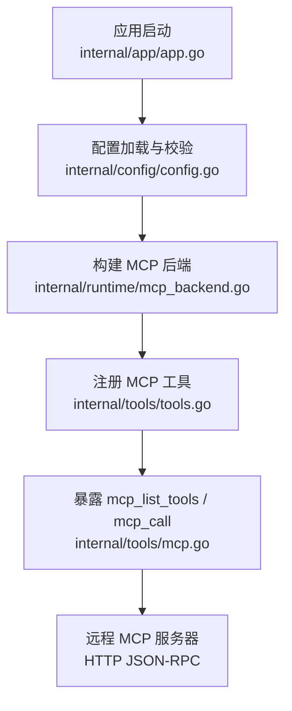
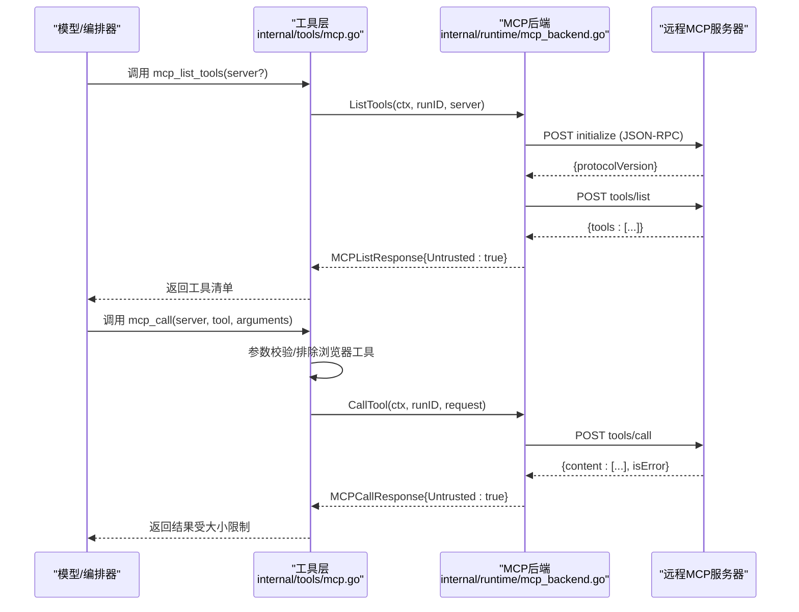
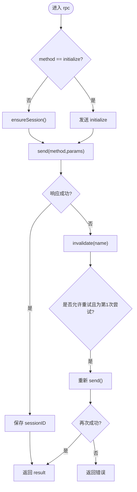
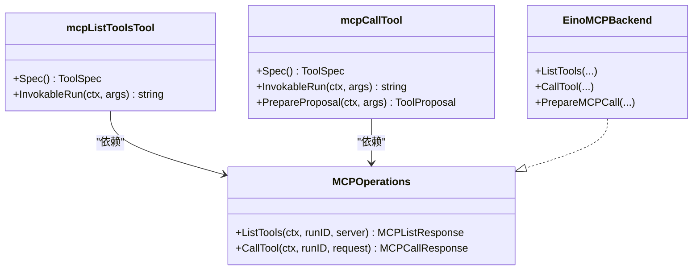
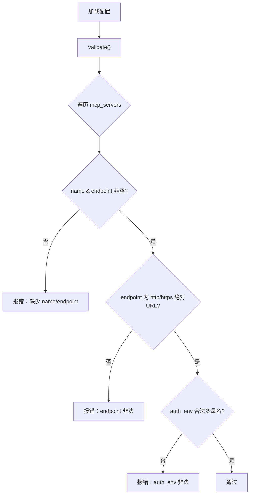
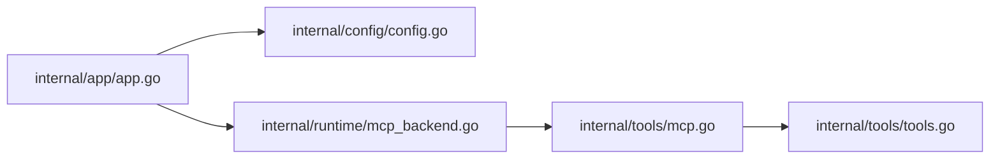

# MCP工具集成

<cite>
**本文引用的文件**
- [internal/runtime/mcp_backend.go](file://internal/runtime/mcp_backend.go)
- [internal/tools/mcp.go](file://internal/tools/mcp.go)
- [internal/tools/tools.go](file://internal/tools/tools.go)
- [internal/config/config.go](file://internal/config/config.go)
- [config.example.yaml](file://config.example.yaml)
- [internal/app/app.go](file://internal/app/app.go)
</cite>

## 目录
1. [简介](#简介)
2. [项目结构](#项目结构)
3. [核心组件](#核心组件)
4. [架构总览](#架构总览)
5. [详细组件分析](#详细组件分析)
6. [依赖关系分析](#依赖关系分析)
7. [性能与安全](#性能与安全)
8. [故障排查](#故障排查)
9. [结论](#结论)
10. [附录：使用示例与最佳实践](#附录使用示例与最佳实践)

## 简介
本文件面向在 Vivy Agent 运行时中集成 Model Context Protocol（MCP）的开发者与运维人员，系统性说明以下主题：
- MCP协议实现、工具发现与调用机制
- MCP服务器配置、工具注册、消息格式
- MCP客户端实现、连接与会话管理、错误处理
- 安全策略、权限控制、性能优化
- 与外部系统集成的模式与最佳实践

Vivy 通过内置工具暴露 mcp_list_tools 与 mcp_call 两个能力，将远程 MCP 服务作为“不可信”的工具源接入运行时的审批与治理体系。

## 项目结构
围绕 MCP 的关键代码分布在以下位置：
- internal/runtime/mcp_backend.go：MCP 客户端后端，负责 JSON-RPC over HTTP 通信、会话初始化、重试与大小限制
- internal/tools/mcp.go：MCP 工具定义与参数校验、提案生成（用于审批流程）
- internal/tools/tools.go：工具注册与选择逻辑，将 MCP 工具纳入统一工具集
- internal/config/config.go：MCP 服务器配置项与校验规则
- config.example.yaml：示例配置，展示如何声明 mcp_servers
- internal/app/app.go：应用启动时装配 MCP 后端并注入工具链

**图表来源**
- [internal/app/app.go:183-190](file://internal/app/app.go#L183-L190)
- [internal/config/config.go:147-159](file://internal/config/config.go#L147-L159)
- [internal/runtime/mcp_backend.go:52-64](file://internal/runtime/mcp_backend.go#L52-L64)
- [internal/tools/tools.go:282-316](file://internal/tools/tools.go#L282-L316)
- [internal/tools/mcp.go:62-87](file://internal/tools/mcp.go#L62-L87)

**章节来源**
- [internal/app/app.go:183-190](file://internal/app/app.go#L183-L190)
- [internal/config/config.go:147-159](file://internal/config/config.go#L147-L159)
- [internal/runtime/mcp_backend.go:52-64](file://internal/runtime/mcp_backend.go#L52-L64)
- [internal/tools/tools.go:282-316](file://internal/tools/tools.go#L282-L316)
- [internal/tools/mcp.go:62-87](file://internal/tools/mcp.go#L62-L87)

## 核心组件
- MCP 后端（EinoMCPBackend）
  - 维护已配置的 MCP 服务器列表与会话状态
  - 实现 ListTools/CallTool/PrepareMCPCall 接口
  - 负责 initialize、tools/list、tools/call 等 JSON-RPC 方法调用
  - 支持会话复用、失败失效与一次重试
  - 对响应体与内容长度进行严格限制
- MCP 工具（mcp_list_tools、mcp_call）
  - 提供工具清单查询与远程工具调用入口
  - 对 mcp_call 强制要求审批（不可信远端副作用）
  - 参数校验与浏览器自动化工具排除
- 配置与校验
  - runtime.mcp_servers 数组，每项包含 name、endpoint、auth_env
  - endpoint 必须为绝对 HTTP(S) URL；auth_env 为环境变量名
- 工具注册
  - 通过 BuiltinWithCommands 将 MCP 工具加入工具集，并按 tools.enabled 启用

**章节来源**
- [internal/runtime/mcp_backend.go:26-50](file://internal/runtime/mcp_backend.go#L26-L50)
- [internal/tools/mcp.go:12-57](file://internal/tools/mcp.go#L12-L57)
- [internal/tools/tools.go:282-316](file://internal/tools/tools.go#L282-L316)
- [internal/config/config.go:147-159](file://internal/config/config.go#L147-L159)

## 架构总览
Vivy 以“工具即能力”的方式将远程 MCP 服务纳入执行流。模型在选择工具时，可看到来自不同服务器的工具元数据；实际调用会经过统一的参数校验、审批与审计。

**图表来源**
- [internal/tools/mcp.go:68-102](file://internal/tools/mcp.go#L68-L102)
- [internal/runtime/mcp_backend.go:65-152](file://internal/runtime/mcp_backend.go#L65-L152)
- [internal/runtime/mcp_backend.go:210-233](file://internal/runtime/mcp_backend.go#L210-L233)

## 详细组件分析

### MCP 后端（EinoMCPBackend）
职责与要点：
- 服务器配置与查找：按名称解析 MCPServerConfig，缺失或 endpoint 为空时报错
- 会话管理：首次调用 ensureSession 发送 initialize，保存 sessionID，后续请求携带 Mcp-Session-Id
- RPC 封装：统一构造 JSON-RPC 2.0 请求，设置超时、Content-Type、Accept，读取响应并限制大小
- 重试与失效：非 initialize 请求失败时失效会话并重试一次；initialize 失败直接报错
- 响应解析：tools/list 返回工具名、描述、输入 schema；tools/call 返回 content 列表与错误标志
- 安全边界：所有远端数据标记为 Untrusted；对响应体与内容长度施加上限

**图表来源**
- [internal/runtime/mcp_backend.go:184-208](file://internal/runtime/mcp_backend.go#L184-L208)
- [internal/runtime/mcp_backend.go:210-233](file://internal/runtime/mcp_backend.go#L210-L233)
- [internal/runtime/mcp_backend.go:235-298](file://internal/runtime/mcp_backend.go#L235-L298)

**章节来源**
- [internal/runtime/mcp_backend.go:26-64](file://internal/runtime/mcp_backend.go#L26-L64)
- [internal/runtime/mcp_backend.go:65-152](file://internal/runtime/mcp_backend.go#L65-L152)
- [internal/runtime/mcp_backend.go:184-298](file://internal/runtime/mcp_backend.go#L184-L298)

### MCP 工具（mcp_list_tools 与 mcp_call）
- mcp_list_tools
  - 只读工具，自动执行
  - 可选 server 参数，未指定则聚合所有已配置服务器
  - 返回工具清单，schema 来自远端，标记为不可信
- mcp_call
  - 效果型工具，始终需要审批
  - 参数校验：server、tool 必填；排除浏览器自动化工具名
  - 支持 PrepareProposal 提前生成审批预览（含目标 server/tool 与风险提示）

**图表来源**
- [internal/tools/mcp.go:50-113](file://internal/tools/mcp.go#L50-L113)
- [internal/runtime/mcp_backend.go:47-50](file://internal/runtime/mcp_backend.go#L47-L50)

**章节来源**
- [internal/tools/mcp.go:12-135](file://internal/tools/mcp.go#L12-L135)

### 配置与校验
- runtime.mcp_servers：数组，每项包含 name、endpoint、auth_env
- 校验规则：
  - name、endpoint 必填
  - endpoint 必须是绝对 HTTP(S) URL
  - auth_env 若存在，必须是合法环境变量名
- 默认工具启用列表包含 mcp_list_tools 与 mcp_call

**图表来源**
- [internal/config/config.go:433-444](file://internal/config/config.go#L433-L444)

**章节来源**
- [internal/config/config.go:147-159](file://internal/config/config.go#L147-L159)
- [internal/config/config.go:433-444](file://internal/config/config.go#L433-L444)
- [config.example.yaml:64-65](file://config.example.yaml#L64-L65)

### 工具注册与启用
- 通过 BuiltinWithCommands 组装工具集，当传入 mcpOps 时注册 mcp_list_tools 与 mcp_call
- Resolve 根据 tools.enabled 白名单启用工具，未知名称或禁用工具会报错
- 默认启用列表包含 mcp_list_tools 与 mcp_call

**章节来源**
- [internal/tools/tools.go:282-316](file://internal/tools/tools.go#L282-L316)
- [internal/tools/tools.go:343-361](file://internal/tools/tools.go#L343-L361)
- [internal/config/config.go:298-301](file://internal/config/config.go#L298-L301)

## 依赖关系分析
- internal/app/app.go 从配置中读取 runtime.MCPServers，构造 []MCPServerConfig，并创建 EinoMCPBackend
- EinoMCPBackend 实现 tools.MCPOperations，被 tools.BuiltinWithCommands 注册为 mcp_list_tools 与 mcp_call
- 工具层与后端解耦，便于替换或扩展其他 MCP 传输方式

**图表来源**
- [internal/app/app.go:183-190](file://internal/app/app.go#L183-L190)
- [internal/tools/tools.go:282-316](file://internal/tools/tools.go#L282-L316)
- [internal/runtime/mcp_backend.go:52-64](file://internal/runtime/mcp_backend.go#L52-L64)

**章节来源**
- [internal/app/app.go:183-190](file://internal/app/app.go#L183-L190)
- [internal/tools/tools.go:282-316](file://internal/tools/tools.go#L282-L316)

## 性能与安全

### 性能特性
- 超时控制：默认 MCP 请求超时为固定值，避免长尾阻塞
- 响应大小限制：整体响应与内容分别限制，防止内存膨胀
- 会话复用：同一服务器会话保持，减少重复握手开销
- 重试策略：非关键请求失败后失效会话并重试一次，提升鲁棒性

### 安全策略
- 不可信数据：所有远端工具与结果均标记为 Untrusted
- 审批门禁：mcp_call 为效果型工具，始终触发审批流程
- 参数校验：必填字段校验、类型校验、排除浏览器自动化工具名
- 认证头：通过环境变量注入 Authorization 头，密钥不持久化
- 配置校验：仅允许绝对 HTTP(S) URL，auth_env 必须为合法变量名

**章节来源**
- [internal/runtime/mcp_backend.go:20-24](file://internal/runtime/mcp_backend.go#L20-L24)
- [internal/runtime/mcp_backend.go:235-298](file://internal/runtime/mcp_backend.go#L235-L298)
- [internal/tools/mcp.go:115-135](file://internal/tools/mcp.go#L115-L135)
- [internal/config/config.go:433-444](file://internal/config/config.go#L433-L444)

## 故障排查
常见问题与定位建议：
- 服务器未配置或 endpoint 为空：检查 runtime.mcp_servers 配置与 Validate 错误信息
- HTTP 错误码：检查远端可达性与鉴权头是否正确注入
- 响应过大：确认远端输出是否受限，必要时调整服务端限制
- 会话失效：观察是否出现 invalidate 与重试日志，确认网络抖动或服务重启
- 工具被拒绝：确认 tools.enabled 包含 mcp_call，且已通过审批

**章节来源**
- [internal/runtime/mcp_backend.go:165-172](file://internal/runtime/mcp_backend.go#L165-L172)
- [internal/runtime/mcp_backend.go:263-298](file://internal/runtime/mcp_backend.go#L263-L298)
- [internal/tools/tools.go:343-361](file://internal/tools/tools.go#L343-L361)

## 结论
Vivy 将 MCP 作为“不可信”的外部能力接入，通过严格的配置校验、参数验证、审批流程与资源限制，确保远程工具调用的可控性与安全性。后端实现了稳定的会话管理与重试机制，并提供清晰的错误语义，便于在生产环境中稳定运行。

## 附录：使用示例与最佳实践

### 本地 MCP 服务
- 在配置文件中添加一个条目到 runtime.mcp_servers，指定 name 与 endpoint（http/https）
- 可选设置 auth_env，指向包含令牌的环境变量名
- 确保 tools.enabled 包含 mcp_list_tools 与 mcp_call
- 启动后，通过 mcp_list_tools 查看可用工具，再使用 mcp_call 调用

参考路径
- [config.example.yaml:64-65](file://config.example.yaml#L64-L65)
- [internal/config/config.go:147-159](file://internal/config/config.go#L147-L159)
- [internal/config/config.go:298-301](file://internal/config/config.go#L298-L301)

### 远程 MCP 集成
- endpoint 必须为绝对 HTTP(S) URL
- 如需鉴权，设置 auth_env，运行时会将对应环境变量值作为 Bearer Token 附加到请求头
- 注意网络策略与域名白名单（如适用），避免跨域或内网访问风险

参考路径
- [internal/config/config.go:433-444](file://internal/config/config.go#L433-L444)
- [internal/runtime/mcp_backend.go:258-262](file://internal/runtime/mcp_backend.go#L258-L262)

### 工具组合调用
- 先调用 mcp_list_tools(server="your_server") 获取工具清单与 schema
- 基于 schema 构造 mcp_call 的 arguments
- 对于有副作用的调用，准备审批预览（由 PrepareProposal 生成），并在 UI 或审批流中确认

参考路径
- [internal/tools/mcp.go:68-102](file://internal/tools/mcp.go#L68-L102)
- [internal/tools/mcp.go:103-113](file://internal/tools/mcp.go#L103-L113)

### 安全与权限
- 所有远端工具与结果视为不可信数据
- mcp_call 始终需要审批，避免自动执行远端副作用
- 仅允许配置绝对 HTTP(S) endpoint，auth_env 必须为合法环境变量名
- 可通过治理策略与沙箱策略进一步约束执行环境

参考路径
- [internal/tools/mcp.go:115-135](file://internal/tools/mcp.go#L115-L135)
- [internal/config/config.go:433-444](file://internal/config/config.go#L433-L444)

### 性能优化建议
- 合理设置远端工具的输出限制，避免大响应导致内存压力
- 利用会话复用减少握手开销
- 对高频工具调用考虑在服务端缓存或批处理
- 监控超时与重试次数，识别不稳定远端

参考路径
- [internal/runtime/mcp_backend.go:20-24](file://internal/runtime/mcp_backend.go#L20-L24)
- [internal/runtime/mcp_backend.go:184-208](file://internal/runtime/mcp_backend.go#L184-L208)