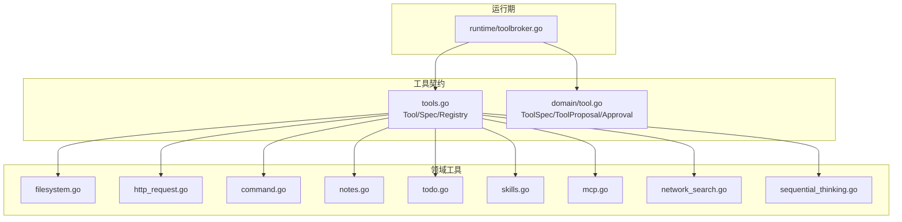
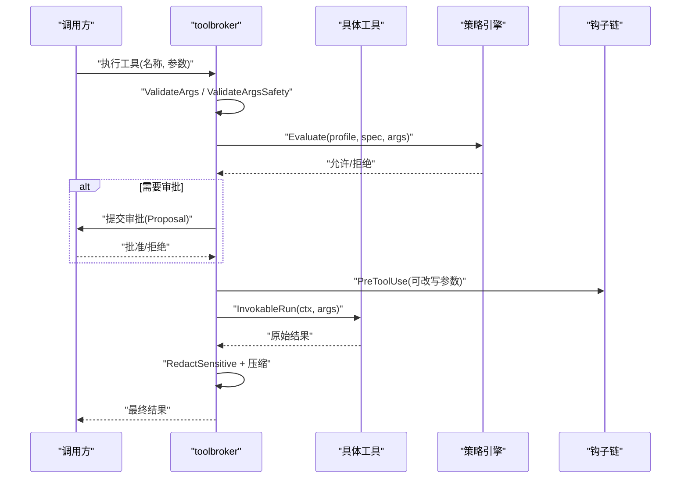
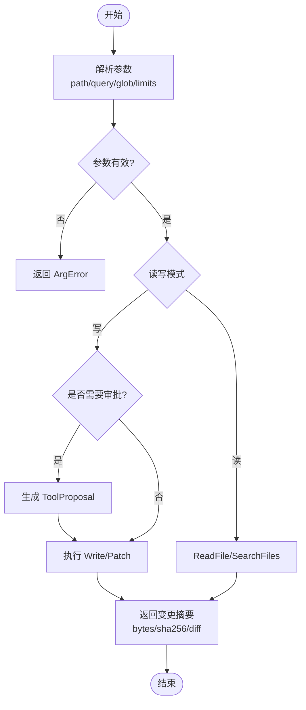
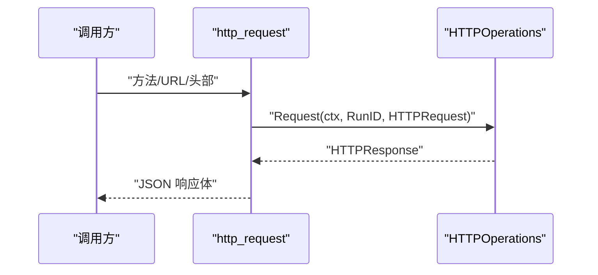
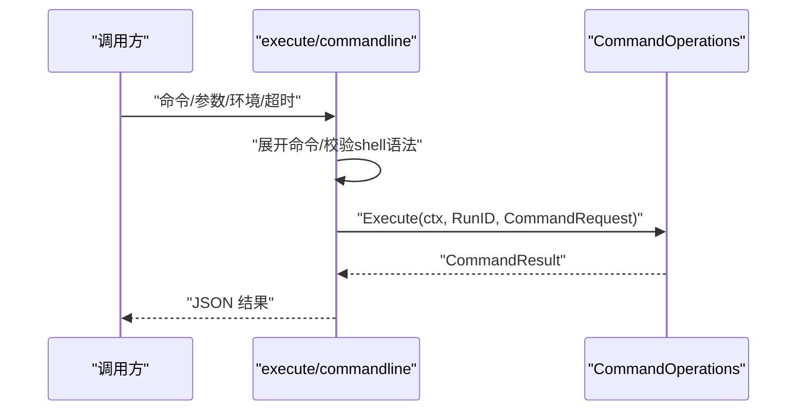
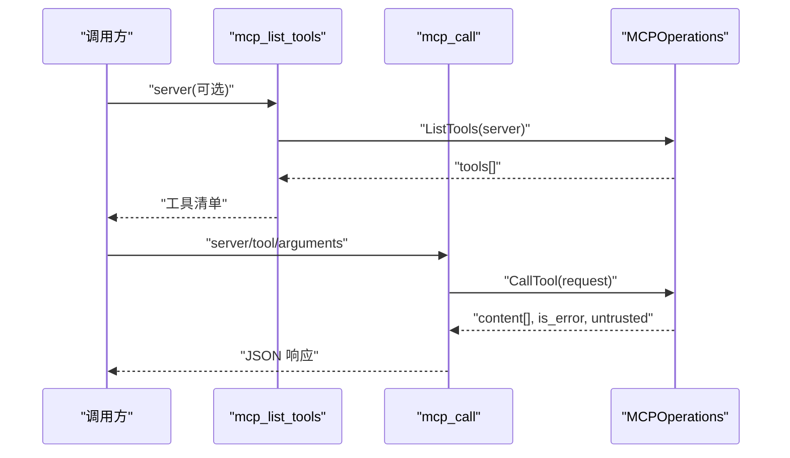
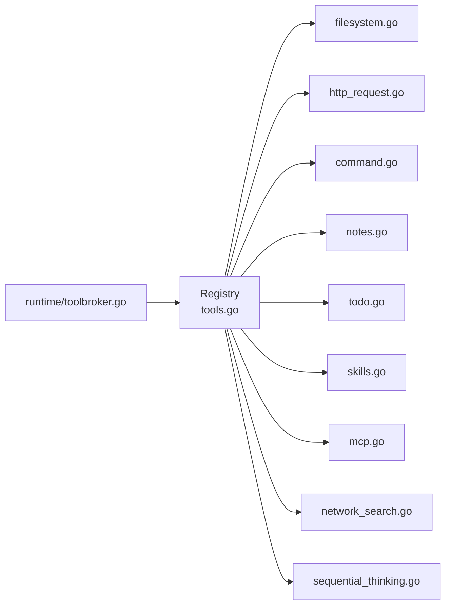

# 内置工具

<cite>
**本文引用的文件**
- [internal/tools/filesystem.go](file://internal/tools/filesystem.go)
- [internal/tools/http_request.go](file://internal/tools/http_request.go)
- [internal/tools/command.go](file://internal/tools/command.go)
- [internal/tools/notes.go](file://internal/tools/notes.go)
- [internal/tools/todo.go](file://internal/tools/todo.go)
- [internal/tools/skills.go](file://internal/tools/skills.go)
- [internal/tools/mcp.go](file://internal/tools/mcp.go)
- [internal/tools/network_search.go](file://internal/tools/network_search.go)
- [internal/tools/sequential_thinking.go](file://internal/tools/sequential_thinking.go)
- [internal/tools/tools.go](file://internal/tools/tools.go)
- [internal/domain/tool.go](file://internal/domain/tool.go)
- [internal/runtime/toolbroker.go](file://internal/runtime/toolbroker.go)
</cite>

## 目录
1. [简介](#简介)
2. [项目结构](#项目结构)
3. [核心组件](#核心组件)
4. [架构总览](#架构总览)
5. [详细组件分析](#详细组件分析)
6. [依赖关系分析](#依赖关系分析)
7. [性能与配额](#性能与配额)
8. [故障排查指南](#故障排查指南)
9. [结论](#结论)
10. [附录：参数与返回值速查](#附录参数与返回值速查)

## 简介
本文件面向 Vivy 运行时中的“内置工具”能力，系统性说明文件系统、网络请求、命令执行、笔记管理、待办事项、技能管理、MCP 集成、顺序思考等工具的用途、参数格式、返回值结构、错误类型、权限与安全限制、资源配额，以及组合使用场景与复杂工作流实现方式。文档同时给出代码级架构图与调用时序图，便于快速定位实现位置并理解运行期治理流程。

## 项目结构
Vivy 的工具体系由 internal/tools 提供统一契约（Tool/Spec/Proposal），并通过 internal/runtime 的 toolbroker 进行策略评估、钩子改写、结果脱敏与大小压缩；具体能力按领域拆分到独立文件，通过 Registry 组装注册。

图表来源
- [internal/tools/tools.go:17-362](file://internal/tools/tools.go#L17-L362)
- [internal/domain/tool.go:14-112](file://internal/domain/tool.go#L14-L112)
- [internal/runtime/toolbroker.go:15-93](file://internal/runtime/toolbroker.go#L15-L93)

章节来源
- [internal/tools/tools.go:17-362](file://internal/tools/tools.go#L17-L362)
- [internal/domain/tool.go:14-112](file://internal/domain/tool.go#L14-L112)
- [internal/runtime/toolbroker.go:15-93](file://internal/runtime/toolbroker.go#L15-L93)

## 核心组件
- 工具契约
  - Tool：每个工具必须实现 Spec() 与 InvokableRun(ctx, args)。可选实现 PrepareProposal() 以支持审批前预览。
  - ToolSpec：描述工具名、描述、是否只读、参数 schema、关键词路由、交互类型。
  - ToolProposal：对副作用型工具的“可审阅变更计划”，供人类审批或自动化策略决策。
- 注册与选择
  - Registry：集中注册所有内置工具，支持按名称解析启用列表，并拒绝浏览器自动化工具。
  - Selector：基于关键词的确定性路由，最小化每次请求暴露给模型的工具集。
- 运行期治理
  - toolbroker：负责参数校验、安全校验、策略评估、钩子改写、执行、结果脱敏与体积压缩。

章节来源
- [internal/tools/tools.go:17-362](file://internal/tools/tools.go#L17-L362)
- [internal/domain/tool.go:14-112](file://internal/domain/tool.go#L14-L112)
- [internal/runtime/toolbroker.go:15-93](file://internal/runtime/toolbroker.go#L15-L93)

## 架构总览
下图展示一次工具调用的完整生命周期：从参数校验、策略评估、审批（如需）、执行、结果脱敏到返回。

图表来源
- [internal/runtime/toolbroker.go:15-93](file://internal/runtime/toolbroker.go#L15-L93)
- [internal/tools/tools.go:41-84](file://internal/tools/tools.go#L41-L84)
- [internal/domain/tool.go:14-25](file://internal/domain/tool.go#L14-L25)

## 详细组件分析

### 文件系统工具（读取、写入、搜索、补丁）
- 工具清单
  - read_file：只读，支持按行范围与最大字节限制读取工作区文件。
  - search_files：只读，在工作区内按字面量搜索，支持路径、glob、大小写、结果与字节上限。
  - write_file：可写，需审批；自动创建父目录。
  - patch：可写，需审批；精确字符串替换，支持全部替换。
- 关键参数
  - read_file：path、start_line、end_line、max_bytes
  - search_files：query、path、glob、max_results、max_bytes、case_sensitive
  - write_file：path、content
  - patch：path、old_string、new_string、replace_all
- 返回值要点
  - 读取：包含 path、content、起止行、总行数、bytes、binary、truncated
  - 搜索：matches（path/line/text）、files_scanned、truncated
  - 写入/补丁：path、changed、bytes、sha256、diff
- 错误类型
  - 参数错误：ArgError（字段+原因）
  - 后端未连接：tools: filesystem backend not wired
- 安全与配额
  - 只读工具自动执行；写操作需审批；支持 max_bytes/max_results 控制输出体积。
- 典型用法
  - 先 search_files 定位目标片段，再用 patch 精准替换；或使用 write_file 整段覆盖。

图表来源
- [internal/tools/filesystem.go:106-300](file://internal/tools/filesystem.go#L106-L300)

章节来源
- [internal/tools/filesystem.go:13-340](file://internal/tools/filesystem.go#L13-L340)

### 网络请求工具（HTTP 客户端）
- 工具：http_request
- 能力：仅 GET/HEAD，访问白名单主机；返回状态码、URL、头部、主体、内容类型与可信标记。
- 参数：method（GET/HEAD）、url（必填）、headers（非敏感头）
- 返回值：status_code、url、headers、body、content_type、untrusted
- 错误类型：参数无效、后端未连接
- 安全与配额：只读、受策略与白名单保护；结果可能标记为不可信数据。
- 典型用法：拉取配置、获取远程文本、健康检查。

图表来源
- [internal/tools/http_request.go:37-72](file://internal/tools/http_request.go#L37-L72)

章节来源
- [internal/tools/http_request.go:12-72](file://internal/tools/http_request.go#L12-L72)

### 命令执行工具（进程控制）
- 工具：execute、commandline
- 能力：在沙箱/工作区内执行白名单可执行文件；禁止 shell 语法注入；支持 cwd、env、超时。
- 参数：command（必填）、args[]、cwd、env{}、timeout_ms
- 返回值：command、cwd、exit_code、stdout、stderr、stdout_truncated、stderr_truncated、timed_out、duration_ms、untrusted
- 错误类型：参数无效、包含 shell 语法、后端未连接
- 安全与配额：始终需要审批；超时由运行时边界控制；输出截断保护事件预算。
- 典型用法：构建、测试、脚本化任务。

图表来源
- [internal/tools/command.go:54-130](file://internal/tools/command.go#L54-L130)

章节来源
- [internal/tools/command.go:12-130](file://internal/tools/command.go#L12-L130)

### 笔记管理工具（CRUD）
- 工具：list_notes、read_note、write_note（通过 registry 注册）
- list_notes：列出最近若干条笔记摘要，限制条目数与摘要长度，避免事件载荷膨胀。
- read_note：按 id 读取完整内容；未知 id 返回参数错误。
- write_note：持久化笔记（通过 registry 装配）。
- 错误类型：参数无效、存储未连接、未找到笔记。
- 安全与配额：只读工具自动执行；输出有界；适合小上下文记忆与跨步骤传递信息。

章节来源
- [internal/tools/notes.go:16-151](file://internal/tools/notes.go#L16-L151)
- [internal/tools/tools.go:243-258](file://internal/tools/tools.go#L243-L258)

### 待办事项工具（任务管理）
- 工具：task_create、task_get、task_update、task_list
- 能力：会话级持久化任务，支持标题、描述、进度标签、元数据、状态流转与依赖关系（blocks/blocked_by）。
- 参数要点：subject/description（必填）、status 枚举、add_blocks/add_blocked_by、owner、metadata。
- 返回值：任务对象（含 ID、状态、依赖等）。
- 错误类型：参数无效、后端未连接、状态不合法。
- 安全与配额：写操作需审批；适合长时任务编排与进度追踪。

章节来源
- [internal/tools/todo.go:12-187](file://internal/tools/todo.go#L12-L187)

### 技能管理工具
- 工具：skills_list、skill_view、skill_manage
- 能力：列出本地可信技能元信息；查看技能或其支持文件；对技能进行创建/编辑/补丁/删除/回滚等操作，均走审批流程。
- 参数要点：action（create/edit/patch/delete/write_file/remove_file/rollback）、name、path、content、old_string/new_string/replace_all、revision_id。
- 返回值：修订 ID、状态、目标路径、哈希、警告等。
- 安全与配额：写操作需审批；支持准备阶段生成 ToolProposal 以便人类审阅。

章节来源
- [internal/tools/skills.go:12-197](file://internal/tools/skills.go#L12-L197)

### MCP 工具集成
- 工具：mcp_list_tools、mcp_call
- 能力：列出远程 MCP 工具及其 schema；调用远程工具，带服务器与工具溯源；调用需审批。
- 参数要点：server（必填）、tool（必填）、arguments（对象）。
- 返回值：content（文本/二进制/MIME）、is_error、untrusted。
- 安全与配额：远程 schema 视为不可信；排除浏览器自动化工具；调用需审批。

图表来源
- [internal/tools/mcp.go:64-135](file://internal/tools/mcp.go#L64-L135)

章节来源
- [internal/tools/mcp.go:12-135](file://internal/tools/mcp.go#L12-L135)

### 顺序思考工具
- 工具：sequential_thinking
- 能力：记录当前运行的推理步骤、修订与分支；无外部副作用，只读。
- 参数要点：thought、thought_number、total_thoughts、next_thought_needed、is_revision、revises_thought、branch_from_thought、branch_id。
- 返回值：thought_number、total_thoughts、next_thought_needed、accepted、branch_id（可选）。
- 适用场景：多步规划、分叉探索、逐步收敛。

章节来源
- [internal/tools/sequential_thinking.go:12-82](file://internal/tools/sequential_thinking.go#L12-L82)

### 网络搜索工具
- 工具：network_search
- 能力：查询配置的搜索引擎/百科；结果标记不可信；不支持浏览器自动化。
- 参数要点：query（必填）、provider（bing/google/duckduckgo/searxng/wikipedia）、max_results、language。
- 返回值：query、provider、results[]（title/url/snippet/provider/untrusted）。

章节来源
- [internal/tools/network_search.go:12-76](file://internal/tools/network_search.go#L12-L76)

## 依赖关系分析
- 工具注册与装配
  - BuiltinWithCommands 将各域工具按需拼装进 Registry；若某后端为空则跳过对应工具。
  - Resolve 会过滤启用列表并拒绝浏览器自动化工具。
- 运行期边界
  - toolbroker 对所有工具调用进行统一治理：参数校验、安全校验、策略评估、钩子改写、执行、脱敏与压缩。
- 领域耦合
  - 文件系统/命令/MCP/搜索等通过接口注入后端，保持 tools 包与 Eino/运行时解耦。

图表来源
- [internal/tools/tools.go:243-362](file://internal/tools/tools.go#L243-L362)
- [internal/runtime/toolbroker.go:15-93](file://internal/runtime/toolbroker.go#L15-L93)

章节来源
- [internal/tools/tools.go:243-362](file://internal/tools/tools.go#L243-L362)
- [internal/runtime/toolbroker.go:15-93](file://internal/runtime/toolbroker.go#L15-L93)

## 性能与配额
- 输出体积控制
  - 搜索/读取/命令输出均支持 max_bytes/max_results 或截断标志，防止事件载荷过大。
- 只读优先
  - 只读工具自动执行，减少审批开销；写操作需审批，带来额外延迟但保障安全。
- 策略与钩子
  - 策略评估与钩子改写发生在执行前，可能影响参数与授权；被改写的参数会重新评估策略。
- 结果脱敏
  - 所有工具结果在执行后统一脱敏，避免敏感信息泄露。

[本节为通用指导，不直接分析具体文件]

## 故障排查指南
- 常见错误
  - 参数错误：ArgError（字段+原因），通常由非法 JSON、缺失必填项、类型不符引起。
  - 后端未连接：如 “tools: filesystem backend not wired”、“tools: http request backend not wired” 等，表示运行时未注入对应后端。
  - 策略拒绝：child worker request for xxx is not allowed，需检查策略配置或审批流程。
  - 浏览器自动化禁用：工具名被显式排除，无法启用。
- 定位建议
  - 确认工具已注册且启用在 enabled 列表中。
  - 检查传入参数是否符合 Spec 声明的类型与约束。
  - 观察策略评估事件与审批记录，确认是否被拦截。
  - 对于写操作，确保已通过审批且目标未被并发修改。

章节来源
- [internal/tools/tools.go:41-84](file://internal/tools/tools.go#L41-L84)
- [internal/runtime/toolbroker.go:15-93](file://internal/runtime/toolbroker.go#L15-L93)
- [internal/tools/filesystem.go:141-148](file://internal/tools/filesystem.go#L141-L148)
- [internal/tools/http_request.go:60-68](file://internal/tools/http_request.go#L60-L68)
- [internal/tools/command.go:98-112](file://internal/tools/command.go#L98-L112)

## 结论
Vivy 的内置工具以统一的契约与注册机制组织，配合运行期的策略评估、审批与脱敏，形成安全可控的执行边界。文件系统、命令、MCP、搜索等能力通过接口注入，既保证灵活性又避免耦合。推荐在复杂工作流中优先使用只读工具与顺序思考工具进行规划，再结合审批型写操作完成变更，并以笔记/待办作为跨步骤状态载体。

[本节为总结性内容，不直接分析具体文件]

## 附录：参数与返回值速查
- 文件系统
  - read_file：入参 path/start_line/end_line/max_bytes；出参 path/content/start_line/end_line/total_lines/bytes/binary/truncated
  - search_files：入参 query/path/glob/max_results/max_bytes/case_sensitive；出参 matches/files_scanned/truncated
  - write_file：入参 path/content；出参 path/changed/bytes/sha256/diff
  - patch：入参 path/old_string/new_string/replace_all；出参同上
- HTTP
  - http_request：入参 method/url/headers；出参 status_code/url/headers/body/content_type/untrusted
- 命令
  - execute/commandline：入参 command/args/cwd/env/timeout_ms；出参 command/cwd/exit_code/stdout/stderr/.../untrusted
- 笔记
  - list_notes：无入参；返回计数与最近摘要
  - read_note：入参 id；返回完整内容
- 待办
  - task_create/get/update/list：围绕 subject/description/status/dependencies/owner/metadata 的 CRUD
- 技能
  - skills_list/view/manage：围绕 name/path/content/patch/rollback 的管理
- MCP
  - mcp_list_tools：入参 server（可选）；返回工具清单
  - mcp_call：入参 server/tool/arguments；返回 content[]/is_error/untrusted
- 顺序思考
  - sequential_thinking：入参 thought/thought_number/total_thoughts/next_thought_needed/is_revision/revises_thought/branch_from_thought/branch_id；返回 accepted 与分支标识

章节来源
- [internal/tools/filesystem.go:20-80](file://internal/tools/filesystem.go#L20-L80)
- [internal/tools/http_request.go:14-31](file://internal/tools/http_request.go#L14-L31)
- [internal/tools/command.go:17-36](file://internal/tools/command.go#L17-L36)
- [internal/tools/notes.go:16-151](file://internal/tools/notes.go#L16-L151)
- [internal/tools/todo.go:19-24](file://internal/tools/todo.go#L19-L24)
- [internal/tools/skills.go:18-62](file://internal/tools/skills.go#L18-L62)
- [internal/tools/mcp.go:17-53](file://internal/tools/mcp.go#L17-L53)
- [internal/tools/sequential_thinking.go:14-37](file://internal/tools/sequential_thinking.go#L14-L37)