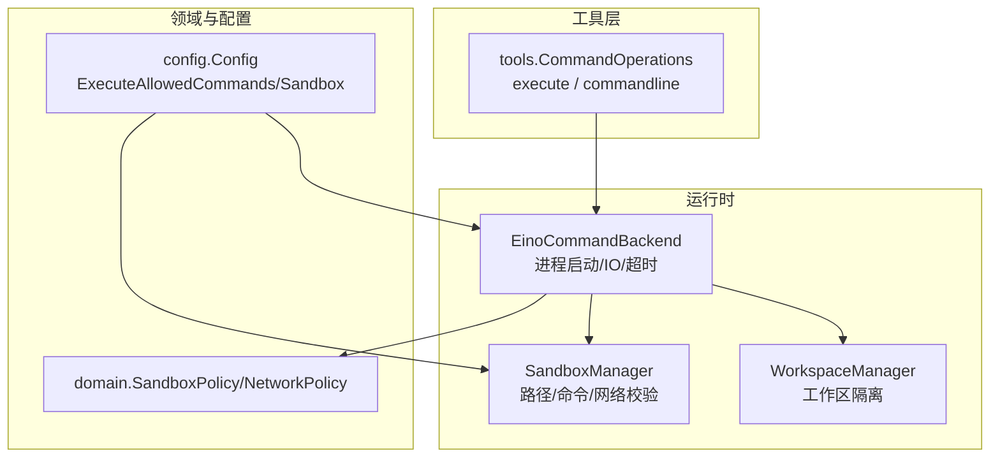
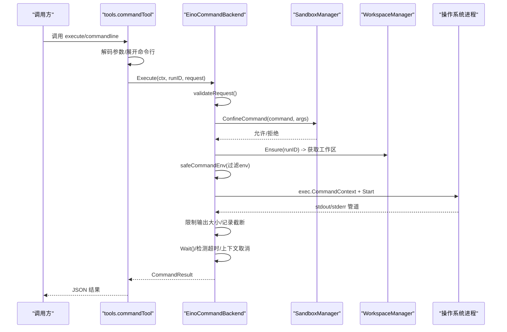
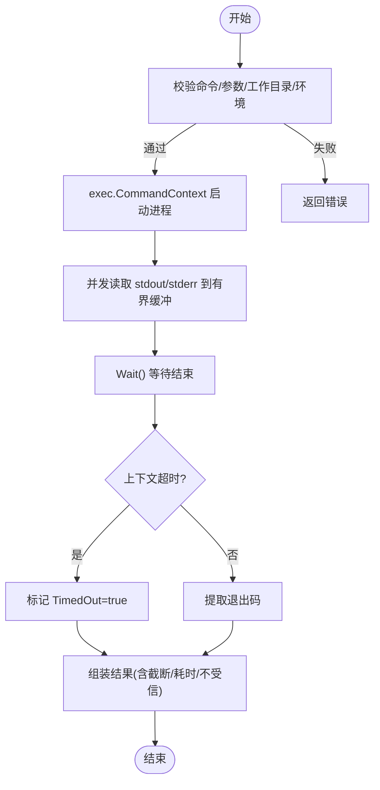
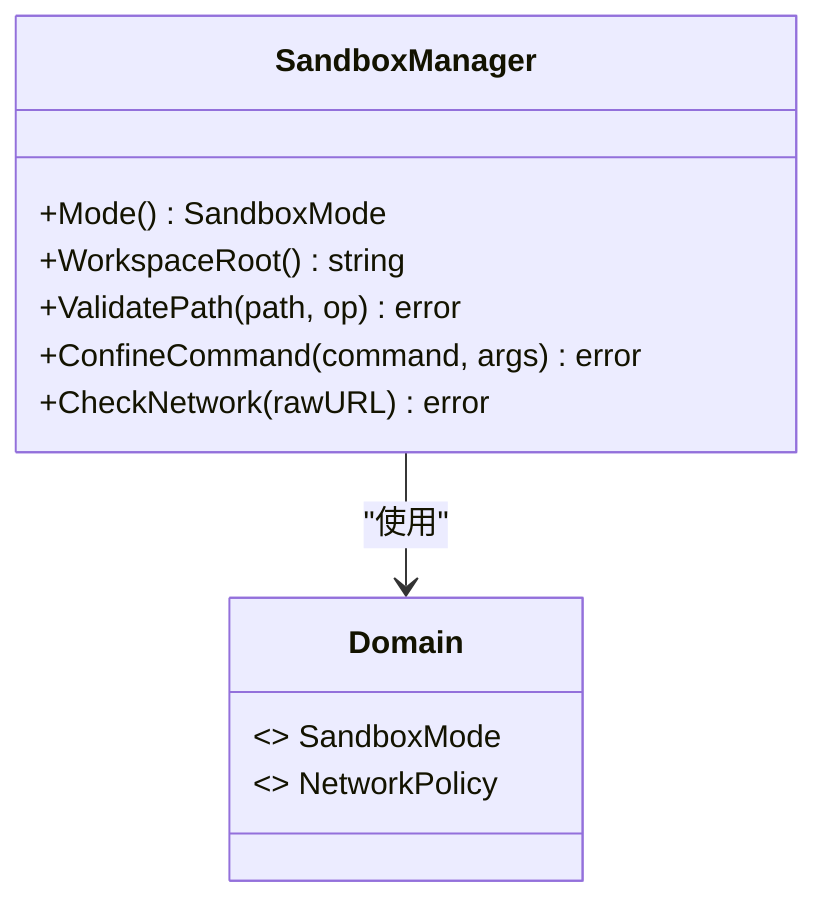
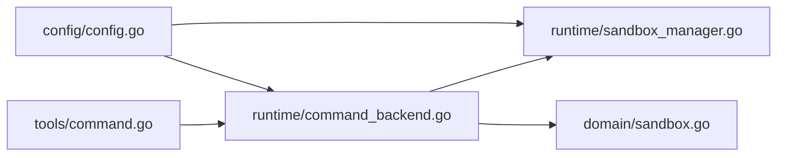

# 命令执行工具

<cite>
**本文引用的文件**
- [internal/tools/command.go](file://internal/tools/command.go)
- [internal/runtime/command_backend.go](file://internal/runtime/command_backend.go)
- [internal/runtime/sandbox_manager.go](file://internal/runtime/sandbox_manager.go)
- [internal/domain/sandbox.go](file://internal/domain/sandbox.go)
- [internal/config/config.go](file://internal/config/config.go)
- [config.example.yaml](file://config.example.yaml)
- [internal/tools/security.go](file://internal/tools/security.go)
- [internal/runtime/command_backend_test.go](file://internal/runtime/command_backend_test.go)
</cite>

## 目录
1. [简介](#简介)
2. [项目结构](#项目结构)
3. [核心组件](#核心组件)
4. [架构总览](#架构总览)
5. [详细组件分析](#详细组件分析)
6. [依赖关系分析](#依赖关系分析)
7. [性能与资源限制](#性能与资源限制)
8. [故障排查指南](#故障排查指南)
9. [结论](#结论)
10. [附录：使用示例](#附录使用示例)

## 简介
本文件面向“命令执行工具”，系统性说明进程启动、参数传递、标准输入输出处理、错误捕获、命令白名单、环境变量隔离、资源限制、安全沙箱约束（可执行文件限制、危险模式拦截）、生命周期管理（超时控制、上下文取消）、以及监控与排障要点。该能力通过工具层暴露，由运行时后端实际执行，并受工作区与沙箱策略双重约束。

## 项目结构
命令执行相关代码主要分布在以下模块：
- 工具接口与协议定义：internal/tools/command.go
- 运行时执行后端：internal/runtime/command_backend.go
- 沙箱策略与网络/路径校验：internal/runtime/sandbox_manager.go
- 领域模型（沙箱模式、审批策略、网络策略）：internal/domain/sandbox.go
- 配置加载与默认值：internal/config/config.go、config.example.yaml
- 通用安全扫描与脱敏：internal/tools/security.go
- 行为验证测试：internal/runtime/command_backend_test.go

图表来源
- [internal/tools/command.go:17-44](file://internal/tools/command.go#L17-L44)
- [internal/runtime/command_backend.go:28-51](file://internal/runtime/command_backend.go#L28-L51)
- [internal/runtime/sandbox_manager.go:27-36](file://internal/runtime/sandbox_manager.go#L27-L36)
- [internal/domain/sandbox.go:69-84](file://internal/domain/sandbox.go#L69-L84)
- [internal/config/config.go:149-152](file://internal/config/config.go#L149-L152)

章节来源
- [internal/tools/command.go:17-44](file://internal/tools/command.go#L17-L44)
- [internal/runtime/command_backend.go:28-51](file://internal/runtime/command_backend.go#L28-L51)
- [internal/runtime/sandbox_manager.go:27-36](file://internal/runtime/sandbox_manager.go#L27-L36)
- [internal/domain/sandbox.go:69-84](file://internal/domain/sandbox.go#L69-L84)
- [internal/config/config.go:149-152](file://internal/config/config.go#L149-L152)

## 核心组件
- 工具接口与请求/响应
  - 工具名：execute、commandline
  - 请求体包含：命令、参数数组、工作目录、环境变量、超时毫秒
  - 返回体包含：命令串、工作目录、退出码、stdout/stderr、是否截断、是否超时、耗时、是否不受信
- 运行时后端
  - 负责参数校验、白名单检查、工作区解析、环境变量过滤、子进程创建、管道读取、超时与上下文取消、结果封装
- 沙箱管理器
  - 基于会话的沙箱模式（只读、工作区写入、危险全访问）
  - 命令白名单校验、危险命令模式拦截
  - 路径合法性校验（含符号链接、穿越防护）
  - 网络策略校验（仅HTTP/HTTPS、可选域名白名单、私有IP拦截）
- 配置系统
  - 提供 execute_allowed_commands 白名单
  - 提供 sandbox 默认模式、工作区根、审批策略、网络策略等

章节来源
- [internal/tools/command.go:17-36](file://internal/tools/command.go#L17-L36)
- [internal/runtime/command_backend.go:21-51](file://internal/runtime/command_backend.go#L21-L51)
- [internal/runtime/sandbox_manager.go:27-36](file://internal/runtime/sandbox_manager.go#L27-L36)
- [internal/config/config.go:149-152](file://internal/config/config.go#L149-L152)

## 架构总览
命令执行从工具调用到进程落地的关键流程如下：

图表来源
- [internal/tools/command.go:63-96](file://internal/tools/command.go#L63-L96)
- [internal/runtime/command_backend.go:52-114](file://internal/runtime/command_backend.go#L52-L114)
- [internal/runtime/sandbox_manager.go:149-183](file://internal/runtime/sandbox_manager.go#L149-L183)

## 详细组件分析

### 工具层：命令工具与提案
- 工具规范
  - 名称：execute、commandline
  - 参数：command、args、cwd、env、timeout_ms
  - 描述：在运行工作区内执行白名单可执行文件；始终需要审批
- 参数展开与安全
  - 对 execute 的复合命令行进行拆分，禁止 shell 语法字符
  - 基础参数校验（命令必填、空白处理）
- 提案生成
  - 若后端支持 PrepareCommand，则生成预览、风险发现与数据负载，便于审批界面展示

章节来源
- [internal/tools/command.go:12-62](file://internal/tools/command.go#L12-L62)
- [internal/tools/command.go:82-112](file://internal/tools/command.go#L82-L112)
- [internal/tools/command.go:114-129](file://internal/tools/command.go#L114-L129)

### 运行时后端：进程执行与资源限制
- 请求校验
  - 命令必须为白名单中的可执行文件名，不允许 shell 语法
  - 参数数量与单参长度限制、NUL 字节检查、总参数字节数限制
  - 工作目录必须相对工作区，且解析后不得逃逸
  - 环境变量仅允许白名单键，同时继承少量必要系统变量
- 进程启动
  - 使用带超时的 context 启动子进程，设置工作目录与环境
  - 分别连接 stdout/stderr 管道，并发拷贝至有界缓冲区
- 结果与状态
  - 记录退出码、耗时、是否超时、是否截断、是否不受信
  - 若父上下文被取消或等待出错，按规则返回错误
- 提案预览
  - 生成人类可读的命令预览与风险提示

图表来源
- [internal/runtime/command_backend.go:52-114](file://internal/runtime/command_backend.go#L52-L114)
- [internal/runtime/command_backend.go:116-197](file://internal/runtime/command_backend.go#L116-L197)
- [internal/runtime/command_backend.go:199-227](file://internal/runtime/command_backend.go#L199-L227)

章节来源
- [internal/runtime/command_backend.go:21-51](file://internal/runtime/command_backend.go#L21-L51)
- [internal/runtime/command_backend.go:52-114](file://internal/runtime/command_backend.go#L52-L114)
- [internal/runtime/command_backend.go:116-197](file://internal/runtime/command_backend.go#L116-L197)
- [internal/runtime/command_backend.go:199-227](file://internal/runtime/command_backend.go#L199-L227)

### 沙箱管理器：路径/命令/网络约束
- 沙箱模式
  - read_only：禁止写与命令执行
  - workspace_write：读写限于工作区根
  - danger_full_access：绕过限制但仍会拦截明显危险模式
- 路径校验
  - 规范化路径、符号链接解析、穿越防护、工作区边界检查
- 命令约束
  - 白名单校验（danger_full_access 除外）
  - 危险命令模式拦截（如格式化磁盘、递归强制删除等）
- 网络策略
  - 仅允许 HTTP/HTTPS
  - 可选域名白名单
  - 可选禁止私有 IP（RFC1918/环回/链路本地等）

图表来源
- [internal/runtime/sandbox_manager.go:27-36](file://internal/runtime/sandbox_manager.go#L27-L36)
- [internal/runtime/sandbox_manager.go:85-147](file://internal/runtime/sandbox_manager.go#L85-L147)
- [internal/runtime/sandbox_manager.go:149-183](file://internal/runtime/sandbox_manager.go#L149-L183)
- [internal/runtime/sandbox_manager.go:185-234](file://internal/runtime/sandbox_manager.go#L185-L234)
- [internal/domain/sandbox.go:3-22](file://internal/domain/sandbox.go#L3-L22)
- [internal/domain/sandbox.go:78-84](file://internal/domain/sandbox.go#L78-L84)

章节来源
- [internal/runtime/sandbox_manager.go:85-147](file://internal/runtime/sandbox_manager.go#L85-L147)
- [internal/runtime/sandbox_manager.go:149-183](file://internal/runtime/sandbox_manager.go#L149-L183)
- [internal/runtime/sandbox_manager.go:185-234](file://internal/runtime/sandbox_manager.go#L185-L234)
- [internal/domain/sandbox.go:3-22](file://internal/domain/sandbox.go#L3-L22)
- [internal/domain/sandbox.go:69-84](file://internal/domain/sandbox.go#L69-L84)

### 配置与默认策略
- 可执行白名单
  - runtime.execute_allowed_commands 决定允许执行的命令基名
- 沙箱默认模式
  - runtime.sandbox.default_mode 控制新会话的文件/命令权限边界
- 审批策略
  - runtime.sandbox.approval.default_policy 控制效果型工具的审批行为
- 网络策略
  - runtime.sandbox.network.allowed_domains 与 deny_private_ips

章节来源
- [internal/config/config.go:149-152](file://internal/config/config.go#L149-L152)
- [internal/config/config.go:161-192](file://internal/config/config.go#L161-L192)
- [internal/config/config.go:256-314](file://internal/config/config.go#L256-L314)
- [config.example.yaml:66-104](file://config.example.yaml#L66-L104)

### 安全扫描与脱敏
- 参数安全扫描
  - 针对 path/filepath/file_path/command/cmd 字段进行 NUL、路径穿越、Shell 注入关键字检查
- 敏感信息脱敏
  - 对常见密钥与邮箱进行脱敏替换，避免进入模型上下文或持久化负载

章节来源
- [internal/tools/security.go:19-79](file://internal/tools/security.go#L19-L79)

## 依赖关系分析
- 工具层依赖运行时后端实现具体执行
- 运行时后端依赖沙箱管理器与工作区管理器进行策略与空间隔离
- 沙箱管理器依赖领域模型（沙箱模式、网络策略）
- 配置系统提供白名单与沙箱策略，贯穿后端与沙箱初始化

图表来源
- [internal/tools/command.go:17-44](file://internal/tools/command.go#L17-L44)
- [internal/runtime/command_backend.go:28-51](file://internal/runtime/command_backend.go#L28-L51)
- [internal/runtime/sandbox_manager.go:27-36](file://internal/runtime/sandbox_manager.go#L27-L36)
- [internal/domain/sandbox.go:69-84](file://internal/domain/sandbox.go#L69-L84)
- [internal/config/config.go:149-152](file://internal/config/config.go#L149-L152)

章节来源
- [internal/tools/command.go:17-44](file://internal/tools/command.go#L17-L44)
- [internal/runtime/command_backend.go:28-51](file://internal/runtime/command_backend.go#L28-L51)
- [internal/runtime/sandbox_manager.go:27-36](file://internal/runtime/sandbox_manager.go#L27-L36)
- [internal/domain/sandbox.go:69-84](file://internal/domain/sandbox.go#L69-L84)
- [internal/config/config.go:149-152](file://internal/config/config.go#L149-L152)

## 性能与资源限制
- 超时控制
  - 默认超时与最大超时上限，防止长时间占用
  - 通过 context.WithTimeout 绑定进程生命周期
- 输出限制
  - stdout/stderr 各自有最大字节限制，超出部分标记截断
- 参数限制
  - 参数个数、单参长度、总参数字节数限制，防止滥用
- 环境变量限制
  - 仅允许白名单键，避免泄露敏感信息
- 建议
  - 合理设置超时与输出限制，结合监控指标观察尾部增长
  - 对长任务采用后台任务或外部调度器，避免阻塞主流程

章节来源
- [internal/runtime/command_backend.go:21-26](file://internal/runtime/command_backend.go#L21-L26)
- [internal/runtime/command_backend.go:61-86](file://internal/runtime/command_backend.go#L61-L86)
- [internal/runtime/command_backend.go:116-148](file://internal/runtime/command_backend.go#L116-L148)
- [internal/runtime/command_backend.go:189-196](file://internal/runtime/command_backend.go#L189-L196)
- [internal/runtime/command_backend.go:238-261](file://internal/runtime/command_backend.go#L238-L261)

## 故障排查指南
- 常见问题定位
  - 命令不在白名单：检查 runtime.execute_allowed_commands 配置
  - 工作目录逃逸：确认 cwd 为工作区相对路径，且解析后未越界
  - 环境变量不被允许：仅允许白名单键，必要时调整配置或改用其他机制
  - 输出过大被截断：关注 stdout_truncated/stderr_truncated 标志
  - 超时：检查 timeout_ms 与 maxCommandTimeout 上限
  - 上下文取消：上层调用取消会导致进程终止
- 调试步骤
  - 查看工具提案预览与风险发现项
  - 检查沙箱模式与网络策略是否过严
  - 复现最小用例，逐步放宽限制定位问题
- 参考测试
  - 通过单元测试验证基本执行、拒绝场景与输出限制

章节来源
- [internal/runtime/command_backend_test.go:14-89](file://internal/runtime/command_backend_test.go#L14-L89)

## 结论
命令执行工具通过“工具层 + 运行时后端 + 沙箱策略”的分层设计，实现了安全的进程执行能力：严格的白名单与环境变量隔离、工作区边界约束、输出与参数限制、超时与上下文取消、以及网络访问控制。配合配置系统与审批策略，可在不同信任级别下灵活启用或收紧执行能力。

## 附录：使用示例
以下为典型用法说明（以概念性步骤为主，不直接粘贴代码）：
- 简单命令执行
  - 选择白名单中的命令（如 go、git、rg），传入参数数组与工作目录（可选）
  - 设置超时毫秒，避免长时间占用
  - 读取返回的退出码、stdout/stderr、是否截断与是否超时
- 管道操作
  - 由于工具以 argv 方式执行，不支持在工具层拼接 shell 管道
  - 如需组合多个命令，应在工作区内编写脚本并通过白名单命令调用
- 后台任务管理
  - 将耗时任务放入后台进程，通过工作区内的日志或工件进行状态同步
  - 注意超时与上下文取消，确保任务可被优雅终止
- 信号处理
  - 当前实现通过上下文取消终止进程；如需更细粒度信号控制，可在目标进程中自行处理
- 环境变量隔离
  - 仅允许白名单环境变量，避免泄露敏感信息
  - 可通过配置扩展允许的键集（谨慎评估安全性）
- 沙箱模式选择
  - read_only：仅读，禁止命令执行
  - workspace_write：在工作区内读写与执行白名单命令
  - danger_full_access：放开限制但仍拦截危险模式，仅限可信场景

章节来源
- [internal/tools/command.go:17-62](file://internal/tools/command.go#L17-L62)
- [internal/runtime/command_backend.go:52-114](file://internal/runtime/command_backend.go#L52-L114)
- [internal/runtime/sandbox_manager.go:149-183](file://internal/runtime/sandbox_manager.go#L149-L183)
- [internal/config/config.go:149-152](file://internal/config/config.go#L149-L152)
- [config.example.yaml:66-104](file://config.example.yaml#L66-L104)