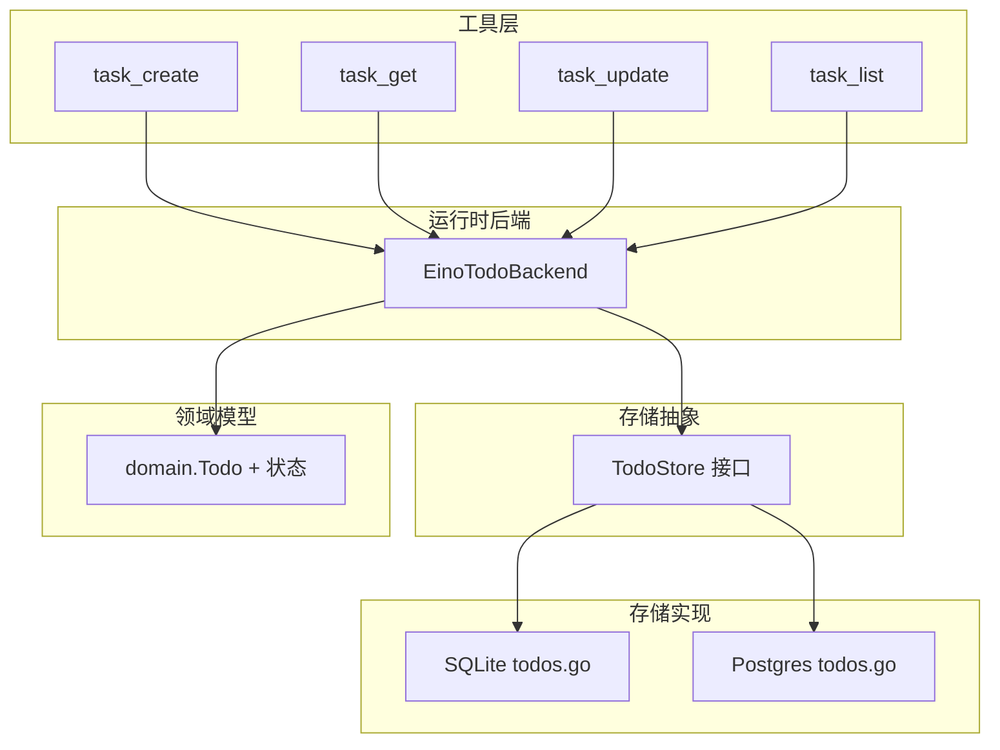
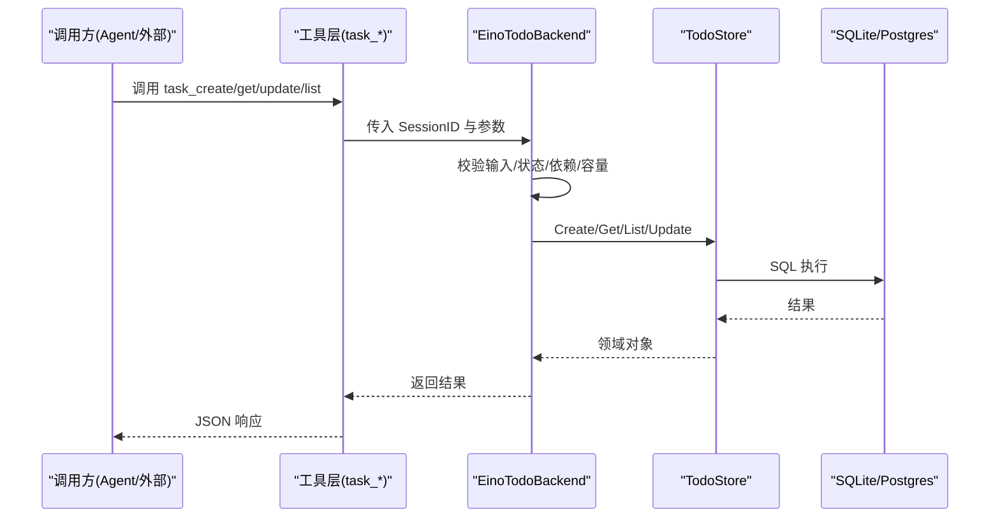
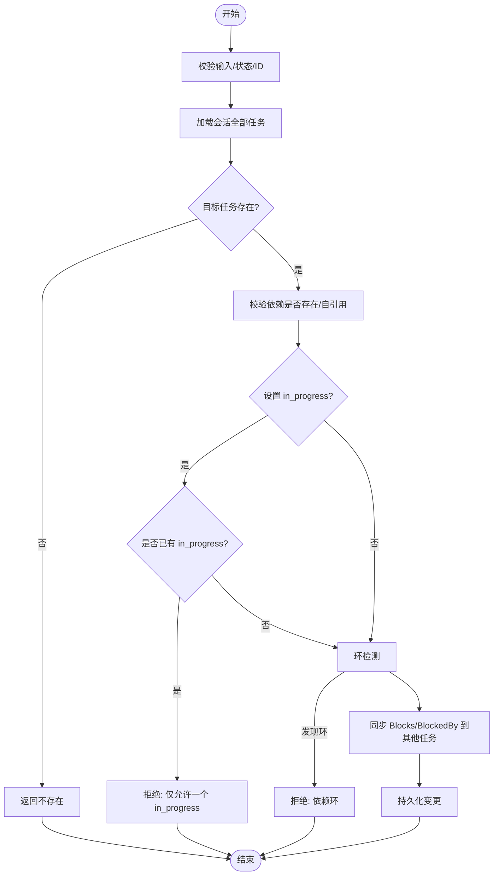
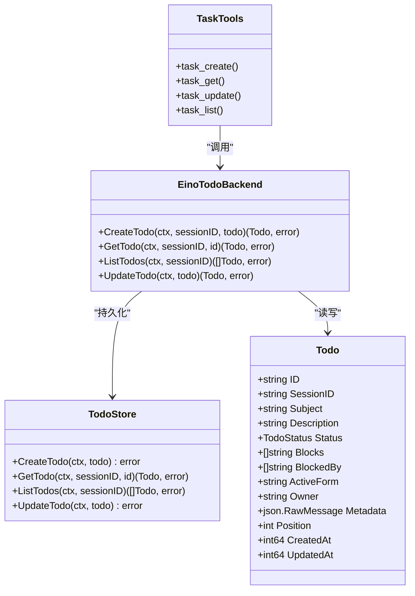

# 待办事项工具

<cite>
**本文引用的文件**
- [internal/domain/todo.go](file://internal/domain/todo.go)
- [internal/tools/todo.go](file://internal/tools/todo.go)
- [internal/tools/tools.go](file://internal/tools/tools.go)
- [internal/runtime/todo_backend.go](file://internal/runtime/todo_backend.go)
- [internal/storage/contracts.go](file://internal/storage/contracts.go)
- [internal/storage/sqlite/todos.go](file://internal/storage/sqlite/todos.go)
- [internal/storage/postgres/todos.go](file://internal/storage/postgres/todos.go)
- [internal/app/app.go](file://internal/app/app.go)
</cite>

## 目录
1. [简介](#简介)
2. [项目结构](#项目结构)
3. [核心组件](#核心组件)
4. [架构总览](#架构总览)
5. [详细组件分析](#详细组件分析)
6. [依赖关系分析](#依赖关系分析)
7. [性能与限制](#性能与限制)
8. [故障排查指南](#故障排查指南)
9. [结论](#结论)
10. [附录：使用示例与最佳实践](#附录使用示例与最佳实践)

## 简介
本仓库实现了基于会话（Session）的持久化“待办事项”能力，作为 Agent 运行时内置工具的一部分。它提供任务的创建、查询、更新、列表等能力，并支持任务间的依赖关系校验、状态约束、以及按位置排序的展示顺序。数据通过存储抽象层以 SQLite 或 Postgres 持久化，并通过 Eino 的 plantask/filesystem 适配接口暴露给上层。

该功能遵循以下设计要点：
- 任务属于某个 Session，跨运行隔离。
- 任务有明确的状态机：pending、in_progress、completed、cancelled。
- 同一 Session 内仅允许一个 in_progress 的任务。
- 支持 Blocks/BlockedBy 双向依赖图，并在更新时进行环检测。
- 提供最大任务数、标题/描述长度等容量限制。
- 通过工具注册表对外暴露 task_create、task_get、task_update、task_list 四个工具。

## 项目结构
待办事项相关代码分布在领域模型、工具层、运行时后端、存储实现与应用装配层：
- 领域模型：定义 Todo 结构与状态常量。
- 工具层：将领域操作封装为可被 Agent 调用的工具。
- 运行时后端：实现业务规则（状态约束、依赖校验、容量限制）。
- 存储层：SQLite/Postgres 两种实现，统一通过 TodoStore 接口访问。
- 应用装配：在进程启动时将后端注入到工具与引擎中。

图表来源
- [internal/tools/todo.go:12-24](file://internal/tools/todo.go#L12-L24)
- [internal/runtime/todo_backend.go:30-39](file://internal/runtime/todo_backend.go#L30-L39)
- [internal/storage/contracts.go:244-250](file://internal/storage/contracts.go#L244-L250)
- [internal/storage/sqlite/todos.go:16-101](file://internal/storage/sqlite/todos.go#L16-L101)
- [internal/storage/postgres/todos.go:16-101](file://internal/storage/postgres/todos.go#L16-L101)
- [internal/domain/todo.go:5-30](file://internal/domain/todo.go#L5-L30)

章节来源
- [internal/domain/todo.go:5-30](file://internal/domain/todo.go#L5-L30)
- [internal/tools/todo.go:12-24](file://internal/tools/todo.go#L12-L24)
- [internal/runtime/todo_backend.go:30-39](file://internal/runtime/todo_backend.go#L30-L39)
- [internal/storage/contracts.go:244-250](file://internal/storage/contracts.go#L244-L250)

## 核心组件
- 领域模型 Todo：包含 ID、SessionID、Subject、Description、Status、Blocks、BlockedBy、ActiveForm、Owner、Metadata、Position、CreatedAt、UpdatedAt。
- 工具集：task_create、task_get、task_update、task_list，分别对应创建、获取、更新、列出任务。
- 运行时后端 EinoTodoBackend：实现业务规则与 Eino plantask/filesystem 兼容接口。
- 存储抽象 TodoStore：Create/Get/List/Update 四种操作。
- 存储实现：SQLite 与 Postgres 两套 SQL 实现。
- 应用装配：在进程启动时创建后端、注入工具、构建引擎。

章节来源
- [internal/domain/todo.go:5-30](file://internal/domain/todo.go#L5-L30)
- [internal/tools/todo.go:36-168](file://internal/tools/todo.go#L36-L168)
- [internal/runtime/todo_backend.go:42-163](file://internal/runtime/todo_backend.go#L42-L163)
- [internal/storage/contracts.go:244-250](file://internal/storage/contracts.go#L244-L250)
- [internal/storage/sqlite/todos.go:16-101](file://internal/storage/sqlite/todos.go#L16-L101)
- [internal/storage/postgres/todos.go:16-101](file://internal/storage/postgres/todos.go#L16-L101)
- [internal/app/app.go:179-190](file://internal/app/app.go#L179-L190)

## 架构总览
从调用方到持久化的完整链路如下：

图表来源
- [internal/tools/todo.go:46-168](file://internal/tools/todo.go#L46-L168)
- [internal/runtime/todo_backend.go:42-163](file://internal/runtime/todo_backend.go#L42-L163)
- [internal/storage/sqlite/todos.go:16-101](file://internal/storage/sqlite/todos.go#L16-L101)
- [internal/storage/postgres/todos.go:16-101](file://internal/storage/postgres/todos.go#L16-L101)

## 详细组件分析

### 领域模型与状态
- 状态枚举：pending、in_progress、completed、cancelled。
- 任务字段：
  - 标识与会话：ID、SessionID
  - 内容：Subject、Description
  - 状态与进度：Status、ActiveForm
  - 依赖：Blocks（本任务阻塞的其他任务）、BlockedBy（阻塞本任务的任务）
  - 元信息：Owner、Metadata
  - 排序与时间：Position、CreatedAt、UpdatedAt

复杂度说明：
- 依赖校验在 Update 时进行，涉及遍历当前会话所有任务构建图并检测环，时间复杂度近似 O(N+M)，N 为任务数，M 为依赖边数。

章节来源
- [internal/domain/todo.go:5-30](file://internal/domain/todo.go#L5-L30)
- [internal/runtime/todo_backend.go:121-138](file://internal/runtime/todo_backend.go#L121-L138)
- [internal/runtime/todo_backend.go:304-335](file://internal/runtime/todo_backend.go#L304-L335)

### 工具层：task_create / task_get / task_update / task_list
- task_create：
  - 必填：subject、description；可选：active_form、metadata
  - 行为：调用后端 CreateTodo，默认状态为 pending，自动分配 ID、Position、时间戳
- task_get：
  - 必填：task_id
  - 行为：根据 session + id 获取单个任务
- task_update：
  - 可选增量字段：subject、description、active_form、status、add_blocks、add_blocked_by、owner、metadata
  - 行为：读取现有任务，合并增量，调用后端 UpdateTodo，触发依赖同步与状态校验
- task_list：
  - 无参；返回当前会话全部任务

错误处理：
- 参数为空或缺失会返回结构化参数错误。
- 未连接后端会返回“backend not wired”。

章节来源
- [internal/tools/todo.go:36-168](file://internal/tools/todo.go#L36-L168)
- [internal/tools/tools.go:292-317](file://internal/tools/tools.go#L292-L317)

### 运行时后端：EinoTodoBackend
职责：
- 会话校验：require(sessionID)
- 文本校验：validateTodoText(subject, description)
- 容量限制：单会话最多 maxTodoCount 个任务
- 状态约束：仅允许一个 in_progress 任务
- 依赖校验：Blocks/BlockedBy 必须存在且不能自引用，更新时维护双向关系，并进行环检测
- 持久化：委托 TodoStore 完成 CRUD
- Eino 兼容：实现 LsInfo/Read/Write/Delete，映射为虚拟 JSON 文件路径

关键流程（更新任务）：

图表来源
- [internal/runtime/todo_backend.go:97-163](file://internal/runtime/todo_backend.go#L97-L163)
- [internal/runtime/todo_backend.go:304-335](file://internal/runtime/todo_backend.go#L304-L335)

章节来源
- [internal/runtime/todo_backend.go:42-163](file://internal/runtime/todo_backend.go#L42-L163)
- [internal/runtime/todo_backend.go:256-335](file://internal/runtime/todo_backend.go#L256-L335)

### 存储层：TodoStore 与实现
- 接口：CreateTodo、GetTodo、ListTodos、UpdateTodo
- SQLite 实现：
  - 使用 todos 表，JSON 列存储 blocks/blocked_by/metadata
  - 查询按 position、id 排序
  - 更新失败返回 ErrNotFound
- Postgres 实现：
  - 与 SQLite 语义一致，SQL 语句不同
  - 同样通过 JSON 列存储数组与元数据

章节来源
- [internal/storage/contracts.go:244-250](file://internal/storage/contracts.go#L244-L250)
- [internal/storage/sqlite/todos.go:16-101](file://internal/storage/sqlite/todos.go#L16-L101)
- [internal/storage/postgres/todos.go:16-101](file://internal/storage/postgres/todos.go#L16-L101)

### 应用装配与工具注册
- 进程启动时打开存储引擎（SQLite 或 Postgres）
- 创建 EinoTodoBackend，并注入到工具注册表
- 通过 tools.BuiltinWithCommands 注册 task_* 工具
- 构建运行时引擎，并将工具暴露给 Agent

章节来源
- [internal/app/app.go:179-190](file://internal/app/app.go#L179-L190)
- [internal/tools/tools.go:292-317](file://internal/tools/tools.go#L292-L317)

## 依赖关系分析
- 工具层依赖运行时后端提供的 TodoOperations 接口。
- 运行时后端依赖存储抽象 TodoStore。
- 存储抽象由 SQLite/Postgres 具体实现。
- 领域模型被各层共享。
- 应用装配负责将后端实例注入到工具与引擎。

图表来源
- [internal/domain/todo.go:5-30](file://internal/domain/todo.go#L5-L30)
- [internal/storage/contracts.go:244-250](file://internal/storage/contracts.go#L244-L250)
- [internal/runtime/todo_backend.go:30-39](file://internal/runtime/todo_backend.go#L30-L39)
- [internal/tools/todo.go:19-34](file://internal/tools/todo.go#L19-L34)

章节来源
- [internal/tools/todo.go:19-34](file://internal/tools/todo.go#L19-L34)
- [internal/runtime/todo_backend.go:30-39](file://internal/runtime/todo_backend.go#L30-L39)
- [internal/storage/contracts.go:244-250](file://internal/storage/contracts.go#L244-L250)

## 性能与限制
- 容量限制：
  - 单会话最大任务数：256
  - 标题最大长度：512
  - 描述最大长度：约 16KB
- 状态约束：
  - 同一会话仅允许一个 in_progress 任务
- 依赖校验：
  - 更新任务时会扫描会话全部任务构建依赖图并检测环，适合中小规模任务集
- 排序：
  - 列表按 position、id 排序，便于 UI 展示顺序稳定

优化建议：
- 对大规模任务集，可在存储层增加索引（如 session_id、status），并考虑分页查询。
- 依赖环检测可结合增量图算法进一步优化。

章节来源
- [internal/runtime/todo_backend.go:21-25](file://internal/runtime/todo_backend.go#L21-L25)
- [internal/runtime/todo_backend.go:53-55](file://internal/runtime/todo_backend.go#L53-L55)
- [internal/runtime/todo_backend.go:129-135](file://internal/runtime/todo_backend.go#L129-L135)
- [internal/storage/sqlite/todos.go:53-57](file://internal/storage/sqlite/todos.go#L53-L57)
- [internal/storage/postgres/todos.go:53-57](file://internal/storage/postgres/todos.go#L53-L57)

## 故障排查指南
常见问题与定位：
- “session identity is required”：调用时未携带有效 SessionID
- “maximum of 256 tasks reached”：达到单会话任务上限
- “only one task may be in_progress”：尝试将另一个任务设为进行中，但已有进行中任务
- “dependency cycle rejected”：新增依赖导致环
- “dependency ... does not exist”：依赖的任务 ID 在当前会话不存在
- “invalid task id”：任务 ID 非数字或为空
- “not found”：更新/获取的目标任务不存在

定位步骤：
- 检查工具调用参数是否正确（task_id、subject/description 是否为空）
- 确认当前会话是否存在相应任务
- 检查依赖关系是否合理，避免自引用与环
- 查看存储层返回的错误（ErrNotFound）

章节来源
- [internal/runtime/todo_backend.go:165-172](file://internal/runtime/todo_backend.go#L165-L172)
- [internal/runtime/todo_backend.go:256-282](file://internal/runtime/todo_backend.go#L256-L282)
- [internal/storage/contracts.go:22-31](file://internal/storage/contracts.go#L22-L31)

## 结论
本待办事项工具提供了轻量、可靠、可扩展的任务管理能力，适用于 Agent 工作流中的计划与跟踪。其设计强调：
- 明确的会话边界与状态机
- 严格的依赖与容量约束
- 统一的存储抽象与多后端支持
- 与 Eino 生态的良好集成

在生产环境中，建议结合策略与审计钩子，对任务创建与更新进行治理，并根据实际负载扩展存储层与查询能力。

## 附录：使用示例与最佳实践

### 典型工作流
- 创建任务：调用 task_create，填写 subject、description，可选 active_form、metadata
- 查询任务：调用 task_get，传入 task_id
- 更新任务：调用 task_update，修改状态、依赖、负责人、元数据等
- 列出任务：调用 task_list，获取当前会话全部任务

### 依赖与子任务
- 使用 add_blocks 表示“本任务完成后才能开始其他任务”
- 使用 add_blocked_by 表示“本任务需要等待其他任务完成”
- 系统会自动维护 Blocks/BlockedBy 的双向关系，并拒绝环

### 批量操作
- 当前工具层未提供显式批量 API，可通过多次调用 task_update 实现批量状态更新
- 建议在客户端侧做幂等与重试控制

### 权限与协作
- 任务通过 owner 字段标记负责人
- 通过 metadata 字段记录协作上下文（如审批人、关联工单号）
- 如需细粒度权限控制，可在策略层对工具调用进行拦截与决策

### 数据同步
- 任务数据通过 TodoStore 持久化，SQLite 默认可用，也可切换至 Postgres
- 列表按 position、id 排序，保证展示顺序稳定

### 工作流集成与自动化
- 通过工具注册表将 task_* 暴露给 Agent，用于计划、分解、跟踪
- 可在策略层配置工具启用/禁用，或在 Hook 中记录审计日志
- 结合事件总线与审核中心，实现任务变更的可观测性

章节来源
- [internal/tools/todo.go:36-168](file://internal/tools/todo.go#L36-L168)
- [internal/runtime/todo_backend.go:121-163](file://internal/runtime/todo_backend.go#L121-L163)
- [internal/app/app.go:179-190](file://internal/app/app.go#L179-L190)