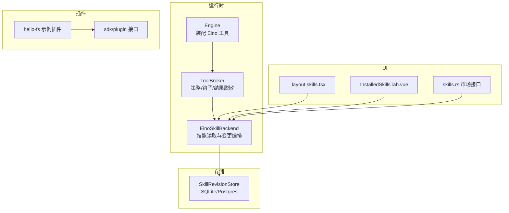
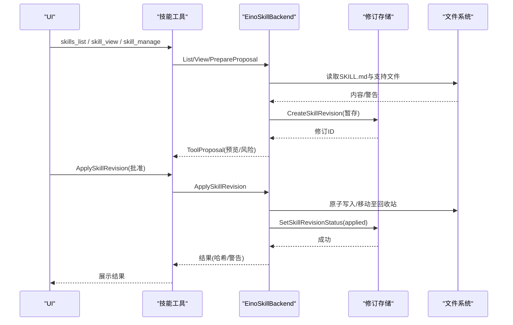
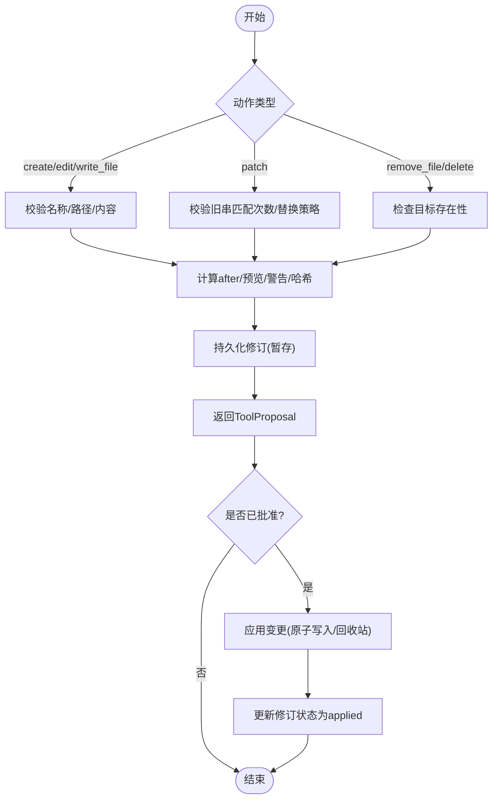
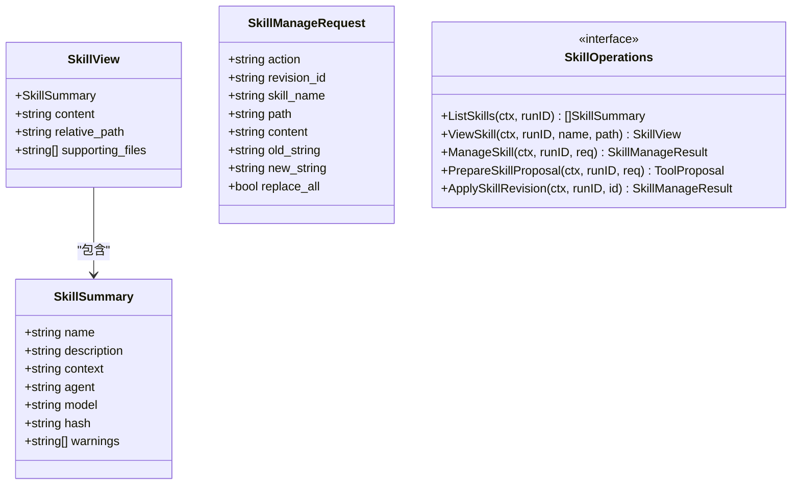
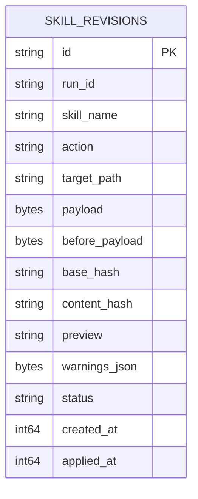
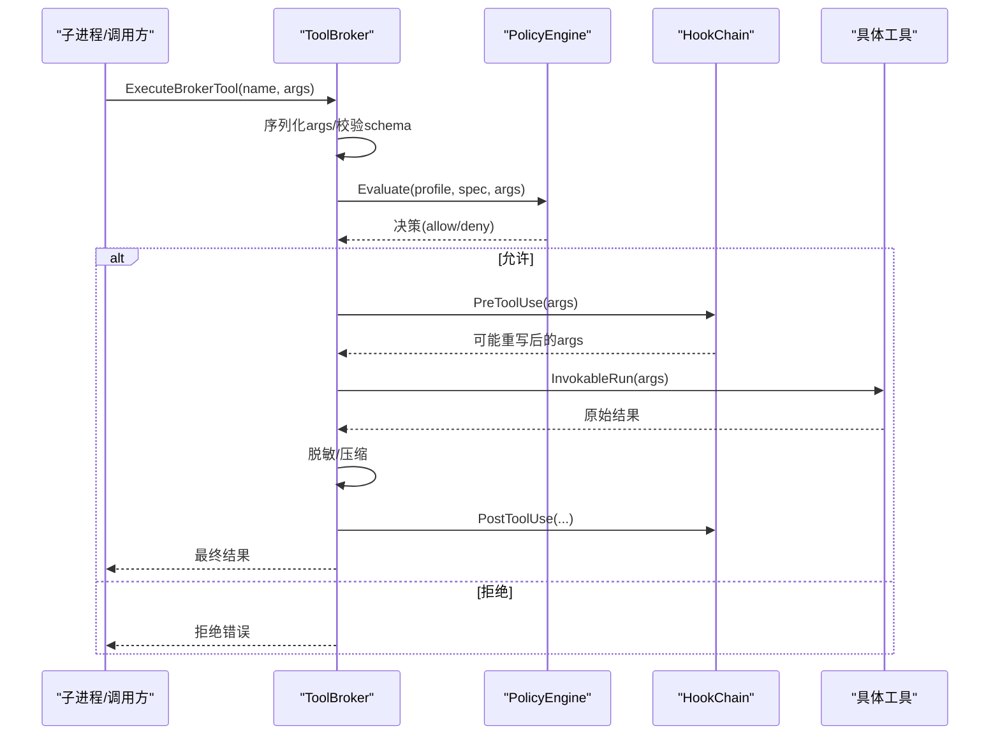
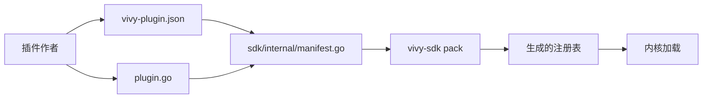
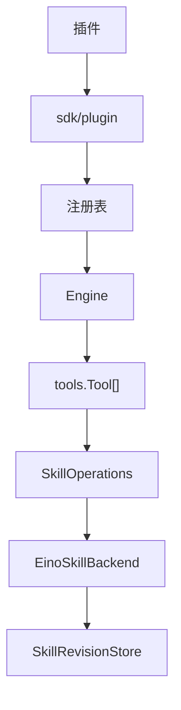

# 技能管理工具

<cite>
**本文引用的文件**
- [internal/runtime/skills_backend.go](file://internal/runtime/skills_backend.go)
- [internal/tools/skills.go](file://internal/tools/skills.go)
- [internal/domain/skill.go](file://internal/domain/skill.go)
- [internal/storage/postgres/skill_revisions.go](file://internal/storage/postgres/skill_revisions.go)
- [internal/storage/sqlite/skill_revisions.go](file://internal/storage/sqlite/skill_revisions.go)
- [internal/runtime/toolbroker.go](file://internal/runtime/toolbroker.go)
- [internal/runtime/engine.go](file://internal/runtime/engine.go)
- [sdk/plugin/plugin.go](file://sdk/plugin/plugin.go)
- [plugins/hello-fs/vivy-plugin.json](file://plugins/hello-fs/vivy-plugin.json)
- [plugins/hello-fs/plugin.go](file://plugins/hello-fs/plugin.go)
- [sdk/internal/manifest.go](file://sdk/internal/manifest.go)
- [docs/architecture/VIVY-PLUGIN-SPEC.md](file://docs/architecture/VIVY-PLUGIN-SPEC.md)
- [ui/src/routes/_layout.skills.tsx](file://ui/src/routes/_layout.skills.tsx)
- [ui/agent-diva-source/agent-diva-gui/src/components/settings/InstalledSkillsTab.vue](file://ui/agent-diva-source/agent-diva-gui/src/components/settings/InstalledSkillsTab.vue)
- [ui/agent-diva-source/agent-diva-manager/src/handlers/skills.rs](file://ui/agent-diva-source/agent-diva-manager/src/handlers/skills.rs)
- [ui/agent-diva-source/agent-diva-sandbox/src/manager.rs](file://ui/agent-diva-source/agent-diva-sandbox/src/manager.rs)
</cite>

## 目录
1. [简介](#简介)
2. [项目结构](#项目结构)
3. [核心组件](#核心组件)
4. [架构总览](#架构总览)
5. [详细组件分析](#详细组件分析)
6. [依赖关系分析](#依赖关系分析)
7. [性能与容量限制](#性能与容量限制)
8. [故障排查指南](#故障排查指南)
9. [结论](#结论)
10. [附录：使用示例与最佳实践](#附录使用示例与最佳实践)

## 简介
本仓库实现了 Vivy 的“技能（Skill）”管理与执行体系。技能以只读、可信根的文件形式存在，通过 Eino 中间件暴露给模型；同时提供人类审核的变更流程（创建、编辑、补丁、删除、回滚），并通过持久化修订记录实现可审计、可恢复的版本控制。插件体系通过 sdk/plugin 暴露最小能力窗口，配合清单校验与打包生成注册表，确保插件与内核边界清晰。运行时通过策略引擎、沙箱管理器、工具代理链对工具调用进行权限控制、资源配额与安全隔离。

## 项目结构
技能相关代码主要分布在以下层次：
- 领域模型：技能修订状态与数据结构
- 运行时后端：Eino Skill 后端、工具封装、策略与钩子
- 存储层：SQLite/PostgreSQL 的技能修订持久化
- SDK/插件：插件接口、清单校验、示例插件
- UI：技能列表、查看、上传、市场搜索与安装

**图表来源**
- [internal/runtime/engine.go:61-117](file://internal/runtime/engine.go#L61-L117)
- [internal/runtime/toolbroker.go:12-92](file://internal/runtime/toolbroker.go#L12-L92)
- [internal/runtimeskills_backend.go:35-85](file://internal/runtimeskills_backend.go#L35-L85)
- [internal/storage/postgres/skill_revisions.go:15-85](file://internal/storage/postgres/skill_revisions.go#L15-L85)
- [internal/storage/sqlite/skill_revisions.go:15-85](file://internal/storage/sqlite/skill_revisions.go#L15-L85)
- [sdk/plugin/plugin.go:61-82](file://sdk/plugin/plugin.go#L61-L82)
- [plugins/hello-fs/plugin.go:17-27](file://plugins/hello-fs/plugin.go#L17-L27)
- [ui/src/routes/_layout.skills.tsx](file://ui/src/routes/_layout.skills.tsx)
- [ui/agent-diva-source/agent-diva-gui/src/components/settings/InstalledSkillsTab.vue:36-103](file://ui/agent-diva-source/agent-diva-gui/src/components/settings/InstalledSkillsTab.vue#L36-L103)
- [ui/agent-diva-source/agent-diva-manager/src/handlers/skills.rs:80-117](file://ui/agent-diva-source/agent-diva-manager/src/handlers/skills.rs#L80-L117)

**章节来源**
- [internal/runtime/engine.go:61-117](file://internal/runtime/engine.go#L61-L117)
- [internal/runtime/toolbroker.go:12-92](file://internal/runtime/toolbroker.go#L12-L92)
- [internal/runtimeskills_backend.go:35-85](file://internal/runtimeskills_backend.go#L35-L85)

## 核心组件
- 技能后端（EinoSkillBackend）：负责技能的发现、读取、预览、受限支持文件访问，以及人类审核驱动的变更提案与执行。
- 工具封装（tools/skills）：将技能操作暴露为模型可调用的工具，包含列表、查看与管理三类工具。
- 修订存储（SkillRevisionStore）：持久化技能变更的暂存、审批与生效状态，支持 SQLite 与 Postgres 两种实现。
- 策略与执行（ToolBroker + PolicyEngine）：在工具调用前后进行参数校验、策略评估、钩子重写与结果脱敏。
- 插件体系（sdk/plugin + 示例插件）：限定插件仅能通过最小 Env 访问工作区文件，清单由 SDK 校验并参与打包。

**章节来源**
- [internal/runtimeskills_backend.go:35-85](file://internal/runtimeskills_backend.go#L35-L85)
- [internal/tools/skills.go:12-62](file://internal/tools/skills.go#L12-L62)
- [internal/storage/postgres/skill_revisions.go:15-85](file://internal/storage/postgres/skill_revisions.go#L15-L85)
- [internal/storage/sqlite/skill_revisions.go:15-85](file://internal/storage/sqlite/skill_revisions.go#L15-L85)
- [internal/runtime/toolbroker.go:12-92](file://internal/runtime/toolbroker.go#L12-L92)
- [sdk/plugin/plugin.go:61-82](file://sdk/plugin/plugin.go#L61-L82)

## 架构总览
技能在运行时的生命周期包括：
- 注册与发现：从受信任根目录扫描技能目录，解析 SKILL.md 的前置元数据，构建前端可用的摘要视图。
- 加载与执行：通过 Eino 中间件将技能作为只读能力暴露给模型；支持读取受限的支持文件。
- 变更与版本：所有写操作先形成“修订提案”，经人类审核后应用；删除走回收站机制，支持回滚。
- 安全与治理：路径白名单、大小限制、二进制检测、敏感词扫描；策略引擎与沙箱管理器协同限制命令与网络。
- 插件集成：插件通过 sdk/plugin 暴露工具，清单由 SDK 校验，打包后成为一代 EXE 的一部分。

**图表来源**
- [internal/tools/skills.go:72-168](file://internal/tools/skills.go#L72-L168)
- [internal/runtimeskills_backend.go:113-236](file://internal/runtimeskills_backend.go#L113-L236)
- [internal/storage/postgres/skill_revisions.go:15-85](file://internal/storage/postgres/skill_revisions.go#L15-L85)
- [internal/storage/sqlite/skill_revisions.go:15-85](file://internal/storage/sqlite/skill_revisions.go#L15-L85)

## 详细组件分析

### 技能后端（EinoSkillBackend）
职责与要点：
- 只读后端：List/Get/ListSkills/ViewSkill 提供受控的技能元数据与内容读取。
- 变更编排：ManageSkill/PrepareSkillProposal 生成带预览与风险的修订提案；ApplySkillRevision 在人类批准后应用变更。
- 安全约束：限制最大字节数、文件数量、路径范围；禁止符号链接；二进制与过大文件拒绝；文本扫描告警。
- 回滚与回收：删除进入 .vivy-trash 目录；支持按修订回滚到 before_payload。

**图表来源**
- [internal/runtimeskills_backend.go:127-236](file://internal/runtimeskills_backend.go#L127-L236)
- [internal/runtimeskills_backend.go:414-481](file://internal/runtimeskills_backend.go#L414-L481)
- [internal/runtimeskills_backend.go:511-583](file://internal/runtimeskills_backend.go#L511-L583)

**章节来源**
- [internal/runtimeskills_backend.go:35-85](file://internal/runtimeskills_backend.go#L35-L85)
- [internal/runtimeskills_backend.go:113-236](file://internal/runtimeskills_backend.go#L113-L236)
- [internal/runtimeskills_backend.go:269-368](file://internal/runtimeskills_backend.go#L269-L368)
- [internal/runtimeskills_backend.go:414-481](file://internal/runtimeskills_backend.go#L414-L481)
- [internal/runtimeskills_backend.go:511-583](file://internal/runtimeskills_backend.go#L511-L583)

### 技能工具封装（tools/skills）
- 三个工具：skills_list（只读）、skill_view（只读，支持受限支持文件）、skill_manage（可写，需人类审批）。
- 参数解码与校验：强制 action/name 必填，可选 replace_all 布尔转换。
- 提案与执行：若上下文携带 revision_id，则直接执行 Apply；否则走 Prepare -> 审批 -> Apply 流程。

**图表来源**
- [internal/tools/skills.go:18-62](file://internal/tools/skills.go#L18-L62)

**章节来源**
- [internal/tools/skills.go:72-168](file://internal/tools/skills.go#L72-L168)
- [internal/tools/skills.go:170-197](file://internal/tools/skills.go#L170-L197)

### 修订存储（SkillRevisionStore）
- 统一接口：Create/Get/ListPending/SetStatus。
- 双实现：SQLite 与 Postgres，均维护 status 字段（pending/applied/rejected/failed）与时间戳。
- 并发安全：SetStatus 使用乐观锁（WHERE status=pending），冲突时返回版本冲突错误。

**图表来源**
- [internal/storage/postgres/skill_revisions.go:15-85](file://internal/storage/postgres/skill_revisions.go#L15-L85)
- [internal/storage/sqlite/skill_revisions.go:15-85](file://internal/storage/sqlite/skill_revisions.go#L15-L85)
- [internal/domain/skill.go:3-31](file://internal/domain/skill.go#L3-L31)

**章节来源**
- [internal/storage/postgres/skill_revisions.go:15-85](file://internal/storage/postgres/skill_revisions.go#L15-L85)
- [internal/storage/sqlite/skill_revisions.go:15-85](file://internal/storage/sqlite/skill_revisions.go#L15-L85)
- [internal/domain/skill.go:3-31](file://internal/domain/skill.go#L3-L31)

### 策略与执行（ToolBroker + PolicyEngine）
- 参数校验与安全：调用前验证 schema 与安全性，必要时经 Hook 重写后再评估。
- 策略决策：根据 Profile 与 ToolSpec 评估允许/拒绝，输出治理事件。
- 结果脱敏：对工具返回结果进行敏感信息脱敏，限制最大返回字节。

**图表来源**
- [internal/runtime/toolbroker.go:12-92](file://internal/runtime/toolbroker.go#L12-L92)

**章节来源**
- [internal/runtime/toolbroker.go:12-92](file://internal/runtime/toolbroker.go#L12-L92)

### 插件体系（sdk/plugin + hello-fs）
- 最小窗口：插件仅能 import sdk/plugin，通过 Env 访问工作区文件，禁止直接 OS/内部包/Eino。
- 清单校验：SDK 校验 apiVersion、name/version/seam/grants/tools.schema 等，失败即拒收。
- 打包注册：pack 生成 Register() 注册表，内核仅调用注册表，不直接 import 插件。

**图表来源**
- [sdk/plugin/plugin.go:61-82](file://sdk/plugin/plugin.go#L61-L82)
- [sdk/internal/manifest.go:38-96](file://sdk/internal/manifest.go#L38-L96)
- [plugins/hello-fs/vivy-plugin.json:1-21](file://plugins/hello-fs/vivy-plugin.json#L1-L21)
- [plugins/hello-fs/plugin.go:17-27](file://plugins/hello-fs/plugin.go#L17-L27)
- [docs/architecture/VIVY-PLUGIN-SPEC.md:141-154](file://docs/architecture/VIVY-PLUGIN-SPEC.md#L141-L154)

**章节来源**
- [sdk/plugin/plugin.go:61-82](file://sdk/plugin/plugin.go#L61-L82)
- [sdk/internal/manifest.go:38-96](file://sdk/internal/manifest.go#L38-L96)
- [plugins/hello-fs/vivy-plugin.json:1-21](file://plugins/hello-fs/vivy-plugin.json#L1-L21)
- [plugins/hello-fs/plugin.go:17-27](file://plugins/hello-fs/plugin.go#L17-L27)
- [docs/architecture/VIVY-PLUGIN-SPEC.md:141-154](file://docs/architecture/VIVY-PLUGIN-SPEC.md#L141-L154)

## 依赖关系分析
- 运行时装配：Engine 将 tools.Tool 包装为 Eino 工具节点，注入 Runner；工具选择器基于请求选择可见工具集。
- 技能后端依赖：依赖 storage.SkillRevisionStore 与文件系统；对外暴露 einoskill.Backend 与 tools.SkillOperations。
- 插件依赖：插件仅依赖 sdk/plugin；内核通过生成的注册表加载插件工具。

**图表来源**
- [internal/runtime/engine.go:61-117](file://internal/runtime/engine.go#L61-L117)
- [internal/runtimeskills_backend.go:32-33](file://internal/runtimeskills_backend.go#L32-L33)
- [sdk/plugin/plugin.go:61-82](file://sdk/plugin/plugin.go#L61-L82)

**章节来源**
- [internal/runtime/engine.go:61-117](file://internal/runtime/engine.go#L61-L117)
- [internal/runtimeskills_backend.go:32-33](file://internal/runtimeskills_backend.go#L32-L33)

## 性能与容量限制
- 文件大小与数量：单技能内容上限、支持文件数量上限、路径长度上限、预览长度上限。
- 二进制与过大文件：读取支持文件时检测二进制或超限，直接拒绝。
- 文本扫描：对敏感词与指令覆盖短语进行扫描并生成警告，辅助人工审批。
- 结果压缩：工具返回结果会被压缩与脱敏，避免上下文膨胀。

**章节来源**
- [internal/runtimeskills_backend.go:25-30](file://internal/runtimeskills_backend.go#L25-L30)
- [internal/runtimeskills_backend.go:104-109](file://internal/runtimeskills_backend.go#L104-L109)
- [internal/runtimeskills_backend.go:567-583](file://internal/runtimeskills_backend.go#L567-L583)
- [internal/runtime/toolbroker.go:83-92](file://internal/runtime/toolbroker.go#L83-L92)

## 故障排查指南
- 修订未生效：检查修订状态是否为 pending；确认 runID 绑定一致；查看 base_hash 是否变化导致“目标已变更”。
- 路径越界：技能目录与支撑文件必须位于受信任根内；路径不得包含 .. 或绝对路径；禁止符号链接。
- 参数错误：skill_manage 要求 action/name 必填；patch 需要唯一匹配或显式 ReplaceAll；write_file 需目标存在。
- 策略拒绝：工具调用被策略拒绝时，检查 Profile、ToolSpec 与 Hook 重写后的参数是否仍被允许。
- 沙箱拒绝：命令不在白名单或路径逃逸工作区将被拒绝；只读模式下禁止执行命令。

**章节来源**
- [internal/runtimeskills_backend.go:180-236](file://internal/runtimeskills_backend.go#L180-L236)
- [internal/runtimeskills_backend.go:326-368](file://internal/runtimeskills_backend.go#L326-L368)
- [internal/tools/skills.go:170-197](file://internal/tools/skills.go#L170-L197)
- [internal/runtime/toolbroker.go:52-82](file://internal/runtime/toolbroker.go#L52-L82)
- [internal/runtime/sandbox_manager.go:85-173](file://internal/runtime/sandbox_manager.go#L85-L173)

## 结论
该技能管理工具以“只读可信根 + 人类审核变更”为核心设计，结合修订持久化、策略与沙箱治理、插件最小窗口，提供了安全可控的技能生态。通过 Eino 中间件与工具代理链，技能既能被模型发现与使用，又能保持严格的权限与资源边界。UI 层提供完整的技能浏览、上传与市场集成入口，便于开发与运维。

## 附录：使用示例与最佳实践

### 技能开发
- 目录规范：每个技能一个目录，内含 SKILL.md（YAML 前置元数据 + 正文）。
- 元数据要求：description 必填；frontmatter name 应与目录名一致。
- 支持文件：仅限 references/templates/scripts/assets 子目录，且不可为符号链接。
- 安全建议：避免在文档中出现密钥、系统指令覆盖、外部命令引用。

**章节来源**
- [internal/runtimeskills_backend.go:294-319](file://internal/runtimeskills_backend.go#L294-L319)
- [internal/runtimeskills_backend.go:341-368](file://internal/runtimeskills_backend.go#L341-L368)
- [internal/runtimeskills_backend.go:511-529](file://internal/runtimeskills_backend.go#L511-L529)
- [internal/runtimeskills_backend.go:567-583](file://internal/runtimeskills_backend.go#L567-L583)

### 部署与发布
- 插件打包：使用 vivy-sdk verify/pack 校验清单并生成新一代 EXE；pack 会生成注册表，内核仅加载注册表。
- 版本管理：插件 version 遵循 semver；Generation 清单记录插件出处与哈希。
- 热重载：当前实现以“下一代 EXE”为隔离单元；不在运行时动态替换插件。

**章节来源**
- [docs/architecture/VIVY-PLUGIN-SPEC.md:158-182](file://docs/architecture/VIVY-PLUGIN-SPEC.md#L158-L182)
- [docs/architecture/VIVY-PLUGIN-SPEC.md:186-200](file://docs/architecture/VIVY-PLUGIN-SPEC.md#L186-L200)
- [docs/architecture/VIVY-PLUGIN-SPEC.md:225-233](file://docs/architecture/VIVY-PLUGIN-SPEC.md#L225-L233)

### 测试与监控
- 单元测试：插件与工具均可独立测试；集成测试由内核拉取注册表执行。
- 治理事件：每次工具调用都会产生策略评估事件，便于审计与追踪。
- 日志脱敏：工具返回结果自动脱敏，避免泄露敏感信息。

**章节来源**
- [docs/architecture/VIVY-PLUGIN-SPEC.md:141-154](file://docs/architecture/VIVY-PLUGIN-SPEC.md#L141-L154)
- [internal/runtime/toolbroker.go:56-59](file://internal/runtime/toolbroker.go#L56-L59)
- [internal/runtime/toolbroker.go:83-92](file://internal/runtime/toolbroker.go#L83-L92)

### 权限控制与沙箱隔离
- 策略引擎：基于 Profile 与 ToolSpec 评估允许/拒绝；Hook 重写后重新评估。
- 沙箱模式：只读/工作区写入/危险全开放；命令白名单；网络策略默认拒绝私有 IP。
- 路径保护：工作区内路径校验，防止逃逸；只读模式禁止执行命令。

**章节来源**
- [internal/runtime/toolbroker.go:52-82](file://internal/runtime/toolbroker.go#L52-L82)
- [internal/runtime/sandbox_manager.go:27-73](file://internal/runtime/sandbox_manager.go#L27-L73)
- [internal/runtime/sandbox_manager.go:85-173](file://internal/runtime/sandbox_manager.go#L85-L173)

### 技能市场集成
- 搜索与精选：提供市场搜索与精选技能接口，返回技能条目与总数。
- 安装流程：前端通过 Tauri invoke 调用后端安装接口，完成下载与部署。
- 前端展示：已安装技能页支持搜索、上传 zip、删除等操作。

**章节来源**
- [ui/agent-diva-source/agent-diva-manager/src/handlers/skills.rs:80-117](file://ui/agent-diva-source/agent-diva-manager/src/handlers/skills.rs#L80-L117)
- [ui/agent-diva-source/agent-diva-gui/src/api/desktop.ts:765-800](file://ui/agent-diva-source/agent-diva-gui/src/api/desktop.ts#L765-L800)
- [ui/agent-diva-source/agent-diva-gui/src/components/settings/InstalledSkillsTab.vue:36-103](file://ui/agent-diva-source/agent-diva-gui/src/components/settings/InstalledSkillsTab.vue#L36-L103)

### 插件化架构最佳实践
- 最小窗口：插件仅通过 sdk/plugin 暴露的能力访问环境，禁止直接操作系统或内核。
- 清单驱动：清单字段严格校验，seam/grants/tools.schema 必须符合规范。
- 隔离升级：插件崩溃影响限于当前代 EXE；通过配方移除问题插件并打包新版本。

**章节来源**
- [sdk/plugin/plugin.go:61-82](file://sdk/plugin/plugin.go#L61-L82)
- [sdk/internal/manifest.go:38-96](file://sdk/internal/manifest.go#L38-L96)
- [docs/architecture/VIVY-PLUGIN-SPEC.md:204-221](file://docs/architecture/VIVY-PLUGIN-SPEC.md#L204-L221)