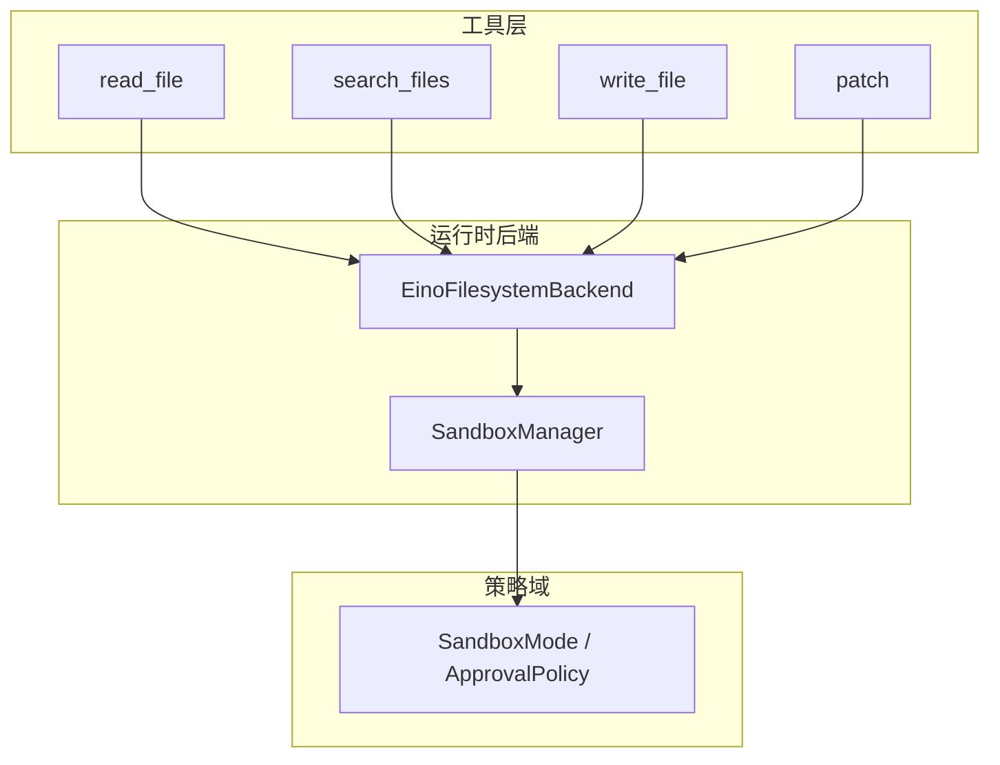
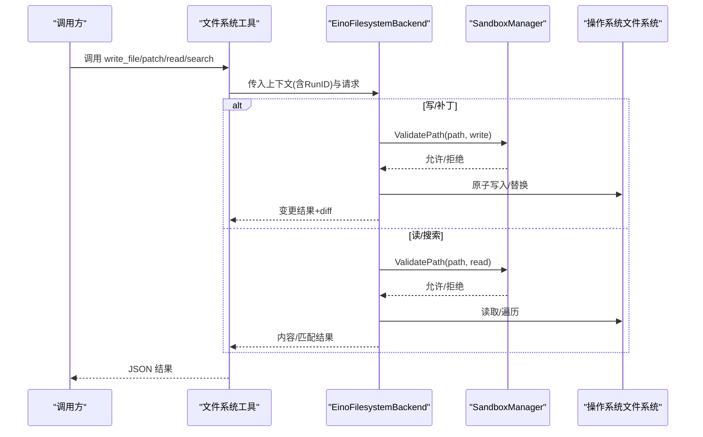
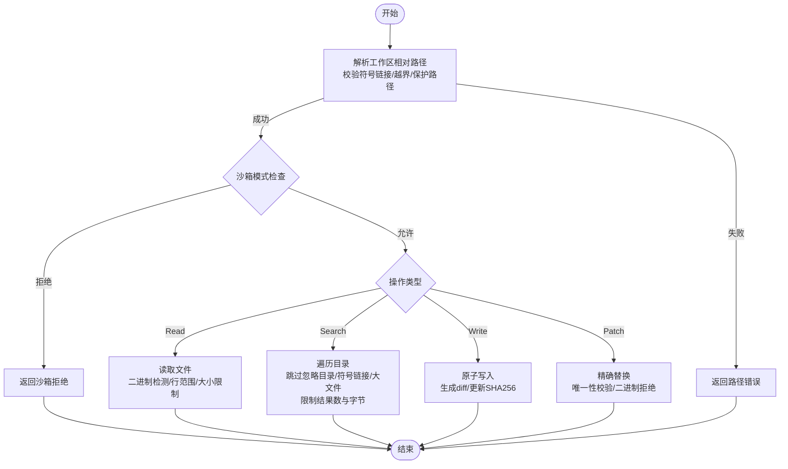
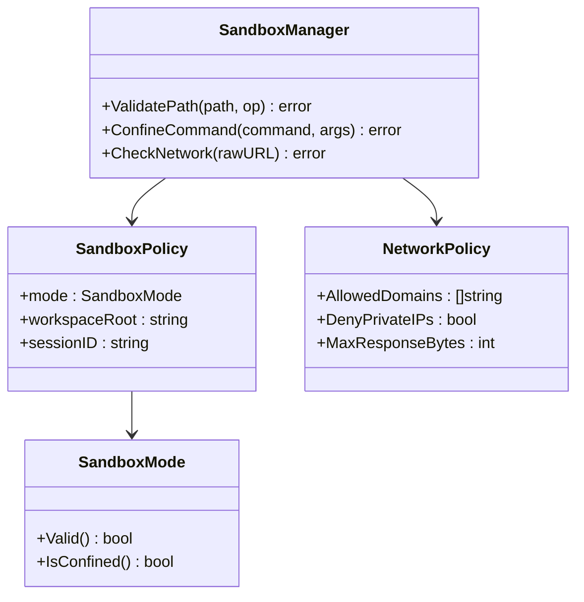
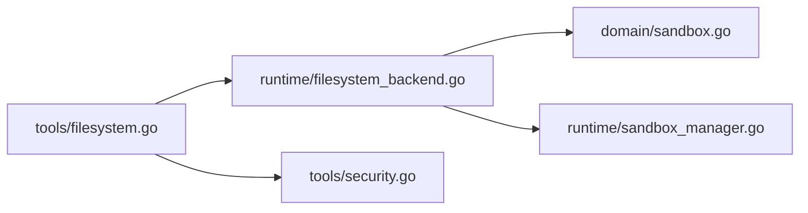

# 文件系统工具

<cite>
**本文引用的文件**
- [internal/tools/filesystem.go](file://internal/tools/filesystem.go)
- [internal/runtime/filesystem_backend.go](file://internal/runtime/filesystem_backend.go)
- [internal/domain/sandbox.go](file://internal/domain/sandbox.go)
- [internal/runtime/sandbox_manager.go](file://internal/runtime/sandbox_manager.go)
- [internal/tools/security.go](file://internal/tools/security.go)
- [plugins/hello-fs/plugin.go](file://plugins/hello-fs/plugin.go)
- [internal/tools/filesystem_test.go](file://internal/tools/filesystem_test.go)
</cite>

## 目录
1. [简介](#简介)
2. [项目结构](#项目结构)
3. [核心组件](#核心组件)
4. [架构总览](#架构总览)
5. [详细组件分析](#详细组件分析)
6. [依赖关系分析](#依赖关系分析)
7. [性能与并发](#性能与并发)
8. [故障排查指南](#故障排查指南)
9. [结论](#结论)
10. [附录：使用示例与最佳实践](#附录：使用示例与最佳实践)

## 简介
本文件系统工具为 Vivy Agent 提供安全、可控的文件读写、搜索与补丁能力。它通过统一的工具契约暴露 read_file、search_files、write_file、patch 四个操作，并在运行时由 EinoFilesystemBackend 实现具体逻辑，结合三层权限沙箱模型（只读、工作区写入、危险全访问）进行路径与操作限制。同时内置二进制检测、大文件截断、差异摘要、原子写入等机制，确保在大规模代码库中稳定高效地工作。

## 项目结构
文件系统能力由“工具层 + 运行时后端 + 沙箱策略”三部分构成：
- 工具层：定义工具规范、参数解析、结果序列化，以及写/补丁操作的预览提案能力。
- 运行时后端：实现具体文件 I/O、搜索、Grep/Glob、Eino 适配、路径校验与安全策略。
- 沙箱策略：以会话为单位控制读/写/执行边界，并支持网络策略。

图表来源
- [internal/tools/filesystem.go:106-300](file://internal/tools/filesystem.go#L106-L300)
- [internal/runtime/filesystem_backend.go:33-58](file://internal/runtime/filesystem_backend.go#L33-L58)
- [internal/runtime/sandbox_manager.go:27-36](file://internal/runtime/sandbox_manager.go#L27-L36)
- [internal/domain/sandbox.go:3-22](file://internal/domain/sandbox.go#L3-L22)

章节来源
- [internal/tools/filesystem.go:13-89](file://internal/tools/filesystem.go#L13-L89)
- [internal/runtime/filesystem_backend.go:24-58](file://internal/runtime/filesystem_backend.go#L24-L58)
- [internal/domain/sandbox.go:3-22](file://internal/domain/sandbox.go#L3-L22)

## 核心组件
- FileOperations 接口：统一抽象 ReadFile、SearchFiles、WriteFile、PatchFile 四种操作，供工具层调用。
- EinoFilesystemBackend：实现 FileOperations 与 Eino 的 filesystem.Backend，负责路径解析、权限校验、I/O、搜索、差异生成、原子写入等。
- SandboxManager：按会话维护沙箱模式与工作区根，校验路径、命令与网络访问。
- 工具封装：read_file/search_files/write_file/patch 四个工具，负责参数解码、类型转换、结果序列化与提案预览。

章节来源
- [internal/tools/filesystem.go:82-104](file://internal/tools/filesystem.go#L82-L104)
- [internal/runtime/filesystem_backend.go:33-58](file://internal/runtime/filesystem_backend.go#L33-L58)
- [internal/runtime/sandbox_manager.go:27-36](file://internal/runtime/sandbox_manager.go#L27-L36)

## 架构总览
文件系统工具的执行流程如下：
- 工具层接收 JSON 参数，解析为结构化请求，注入 RunID，并调用后端 FileOperations。
- 后端先进行沙箱校验（读取或写入），再解析工作区相对路径，执行 I/O 或搜索。
- 写/补丁操作会生成差异摘要，并在人类审批后通过预条件哈希校验防止篡改。
- 所有输出均受大小限制与二进制检测保护，避免溢出和误处理。

图表来源
- [internal/tools/filesystem.go:119-229](file://internal/tools/filesystem.go#L119-L229)
- [internal/runtime/filesystem_backend.go:62-239](file://internal/runtime/filesystem_backend.go#L62-L239)
- [internal/runtime/sandbox_manager.go:85-147](file://internal/runtime/sandbox_manager.go#L85-L147)

## 详细组件分析

### 工具层：read_file、search_files、write_file、patch
- 参数格式
  - read_file：path（必填）、start_line（可选，1-based）、end_line（可选，包含）、max_bytes（可选）。
  - search_files：query（必填）、path（可选，目录或文件）、glob（可选）、max_results（可选）、max_bytes（可选）、case_sensitive（可选布尔）。
  - write_file：path（必填）、content（必填）。内部自动创建父目录。
  - patch：path（必填）、old_string（必填）、new_string（必填）、replace_all（可选布尔）。
- 行为要点
  - 读：返回 content、行范围、总行数、字节数、是否二进制、是否截断。
  - 搜索：逐行扫描文本，跳过二进制与大文件，支持大小写敏感与 glob 过滤，限制结果数量与总字节。
  - 写：若内容与现有相同则不变更；否则原子写入并计算 diff；支持人类审批预条件校验。
  - 补丁：要求 old_string 唯一或显式 replace_all=true；禁止对二进制文件打补丁；同样支持预条件校验。
- 提案预览
  - write_file/patch 支持 PrepareProposal，返回目标路径、差异预览、风险提示与预条件哈希，用于人机审核。

章节来源
- [internal/tools/filesystem.go:20-89](file://internal/tools/filesystem.go#L20-L89)
- [internal/tools/filesystem.go:106-300](file://internal/tools/filesystem.go#L106-L300)
- [internal/tools/filesystem_test.go:42-104](file://internal/tools/filesystem_test.go#L42-L104)

### 运行时后端：EinoFilesystemBackend
- 路径解析与安全
  - 仅接受工作区相对路径，拒绝绝对路径、UNC、NUL、符号链接及越界路径。
  - 保护敏感路径（如 .env、keys.txt、credentials、secrets、.ssh、id_rsa、id_ed25519）。
  - 写时自动创建父目录，并以原子方式落盘，保留文件权限位。
- 大小与编码
  - 默认最大文件大小约 1MB；搜索默认最多 100 条结果、最多 128KB 结果体。
  - 二进制判定：包含 NUL 或非 UTF-8 即视为二进制；文本行过长会截断并省略号显示。
  - 安全前缀截取保证 UTF-8 完整性。
- 搜索与 Grep/Glob
  - 搜索：逐行匹配，忽略 .git/.svn/node_modules，跳过符号链接与大/二进制文件。
  - Grep：支持正则与大小写不敏感；Glob：支持 ** 前缀递归匹配。
- 人类审批与一致性
  - 写/补丁在执行前读取旧内容并计算 SHA256；若上下文携带预期哈希不一致则拒绝，防止人类审核后目标被篡改。
- Eino 适配
  - 实现 Read/Write/Edit/LsInfo/GlobInfo/GrepRaw，将内部请求映射到统一后端。

图表来源
- [internal/runtime/filesystem_backend.go:498-562](file://internal/runtime/filesystem_backend.go#L498-L562)
- [internal/runtime/filesystem_backend.go:62-116](file://internal/runtime/filesystem_backend.go#L62-L116)
- [internal/runtime/filesystem_backend.go:118-190](file://internal/runtime/filesystem_backend.go#L118-L190)
- [internal/runtime/filesystem_backend.go:192-283](file://internal/runtime/filesystem_backend.go#L192-L283)
- [internal/runtime/filesystem_backend.go:574-606](file://internal/runtime/filesystem_backend.go#L574-L606)

章节来源
- [internal/runtime/filesystem_backend.go:24-58](file://internal/runtime/filesystem_backend.go#L24-L58)
- [internal/runtime/filesystem_backend.go:62-283](file://internal/runtime/filesystem_backend.go#L62-L283)
- [internal/runtime/filesystem_backend.go:354-496](file://internal/runtime/filesystem_backend.go#L354-L496)
- [internal/runtime/filesystem_backend.go:498-606](file://internal/runtime/filesystem_backend.go#L498-L606)

### 沙箱与权限模型
- 三层权限模型
  - 只读：禁止所有写操作与命令执行，仅允许工作区内读取。
  - 工作区写入：允许在工作区根目录下读写，禁止逃逸到外部路径。
  - 危险全访问：绕过沙箱限制，但仍审计且仍会拦截明显危险命令。
- 路径校验
  - 规范化路径、解析符号链接、检查 .. 与 UNC、判断是否在 workspace_root 内。
  - 只读模式下直接拒绝写；工作区写入模式下严格限制相对关系。
- 命令与网络
  - 命令白名单：除危险全访问外均需白名单；危险全访问仍阻止格式化/递归删除等危险模式。
  - 网络：仅允许 HTTP/HTTPS，可拒绝私有 IP，支持域名白名单。

图表来源
- [internal/domain/sandbox.go:3-85](file://internal/domain/sandbox.go#L3-L85)
- [internal/runtime/sandbox_manager.go:27-36](file://internal/runtime/sandbox_manager.go#L27-L36)
- [internal/runtime/sandbox_manager.go:85-147](file://internal/runtime/sandbox_manager.go#L85-L147)
- [internal/runtime/sandbox_manager.go:149-234](file://internal/runtime/sandbox_manager.go#L149-L234)

章节来源
- [internal/domain/sandbox.go:3-85](file://internal/domain/sandbox.go#L3-L85)
- [internal/runtime/sandbox_manager.go:27-36](file://internal/runtime/sandbox_manager.go#L27-L36)
- [internal/runtime/sandbox_manager.go:85-147](file://internal/runtime/sandbox_manager.go#L85-L147)
- [internal/runtime/sandbox_manager.go:149-234](file://internal/runtime/sandbox_manager.go#L149-L234)

### 插件侧文件系统访问
- hello-fs 插件通过 SDK 提供的 Env.OpenRead 以只读方式访问工作区文件，并通过 Grants 声明 GrantFSRead 权限。
- 插件内部强制路径为工作区相对路径，拒绝绝对路径、反斜杠、UNC 与 ../ 逃逸。

章节来源
- [plugins/hello-fs/plugin.go:25-65](file://plugins/hello-fs/plugin.go#L25-L65)

## 依赖关系分析
- 工具层依赖 domain.ToolSpec 描述工具元数据，并通过 FileOperations 接口解耦后端实现。
- 运行时后端依赖 WorkspaceManager 获取当前运行工作区根，依赖 SandboxManager 做权限校验。
- 安全模块 tools/security.go 提供通用参数安全校验与脱敏，辅助上层工具减少攻击面。

图表来源
- [internal/tools/filesystem.go:106-300](file://internal/tools/filesystem.go#L106-L300)
- [internal/runtime/filesystem_backend.go:33-58](file://internal/runtime/filesystem_backend.go#L33-L58)
- [internal/runtime/sandbox_manager.go:27-36](file://internal/runtime/sandbox_manager.go#L27-L36)
- [internal/domain/sandbox.go:3-85](file://internal/domain/sandbox.go#L3-L85)
- [internal/tools/security.go:38-71](file://internal/tools/security.go#L38-L71)

章节来源
- [internal/tools/filesystem.go:106-300](file://internal/tools/filesystem.go#L106-L300)
- [internal/runtime/filesystem_backend.go:33-58](file://internal/runtime/filesystem_backend.go#L33-L58)
- [internal/runtime/sandbox_manager.go:27-36](file://internal/runtime/sandbox_manager.go#L27-L36)
- [internal/domain/sandbox.go:3-85](file://internal/domain/sandbox.go#L3-L85)
- [internal/tools/security.go:38-71](file://internal/tools/security.go#L38-L71)

## 性能与并发
- 大文件处理
  - 读：默认限制约 1MB，超出则截断并标记 truncated；支持 start_line/end_line 行级裁剪与 max_bytes 字节限制。
  - 搜索：限制结果数量与总字节，跳过二进制与大文件，避免内存膨胀。
  - 写/补丁：内容超过上限直接拒绝；写采用原子写入减少中间态风险。
- 编码与文本
  - 二进制检测基于 NUL 与非 UTF-8 判定；文本行过长会截断并附加省略号，避免超长响应。
  - 安全前缀截取保证 UTF-8 完整性，避免乱码。
- 并发与隔离
  - 每个运行拥有独立工作区根，路径解析与权限校验基于该根，天然隔离不同 run 的访问范围。
  - 沙箱管理器无状态且线程安全，可在多并发场景共享。
- 优化建议
  - 搜索时使用 glob 缩小范围，设置合理的 max_results 与 max_bytes。
  - 读大文件优先使用 start_line/end_line 定位关键片段。
  - 批量写/补丁前先通过 PrepareProposal 预览差异，减少无效重试。

[本节为通用指导，不直接分析具体文件]

## 故障排查指南
- 常见错误与原因
  - 路径非法：包含 NUL、绝对路径、UNC、.. 逃逸、符号链接、非目录组件。
  - 沙箱拒绝：只读模式写操作、工作区写入模式路径越界、命令不在白名单。
  - 补丁失败：old_string 未找到、出现多次但未开启 replace_all、目标为二进制。
  - 人类审批失效：预条件哈希不一致，说明目标在审核后被修改。
  - 搜索为空：查询为空、目标过大或二进制、忽略目录导致未扫描。
- 定位步骤
  - 检查工具参数是否为空或类型错误（测试用例覆盖参数校验）。
  - 确认当前沙箱模式与工作区根配置是否正确。
  - 查看返回的错误信息，通常包含“filesystem: ...”或“sandbox: ...”前缀。
  - 对于写/补丁，使用 PrepareProposal 提前验证差异与风险。

章节来源
- [internal/tools/filesystem_test.go:83-104](file://internal/tools/filesystem_test.go#L83-L104)
- [internal/runtime/filesystem_backend.go:118-190](file://internal/runtime/filesystem_backend.go#L118-L190)
- [internal/runtime/filesystem_backend.go:192-283](file://internal/runtime/filesystem_backend.go#L192-L283)
- [internal/runtime/sandbox_manager.go:85-147](file://internal/runtime/sandbox_manager.go#L85-L147)

## 结论
本文件系统工具通过清晰的工具契约与强大的运行时后端，提供了安全、可控、高性能的文件操作能力。三层沙箱模型与严格的参数校验、路径保护、二进制检测、大小限制与原子写入共同构成了稳健的安全基线。配合人类审批与预条件哈希，有效降低了误改与恶意篡改风险。建议在复杂工程中结合 glob 与行范围裁剪提升效率，并使用 PrepareProposal 进行变更预览与风险控制。

[本节为总结，不直接分析具体文件]

## 附录：使用示例与最佳实践

### 基本文件操作
- 读取文件片段
  - 使用 read_file，指定 path、start_line、end_line 与 max_bytes，避免一次性加载大文件。
  - 若返回 binary=true，说明内容为二进制，不应作为文本处理。
- 搜索文本
  - 使用 search_files，设置 query、可选 glob 与 case_sensitive，限制 max_results 与 max_bytes。
  - 忽略 .git/.svn/node_modules 等目录，提高搜索效率。
- 写入文件
  - 使用 write_file，path 为工作区相对路径，content 为完整替换内容；会自动创建父目录。
  - 若内容与现有相同，不会触发变更。
- 补丁文件
  - 使用 patch，old_string 必须存在且唯一，或设置 replace_all=true 替换全部匹配。
  - 禁止对二进制文件打补丁。

章节来源
- [internal/tools/filesystem.go:106-300](file://internal/tools/filesystem.go#L106-L300)
- [internal/runtime/filesystem_backend.go:62-283](file://internal/runtime/filesystem_backend.go#L62-L283)

### 批量处理
- 使用 search_files 获取匹配列表，再针对每个文件使用 read_file 读取片段进行处理。
- 对多个文件的写/补丁操作，建议分批执行并记录每次变更的 diff，便于回滚与审计。
- 合理设置 max_results 与 max_bytes，避免单次请求过大。

章节来源
- [internal/runtime/filesystem_backend.go:118-190](file://internal/runtime/filesystem_backend.go#L118-L190)

### 错误处理
- 参数错误：工具层会拒绝未知字段与非法类型（整数/布尔），需检查输入。
- 路径错误：确保路径为工作区相对路径，不包含 .. 或 UNC，避免符号链接。
- 沙箱拒绝：检查当前沙箱模式与工作区根，必要时调整策略。
- 人类审批失败：确保在审核期间目标未被修改，或使用新的 Proposal 重新审核。

章节来源
- [internal/tools/filesystem_test.go:83-104](file://internal/tools/filesystem_test.go#L83-L104)
- [internal/runtime/filesystem_backend.go:498-562](file://internal/runtime/filesystem_backend.go#L498-L562)
- [internal/runtime/sandbox_manager.go:85-147](file://internal/runtime/sandbox_manager.go#L85-L147)

### 性能优化技巧
- 搜索阶段使用 glob 缩小范围，并设置合理的 max_results 与 max_bytes。
- 读取大文件时使用 start_line/end_line 精准定位，避免全量加载。
- 写/补丁前先调用 PrepareProposal 预览差异，减少无效尝试。
- 避免对二进制文件进行文本操作，利用 isBinary 判断。

章节来源
- [internal/runtime/filesystem_backend.go:118-190](file://internal/runtime/filesystem_backend.go#L118-L190)
- [internal/runtime/filesystem_backend.go:62-116](file://internal/runtime/filesystem_backend.go#L62-L116)
- [internal/runtime/filesystem_backend.go:285-352](file://internal/runtime/filesystem_backend.go#L285-L352)

### 安全与合规
- 参数安全：工具层会拒绝包含 NUL、路径穿越、危险命令语法等参数。
- 敏感路径保护：禁止访问 .env、keys.txt、credentials、secrets、.ssh、id_rsa、id_ed25519。
- 网络策略：仅允许 HTTP/HTTPS，可拒绝私有 IP 与未授权域名。
- 脱敏：输出中的密钥与邮箱会被脱敏，避免泄露。

章节来源
- [internal/tools/security.go:38-79](file://internal/tools/security.go#L38-L79)
- [internal/runtime/sandbox_manager.go:185-234](file://internal/runtime/sandbox_manager.go#L185-L234)
- [internal/runtime/filesystem_backend.go:564-572](file://internal/runtime/filesystem_backend.go#L564-L572)