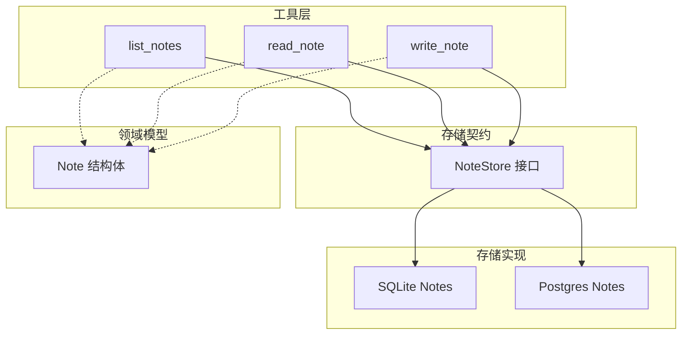
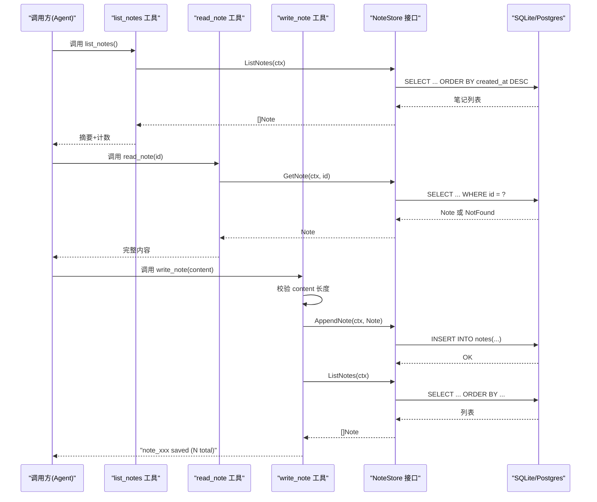
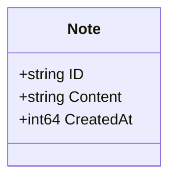
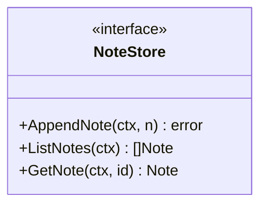
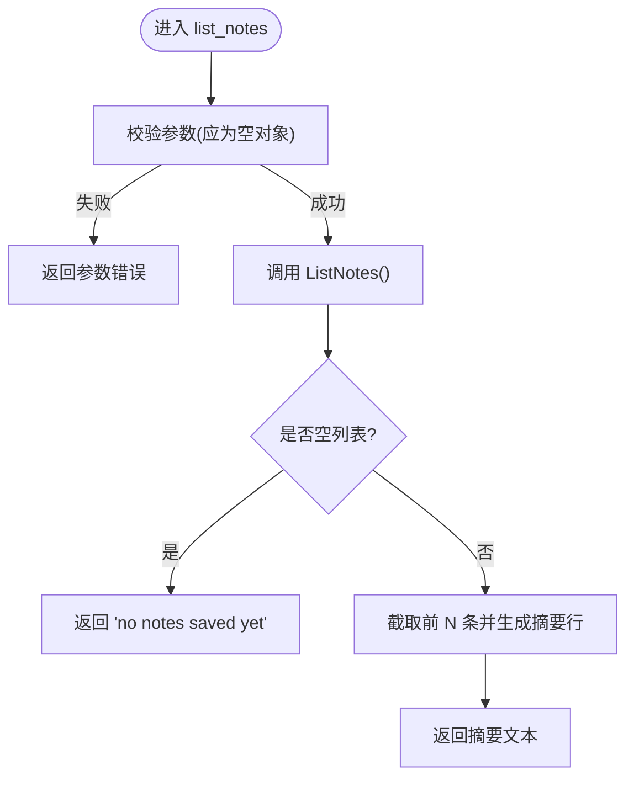
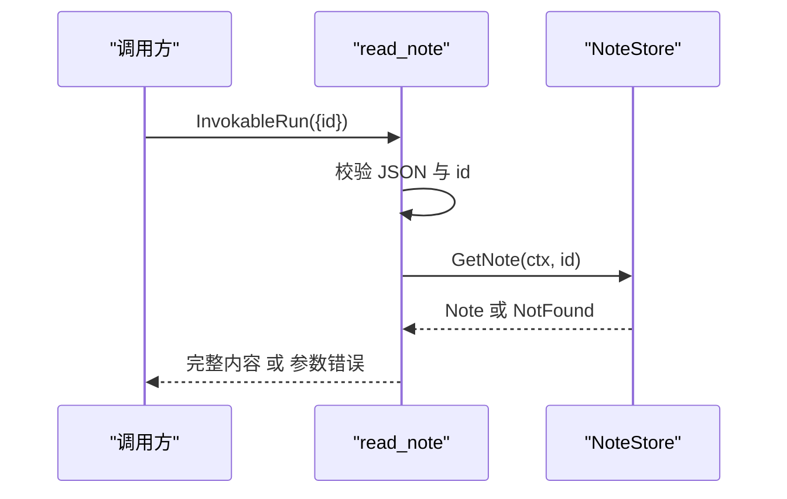
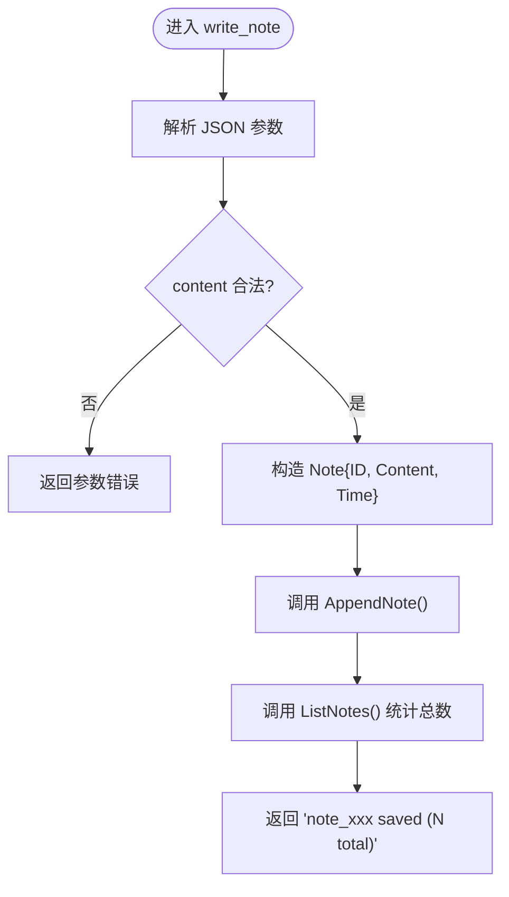
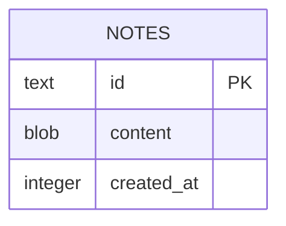
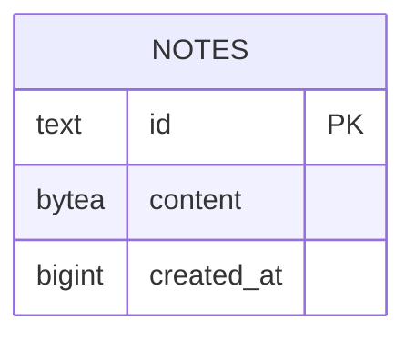
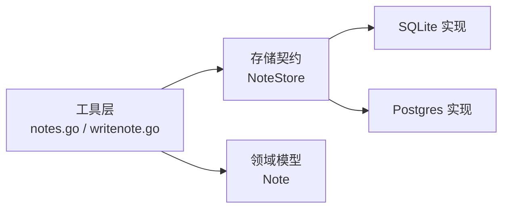

# 笔记管理工具

<cite>
**本文引用的文件**
- [internal/domain/note.go](file://internal/domain/note.go)
- [internal/storage/contracts.go](file://internal/storage/contracts.go)
- [internal/storage/sqlite/sqlite.go](file://internal/storage/sqlite/sqlite.go)
- [internal/storage/sqlite/notes.go](file://internal/storage/sqlite/notes.go)
- [internal/storage/postgres/schema.go](file://internal/storage/postgres/schema.go)
- [internal/storage/postgres/notes.go](file://internal/storage/postgres/notes.go)
- [internal/tools/tools.go](file://internal/tools/tools.go)
- [internal/tools/notes.go](file://internal/tools/notes.go)
- [internal/tools/writenote.go](file://internal/tools/writenote.go)
- [internal/tools/notes_test.go](file://internal/tools/notes_test.go)
</cite>

## 目录
1. [简介](#简介)
2. [项目结构](#项目结构)
3. [核心组件](#核心组件)
4. [架构总览](#架构总览)
5. [详细组件分析](#详细组件分析)
6. [依赖关系分析](#依赖关系分析)
7. [性能与优化](#性能与优化)
8. [故障排查指南](#故障排查指南)
9. [结论](#结论)
10. [附录：使用示例与最佳实践](#附录使用示例与最佳实践)

## 简介
本仓库实现了 Vivy 运行时中的“笔记”能力，提供不可变追加的笔记本（Notebook）持久化能力。通过内置工具暴露读、写、列表面板，供 Agent 在运行中自动或经审批后调用。当前版本为 V1，遵循“只追加、不更新、不删除”的设计，确保可审计与可重放。

- 设计要点
  - 不可变追加：每条笔记一旦写入即不可更改或删除，便于审计与回溯。
  - 列表摘要优先：列出笔记时仅返回最新若干条的摘要，避免事件负载膨胀。
  - 读写分离：读取类工具为只读，自动执行；写入类工具需审批后才执行。
  - 存储抽象：通过统一接口同时支持 SQLite（默认）与 Postgres。

**章节来源**
- [internal/domain/note.go:1-11](file://internal/domain/note.go#L1-L11)
- [internal/tools/notes.go:16-28](file://internal/tools/notes.go#L16-L28)
- [internal/tools/writenote.go:16-25](file://internal/tools/writenote.go#L16-L25)

## 项目结构
围绕笔记功能的关键代码分布在以下位置：
- 领域模型：internal/domain/note.go
- 存储契约：internal/storage/contracts.go
- 存储实现：internal/storage/sqlite/*、internal/storage/postgres/*
- 工具层：internal/tools/*（list_notes、read_note、write_note）
- 测试用例：internal/tools/notes_test.go

**图表来源**
- [internal/tools/notes.go:30-151](file://internal/tools/notes.go#L30-L151)
- [internal/tools/writenote.go:20-79](file://internal/tools/writenote.go#L20-L79)
- [internal/storage/contracts.go:114-123](file://internal/storage/contracts.go#L114-L123)
- [internal/storage/sqlite/notes.go:13-58](file://internal/storage/sqlite/notes.go#L13-L58)
- [internal/storage/postgres/notes.go:13-58](file://internal/storage/postgres/notes.go#L13-L58)
- [internal/domain/note.go:1-11](file://internal/domain/note.go#L1-L11)

**章节来源**
- [internal/storage/sqlite/sqlite.go:17-79](file://internal/storage/sqlite/sqlite.go#L17-L79)
- [internal/storage/postgres/schema.go:101-105](file://internal/storage/postgres/schema.go#L101-L105)

## 核心组件
- 领域模型 Note：包含 ID、Content、CreatedAt，采用 Unix 毫秒时间戳。
- 存储契约 NoteStore：定义 AppendNote、ListNotes、GetNote 三个方法。
- 工具实现
  - list_notes：返回总数与最新若干条摘要，限制输出大小。
  - read_note：按 ID 获取完整内容。
  - write_note：生成唯一 ID、校验内容长度、追加写入并返回计数。
- 存储后端
  - SQLite：默认单写者，迁移脚本创建 notes 表。
  - Postgres：独立实现相同语义的 notes 表与查询。

**章节来源**
- [internal/domain/note.go:1-11](file://internal/domain/note.go#L1-L11)
- [internal/storage/contracts.go:114-123](file://internal/storage/contracts.go#L114-L123)
- [internal/tools/notes.go:30-151](file://internal/tools/notes.go#L30-L151)
- [internal/tools/writenote.go:20-79](file://internal/tools/writenote.go#L20-L79)
- [internal/storage/sqlite/sqlite.go:227-235](file://internal/storage/sqlite/sqlite.go#L227-L235)
- [internal/storage/postgres/schema.go:101-105](file://internal/storage/postgres/schema.go#L101-L105)

## 架构总览
笔记功能的调用链从工具到存储，再到数据库表。

**图表来源**
- [internal/tools/notes.go:49-84](file://internal/tools/notes.go#L49-L84)
- [internal/tools/notes.go:129-150](file://internal/tools/notes.go#L129-L150)
- [internal/tools/writenote.go:50-79](file://internal/tools/writenote.go#L50-L79)
- [internal/storage/sqlite/notes.go:15-58](file://internal/storage/sqlite/notes.go#L15-L58)
- [internal/storage/postgres/notes.go:15-58](file://internal/storage/postgres/notes.go#L15-L58)

## 详细组件分析

### 领域模型：Note
- 字段
  - ID：字符串标识，由写入工具生成。
  - Content：文本内容，受长度限制。
  - CreatedAt：Unix 毫秒时间戳。
- 约束
  - 不可变追加：V1 不提供更新与删除路径。

**图表来源**
- [internal/domain/note.go:1-11](file://internal/domain/note.go#L1-L11)

**章节来源**
- [internal/domain/note.go:1-11](file://internal/domain/note.go#L1-L11)

### 存储契约：NoteStore
- 方法
  - AppendNote：追加一条笔记。
  - ListNotes：按创建时间倒序返回全部笔记。
  - GetNote：按 ID 获取单条笔记，不存在返回未找到错误。
- 设计意图
  - 列表顺序保证“头部”稳定，便于摘要展示与边界控制。

**图表来源**
- [internal/storage/contracts.go:114-123](file://internal/storage/contracts.go#L114-L123)

**章节来源**
- [internal/storage/contracts.go:114-123](file://internal/storage/contracts.go#L114-L123)

### 工具：list_notes
- 行为
  - 无参调用，返回“总数 + 最新若干条”的摘要。
  - 摘要每行仅保留首行内容，并进行字符数截断，防止事件负载过大。
  - 当无笔记时返回友好提示。
- 参数校验
  - 拒绝任何未知字段或非法 JSON。

**图表来源**
- [internal/tools/notes.go:49-84](file://internal/tools/notes.go#L49-L84)
- [internal/tools/notes.go:86-102](file://internal/tools/notes.go#L86-L102)

**章节来源**
- [internal/tools/notes.go:16-28](file://internal/tools/notes.go#L16-L28)
- [internal/tools/notes.go:49-84](file://internal/tools/notes.go#L49-L84)
- [internal/tools/notes.go:86-102](file://internal/tools/notes.go#L86-L102)

### 工具：read_note
- 行为
  - 接收 id 参数，返回对应笔记的完整内容。
  - 找不到笔记时返回结构化参数错误。
- 参数校验
  - 必须为非空字符串，且不允许额外字段。

**图表来源**
- [internal/tools/notes.go:129-150](file://internal/tools/notes.go#L129-L150)

**章节来源**
- [internal/tools/notes.go:104-150](file://internal/tools/notes.go#L104-L150)

### 工具：write_note
- 行为
  - 生成随机 ID（note_ 前缀）。
  - 校验内容非空且不超过上限。
  - 追加写入后再次列出总数，返回“已保存，共 N 条”。
- 安全与审批
  - 该工具为“影响型”，需要审批后才执行。

**图表来源**
- [internal/tools/writenote.go:50-89](file://internal/tools/writenote.go#L50-L89)

**章节来源**
- [internal/tools/writenote.go:16-25](file://internal/tools/writenote.go#L16-L25)
- [internal/tools/writenote.go:20-22](file://internal/tools/writenote.go#L20-L22)
- [internal/tools/writenote.go:50-89](file://internal/tools/writenote.go#L50-L89)

### 存储实现：SQLite
- 初始化与迁移
  - 启动时按序应用迁移脚本，其中 migration003 创建 notes 表。
  - 单写者模式，降低并发锁争用。
- 操作
  - AppendNote：INSERT 插入。
  - ListNotes：ORDER BY created_at DESC, id DESC。
  - GetNote：WHERE id = ?，未命中返回未找到错误。

**图表来源**
- [internal/storage/sqlite/sqlite.go:227-235](file://internal/storage/sqlite/sqlite.go#L227-L235)
- [internal/storage/sqlite/notes.go:15-58](file://internal/storage/sqlite/notes.go#L15-L58)

**章节来源**
- [internal/storage/sqlite/sqlite.go:17-79](file://internal/storage/sqlite/sqlite.go#L17-L79)
- [internal/storage/sqlite/sqlite.go:227-235](file://internal/storage/sqlite/sqlite.go#L227-L235)
- [internal/storage/sqlite/notes.go:13-58](file://internal/storage/sqlite/notes.go#L13-L58)

### 存储实现：Postgres
- 表结构与索引
  - notes 表与 SQLite 语义一致。
  - 其他表存在索引以优化查询（notes 本身主键即为 id）。
- 操作
  - 与 SQLite 一致的 Append/List/Get 语义。

**图表来源**
- [internal/storage/postgres/schema.go:101-105](file://internal/storage/postgres/schema.go#L101-L105)
- [internal/storage/postgres/notes.go:15-58](file://internal/storage/postgres/notes.go#L15-L58)

**章节来源**
- [internal/storage/postgres/schema.go:101-105](file://internal/storage/postgres/schema.go#L101-L105)
- [internal/storage/postgres/notes.go:13-58](file://internal/storage/postgres/notes.go#L13-L58)

### 工具注册与选择
- 注册
  - 内置工具包括 write_note、list_notes、read_note 等，统一通过 Registry 注册。
- 选择
  - 基于关键词匹配进行保守路由，避免无关工具被选中。
  - 注意：关键词中包含 note/notes 的权重较低，避免误选多个笔记工具。

**章节来源**
- [internal/tools/tools.go:243-317](file://internal/tools/tools.go#L243-L317)
- [internal/tools/tools.go:138-202](file://internal/tools/tools.go#L138-L202)

## 依赖关系分析
- 工具层依赖存储契约，不感知具体数据库类型。
- SQLite 与 Postgres 分别实现同一契约，便于替换与扩展。
- 领域模型仅在工具与存储之间传递数据。

**图表来源**
- [internal/tools/notes.go:30-151](file://internal/tools/notes.go#L30-L151)
- [internal/tools/writenote.go:20-79](file://internal/tools/writenote.go#L20-L79)
- [internal/storage/contracts.go:114-123](file://internal/storage/contracts.go#L114-L123)
- [internal/storage/sqlite/notes.go:13-58](file://internal/storage/sqlite/notes.go#L13-L58)
- [internal/storage/postgres/notes.go:13-58](file://internal/storage/postgres/notes.go#L13-L58)
- [internal/domain/note.go:1-11](file://internal/domain/note.go#L1-L11)

**章节来源**
- [internal/storage/contracts.go:114-123](file://internal/storage/contracts.go#L114-L123)

## 性能与优化
- 列表摘要限制
  - 最多返回固定数量的条目，并对每行内容进行首行截断，控制事件负载。
- 排序与索引
  - 列表按 created_at DESC, id DESC 排序，保证“最新在前”的稳定顺序。
  - 单条读取通过主键 id 精确查找，复杂度 O(1)。
- 写入成本
  - 每次写入后再次列出总数用于反馈，属于额外开销；若追求极致性能可在上层缓存计数或异步统计。
- 存储后端
  - SQLite 单写者模式减少锁竞争；Postgres 可通过索引进一步优化复杂查询场景。

[本节为通用指导，不直接分析具体文件]

## 故障排查指南
- 常见错误
  - 参数错误：JSON 格式不正确、缺少必填字段、包含未知字段。
  - 未找到：read_note 传入的 id 不存在。
  - 内容超限：write_note 的内容超过上限。
  - 存储未连接：工具未注入 NoteStore 实例。
- 定位建议
  - 检查工具入参是否符合 Spec 声明。
  - 确认 NoteStore 已正确注入。
  - 查看底层数据库是否存在记录及权限。

**章节来源**
- [internal/tools/notes.go:49-84](file://internal/tools/notes.go#L49-L84)
- [internal/tools/notes.go:129-150](file://internal/tools/notes.go#L129-L150)
- [internal/tools/writenote.go:50-79](file://internal/tools/writenote.go#L50-L79)
- [internal/tools/notes_test.go:141-194](file://internal/tools/notes_test.go#L141-L194)

## 结论
当前笔记系统以“不可变追加”为核心原则，提供稳定的列表摘要与精确的单条读取能力，并通过统一的存储契约屏蔽底层差异。对于未来扩展（如标签、搜索、版本管理），建议在保持契约不变的前提下，增加索引与投影层，避免破坏现有只读工具的稳定性。

[本节为总结性内容，不直接分析具体文件]

## 附录：使用示例与最佳实践

### 基础操作
- 创建笔记
  - 调用 write_note，传入 content 字段，系统将生成 ID 并持久化。
  - 参考路径：[internal/tools/writenote.go:50-79](file://internal/tools/writenote.go#L50-L79)
- 列出笔记
  - 调用 list_notes，返回总数与最新若干条摘要。
  - 参考路径：[internal/tools/notes.go:49-84](file://internal/tools/notes.go#L49-L84)
- 读取笔记
  - 调用 read_note，传入 id，返回完整内容。
  - 参考路径：[internal/tools/notes.go:129-150](file://internal/tools/notes.go#L129-L150)

**章节来源**
- [internal/tools/writenote.go:50-79](file://internal/tools/writenote.go#L50-L79)
- [internal/tools/notes.go:49-84](file://internal/tools/notes.go#L49-L84)
- [internal/tools/notes.go:129-150](file://internal/tools/notes.go#L129-L150)

### 批量处理
- 由于 V1 不支持更新与删除，批量“处理”通常指多次写入与汇总读取。
- 建议在上层聚合结果，避免对存储层造成过多往返。

[本节为通用指导，不直接分析具体文件]

### 复杂查询
- 当前仅提供按 id 精确读取与全量倒序列表。
- 如需更复杂的过滤与检索，可在上层构建索引或视图，但需保持向后兼容。

[本节为通用指导，不直接分析具体文件]

### 权限控制与协作
- 工具级权限
  - 读取工具为只读，自动执行；写入工具需审批后才执行。
- 会话级策略
  - 存储层支持 sandbox_mode 与 approval_policy 字段，可用于细粒度权限边界。
- 协作
  - 当前为单进程/单写者设计；多实例部署需依赖外部协调机制。

**章节来源**
- [internal/tools/notes.go:16-28](file://internal/tools/notes.go#L16-L28)
- [internal/tools/writenote.go:16-25](file://internal/tools/writenote.go#L16-L25)
- [internal/storage/sqlite/sqlite.go:396-405](file://internal/storage/sqlite/sqlite.go#L396-L405)
- [internal/storage/postgres/schema.go:101-105](file://internal/storage/postgres/schema.go#L101-L105)

### 数据导出与导入
- 导出
  - 通过 ListNotes 获取全部笔记，结合 ReadNote 获取完整内容，组装为 JSON 或 CSV。
- 导入
  - 逐条调用 AppendNote 写入；注意 ID 冲突与重复内容去重。

[本节为通用指导，不直接分析具体文件]

### 性能优化建议
- 控制列表摘要规模，避免大响应。
- 利用主键快速读取单条笔记。
- 在高并发场景考虑 Postgres 与合适的索引策略。
- 将“写入后统计总数”的操作下沉或缓存以减少往返。

[本节为通用指导，不直接分析具体文件]

### 最佳实践
- 始终使用工具层 API 访问笔记，不要绕过契约直连数据库。
- 对长内容做分段或压缩后再写入，避免超出上限。
- 在 UI 或上层服务中对列表进行分页或增量加载。
- 对敏感信息脱敏后再持久化或日志记录。

[本节为通用指导，不直接分析具体文件]