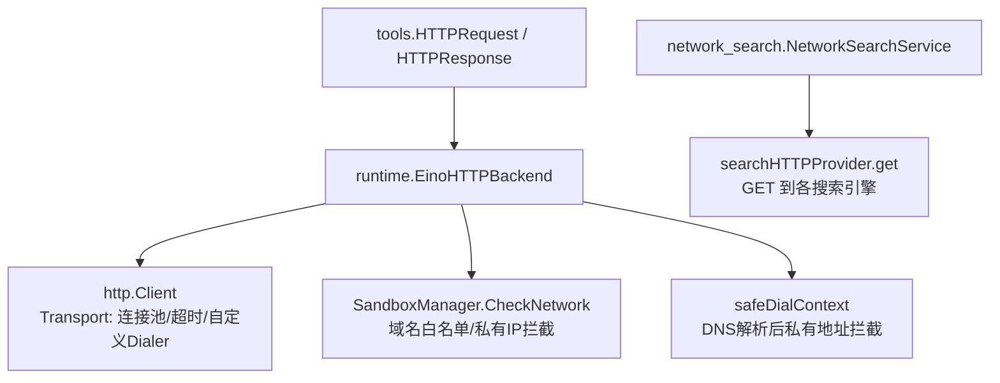
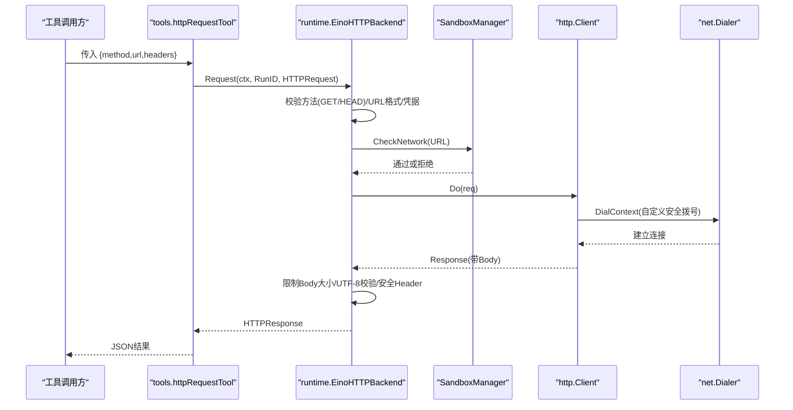
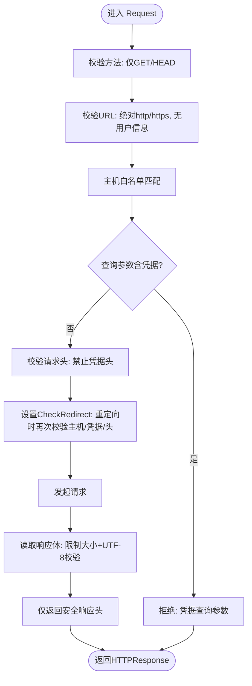
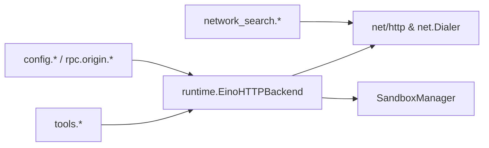

# 网络请求工具

<cite>
**本文引用的文件**
- [internal/tools/http_request.go](file://internal/tools/http_request.go)
- [internal/runtime/http_request.go](file://internal/runtime/http_request.go)
- [internal/runtime/network_search.go](file://internal/runtime/network_search.go)
- [internal/rpc/origin.go](file://internal/rpc/origin.go)
- [internal/config/config.go](file://internal/config/config.go)
- [internal/storage/postgres/postgres.go](file://internal/storage/postgres/postgres.go)
- [ui/agent-diva-source/agent-diva-core/src/security/policy.rs](file://ui/agent-diva-source/agent-diva-core/src/security/policy.rs)
- [ui/agent-diva-source/agent-diva-core/src/error_category.rs](file://ui/agent-diva-source/agent-diva-core/src/error_category.rs)
- [ui/agent-diva-source/agent-diva-core/src/rate_limiter.rs](file://ui/agent-diva-source/agent-diva-core/src/rate_limiter.rs)
- [ui/agent-diva-source/agent-diva-sandbox/src/policy.rs](file://ui/agent-diva-source/agent-diva-sandbox/src/policy.rs)
- [ui/agent-diva-source/agent-diva-gui/src/components/settings/SandboxSettingsSection.vue](file://ui/agent-diva-source/agent-diva-gui/src/components/settings/SandboxSettingsSection.vue)
</cite>

## 目录
1. [简介](#简介)
2. [项目结构](#项目结构)
3. [核心组件](#核心组件)
4. [架构总览](#架构总览)
5. [详细组件分析](#详细组件分析)
6. [依赖关系分析](#依赖关系分析)
7. [性能考量](#性能考量)
8. [故障排查指南](#故障排查指南)
9. [结论](#结论)
10. [附录](#附录)

## 简介
本文件面向 Vivy 运行时中的“网络请求工具”，系统性说明其 HTTP 客户端能力、安全策略与配置项，覆盖 GET/HEAD 请求、请求头设置、参数传递、响应处理、超时与连接池管理、重定向控制、URL 白名单、私有 IP 拦截、以及错误分类与重试建议。同时给出 RESTful API 调用、文件上传下载、流式响应的实践指引与限制说明，并提供调试与性能优化建议。

## 项目结构
网络请求工具由“工具接口定义 + 运行时实现 + 搜索服务”三部分构成：
- 工具接口与数据模型：定义统一的 HTTP 请求/响应结构与工具规范。
- 运行时实现：提供受限的 HTTP 客户端，内置 URL 白名单、敏感信息过滤、重定向校验、响应体大小限制等安全与稳定性保障。
- 网络搜索服务：封装多个搜索引擎的 HTTP 访问，具备默认超时与结果限制。

图表来源
- [internal/tools/http_request.go:14-31](file://internal/tools/http_request.go#L14-L31)
- [internal/runtime/http_request.go:21-53](file://internal/runtime/http_request.go#L21-L53)
- [internal/runtime/network_search.go:35-54](file://internal/runtime/network_search.go#L35-L54)

章节来源
- [internal/tools/http_request.go:1-72](file://internal/tools/http_request.go#L1-L72)
- [internal/runtime/http_request.go:1-216](file://internal/runtime/http_request.go#L1-L216)
- [internal/runtime/network_search.go:1-334](file://internal/runtime/network_search.go#L1-L334)

## 核心组件
- 工具层（tools）
  - 定义 HTTP 请求/响应数据结构与工具规格，暴露统一的可调用入口。
- 运行层（runtime）
  - 实现受限的 HTTP 客户端：仅允许 GET/HEAD；强制 URL 白名单；禁止携带凭据的请求头与查询参数；限制响应体大小；拦截私有/本地 IP；重定向时再次校验目标域与凭据。
- 搜索服务（runtime）
  - 聚合多搜索引擎的 HTTP 访问，统一超时、限流与结果裁剪。

章节来源
- [internal/tools/http_request.go:14-49](file://internal/tools/http_request.go#L14-L49)
- [internal/runtime/http_request.go:21-120](file://internal/runtime/http_request.go#L21-L120)
- [internal/runtime/network_search.go:35-90](file://internal/runtime/network_search.go#L35-L90)

## 架构总览
下图展示一次受控的 HTTP 请求从工具调用到网络发送的关键路径与安全检查点。

图表来源
- [internal/tools/http_request.go:51-71](file://internal/tools/http_request.go#L51-L71)
- [internal/runtime/http_request.go:54-120](file://internal/runtime/http_request.go#L54-L120)
- [internal/runtime/http_request.go:189-206](file://internal/runtime/http_request.go#L189-L206)

## 详细组件分析

### HTTP 工具接口与数据模型
- 请求/响应结构
  - 请求包含方法、URL、可选非敏感请求头。
  - 响应包含状态码、最终 URL、受限响应头、文本 Body、内容类型、是否不可信标记。
- 工具规范
  - 名称、描述、只读标志、关键词、参数枚举与必填约束。

使用要点
- 仅支持 GET 与 HEAD；其他方法将被拒绝。
- URL 必须为绝对 http/https，且不允许在 URL 中携带用户信息。
- 请求头禁止携带凭据类字段。

章节来源
- [internal/tools/http_request.go:14-49](file://internal/tools/http_request.go#L14-L49)
- [internal/tools/http_request.go:51-71](file://internal/tools/http_request.go#L51-L71)

### 运行时 HTTP 客户端（EinoHTTPBackend）
功能概览
- 方法限制：仅允许 GET/HEAD。
- URL 校验：必须为绝对 http/https，无用户信息。
- 白名单：按主机名匹配，支持通配子域。
- 凭据防护：
  - 请求头：禁止 Authorization、Proxy-Authorization、Cookie、Set-Cookie、X-API-Key、X-Auth-Token 等。
  - 查询参数：禁止 token、api_key、key、password、secret、credential、authorization 等键。
- 重定向控制：自动跟随前会校验新 URL 的主机是否在白名单、是否仍无凭据、并重新校验请求头。
- 响应限制：
  - 最大响应体字节数可配置，超出即拒绝。
  - 仅支持 UTF-8 文本响应，二进制响应被拒绝。
  - 返回的安全响应头仅包含 Content-Type 与 Content-Length。
- 连接与超时：
  - 全局 Client 超时默认 10 秒。
  - Transport 启用 HTTP/2、空闲连接池（最大空闲连接 8，空闲超时 30 秒）。
  - 自定义拨号器：对非显式本地主机的域名进行 DNS 解析，若解析到私有/本地/链路本地/未指定地址则拒绝。
- 沙箱网络策略：
  - 通过 SandboxManager 校验 URL 是否符合网络策略（如禁止私有 IP）。

图表来源
- [internal/runtime/http_request.go:54-120](file://internal/runtime/http_request.go#L54-L120)
- [internal/runtime/http_request.go:149-167](file://internal/runtime/http_request.go#L149-L167)
- [internal/runtime/http_request.go:169-187](file://internal/runtime/http_request.go#L169-L187)
- [internal/runtime/http_request.go:189-215](file://internal/runtime/http_request.go#L189-L215)

章节来源
- [internal/runtime/http_request.go:21-120](file://internal/runtime/http_request.go#L21-L120)
- [internal/runtime/http_request.go:122-167](file://internal/runtime/http_request.go#L122-L167)
- [internal/runtime/http_request.go:169-215](file://internal/runtime/http_request.go#L169-L215)

### 网络搜索服务（NetworkSearchService）
- 聚合 Bing、Google、DuckDuckGo、SearxNG、Wikipedia 等搜索提供者。
- 统一使用 http.Client 并设置默认超时（约 8 秒）。
- 限制单次搜索结果数量与响应体大小。
- 对 429 等错误进行识别与提示。

章节来源
- [internal/runtime/network_search.go:35-90](file://internal/runtime/network_search.go#L35-L90)
- [internal/runtime/network_search.go:92-142](file://internal/runtime/network_search.go#L92-L142)

### 配置与网络安全策略
- 服务器源白名单校验：用于服务端 CORS 等场景，要求 loopback 主机与合法 origin 列表。
- RPC Origin 规范化：确保 origin 为绝对 http/https，不含多余片段。
- 存储连接池：Postgres 连接池通过标准库打开，便于复用连接。
- 前端沙箱策略：
  - 网络访问开关与策略级别。
  - 超时配置项。
  - 速率限制与错误分类（可重试/致命/超时/认证等）。

章节来源
- [internal/config/config.go:586-641](file://internal/config/config.go#L586-L641)
- [internal/rpc/origin.go:75-105](file://internal/rpc/origin.go#L75-L105)
- [internal/storage/postgres/postgres.go:113-122](file://internal/storage/postgres/postgres.go#L113-L122)
- [ui/agent-diva-source/agent-diva-sandbox/src/policy.rs:9-33](file://ui/agent-diva-source/agent-diva-sandbox/src/policy.rs#L9-L33)
- [ui/agent-diva-source/agent-diva-gui/src/components/settings/SandboxSettingsSection.vue:258-286](file://ui/agent-diva-source/agent-diva-gui/src/components/settings/SandboxSettingsSection.vue#L258-L286)
- [ui/agent-diva-source/agent-diva-core/src/error_category.rs:7-28](file://ui/agent-diva-source/agent-diva-core/src/error_category.rs#L7-L28)
- [ui/agent-diva-source/agent-diva-core/src/rate_limiter.rs:53-123](file://ui/agent-diva-source/agent-diva-core/src/rate_limiter.rs#L53-L123)

## 依赖关系分析
- tools 层仅定义接口与数据模型，不依赖具体网络实现。
- runtime 层实现 HTTPOperations，依赖 http.Client、net.Dialer、SandboxManager。
- network_search 依赖 http.Client 与各搜索引擎端点。
- 配置与策略影响运行时行为（白名单、超时、连接池、网络策略）。

图表来源
- [internal/tools/http_request.go:29-31](file://internal/tools/http_request.go#L29-L31)
- [internal/runtime/http_request.go:21-53](file://internal/runtime/http_request.go#L21-L53)
- [internal/runtime/network_search.go:35-54](file://internal/runtime/network_search.go#L35-L54)
- [internal/config/config.go:586-641](file://internal/config/config.go#L586-L641)
- [internal/rpc/origin.go:75-105](file://internal/rpc/origin.go#L75-L105)

章节来源
- [internal/tools/http_request.go:1-72](file://internal/tools/http_request.go#L1-L72)
- [internal/runtime/http_request.go:1-216](file://internal/runtime/http_request.go#L1-L216)
- [internal/runtime/network_search.go:1-334](file://internal/runtime/network_search.go#L1-L334)

## 性能考量
- 连接池
  - 最大空闲连接 8，空闲超时 30 秒，适合短生命周期并发请求。
  - 可通过调整 Transport 参数进一步优化高并发场景。
- 超时
  - Client 默认超时 10 秒；搜索服务默认 8 秒。
  - 拨号阶段有 5 秒超时，避免长时间阻塞。
- 响应体限制
  - 默认限制响应体大小，防止恶意大响应导致内存压力。
- 头部最小化
  - 仅返回必要响应头，减少传输与解析开销。
- 搜索限流
  - 搜索结果数量上限与响应体上限，避免过度消耗。

[本节为通用性能讨论，无需特定文件引用]

## 故障排查指南
常见问题与定位思路
- 方法不被允许
  - 现象：POST/PUT/DELETE 等方法被拒绝。
  - 原因：工具仅支持 GET/HEAD。
  - 解决：改用 GET/HEAD；如需写操作，请通过其他受控通道。
- 主机不在白名单
  - 现象：请求被拒绝并提示主机未授权。
  - 原因：目标主机未加入允许列表。
  - 解决：将目标主机添加到白名单配置。
- 凭据被拒绝
  - 现象：请求头或查询参数中包含敏感键被拒绝。
  - 原因：安全策略禁止凭据泄露。
  - 解决：将凭据放入受控环境或后端代理，避免直接出现在请求中。
- 重定向失败
  - 现象：重定向到新主机后被拒绝。
  - 原因：重定向目标不在白名单或携带凭据。
  - 解决：确保重定向目标也在白名单，且不携带凭据。
- 响应过大或二进制
  - 现象：响应体超过限制或被判定为非 UTF-8。
  - 原因：安全限制保护内存与文本消费。
  - 解决：在服务端压缩/分页；或通过其他受控方式获取二进制数据。
- 私有 IP 拦截
  - 现象：DNS 解析到私有/本地地址被拒绝。
  - 原因：防止内网访问风险。
  - 解决：使用公网可达域名或调整网络策略。

章节来源
- [internal/runtime/http_request.go:54-120](file://internal/runtime/http_request.go#L54-L120)
- [internal/runtime/http_request.go:149-167](file://internal/runtime/http_request.go#L149-L167)
- [internal/runtime/http_request.go:189-215](file://internal/runtime/http_request.go#L189-L215)

## 结论
该网络请求工具以“只读、受限、可审计”为核心设计原则，通过严格的 URL 白名单、凭据防护、重定向校验、响应体限制与私有 IP 拦截，确保 Agent 在网络侧的安全边界。配合合理的超时与连接池配置，可在保证安全的前提下获得稳定的网络访问能力。对于需要写入、流式或二进制数据的场景，应通过其他受控通道或后端代理完成。

[本节为总结性内容，无需特定文件引用]

## 附录

### 使用示例（基于仓库现有能力）
- RESTful API 调用（GET/HEAD）
  - 构造绝对 http/https URL，并确保目标主机在白名单。
  - 仅设置非敏感请求头，避免凭据字段。
  - 参考：工具参数与调用流程。
  - 章节来源
    - [internal/tools/http_request.go:37-49](file://internal/tools/http_request.go#L37-L49)
    - [internal/tools/http_request.go:51-71](file://internal/tools/http_request.go#L51-L71)

- 文件上传/下载
  - 下载：可使用 GET 获取文本型资源，注意响应体大小限制与 UTF-8 校验。
  - 上传：当前工具不支持 POST/PUT 等写操作；需通过其他受控通道或后端代理完成。
  - 章节来源
    - [internal/runtime/http_request.go:54-61](file://internal/runtime/http_request.go#L54-L61)
    - [internal/runtime/http_request.go:102-111](file://internal/runtime/http_request.go#L102-L111)

- 流式响应处理
  - 当前实现一次性读取响应体并限制大小，不适合长流式场景。
  - 建议：在服务端分块返回小段文本，或使用专用流式通道。
  - 章节来源
    - [internal/runtime/http_request.go:102-111](file://internal/runtime/http_request.go#L102-L111)

- 错误分类与重试策略
  - 可将超时、临时错误归类为可重试；配置/认证/非法输入为不可重试。
  - 结合速率限制器计算等待时间，实施指数退避。
  - 章节来源
    - [ui/agent-diva-source/agent-diva-core/src/error_category.rs:7-28](file://ui/agent-diva-source/agent-diva-core/src/error_category.rs#L7-L28)
    - [ui/agent-diva-source/agent-diva-core/src/rate_limiter.rs:53-123](file://ui/agent-diva-source/agent-diva-core/src/rate_limiter.rs#L53-L123)

- 调试技巧
  - 开启更详细的日志（在调用方），记录 URL、方法、请求头（脱敏）、响应状态与长度。
  - 使用测试服务器模拟不同响应（正常、过大、二进制、重定向）。
  - 章节来源
    - [internal/runtime/http_request_test.go:15-100](file://internal/runtime/http_request_test.go#L15-L100)