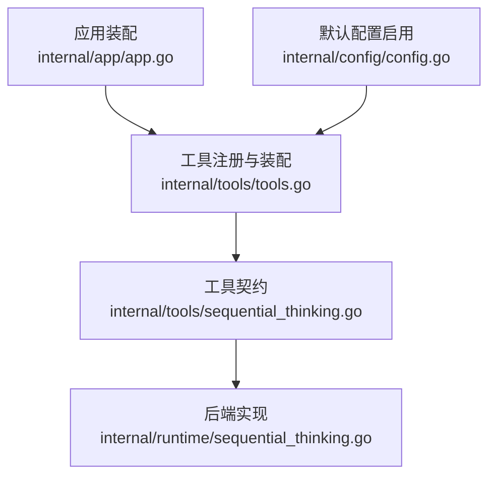
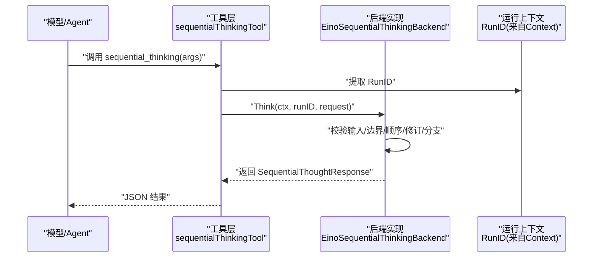
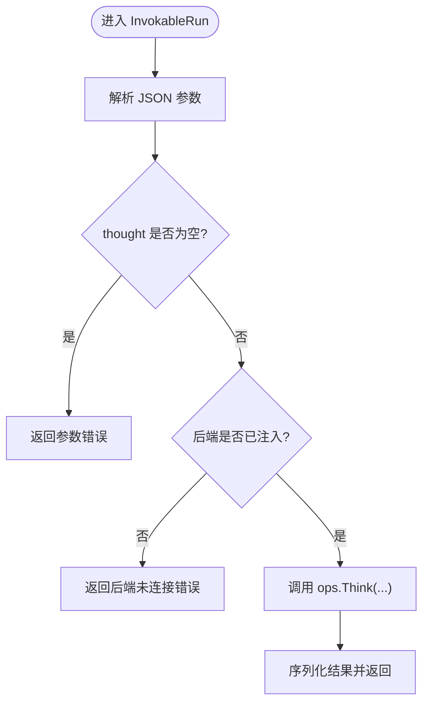
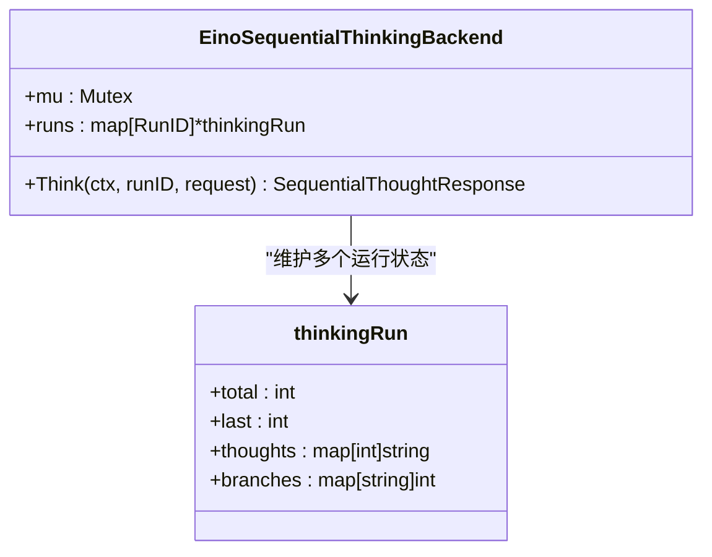
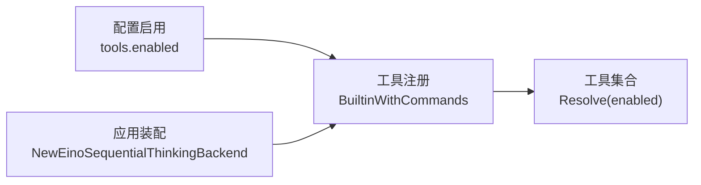
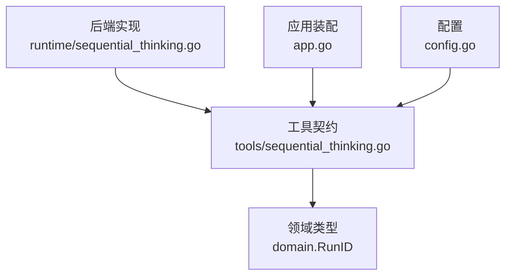

# 顺序思考工具

<cite>
**本文引用的文件**
- [sequential_thinking.go](file://internal/tools/sequential_thinking.go)
- [sequential_thinking.go](file://internal/runtime/sequential_thinking.go)
- [tools.go](file://internal/tools/tools.go)
- [app.go](file://internal/app/app.go)
- [config.go](file://internal/config/config.go)
- [sequential_thinking_test.go](file://internal/runtime/sequential_thinking_test.go)
</cite>

## 目录
1. [简介](#简介)
2. [项目结构](#项目结构)
3. [核心组件](#核心组件)
4. [架构总览](#架构总览)
5. [详细组件分析](#详细组件分析)
6. [依赖关系分析](#依赖关系分析)
7. [性能与约束](#性能与约束)
8. [故障排查指南](#故障排查指南)
9. [结论](#结论)
10. [附录：使用示例与最佳实践](#附录使用示例与最佳实践)

## 简介
顺序思考工具为 Agent 提供“思维链推理”的本地化、有界、可回溯的结构化工具。它允许模型在单次运行中按步骤记录思考、修订历史步骤、从任意历史步骤分支，并受运行时强约束保护（步数上限、单条思考大小上限、严格顺序控制）。该工具无外部副作用，仅用于记录当前运行的推理状态，便于可视化、调试与优化。

## 项目结构
顺序思考能力由三层组成：
- 工具契约层：定义工具名称、参数、调用协议与返回结构。
- 后端实现层：维护每个 Run 的有序思考状态，支持修订与分支。
- 装配与配置层：应用启动时创建后端实例，注册到工具集合并通过配置启用。

图表来源
- [sequential_thinking.go:12-55](file://internal/tools/sequential_thinking.go#L12-L55)
- [sequential_thinking.go:19-80](file://internal/runtime/sequential_thinking.go#L19-L80)
- [tools.go:287-316](file://internal/tools/tools.go#L287-L316)
- [app.go:188-190](file://internal/app/app.go#L188-L190)
- [config.go:298-300](file://internal/config/config.go#L298-L300)

章节来源
- [sequential_thinking.go:12-55](file://internal/tools/sequential_thinking.go#L12-L55)
- [sequential_thinking.go:19-80](file://internal/runtime/sequential_thinking.go#L19-L80)
- [tools.go:287-316](file://internal/tools/tools.go#L287-L316)
- [app.go:188-190](file://internal/app/app.go#L188-L190)
- [config.go:298-300](file://internal/config/config.go#L298-L300)

## 核心组件
- 工具接口与请求/响应
  - 工具名：sequential_thinking
  - 入参：thought、thought_number、total_thoughts、next_thought_needed、is_revision、revises_thought、branch_from_thought、branch_id
  - 出参：thought、thought_number、total_thoughts、next_thought_needed、is_revision、branch_id、accepted
- 后端状态
  - 以 RunID 为作用域，维护 last、total、thoughts 映射、branches 映射
  - 支持修订（覆盖指定步骤）与分支（从历史步骤分叉）
- 工具装配
  - 通过内置工具集注册，并在应用启动时注入后端实现
  - 默认配置已启用 sequential_thinking

章节来源
- [sequential_thinking.go:14-33](file://internal/tools/sequential_thinking.go#L14-L33)
- [sequential_thinking.go:19-29](file://internal/runtime/sequential_thinking.go#L19-L29)
- [tools.go:294-316](file://internal/tools/tools.go#L294-L316)
- [app.go:188-190](file://internal/app/app.go#L188-L190)
- [config.go:298-300](file://internal/config/config.go#L298-L300)

## 架构总览
顺序思考工具遵循“工具契约—后端实现—应用装配”的分层设计。工具层负责参数解析与错误包装；后端层负责状态校验与持久化（内存态）；应用层负责生命周期管理与配置生效。

图表来源
- [sequential_thinking.go:56-81](file://internal/tools/sequential_thinking.go#L56-L81)
- [sequential_thinking.go:36-80](file://internal/runtime/sequential_thinking.go#L36-L80)

## 详细组件分析

### 工具契约层（internal/tools/sequential_thinking.go）
- 职责
  - 定义工具名、描述、参数规范
  - 解析 JSON 参数并做基础非空校验
  - 将调用转发给后端，并将结果序列化为工具输出
- 关键行为
  - thought 必填且不可为空
  - 若未注入后端，返回明确错误
  - 通过 RunIDFromContext 获取当前运行标识

图表来源
- [sequential_thinking.go:56-81](file://internal/tools/sequential_thinking.go#L56-L81)

章节来源
- [sequential_thinking.go:12-55](file://internal/tools/sequential_thinking.go#L12-L55)
- [sequential_thinking.go:56-81](file://internal/tools/sequential_thinking.go#L56-L81)

### 后端实现层（internal/runtime/sequential_thinking.go）
- 职责
  - 维护每个 Run 的思考序列、修订与分支
  - 强制顺序推进、步数上限、单条大小上限
  - 支持修订与分支，保证目标存在性
- 数据结构
  - thinkingRun：包含 total、last、thoughts、branches
- 约束与规则
  - 每 Run 最多 32 步
  - 单条思考最大 16KB
  - 必须按序递增（除非修订或分支）
  - 修订需指向已有步骤；分支需指向已有步骤
  - total_thoughts 不可小于历史最大值

图表来源
- [sequential_thinking.go:19-29](file://internal/runtime/sequential_thinking.go#L19-L29)
- [sequential_thinking.go:36-80](file://internal/runtime/sequential_thinking.go#L36-L80)

章节来源
- [sequential_thinking.go:14-17](file://internal/runtime/sequential_thinking.go#L14-L17)
- [sequential_thinking.go:36-80](file://internal/runtime/sequential_thinking.go#L36-L80)

### 装配与配置（internal/tools/tools.go、internal/app/app.go、internal/config/config.go）
- 工具注册
  - 通过 BuiltinWithCommands 组装内置工具，当传入 sequential 后端时注册 sequential_thinking
- 应用装配
  - 创建 EinoSequentialThinkingBackend 并注入工具集
- 配置启用
  - 默认 tools.enabled 包含 sequential_thinking

图表来源
- [tools.go:287-316](file://internal/tools/tools.go#L287-L316)
- [app.go:188-190](file://internal/app/app.go#L188-L190)
- [config.go:298-300](file://internal/config/config.go#L298-L300)

章节来源
- [tools.go:287-316](file://internal/tools/tools.go#L287-L316)
- [app.go:188-190](file://internal/app/app.go#L188-L190)
- [config.go:298-300](file://internal/config/config.go#L298-L300)

## 依赖关系分析
- 耦合关系
  - 工具层依赖 domain.RunID 与工具基础设施（序列化、错误类型）
  - 后端实现依赖 domain.RunID 与工具契约接口
  - 应用装配依赖工具注册器与配置
- 外部依赖
  - 无网络/文件系统副作用，纯内存状态
- 潜在循环
  - 单向依赖，无反向引用

图表来源
- [sequential_thinking.go:12-33](file://internal/tools/sequential_thinking.go#L12-L33)
- [sequential_thinking.go:19-80](file://internal/runtime/sequential_thinking.go#L19-L80)
- [app.go:188-190](file://internal/app/app.go#L188-L190)
- [config.go:298-300](file://internal/config/config.go#L298-L300)

章节来源
- [sequential_thinking.go:12-33](file://internal/tools/sequential_thinking.go#L12-L33)
- [sequential_thinking.go:19-80](file://internal/runtime/sequential_thinking.go#L19-L80)
- [app.go:188-190](file://internal/app/app.go#L188-L190)
- [config.go:298-300](file://internal/config/config.go#L298-L300)

## 性能与约束
- 步数上限：每 Run 最多 32 步，避免无限循环
- 单条大小上限：单条思考最大 16KB，防止上下文膨胀
- 顺序强制：非修订/分支时必须按 last+1 推进，确保线性可追踪
- 内存占用：每个 Run 维护 thoughts 与 branches 映射，适合短时会话
- 并发安全：使用互斥锁保护 runs 表，线程安全

章节来源
- [sequential_thinking.go:14-17](file://internal/runtime/sequential_thinking.go#L14-L17)
- [sequential_thinking.go:50-80](file://internal/runtime/sequential_thinking.go#L50-L80)

## 故障排查指南
- 常见错误与定位
  - thought 为空：检查工具调用参数是否遗漏或空白
  - 超出步数限制：确认 total_thoughts 与 thought_number 是否在 1..32 范围内
  - 超出单条大小：压缩思考内容或拆分为多步
  - 顺序错误：确保非修订/分支场景下 thought_number = last+1
  - 修订/分支目标不存在：确认 revises_thought / branch_from_thought 指向已有步骤
  - 后端未连接：检查应用装配是否成功注入 sequential_ops
- 验证方式
  - 参考单元测试对范围、顺序、修订、分支的断言路径进行复现与回归

章节来源
- [sequential_thinking.go:36-80](file://internal/runtime/sequential_thinking.go#L36-L80)
- [sequential_thinking_test.go:11-38](file://internal/runtime/sequential_thinking_test.go#L11-L38)

## 结论
顺序思考工具以最小侵入的方式为 Agent 提供了结构化、可回溯、可分支的思维链能力。通过严格的运行时约束与清晰的工具契约，既保证了可控性与可观测性，又为上层规划、决策树构建与复杂问题求解提供了可靠的基础设施。

## 附录：使用示例与最佳实践

### 思维模板与推理规则
- 模板字段
  - thought：当前推理步骤
  - thought_number：步骤序号（从 1 开始）
  - total_thoughts：预期总步数（受运行时上限约束）
  - next_thought_needed：是否需要继续下一步
  - is_revision：是否修订历史步骤
  - revises_thought：被修订的步骤号
  - branch_from_thought：从哪个历史步骤分支
  - branch_id：稳定分支标识（可选）
- 推理规则
  - 先规划后执行：先用少量步骤明确目标与策略，再逐步细化
  - 小步快跑：每次只写一个清晰、可验证的子结论
  - 及时收敛：当证据充分时设置 next_thought_needed=false
  - 谨慎修订：仅在发现错误或新证据时修订，保留修订标记以便审计
  - 分支探索：对不确定路径使用分支，保持主线简洁

### 复杂问题求解流程（示例）
- 分解问题：用 2-3 步列出子问题与约束
- 逐步求解：每步聚焦一个子问题，记录中间结果与依据
- 交叉验证：对关键结论进行二次推导或反向检验
- 分支对比：对多种方案建立分支，比较优劣
- 收敛决策：汇总证据，给出最终结论与理由

### 多步骤规划与决策树构建
- 规划阶段
  - 使用 sequential_thinking 记录计划要点与假设
  - 为每个关键决策点建立分支，标注条件与后果
- 执行阶段
  - 按步骤推进，必要时回退到最近稳定点修订
- 验证阶段
  - 对关键步骤增加验证型思考，形成闭环

### 可视化、调试与优化
- 可视化建议
  - 基于 thoughts 映射绘制时间线
  - 基于 branches 映射绘制决策树
  - 高亮修订步骤，展示变更前后差异
- 调试技巧
  - 优先检查 thought_number 顺序与边界
  - 关注 total_thoughts 是否被后端修正
  - 利用单元测试思路构造边界用例
- 优化方向
  - 控制单条长度，避免超限
  - 合理拆分步骤，提升可读性与可维护性
  - 减少不必要的修订，保持主线稳定

### 与其他工具的协作模式
- 与 Todo/List/Task 工具协作：将思考结论转化为待办或任务
- 与搜索/HTTP/MCP 工具协作：在思考中引用外部信息，并标注来源
- 与技能/工作区协作：将阶段性产物写入工作区，供后续步骤复用
- 与命令执行协作：在执行前用思考工具声明意图与约束，执行后记录结果

章节来源
- [sequential_thinking.go:14-33](file://internal/tools/sequential_thinking.go#L14-L33)
- [sequential_thinking.go:36-80](file://internal/runtime/sequential_thinking.go#L36-L80)
- [tools.go:294-316](file://internal/tools/tools.go#L294-L316)
- [config.go:298-300](file://internal/config/config.go#L298-L300)
- [sequential_thinking_test.go:11-38](file://internal/runtime/sequential_thinking_test.go#L11-L38)