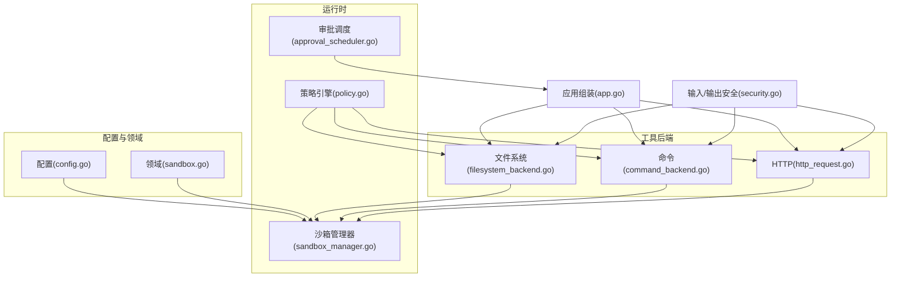
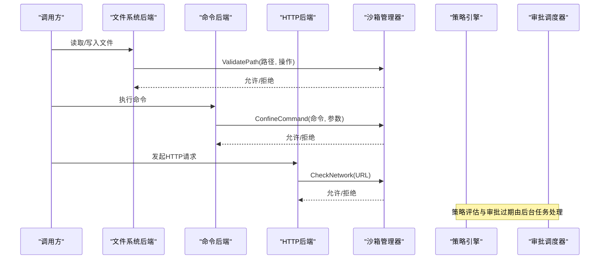
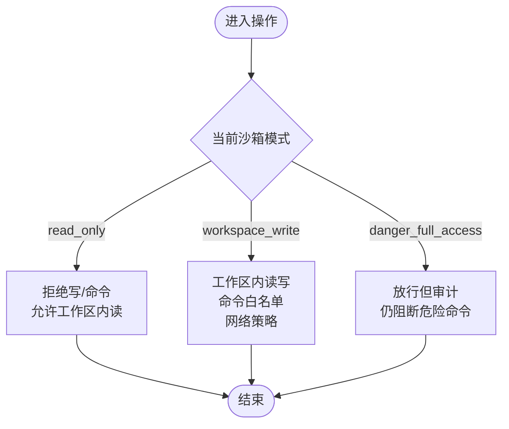
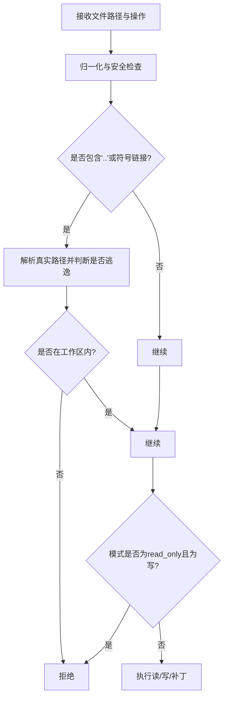
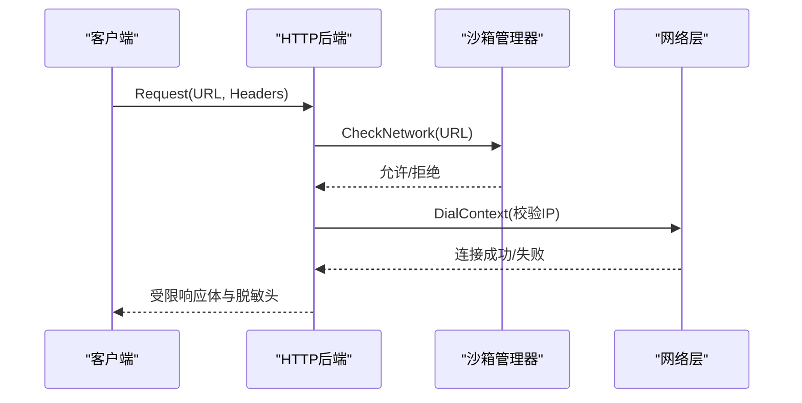
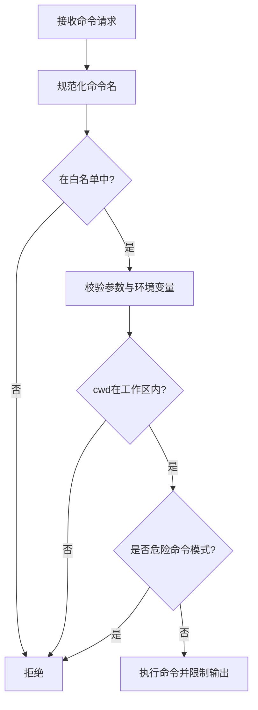
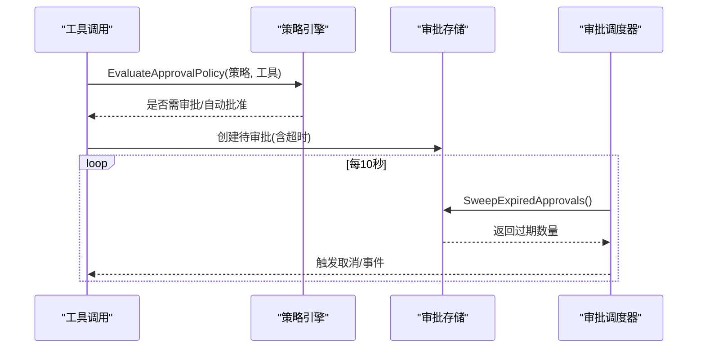
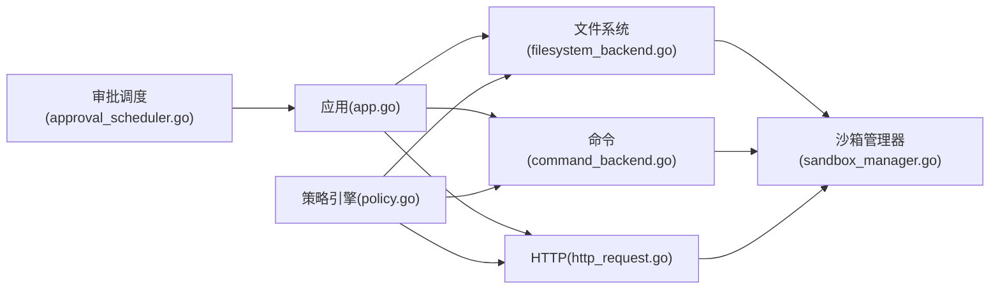

# 安全沙箱

<cite>
**本文引用的文件**
- [sandbox.md](file://docs/dev/sandbox.md)
- [SANDBOX-IMPLEMENTATION-SUMMARY.md](file://docs/dev/SANDBOX-IMPLEMENTATION-SUMMARY.md)
- [sandbox.go](file://internal/domain/sandbox.go)
- [config.go](file://internal/config/config.go)
- [sandbox_manager.go](file://internal/runtime/sandbox_manager.go)
- [approval_scheduler.go](file://internal/runtime/approval_scheduler.go)
- [policy.go](file://internal/runtime/policy.go)
- [filesystem_backend.go](file://internal/runtime/filesystem_backend.go)
- [command_backend.go](file://internal/runtime/command_backend.go)
- [http_request.go](file://internal/runtime/http_request.go)
- [security.go](file://internal/tools/security.go)
- [app.go](file://internal/app/app.go)
</cite>

## 目录
1. [简介](#简介)
2. [项目结构](#项目结构)
3. [核心组件](#核心组件)
4. [架构总览](#架构总览)
5. [详细组件分析](#详细组件分析)
6. [依赖关系分析](#依赖关系分析)
7. [性能与资源限制](#性能与资源限制)
8. [故障排查指南](#故障排查指南)
9. [结论](#结论)
10. [附录：配置与最佳实践](#附录配置与最佳实践)

## 简介
本仓库为 Vivy Agent 运行时实现，内置可配置的安全沙箱系统，参考三段式权限模型（只读、工作区写入、危险全访问），对文件系统、命令执行、网络请求进行严格边界控制。系统提供审批策略（ask/never/auto）、超时自动过期、审计事件、输入验证与输出脱敏等能力，确保在不受信或半受信场景下也能安全运行。

## 项目结构
安全沙箱相关代码主要分布在以下层次：
- 领域模型与配置：定义沙箱模式、审批策略、网络策略及配置校验
- 运行时引擎：沙箱管理器、策略引擎、审批调度器
- 工具后端：文件系统、命令执行、HTTP 请求均集成沙箱检查
- 应用组装：启动时创建并注入沙箱管理器到各后端
- 文档与总结：设计说明与实施总结

图表来源
- [config.go:161-192](file://internal/config/config.go#L161-L192)
- [sandbox.go:1-85](file://internal/domain/sandbox.go#L1-L85)
- [sandbox_manager.go:27-73](file://internal/runtime/sandbox_manager.go#L27-L73)
- [policy.go:35-84](file://internal/runtime/policy.go#L35-L84)
- [approval_scheduler.go:18-46](file://internal/runtime/approval_scheduler.go#L18-L46)
- [filesystem_backend.go:33-59](file://internal/runtime/filesystem_backend.go#L33-L59)
- [command_backend.go:28-51](file://internal/runtime/command_backend.go#L28-L51)
- [http_request.go:21-53](file://internal/runtime/http_request.go#L21-L53)
- [security.go:12-79](file://internal/tools/security.go#L12-L79)
- [app.go:145-189](file://internal/app/app.go#L145-L189)

章节来源
- [sandbox.md:1-135](file://docs/dev/sandbox.md#L1-L135)
- [SANDBOX-IMPLEMENTATION-SUMMARY.md:1-271](file://docs/dev/SANDBOX-IMPLEMENTATION-SUMMARY.md#L1-L271)

## 核心组件
- 领域模型
  - 沙箱模式：read_only、workspace_write、danger_full_access
  - 审批策略：ask、never、auto
  - 网络策略：域名白名单、私有 IP 阻止、响应体大小上限
- 沙箱管理器
  - 路径校验（防逃逸、符号链接解析）
  - 命令白名单与危险模式过滤
  - 网络策略校验（DNS 解析、域名白名单、私有 IP 拦截）
- 策略引擎
  - 基于治理配置的规则匹配与决策
  - 审批策略评估（是否需用户审批、是否自动批准）
- 审批调度器
  - 定时扫描过期审批，触发取消与事件通知
- 工具后端集成
  - 文件系统：读写/补丁前调用沙箱校验
  - 命令执行：参数与 cwd 校验、环境变量白名单、输出限流
  - HTTP：仅 GET/HEAD、重定向校验、响应体限制、头信息过滤
- 输入/输出安全
  - 参数注入检测、路径穿越防护
  - 敏感信息脱敏（密钥、邮箱）

章节来源
- [sandbox.go:1-85](file://internal/domain/sandbox.go#L1-L85)
- [sandbox_manager.go:27-286](file://internal/runtime/sandbox_manager.go#L27-L286)
- [policy.go:35-274](file://internal/runtime/policy.go#L35-L274)
- [approval_scheduler.go:18-118](file://internal/runtime/approval_scheduler.go#L18-L118)
- [filesystem_backend.go:61-283](file://internal/runtime/filesystem_backend.go#L61-L283)
- [command_backend.go:52-197](file://internal/runtime/command_backend.go#L52-L197)
- [http_request.go:54-120](file://internal/runtime/http_request.go#L54-L120)
- [security.go:25-79](file://internal/tools/security.go#L25-L79)

## 架构总览
Vivy 在进程启动时根据配置构建沙箱管理器，并将其注入到文件系统、命令执行、HTTP 请求等后端。所有外部操作在进入实际 I/O 之前，先经过策略引擎与沙箱管理器的双重校验；同时通过审批调度器保障过期审批的清理与联动取消。

图表来源
- [filesystem_backend.go:61-203](file://internal/runtime/filesystem_backend.go#L61-L203)
- [command_backend.go:52-127](file://internal/runtime/command_backend.go#L52-L127)
- [http_request.go:54-72](file://internal/runtime/http_request.go#L54-L72)
- [sandbox_manager.go:85-234](file://internal/runtime/sandbox_manager.go#L85-L234)
- [policy.go:212-274](file://internal/runtime/policy.go#L212-L274)
- [approval_scheduler.go:55-118](file://internal/runtime/approval_scheduler.go#L55-L118)

## 详细组件分析

### 三层权限模型（只读、工作区写入、危险全访问）
- read_only
  - 禁止写操作与命令执行；允许在工作区内读取
  - 适用于代码审查、文档阅读等只读场景
- workspace_write（默认）
  - 允许工作区内的读写；命令执行受白名单限制；网络访问受策略控制
  - 适用于正常开发工作
- danger_full_access
  - 解除沙箱限制但仍记录审计；仍会阻断明显危险命令模式
  - 仅用于可信会话，不建议作为默认模式

图表来源
- [sandbox.go:9-38](file://internal/domain/sandbox.go#L9-L38)
- [sandbox_manager.go:85-183](file://internal/runtime/sandbox_manager.go#L85-L183)

章节来源
- [sandbox.md:13-35](file://docs/dev/sandbox.md#L13-L35)
- [SANDBOX-IMPLEMENTATION-SUMMARY.md:112-132](file://docs/dev/SANDBOX-IMPLEMENTATION-SUMMARY.md#L112-L132)

### 文件系统访问控制
- 路径校验
  - 绝对路径与工作区相对路径统一归一化
  - 检测“..”与符号链接，防止逃逸
  - 保护敏感目录（如 .env、keys.txt、.ssh 等）
- 读写限制
  - read_only 模式拒绝写
  - workspace_write 模式限制在工作区内
  - 原子写入与差异摘要，便于审计与回滚
- 搜索与 grep
  - 结果数量与字节数限制，避免资源耗尽

图表来源
- [filesystem_backend.go:498-562](file://internal/runtime/filesystem_backend.go#L498-L562)
- [sandbox_manager.go:85-147](file://internal/runtime/sandbox_manager.go#L85-L147)

章节来源
- [filesystem_backend.go:61-283](file://internal/runtime/filesystem_backend.go#L61-L283)
- [filesystem_backend.go:520-572](file://internal/runtime/filesystem_backend.go#L520-L572)

### 网络请求限制
- 协议与主机
  - 仅允许 http/https；禁止带凭据的 URL
  - 重定向目标必须仍在白名单内且无凭据
- 域名白名单与私有 IP 阻止
  - 支持精确匹配与子域匹配
  - DNS 解析后检查是否为私有/本地地址
- 响应体与头部
  - 限制响应体大小；仅保留必要响应头
  - 禁止携带凭据的请求头

图表来源
- [http_request.go:54-120](file://internal/runtime/http_request.go#L54-L120)
- [http_request.go:189-216](file://internal/runtime/http_request.go#L189-L216)
- [sandbox_manager.go:185-234](file://internal/runtime/sandbox_manager.go#L185-L234)

章节来源
- [http_request.go:54-120](file://internal/runtime/http_request.go#L54-L120)
- [http_request.go:122-177](file://internal/runtime/http_request.go#L122-L177)
- [http_request.go:189-216](file://internal/runtime/http_request.go#L189-L216)

### 命令执行白名单
- 命令名规范化与白名单校验
  - 去除扩展名、小写化、取基名
  - 仅允许配置中的可执行名
- 参数与环境变量限制
  - 禁止 shell 语法与危险字符
  - 环境变量白名单，长度与 NUL 校验
- 工作目录限制
  - 必须位于工作区内，符号链接解析后再次校验
- 危险命令过滤
  - 即使在全访问模式也阻止格式化、递归强制删除等

图表来源
- [command_backend.go:116-197](file://internal/runtime/command_backend.go#L116-L197)
- [sandbox_manager.go:149-183](file://internal/runtime/sandbox_manager.go#L149-L183)

章节来源
- [command_backend.go:52-197](file://internal/runtime/command_backend.go#L52-L197)
- [command_backend.go:229-263](file://internal/runtime/command_backend.go#L229-L263)

### 安全策略配置与排除规则
- 配置项
  - 默认沙箱模式、工作区根、审批策略、超时时间、自动批准工具列表
  - 网络白名单与私有 IP 阻止开关
- 配置校验
  - 严格字段校验，未知字段报错
  - 路径不允许“..”，工作区根必须有效
- 排除与覆盖
  - 可在沙箱配置中覆盖全局工作区根
  - 自动批准工具列表用于 auto 策略下的免审执行

章节来源
- [config.go:161-192](file://internal/config/config.go#L161-L192)
- [config.go:256-314](file://internal/config/config.go#L256-L314)
- [config.go:499-527](file://internal/config/config.go#L499-L527)

### 审批流程与超时
- 三种策略
  - ask：所有 effectful 工具需审批
  - never：直接拒绝所有 effectful 工具
  - auto：只读与白名单工具自动批准，其余需审批
- 超时机制
  - 超过阈值的待审批自动过期并拒绝
  - 关联 run 被取消，并发出过期事件
  - 后台每 10 秒扫描一次

图表来源
- [policy.go:212-274](file://internal/runtime/policy.go#L212-L274)
- [approval_scheduler.go:55-118](file://internal/runtime/approval_scheduler.go#L55-L118)

章节来源
- [sandbox.md:36-84](file://docs/dev/sandbox.md#L36-L84)
- [approval_scheduler.go:18-118](file://internal/runtime/approval_scheduler.go#L18-L118)

### 输入验证与输出过滤
- 输入验证
  - 参数注入信号检测（忽略/覆盖指令）
  - 路径穿越与 UNC 路径禁止
  - 命令参数禁止 shell 语法与危险关键字
- 输出过滤
  - 敏感信息脱敏（密钥、邮箱）
  - 响应体与结果大小限制，避免上下文污染

章节来源
- [security.go:25-79](file://internal/tools/security.go#L25-L79)
- [filesystem_backend.go:83-115](file://internal/runtime/filesystem_backend.go#L83-L115)
- [http_request.go:102-119](file://internal/runtime/http_request.go#L102-L119)

### 安全事件审计与违规检测
- 审计钩子
  - 将关键决策与事件写入日志/审计通道
- 违规检测
  - 沙箱拒绝、策略拒绝、命令注入、路径穿越、网络越权等
- 事件回放
  - 事件总线按游标重放，便于问题定位

章节来源
- [app.go:219-254](file://internal/app/app.go#L219-L254)
- [SANDBOX-IMPLEMENTATION-SUMMARY.md:194-196](file://docs/dev/SANDBOX-IMPLEMENTATION-SUMMARY.md#L194-L196)

## 依赖关系分析
- 组件耦合
  - 应用组装负责创建并注入沙箱管理器到各后端
  - 后端强依赖沙箱管理器进行边界校验
  - 策略引擎与审批调度器为横切关注点，影响所有工具调用
- 外部依赖
  - 网络层使用标准库进行 DNS 与连接
  - 文件系统使用标准库进行路径与 IO 操作
  - 配置使用 YAML 解码并严格校验

图表来源
- [app.go:145-189](file://internal/app/app.go#L145-L189)
- [filesystem_backend.go:33-59](file://internal/runtime/filesystem_backend.go#L33-L59)
- [command_backend.go:28-51](file://internal/runtime/command_backend.go#L28-L51)
- [http_request.go:21-53](file://internal/runtime/http_request.go#L21-L53)
- [sandbox_manager.go:27-73](file://internal/runtime/sandbox_manager.go#L27-L73)
- [policy.go:35-84](file://internal/runtime/policy.go#L35-L84)
- [approval_scheduler.go:18-46](file://internal/runtime/approval_scheduler.go#L18-L46)

章节来源
- [app.go:145-189](file://internal/app/app.go#L145-L189)

## 性能与资源限制
- 文件系统
  - 最大文件读取与搜索结果限制，避免大文件与海量匹配导致内存膨胀
  - 差异摘要限制，便于展示与审计
- 命令执行
  - 输出有界缓冲，防止无限增长
  - 参数数量与大小限制，环境变量白名单
  - 超时限制，避免长时间占用
- HTTP 请求
  - 响应体大小限制，仅保留必要响应头
  - 连接复用与空闲超时，减少资源占用
- 审批调度
  - 固定间隔扫描，避免频繁数据库查询

章节来源
- [filesystem_backend.go:24-29](file://internal/runtime/filesystem_backend.go#L24-L29)
- [filesystem_backend.go:118-190](file://internal/runtime/filesystem_backend.go#L118-L190)
- [command_backend.go:21-26](file://internal/runtime/command_backend.go#L21-L26)
- [command_backend.go:199-227](file://internal/runtime/command_backend.go#L199-L227)
- [http_request.go:19-53](file://internal/runtime/http_request.go#L19-L53)
- [http_request.go:102-119](file://internal/runtime/http_request.go#L102-L119)
- [approval_scheduler.go:30-46](file://internal/runtime/approval_scheduler.go#L30-L46)

## 故障排查指南
- 常见错误
  - 路径逃逸：包含“..”或符号链接指向工作区外
  - 命令不在白名单：未配置的可执行名被拒绝
  - 网络越权：访问私有 IP 或未在白名单的域名
  - 审批过期：等待超时被自动拒绝并取消关联 run
- 排查步骤
  - 检查配置中的沙箱模式、工作区根、白名单与网络策略
  - 查看审计日志与事件，确认拒绝原因
  - 调整自动批准工具列表或审批策略以平衡安全与便利
  - 对命令执行，确认参数不含 shell 语法与危险关键字

章节来源
- [sandbox_manager.go:85-234](file://internal/runtime/sandbox_manager.go#L85-L234)
- [command_backend.go:116-197](file://internal/runtime/command_backend.go#L116-L197)
- [http_request.go:54-120](file://internal/runtime/http_request.go#L54-L120)
- [approval_scheduler.go:91-118](file://internal/runtime/approval_scheduler.go#L91-L118)

## 结论
Vivy 的沙箱系统通过领域模型、配置校验、策略引擎与多后端集成，实现了细粒度的权限边界与完整的审批闭环。其设计兼顾安全性与可用性，适合在生产环境中对不受信或半受信 agent 进行安全隔离与管控。后续可通过 Service 层 API 与 UI 进一步简化运维与可视化。

## 附录：配置与最佳实践
- 推荐配置
  - 默认模式使用 workspace_write，仅在可信会话启用 danger_full_access
  - 审批策略默认 ask，CI 环境使用 never
  - 开启私有 IP 阻止，配置最小化的域名白名单
  - 设置合理的超时时间与自动批准工具列表
- 最佳实践
  - 定期审查白名单与策略规则，及时移除不再使用的条目
  - 对敏感路径与命令进行额外限制与审计
  - 结合事件与审计日志进行持续监控与告警
  - 在变更策略后进行回归测试，确保业务不受影响

章节来源
- [config.go:256-314](file://internal/config/config.go#L256-L314)
- [config.go:499-527](file://internal/config/config.go#L499-L527)
- [sandbox.md:56-101](file://docs/dev/sandbox.md#L56-L101)
- [SANDBOX-IMPLEMENTATION-SUMMARY.md:135-152](file://docs/dev/SANDBOX-IMPLEMENTATION-SUMMARY.md#L135-L152)