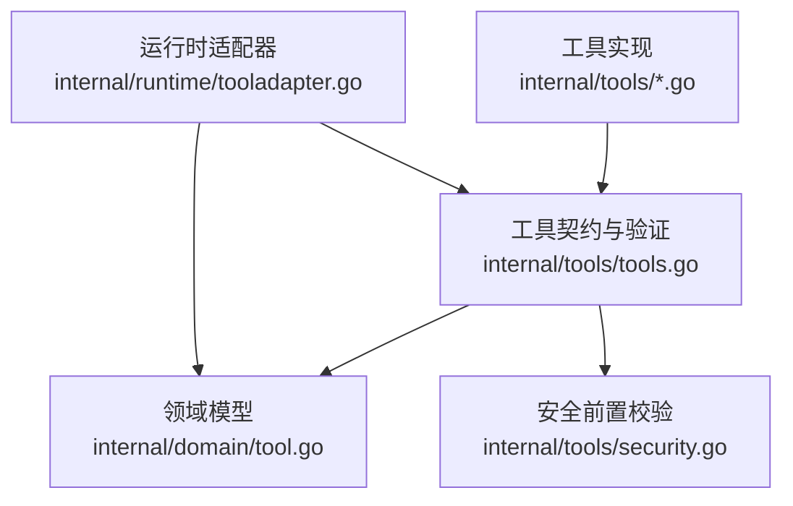
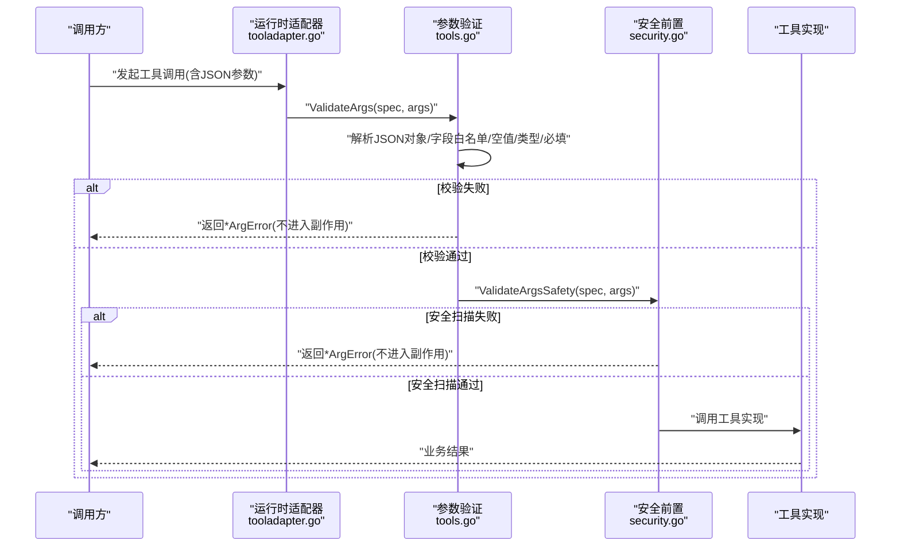
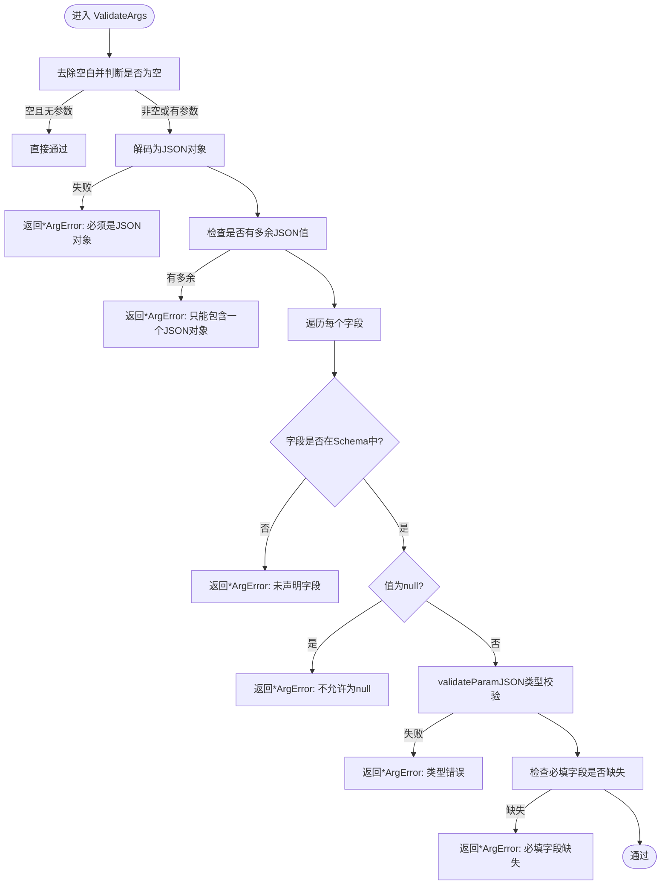
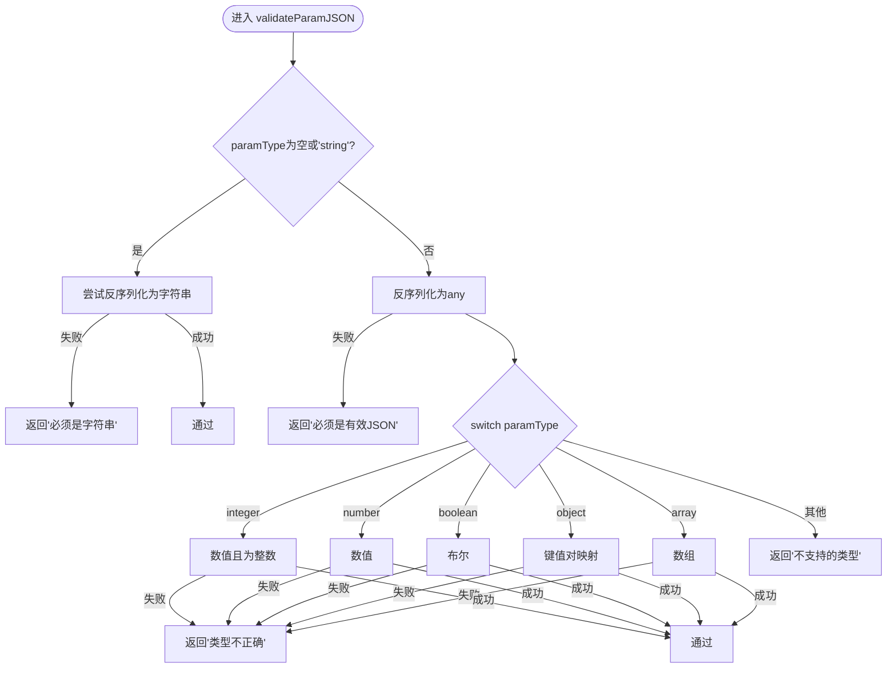
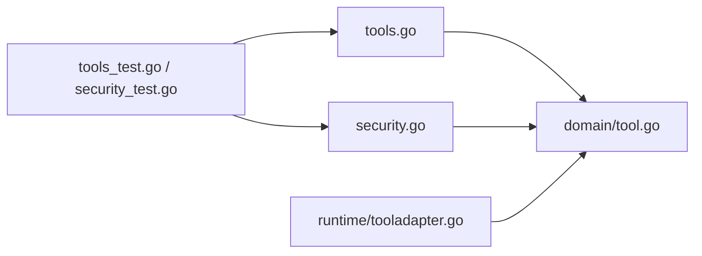

# 参数验证系统

<cite>
**本文引用的文件**
- [internal/tools/tools.go](file://internal/tools/tools.go)
- [internal/tools/security.go](file://internal/tools/security.go)
- [internal/domain/tool.go](file://internal/domain/tool.go)
- [internal/runtime/tooladapter.go](file://internal/runtime/tooladapter.go)
- [internal/tools/tools_test.go](file://internal/tools/tools_test.go)
- [internal/tools/security_test.go](file://internal/tools/security_test.go)
</cite>

## 目录
1. [简介](#简介)
2. [项目结构](#项目结构)
3. [核心组件](#核心组件)
4. [架构总览](#架构总览)
5. [详细组件分析](#详细组件分析)
6. [依赖关系分析](#依赖关系分析)
7. [性能考量](#性能考量)
8. [故障排查指南](#故障排查指南)
9. [结论](#结论)
10. [附录](#附录)

## 简介
本文件面向 Vivy 运行时中的“参数验证系统”，聚焦工具调用前的强约束校验，确保无效参数不会进入副作用执行阶段。文档围绕以下目标展开：
- 深入解释 ValidateArgs 的实现原理：JSON 对象解析、字段存在性检查、必需参数验证。
- 详细说明 validateParamJSON 的类型验证逻辑：支持 string、integer、number、boolean、object、array 的严格校验。
- 解释 ArgError 结构化错误报告机制：Field 与 Reason 的语义化描述。
- 说明验证失败的安全处理策略：在副作用工具执行前拦截非法参数。
- 提供 Schema 定义最佳实践：参数命名规范、类型选择指导、必填项设计原则。
- 包含常见验证错误的诊断方法与调试技巧，以及自定义验证规则的扩展方式。

## 项目结构
参数验证系统位于 internal/tools 包中，核心由三部分构成：
- 工具契约与验证入口：tools.go 定义了 Tool 接口、ValidateArgs、validateParamJSON、ArgError 等。
- 安全前置校验：security.go 提供 ValidateArgsSafety，对命令注入、路径穿越等风险进行早期阻断。
- 领域模型与运行时适配：domain/tool.go 定义 ToolSpec/ToolParam；runtime/tooladapter.go 将内部类型映射到外部 schema 类型，保证模型侧参数提示一致。

图表来源
- [internal/tools/tools.go:17-84](file://internal/tools/tools.go#L17-L84)
- [internal/tools/security.go:38-71](file://internal/tools/security.go#L38-L71)
- [internal/domain/tool.go:27-61](file://internal/domain/tool.go#L27-L61)
- [internal/runtime/tooladapter.go:45-76](file://internal/runtime/tooladapter.go#L45-L76)

章节来源
- [internal/tools/tools.go:17-84](file://internal/tools/tools.go#L17-L84)
- [internal/tools/security.go:38-71](file://internal/tools/security.go#L38-L71)
- [internal/domain/tool.go:27-61](file://internal/domain/tool.go#L27-L61)
- [internal/runtime/tooladapter.go:45-76](file://internal/runtime/tooladapter.go#L45-L76)

## 核心组件
- Tool 接口：统一工具调用入口，InvokableRun 接收 json.RawMessage 形式的参数，并约定返回 *ArgError 表示参数校验失败，避免 panic。
- ValidateArgs：基于 ToolSpec.Params 的 Schema 做 JSON 对象形状校验、字段白名单、空值拒绝、类型校验与必填项检查。
- validateParamJSON：按 param.Type 进行严格类型校验，覆盖 string、integer、number、boolean、object、array。
- ArgError：结构化错误体，包含 Field（字段名）和 Reason（原因），便于上层安全地展示或记录。
- ValidateArgsSafety：在工具实现之前对高风险字段（path/file_path/command/cmd）进行安全扫描，阻止命令注入、路径穿越、UNC 路径等。

章节来源
- [internal/tools/tools.go:17-120](file://internal/tools/tools.go#L17-L120)
- [internal/tools/security.go:38-71](file://internal/tools/security.go#L38-L71)

## 架构总览
参数验证贯穿“请求到达工具实现”之前的关键路径，形成“Schema 校验 + 安全扫描”的双重门控。

图表来源
- [internal/runtime/tooladapter.go:45-76](file://internal/runtime/tooladapter.go#L45-L76)
- [internal/tools/tools.go:44-84](file://internal/tools/tools.go#L44-L84)
- [internal/tools/security.go:38-71](file://internal/tools/security.go#L38-L71)

## 详细组件分析

### ValidateArgs：JSON 对象解析、字段存在性与必填验证
- 输入为空且无参数时直接放行。
- 使用解码器将原始 JSON 解析为 map[string]json.RawMessage，要求必须是一个 JSON 对象且仅有一个根值。
- 遍历字段：
  - 未知字段立即拒绝（白名单机制）。
  - 显式 null 值拒绝。
  - 调用 validateParamJSON 进行类型校验。
- 再次遍历 Schema 中的 Params，对 Required=true 的字段进行缺失检查。

图表来源
- [internal/tools/tools.go:44-84](file://internal/tools/tools.go#L44-L84)

章节来源
- [internal/tools/tools.go:44-84](file://internal/tools/tools.go#L44-L84)

### validateParamJSON：严格类型校验
- 当 param.Type 为空或为 "string" 时，尝试反序列化为字符串。
- 其他类型先整体反序列化到 any，再根据类型分支严格匹配：
  - integer：必须是数值且为整型（float64 转 int64 后相等）。
  - number：必须是数值。
  - boolean：必须是布尔。
  - object：必须是键值对映射。
  - array：必须是数组。
- 不支持的类型会返回错误，防止未知类型被误用。

图表来源
- [internal/tools/tools.go:86-120](file://internal/tools/tools.go#L86-L120)

章节来源
- [internal/tools/tools.go:86-120](file://internal/tools/tools.go#L86-L120)

### ArgError：结构化错误报告
- 字段 Field 指明具体失败的参数名（如 "args"、"text"、"command" 等）。
- 字段 Reason 给出人类可读的原因（如 "is required"、"must not be null"、"has the wrong JSON type" 等）。
- Error() 方法输出稳定格式，便于日志与 UI 展示。

章节来源
- [internal/tools/tools.go:34-39](file://internal/tools/tools.go#L34-L39)
- [internal/tools/tools.go:219-221](file://internal/tools/tools.go#L219-L221)

### ValidateArgsSafety：安全前置校验
- 针对 path/filepath/file_path/command/cmd 等高风险字段进行扫描：
  - 拒绝包含 NUL 字节的内容。
  - 命令字段禁止常见注入语法（如 &&、||、;、|、反引号、$( )、powershell、cmd.exe）。
  - 路径字段禁止相对穿越（..\\、../）与 UNC 路径（以 \\\\ 开头）。
- 该层在工具实现之前运行，即使工具未实现额外校验也能获得基础防护。

章节来源
- [internal/tools/security.go:38-71](file://internal/tools/security.go#L38-L71)

### 运行时适配：Schema 类型映射
- runtime/tooladapter.go 将内部 ToolParam.Type 映射到外部 schema 类型（String/Integer/Number/Boolean/Object/Array），确保模型侧参数提示与运行时校验一致，减少“模型猜测参数名导致调用失败”的问题。

章节来源
- [internal/runtime/tooladapter.go:45-76](file://internal/runtime/tooladapter.go#L45-L76)

## 依赖关系分析
- tools.go 依赖 domain.ToolSpec/ToolParam 作为 Schema 来源。
- security.go 同样依赖 domain.ToolSpec 以识别高风险字段。
- tooladapter.go 依赖 domain.ToolSpec 生成对外 schema，间接影响模型侧行为。
- 测试用例覆盖典型失败场景，确保行为稳定可回归。

图表来源
- [internal/tools/tools.go:1-15](file://internal/tools/tools.go#L1-L15)
- [internal/tools/security.go:1-10](file://internal/tools/security.go#L1-L10)
- [internal/runtime/tooladapter.go:45-76](file://internal/runtime/tooladapter.go#L45-L76)
- [internal/tools/tools_test.go:11-32](file://internal/tools/tools_test.go#L11-L32)
- [internal/tools/security_test.go:21-35](file://internal/tools/security_test.go#L21-L35)

章节来源
- [internal/tools/tools.go:1-15](file://internal/tools/tools.go#L1-L15)
- [internal/tools/security.go:1-10](file://internal/tools/security.go#L1-L10)
- [internal/runtime/tooladapter.go:45-76](file://internal/runtime/tooladapter.go#L45-L76)
- [internal/tools/tools_test.go:11-32](file://internal/tools/tools_test.go#L11-L32)
- [internal/tools/security_test.go:21-35](file://internal/tools/security_test.go#L21-L35)

## 性能考量
- 验证过程仅涉及一次 JSON 解码与少量内存分配，时间复杂度与参数数量线性相关，开销极低。
- 类型校验采用 Go 标准库反序列化与类型断言，避免重复解析。
- 安全扫描仅针对少数高风险字段，正则与字符串操作成本可控。
- 建议在高频工具上保持 Schema 精简，减少不必要的字段与嵌套层级。

[本节为通用性能建议，不直接分析具体文件]

## 故障排查指南
- 常见错误定位
  - “必须是JSON对象”：传入的不是对象或解析失败。
  - “只能包含一个JSON对象”：存在多余根值。
  - “未声明字段”：传入了 Schema 之外的字段。
  - “不允许为null”：字段显式为 null。
  - “类型不正确”：字段类型与 Schema 不一致（例如 integer 传了浮点数或非整数）。
  - “必填字段缺失”：Required=true 的字段未提供。
  - “包含阻塞的命令语法/路径穿越/UNC路径”：安全前置校验触发。
- 调试技巧
  - 打印传入的原始 JSON 与对应 Schema，确认字段名与大小写。
  - 使用最小可复现用例逐步缩小范围。
  - 借助测试用例模式构造边界数据（空对象、多余字段、错误类型、null、尾随值等）。
- 自定义验证规则扩展
  - 在工具实现内部进行更严格的领域校验（例如长度限制、枚举值、格式校验），并在失败时返回 *ArgError 以便统一处理。
  - 如需新增全局安全规则，可在 security.go 中扩展 ValidateArgsSafety 的正则或关键字列表，并保持对高风险字段的集中管控。

章节来源
- [internal/tools/tools_test.go:11-32](file://internal/tools/tools_test.go#L11-L32)
- [internal/tools/tools_test.go:76-97](file://internal/tools/tools_test.go#L76-L97)
- [internal/tools/security_test.go:21-35](file://internal/tools/security_test.go#L21-L35)

## 结论
参数验证系统通过“Schema 驱动的结构化校验 + 安全前置扫描”在副作用执行前建立强门控，确保：
- 只有符合 Schema 的参数才能进入工具实现。
- 未知字段、空值、类型不符、必填缺失等均在入口处被拦截。
- 命令注入、路径穿越等安全风险被提前阻断。
- 错误以统一的 *ArgError 形式上报，便于日志、审计与前端展示。

遵循本文提供的 Schema 最佳实践与调试方法，可以显著降低调用失败率与安全事件风险。

## 附录

### Schema 定义最佳实践
- 参数命名规范
  - 使用小写下划线分隔的英文单词，避免歧义（如 file_path、command）。
  - 与运行时适配器保持一致，确保模型侧提示与实际校验一致。
- 类型选择指导
  - 纯文本使用 string。
  - 整数值使用 integer，避免使用 number 表达整数。
  - 小数或浮点使用 number。
  - 开关或布尔标志使用 boolean。
  - 复杂结构使用 object，并尽量扁平化以减少嵌套。
  - 集合使用 array，必要时在工具内部进一步约束元素类型。
- 必填项设计原则
  - 仅将真正必要的参数标记为 Required，降低调用方负担。
  - 对可选参数提供默认值或在工具内部做合理降级。
  - 对敏感或高风险参数（如 command、path）结合安全前置校验进行额外约束。

[本节为通用实践建议，不直接分析具体文件]