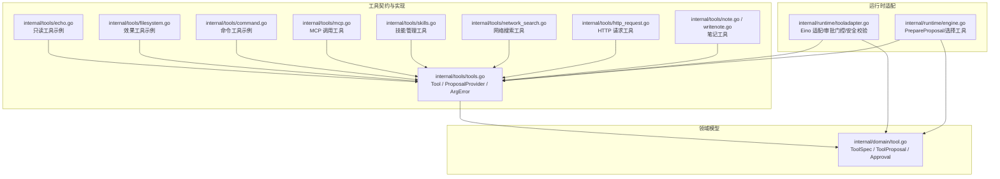
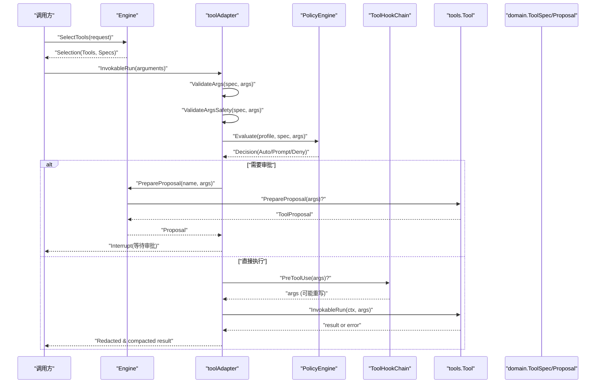
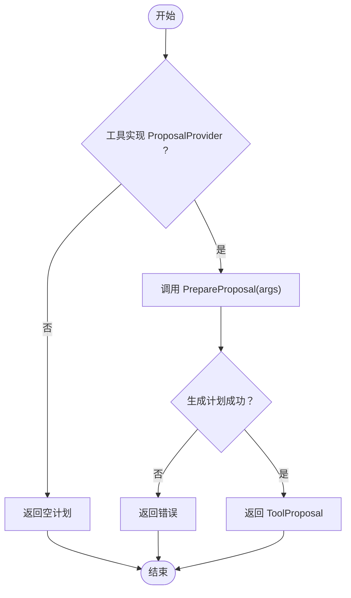
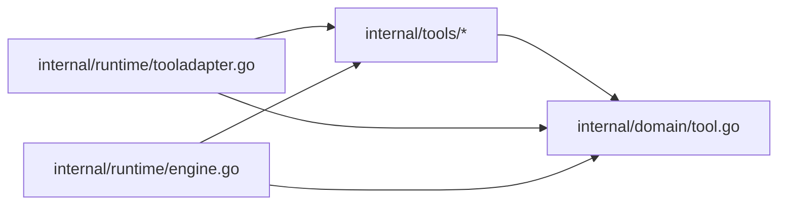

# 工具接口设计

<cite>
**本文引用的文件**
- [internal/tools/tools.go](file://internal/tools/tools.go)
- [internal/domain/tool.go](file://internal/domain/tool.go)
- [internal/runtime/tooladapter.go](file://internal/runtime/tooladapter.go)
- [internal/runtime/engine.go](file://internal/runtime/engine.go)
- [internal/tools/security.go](file://internal/tools/security.go)
- [internal/tools/echo.go](file://internal/tools/echo.go)
- [internal/tools/filesystem.go](file://internal/tools/filesystem.go)
- [internal/tools/command.go](file://internal/tools/command.go)
- [internal/tools/mcp.go](file://internal/tools/mcp.go)
- [internal/tools/skills.go](file://internal/tools/skills.go)
- [internal/tools/network_search.go](file://internal/tools/network_search.go)
- [internal/tools/http_request.go](file://internal/tools/http_request.go)
- [internal/tools/note.go](file://internal/tools/note.go)
- [internal/tools/writenote.go](file://internal/tools/writenote.go)
</cite>

## 目录
1. [简介](#简介)
2. [项目结构](#项目结构)
3. [核心组件](#核心组件)
4. [架构总览](#架构总览)
5. [详细组件分析](#详细组件分析)
6. [依赖关系分析](#依赖关系分析)
7. [性能考量](#性能考量)
8. [故障排查指南](#故障排查指南)
9. [结论](#结论)
10. [附录](#附录)

## 简介
本文件聚焦 Vivy 运行时中的“工具接口”设计，围绕以下目标展开：
- 解释 Tool 接口的核心定义：Spec() 返回的 ToolSpec、InvokableRun 的执行契约与参数传递机制。
- 说明 ProposalProvider 扩展接口的设计目的，用于效果工具的审批流程集成。
- 阐述 ArgError 结构化错误类型的设计，包含 Field 与 Reason 字段的作用。
- 明确只读工具与效果工具的区分原则，以及为什么只读工具不实现 ProposalProvider。
- 提供完整的接口实现示例路径，展示如何正确实现 Tool 与可选的 ProposalProvider。
- 总结错误处理最佳实践与参数验证模式。

## 项目结构
Vivy 的工具体系由 internal/tools 定义契约与内置实现，internal/domain 描述领域模型（如 ToolSpec、ToolProposal），internal/runtime 负责将工具接入 Eino 执行图并实施策略、钩子、审批与安全校验。

图表来源
- [internal/tools/tools.go:21-32](file://internal/tools/tools.go#L21-L32)
- [internal/domain/tool.go:14-42](file://internal/domain/tool.go#L14-L42)
- [internal/runtime/tooladapter.go:78-163](file://internal/runtime/tooladapter.go#L78-L163)
- [internal/runtime/engine.go:119-132](file://internal/runtime/engine.go#L119-L132)

章节来源
- [internal/tools/tools.go:21-32](file://internal/tools/tools.go#L21-L32)
- [internal/domain/tool.go:14-42](file://internal/domain/tool.go#L14-L42)
- [internal/runtime/tooladapter.go:78-163](file://internal/runtime/tooladapter.go#L78-L163)
- [internal/runtime/engine.go:119-132](file://internal/runtime/engine.go#L119-L132)

## 核心组件
- Tool 接口：每个工具必须实现 Spec() 与 InvokableRun()。Spec() 声明工具名称、描述、是否只读、参数 Schema 与路由关键词；InvokableRun() 接收 JSON 参数并返回字符串结果或错误。
- ProposalProvider 接口：可选扩展，供效果工具在运行前生成可审阅的变更计划（ToolProposal），以便进入审批中断流程。
- ArgError：结构化参数校验失败错误，包含 Field（字段名）和 Reason（原因），便于上层统一处理并在事件负载中安全呈现。
- ToolSpec：工具元数据，Readonly 标志决定自动执行或审批门控；Params 描述参数类型、是否必填、枚举等，用于向模型暴露正确的参数 Schema。
- ToolProposal：效果工具的可审阅计划，包含 Action、Target、Preview、RiskFindings、Data 等，贯穿审批生命周期。

章节来源
- [internal/tools/tools.go:21-32](file://internal/tools/tools.go#L21-L32)
- [internal/domain/tool.go:14-42](file://internal/domain/tool.go#L14-L42)

## 架构总览
工具从注册到执行的完整链路如下：
- 引擎装配：Engine 收集工具集合并为每个工具创建适配器，同时缓存 ToolSpec 与名称映射。
- 运行时适配：toolAdapter 在每次调用时进行参数校验、安全扫描、策略评估、钩子改写、交互/审批中断控制，最终调用 tools.Tool.InvokableRun。
- 审批与提案：对效果工具，首次执行会中断以打开审批；若工具实现 ProposalProvider，则通过 Engine.PrepareProposal 生成可审阅计划。
- 结果收敛：结果经脱敏与压缩后返回，保证事件与模型上下文的安全与预算可控。

图表来源
- [internal/runtime/tooladapter.go:78-163](file://internal/runtime/tooladapter.go#L78-L163)
- [internal/runtime/engine.go:119-132](file://internal/runtime/engine.go#L119-L132)
- [internal/tools/tools.go:44-84](file://internal/tools/tools.go#L44-L84)
- [internal/tools/security.go:41-71](file://internal/tools/security.go#L41-L71)

## 详细组件分析

### Tool 接口与 Spec() 契约
- Spec() 返回 ToolSpec，包含 Name、Description、Readonly、Params、Keywords、Interaction。
- Readonly 为 true 表示只读工具，可直接执行；为 false 表示效果工具，需审批门控。
- Params 描述参数 Schema，确保模型侧能生成正确的参数名与类型。
- Keywords 用于请求级工具选择，避免无关工具被选中。

章节来源
- [internal/tools/tools.go:21-26](file://internal/tools/tools.go#L21-L26)
- [internal/domain/tool.go:27-42](file://internal/domain/tool.go#L27-L42)

### InvokableRun 执行契约与参数传递
- 入参：context.Context 与 json.RawMessage 形式的 JSON 对象。
- 出参：string 结果或 error。错误应使用 ArgError 表达参数校验失败。
- 执行前：runtime 层会先做 ValidateArgs、ValidateArgsSafety、策略评估与钩子改写；通过后才会调用工具自身 InvokableRun。
- 执行后：结果会被脱敏与压缩，再返回给上层。

章节来源
- [internal/runtime/tooladapter.go:78-163](file://internal/runtime/tooladapter.go#L78-L163)
- [internal/tools/tools.go:44-84](file://internal/tools/tools.go#L44-L84)
- [internal/tools/security.go:41-71](file://internal/tools/security.go#L41-L71)

### ProposalProvider 扩展接口与审批集成
- 设计目的：在效果工具实际执行前，生成可审阅的变更计划（ToolProposal），使人类审批者能看到将要做什么、影响范围与风险。
- 何时调用：当策略判定需要 Prompt（即审批）时，Engine 会尝试调用 PrepareProposal；未实现的工具返回空计划，沿用旧行为。
- 典型实现：写文件、补丁、命令执行、MCP 调用、技能管理等效果工具均实现了该接口。

图表来源
- [internal/runtime/engine.go:119-132](file://internal/runtime/engine.go#L119-L132)
- [internal/tools/filesystem.go:231-243](file://internal/tools/filesystem.go#L231-L243)
- [internal/tools/command.go:82-96](file://internal/tools/command.go#L82-L96)
- [internal/tools/mcp.go:103-134](file://internal/tools/mcp.go#L103-L134)
- [internal/tools/skills.go:159-196](file://internal/tools/skills.go#L159-L196)

章节来源
- [internal/runtime/engine.go:119-132](file://internal/runtime/engine.go#L119-L132)
- [internal/tools/filesystem.go:231-243](file://internal/tools/filesystem.go#L231-L243)
- [internal/tools/command.go:82-96](file://internal/tools/command.go#L82-L96)
- [internal/tools/mcp.go:103-134](file://internal/tools/mcp.go#L103-L134)
- [internal/tools/skills.go:159-196](file://internal/tools/skills.go#L159-L196)

### ArgError 结构化错误类型
- Field：标识触发错误的参数字段名（如 url、command、content）。
- Reason：人类可读的错误原因（如 is required、contains blocked command syntax）。
- 用途：在工具内部进行参数校验时统一返回 ArgError，便于上层识别、记录与展示，且不泄露敏感信息。

章节来源
- [internal/tools/tools.go:36-39](file://internal/tools/tools.go#L36-L39)
- [internal/tools/tools.go:219-221](file://internal/tools/tools.go#L219-L221)
- [internal/tools/http_request.go:51-71](file://internal/tools/http_request.go#L51-L71)
- [internal/tools/command.go:98-112](file://internal/tools/command.go#L98-L112)

### 只读工具与效果工具的区分原则
- 只读工具：Readonly=true，无副作用，自动执行，无需审批；通常不实现 ProposalProvider。
- 效果工具：Readonly=false，存在副作用（写文件、执行命令、发起网络调用等），首次执行会中断并进入审批流程；通常实现 ProposalProvider 以提供可审阅计划。
- 理由：只读工具不会改变系统状态，因此不需要人类审批；效果工具涉及风险，必须通过 Proposal 与审批机制保障安全与可审计性。

章节来源
- [internal/tools/echo.go:27-37](file://internal/tools/echo.go#L27-L37)
- [internal/tools/filesystem.go:245-256](file://internal/tools/filesystem.go#L245-L256)
- [internal/tools/command.go:82-96](file://internal/tools/command.go#L82-L96)
- [internal/tools/mcp.go:103-134](file://internal/tools/mcp.go#L103-L134)
- [internal/tools/skills.go:159-196](file://internal/tools/skills.go#L159-L196)

### 完整实现示例（路径指引）
- 只读工具示例：
  - echo_info：[internal/tools/echo.go:27-57](file://internal/tools/echo.go#L27-L57)
  - list_notes/read_note：[internal/tools/note.go:30-84](file://internal/tools/note.go#L30-L84)、[internal/tools/note.go:113-150](file://internal/tools/note.go#L113-L150)
- 效果工具示例（含 ProposalProvider）：
  - write_file/patch：[internal/tools/filesystem.go:231-300](file://internal/tools/filesystem.go#L231-L300)
  - execute/commandline：[internal/tools/command.go:82-129](file://internal/tools/command.go#L82-L129)
  - mcp_call：[internal/tools/mcp.go:103-134](file://internal/tools/mcp.go#L103-L134)
  - skill_manage：[internal/tools/skills.go:159-196](file://internal/tools/skills.go#L159-L196)
- 参数校验与 ArgError 使用：
  - http_request：[internal/tools/http_request.go:51-71](file://internal/tools/http_request.go#L51-L71)
  - network_search：[internal/tools/network_search.go:54-75](file://internal/tools/network_search.go#L54-L75)
  - sequential_thinking：[internal/tools/sequential_thinking.go:56-81](file://internal/tools/sequential_thinking.go#L56-L81)
  - decodeStringArgs：[internal/tools/filesystem.go:302-309](file://internal/tools/filesystem.go#L302-L309)

章节来源
- [internal/tools/echo.go:27-57](file://internal/tools/echo.go#L27-L57)
- [internal/tools/note.go:30-84](file://internal/tools/note.go#L30-L84)
- [internal/tools/note.go:113-150](file://internal/tools/note.go#L113-L150)
- [internal/tools/filesystem.go:231-300](file://internal/tools/filesystem.go#L231-L300)
- [internal/tools/command.go:82-129](file://internal/tools/command.go#L82-L129)
- [internal/tools/mcp.go:103-134](file://internal/tools/mcp.go#L103-L134)
- [internal/tools/skills.go:159-196](file://internal/tools/skills.go#L159-L196)
- [internal/tools/http_request.go:51-71](file://internal/tools/http_request.go#L51-L71)
- [internal/tools/network_search.go:54-75](file://internal/tools/network_search.go#L54-L75)
- [internal/tools/sequential_thinking.go:56-81](file://internal/tools/sequential_thinking.go#L56-L81)
- [internal/tools/filesystem.go:302-309](file://internal/tools/filesystem.go#L302-L309)

## 依赖关系分析
- internal/tools 包仅依赖 internal/domain 与 storage 抽象，不依赖 Eino，保持契约稳定。
- internal/runtime 将 tools.Tool 适配为 Eino 的 InvokableTool，并注入策略、钩子与安全校验。
- 工具之间通过统一的 ToolSpec 与 ToolProposal 解耦，便于扩展新的效果工具族。

图表来源
- [internal/tools/tools.go:21-32](file://internal/tools/tools.go#L21-L32)
- [internal/domain/tool.go:14-42](file://internal/domain/tool.go#L14-L42)
- [internal/runtime/tooladapter.go:78-163](file://internal/runtime/tooladapter.go#L78-L163)
- [internal/runtime/engine.go:119-132](file://internal/runtime/engine.go#L119-L132)

章节来源
- [internal/tools/tools.go:21-32](file://internal/tools/tools.go#L21-L32)
- [internal/domain/tool.go:14-42](file://internal/domain/tool.go#L14-L42)
- [internal/runtime/tooladapter.go:78-163](file://internal/runtime/tooladapter.go#L78-L163)
- [internal/runtime/engine.go:119-132](file://internal/runtime/engine.go#L119-L132)

## 性能考量
- 参数校验前置：ValidateArgs 与 ValidateArgsSafety 在工具实现之前完成，避免无效或危险输入进入副作用逻辑。
- 结果压缩：toolAdapter 对工具输出进行头部/尾部保留与中间压缩，防止大结果污染模型上下文。
- 工具选择：Selector 基于关键词与名称进行保守选择，减少不必要的工具暴露与调用开销。
- 脱敏：结果输出前进行敏感信息脱敏，降低日志与事件负载的敏感数据风险。

章节来源
- [internal/runtime/tooladapter.go:186-202](file://internal/runtime/tooladapter.go#L186-L202)
- [internal/tools/tools.go:146-181](file://internal/tools/tools.go#L146-L181)
- [internal/tools/security.go:73-79](file://internal/tools/security.go#L73-L79)

## 故障排查指南
- 参数错误：检查工具内部是否返回 ArgError，确认 Field 与 Reason 清晰；参考示例：
  - [internal/tools/http_request.go:51-71](file://internal/tools/http_request.go#L51-L71)
  - [internal/tools/command.go:98-112](file://internal/tools/command.go#L98-L112)
- 策略拒绝：若收到策略拒绝错误，查看策略评估与钩子改写后的最终参数；参考：
  - [internal/runtime/tooladapter.go:92-138](file://internal/runtime/tooladapter.go#L92-L138)
- 审批中断：效果工具首次执行会中断等待审批；如需查看计划，确认工具实现 ProposalProvider；参考：
  - [internal/runtime/engine.go:119-132](file://internal/runtime/engine.go#L119-L132)
  - [internal/tools/filesystem.go:231-243](file://internal/tools/filesystem.go#L231-L243)
- 安全拦截：若因安全规则被拒（如命令语法、路径穿越），检查 ValidateArgsSafety；参考：
  - [internal/tools/security.go:41-71](file://internal/tools/security.go#L41-L71)

章节来源
- [internal/tools/http_request.go:51-71](file://internal/tools/http_request.go#L51-L71)
- [internal/tools/command.go:98-112](file://internal/tools/command.go#L98-L112)
- [internal/runtime/tooladapter.go:92-138](file://internal/runtime/tooladapter.go#L92-L138)
- [internal/runtime/engine.go:119-132](file://internal/runtime/engine.go#L119-L132)
- [internal/tools/filesystem.go:231-243](file://internal/tools/filesystem.go#L231-L243)
- [internal/tools/security.go:41-71](file://internal/tools/security.go#L41-L71)

## 结论
Vivy 的工具接口以 Tool 为核心，结合 ToolSpec 描述能力与约束，通过 runtime 层的策略、钩子与安全校验保障执行安全。ProposalProvider 为效果工具提供可审阅的变更计划，支撑人机协同审批。ArgError 提供一致的结构化错误语义，便于调试与审计。只读工具自动执行，效果工具受审批门控，二者职责清晰、边界明确。

## 附录
- 参数验证模式建议：
  - 使用 Decode + DisallowUnknownFields 严格解析 JSON。
  - 对必填字段进行非空校验，对长度/类型进行限制。
  - 使用 optionalInt/optionalBool 等辅助函数处理可选参数。
  - 将校验失败统一包装为 ArgError，包含 Field 与 Reason。
- 安全建议：
  - 对所有 path/filepath/command/cmd 字段进行安全扫描。
  - 禁止 NUL 字节、路径穿越、UNC 路径与危险命令语法。
  - 输出结果进行敏感信息脱敏。

章节来源
- [internal/tools/filesystem.go:302-331](file://internal/tools/filesystem.go#L302-L331)
- [internal/tools/security.go:41-79](file://internal/tools/security.go#L41-L79)