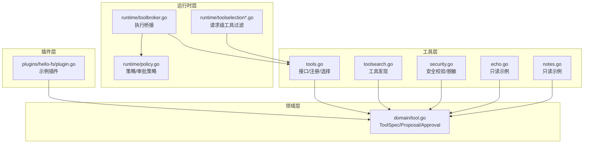
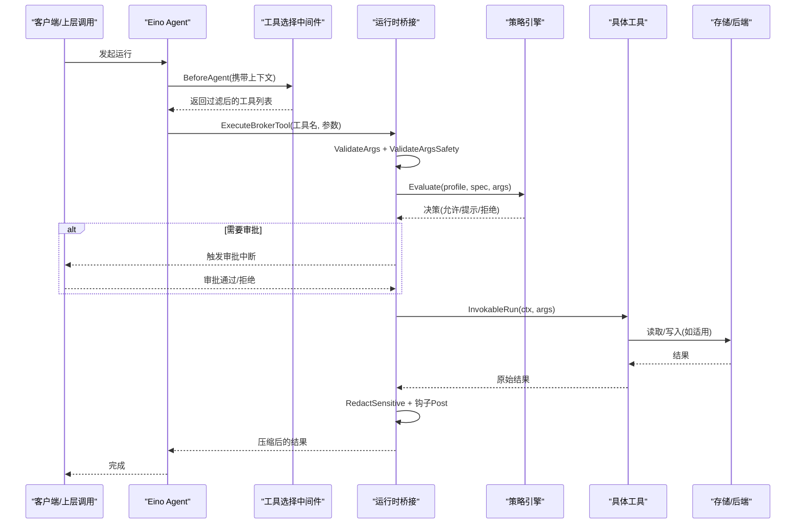
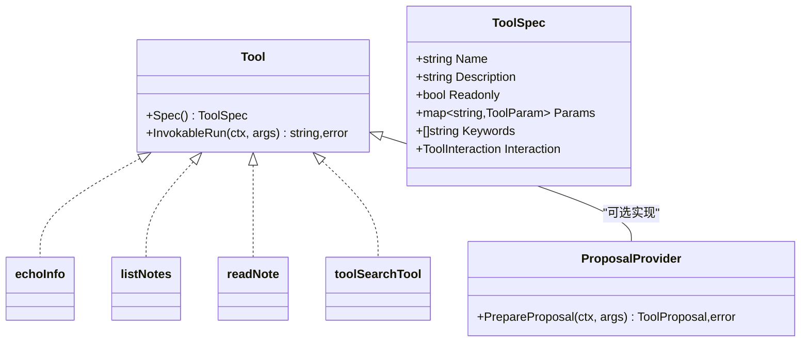
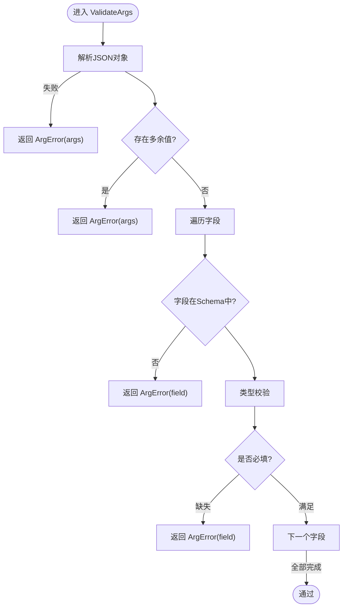
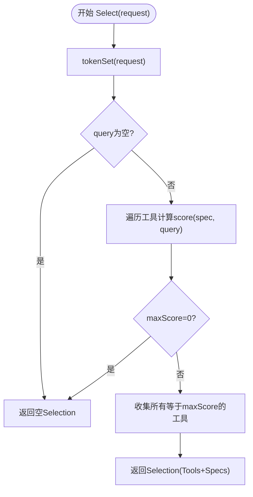
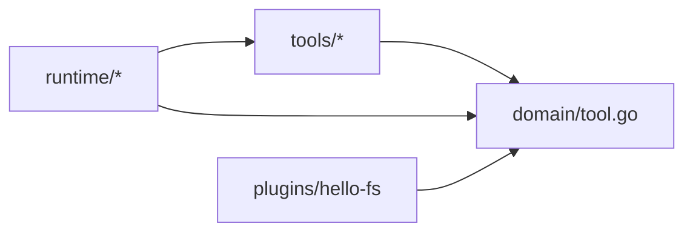

# 工具架构设计

<cite>
**本文引用的文件**
- [internal/tools/tools.go](file://internal/tools/tools.go)
- [internal/tools/toolsearch.go](file://internal/tools/toolsearch.go)
- [internal/tools/security.go](file://internal/tools/security.go)
- [internal/tools/echo.go](file://internal/tools/echo.go)
- [internal/tools/notes.go](file://internal/tools/notes.go)
- [internal/domain/tool.go](file://internal/domain/tool.go)
- [internal/runtime/toolbroker.go](file://internal/runtime/toolbroker.go)
- [internal/runtime/toolselection.go](file://internal/runtime/toolselection.go)
- [internal/runtime/toolselection_middleware.go](file://internal/runtime/toolselection_middleware.go)
- [internal/runtime/policy.go](file://internal/runtime/policy.go)
- [plugins/hello-fs/plugin.go](file://plugins/hello-fs/plugin.go)
</cite>

## 目录
1. [简介](#简介)
2. [项目结构](#项目结构)
3. [核心组件](#核心组件)
4. [架构总览](#架构总览)
5. [详细组件分析](#详细组件分析)
6. [依赖关系分析](#依赖关系分析)
7. [性能考虑](#性能考虑)
8. [故障排查指南](#故障排查指南)
9. [结论](#结论)
10. [附录](#附录)

## 简介
本文件系统性阐述 Vivy 工具架构：Tool 接口、ProposalProvider 扩展机制、参数验证系统（ValidateArgs）、工具选择算法（Selector）、注册机制（Registry）、生命周期与审批集成、只读与效果工具的区分、工具发现与关键词匹配评分策略，以及自定义工具开发指南、性能优化、调试技巧与监控指标。该架构以“最小可用工具集”为核心原则，通过声明式 Schema、安全校验、策略引擎和审批流程，确保模型在可控边界内调用外部能力。

## 项目结构
- internal/tools：工具契约、注册表、选择器、搜索、安全校验与内置工具实现。
- internal/domain：领域模型（ToolSpec、ToolParam、ToolProposal、Approval 等）。
- internal/runtime：运行时桥接、策略评估、审批策略、Eino 中间件与上下文传播。
- plugins/hello-fs：示例用户插件，展示 SDK 窗口与工具定义方式。



图表来源
- [internal/tools/tools.go:17-32](file://internal/tools/tools.go#L17-L32)
- [internal/tools/toolsearch.go:15-62](file://internal/tools/toolsearch.go#L15-L62)
- [internal/tools/security.go:38-79](file://internal/tools/security.go#L38-L79)
- [internal/tools/echo.go:12-37](file://internal/tools/echo.go#L12-L37)
- [internal/tools/notes.go:16-47](file://internal/tools/notes.go#L16-L47)
- [internal/domain/tool.go:14-61](file://internal/domain/tool.go#L14-L61)
- [internal/runtime/toolbroker.go:12-92](file://internal/runtime/toolbroker.go#L12-L92)
- [internal/runtime/policy.go:19-169](file://internal/runtime/policy.go#L19-L169)
- [internal/runtime/toolselection_middleware.go:11-40](file://internal/runtime/toolselection_middleware.go#L11-L40)
- [plugins/hello-fs/plugin.go:17-37](file://plugins/hello-fs/plugin.go#L17-L37)

章节来源
- [internal/tools/tools.go:17-32](file://internal/tools/tools.go#L17-L32)
- [internal/domain/tool.go:14-61](file://internal/domain/tool.go#L14-L61)
- [internal/runtime/toolbroker.go:12-92](file://internal/runtime/toolbroker.go#L12-L92)
- [internal/runtime/policy.go:19-169](file://internal/runtime/policy.go#L19-L169)
- [internal/runtime/toolselection_middleware.go:11-40](file://internal/runtime/toolselection_middleware.go#L11-L40)

## 核心组件
- Tool 接口：统一的可调用契约，包含 Spec() 描述与 InvokableRun() 执行入口；错误返回需为 ArgError 等可序列化类型，避免 panic。
- ProposalProvider：可选扩展，用于在效果工具执行前生成可审查的变更计划（ToolProposal），供审批流消费。
- 参数验证：ValidateArgs 基于 ToolSpec.Params 进行 JSON Schema 形状校验；ValidateArgsSafety 对路径/命令字段做通用安全拦截。
- 工具选择：Selector 使用显式 Keywords 与名称分词进行确定性路由，仅当请求命中时才暴露工具给模型。
- 注册表：Registry 维护 name->Tool 映射，提供 Resolve 按配置启用并限制 tool_search 可见范围。
- 运行时桥接：ExecuteBrokerTool/ExecuteApprovedBrokerTool 负责参数校验、策略评估、钩子重写、结果脱敏与事件上报。
- 策略与审批：PolicyEngine 提供规则匹配与默认决策；EvaluateApprovalPolicy 决定是否需要人工审批。
- 工具发现：tool_search 提供受限的工具目录查询与 select: 精确选择语法，支持缓存与限流。

章节来源
- [internal/tools/tools.go:17-84](file://internal/tools/tools.go#L17-L84)
- [internal/tools/tools.go:138-217](file://internal/tools/tools.go#L138-L217)
- [internal/tools/tools.go:223-361](file://internal/tools/tools.go#L223-L361)
- [internal/tools/toolsearch.go:15-93](file://internal/tools/toolsearch.go#L15-L93)
- [internal/tools/security.go:38-79](file://internal/tools/security.go#L38-L79)
- [internal/runtime/toolbroker.go:12-92](file://internal/runtime/toolbroker.go#L12-L92)
- [internal/runtime/policy.go:19-169](file://internal/runtime/policy.go#L19-L169)
- [internal/runtime/policy.go:204-274](file://internal/runtime/policy.go#L204-L274)

## 架构总览
下图展示了从请求到工具执行的完整链路：Eino 中间件根据请求上下文裁剪工具集合，运行时桥接进行参数与安全校验、策略评估、审批判定、钩子处理，最终调用工具并输出脱敏结果。



图表来源
- [internal/runtime/toolselection_middleware.go:23-40](file://internal/runtime/toolselection_middleware.go#L23-L40)
- [internal/runtime/toolbroker.go:15-92](file://internal/runtime/toolbroker.go#L15-L92)
- [internal/runtime/policy.go:96-169](file://internal/runtime/policy.go#L96-L169)
- [internal/tools/security.go:73-79](file://internal/tools/security.go#L73-L79)

## 详细组件分析

### Tool 接口与 ProposalProvider 扩展
- Tool.Spec 声明工具元数据：名称、描述、是否只读、参数 Schema、关键词、交互类型。
- Tool.InvokableRun 接收 JSON 参数并返回字符串结果；内部应严格遵循 Schema 与业务约束。
- ProposalProvider 可选实现 PrepareProposal，将效果工具的变更意图抽象为 ToolProposal，便于审批界面展示风险发现与预览。



图表来源
- [internal/tools/tools.go:17-32](file://internal/tools/tools.go#L17-L32)
- [internal/tools/echo.go:27-37](file://internal/tools/echo.go#L27-L37)
- [internal/tools/notes.go:40-47](file://internal/tools/notes.go#L40-L47)
- [internal/tools/toolsearch.go:56-62](file://internal/tools/toolsearch.go#L56-L62)
- [internal/domain/tool.go:14-61](file://internal/domain/tool.go#L14-L61)

章节来源
- [internal/tools/tools.go:17-32](file://internal/tools/tools.go#L17-L32)
- [internal/domain/tool.go:14-61](file://internal/domain/tool.go#L14-L61)

### 参数验证系统（ValidateArgs 与 ValidateArgsSafety）
- ValidateArgs：基于 ToolSpec.Params 进行 JSON 对象解析、未知字段拒绝、必填检查与类型校验（string/integer/number/boolean/object/array）。
- ValidateArgsSafety：对 path/filepath/file_path/command/cmd 字段进行 NUL 字节、命令注入符号、路径穿越与 UNC 路径拦截。
- 错误类型：ArgError 结构化错误，可在 tool.finished 事件中安全呈现。



图表来源
- [internal/tools/tools.go:41-84](file://internal/tools/tools.go#L41-L84)
- [internal/tools/tools.go:86-120](file://internal/tools/tools.go#L86-L120)
- [internal/tools/security.go:38-71](file://internal/tools/security.go#L38-L71)

章节来源
- [internal/tools/tools.go:41-120](file://internal/tools/tools.go#L41-L120)
- [internal/tools/security.go:38-71](file://internal/tools/security.go#L38-L71)

### 工具选择算法（Selector）与关键词匹配
- 选择策略：将请求文本切分为 token 集合，计算每个工具的得分（优先使用 manifest 中的 Keywords；未设置则回退到名称分词）。
- 权重：一般匹配权重为 2；note/notes 特殊降权为 1，避免泛词误选多个笔记工具。
- 结果：仅返回最高分的工具集合，保证确定性与最小化暴露面。



图表来源
- [internal/tools/tools.go:138-217](file://internal/tools/tools.go#L138-L217)

章节来源
- [internal/tools/tools.go:138-217](file://internal/tools/tools.go#L138-L217)

### 注册机制（Registry）与工具发现（tool_search）
- Registry：维护 name->Tool 映射，禁止重复注册；Resolve 按配置启用工具并限制 tool_search 的可见范围。
- tool_search：构建受限目录，支持 select:name 精确选择与关键词打分排序；结果缓存并按 limit 截断。

```mermaid
classDiagram
class Registry {
-byName map~string,Tool~
+NewRegistry(ts...) *Registry
+Resolve(enabled []string) []Tool,error
}
class toolSearchTool {
-catalog map~string,ToolSearchMatch~
-cache map~string,[]ToolSearchMatch~
-allowed map~string,struct{}~
+Spec() ToolSpec
+InvokableRun(ctx, args) string,error
+restrict(names []string) void
}
Registry --> toolSearchTool : "注册时附加"
```

图表来源
- [internal/tools/tools.go:223-361](file://internal/tools/tools.go#L223-L361)
- [internal/tools/toolsearch.go:15-93](file://internal/tools/toolsearch.go#L15-L93)

章节来源
- [internal/tools/tools.go:223-361](file://internal/tools/tools.go#L223-L361)
- [internal/tools/toolsearch.go:15-93](file://internal/tools/toolsearch.go#L15-L93)

### 生命周期管理与审批流程集成点
- 运行时桥接：
  - 先进行参数与安全校验。
  - 策略评估：若拒绝则直接失败；若提示则触发审批中断。
  - 钩子 PreToolUse 可重写参数，重写后重新校验与评估。
  - 执行工具，PostToolUse 上报结果与错误。
- 审批策略：
  - readonly 或 question 工具无需审批。
  - ask 模式始终要求审批；never 模式一律拒绝效果工具；auto 模式对白名单工具自动批准。
- 提案：效果工具可通过 ProposalProvider 生成 ToolProposal，供 UI 展示风险发现与预览。

```mermaid
sequenceDiagram
participant B as "桥接"
participant P as "策略"
participant A as "审批"
participant T as "工具"
B->>B : 参数/安全校验
B->>P : 评估(profile, spec, args)
alt 拒绝
B-->>B : 返回ErrPolicyDenied
else 提示
B->>A : 创建审批记录
A-->>B : 等待决策
opt 通过
B->>T : InvokableRun
T-->>B : 结果
else 拒绝/过期
B-->>B : 终止
end
else 允许
B->>T : InvokableRun
T-->>B : 结果
end
```

图表来源
- [internal/runtime/toolbroker.go:15-92](file://internal/runtime/toolbroker.go#L15-L92)
- [internal/runtime/policy.go:96-169](file://internal/runtime/policy.go#L96-L169)
- [internal/runtime/policy.go:204-274](file://internal/runtime/policy.go#L204-L274)
- [internal/domain/tool.go:14-25](file://internal/domain/tool.go#L14-L25)

章节来源
- [internal/runtime/toolbroker.go:15-92](file://internal/runtime/toolbroker.go#L15-L92)
- [internal/runtime/policy.go:96-169](file://internal/runtime/policy.go#L96-L169)
- [internal/runtime/policy.go:204-274](file://internal/runtime/policy.go#L204-L274)
- [internal/domain/tool.go:14-25](file://internal/domain/tool.go#L14-L25)

### 只读工具与效果工具的区分
- 只读工具：ToolSpec.Readonly=true，默认允许执行且无需审批（D-012），例如 echo_info、list_notes、read_note。
- 效果工具：涉及写操作或外部副作用，默认受策略与审批控制，必须通过 ProposalProvider 提供可审查的变更计划。

章节来源
- [internal/tools/echo.go:27-37](file://internal/tools/echo.go#L27-L37)
- [internal/tools/notes.go:40-47](file://internal/tools/notes.go#L40-L47)
- [internal/runtime/policy.go:137-169](file://internal/runtime/policy.go#L137-L169)

### 自定义工具开发指南
- 实现 Tool 接口：
  - 提供 ToolSpec：明确 Name、Description、Readonly、Params、Keywords、Interaction。
  - 实现 InvokableRun：严格解析 JSON 参数，返回 ArgError 表示参数错误，避免 panic。
  - 如需审批：实现 ProposalProvider.PrepareProposal，生成 ToolProposal 描述目标、风险与预览。
- 参数 Schema：
  - 使用 ToolParam.Type 声明 JSON 类型；Required 标记必填；Enum 限定取值。
- 错误处理最佳实践：
  - 参数错误统一返回 ArgError，便于事件与 UI 展示。
  - 敏感信息通过 RedactSensitive 脱敏后再返回。
- 注册与发现：
  - 通过 Registry 构造函数注册；tool_search 会暴露其 Spec 与受限目录。
- 插件方式：
  - 参考 hello-fs 插件，使用 sdk/plugin 提供的 SeamToolWorld 与 Grant 权限，实现 Tool 并通过 SDK 打包发布。

章节来源
- [internal/tools/tools.go:17-84](file://internal/tools/tools.go#L17-L84)
- [internal/tools/tools.go:223-361](file://internal/tools/tools.go#L223-L361)
- [internal/tools/toolsearch.go:15-93](file://internal/tools/toolsearch.go#L15-L93)
- [plugins/hello-fs/plugin.go:17-37](file://plugins/hello-fs/plugin.go#L17-L37)

## 依赖关系分析
- tools 包不依赖 Eino，保持内核契约独立；Eino 适配发生在 runtime 层。
- runtime 层依赖 domain 与 tools，封装策略、审批、钩子与事件。
- 插件通过 SDK 窗口访问受限能力，不直接耦合 internal。



图表来源
- [internal/tools/tools.go:17-32](file://internal/tools/tools.go#L17-L32)
- [internal/runtime/toolbroker.go:1-10](file://internal/runtime/toolbroker.go#L1-L10)
- [plugins/hello-fs/plugin.go:1-15](file://plugins/hello-fs/plugin.go#L1-L15)

章节来源
- [internal/tools/tools.go:17-32](file://internal/tools/tools.go#L17-L32)
- [internal/runtime/toolbroker.go:1-10](file://internal/runtime/toolbroker.go#L1-L10)
- [plugins/hello-fs/plugin.go:1-15](file://plugins/hello-fs/plugin.go#L1-L15)

## 性能考虑
- 选择器 O(n) 扫描工具集，使用 token 集合与简单加权评分，无嵌入或模型调用，开销低。
- tool_search 使用内存缓存与互斥锁保护，限制最大结果数，避免大响应。
- 结果压缩：桥接层对工具结果进行压缩与脱敏，减少事件负载大小。
- 建议：
  - 合理设置 Keywords，避免泛词导致多工具命中。
  - 对高频工具的结果进行分页或摘要输出。
  - 避免在 InvokableRun 中进行阻塞 I/O 或长耗时计算。

[本节为通用指导，不直接分析具体文件]

## 故障排查指南
- 参数错误：
  - 现象：tool.finished 中出现 ArgError。
  - 排查：检查 ToolSpec.Params 与实际传入 JSON 是否一致；确认必填字段与类型。
  - 参考路径：[internal/tools/tools.go:41-84](file://internal/tools/tools.go#L41-L84)
- 安全拦截：
  - 现象：ValidateArgsSafety 报错（NUL、命令注入、路径穿越）。
  - 排查：检查 path/command 字段是否包含危险字符或相对路径穿越。
  - 参考路径：[internal/tools/security.go:38-71](file://internal/tools/security.go#L38-L71)
- 策略拒绝：
  - 现象：ErrPolicyDenied。
  - 排查：检查当前 profile 与规则匹配；必要时调整策略或走审批流程。
  - 参考路径：[internal/runtime/policy.go:96-169](file://internal/runtime/policy.go#L96-L169)
- 审批超时/过期：
  - 现象：审批状态 expired/stale/cancelled。
  - 排查：检查审批有效期与前置条件哈希是否变化。
  - 参考路径：[internal/domain/tool.go:63-111](file://internal/domain/tool.go#L63-L111)

章节来源
- [internal/tools/tools.go:41-84](file://internal/tools/tools.go#L41-L84)
- [internal/tools/security.go:38-71](file://internal/tools/security.go#L38-L71)
- [internal/runtime/policy.go:96-169](file://internal/runtime/policy.go#L96-L169)
- [internal/domain/tool.go:63-111](file://internal/domain/tool.go#L63-L111)

## 结论
Vivy 工具架构以清晰的契约与分层设计实现了“最小暴露、强校验、可审计”的目标：Tool 与 ProposalProvider 分离关注点，ValidateArgs/ValidateArgsSafety 保障输入安全，Selector 提供确定性路由，Registry 管理注册与可见性，运行时桥接串联策略与审批，tool_search 提供受限发现能力。通过只读与效果工具的明确区分，结合策略与审批策略，既保证了自动化效率，又确保了安全性与可追溯性。

[本节为总结性内容，不直接分析具体文件]

## 附录
- 关键术语
  - 只读工具：无需审批即可自动执行，适合查询与展示。
  - 效果工具：会产生副作用，需策略与审批控制。
  - 策略：基于 profile 与规则的允许/提示/拒绝决策。
  - 审批：对效果工具的变更计划进行人工审核。
- 最佳实践
  - 为工具编写明确的 Keywords，提高选择准确性。
  - 在 InvokableRun 中严格遵循 Schema，返回 ArgError 而非 panic。
  - 对敏感信息进行脱敏后再返回。
  - 使用 ProposalProvider 提供可审计的变更预览。

[本节为补充说明，不直接分析具体文件]