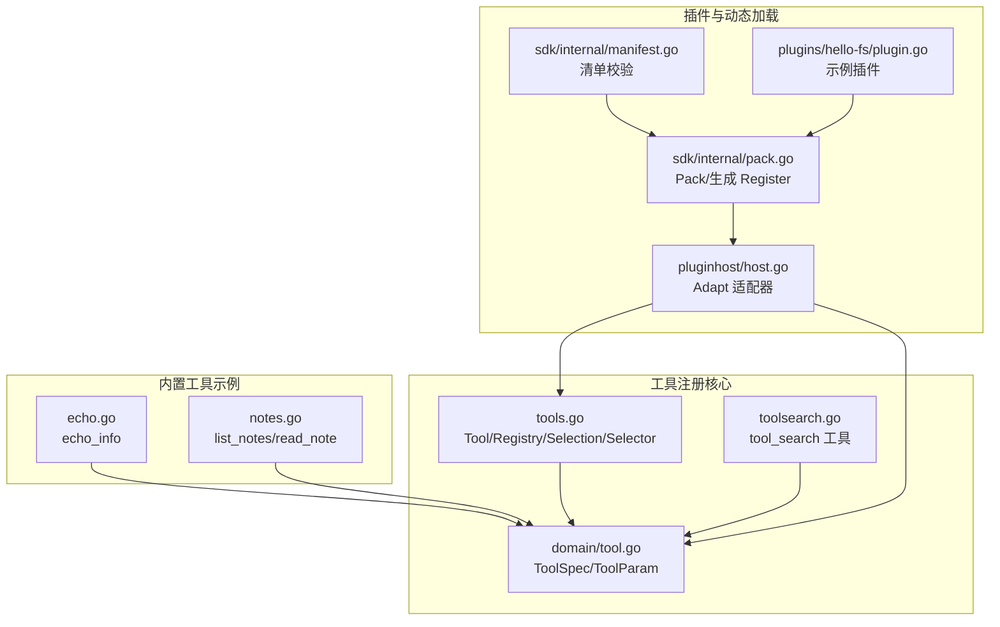
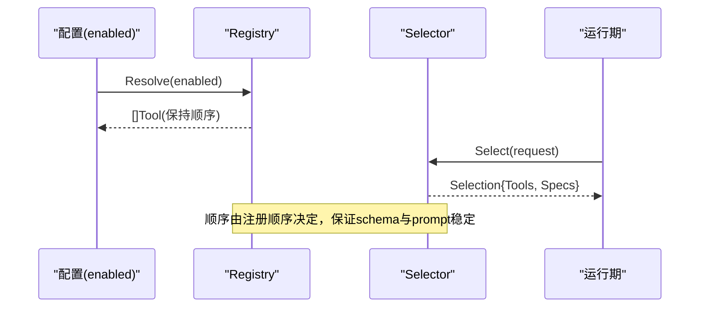
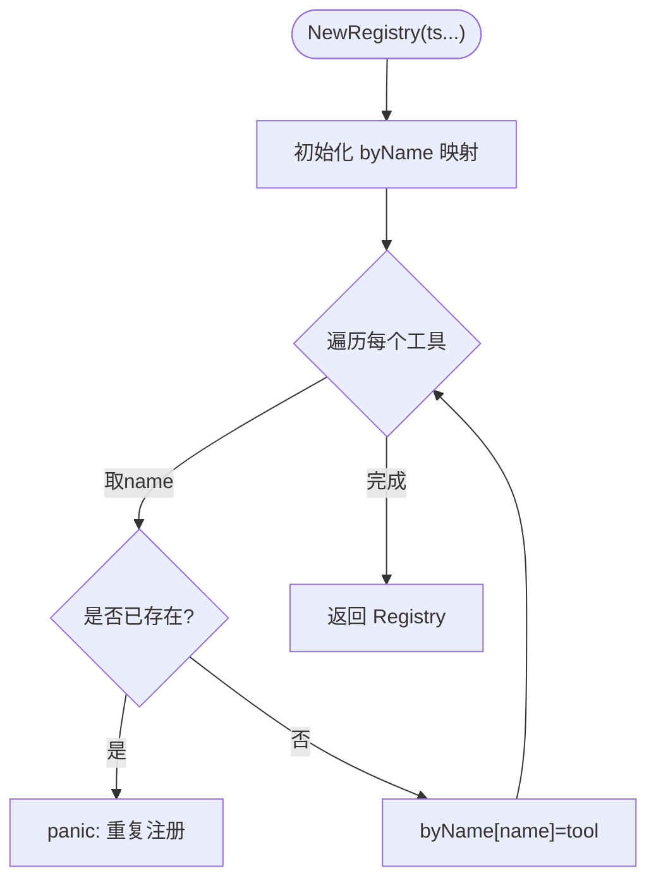
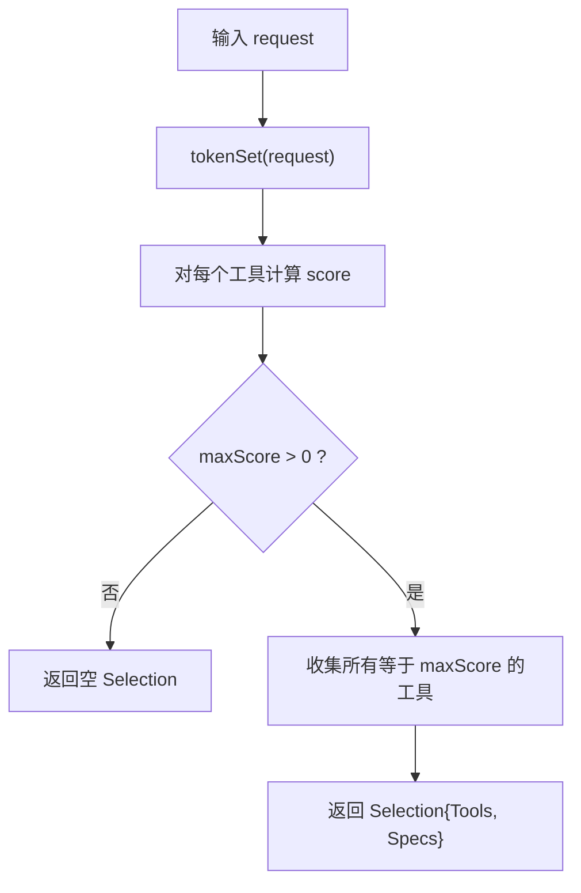
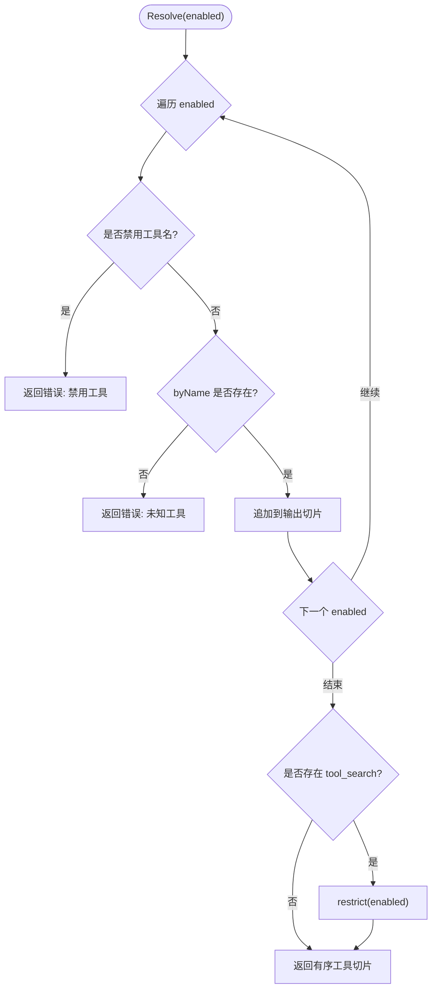
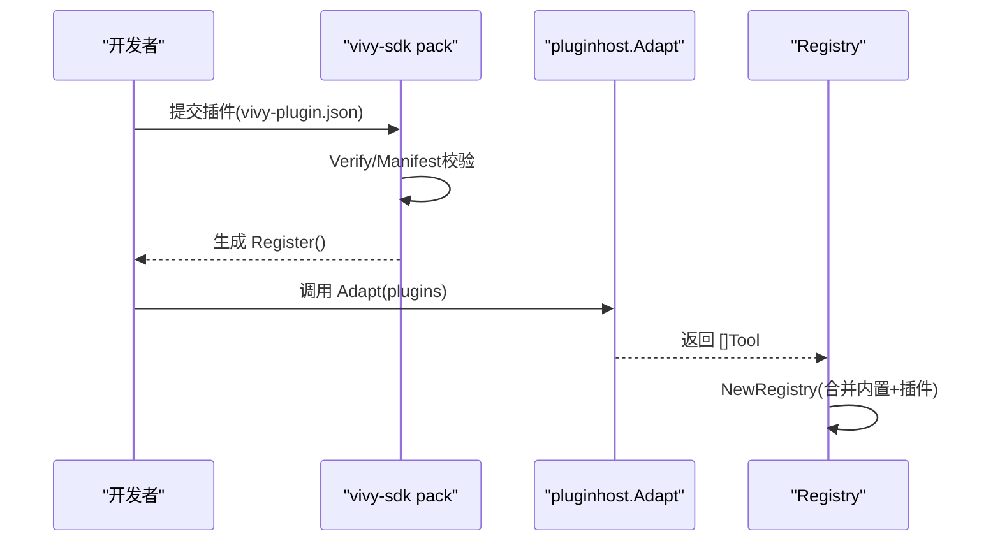
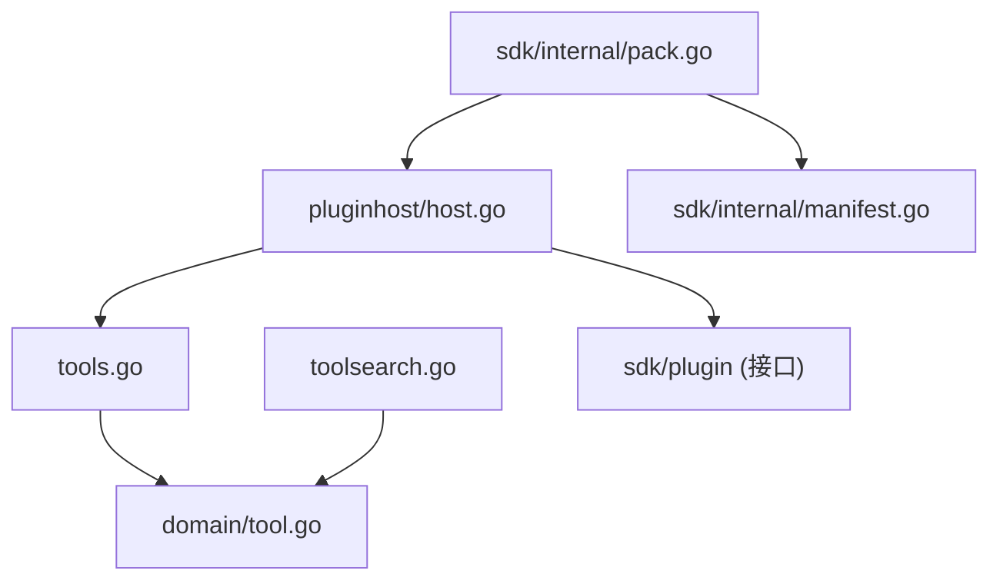

# 工具注册系统

<cite>
**本文引用的文件**
- [internal/tools/tools.go](file://internal/tools/tools.go)
- [internal/tools/toolsearch.go](file://internal/tools/toolsearch.go)
- [internal/domain/tool.go](file://internal/domain/tool.go)
- [internal/tools/echo.go](file://internal/tools/echo.go)
- [internal/tools/notes.go](file://internal/tools/notes.go)
- [internal/pluginhost/host.go](file://internal/pluginhost/host.go)
- [sdk/internal/pack.go](file://sdk/internal/pack.go)
- [sdk/internal/manifest.go](file://sdk/internal/manifest.go)
- [plugins/hello-fs/plugin.go](file://plugins/hello-fs/plugin.go)
- [internal/tools/tools_test.go](file://internal/tools/tools_test.go)
</cite>

## 目录
1. [简介](#简介)
2. [项目结构](#项目结构)
3. [核心组件](#核心组件)
4. [架构总览](#架构总览)
5. [详细组件分析](#详细组件分析)
6. [依赖关系分析](#依赖关系分析)
7. [性能考量](#性能考量)
8. [故障排查指南](#故障排查指南)
9. [结论](#结论)
10. [附录](#附录)

## 简介
本文件系统性阐述 Vivy 的工具注册系统，聚焦以下目标：
- 解释 Registry 结构体与 byName 映射的设计、重复名称检测机制。
- 说明 Builtin* 系列工厂函数如何渐进式构建工具能力集（从基础到完整）。
- 阐明工具注册的顺序保持机制，确保 provider schemas 和 prompts 的确定性。
- 解析 Resolve 方法的配置驱动解析逻辑，包括 enabled 列表处理与未知工具名错误。
- 提供自定义工具注册指南（命名规范、依赖注入、测试最佳实践）。
- 覆盖工具发现机制与动态加载策略（插件体系）。

## 项目结构
工具注册系统位于 internal/tools 包，围绕 Tool 接口、Registry、Selection、Selector 以及一系列 Builtin* 工厂函数组织；domain 层定义工具元数据契约；pluginhost 将用户插件适配为 Vivy 工具；sdk 负责插件打包与清单校验。



图表来源
- [internal/tools/tools.go:223-361](file://internal/tools/tools.go#L223-L361)
- [internal/tools/toolsearch.go:15-93](file://internal/tools/toolsearch.go#L15-L93)
- [internal/domain/tool.go:27-61](file://internal/domain/tool.go#L27-L61)
- [internal/pluginhost/host.go:22-55](file://internal/pluginhost/host.go#L22-L55)
- [sdk/internal/pack.go:67-118](file://sdk/internal/pack.go#L67-L118)
- [sdk/internal/manifest.go:14-48](file://sdk/internal/manifest.go#L14-L48)
- [plugins/hello-fs/plugin.go:17-37](file://plugins/hello-fs/plugin.go#L17-L37)

章节来源
- [internal/tools/tools.go:223-361](file://internal/tools/tools.go#L223-L361)
- [internal/tools/toolsearch.go:15-93](file://internal/tools/toolsearch.go#L15-L93)
- [internal/domain/tool.go:27-61](file://internal/domain/tool.go#L27-L61)
- [internal/pluginhost/host.go:22-55](file://internal/pluginhost/host.go#L22-L55)
- [sdk/internal/pack.go:67-118](file://sdk/internal/pack.go#L67-L118)
- [sdk/internal/manifest.go:14-48](file://sdk/internal/manifest.go#L14-L48)
- [plugins/hello-fs/plugin.go:17-37](file://plugins/hello-fs/plugin.go#L17-L37)

## 核心组件
- Tool 接口：统一的可调用契约，包含 Spec() 描述与 InvokableRun() 执行入口。
- Registry：以 byName 映射维护工具名到实现的注册表，支持按启用列表解析并保持顺序。
- Selection/Selector：请求级选择器，基于关键词匹配最小化工具集，保证确定性与可预测性。
- tool_search：内置搜索工具，暴露受限的目录查询能力，并受启用列表限制。
- domain.ToolSpec/ToolParam：工具元数据与参数 schema 描述，用于运行时向模型发布能力。

章节来源
- [internal/tools/tools.go:17-27](file://internal/tools/tools.go#L17-L27)
- [internal/tools/tools.go:122-181](file://internal/tools/tools.go#L122-L181)
- [internal/tools/toolsearch.go:15-62](file://internal/tools/toolsearch.go#L15-L62)
- [internal/domain/tool.go:27-61](file://internal/domain/tool.go#L27-L61)

## 架构总览
工具注册系统采用“工厂装配 + 配置驱动解析”的模式：
- 工厂链：Builtin -> BuiltinWithFileOps -> ... -> BuiltinWithCommands，逐步叠加能力。
- 注册阶段：NewRegistry 将所有工具加入 byName 映射，检测重复名称。
- 解析阶段：Resolve(enabled) 根据配置返回有序工具切片，并限制 tool_search 可见范围。
- 选择阶段：Selector.Select(request) 基于关键词选择最小工具子集，避免无关工具进入上下文。
- 插件扩展：通过 pluginhost.Adapt 将用户插件转换为 Tool，纳入注册或按需发现。



图表来源
- [internal/tools/tools.go:231-241](file://internal/tools/tools.go#L231-L241)
- [internal/tools/tools.go:345-361](file://internal/tools/tools.go#L345-L361)
- [internal/tools/tools.go:151-181](file://internal/tools/tools.go#L151-L181)

## 详细组件分析

### Registry 与 byName 映射
- 设计要点
  - byName 是 map[string]Tool，键为工具名，值为实现。
  - NewRegistry 在构造时遍历工具，若检测到重复名称则 panic，防止静默覆盖。
  - Resolve(enabled) 按 enabled 顺序输出工具切片，保证 provider schemas 与 prompts 的确定性。
  - 对 tool_search 工具，Resolve 会调用 restrict(enabled) 限制其可查范围，避免泄露未启用工具。



图表来源
- [internal/tools/tools.go:231-241](file://internal/tools/tools.go#L231-L241)

章节来源
- [internal/tools/tools.go:223-241](file://internal/tools/tools.go#L223-L241)
- [internal/tools/tools.go:345-361](file://internal/tools/tools.go#L345-L361)
- [internal/tools/toolsearch.go:46-54](file://internal/tools/toolsearch.go#L46-L54)

### Builtin* 工厂链：渐进式能力构建
- 能力分层
  - Builtin：仅非文件系统工具（兼容旧测试面）。
  - BuiltinWithFileOps：增加读写文件、搜索、补丁等文件系统家族。
  - BuiltinWithCapabilities：增加 Skills 家族。
  - BuiltinWithTodo：增加任务管理家族。
  - BuiltinWithSearch：增加网络搜索工具。
  - BuiltinWithHTTP：增加只读 HTTP 工具。
  - BuiltinWithMCP：增加 MCP 目录与调用工具。
  - BuiltinWithSequential：增加本地推理状态工具。
  - BuiltinWithCommands：增加命令执行与命令行工具，并附加 tool_search。
- 构建原则
  - 所有后端通过接口注入（如 FileOperations、SkillOperations、SearchOperations 等），保持包独立于具体实现。
  - 可选能力通过 nil 判断决定是否注册对应工具，便于裁剪。
  - 最终统一调用 NewRegistry 完成注册。


图表来源
- [internal/tools/tools.go:246-317](file://internal/tools/tools.go#L246-L317)

章节来源
- [internal/tools/tools.go:246-317](file://internal/tools/tools.go#L246-L317)

### 工具选择的确定性：Selection 与 Selector
- Selection 保存 Tools 与 Specs 两个切片，Names() 返回工具名序列，供上下文传播。
- Selector.Select(request) 使用工具声明的 Keywords（无则回退到名称分词）进行匹配，计算得分并选取最高分的工具集合，避免无关工具进入提示。
- 该过程不依赖嵌入向量或模型调用，保持路由稳定与可预测。



图表来源
- [internal/tools/tools.go:151-181](file://internal/tools/tools.go#L151-L181)
- [internal/tools/tools.go:183-217](file://internal/tools/tools.go#L183-L217)

章节来源
- [internal/tools/tools.go:122-181](file://internal/tools/tools.go#L122-L181)
- [internal/tools/tools.go:183-217](file://internal/tools/tools.go#L183-L217)

### Resolve 的配置驱动解析
- 行为
  - 遍历 enabled 列表，拒绝浏览器自动化相关工具名。
  - 查找 byName，若不存在返回错误（启动时配置校验失败）。
  - 按 enabled 顺序追加工具，保持顺序稳定性。
  - 若注册表中存在 tool_search，调用 restrict(enabled) 限制其可查范围。
- 错误处理
  - 未知工具名：返回明确错误，便于 CI/启动时拦截。
  - 被禁用的工具名：直接报错退出。



图表来源
- [internal/tools/tools.go:345-361](file://internal/tools/tools.go#L345-L361)
- [internal/tools/toolsearch.go:46-54](file://internal/tools/toolsearch.go#L46-L54)

章节来源
- [internal/tools/tools.go:345-361](file://internal/tools/tools.go#L345-L361)
- [internal/tools/toolsearch.go:46-54](file://internal/tools/toolsearch.go#L46-L54)

### 工具搜索工具 tool_search
- 作用：暴露受限的目录查询能力，支持 select:name 精确选择与关键词模糊匹配。
- 安全：通过 restrict(enabled) 限制可查工具集合，避免泄露未启用工具。
- 缓存：对查询结果进行简单缓存，减少重复计算。

```mermaid
classDiagram
class toolSearchTool {
+catalog map[string]ToolSearchMatch
+cache map[string][]ToolSearchMatch
+allowed map[string]struct{}
+Spec() ToolSpec
+InvokableRun(ctx, args) string,error
+restrict(names)
-search(query, limit) []ToolSearchMatch
-isAllowed(name) bool
}
```

图表来源
- [internal/tools/toolsearch.go:30-93](file://internal/tools/toolsearch.go#L30-L93)
- [internal/tools/toolsearch.go:95-160](file://internal/tools/toolsearch.go#L95-L160)

章节来源
- [internal/tools/toolsearch.go:15-93](file://internal/tools/toolsearch.go#L15-L93)
- [internal/tools/toolsearch.go:95-160](file://internal/tools/toolsearch.go#L95-L160)

### 内置工具示例：echo_info 与 notes
- echo_info：只读、无需审批、自动执行，用于快速验证与调试。
- list_notes/read_note：只读笔记工具，输出有界，避免事件负载过大。

章节来源
- [internal/tools/echo.go:12-57](file://internal/tools/echo.go#L12-L57)
- [internal/tools/notes.go:16-151](file://internal/tools/notes.go#L16-L151)

### 自定义工具注册指南
- 命名规范
  - 工具名需唯一，重复会在 NewRegistry 中 panic。
  - 建议遵循小写加下划线或连字符的约定，便于关键词匹配与路由。
- 依赖注入模式
  - 通过接口注入后端（如 FileOperations、SkillOperations、SearchOperations 等），保持工具实现与具体实现解耦。
  - 使用 BuiltinWith* 工厂链组合所需能力，避免硬编码依赖。
- 测试最佳实践
  - 使用 ValidateArgs 校验参数 schema，确保无效参数不会到达副作用逻辑。
  - 针对 ArgError 类型断言，确保错误结构化且可序列化。
  - 利用 Selector 测试关键词路由，确保选择器行为符合预期。
  - 对 Resolve 测试覆盖未知工具名与空 enabled 场景。

章节来源
- [internal/tools/tools_test.go:11-164](file://internal/tools/tools_test.go#L11-L164)
- [internal/tools/tools.go:41-84](file://internal/tools/tools.go#L41-L84)

### 工具发现机制与动态加载
- 插件适配
  - pluginhost.Adapt 将 sdk/plugin.Tool 转换为 Vivy Tool，保留名称、效果、schema 与关键词。
  - 插件通过 vivy-sdk verify/pack 流程验证与打包，生成 Register 函数集中注册。
- 清单校验
  - manifest 校验工具名唯一性、effect 合法、schema 为对象。
- 示例插件
  - hello-fs 展示读取工作区文件的只读工具，路径限制在工作区内，避免越权访问。



图表来源
- [internal/pluginhost/host.go:22-55](file://internal/pluginhost/host.go#L22-L55)
- [sdk/internal/pack.go:67-118](file://sdk/internal/pack.go#L67-L118)
- [sdk/internal/manifest.go:14-48](file://sdk/internal/manifest.go#L14-L48)
- [plugins/hello-fs/plugin.go:17-37](file://plugins/hello-fs/plugin.go#L17-L37)

章节来源
- [internal/pluginhost/host.go:22-55](file://internal/pluginhost/host.go#L22-L55)
- [sdk/internal/pack.go:67-118](file://sdk/internal/pack.go#L67-L118)
- [sdk/internal/manifest.go:14-48](file://sdk/internal/manifest.go#L14-L48)
- [plugins/hello-fs/plugin.go:17-37](file://plugins/hello-fs/plugin.go#L17-L37)

## 依赖关系分析
- 内部依赖
  - tools 包依赖 domain 定义工具元数据。
  - toolsearch 依赖 domain 并受 Registry.Resolve 控制可见范围。
  - pluginhost 依赖 tools 与 sdk/plugin，将插件工具桥接到 Vivy 工具契约。
- 外部依赖
  - 存储与操作接口（NoteStore、FileOperations、SkillOperations、SearchOperations、HTTPOperations、MCPOperations、CommandOperations、SequentialThinkingOperations）通过注入方式引入，避免耦合。
- 潜在循环
  - 当前结构清晰，无循环依赖迹象。



图表来源
- [internal/tools/tools.go:223-361](file://internal/tools/tools.go#L223-L361)
- [internal/tools/toolsearch.go:15-93](file://internal/tools/toolsearch.go#L15-L93)
- [internal/pluginhost/host.go:22-55](file://internal/pluginhost/host.go#L22-L55)
- [sdk/internal/pack.go:67-118](file://sdk/internal/pack.go#L67-L118)
- [sdk/internal/manifest.go:14-48](file://sdk/internal/manifest.go#L14-L48)

章节来源
- [internal/tools/tools.go:223-361](file://internal/tools/tools.go#L223-L361)
- [internal/tools/toolsearch.go:15-93](file://internal/tools/toolsearch.go#L15-L93)
- [internal/pluginhost/host.go:22-55](file://internal/pluginhost/host.go#L22-L55)
- [sdk/internal/pack.go:67-118](file://sdk/internal/pack.go#L67-L118)
- [sdk/internal/manifest.go:14-48](file://sdk/internal/manifest.go#L14-L48)

## 性能考量
- 注册阶段
  - NewRegistry 使用预分配容量的 map，减少扩容开销。
  - 重复检测 O(n)，n 为工具数量，通常较小。
- 解析阶段
  - Resolve(enabled) 线性扫描 enabled 列表，查找 byName 为 O(1)。
  - tool_search.restrict 仅在存在时执行，影响有限。
- 选择阶段
  - Selector.Select 对每个工具计算 score，时间复杂度 O(m*k)，m 为工具数，k 为关键词数；整体轻量。
- 搜索工具
  - tool_search 使用内存缓存，命中后直接返回，降低重复查询成本。

[本节为通用指导，不直接分析具体文件]

## 故障排查指南
- 常见错误
  - 重复注册：NewRegistry 遇到重复工具名会 panic，检查工具名唯一性。
  - 未知工具名：Resolve 对不在 byName 中的名称返回错误，检查配置 enabled 列表。
  - 参数校验失败：ValidateArgs 返回 ArgError，检查 JSON 结构与类型。
  - 工具被禁用：Resolve 拒绝特定工具名（如浏览器自动化），调整配置。
- 定位方法
  - 查看工具 Spec().Name 与实际注册名是否一致。
  - 使用 Selector 测试关键词匹配，确认路由是否符合预期。
  - 对 tool_search 使用 restrict(enabled) 后的查询结果验证权限边界。

章节来源
- [internal/tools/tools_test.go:131-164](file://internal/tools/tools_test.go#L131-L164)
- [internal/tools/tools.go:231-241](file://internal/tools/tools.go#L231-L241)
- [internal/tools/tools.go:345-361](file://internal/tools/tools.go#L345-L361)
- [internal/tools/tools.go:41-84](file://internal/tools/tools.go#L41-L84)

## 结论
Vivy 的工具注册系统通过清晰的接口契约、渐进式工厂装配、配置驱动的解析与选择机制，实现了高内聚、低耦合、可扩展的工具生态。byName 映射与重复检测保障注册正确性；Builtin* 工厂链支持灵活的能力组合；Resolve 保证顺序与安全性；Selector 提供稳定的请求路由；插件体系支持动态扩展。结合严格的参数校验与错误处理，系统在可靠性与可维护性方面具备良好基础。

[本节为总结性内容，不直接分析具体文件]

## 附录
- 关键常量与名称
  - EchoInfoName、ListNotesName、ReadNoteName、ToolSearchName。
- 推荐实践
  - 为新工具提供明确的 Keywords，提升路由准确性。
  - 使用 BuiltinWith* 工厂链组合能力，避免手动拼接工具列表。
  - 在插件中严格校验输入与路径，遵循最小权限原则。

[本节为补充信息，不直接分析具体文件]