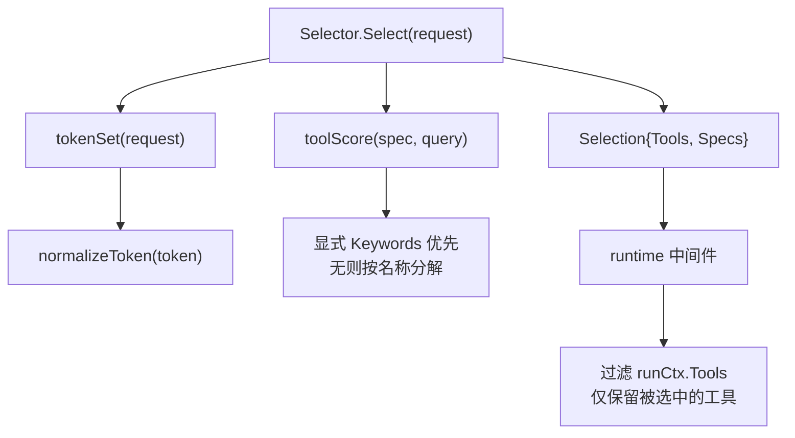
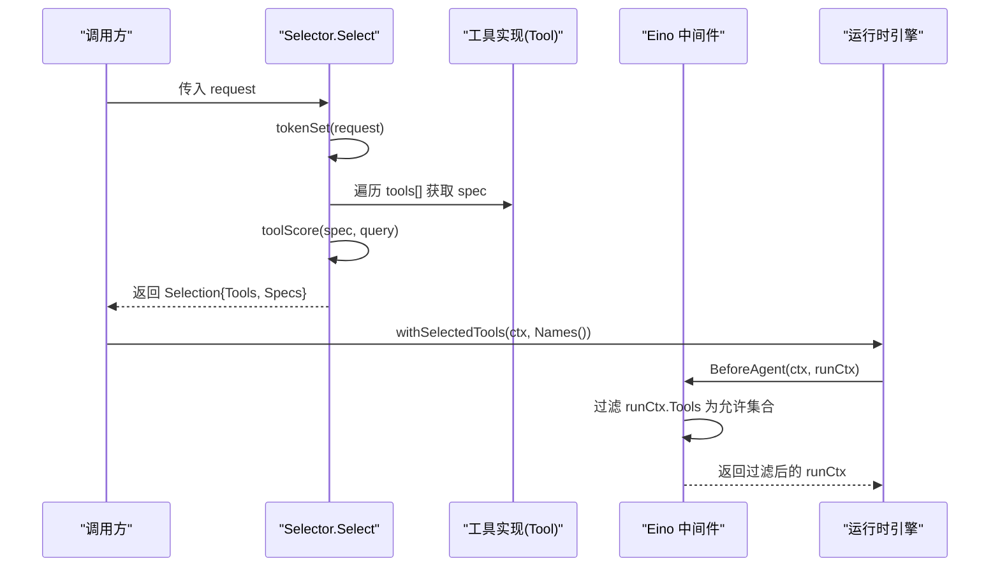
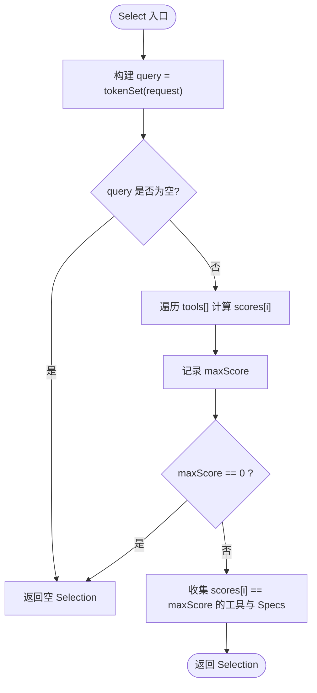
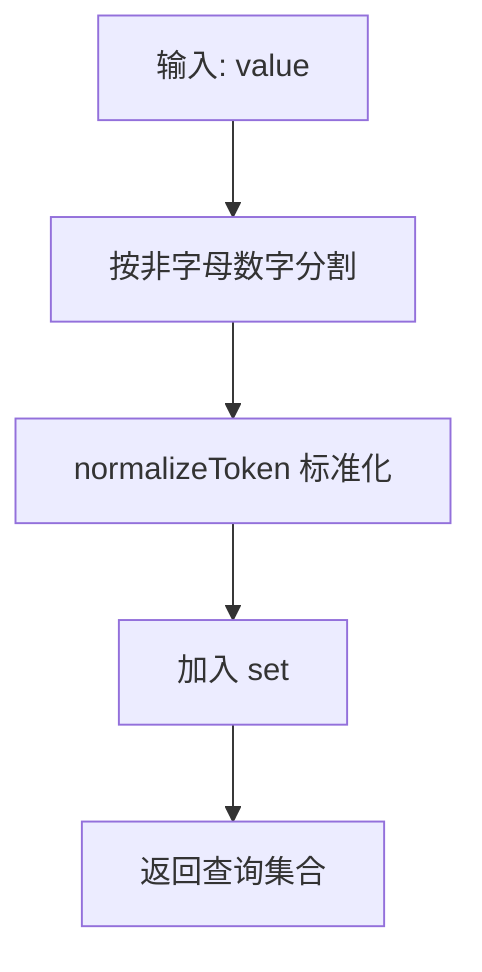
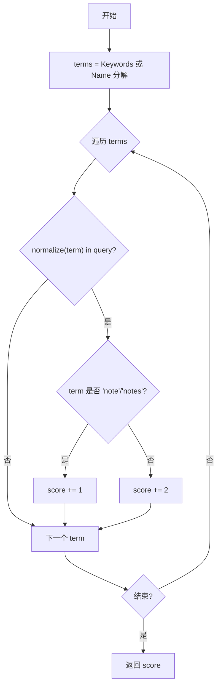
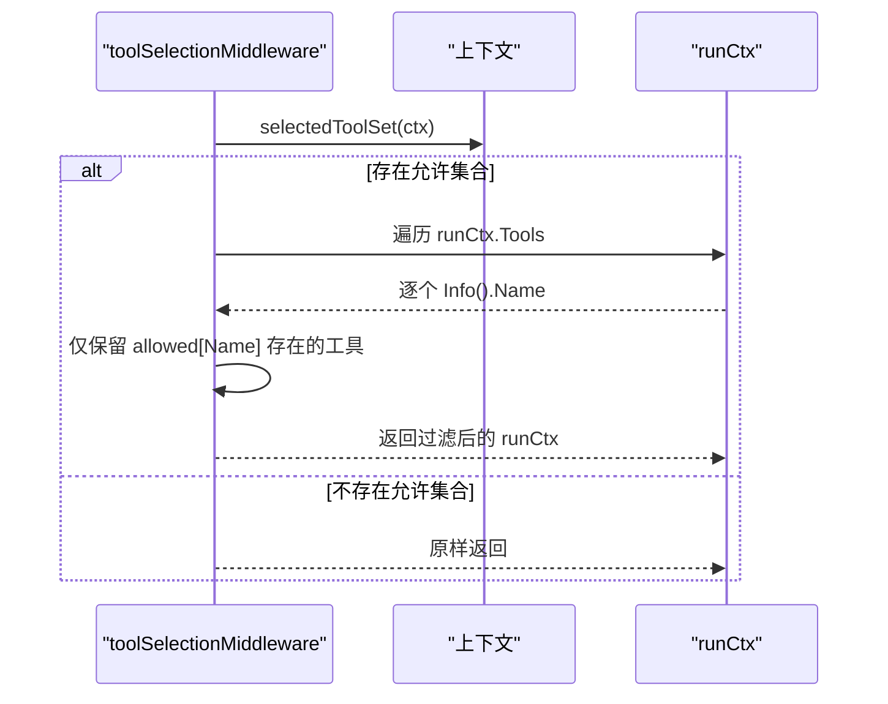
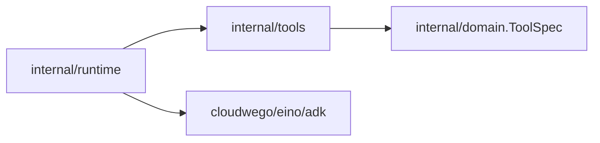

# 工具选择算法

<cite>
**本文引用的文件**
- [tools.go](file://internal/tools/tools.go)
- [toolselection.go](file://internal/runtime/toolselection.go)
- [toolselection_middleware.go](file://internal/runtime/toolselection_middleware.go)
- [tool.go](file://internal/domain/tool.go)
- [tools_test.go](file://internal/tools/tools_test.go)
</cite>

## 目录
1. [简介](#简介)
2. [项目结构](#项目结构)
3. [核心组件](#核心组件)
4. [架构总览](#架构总览)
5. [详细组件分析](#详细组件分析)
6. [依赖关系分析](#依赖关系分析)
7. [性能考虑](#性能考虑)
8. [故障排查指南](#故障排查指南)
9. [结论](#结论)

## 简介
本文件系统性说明 Vivy 运行时中的“工具选择算法”，聚焦以下目标：
- 解释 Selector 结构体与 Select 方法的设计与实现原理。
- 详解关键词匹配算法：tokenSet 分词、normalizeToken 标准化、大小写不敏感匹配。
- 解析评分机制 toolScore：显式 keywords 优先于名称分解的策略，以及 note/notes 的特殊权重处理。
- 说明 Selection 结构体的设计，包含 Tools 与 Specs 两个切片的同步维护。
- 提供算法性能优化分析（时间复杂度、内存使用）。
- 给出调试技巧与常见问题排查（如工具未被选中的原因分析与调优建议）。

## 项目结构
工具选择相关代码分布在两个层次：
- internal/tools：定义工具契约、选择器 Selector、评分与分词逻辑、Selection 结果结构。
- internal/runtime：在 Eino Agent 边界通过中间件将选择结果限制到当前请求的工具集合，形成双重保障。

图示来源
- [tools.go:151-181](file://internal/tools/tools.go#L151-L181)
- [tools.go:183-217](file://internal/tools/tools.go#L183-L217)
- [toolselection_middleware.go:23-40](file://internal/runtime/toolselection_middleware.go#L23-L40)

章节来源
- [tools.go:122-181](file://internal/tools/tools.go#L122-L181)
- [toolselection_middleware.go:11-40](file://internal/runtime/toolselection_middleware.go#L11-L40)

## 核心组件
- Selector：基于已配置的工具列表进行保守、确定性的请求路由。只有当请求包含工具的显式关键词或名称片段时，才会选中该工具。
- Selection：保存本次请求选中的工具及其规范，保持注册顺序以维持确定性。
- 中间件 toolSelectionMiddleware：在 Eino Agent 边界根据上下文中的允许工具集合过滤模型可用的工具集，形成第二道防线。

章节来源
- [tools.go:138-181](file://internal/tools/tools.go#L138-L181)
- [toolselection_middleware.go:11-40](file://internal/runtime/toolselection_middleware.go#L11-L40)

## 架构总览
选择流程分为两层：
1) 选择层（internal/tools）：对请求文本进行分词与标准化，计算每个工具的得分，选出最高分的工具集合。
2) 执行层（internal/runtime）：将选择结果注入上下文，并在 Eino Agent 启动前过滤掉未选中的工具，确保模型节点只能看到最小必要工具集。

图示来源
- [tools.go:151-181](file://internal/tools/tools.go#L151-L181)
- [toolselection.go:7-21](file://internal/runtime/toolselection.go#L7-L21)
- [toolselection_middleware.go:23-40](file://internal/runtime/toolselection_middleware.go#L23-L40)

## 详细组件分析

### Selector 与 Select 方法
- 输入：原始请求字符串。
- 步骤：
  - 将请求分词并标准化为查询集合 query。
  - 对每个工具计算得分 scores[i] = toolScore(spec, query)。
  - 记录最大得分 maxScore；若为 0 则返回空选择。
  - 收集所有得分等于 maxScore 的工具，同时追加其 ToolSpec，保证 Tools 与 Specs 切片一一对应且顺序一致。
- 输出：Selection，包含 Tools 与 Specs 两个切片。

图示来源
- [tools.go:151-181](file://internal/tools/tools.go#L151-L181)

章节来源
- [tools.go:151-181](file://internal/tools/tools.go#L151-L181)

### 关键词匹配算法
- tokenSet(value)：
  - 使用非字母数字字符作为分隔符进行分词。
  - 对每个 token 调用 normalizeToken 去空白并转小写。
  - 将有效 token 放入 map[string]struct{} 作为查询集合。
- normalizeToken(value)：
  - 去除首尾空白后统一转为小写，实现大小写不敏感匹配。
- 匹配策略：
  - 工具侧的关键词（spec.Keywords）优先；若无显式关键词，则回退到按名称中的下划线或连字符拆分得到的片段。
  - 匹配时比较的是标准化后的 token，因此 "Note"、"NOTE"、"note" 视为相同。

图示来源
- [tools.go:204-217](file://internal/tools/tools.go#L204-L217)

章节来源
- [tools.go:204-217](file://internal/tools/tools.go#L204-L217)

### 评分机制 toolScore
- 术语来源：
  - 优先使用 spec.Keywords 作为候选术语集合。
  - 若为空，则回退到按 "_" 或 "-" 拆分 spec.Name 得到的片段。
- 权重规则：
  - 每个术语若在 query 中命中，基础权重为 2。
  - 特殊处理：当标准化后的术语为 "note" 或 "notes" 时，权重降为 1，避免通用词导致多个笔记类工具同时被选中。
- 最终得分：命中术语权重之和。

图示来源
- [tools.go:183-202](file://internal/tools/tools.go#L183-L202)

章节来源
- [tools.go:183-202](file://internal/tools/tools.go#L183-L202)

### Selection 结构设计
- 字段：
  - Tools []Tool：选中的工具实例。
  - Specs []domain.ToolSpec：对应的工具规范。
- 设计要点：
  - 两者长度相等且顺序一致，便于后续传播 Names() 与下游消费。
  - 保持注册顺序，确保 provider schema 与提示词等行为的确定性。
- 辅助方法：
  - Names()：从 Specs 中提取工具名列表，用于上下文传播。

章节来源
- [tools.go:122-136](file://internal/tools/tools.go#L122-L136)

### 运行时中间件：二次过滤
- 作用：在 Eino Agent 边界，依据上下文中的允许工具集合，过滤 runCtx.Tools，使模型和工具节点仅能看到被选中的工具。
- 行为：
  - 若上下文中没有设置允许集合，则不做任何过滤。
  - 否则逐一检查工具信息，仅保留名称在允许集合中的工具。
- 安全意义：即使上游选择出错，中间件仍可作为第二道防线防止无关工具暴露给模型。

图示来源
- [toolselection_middleware.go:23-40](file://internal/runtime/toolselection_middleware.go#L23-L40)
- [toolselection.go:7-21](file://internal/runtime/toolselection.go#L7-L21)

章节来源
- [toolselection_middleware.go:11-40](file://internal/runtime/toolselection_middleware.go#L11-L40)
- [toolselection.go:7-21](file://internal/runtime/toolselection.go#L7-L21)

## 依赖关系分析
- internal/tools 包：
  - 依赖 domain.ToolSpec 描述工具元数据（名称、关键词、参数等）。
  - 不依赖 Eino，保持工具选择逻辑独立。
- internal/runtime 包：
  - 依赖 Eino 的 adk 中间件接口，在 Agent 边界实施工具可见性过滤。
  - 通过 context 键值传递允许工具集合，实现请求级隔离。

图示来源
- [tools.go:1-15](file://internal/tools/tools.go#L1-L15)
- [toolselection_middleware.go:1-9](file://internal/runtime/toolselection_middleware.go#L1-L9)

章节来源
- [tools.go:1-15](file://internal/tools/tools.go#L1-L15)
- [toolselection_middleware.go:1-9](file://internal/runtime/toolselection_middleware.go#L1-L9)

## 性能考虑
- 时间复杂度：
  - tokenSet：O(N)，N 为请求字符串长度。
  - 评分：O(M·K)，M 为工具数量，K 为每个工具的术语数（Keywords 或名称片段）。
  - 总体：O(N + M·K)。
- 空间复杂度：
  - query 集合最多 O(U)，U 为不同 token 数。
  - scores 数组 O(M)。
  - Selection 结果 O(P)，P 为选中工具数。
- 优化点：
  - 若工具数量很大，可预先缓存各工具的术语集合与权重映射，减少重复计算。
  - 对高频短请求，可引入快速路径：若 query 为空直接返回空选择。
  - 注意 note/notes 的降权策略已在常数时间内判断，开销极低。

## 故障排查指南
- 现象：工具未被选中
  - 可能原因：
    - 请求未包含任何工具的显式关键词或名称片段。
    - 关键词大小写不一致（已通过 normalizeToken 解决，但仍需确认拼写）。
    - 工具未配置 Keywords，且名称片段与请求不匹配。
    - 运行时无效的上下文未注入允许集合，导致中间件未生效（但不会阻止选择本身）。
  - 排查步骤：
    - 打印或断言 Select(request).Names()，确认返回集合是否符合预期。
    - 检查对应工具的 Spec.Keywords 与 Spec.Name，必要时补充更明确的关键词。
    - 验证 withSelectedTools 是否正确注入允许集合。
    - 在中间件中观察 runCtx.Tools 过滤前后差异。
- 现象：多个工具同时被选中
  - 可能原因：
    - 多个工具具有相同的最高得分。
    - 通用词（如 note/notes）因降权仍可能与其他工具并列。
  - 处理建议：
    - 为工具提供更具体的 Keywords，提高区分度。
    - 调整业务语义，确保请求能明确指向单一工具。
- 现象：模型仍然看到了未选中的工具
  - 可能原因：
    - 未在运行时注入允许集合，或中间件未正确装配。
  - 处理建议：
    - 确认 Engine 调用链中使用了 withSelectedTools 与 newToolSelectionMiddleware。
    - 在 BeforeAgent 中增加日志，记录过滤前后的工具列表。

章节来源
- [tools_test.go:34-53](file://internal/tools/tools_test.go#L34-L53)
- [toolselection_middleware.go:23-40](file://internal/runtime/toolselection_middleware.go#L23-L40)
- [toolselection.go:7-21](file://internal/runtime/toolselection.go#L7-L21)

## 结论
本算法以“显式关键词优先、名称片段兜底”的原则，结合标准化与大小写不敏感匹配，实现了稳定、可预测的工具选择。通过 Selection 的双切片设计与运行时中间件的二次过滤，既保证了选择的准确性，也提供了执行时的安全性。对于大规模工具集，可通过术语缓存与快速路径进一步优化性能。实际使用中，建议为工具配置明确的 Keywords，并配合测试用例持续验证选择行为。