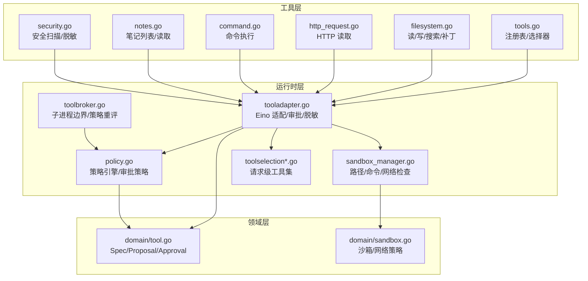
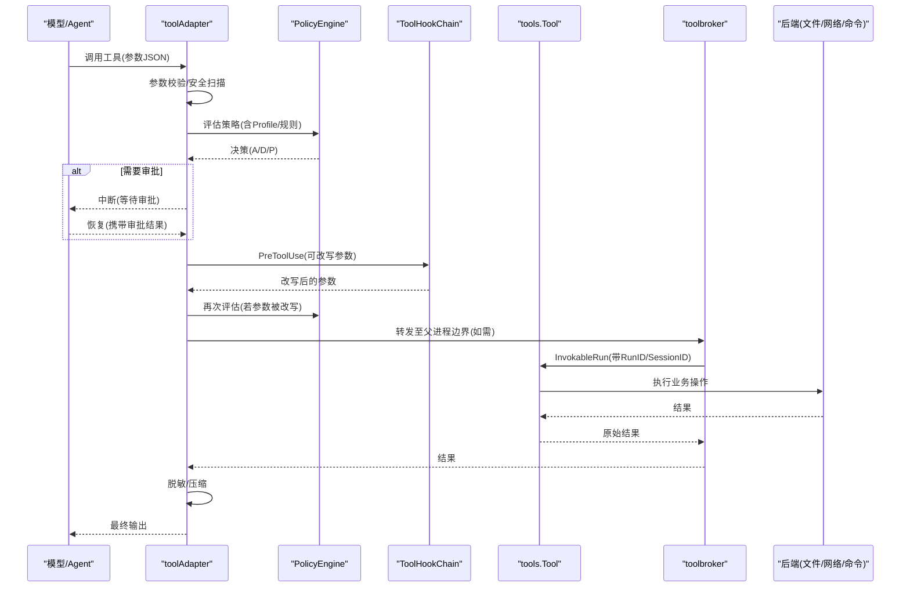
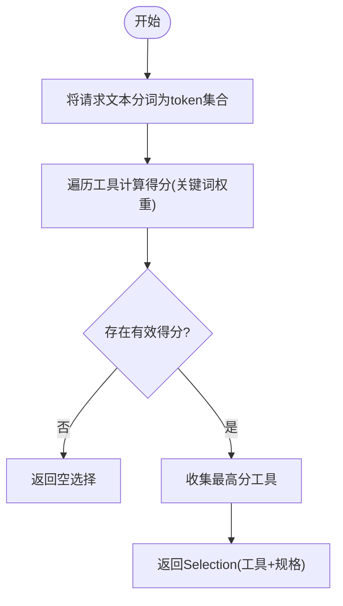
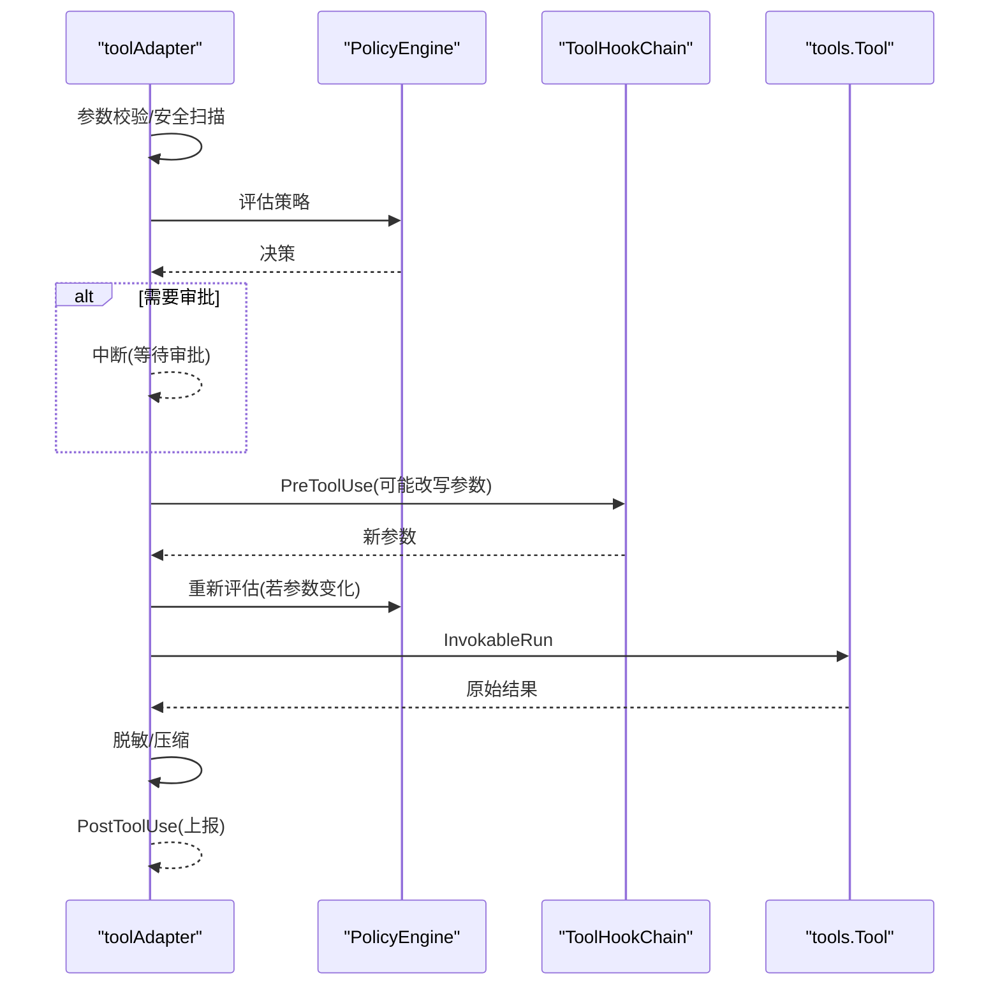
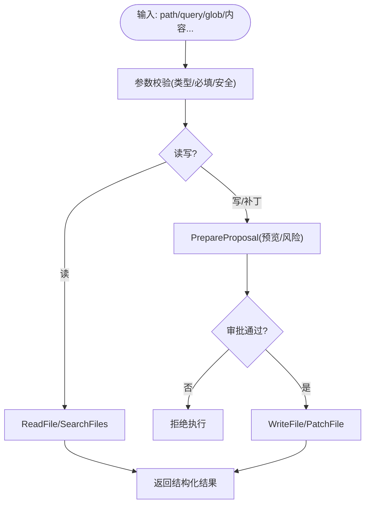
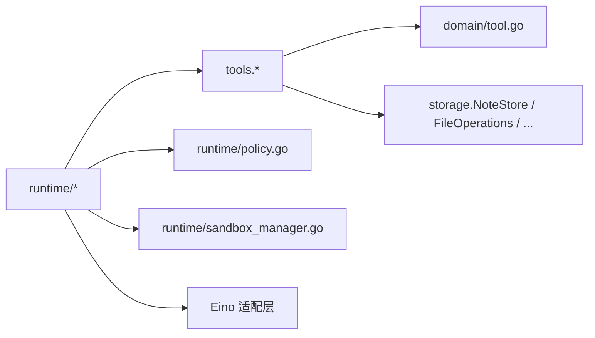

# 工具系统

<cite>
**本文引用的文件**
- [internal/tools/tools.go](file://internal/tools/tools.go)
- [internal/tools/filesystem.go](file://internal/tools/filesystem.go)
- [internal/tools/http_request.go](file://internal/tools/http_request.go)
- [internal/tools/command.go](file://internal/tools/command.go)
- [internal/tools/notes.go](file://internal/tools/notes.go)
- [internal/tools/security.go](file://internal/tools/security.go)
- [internal/runtime/tooladapter.go](file://internal/runtime/tooladapter.go)
- [internal/runtime/toolbroker.go](file://internal/runtime/toolbroker.go)
- [internal/runtime/toolselection.go](file://internal/runtime/toolselection.go)
- [internal/runtime/toolselection_middleware.go](file://internal/runtime/toolselection_middleware.go)
- [internal/runtime/policy.go](file://internal/runtime/policy.go)
- [internal/runtime/sandbox_manager.go](file://internal/runtime/sandbox_manager.go)
- [internal/domain/tool.go](file://internal/domain/tool.go)
- [internal/domain/sandbox.go](file://internal/domain/sandbox.go)
</cite>

## 目录
1. [简介](#简介)
2. [项目结构](#项目结构)
3. [核心组件](#核心组件)
4. [架构总览](#架构总览)
5. [详细组件分析](#详细组件分析)
6. [依赖关系分析](#依赖关系分析)
7. [性能与资源限制](#性能与资源限制)
8. [故障排查指南](#故障排查指南)
9. [结论](#结论)
10. [附录：自定义工具开发指南](#附录自定义工具开发指南)

## 简介
本文件系统化阐述 Vivy 工具系统的架构设计、注册机制、选择算法与安全沙箱模型，覆盖文件系统操作、网络请求、命令执行、笔记管理等内置工具的功能与用法；深入解释权限控制、资源限制、审批流程；并提供自定义工具开发完整指南（接口实现、参数验证、错误处理）、工具发现机制、性能优化与调试技巧，以及实际使用示例与最佳实践。

## 项目结构
工具系统由“工具定义与实现”“运行时适配与编排”“策略与沙箱”“领域模型”四部分组成：
- internal/tools：工具契约、内置工具实现、参数校验与安全扫描、工具注册表与选择器。
- internal/runtime：Eino 适配器、工具调用代理、策略评估、审批中断、结果压缩与脱敏、工具选择中间件。
- internal/domain：工具规格、提案、审批记录、沙箱模式与网络策略等通用数据结构。
- 其他：存储后端（如 NoteStore）通过接口注入到工具中，保持解耦。

**图表来源**
- [internal/tools/tools.go:122-362](file://internal/tools/tools.go#L122-L362)
- [internal/runtime/tooladapter.go:24-184](file://internal/runtime/tooladapter.go#L24-L184)
- [internal/runtime/toolbroker.go:12-93](file://internal/runtime/toolbroker.go#L12-L93)
- [internal/runtime/policy.go:35-135](file://internal/runtime/policy.go#L35-L135)
- [internal/runtime/sandbox_manager.go:27-234](file://internal/runtime/sandbox_manager.go#L27-L234)
- [internal/domain/tool.go:5-112](file://internal/domain/tool.go#L5-L112)
- [internal/domain/sandbox.go:3-85](file://internal/domain/sandbox.go#L3-L85)

**章节来源**
- [internal/tools/tools.go:122-362](file://internal/tools/tools.go#L122-L362)
- [internal/runtime/tooladapter.go:24-184](file://internal/runtime/tooladapter.go#L24-L184)
- [internal/runtime/toolbroker.go:12-93](file://internal/runtime/toolbroker.go#L12-L93)
- [internal/runtime/policy.go:35-135](file://internal/runtime/policy.go#L35-L135)
- [internal/runtime/sandbox_manager.go:27-234](file://internal/runtime/sandbox_manager.go#L27-L234)
- [internal/domain/tool.go:5-112](file://internal/domain/tool.go#L5-L112)
- [internal/domain/sandbox.go:3-85](file://internal/domain/sandbox.go#L3-L85)

## 核心组件
- 工具契约与注册表
  - Tool 接口统一 Spec 描述与 InvokableRun 执行入口；可选 ProposalProvider 为影响型工具提供可审查的变更预览。
  - Registry 维护名称到实现的映射，提供 Resolve 按配置启用工具并排除受限项。
- 工具选择器
  - Selector 基于 manifest 关键词进行确定性路由，避免无关工具进入上下文。
- 运行时适配器
  - toolAdapter 将 tools.Tool 暴露给 Eino，负责参数校验、策略评估、审批中断、结果脱敏与压缩。
- 策略引擎
  - PolicyEngine 根据 Profile 与规则决定 Allow/Deny/Prompt，并支持默认决策与理由生成。
- 审批策略
  - EvaluateApprovalPolicy 依据 ask/never/auto 策略决定是否发起人工审批。
- 沙箱管理器
  - SandboxManager 对路径、命令、网络进行约束，支持 read_only/workspace_write/danger_full_access 三种模式。
- 安全能力
  - 参数安全扫描 ValidateArgsSafety、敏感信息脱敏 RedactSensitive、提示注入信号检测 ScanPrompt。

**章节来源**
- [internal/tools/tools.go:17-362](file://internal/tools/tools.go#L17-L362)
- [internal/runtime/tooladapter.go:24-184](file://internal/runtime/tooladapter.go#L24-L184)
- [internal/runtime/policy.go:35-274](file://internal/runtime/policy.go#L35-L274)
- [internal/runtime/sandbox_manager.go:27-286](file://internal/runtime/sandbox_manager.go#L27-L286)
- [internal/tools/security.go:12-79](file://internal/tools/security.go#L12-L79)

## 架构总览
工具从“声明式规格”到“受控执行”的关键路径如下：
- 注册：Registry 聚合所有工具，BuiltinWith* 系列构造器按需装配能力族（文件、技能、任务、搜索、HTTP、MCP、顺序思考、命令）。
- 选择：Selector 基于关键词匹配请求，Selection 限定本次可调用的工具集合；toolSelectionMiddleware 在 Eino 边界进一步过滤。
- 适配：toolAdapter 将工具暴露给 Eino，并在每次调用时执行参数校验、策略评估、审批中断、钩子重写与再评估。
- 执行：工具实现通过注入的后端接口访问文件系统、网络、命令等；结果经脱敏与压缩后返回。
- 子进程边界：toolbroker 在父进程侧完成策略与钩子的最终把关，确保子进程无法绕过。

**图表来源**
- [internal/runtime/tooladapter.go:78-184](file://internal/runtime/tooladapter.go#L78-L184)
- [internal/runtime/toolbroker.go:15-93](file://internal/runtime/toolbroker.go#L15-L93)
- [internal/runtime/policy.go:96-135](file://internal/runtime/policy.go#L96-L135)
- [internal/tools/tools.go:41-84](file://internal/tools/tools.go#L41-L84)
- [internal/tools/security.go:38-79](file://internal/tools/security.go#L38-L79)

## 详细组件分析

### 工具注册与选择
- 注册表
  - NewRegistry 构建名称到实现的映射，重复名称会触发程序错误。
  - BuiltinWith* 系列构造器逐步叠加能力族，最终包含搜索工具自身以支持“查找可用工具”。
- 选择器
  - Selector.Select 将请求分词为 tokenSet，计算每个工具的得分（关键词命中权重），仅返回最高分的工具集合，保证确定性。
  - Selection.Names 用于上下文传播，便于审计与日志。
- 解析启用列表
  - Registry.Resolve 按配置名解析工具，拒绝浏览器自动化等受限工具，并将受限范围传递给工具搜索。

**图表来源**
- [internal/tools/tools.go:151-217](file://internal/tools/tools.go#L151-L217)
- [internal/tools/tools.go:223-362](file://internal/tools/tools.go#L223-L362)

**章节来源**
- [internal/tools/tools.go:122-362](file://internal/tools/tools.go#L122-L362)

### 运行时适配与审批流
- 参数校验与安全
  - 先做 Schema 校验（ValidateArgs），再做安全扫描（ValidateArgsSafety），防止危险字符、路径穿越、命令注入等。
- 策略评估
  - 根据 Profile 与规则得出 Allow/Deny/Prompt；Plan/ReadOnly 模式下对影响型工具默认拒绝。
- 审批中断
  - Prompt 决策首次执行时中断，等待用户审批；恢复时若被拒绝则跳过执行。
- 钩子重写
  - PreToolUse 可改写参数，改写后必须重新评估策略；PostToolUse 接收脱敏后的结果。
- 结果保护
  - 输出前统一添加不可信标记、脱敏敏感信息，并按预算裁剪长度。

**图表来源**
- [internal/runtime/tooladapter.go:78-184](file://internal/runtime/tooladapter.go#L78-L184)
- [internal/runtime/policy.go:96-135](file://internal/runtime/policy.go#L96-L135)
- [internal/tools/security.go:38-79](file://internal/tools/security.go#L38-L79)

**章节来源**
- [internal/runtime/tooladapter.go:78-184](file://internal/runtime/tooladapter.go#L78-L184)
- [internal/runtime/policy.go:96-135](file://internal/runtime/policy.go#L96-L135)
- [internal/tools/security.go:38-79](file://internal/tools/security.go#L38-L79)

### 子进程边界与策略重评
- ExecuteBrokerTool/ExecuteApprovedBrokerTool 作为父子进程边界，在父进程侧完成参数校验、策略评估、钩子重写与再评估，确保子进程无法绕过。
- 已批准的调用仍会重新校验钩子改写后的参数与策略，防止权限扩大。

**章节来源**
- [internal/runtime/toolbroker.go:12-93](file://internal/runtime/toolbroker.go#L12-L93)

### 工具选择中间件
- 在 Eino 的 Agent 入口处，根据请求级允许的工具集合过滤可见工具，使模型只看到最小必要工具集。

**章节来源**
- [internal/runtime/toolselection_middleware.go:11-41](file://internal/runtime/toolselection_middleware.go#L11-L41)
- [internal/runtime/toolselection.go:5-22](file://internal/runtime/toolselection.go#L5-L22)

### 内置工具详解

#### 文件系统工具
- 能力
  - 读取文件：支持行范围与字节上限，返回元数据（行数、是否二进制、是否截断）。
  - 搜索文件：按字面量查询，支持路径、glob、大小写、结果与字节限制。
  - 写入文件：创建父目录，需审批（影响型）。
  - 补丁文件：精确字符串替换，支持全局替换，需审批（影响型）。
- 参数与校验
  - 通过 JSON 对象传参，字段类型与必填性由 Spec 约束；可选参数支持空值回退。
- 审批与预览
  - 影响型工具实现 PrepareProposal，后端可提供 diff/预览与风险发现。

**图表来源**
- [internal/tools/filesystem.go:106-300](file://internal/tools/filesystem.go#L106-L300)

**章节来源**
- [internal/tools/filesystem.go:13-340](file://internal/tools/filesystem.go#L13-L340)

#### HTTP 请求工具
- 能力
  - 仅 GET/HEAD，URL 需在白名单内，返回状态码、头部、主体与内容类型，标记是否不可信。
- 参数与校验
  - URL 必填；Headers 为对象；方法可选且枚举受限。
- 安全
  - 由后端结合沙箱网络策略校验域名/IP；结果脱敏后再返回。

**章节来源**
- [internal/tools/http_request.go:12-72](file://internal/tools/http_request.go#L12-L72)
- [internal/runtime/sandbox_manager.go:185-234](file://internal/runtime/sandbox_manager.go#L185-L234)

#### 命令执行工具
- 能力
  - 运行允许列表中的可执行文件，支持工作目录、环境变量、超时；始终需要审批。
- 参数与校验
  - command 必填；args/env 为数组/对象；execute 模式支持简单拆分命令串但禁止 shell 语法。
- 安全
  - 沙箱命令白名单；danger 模式仍阻止明显危险模式；参数安全扫描拦截注入关键字。

**章节来源**
- [internal/tools/command.go:12-130](file://internal/tools/command.go#L12-L130)
- [internal/runtime/sandbox_manager.go:149-183](file://internal/runtime/sandbox_manager.go#L149-L183)
- [internal/tools/security.go:38-71](file://internal/tools/security.go#L38-L71)

#### 笔记管理工具
- 能力
  - list_notes：列出最近若干条笔记摘要（计数+短摘要），无参。
  - read_note：按 id 读取完整内容。
- 特点
  - 均为只读工具，自动执行；输出有界，避免超出事件负载预算。

**章节来源**
- [internal/tools/notes.go:16-151](file://internal/tools/notes.go#L16-L151)

#### 工具搜索工具
- 能力
  - 根据当前启用的工具集合，提供“查找可用工具”的能力，帮助模型选择合适工具。
- 行为
  - 由 Registry 组装基础工具集合并注入 Search 工具。

**章节来源**
- [internal/tools/tools.go:319-341](file://internal/tools/tools.go#L319-L341)

### 策略与审批
- 策略引擎
  - 支持多 Profile（默认/计划/只读/全自动），规则按优先级匹配；未命中规则时使用默认决策与理由。
- 审批策略
  - ask：一律询问；never：一律拒绝；auto：只读与白名单自动通过，其余询问。
- 交互型工具
  - 提问类工具走控制流中断，不视为影响型。

**章节来源**
- [internal/runtime/policy.go:35-274](file://internal/runtime/policy.go#L35-L274)
- [internal/domain/tool.go:27-50](file://internal/domain/tool.go#L27-L50)

### 沙箱模型
- 模式
  - read_only：禁止写与命令执行；workspace_write：允许在工作区内的读写；danger_full_access：放开限制但仍审计。
- 路径检查
  - 规范化路径、解析符号链接、防穿越、按模式限制写操作。
- 命令检查
  - 白名单校验；danger 模式仍阻断危险模式。
- 网络检查
  - 仅允许 HTTP(S)，可拒绝私有 IP，支持域名白名单。

**章节来源**
- [internal/runtime/sandbox_manager.go:27-286](file://internal/runtime/sandbox_manager.go#L27-L286)
- [internal/domain/sandbox.go:3-85](file://internal/domain/sandbox.go#L3-L85)

## 依赖关系分析
- 工具层依赖领域模型（ToolSpec/ToolParam/ToolInteraction）与存储接口（NoteStore/FileOperations/CommandOperations/HTTPOperations/MCPOperations/SequentialThinkingOperations）。
- 运行时层依赖策略引擎、沙箱管理器、工具选择中间件，并通过 Eino 适配器暴露工具。
- 策略与沙箱相互独立：策略决定“是否允许”，沙箱决定“如何限制执行环境”。

**图表来源**
- [internal/tools/tools.go:17-362](file://internal/tools/tools.go#L17-L362)
- [internal/runtime/tooladapter.go:24-184](file://internal/runtime/tooladapter.go#L24-L184)
- [internal/runtime/policy.go:35-135](file://internal/runtime/policy.go#L35-L135)
- [internal/runtime/sandbox_manager.go:27-234](file://internal/runtime/sandbox_manager.go#L27-L234)

**章节来源**
- [internal/tools/tools.go:17-362](file://internal/tools/tools.go#L17-L362)
- [internal/runtime/tooladapter.go:24-184](file://internal/runtime/tooladapter.go#L24-L184)
- [internal/runtime/policy.go:35-135](file://internal/runtime/policy.go#L35-L135)
- [internal/runtime/sandbox_manager.go:27-234](file://internal/runtime/sandbox_manager.go#L27-L234)

## 性能与资源限制
- 结果压缩
  - 工具输出按预算裁剪，保留首尾片段与占位标记，避免大响应污染模型上下文。
- 输出脱敏
  - 统一去除常见密钥与邮箱形式，降低泄露风险。
- 选择器开销
  - 基于关键词的轻量评分，无需嵌入或模型调用，保证稳定与高效。
- 后端限制
  - 文件搜索/读取支持 max_results/max_bytes；命令执行支持超时；网络请求支持响应体大小限制（由后端策略控制）。

**章节来源**
- [internal/runtime/tooladapter.go:186-242](file://internal/runtime/tooladapter.go#L186-L242)
- [internal/tools/security.go:73-79](file://internal/tools/security.go#L73-L79)
- [internal/tools/filesystem.go:20-59](file://internal/tools/filesystem.go#L20-L59)
- [internal/tools/command.go:17-36](file://internal/tools/command.go#L17-L36)
- [internal/domain/sandbox.go:78-85](file://internal/domain/sandbox.go#L78-L85)

## 故障排查指南
- 参数错误
  - 关注 ArgError 的 Field 与 Reason，定位缺失或类型不符的参数。
- 策略拒绝
  - 查看策略评估事件与原因，确认 Profile、规则与默认决策是否符合预期。
- 审批相关
  - 若出现“需要审批”中断，检查审批策略与白名单；恢复时若被拒绝，工具不会执行。
- 沙箱拒绝
  - 路径穿越、非工作区路径、私有 IP、不在白名单的命令将被拒绝；检查沙箱模式与网络策略。
- 子进程边界
  - 若子进程调用失败，优先检查父进程侧的策略与钩子重写是否导致重新拒绝。

**章节来源**
- [internal/tools/tools.go:41-84](file://internal/tools/tools.go#L41-L84)
- [internal/runtime/tooladapter.go:96-136](file://internal/runtime/tooladapter.go#L96-L136)
- [internal/runtime/toolbroker.go:45-82](file://internal/runtime/toolbroker.go#L45-L82)
- [internal/runtime/sandbox_manager.go:85-183](file://internal/runtime/sandbox_manager.go#L85-L183)

## 结论
Vivy 工具系统通过清晰的契约、严格的策略与沙箱、可控的审批流程，实现了“最小工具集 + 最小权限”的执行模型。内置工具覆盖文件、网络、命令、笔记等常见场景，同时提供可扩展的注册与选择机制，便于后续能力扩展与插件化集成。

## 附录：自定义工具开发指南

### 工具接口实现
- 实现 Tool 接口
  - Spec：声明名称、描述、是否只读、参数 Schema、关键词与交互类型。
  - InvokableRun：接收 JSON 参数，返回字符串结果；错误应返回结构化 ArgError 而非 panic。
- 可选实现 ProposalProvider
  - PrepareProposal：为影响型工具提供可审查的变更预览与风险发现。

**章节来源**
- [internal/tools/tools.go:17-32](file://internal/tools/tools.go#L17-L32)
- [internal/tools/filesystem.go:231-300](file://internal/tools/filesystem.go#L231-L300)
- [internal/tools/command.go:82-96](file://internal/tools/command.go#L82-L96)

### 参数验证与错误处理
- 使用 ValidateArgs 进行 Schema 校验，确保非法形状不会到达副作用逻辑。
- 使用 ValidateArgsSafety 进行安全扫描，拦截路径穿越、命令注入等。
- 返回 ArgError 以便上层统一处理与展示。

**章节来源**
- [internal/tools/tools.go:41-120](file://internal/tools/tools.go#L41-L120)
- [internal/tools/security.go:38-71](file://internal/tools/security.go#L38-L71)

### 工具注册与发现
- 将工具加入 BuiltinWith* 构造链，或通过 NewRegistry 注册。
- 使用 Selector 与 Selection 进行请求级选择；工具搜索工具可辅助模型发现。

**章节来源**
- [internal/tools/tools.go:243-341](file://internal/tools/tools.go#L243-L341)
- [internal/tools/tools.go:151-217](file://internal/tools/tools.go#L151-L217)

### 安全与沙箱集成
- 在工具实现中遵循沙箱约定：路径相对工作区、命令在白名单、网络仅限 HTTP(S)。
- 利用 RedactSensitive 对输出进行脱敏，避免敏感信息泄露。

**章节来源**
- [internal/runtime/sandbox_manager.go:85-234](file://internal/runtime/sandbox_manager.go#L85-L234)
- [internal/tools/security.go:73-79](file://internal/tools/security.go#L73-L79)

### 调试技巧
- 观察策略评估事件与原因，确认策略生效。
- 检查工具选择结果（Selection.Names），确认模型可见工具集。
- 使用钩子日志（Pre/PostToolUse）追踪参数改写与结果脱敏。
- 对大输出启用结果压缩预算，避免上下文溢出。

**章节来源**
- [internal/runtime/tooladapter.go:96-184](file://internal/runtime/tooladapter.go#L96-L184)
- [internal/tools/tools.go:129-136](file://internal/tools/tools.go#L129-L136)
- [internal/runtime/tooladapter.go:186-242](file://internal/runtime/tooladapter.go#L186-L242)