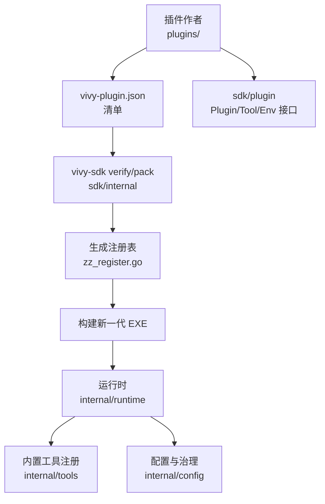
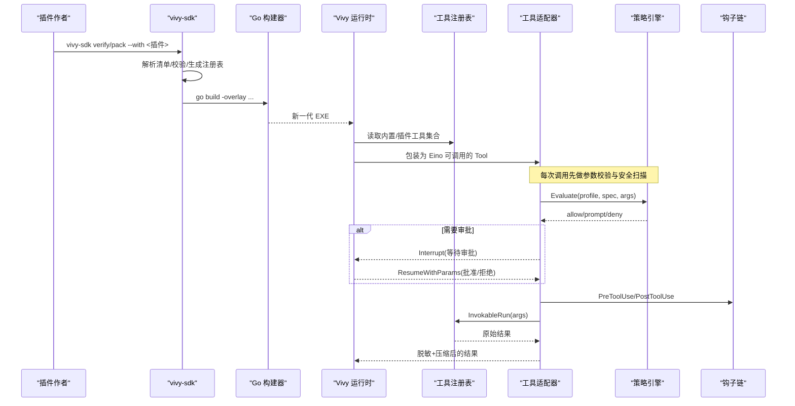
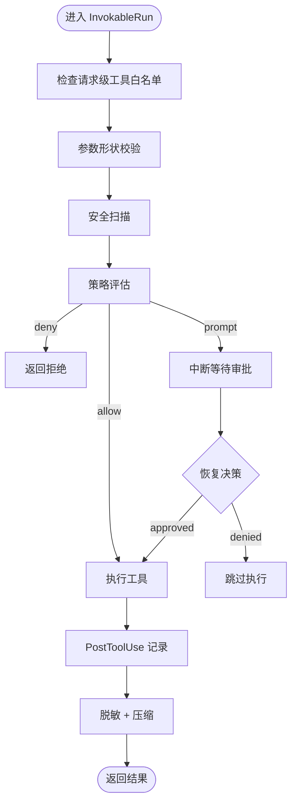
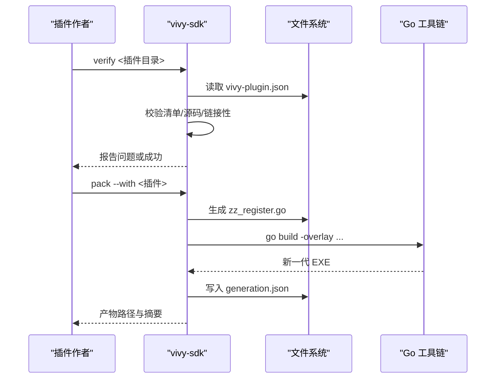
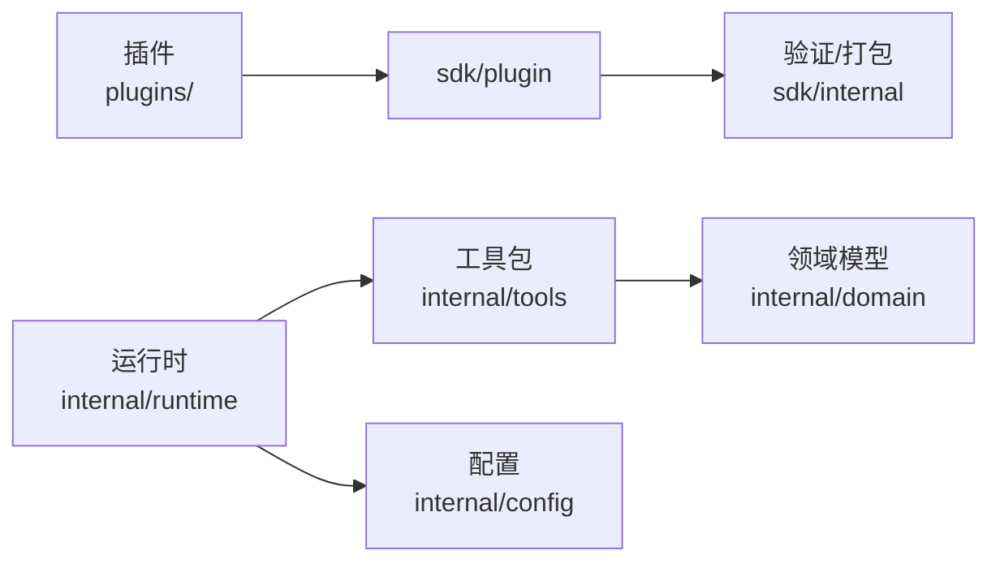

# 自定义工具开发

<cite>
**本文引用的文件**
- [sdk/plugin/plugin.go](file://sdk/plugin/plugin.go)
- [plugins/hello-fs/plugin.go](file://plugins/hello-fs/plugin.go)
- [plugins/hello-fs/vivy-plugin.json](file://plugins/hello-fs/vivy-plugin.json)
- [internal/tools/tools.go](file://internal/tools/tools.go)
- [internal/domain/tool.go](file://internal/domain/tool.go)
- [internal/runtime/tooladapter.go](file://internal/runtime/tooladapter.go)
- [internal/runtime/toolbroker.go](file://internal/runtime/toolbroker.go)
- [internal/config/config.go](file://internal/config/config.go)
- [sdk/internal/manifest.go](file://sdk/internal/manifest.go)
- [sdk/internal/pack.go](file://sdk/internal/pack.go)
- [sdk/internal/verify.go](file://sdk/internal/verify.go)
- [sdk/main.go](file://sdk/main.go)
- [internal/tools/security.go](file://internal/tools/security.go)
- [internal/tools/echo.go](file://internal/tools/echo.go)
- [docs/architecture/VIVY-PLUGIN-SPEC.md](file://docs/architecture/VIVY-PLUGIN-SPEC.md)
</cite>

## 目录
1. [简介](#简介)
2. [项目结构](#项目结构)
3. [核心组件](#核心组件)
4. [架构总览](#架构总览)
5. [详细组件分析](#详细组件分析)
6. [依赖关系分析](#依赖关系分析)
7. [性能与资源限制](#性能与资源限制)
8. [故障排查指南](#故障排查指南)
9. [结论](#结论)
10. [附录：从简单到复杂的完整示例](#附录从简单到复杂的完整示例)

## 简介
本指南面向需要在 Vivy 物种运行时中开发“自定义工具”的开发者。内容覆盖：
- 插件接口实现要求、参数 Schema 定义、返回值格式规范
- 插件开发流程、SDK 使用方法、验证与打包
- 工具注册机制、依赖注入、配置管理
- 错误处理模式、日志脱敏、性能优化技巧
- 测试策略、调试方法、部署流程
- 工具发现机制、版本兼容性与向后兼容保证
- 最佳实践与常见问题解决方案

Vivy 将“插件”严格限定为纯 Go 代码，通过最小 SDK 窗口暴露能力；所有插件必须经过 vivy-sdk verify/pack 流程生成新一代可执行体，禁止直接修改内核装配逻辑。

## 项目结构
围绕“自定义工具”的关键目录与职责：
- sdk/plugin：插件作者唯一可导入的 SDK 窗口，定义 Plugin、Tool、Env、Grant、Seam 等契约
- plugins/<name>：用户插件源码与清单 vivy-plugin.json（示例见 hello-fs）
- internal/tools：内置工具集与工具选择、注册、参数校验、安全扫描等
- internal/domain：领域模型，如 ToolSpec、ToolParam、Approval 等
- internal/runtime：Eino 适配层、审批门控、结果压缩、钩子链、工作进程代理
- internal/config：启动配置加载与校验，包含工具启用列表、沙箱与治理策略
- sdk/internal：vivy-sdk 命令实现，负责 verify、pack、inspect-artifact 等
- docs/architecture/VIVY-PLUGIN-SPEC.md：插件规范文档

图表来源
- [sdk/plugin/plugin.go:12-87](file://sdk/plugin/plugin.go#L12-L87)
- [plugins/hello-fs/vivy-plugin.json:1-21](file://plugins/hello-fs/vivy-plugin.json#L1-L21)
- [sdk/internal/pack.go:67-199](file://sdk/internal/pack.go#L67-L199)
- [internal/tools/tools.go:223-317](file://internal/tools/tools.go#L223-L317)
- [internal/config/config.go:194-313](file://internal/config/config.go#L194-L313)

章节来源
- [docs/architecture/VIVY-PLUGIN-SPEC.md:29-83](file://docs/architecture/VIVY-PLUGIN-SPEC.md#L29-L83)
- [sdk/README.md:1-29](file://sdk/README.md#L1-L29)

## 核心组件
- 插件 SDK 契约：Plugin、Tool、Env、Seam、Grant、Effect
- 工具领域模型：ToolSpec、ToolParam、Interaction、Approval
- 运行时适配器：toolAdapter（参数校验、策略评估、审批门控、结果压缩）
- 工具注册与选择：Registry、Selector、Selection
- 配置系统：Config.Tools.Enabled、Sandbox、Governance
- SDK 工具链：verify、pack、inspect-artifact

章节来源
- [sdk/plugin/plugin.go:12-87](file://sdk/plugin/plugin.go#L12-L87)
- [internal/domain/tool.go:5-112](file://internal/domain/tool.go#L5-L112)
- [internal/runtime/tooladapter.go:24-184](file://internal/runtime/tooladapter.go#L24-L184)
- [internal/tools/tools.go:122-317](file://internal/tools/tools.go#L122-L317)
- [internal/config/config.go:194-313](file://internal/config/config.go#L194-L313)

## 架构总览
下图展示从插件声明到运行时调用的端到端链路：清单驱动打包，生成注册表，运行时装配并受策略与审批控制。

图表来源
- [sdk/internal/pack.go:67-199](file://sdk/internal/pack.go#L67-L199)
- [internal/runtime/tooladapter.go:78-184](file://internal/runtime/tooladapter.go#L78-L184)
- [internal/tools/tools.go:223-317](file://internal/tools/tools.go#L223-L317)

## 详细组件分析

### 插件 SDK 契约与实现要求
- 插件必须实现 Plugin 接口：Name、Seam、Grants、Tools
- 每个 Tool 必须实现 Name、Effect、Schema、Run
- Env 是插件唯一可访问的世界：Workspace、OpenRead、OpenWrite；缺失权限即失败关闭
- Seam 限定 tool / tool-world / provider；Grant 限定 fs.read / fs.write；Effect 限定 read / write

章节来源
- [sdk/plugin/plugin.go:12-87](file://sdk/plugin/plugin.go#L12-L87)

### 清单 vivy-plugin.json 与 Schema 规范
- apiVersion 固定为 vivy.plugin/v0
- name 必须等于目录名，且符合小写数字连字符命名规则
- version 遵循 semver
- seam 仅允许 tool / tool-world / provider
- module 指向包路径（通常为 .）
- grants 列出插件可申请的能力上限
- tools 数组描述对外暴露的工具：
  - name：全局唯一
  - effect：read 或 write
  - description：人类可读说明
  - schema：JSON Schema 对象，用于参数校验与模型提示

章节来源
- [plugins/hello-fs/vivy-plugin.json:1-21](file://plugins/hello-fs/vivy-plugin.json#L1-L21)
- [sdk/internal/manifest.go:21-95](file://sdk/internal/manifest.go#L21-L95)
- [docs/architecture/VIVY-PLUGIN-SPEC.md:47-83](file://docs/architecture/VIVY-PLUGIN-SPEC.md#L47-L83)

### 工具领域模型与参数校验
- ToolSpec：名称、描述、是否只读、参数定义、关键词路由、交互类型
- ToolParam：描述、是否必填、类型（string/integer/number/boolean/object/array）、枚举
- 参数校验：
  - 形状校验：ValidateArgs 确保 JSON 对象、字段存在性、类型匹配、required 约束
  - 安全扫描：ValidateArgsSafety 拦截路径穿越、NUL 字节、危险命令语法
- 返回值：字符串；运行时会进行敏感信息脱敏与长度压缩

章节来源
- [internal/domain/tool.go:27-61](file://internal/domain/tool.go#L27-L61)
- [internal/tools/tools.go:41-120](file://internal/tools/tools.go#L41-L120)
- [internal/tools/security.go:38-79](file://internal/tools/security.go#L38-L79)
- [internal/runtime/tooladapter.go:186-202](file://internal/runtime/tooladapter.go#L186-L202)

### 运行时工具适配器与审批门控
- Info：将 ToolSpec 映射为 Eino 的参数元数据，确保模型正确传参
- InvokableRun：
  - 上下文工具白名单检查
  - 参数校验与安全扫描
  - 策略评估（allow/prompt/deny）
  - 交互型工具暂停等待用户回答
  - 审批门控：首次执行中断，恢复后根据决策继续或跳过
  - 钩子链：PreToolUse/PostToolUse 支持审计与改写后再评估
  - 执行工具并返回脱敏、压缩后的结果

图表来源
- [internal/runtime/tooladapter.go:78-184](file://internal/runtime/tooladapter.go#L78-L184)
- [internal/tools/security.go:38-79](file://internal/tools/security.go#L38-L79)

章节来源
- [internal/runtime/tooladapter.go:24-184](file://internal/runtime/tooladapter.go#L24-L184)

### 工具注册与选择
- Registry：按名称注册工具，重复名称视为编程错误
- Builtin* 系列构造器：以依赖注入方式组合内置工具族（文件、技能、任务、网络搜索、HTTP、MCP、顺序思考、命令执行等）
- Selector：基于关键词与名称的确定性路由，避免无关工具被选中
- Resolve：按配置 enabled 列表解析工具，未知名称为启动错误

章节来源
- [internal/tools/tools.go:122-317](file://internal/tools/tools.go#L122-L317)

### 配置管理与依赖注入
- Config.Tools.Enabled：显式启用工具名列表，未启用则不可用
- Config.Runtime.Sandbox：默认模式、工作区根、审批策略、网络限制
- Config.Governance：治理配置文件与规则，影响策略评估默认值
- 依赖注入：工具实现通过工厂函数接收后端（如文件操作、技能、任务、搜索、HTTP、MCP、命令），保持工具包不耦合具体实现

章节来源
- [internal/config/config.go:194-313](file://internal/config/config.go#L194-L313)
- [internal/tools/tools.go:243-317](file://internal/tools/tools.go#L243-L317)

### 插件验证与打包流程
- verify：读取清单、校验字段、解析源码、检查禁止项、尝试 linkable
- pack：
  - 解析插件目录与清单
  - 生成注册表 zz_register.go（作者不可编辑）
  - 使用 go build -overlay 将插件编译进新一代 EXE
  - 输出 generation.json（含 ID、SHA256、配方、工具清单）
- inspect-artifact：查看产物中的插件出处与哈希

图表来源
- [sdk/internal/verify.go:19-69](file://sdk/internal/verify.go#L19-L69)
- [sdk/internal/pack.go:67-199](file://sdk/internal/pack.go#L67-L199)
- [sdk/main.go:1-14](file://sdk/main.go#L1-L14)

章节来源
- [sdk/internal/manifest.go:38-95](file://sdk/internal/manifest.go#L38-L95)
- [sdk/internal/pack.go:67-199](file://sdk/internal/pack.go#L67-L199)
- [sdk/internal/verify.go:19-69](file://sdk/internal/verify.go#L19-L69)
- [sdk/main.go:1-14](file://sdk/main.go#L1-L14)

### 工作进程代理与审批复用
- ExecuteBrokerTool：父进程侧统一完成策略评估、钩子、执行、脱敏与压缩
- ExecuteApprovedBrokerTool：在已持久化审批后执行，仍对钩子改写进行再评估

章节来源
- [internal/runtime/toolbroker.go:12-93](file://internal/runtime/toolbroker.go#L12-L93)

## 依赖关系分析
- 插件仅依赖 sdk/plugin；不得引入 internal/* 或 eino
- 运行时通过 adapter 将内部 tools.Tool 暴露给 Eino
- 工具包通过工厂注入后端，避免耦合 HTTP、存储、MCP 等细节
- 配置集中管理工具启用、沙箱与治理策略

图表来源
- [sdk/plugin/plugin.go:12-87](file://sdk/plugin/plugin.go#L12-L87)
- [internal/runtime/tooladapter.go:24-76](file://internal/runtime/tooladapter.go#L24-L76)
- [internal/tools/tools.go:223-317](file://internal/tools/tools.go#L223-L317)
- [internal/config/config.go:194-313](file://internal/config/config.go#L194-L313)
- [sdk/internal/pack.go:67-199](file://sdk/internal/pack.go#L67-L199)

章节来源
- [docs/architecture/VIVY-PLUGIN-SPEC.md:141-155](file://docs/architecture/VIVY-PLUGIN-SPEC.md#L141-L155)

## 性能与资源限制
- 结果压缩：toolAdapter 对超出预算的结果保留头尾并插入标记，防止模型上下文膨胀
- 事件与负载限制：Config 提供 max_event_payload_bytes、max_tool_result_bytes 等边界
- 流缓冲与调用次数：stream_buffer、max_model_calls、max_run_tool_calls、max_tool_turns 等限制避免失控循环
- 敏感信息脱敏：RedactSensitive 在结果进入模型上下文前移除常见密钥与邮箱形式

章节来源
- [internal/runtime/tooladapter.go:186-202](file://internal/runtime/tooladapter.go#L186-L202)
- [internal/config/config.go:110-153](file://internal/config/config.go#L110-L153)
- [internal/tools/security.go:73-79](file://internal/tools/security.go#L73-L79)

## 故障排查指南
- 清单校验失败：apiVersion、name、version、seam、grants、tools.schema 不符合规则时，verify 会报告具体问题
- 工具名冲突：多个插件声明同名工具会导致模型面冲突，需调整 name
- 参数校验错误：ArgError 会指明字段与原因，便于快速定位
- 安全拦截：路径穿越、NUL 字节、危险命令语法会被 ValidateArgsSafety 拒绝
- 审批失败：策略 deny 或用户拒绝导致工具不执行；可在治理配置中调整默认策略与超时
- 打包失败：缺少 go 工具链、模块根未找到、插件不可链接时会报错

章节来源
- [sdk/internal/manifest.go:50-95](file://sdk/internal/manifest.go#L50-L95)
- [internal/tools/tools.go:41-120](file://internal/tools/tools.go#L41-L120)
- [internal/tools/security.go:38-79](file://internal/tools/security.go#L38-L79)
- [internal/runtime/tooladapter.go:146-163](file://internal/runtime/tooladapter.go#L146-L163)
- [sdk/internal/verify.go:19-69](file://sdk/internal/verify.go#L19-L69)
- [sdk/internal/pack.go:67-199](file://sdk/internal/pack.go#L67-L199)

## 结论
Vivy 的自定义工具体系通过“最小 SDK 窗口 + 清单驱动 + 生成注册表 + 运行时策略与审批”的组合，实现了强隔离、可审计、可回滚的插件生态。开发者只需关注插件实现与清单，其余由 SDK 与运行时保障。配合严格的参数校验、安全扫描、结果压缩与配置治理，可以在保证安全的前提下扩展强大的业务能力。

## 附录：从简单到复杂的完整示例

### 示例一：只读文件统计工具（hello-fs）
- 清单：声明 seam=tool-world、grants=[fs.read]、tools[0].schema 包含 path 字段
- 实现：实现 Tool.Run，通过 env.OpenRead 读取工作区内相对路径文件，返回长度信息
- 运行：经 vivy-sdk verify/pack 生成新一代 EXE，运行时作为只读工具自动执行

章节来源
- [plugins/hello-fs/vivy-plugin.json:1-21](file://plugins/hello-fs/vivy-plugin.json#L1-L21)
- [plugins/hello-fs/plugin.go:17-65](file://plugins/hello-fs/plugin.go#L17-L65)

### 示例二：回声工具（内置参考）
- 用途：只读、无需审批的回声工具，适合调试与演示
- 特点：参数校验严格、文本长度受限、事件正常发出

章节来源
- [internal/tools/echo.go:12-58](file://internal/tools/echo.go#L12-L58)

### 示例三：复杂业务工具（建议设计）
- 建议采用多步骤：
  - 参数校验与安全检查
  - 准备提案（Proposal）供人工审阅
  - 审批通过后执行，必要时分步提交变更
  - 结果脱敏与压缩，记录审计事件
- 可组合的技能：
  - 文件读写（带沙箱模式）
  - 任务创建与跟踪
  - 网络搜索与 HTTP 请求（受白名单与大小限制）
  - MCP 工具调用（受审批与策略控制）
  - 顺序思考工具（本地状态）

章节来源
- [internal/domain/tool.go:14-25](file://internal/domain/tool.go#L14-L25)
- [internal/tools/tools.go:243-317](file://internal/tools/tools.go#L243-L317)
- [internal/runtime/tooladapter.go:139-163](file://internal/runtime/tooladapter.go#L139-L163)

### 开发与调试建议
- 使用 vivy-sdk verify 尽早发现问题
- 使用 vivy-sdk pack 生成新一代 EXE 并 inspect-artifact 确认出处
- 在工具实现中尽量返回结构化、可审计的信息；避免泄露敏感数据
- 利用治理配置与沙箱策略控制风险面
- 单元测试聚焦参数校验、安全扫描与边界条件

章节来源
- [sdk/README.md:1-29](file://sdk/README.md#L1-L29)
- [sdk/internal/pack.go:201-214](file://sdk/internal/pack.go#L201-L214)
- [internal/tools/security.go:38-79](file://internal/tools/security.go#L38-L79)