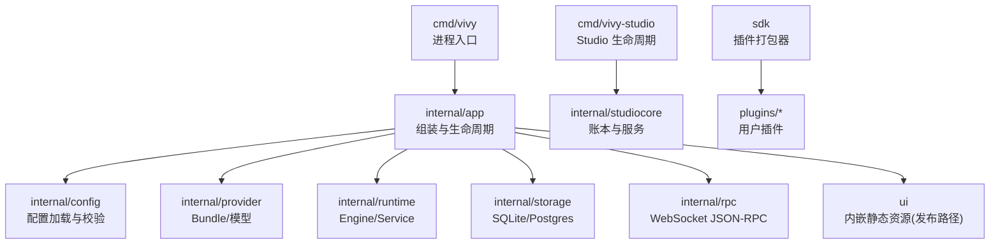
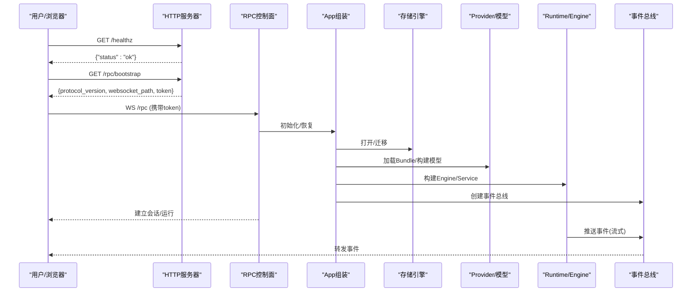
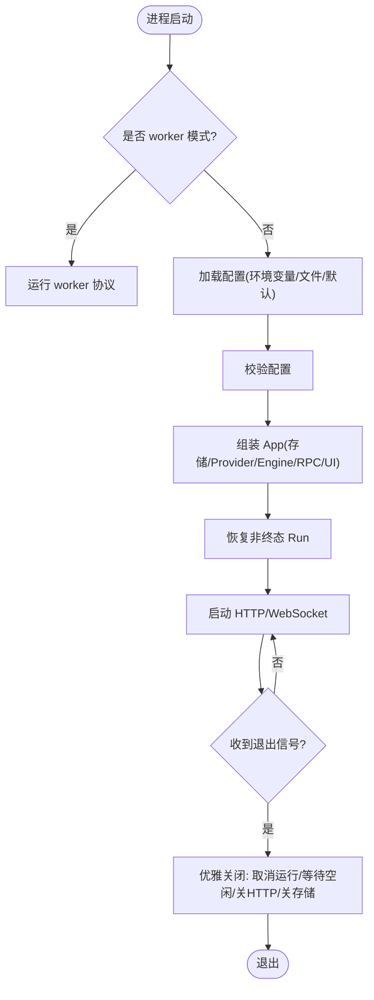
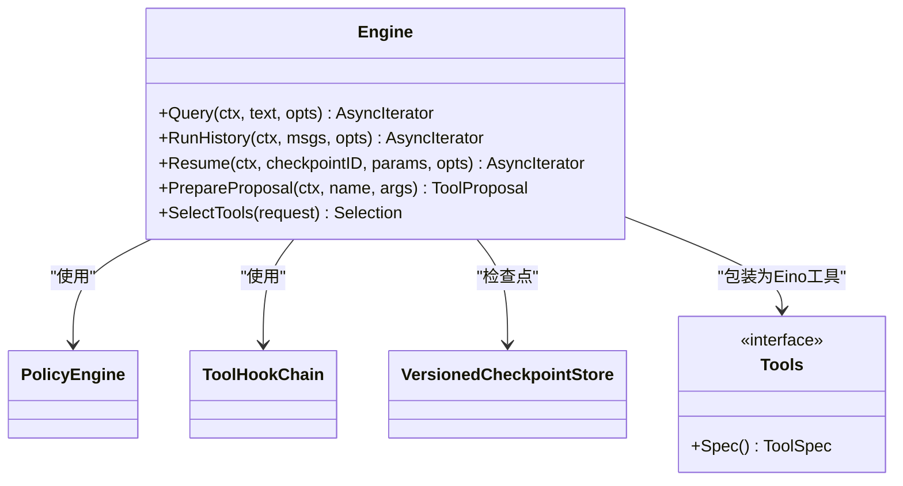
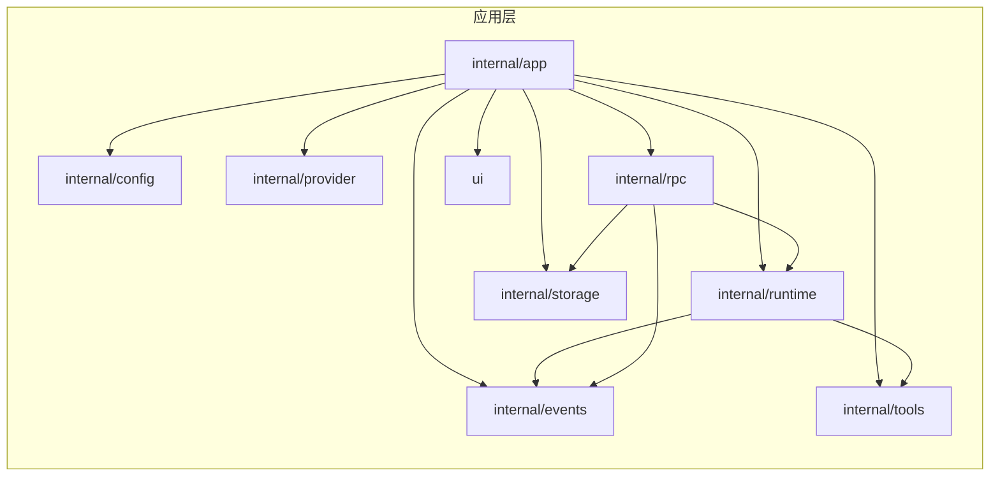

# 开发者指南

<cite>
**本文引用的文件**
- [README.md](file://README.md)
- [AGENTS.md](file://AGENTS.md)
- [go.mod](file://go.mod)
- [justfile](file://justfile)
- [config.example.yaml](file://config.example.yaml)
- [cmd/vivy/main.go](file://cmd/vivy/main.go)
- [cmd/vivy-studio/main.go](file://cmd/vivy-studio/main.go)
- [internal/app/app.go](file://internal/app/app.go)
- [internal/config/config.go](file://internal/config/config.go)
- [internal/runtime/engine.go](file://internal/runtime/engine.go)
- [internal/provider/bundle.go](file://internal/provider/bundle.go)
- [sdk/main.go](file://sdk/main.go)
- [ui/package.json](file://ui/package.json)
</cite>

## 目录
1. [简介](#简介)
2. [项目结构](#项目结构)
3. [核心组件](#核心组件)
4. [架构总览](#架构总览)
5. [详细组件分析](#详细组件分析)
6. [依赖关系分析](#依赖关系分析)
7. [性能与可观测性](#性能与可观测性)
8. [调试与故障排查](#调试与故障排查)
9. [代码规范与提交流程](#代码规范与提交流程)
10. [新功能开发指南](#新功能开发指南)
11. [版本管理与质量保证](#版本管理与质量保证)
12. [常见问题解答](#常见问题解答)
13. [社区贡献指南](#社区贡献指南)
14. [工具与效率提升](#工具与效率提升)
15. [结论](#结论)

## 简介
本指南面向 Vivy 物种运行时（vivy.exe）的开发者，覆盖环境搭建、代码规范、提交流程、模块划分、依赖管理、调试技巧、性能分析、重构方法、新功能开发流程、代码审查标准、质量保证、版本策略、常见问题与排障、贡献方式以及常用工具与学习资源。Vivy 基于 cloudwego/eino 框架装配个人网关 Agent，前端为内嵌 React + Vite UI；默认存储为 SQLite，可选 Postgres 作为第二个 Journal 引擎。

## 项目结构
- 单 Go 模块，入口命令：
  - cmd/vivy：日常网关进程（健康端点 :8787）
  - cmd/vivy-studio：Studio 生命周期工具（打包/评估/发布/安装/回滚/检查）
- 内部模块：
  - internal/app：应用组装根、启动顺序、优雅关闭
  - internal/config：配置加载与校验（密钥边界）
  - internal/domain：领域契约类型（Session/Message/Run/Event 等）
  - internal/runtime：运行服务与 Eino 适配（事件映射、中断、恢复）
  - internal/provider：OpenAI/Anthropic/Mock 及 YAML Bundle
  - internal/tools：ToolSpec 注册表与审批策略
  - internal/storage：Journal/Snapshot/Blob/Lease 抽象与 SQLite/Postgres 实现
  - internal/events：事件总线与 after_seq 游标重放
  - internal/rpc：UI 面向的命令/查询/事件 JSON-RPC 控制面
  - internal/studio / studiocore：Studio 侧服务与账本
  - internal/worker：子工作进程协议
- SDK：
  - sdk：插件作者导入窗与打包器（verify/pack），由 Studio 调用
- UI：
  - ui：React + Vite + Zustand + TanStack Router，独立 dev 端口 :3015，/rpc 代理到后端
- 其他：
  - fixtures：provider bundle 示例
  - schemas：事件与 provider bundle 的 JSON Schema
  - docs：架构与实现计划、研究档案、日志归档
  - docker：容器化配置与 compose 叠加

图示来源
- [cmd/vivy/main.go:1-93](file://cmd/vivy/main.go#L1-L93)
- [internal/app/app.go:1-520](file://internal/app/app.go#L1-L520)
- [internal/config/config.go:1-642](file://internal/config/config.go#L1-L642)
- [internal/provider/bundle.go:1-150](file://internal/provider/bundle.go#L1-L150)
- [cmd/vivy-studio/main.go:1-382](file://cmd/vivy-studio/main.go#L1-L382)
- [sdk/main.go:1-14](file://sdk/main.go#L1-L14)

章节来源
- [README.md:68-107](file://README.md#L68-L107)
- [AGENTS.md:15-75](file://AGENTS.md#L15-L75)

## 核心组件
- 进程入口与启动
  - vivy：加载配置、组装组件、恢复非终态 Run、启动 HTTP/WebSocket、优雅关闭
  - vivy-studio：工作区管理、打包、评估、发布、安装、回滚、检查、列表
- 配置与密钥边界
  - 严格解析 YAML，未知字段报错；Provider 密钥仅通过环境变量名引用，不在配置中持久化
- 运行引擎
  - 基于 Eino 的 ChatModelAgent + Runner，封装工具选择、流式事件、检查点恢复、治理策略与 Hook
- 存储与事件
  - SQLite 默认；Postgres 为可选 Journal 引擎；事件经总线 fan-out，支持 after_seq 游标重放
- 控制面
  - WebSocket JSON-RPC：/rpc/bootstrap 返回 token 与协议版本，/rpc 承载会话/运行/审批/问题/审计等
- 插件与 SDK
  - 插件通过 vivy-sdk verify/pack 流程集成，禁止直接修改 engine.go 安装

章节来源
- [cmd/vivy/main.go:23-74](file://cmd/vivy/main.go#L23-L74)
- [cmd/vivy-studio/main.go:18-100](file://cmd/vivy-studio/main.go#L18-L100)
- [internal/config/config.go:1-13](file://internal/config/config.go#L1-L13)
- [internal/runtime/engine.go:48-117](file://internal/runtime/engine.go#L48-L117)
- [internal/app/app.go:63-363](file://internal/app/app.go#L63-L363)

## 架构总览
Vivy 以“配置驱动 + 组件组装”的方式启动：先打开存储，再加载 Provider Bundle，构建模型与工具集，创建 Engine 与 Service，挂载 RPC 控制面，最后启动 HTTP 服务并执行重启恢复。关闭时按逆序取消运行、等待空闲、关闭 HTTP 与存储，整体在有限宽限期内完成。

图示来源
- [internal/app/app.go:316-363](file://internal/app/app.go#L316-L363)
- [internal/app/app.go:470-520](file://internal/app/app.go#L470-L520)
- [cmd/vivy/main.go:23-74](file://cmd/vivy/main.go#L23-L74)

## 详细组件分析

### 进程入口与生命周期（cmd/vivy）
- 启动阶段
  - 解析参数，若为 worker 模式则走 worker 协议
  - 设置结构化日志
  - 加载配置（优先环境变量指定路径，否则 config.yaml，否则内置默认）
  - 允许 VIVY_ADDR 覆盖监听地址并重新校验
  - 信号处理：SIGINT/SIGTERM/控制台关闭
  - 组装 App 并运行
- 关闭阶段
  - 停止交互扫描器、取消所有运行、等待空闲、关闭 HTTP、关闭存储

图示来源
- [cmd/vivy/main.go:23-74](file://cmd/vivy/main.go#L23-L74)
- [internal/app/app.go:470-520](file://internal/app/app.go#L470-L520)

章节来源
- [cmd/vivy/main.go:1-93](file://cmd/vivy/main.go#L1-L93)
- [internal/app/app.go:470-520](file://internal/app/app.go#L470-L520)

### 配置与密钥边界（internal/config）
- 严格解码 YAML，未知字段即错误
- Provider 密钥仅以环境变量名存在，请求时读取，绝不持久化
- 校验项包括：server.addr/allowed_origins、storage.backend/sqlite/postgres、providers.active/bundle_dir/env_key/default_model、runtime 各项上限、tools.enabled 与 approval.expiration、governance.profile/profiles/rules/hook_timeout、sandbox 模式与网络策略
- DataDirectory 计算逻辑用于 settings/evals 等非 Journal 数据

章节来源
- [internal/config/config.go:1-13](file://internal/config/config.go#L1-L13)
- [internal/config/config.go:254-314](file://internal/config/config.go#L254-L314)
- [internal/config/config.go:316-528](file://internal/config/config.go#L316-L528)
- [internal/config/config.go:530-642](file://internal/config/config.go#L530-L642)

### 运行引擎与工具链（internal/runtime）
- Engine 封装 Eino 的 ChatModelAgent + Runner，提供 Query/RunHistory/Resume
- 工具链：
  - 将 tools.Tool 包装为 Eino BaseTool，注入结果大小限制、治理策略与 Hook
  - 工具选择器根据请求上下文过滤可用工具
  - Proposal 机制：效果型工具可在挂起前生成可审方案
- 检查点：
  - 通过 VersionedCheckpointStore 桥接 Eino CheckPointStore，支持中断恢复
- 策略与钩子：
  - PolicyEngine 提供声明式治理规则
  - ToolHookChain 提供执行前后钩子（如审计）

图示来源
- [internal/runtime/engine.go:18-117](file://internal/runtime/engine.go#L18-L117)
- [internal/runtime/engine.go:119-166](file://internal/runtime/engine.go#L119-L166)

章节来源
- [internal/runtime/engine.go:1-166](file://internal/runtime/engine.go#L1-L166)

### Provider Bundle 与模型选择（internal/provider）
- Bundle 描述模型能力、默认模型、API 类型、后端、Provenance 等
- 加载与校验：严格解析，必填字段校验，模型白名单与默认模型一致性校验
- 支持 eino-ext/openai 与 vivy/anthropic 两种后端标识

章节来源
- [internal/provider/bundle.go:1-150](file://internal/provider/bundle.go#L1-L150)

### 应用组装与启动（internal/app）
- 组装顺序：存储 -> Provider Bundle -> 模型 -> 工具集 -> Engine -> Service -> RPC -> HTTP
- 恢复：启动前恢复非终态 Run（挂起的审批/问题/运行）
- 安全：Origin 策略、Token、只允许回环源
- 关闭：逆序关闭，保证 run.cancelled 先于存储关闭

章节来源
- [internal/app/app.go:63-363](file://internal/app/app.go#L63-L363)
- [internal/app/app.go:365-425](file://internal/app/app.go#L365-L425)
- [internal/app/app.go:430-468](file://internal/app/app.go#L430-L468)
- [internal/app/app.go:470-520](file://internal/app/app.go#L470-L520)

### Studio 生命周期（cmd/vivy-studio）
- 命令：workspace、pack、eval、release、reject、install、rollback、inspect、list
- 职责：维护 Worktree/Generation/EvalRun/Release/Install 账本，调用 SDK 打包，评估候选版本，人工确认发布，安装与回滚

章节来源
- [cmd/vivy-studio/main.go:1-382](file://cmd/vivy-studio/main.go#L1-L382)

### 插件与 SDK（sdk）
- vivy-sdk 是独立的打包器，供 Studio 或开发者调用
- 插件不得通过修改 engine.go 安装，必须走 verify/pack 流程

章节来源
- [sdk/main.go:1-14](file://sdk/main.go#L1-L14)
- [AGENTS.md:61-75](file://AGENTS.md#L61-L75)

## 依赖关系分析
- 外部依赖
  - cloudwego/eino：Agent/Runner/工具/消息模型
  - gorilla/websocket：WebSocket 通信
  - jackc/pgx/v5：Postgres 存储
  - modernc.org/sqlite：嵌入式 SQLite
  - gopkg.in/yaml.v3：配置与 Bundle 解析
- 模块耦合
  - internal/app 聚合 internal/config、internal/provider、internal/runtime、internal/storage、internal/rpc、internal/events、internal/tools、ui
  - internal/runtime 仅允许依赖 eino 类型（架构红线）
  - internal/provider 仅负责 Bundle 与模型构造

图示来源
- [internal/app/app.go:13-39](file://internal/app/app.go#L13-L39)
- [internal/runtime/engine.go:1-16](file://internal/runtime/engine.go#L1-L16)

章节来源
- [go.mod:1-59](file://go.mod#L1-L59)
- [internal/app/app.go:13-39](file://internal/app/app.go#L13-L39)

## 性能与可观测性
- 流式与缓冲
  - stream_buffer 限制下游事件扇出通道大小
  - max_event_payload_bytes 限制单个事件负载
- 上下文与历史
  - max_context_bytes 限制瞬态上下文
  - max_history_messages 限制保留的历史消息行数
- 运行预算
  - max_run_events、max_model_calls、max_run_tool_calls、max_run_retries 限制单次运行的资源消耗
- 工具结果
  - max_tool_result_bytes 限制进入模型上下文的工具结果大小
- 可观测性
  - 结构化日志（JSON）
  - 审计钩子（AuditHook）
  - 事件总线 with after_seq 游标重放

章节来源
- [internal/config/config.go:110-153](file://internal/config/config.go#L110-L153)
- [internal/config/config.go:254-314](file://internal/config/config.go#L254-L314)
- [internal/runtime/engine.go:18-46](file://internal/runtime/engine.go#L18-L46)
- [internal/app/app.go:219-255](file://internal/app/app.go#L219-L255)

## 调试与故障排查
- 本地开发
  - 一键分离循环：backend :8787 + Vite :3015，/rpc 由 Vite 代理
  - 独立终端：just run 与 cd ui; pnpm dev
  - 嵌入 UI 路径：just build-split 产出 headless 后端与静态 UI
- 常见启动失败
  - 配置缺失或非法：查看 server.addr、storage.backend、providers.active、bundle_dir、env_key 等
  - Provider 密钥未设置：确保 OPENAI_API_KEY/ANTHROPIC_API_KEY 已设置
  - Postgres DSN 未从环境变量读取：检查 dsn_env 对应变量
- 运行期问题
  - 事件丢失：检查事件总线 buffer 与 after_seq 游标
  - 审批超时：调整 tools.approval.expiration 与 sandbox.approval.timeout_seconds
  - 网络访问受限：检查 http_allowed_hosts、sandbox.network.allowed_domains、deny_private_ips
- 日志与脱敏
  - 结构化日志输出；严禁在日志/快照/事件负载中写入真实密钥
  - 使用审计钩子记录关键操作

章节来源
- [AGENTS.md:15-45](file://AGENTS.md#L15-L45)
- [config.example.yaml:1-136](file://config.example.yaml#L1-L136)
- [internal/config/config.go:316-528](file://internal/config/config.go#L316-L528)
- [internal/app/app.go:316-363](file://internal/app/app.go#L316-L363)

## 代码规范与提交流程
- 代码风格
  - 使用 gofmt；仓库提供 fmt-check 任务
  - vet 检查；test 全量运行
- 提交前验证
  - just ci：格式化检查、vet、测试、headless 编译、UI 安装/类型检查/测试/构建
- 分支与变更
  - 建议为每个功能/修复创建独立分支
  - 变更需附带最小可复现用例或端到端验证步骤
- 文档与日志
  - 交付物需在 docs/logs/<日期-主题>/ 下记录 summary/verification/acceptance
  - 未修复问题登记至 docs/TODO.md §0.1

章节来源
- [justfile:1-70](file://justfile#L1-L70)
- [AGENTS.md:144-163](file://AGENTS.md#L144-L163)
- [AGENTS.md:108-143](file://AGENTS.md#L108-L143)

## 新功能开发指南
- 需求分析
  - 明确影响范围：是否涉及 Provider、工具、存储、RPC、UI
  - 识别约束：密钥边界、沙箱策略、治理规则、预算上限
- 设计文档
  - 更新 docs/architecture 或 docs/dev 下的相关说明
  - 新增配置项需在 config.example.yaml 与 internal/config 同步，并在 Validate 中校验
- 实现步骤
  - 后端：在 internal/tools 或 internal/runtime 扩展能力；必要时增加 storage 实现
  - 前端：在 ui/src 添加组件与路由，遵循现有 API/RPC 契约
  - 插件：通过 sdk/internal 提供的 verify/pack 流程集成
- 测试与验证
  - 单元测试覆盖正常与失败路径
  - 使用 mock_scenario 进行离线场景演练
  - 端到端：在 split 模式下验证 UI 与后端交互
- 发布与回归
  - 使用 vivy-studio 的 pack → eval → release → install → rollback 流程
  - 回归测试覆盖关键路径与异常路径

章节来源
- [config.example.yaml:1-136](file://config.example.yaml#L1-L136)
- [internal/config/config.go:316-528](file://internal/config/config.go#L316-L528)
- [cmd/vivy-studio/main.go:136-351](file://cmd/vivy-studio/main.go#L136-L351)
- [AGENTS.md:61-75](file://AGENTS.md#L61-L75)

## 版本管理与质量保证
- 版本策略
  - 单一 Go 模块；无多模块工作区
  - 通过 vivy-studio 的 Generation/Release/Install 管理版本
- 质量保证
  - just ci 为默认门禁
  - 插件必须经过 vivy-sdk verify/pack
  - 禁止在生产配置中写入密钥；日志/快照/事件负载必须脱敏
- 回滚与撤销
  - vivy-studio 支持 rollback/reject/install 操作
  - 生产环境保持 loopback-only 的 split 部署策略

章节来源
- [README.md:97-107](file://README.md#L97-L107)
- [cmd/vivy-studio/main.go:202-351](file://cmd/vivy-studio/main.go#L202-L351)
- [AGENTS.md:61-75](file://AGENTS.md#L61-L75)

## 常见问题解答
- 如何启动本地开发？
  - 使用 just dev 或分别启动后端与 Vite；浏览器访问 :3015
- 如何切换 Provider？
  - 通过 Settings Overlay 或 providers.active 与 env_key 环境变量
- 为什么无法连接 Postgres？
  - 检查 storage.postgres.dsn_env 对应环境变量是否设置且有效
- 为什么某些工具被拒绝？
  - 检查 tools.enabled、sandbox.approval.default_policy、governance.profiles.rules
- 如何调试流式事件？
  - 观察事件总线 buffer 与 after_seq 游标；检查 max_event_payload_bytes 与 stream_buffer

章节来源
- [AGENTS.md:15-45](file://AGENTS.md#L15-L45)
- [internal/config/config.go:316-528](file://internal/config/config.go#L316-L528)
- [internal/app/app.go:316-363](file://internal/app/app.go#L316-L363)

## 社区贡献指南
- 贡献方式
  - Fork 后创建功能分支，提交 PR 前运行 just ci
  - 新增行为需附带最小可复现用例与端到端验证
- 文档要求
  - 变更需更新 docs 下相应位置；交付物附 docs/logs 记录
- 合规要求
  - 不引入密钥到配置/日志/快照/事件负载
  - 插件通过 SDK 流程集成，不直接修改 engine.go

章节来源
- [AGENTS.md:144-163](file://AGENTS.md#L144-L163)
- [AGENTS.md:94-107](file://AGENTS.md#L94-L107)

## 工具与效率提升
- 推荐工具
  - just：统一任务编排
  - go tool：build/test/vet/fmt
  - Node.js 22+ 与 pnpm：前端开发与构建
  - Docker：容器化打包与演示
- 效率技巧
  - 使用 split 模式并行迭代后端与 UI
  - 利用 mock_scenario 快速验证复杂交互
  - 通过 vivy-studio 的 eval/release 流程自动化评估与发布
- 学习资源
  - 仓库 README 与 AGENTS.md 中的快速开始与验证步骤
  - docs 目录下的架构与实现计划、研究档案

章节来源
- [README.md:21-66](file://README.md#L21-L66)
- [AGENTS.md:15-45](file://AGENTS.md#L15-L45)
- [ui/package.json:1-82](file://ui/package.json#L1-L82)

## 结论
本指南总结了 Vivy 的运行架构、开发流程与质量保障要点。遵循配置与密钥边界、单一模块约束、just ci 门禁与 Studio 生命周期流程，可以高效、安全地开发、测试与发布新功能。建议在每次交付时完善 docs/logs 记录，并通过 vivy-studio 的评估与发布流程确保稳定性与可回滚性。