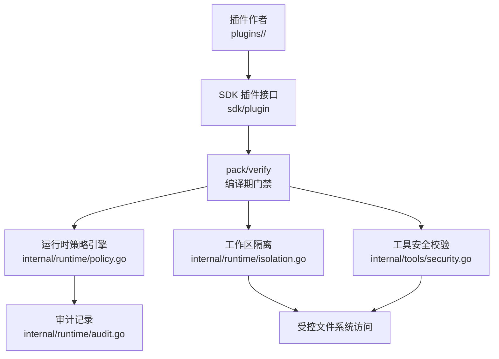
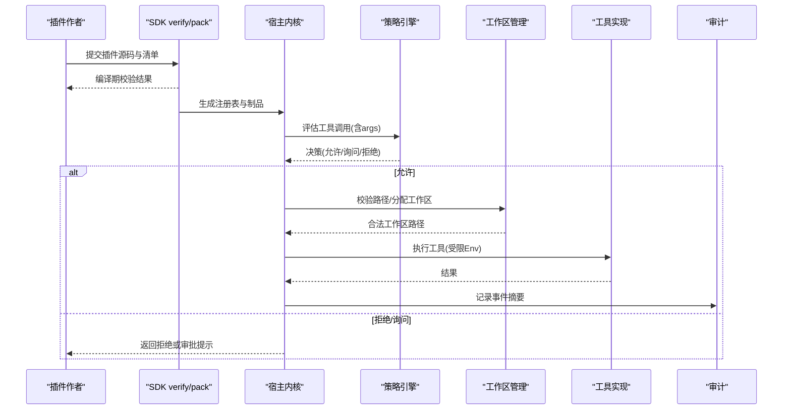
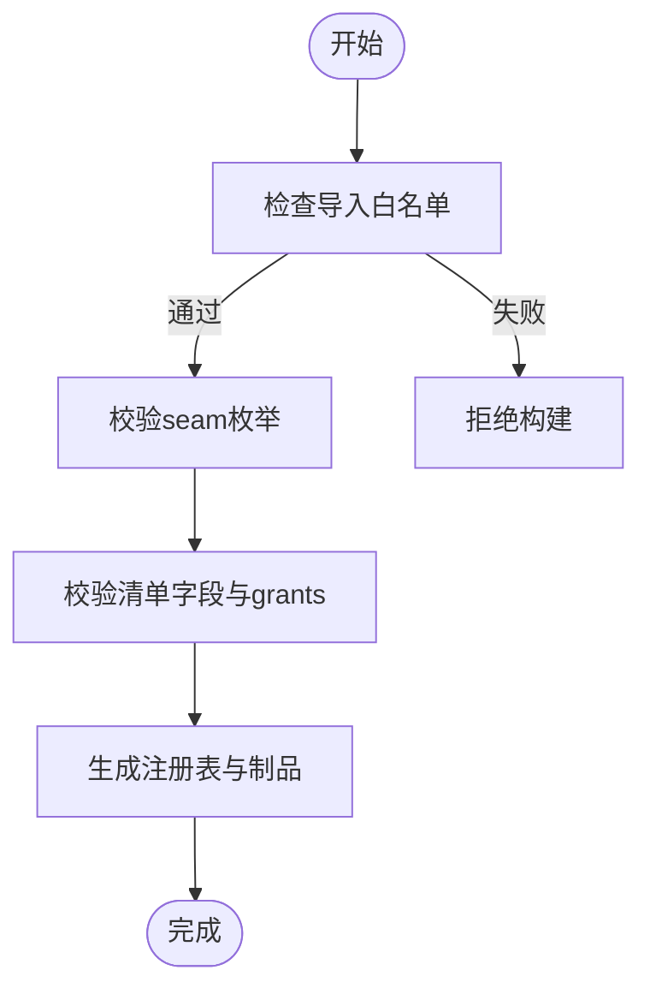
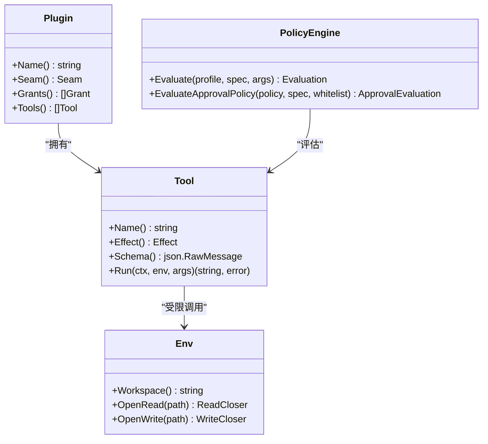
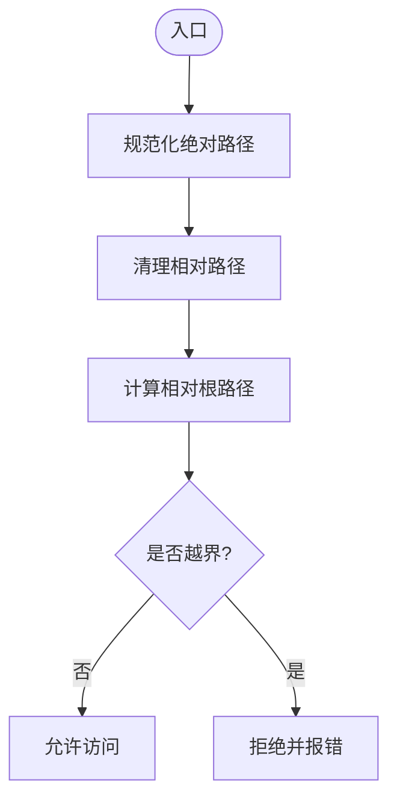
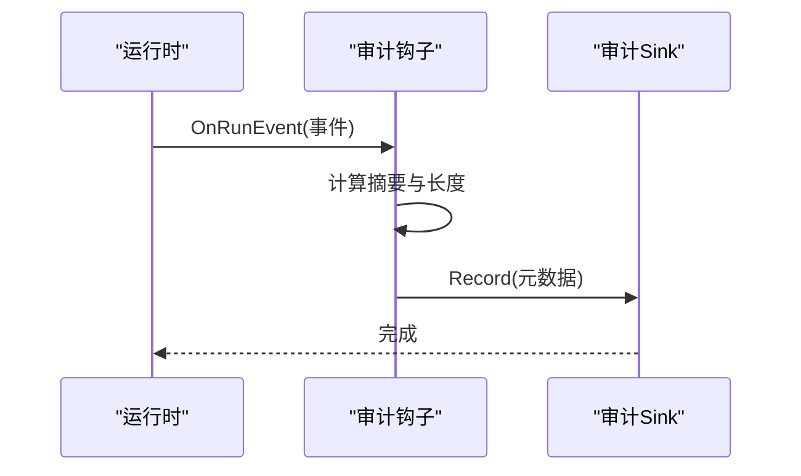
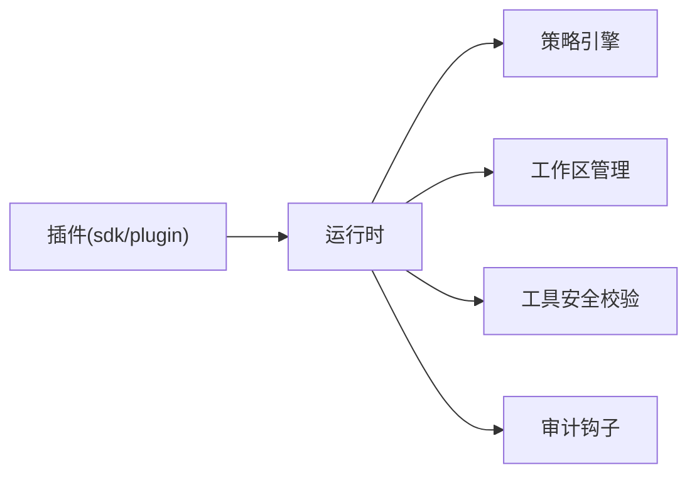

# 插件安全模型

<cite>
**本文引用的文件**
- [VIVY-PLUGIN-SPEC.md](file://docs/architecture/VIVY-PLUGIN-SPEC.md)
- [plugin.go](file://sdk/plugin/plugin.go)
- [vivy-plugin.json](file://plugins/hello-fs/vivy-plugin.json)
- [audit.go](file://internal/runtime/audit.go)
- [policy.go](file://internal/runtime/policy.go)
- [isolation.go](file://internal/runtime/isolation.go)
- [security.go](file://internal/tools/security.go)
</cite>

## 目录
1. [简介](#简介)
2. [项目结构](#项目结构)
3. [核心组件](#核心组件)
4. [架构总览](#架构总览)
5. [详细组件分析](#详细组件分析)
6. [依赖关系分析](#依赖关系分析)
7. [性能考虑](#性能考虑)
8. [故障排查指南](#故障排查指南)
9. [结论](#结论)
10. [附录](#附录)

## 简介
本文件系统性阐述 Vivy 插件安全模型，围绕三层安全架构展开：编译时安全检查、运行时权限控制与资源隔离。重点说明 Grant 权限系统（只读、写入等）、工作区隔离机制、文件路径验证算法、网络访问控制策略、安全配置最佳实践、审计能力以及漏洞检测与应急响应流程。目标是让非技术读者也能理解“插件如何被限制在最小必要能力内运行”，并帮助开发者正确设计插件与安全策略。

## 项目结构
- 插件规范与边界定义位于文档层，明确插件的清单、接口与禁止项，确保插件不触碰内核与 Eino。
- 插件 SDK 暴露最小能力窗口 Env，仅允许通过 Grants 控制的文件系统访问。
- 运行时提供策略引擎、工作区隔离、审计钩子与工具级安全校验，形成纵深防御。
- 示例插件 hello-fs 演示了声明式 grants 与工具 effect 的使用方式。

图表来源
- [VIVY-PLUGIN-SPEC.md:141-154](file://docs/architecture/VIVY-PLUGIN-SPEC.md#L141-L154)
- [plugin.go:61-82](file://sdk/plugin/plugin.go#L61-L82)
- [policy.go:35-83](file://internal/runtime/policy.go#L35-L83)
- [isolation.go:22-41](file://internal/runtime/isolation.go#L22-L41)
- [security.go:38-70](file://internal/tools/security.go#L38-L70)
- [audit.go:12-28](file://internal/runtime/audit.go#L12-L28)

章节来源
- [VIVY-PLUGIN-SPEC.md:13-25](file://docs/architecture/VIVY-PLUGIN-SPEC.md#L13-L25)
- [VIVY-PLUGIN-SPEC.md:141-154](file://docs/architecture/VIVY-PLUGIN-SPEC.md#L141-L154)

## 核心组件
- 插件 SDK 与 Grant 系统：限定插件可导入的包、seam 类型、grants 与 tool effect，缺失权限即拒绝。
- 策略引擎：基于 profile 的规则匹配与默认决策，支持 readonly、question、effectful 工具的差异化处理。
- 工作区隔离：为每次运行分配私有目录，严格校验路径，防止越界访问。
- 工具安全校验：对 path/command/cmd 等高危字段进行注入、命令拼接、路径穿越等前置检查。
- 审计：以摘要形式记录事件元数据，避免泄露敏感内容。

章节来源
- [plugin.go:29-59](file://sdk/plugin/plugin.go#L29-L59)
- [policy.go:19-33](file://internal/runtime/policy.go#L19-L33)
- [isolation.go:14-27](file://internal/runtime/isolation.go#L14-L27)
- [security.go:12-23](file://internal/tools/security.go#L12-L23)
- [audit.go:12-28](file://internal/runtime/audit.go#L12-L28)

## 架构总览
插件安全采用“编译期约束 + 运行时策略 + 资源隔离”的三层防线：
- 编译期：SDK verify/pack 强制插件仅使用 sdk/plugin 提供的最小接口，禁止 import internal 与 eino；清单中声明 grants 与 tools，生成注册表。
- 运行时：策略引擎根据 profile 与规则决定允许、询问或拒绝；工作区管理器保证所有文件操作在隔离根下；工具安全校验拦截危险参数。
- 审计：事件经审计钩子记录摘要，便于追踪与取证。

图表来源
- [VIVY-PLUGIN-SPEC.md:141-154](file://docs/architecture/VIVY-PLUGIN-SPEC.md#L141-L154)
- [policy.go:96-134](file://internal/runtime/policy.go#L96-L134)
- [isolation.go:43-73](file://internal/runtime/isolation.go#L43-L73)
- [security.go:38-70](file://internal/tools/security.go#L38-L70)
- [audit.go:35-44](file://internal/runtime/audit.go#L35-L44)

## 详细组件分析

### 编译时安全检查（SDK verify/pack）
- 插件只能 import sdk/plugin，禁止 import internal/* 与 eino；seam 仅限 tool/tool-world/provider。
- 清单 vivy-plugin.json 声明 name、version、seam、module、grants、tools；pack 生成不可手改的注册表。
- 违反禁止项将导致 verify 失败，阻止不安全插件进入构建产物。

图表来源
- [VIVY-PLUGIN-SPEC.md:141-154](file://docs/architecture/VIVY-PLUGIN-SPEC.md#L141-L154)
- [plugin.go:12-27](file://sdk/plugin/plugin.go#L12-L27)
- [vivy-plugin.json:1-21](file://plugins/hello-fs/vivy-plugin.json#L1-L21)

章节来源
- [VIVY-PLUGIN-SPEC.md:141-154](file://docs/architecture/VIVY-PLUGIN-SPEC.md#L141-L154)
- [plugin.go:61-82](file://sdk/plugin/plugin.go#L61-L82)
- [vivy-plugin.json:1-21](file://plugins/hello-fs/vivy-plugin.json#L1-L21)

### 运行时权限控制（Grant 与策略）
- Grant 系统：fs.read、fs.write 分别对应读取与写入能力；工具声明 effect read/write 与 schema。
- 策略引擎：按 profile（默认、计划、只读、全自动）与规则匹配决定 Allow/Prompt/Deny；对 readonly/question 工具默认放行。
- 审批策略：ask/never/auto 三种模式，结合自动审批白名单控制效果型工具。

图表来源
- [plugin.go:61-82](file://sdk/plugin/plugin.go#L61-L82)
- [policy.go:35-83](file://internal/runtime/policy.go#L35-L83)
- [policy.go:217-273](file://internal/runtime/policy.go#L217-L273)

章节来源
- [plugin.go:29-59](file://sdk/plugin/plugin.go#L29-L59)
- [policy.go:96-134](file://internal/runtime/policy.go#L96-L134)
- [policy.go:217-273](file://internal/runtime/policy.go#L217-L273)

### 资源隔离机制（工作区与路径验证）
- 工作区隔离：每次运行分配唯一 ID 对应的私有目录，拒绝符号链接与非目录路径，确保重启可恢复且不在 Journal 持久化绝对路径。
- 路径验证：统一通过 ValidatePath/ensureUnderRoot 校验，拒绝包含 ..、UNC 前缀或越界的路径。
- 工具参数安全：对 path/filepath/file_path/command/cmd 等字段进行 NUL、命令拼接、路径穿越等检查。

图表来源
- [isolation.go:76-95](file://internal/runtime/isolation.go#L76-L95)
- [security.go:38-70](file://internal/tools/security.go#L38-L70)

章节来源
- [isolation.go:22-41](file://internal/runtime/isolation.go#L22-L41)
- [isolation.go:43-73](file://internal/runtime/isolation.go#L43-L73)
- [isolation.go:76-95](file://internal/runtime/isolation.go#L76-L95)
- [security.go:38-70](file://internal/tools/security.go#L38-L70)

### 网络访问控制
- 插件 SDK 未暴露网络能力，插件无法直接发起外部通信；如需网络能力，应通过内核提供的受控通道并以策略与审批控制。
- 建议：在网络相关工具上声明 effect write，并在策略中默认拒绝或要求审批；对域名/IP 白名单与超时、重试次数做上限控制。
- 审计：网络请求作为工具调用的一部分，其事件摘要会被审计记录，便于事后追溯。

章节来源
- [plugin.go:77-82](file://sdk/plugin/plugin.go#L77-L82)
- [policy.go:96-134](file://internal/runtime/policy.go#L96-L134)
- [audit.go:35-44](file://internal/runtime/audit.go#L35-L44)

### 安全配置最佳实践
- 最小权限原则：插件清单仅声明所需 grants；工具 effect 尽量保守（优先 read）。
- 纵深防御：编译期禁止非法导入 + 运行时策略默认拒绝 + 工作区隔离 + 参数安全校验 + 审计留痕。
- 策略模板：
  - 只读模式：默认拒绝效果型工具，readonly/question 放行。
  - 计划模式：默认拒绝，需人工审批。
  - 全自动模式：谨慎启用，配合白名单与审批阈值。
- 密钥与脱敏：日志与快照中不得出现明文密钥；输出经 RedactSensitive 处理后再进入模型上下文或持久化负载。

章节来源
- [policy.go:47-83](file://internal/runtime/policy.go#L47-L83)
- [security.go:73-79](file://internal/tools/security.go#L73-L79)
- [audit.go:12-28](file://internal/runtime/audit.go#L12-L28)

### 安全审计功能
- 审计记录仅保存事件元数据（run、seq、type、时间戳、负载字节数与 SHA256），不携带原始负载，避免二次泄露。
- 审计钩子在事件持久化后异步记录，不影响主流程。
- 可通过自定义 Sink 接入外部审计系统。

图表来源
- [audit.go:35-44](file://internal/runtime/audit.go#L35-L44)
- [audit.go:46-62](file://internal/runtime/audit.go#L46-L62)

章节来源
- [audit.go:12-28](file://internal/runtime/audit.go#L12-L28)
- [audit.go:35-44](file://internal/runtime/audit.go#L35-L44)
- [audit.go:46-62](file://internal/runtime/audit.go#L46-L62)

### 安全漏洞检测与防护方案
- 输入侧：
  - 参数安全校验：拦截 NUL、命令拼接、路径穿越、UNC 路径。
  - 提示词注入信号检测：识别指令覆盖语言，提醒 UI/策略消费方。
  - 敏感信息脱敏：对常见密钥与邮箱进行替换。
- 策略侧：
  - 默认拒绝策略与白名单审批，限制效果型工具滥用。
  - 针对高风险工具（写文件、命令执行、网络）设置更严格的规则。
- 隔离侧：
  - 工作区根校验、符号链接拒绝、ID 白名单，防止逃逸。
- 观测侧：
  - 审计摘要与日志级别控制，便于快速定位异常。

章节来源
- [security.go:12-23](file://internal/tools/security.go#L12-L23)
- [security.go:38-70](file://internal/tools/security.go#L38-L70)
- [security.go:73-79](file://internal/tools/security.go#L73-L79)
- [policy.go:96-134](file://internal/runtime/policy.go#L96-L134)
- [isolation.go:43-73](file://internal/runtime/isolation.go#L43-L73)

### 应急响应流程
- 发现异常：通过审计摘要与日志定位受影响 run、tool、策略 profile。
- 快速止损：调整策略 profile 为只读或计划模式，临时禁用可疑工具；必要时下线对应插件版本。
- 取证分析：依据审计记录的 payload_bytes 与 payload_sha256 关联完整事件，核对参数与结果。
- 修复与回归：修正插件清单与实现，补充测试用例；重新 pack 并灰度发布。
- 复盘与加固：更新策略规则与黑名单，增强参数校验与隔离边界。

章节来源
- [audit.go:35-44](file://internal/runtime/audit.go#L35-L44)
- [policy.go:96-134](file://internal/runtime/policy.go#L96-L134)

## 依赖关系分析
- 插件与 SDK：插件通过 sdk/plugin 暴露能力，依赖最小接口 Env。
- 运行时与策略：策略引擎独立于插件实现，对工具调用进行通用决策。
- 隔离与工具：工作区管理器为工具提供安全的文件系统边界。
- 审计与运行时：审计钩子订阅运行时事件，仅记录元数据。

图表来源
- [plugin.go:61-82](file://sdk/plugin/plugin.go#L61-L82)
- [policy.go:35-83](file://internal/runtime/policy.go#L35-L83)
- [isolation.go:22-41](file://internal/runtime/isolation.go#L22-L41)
- [security.go:38-70](file://internal/tools/security.go#L38-L70)
- [audit.go:35-44](file://internal/runtime/audit.go#L35-L44)

章节来源
- [plugin.go:61-82](file://sdk/plugin/plugin.go#L61-L82)
- [policy.go:35-83](file://internal/runtime/policy.go#L35-L83)
- [isolation.go:22-41](file://internal/runtime/isolation.go#L22-L41)
- [security.go:38-70](file://internal/tools/security.go#L38-L70)
- [audit.go:35-44](file://internal/runtime/audit.go#L35-L44)

## 性能考虑
- 策略评估为轻量 JSON 解析与规则匹配，开销可控；建议复用 PolicyEngine 实例。
- 工作区路径校验为字符串与文件系统元数据操作，成本较低；批量场景可缓存根路径与权限位。
- 审计记录仅写入摘要，避免大负载 I/O；Sink 实现应异步落盘。
- 参数安全校验仅在存在高危字段时触发，减少正则与字符串处理开销。

## 故障排查指南
- 插件无法加载：检查 verify 错误（导入、seam、清单字段）；确认 pack 产物包含该插件。
- 工具被拒绝：查看策略 profile 与规则匹配原因；确认 grants 与 tool effect 一致。
- 文件访问失败：检查工作区路径是否越界、是否存在符号链接；确认 ValidatePath 通过。
- 参数校验失败：检查 path/command/cmd 字段是否包含 NUL、命令拼接或路径穿越字符。
- 审计无记录：确认审计 Sink 已挂载且日志级别足够；核对事件是否已持久化。

章节来源
- [VIVY-PLUGIN-SPEC.md:141-154](file://docs/architecture/VIVY-PLUGIN-SPEC.md#L141-L154)
- [policy.go:96-134](file://internal/runtime/policy.go#L96-L134)
- [isolation.go:43-73](file://internal/runtime/isolation.go#L43-L73)
- [security.go:38-70](file://internal/tools/security.go#L38-L70)
- [audit.go:35-44](file://internal/runtime/audit.go#L35-L44)

## 结论
Vivy 插件安全模型通过“编译期约束、运行时策略、资源隔离、参数安全与审计”的多层防线，确保插件在最小权限范围内安全运行。遵循最小权限与纵深防御原则，结合策略模板与审计能力，可有效降低风险并提升可观测性。建议在新增能力时同步完善策略与审计，持续迭代安全基线。

## 附录
- 术语
  - Grant：插件能力许可（如 fs.read、fs.write）。
  - Effect：工具行为标记（read/write）。
  - Profile：策略模板（默认、计划、只读、全自动）。
  - 工作区：每次运行的私有目录隔离空间。
- 参考
  - 插件规范与边界：[VIVY-PLUGIN-SPEC.md](file://docs/architecture/VIVY-PLUGIN-SPEC.md)
  - 插件 SDK 接口与权限：[plugin.go](file://sdk/plugin/plugin.go)
  - 示例插件清单：[vivy-plugin.json](file://plugins/hello-fs/vivy-plugin.json)
  - 策略引擎与审批：[policy.go](file://internal/runtime/policy.go)
  - 工作区隔离与路径校验：[isolation.go](file://internal/runtime/isolation.go)
  - 工具安全校验与脱敏：[security.go](file://internal/tools/security.go)
  - 审计钩子与记录：[audit.go](file://internal/runtime/audit.go)