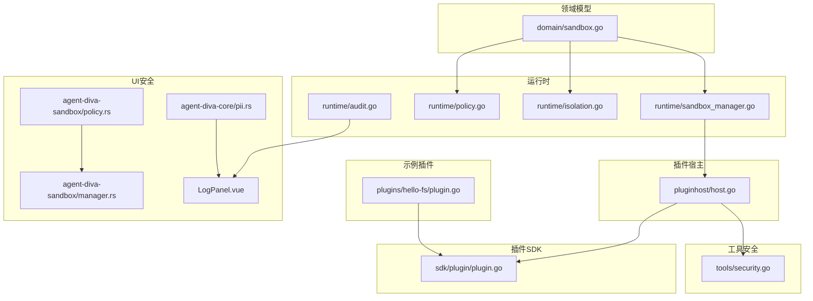
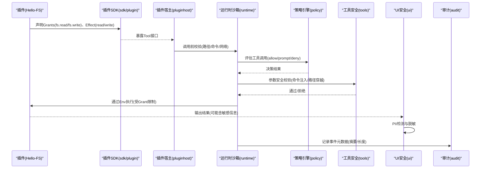
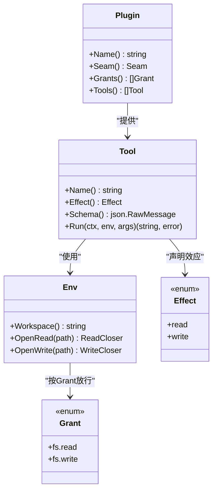
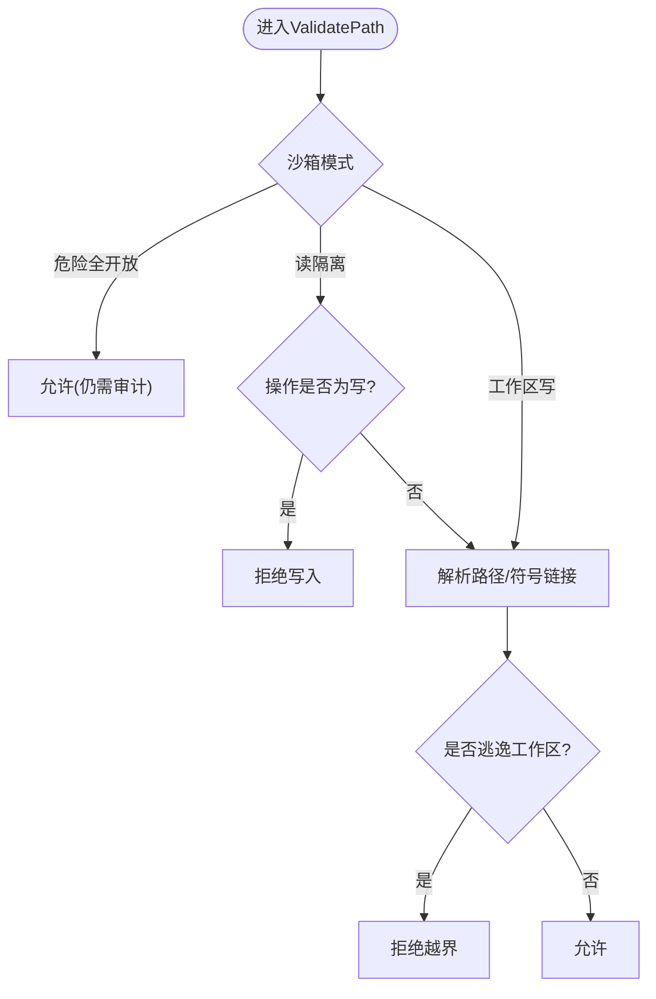
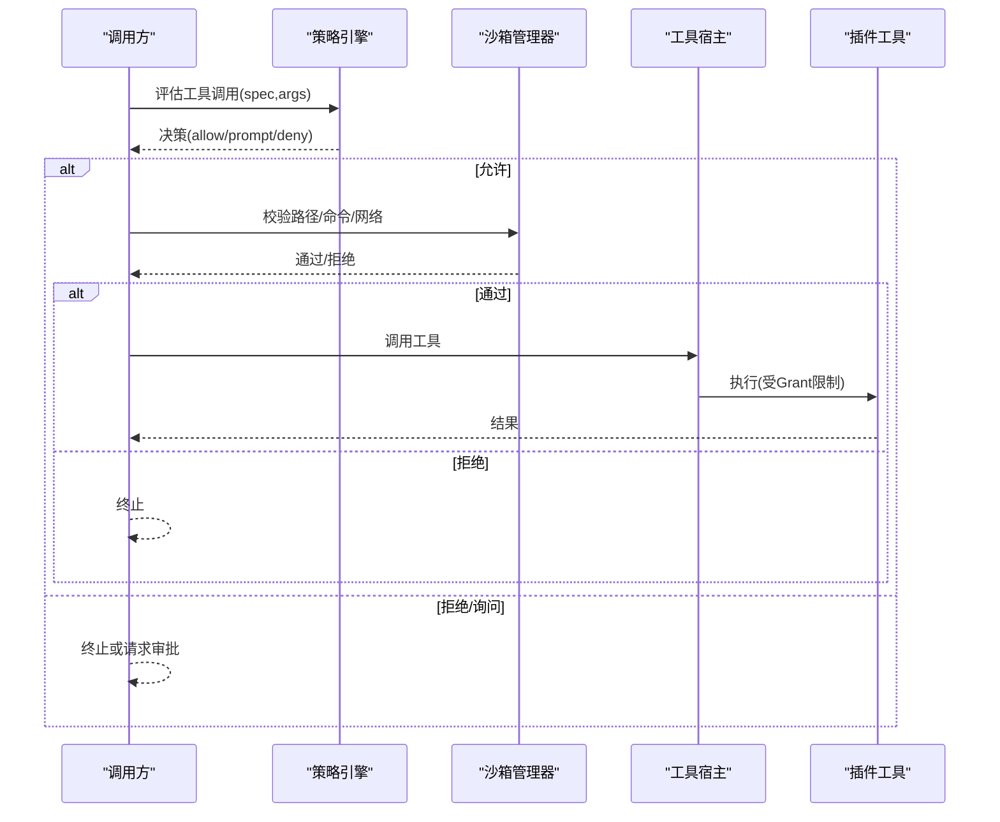
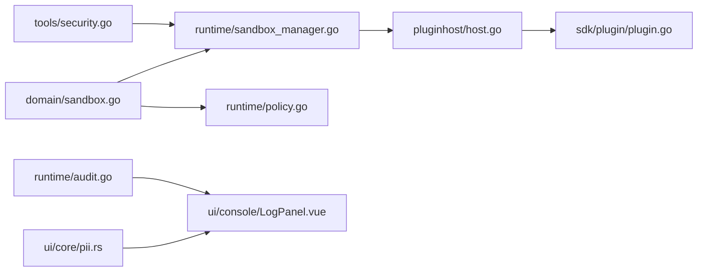

# 安全与权限

<cite>
**本文引用的文件**
- [internal/domain/sandbox.go](file://internal/domain/sandbox.go)
- [internal/runtime/sandbox_manager.go](file://internal/runtime/sandbox_manager.go)
- [internal/runtime/policy.go](file://internal/runtime/policy.go)
- [internal/runtime/isolation.go](file://internal/runtime/isolation.go)
- [internal/pluginhost/host.go](file://internal/pluginhost/host.go)
- [sdk/plugin/plugin.go](file://sdk/plugin/plugin.go)
- [plugins/hello-fs/plugin.go](file://plugins/hello-fs/plugin.go)
- [internal/tools/security.go](file://internal/tools/security.go)
- [ui/agent-diva-source/agent-diva-core/src/security/pii.rs](file://ui/agent-diva-source/agent-diva-core/src/security/pii.rs)
- [ui/agent-diva-source/agent-diva-sandbox/src/policy.rs](file://ui/agent-diva-source/agent-diva-sandbox/src/policy.rs)
- [ui/agent-diva-source/agent-diva-sandbox/src/manager.rs](file://ui/agent-diva-source/agent-diva-sandbox/src/manager.rs)
- [ui/agent-diva-source/agent-diva-gui/src/components/console/LogPanel.vue](file://ui/agent-diva-source/agent-diva-gui/src/components/console/LogPanel.vue)
- [internal/runtime/audit.go](file://internal/runtime/audit.go)
</cite>

## 目录
1. [简介](#简介)
2. [项目结构](#项目结构)
3. [核心组件](#核心组件)
4. [架构总览](#架构总览)
5. [详细组件分析](#详细组件分析)
6. [依赖关系分析](#依赖关系分析)
7. [性能考虑](#性能考虑)
8. [故障排查指南](#故障排查指南)
9. [结论](#结论)
10. [附录](#附录)

## 简介
本文件聚焦插件安全与权限系统，围绕以下目标展开：
- 解释权限模型设计原理，特别是 Grant 权限枚举（fs.read、fs.write）的作用机制。
- 说明沙箱隔离机制，确保插件在受限环境中运行。
- 阐述环境变量注入的安全策略，防止敏感信息泄露。
- 描述权限验证流程与运行时检查、强制执行方式。
- 提供安全最佳实践、常见威胁防护与漏洞检测方法。
- 详细说明审计日志记录，追踪插件的权限使用情况。

## 项目结构
与安全与权限相关的关键代码分布在如下位置：
- 领域模型：SandboxMode、ApprovalPolicy、NetworkPolicy 等定义位于 domain 包。
- 运行时沙箱：路径、命令、网络访问校验由 runtime 层实现。
- 插件宿主：将用户插件工具适配到内部工具契约，并在 Env 中实施最小权限控制。
- SDK 插件接口：唯一允许插件导入的窗口，限定能力边界。
- 工具安全：参数安全扫描、脱敏与提示注入检测。
- UI 侧安全：PII 检测与脱敏、控制台日志脱敏。
- 审计：事件元数据持久化与日志输出，避免携带敏感负载。

**图表来源**
- [internal/domain/sandbox.go:1-85](file://internal/domain/sandbox.go#L1-L85)
- [internal/runtime/sandbox_manager.go:1-286](file://internal/runtime/sandbox_manager.go#L1-L286)
- [internal/runtime/policy.go:1-274](file://internal/runtime/policy.go#L1-L274)
- [internal/runtime/isolation.go:1-109](file://internal/runtime/isolation.go#L1-L109)
- [internal/pluginhost/host.go:1-166](file://internal/pluginhost/host.go#L1-L166)
- [sdk/plugin/plugin.go:1-87](file://sdk/plugin/plugin.go#L1-L87)
- [plugins/hello-fs/plugin.go:1-65](file://plugins/hello-fs/plugin.go#L1-L65)
- [internal/tools/security.go:1-79](file://internal/tools/security.go#L1-L79)
- [ui/agent-diva-source/agent-diva-core/src/security/pii.rs:1-897](file://ui/agent-diva-source/agent-diva-core/src/security/pii.rs#L1-L897)
- [ui/agent-diva-source/agent-diva-sandbox/src/policy.rs:1-84](file://ui/agent-diva-source/agent-diva-sandbox/src/policy.rs#L1-L84)
- [ui/agent-diva-source/agent-diva-sandbox/src/manager.rs:236-325](file://ui/agent-diva-source/agent-diva-sandbox/src/manager.rs#L236-L325)
- [ui/agent-diva-source/agent-diva-gui/src/components/console/LogPanel.vue:53-96](file://ui/agent-diva-source/agent-diva-gui/src/components/console/LogPanel.vue#L53-L96)

**章节来源**
- [internal/domain/sandbox.go:1-85](file://internal/domain/sandbox.go#L1-L85)
- [internal/runtime/sandbox_manager.go:1-286](file://internal/runtime/sandbox_manager.go#L1-L286)
- [internal/runtime/policy.go:1-274](file://internal/runtime/policy.go#L1-L274)
- [internal/runtime/isolation.go:1-109](file://internal/runtime/isolation.go#L1-L109)
- [internal/pluginhost/host.go:1-166](file://internal/pluginhost/host.go#L1-L166)
- [sdk/plugin/plugin.go:1-87](file://sdk/plugin/plugin.go#L1-L87)
- [plugins/hello-fs/plugin.go:1-65](file://plugins/hello-fs/plugin.go#L1-L65)
- [internal/tools/security.go:1-79](file://internal/tools/security.go#L1-L79)
- [ui/agent-diva-source/agent-diva-core/src/security/pii.rs:1-897](file://ui/agent-diva-source/agent-diva-core/src/security/pii.rs#L1-L897)
- [ui/agent-diva-source/agent-diva-sandbox/src/policy.rs:1-84](file://ui/agent-diva-source/agent-diva-sandbox/src/policy.rs#L1-L84)
- [ui/agent-diva-source/agent-diva-sandbox/src/manager.rs:236-325](file://ui/agent-diva-source/agent-diva-sandbox/src/manager.rs#L236-L325)
- [ui/agent-diva-source/agent-diva-gui/src/components/console/LogPanel.vue:53-96](file://ui/agent-diva-source/agent-diva-gui/src/components/console/LogPanel.vue#L53-L96)

## 核心组件
- 权限模型（领域层）
  - SandboxMode：读隔离、工作区写、危险全开放三种模式，决定文件系统与命令执行限制。
  - ApprovalPolicy：ask/never/auto 三种审批策略，控制效果型工具是否需要人工批准。
  - NetworkPolicy：域名白名单、私有 IP 拦截、响应体大小上限。
- 运行时沙箱（执行层）
  - SandboxManager：对路径、命令、网络进行统一校验；拒绝越界路径、黑名单命令、非法网络访问。
  - WorkspaceManager：为每次运行分配独立工作区目录，严格限制路径不可逃逸根目录。
  - PolicyEngine：基于规则与默认策略评估工具调用是否允许、询问或拒绝。
- 插件宿主（桥接层）
  - pluginhost：将用户插件工具适配为内部工具，通过 Env 暴露最小能力集，按插件声明的 Grants 放行 fs.read/fs.write。
- 插件 SDK（约束层）
  - sdk/plugin：唯一允许插件导入的接口，限定能力边界，缺失权限时返回 ErrDenied。
- 工具安全（输入层）
  - tools/security：提示注入信号检测、参数安全校验（命令拼接、路径穿越）、敏感信息脱敏。
- UI 安全（展示层）
  - PII 检测与脱敏：识别并替换个人可识别信息，支持严重级别与审计事件。
  - 控制台日志脱敏：去除 ANSI、转义 HTML、隐藏密钥与令牌。
- 审计（观测层）
  - audit：仅记录事件元数据（类型、长度、摘要），不携带原始负载，避免泄露敏感信息。

**章节来源**
- [internal/domain/sandbox.go:1-85](file://internal/domain/sandbox.go#L1-L85)
- [internal/runtime/sandbox_manager.go:1-286](file://internal/runtime/sandbox_manager.go#L1-L286)
- [internal/runtime/isolation.go:1-109](file://internal/runtime/isolation.go#L1-L109)
- [internal/runtime/policy.go:1-274](file://internal/runtime/policy.go#L1-L274)
- [internal/pluginhost/host.go:1-166](file://internal/pluginhost/host.go#L1-L166)
- [sdk/plugin/plugin.go:1-87](file://sdk/plugin/plugin.go#L1-L87)
- [internal/tools/security.go:1-79](file://internal/tools/security.go#L1-L79)
- [ui/agent-diva-source/agent-diva-core/src/security/pii.rs:1-897](file://ui/agent-diva-source/agent-diva-core/src/security/pii.rs#L1-L897)
- [ui/agent-diva-source/agent-diva-gui/src/components/console/LogPanel.vue:53-96](file://ui/agent-diva-source/agent-diva-gui/src/components/console/LogPanel.vue#L53-L96)
- [internal/runtime/audit.go:1-62](file://internal/runtime/audit.go#L1-L62)

## 架构总览
下图展示了从插件声明到运行时执行的完整安全链路：插件通过 SDK 声明能力与权限，宿主在 Env 中强制最小权限；运行时根据沙箱模式与策略引擎对路径、命令、网络进行校验；UI 层对输入与日志进行脱敏；审计记录事件元数据用于追踪。

**图表来源**
- [sdk/plugin/plugin.go:1-87](file://sdk/plugin/plugin.go#L1-L87)
- [internal/pluginhost/host.go:1-166](file://internal/pluginhost/host.go#L1-L166)
- [internal/runtime/sandbox_manager.go:1-286](file://internal/runtime/sandbox_manager.go#L1-L286)
- [internal/runtime/policy.go:1-274](file://internal/runtime/policy.go#L1-L274)
- [internal/tools/security.go:1-79](file://internal/tools/security.go#L1-L79)
- [ui/agent-diva-source/agent-diva-core/src/security/pii.rs:1-897](file://ui/agent-diva-source/agent-diva-core/src/security/pii.rs#L1-L897)
- [internal/runtime/audit.go:1-62](file://internal/runtime/audit.go#L1-L62)

## 详细组件分析

### 权限模型与Grant机制
- 权限枚举与工具效应
  - GrantFSRead/GrantFSWrite：插件通过 Grante() 声明所需能力；Env.OpenRead/OpenWrite 仅在对应 Grant 存在时放行，否则返回 ErrDenied。
  - EffectRead/EffectWrite：工具声明自身效应，影响只读判定与策略默认行为。
- 最小权限原则
  - 插件宿主在 hostedEnv 中检查 has(need)，未声明则直接拒绝；路径解析拒绝绝对路径、穿越与 UNC 路径。
- 示例插件
  - hello-fs 仅声明 fs.read，工具 effect 为 read；读取路径必须相对工作区且无穿越。

**图表来源**
- [sdk/plugin/plugin.go:1-87](file://sdk/plugin/plugin.go#L1-L87)
- [internal/pluginhost/host.go:1-166](file://internal/pluginhost/host.go#L1-L166)
- [plugins/hello-fs/plugin.go:1-65](file://plugins/hello-fs/plugin.go#L1-L65)

**章节来源**
- [sdk/plugin/plugin.go:1-87](file://sdk/plugin/plugin.go#L1-L87)
- [internal/pluginhost/host.go:1-166](file://internal/pluginhost/host.go#L1-L166)
- [plugins/hello-fs/plugin.go:1-65](file://plugins/hello-fs/plugin.go#L1-L65)

### 沙箱隔离机制
- 工作区隔离
  - WorkspaceManager 为每次运行分配独立目录，拒绝符号链接逃逸，严格校验路径在工作区根内。
- 路径与命令限制
  - SandboxManager.ValidatePath：读隔离模式下禁止写；工作区写模式限制路径不得逃逸根；危险模式仍审计。
  - SandboxManager.ConfineCommand：读隔离禁止执行；非危险模式需白名单；危险模式仍阻止明显危险命令。
- 网络访问控制
  - CheckNetwork：仅允许 HTTP/HTTPS；可选拒绝私有 IP；域名白名单校验；响应体大小限制由 NetworkPolicy 配置。

**图表来源**
- [internal/runtime/sandbox_manager.go:85-147](file://internal/runtime/sandbox_manager.go#L85-L147)
- [internal/runtime/isolation.go:43-95](file://internal/runtime/isolation.go#L43-L95)

**章节来源**
- [internal/runtime/sandbox_manager.go:1-286](file://internal/runtime/sandbox_manager.go#L1-L286)
- [internal/runtime/isolation.go:1-109](file://internal/runtime/isolation.go#L1-L109)

### 环境变量注入的安全策略
- 插件无法直接访问宿主环境变量；只能通过 SDK 提供的 Env 与工作区交互。
- 若需要注入变量，应通过宿主在构建或启动阶段以只读方式注入到工作区文件或进程环境，并由运行时策略限制其可见范围。
- 日志与事件审计仅记录元数据（摘要、长度），避免携带敏感值；UI 控制台对日志进行脱敏。

**章节来源**
- [sdk/plugin/plugin.go:1-87](file://sdk/plugin/plugin.go#L1-L87)
- [internal/runtime/audit.go:1-62](file://internal/runtime/audit.go#L1-L62)
- [ui/agent-diva-source/agent-diva-gui/src/components/console/LogPanel.vue:53-96](file://ui/agent-diva-source/agent-diva-gui/src/components/console/LogPanel.vue#L53-L96)

### 权限验证流程与运行时执行
- 策略评估
  - PolicyEngine.Evaluate：解析工具规格与参数，匹配规则，计算最高优先级决策（deny/prompt/allow）。
  - 默认决策：只读工具或问题交互默认允许；未知策略失败保守（要求审批）。
- 审批策略
  - EvaluateApprovalPolicy：readonly 或 question 无需审批；never 策略一律拒绝；auto 策略对白名单自动批准；其他情况要求审批。
- 执行链
  - 插件工具经宿主包装后，先由策略引擎评估，再由沙箱管理器校验路径/命令/网络，最后执行。

**图表来源**
- [internal/runtime/policy.go:96-169](file://internal/runtime/policy.go#L96-L169)
- [internal/runtime/policy.go:212-274](file://internal/runtime/policy.go#L212-L274)
- [internal/runtime/sandbox_manager.go:149-234](file://internal/runtime/sandbox_manager.go#L149-L234)
- [internal/pluginhost/host.go:45-60](file://internal/pluginhost/host.go#L45-L60)

**章节来源**
- [internal/runtime/policy.go:1-274](file://internal/runtime/policy.go#L1-L274)
- [internal/runtime/sandbox_manager.go:1-286](file://internal/runtime/sandbox_manager.go#L1-L286)
- [internal/pluginhost/host.go:1-166](file://internal/pluginhost/host.go#L1-L166)

### 安全最佳实践
- 插件开发
  - 仅声明必要 Grant；工具 effect 准确标注 read/write。
  - 路径参数必须相对工作区，拒绝绝对路径与穿越。
  - 避免在工具输出中携带敏感信息；如需输出，先经脱敏。
- 运行时配置
  - 默认采用读隔离或工作区写模式；危险全开放仅限可信会话。
  - 启用私有 IP 拦截与域名白名单；限制响应体大小。
- 输入与输出
  - 对所有外部输入进行提示注入检测与参数安全校验。
  - 对输出进行 PII 检测与脱敏；UI 控制台显示前再次脱敏。
- 审计与合规
  - 所有关键事件记录元数据（类型、长度、摘要）；避免携带原始负载。
  - 定期审查策略规则与白名单，及时收紧权限。

[本节为通用指导，不直接分析具体文件]

### 常见安全威胁与防护措施
- 路径穿越与越权访问
  - 措施：工作区根校验、符号链接解析、拒绝 .. 与 UNC 路径。
- 命令注入与危险执行
  - 措施：命令白名单、危险模式下的危险命令检测、参数安全校验。
- 网络越权访问
  - 措施：仅允许 HTTP/HTTPS、私有 IP 拦截、域名白名单。
- 敏感信息泄露
  - 措施：PII 检测与脱敏、日志脱敏、审计仅记录摘要。
- 提示注入
  - 措施：提示注入信号检测，标记为数据而非指令。

**章节来源**
- [internal/runtime/sandbox_manager.go:149-234](file://internal/runtime/sandbox_manager.go#L149-L234)
- [internal/tools/security.go:1-79](file://internal/tools/security.go#L1-L79)
- [ui/agent-diva-source/agent-diva-core/src/security/pii.rs:1-897](file://ui/agent-diva-source/agent-diva-core/src/security/pii.rs#L1-L897)
- [ui/agent-diva-source/agent-diva-gui/src/components/console/LogPanel.vue:53-96](file://ui/agent-diva-source/agent-diva-gui/src/components/console/LogPanel.vue#L53-L96)

### 审计日志记录
- 事件元数据
  - AuditRecord 包含运行 ID、序列号、事件类型、创建时间、负载字节数与 SHA256 摘要。
- 审计钩子
  - AuditHook 在事件持久化后记录元数据；SlogAuditSink 输出调试日志。
- 目的
  - 在不泄露敏感信息的前提下，追踪插件权限使用情况与事件流向。

**章节来源**
- [internal/runtime/audit.go:1-62](file://internal/runtime/audit.go#L1-L62)

## 依赖关系分析
- 低耦合高内聚
  - 领域模型（domain）被运行时（runtime）与策略（policy）引用，保持清晰边界。
  - 插件宿主（pluginhost）仅依赖 SDK 接口，不感知内部实现细节。
  - 工具安全（tools）作为前置校验，减少恶意输入进入执行层。
- 外部依赖
  - UI 侧 Rust 安全模块提供 PII 检测与沙箱策略映射；Go 侧负责运行时执行与策略评估。
- 潜在风险
  - 若策略规则配置不当，可能导致误放行；需持续审查与测试。
  - 危险全开放模式需谨慎使用，避免绕过安全边界。

**图表来源**
- [internal/domain/sandbox.go:1-85](file://internal/domain/sandbox.go#L1-L85)
- [internal/runtime/sandbox_manager.go:1-286](file://internal/runtime/sandbox_manager.go#L1-L286)
- [internal/runtime/policy.go:1-274](file://internal/runtime/policy.go#L1-L274)
- [internal/pluginhost/host.go:1-166](file://internal/pluginhost/host.go#L1-L166)
- [sdk/plugin/plugin.go:1-87](file://sdk/plugin/plugin.go#L1-L87)
- [internal/tools/security.go:1-79](file://internal/tools/security.go#L1-L79)
- [ui/agent-diva-source/agent-diva-core/src/security/pii.rs:1-897](file://ui/agent-diva-source/agent-diva-core/src/security/pii.rs#L1-L897)
- [ui/agent-diva-source/agent-diva-gui/src/components/console/LogPanel.vue:53-96](file://ui/agent-diva-source/agent-diva-gui/src/components/console/LogPanel.vue#L53-L96)
- [internal/runtime/audit.go:1-62](file://internal/runtime/audit.go#L1-L62)

**章节来源**
- [internal/domain/sandbox.go:1-85](file://internal/domain/sandbox.go#L1-L85)
- [internal/runtime/sandbox_manager.go:1-286](file://internal/runtime/sandbox_manager.go#L1-L286)
- [internal/runtime/policy.go:1-274](file://internal/runtime/policy.go#L1-L274)
- [internal/pluginhost/host.go:1-166](file://internal/pluginhost/host.go#L1-L166)
- [sdk/plugin/plugin.go:1-87](file://sdk/plugin/plugin.go#L1-L87)
- [internal/tools/security.go:1-79](file://internal/tools/security.go#L1-L79)
- [ui/agent-diva-source/agent-diva-core/src/security/pii.rs:1-897](file://ui/agent-diva-source/agent-diva-core/src/security/pii.rs#L1-L897)
- [ui/agent-diva-source/agent-diva-gui/src/components/console/LogPanel.vue:53-96](file://ui/agent-diva-source/agent-diva-gui/src/components/console/LogPanel.vue#L53-L96)
- [internal/runtime/audit.go:1-62](file://internal/runtime/audit.go#L1-L62)

## 性能考虑
- 策略评估与沙箱校验为轻量级逻辑，主要开销在于路径解析与 DNS 查询（网络校验）。
- PII 检测与脱敏使用正则匹配，建议在生产环境开启缓存与阈值控制，避免大文本频繁处理。
- 审计仅记录元数据，避免 I/O 瓶颈；必要时可异步落盘。

[本节为通用讨论，不直接分析具体文件]

## 故障排查指南
- 插件无法读取/写入文件
  - 检查插件是否声明对应 Grant；确认路径相对工作区且无穿越。
  - 查看沙箱模式是否为读隔离；必要时调整策略或白名单。
- 命令执行被拒绝
  - 确认命令在白名单；检查危险模式下的危险命令检测。
- 网络访问失败
  - 检查域名是否在白名单；确认私有 IP 拦截策略；验证 URL 协议。
- 敏感信息泄露告警
  - 检查工具输出是否经过脱敏；确认 UI 控制台日志已脱敏。
- 审计缺失
  - 确认审计钩子已接入；检查日志输出是否包含事件元数据。

**章节来源**
- [internal/pluginhost/host.go:76-142](file://internal/pluginhost/host.go#L76-L142)
- [internal/runtime/sandbox_manager.go:85-234](file://internal/runtime/sandbox_manager.go#L85-L234)
- [internal/tools/security.go:25-79](file://internal/tools/security.go#L25-L79)
- [ui/agent-diva-source/agent-diva-core/src/security/pii.rs:298-627](file://ui/agent-diva-source/agent-diva-core/src/security/pii.rs#L298-L627)
- [internal/runtime/audit.go:35-62](file://internal/runtime/audit.go#L35-L62)

## 结论
本系统通过“领域模型 + 运行时沙箱 + 插件宿主 + 工具安全 + UI 安全 + 审计”的分层设计，实现了插件的最小权限、强隔离与可观测性。Grant 机制确保插件只能访问声明的能力；沙箱模式与策略引擎在运行时强制执行限制；输入与输出全面脱敏；审计记录事件元数据用于追踪与合规。遵循本文的最佳实践与排查指南，可有效降低安全风险并提升系统可靠性。

[本节为总结，不直接分析具体文件]

## 附录
- 参考文档
  - 沙箱策略映射：Rust 侧 SandboxPolicy 转换为 SecurityPolicy，便于跨语言策略一致性。
  - 工作区隔离：确保每次运行拥有独立目录，防止跨运行污染。
  - 审批策略：结合业务场景选择 ask/never/auto，平衡安全性与效率。

**章节来源**
- [ui/agent-diva-source/agent-diva-sandbox/src/policy.rs:64-84](file://ui/agent-diva-source/agent-diva-sandbox/src/policy.rs#L64-L84)
- [internal/runtime/isolation.go:22-41](file://internal/runtime/isolation.go#L22-L41)
- [internal/runtime/policy.go:212-274](file://internal/runtime/policy.go#L212-L274)