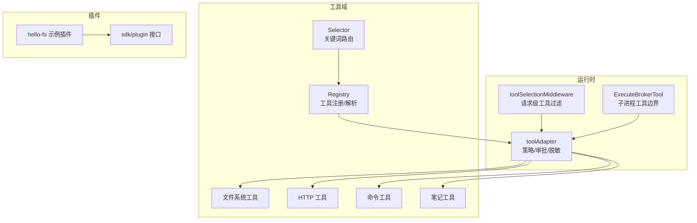
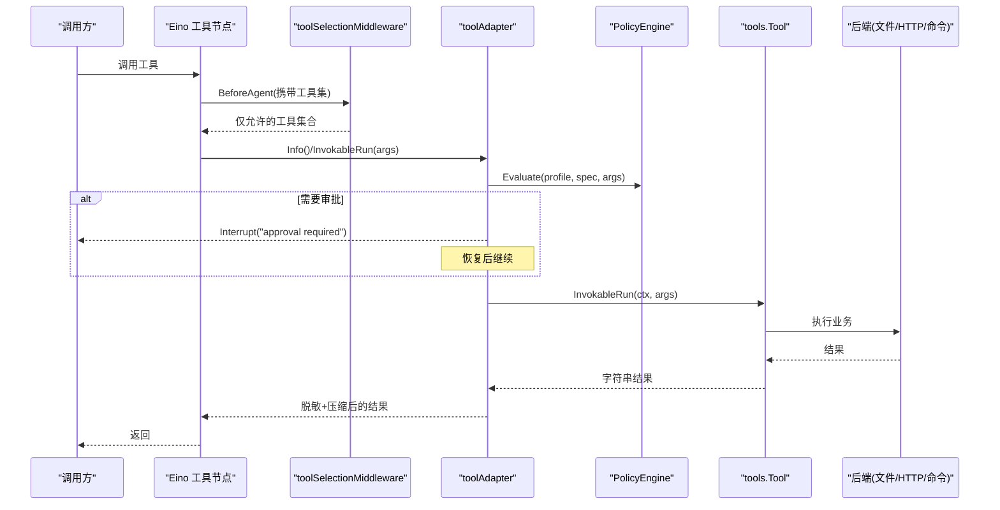
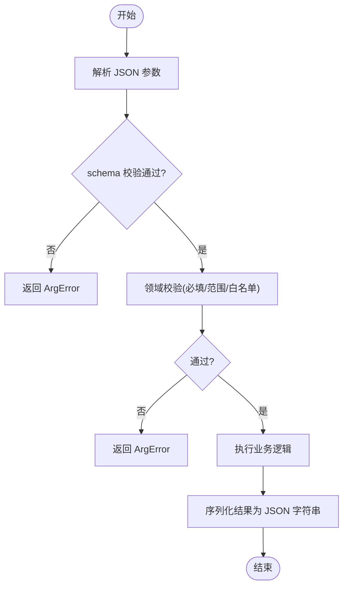
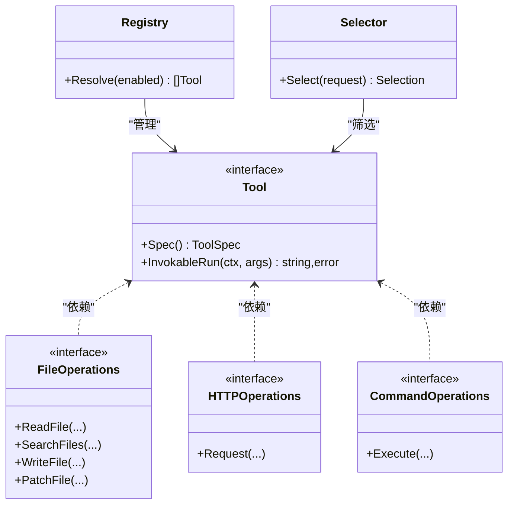
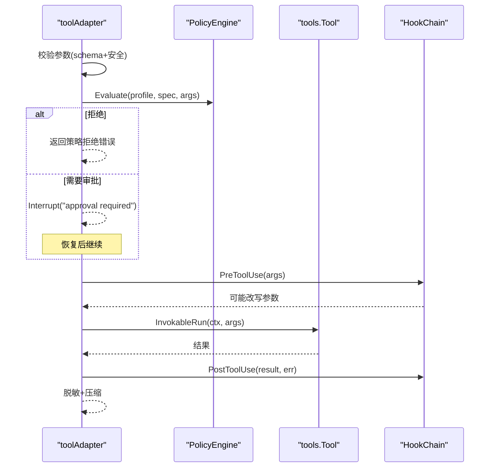
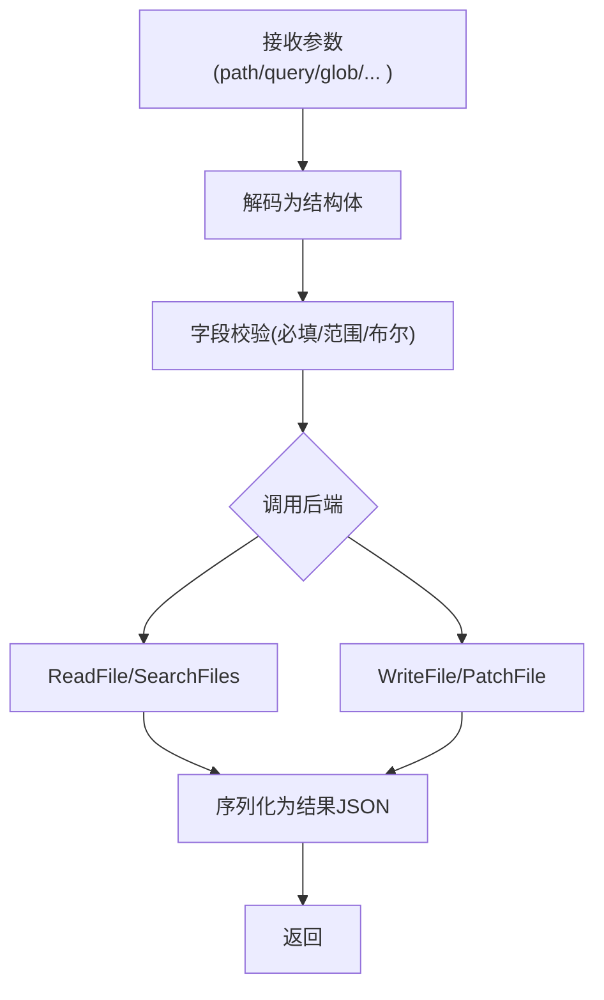
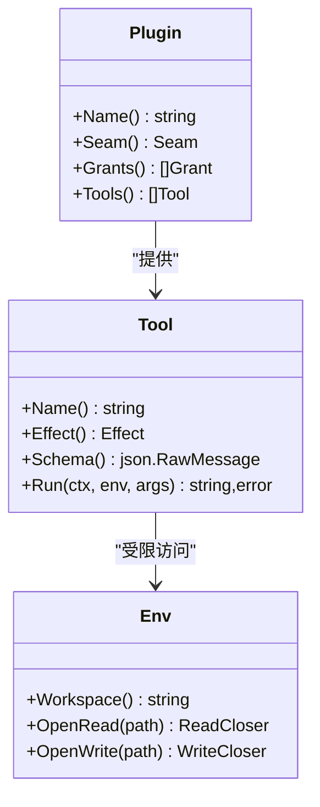
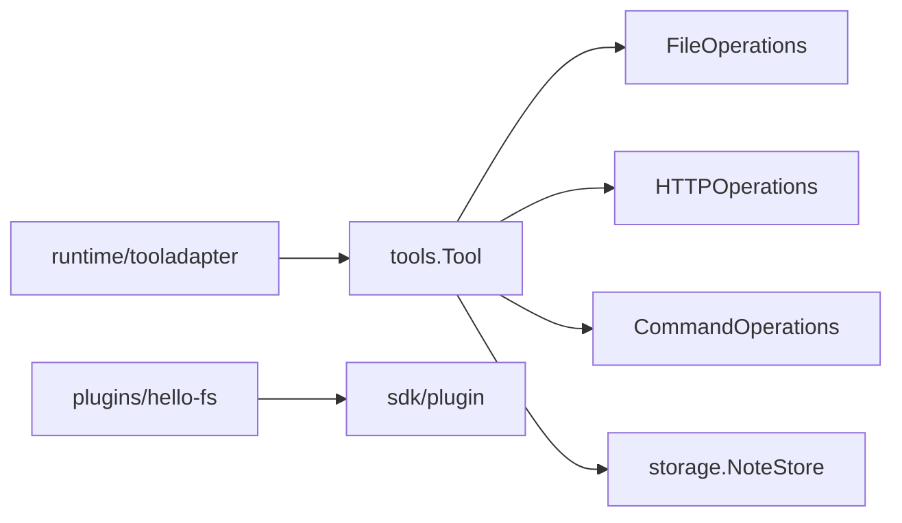

# 工具实现指南

<cite>
**本文引用的文件**
- [internal/tools/tools.go](file://internal/tools/tools.go)
- [internal/domain/tool.go](file://internal/domain/tool.go)
- [internal/runtime/tooladapter.go](file://internal/runtime/tooladapter.go)
- [internal/runtime/toolbroker.go](file://internal/runtime/toolbroker.go)
- [internal/runtime/toolselection.go](file://internal/runtime/toolselection.go)
- [internal/runtime/toolselection_middleware.go](file://internal/runtime/toolselection_middleware.go)
- [internal/tools/filesystem.go](file://internal/tools/filesystem.go)
- [internal/tools/http_request.go](file://internal/tools/http_request.go)
- [internal/tools/notes.go](file://internal/tools/notes.go)
- [internal/tools/command.go](file://internal/tools/command.go)
- [plugins/hello-fs/plugin.go](file://plugins/hello-fs/plugin.go)
- [sdk/plugin/plugin.go](file://sdk/plugin/plugin.go)
- [internal/tools/tools_test.go](file://internal/tools/tools_test.go)
</cite>

## 目录
1. [简介](#简介)
2. [项目结构](#项目结构)
3. [核心组件](#核心组件)
4. [架构总览](#架构总览)
5. [详细组件分析](#详细组件分析)
6. [依赖关系分析](#依赖关系分析)
7. [性能考虑](#性能考虑)
8. [故障排查指南](#故障排查指南)
9. [结论](#结论)
10. [附录](#附录)

## 简介
本指南面向在 Vivy 中实现“工具”的开发者，聚焦以下目标：
- 统一工具接口与注册机制，确保工具可被运行时安全调度、策略校验、审批拦截与结果脱敏。
- 明确参数解析、业务逻辑处理与返回值格式化的最佳实践。
- 说明错误处理策略，包括标准错误类型的使用与传播。
- 解释异步与耗时任务的安全执行方式（上下文、超时、中断）。
- 提供多类工具的参考实现：文件操作、网络请求、数据处理、外部 API 调用等。
- 给出调试技巧、测试方法与性能优化建议（连接池、缓存、资源限制）。

## 项目结构
Vivy 的工具系统由三层组成：
- internal/tools：领域内工具集合与通用能力（参数校验、选择器、注册表、结果序列化等）。
- internal/runtime：将 tools.Tool 适配为 Eino 可调用的工具节点，负责策略评估、审批流、结果压缩与脱敏。
- plugins + sdk/plugin：用户插件通过 SDK 暴露工具，受最小权限边界约束。

图表来源
- [internal/runtime/tooladapter.go:24-184](file://internal/runtime/tooladapter.go#L24-L184)
- [internal/runtime/toolselection_middleware.go:11-41](file://internal/runtime/toolselection_middleware.go#L11-L41)
- [internal/runtime/toolbroker.go:12-93](file://internal/runtime/toolbroker.go#L12-L93)
- [internal/tools/tools.go:223-362](file://internal/tools/tools.go#L223-L362)
- [internal/tools/filesystem.go:82-104](file://internal/tools/filesystem.go#L82-L104)
- [internal/tools/http_request.go:29-72](file://internal/tools/http_request.go#L29-L72)
- [internal/tools/command.go:38-52](file://internal/tools/command.go#L38-L52)
- [internal/tools/notes.go:16-38](file://internal/tools/notes.go#L16-L38)
- [plugins/hello-fs/plugin.go:17-56](file://plugins/hello-fs/plugin.go#L17-L56)
- [sdk/plugin/plugin.go:61-88](file://sdk/plugin/plugin.go#L61-L88)

章节来源
- [internal/tools/tools.go:17-362](file://internal/tools/tools.go#L17-L362)
- [internal/runtime/tooladapter.go:24-184](file://internal/runtime/tooladapter.go#L24-L184)
- [internal/runtime/toolselection_middleware.go:11-41](file://internal/runtime/toolselection_middleware.go#L11-L41)
- [internal/runtime/toolbroker.go:12-93](file://internal/runtime/toolbroker.go#L12-L93)
- [plugins/hello-fs/plugin.go:17-56](file://plugins/hello-fs/plugin.go#L17-L56)
- [sdk/plugin/plugin.go:61-88](file://sdk/plugin/plugin.go#L61-L88)

## 核心组件
- 工具契约
  - tools.Tool：定义 Spec() 与 InvokableRun(ctx, args)；可选 PrepareProposal() 用于影响型工具的人审预览。
  - domain.ToolSpec：描述工具名、描述、是否只读、参数 schema、关键词、交互类型。
  - domain.ToolProposal：人审时展示的影响计划（动作、目标、预览、风险发现、数据载荷）。
- 参数校验
  - ValidateArgs(spec, args)：基于 ToolSpec.Params 做 JSON Schema 级别校验，返回结构化 ArgError。
  - 各工具内部再执行更严格的领域校验（如必填、长度、白名单等）。
- 工具选择与注册
  - Selector：基于关键词对请求进行保守、确定性的工具路由。
  - Registry：维护工具名称到实现的映射，Resolve(enabled) 按配置启用并保留顺序。
- 运行时适配
  - toolAdapter：将 tools.Tool 适配为 Eino 可调用的工具节点，负责策略评估、审批中断、结果脱敏与压缩。
  - toolSelectionMiddleware：在 Eino 层注入请求级工具白名单，避免模型看到未授权工具。
  - ExecuteBrokerTool/Approved：子进程侧工具调用的统一入口，重复策略与钩子流程，保证安全边界。

章节来源
- [internal/tools/tools.go:17-84](file://internal/tools/tools.go#L17-L84)
- [internal/domain/tool.go:5-61](file://internal/domain/tool.go#L5-L61)
- [internal/runtime/tooladapter.go:24-184](file://internal/runtime/tooladapter.go#L24-L184)
- [internal/runtime/toolselection_middleware.go:11-41](file://internal/runtime/toolselection_middleware.go#L11-L41)
- [internal/runtime/toolbroker.go:12-93](file://internal/runtime/toolbroker.go#L12-L93)

## 架构总览
下图展示了从请求到工具执行的完整链路：Eino 中间件过滤工具列表 → toolAdapter 策略评估与审批 → 工具实现执行业务 → 结果脱敏与压缩 → 返回给上层。

图表来源
- [internal/runtime/toolselection_middleware.go:23-41](file://internal/runtime/toolselection_middleware.go#L23-L41)
- [internal/runtime/tooladapter.go:45-184](file://internal/runtime/tooladapter.go#L45-L184)
- [internal/tools/filesystem.go:119-149](file://internal/tools/filesystem.go#L119-L149)
- [internal/tools/http_request.go:51-72](file://internal/tools/http_request.go#L51-L72)
- [internal/tools/command.go:63-80](file://internal/tools/command.go#L63-L80)

## 详细组件分析

### 工具契约与参数解析
- 工具必须实现 Spec() 声明参数 schema，并在 InvokableRun 中严格解析 JSON 参数。
- 使用 ValidateArgs 进行 schema 级校验，任何非法输入都返回 *ArgError，不进入副作用逻辑。
- 可选 PrepareProposal 为影响型工具生成人审预览，便于人类审核。

章节来源
- [internal/tools/tools.go:41-84](file://internal/tools/tools.go#L41-L84)
- [internal/tools/filesystem.go:302-340](file://internal/tools/filesystem.go#L302-L340)
- [internal/tools/notes.go:129-151](file://internal/tools/notes.go#L129-L151)
- [internal/tools/command.go:114-130](file://internal/tools/command.go#L114-L130)

### 工具注册与选择
- Registry：集中注册工具，Resolve(enabled) 根据配置启用并保持顺序；未知名称启动时报错。
- Selector：基于 manifest 中的 Keywords 与工具名片段进行确定性匹配，避免无关工具被选中。
- 构建链式构造器：BuiltinWithFileOps/BuiltinWithSearch/BuiltinWithHTTP/BuiltinWithMCP/BuiltinWithSequential/BuiltinWithCommands，逐步扩展能力。

图表来源
- [internal/tools/tools.go:122-181](file://internal/tools/tools.go#L122-L181)
- [internal/tools/tools.go:223-362](file://internal/tools/tools.go#L223-L362)
- [internal/tools/filesystem.go:82-104](file://internal/tools/filesystem.go#L82-L104)
- [internal/tools/http_request.go:29-35](file://internal/tools/http_request.go#L29-L35)
- [internal/tools/command.go:38-52](file://internal/tools/command.go#L38-L52)

章节来源
- [internal/tools/tools.go:122-362](file://internal/tools/tools.go#L122-L362)

### 运行时适配与审批流
- toolAdapter 在每次调用前：
  - 校验参数（schema + 安全）
  - 策略评估（允许/拒绝/提示审批）
  - 若需审批则中断运行，等待恢复后继续
  - 执行工具并记录前后钩子
  - 结果脱敏与压缩，防止超大输出泄露或占用过多上下文
- 子进程工具调用通过 ExecuteBrokerTool/Approved 复用同一套策略与钩子流程，确保一致性。

图表来源
- [internal/runtime/tooladapter.go:78-184](file://internal/runtime/tooladapter.go#L78-L184)
- [internal/runtime/toolbroker.go:26-93](file://internal/runtime/toolbroker.go#L26-L93)

章节来源
- [internal/runtime/tooladapter.go:24-184](file://internal/runtime/tooladapter.go#L24-L184)
- [internal/runtime/toolbroker.go:12-93](file://internal/runtime/toolbroker.go#L12-L93)

### 文件操作工具
- 提供 read_file、search_files、write_file、patch 四个工具。
- 读写类工具通过 FileOperations 接口抽象，便于替换底层实现（如 Eino filesystem.Backend）。
- 写/补丁工具支持 PrepareProposal，生成变更预览供人审。

图表来源
- [internal/tools/filesystem.go:119-149](file://internal/tools/filesystem.go#L119-L149)
- [internal/tools/filesystem.go:166-200](file://internal/tools/filesystem.go#L166-L200)
- [internal/tools/filesystem.go:213-243](file://internal/tools/filesystem.go#L213-L243)
- [internal/tools/filesystem.go:258-300](file://internal/tools/filesystem.go#L258-L300)

章节来源
- [internal/tools/filesystem.go:13-340](file://internal/tools/filesystem.go#L13-L340)

### 网络请求工具
- http_request：只读工具，仅允许 GET/HEAD，URL 需在白名单内，Headers 为非敏感键值对。
- 通过 HTTPOperations 抽象，便于接入不同 HTTP 客户端或代理。

章节来源
- [internal/tools/http_request.go:12-72](file://internal/tools/http_request.go#L12-L72)

### 数据处理工具（笔记）
- list_notes：列出最近若干条笔记摘要，控制输出大小。
- read_note：按 ID 读取完整内容，缺失时返回结构化参数错误。

章节来源
- [internal/tools/notes.go:16-151](file://internal/tools/notes.go#L16-L151)

### 外部 API 调用工具（命令执行）
- execute/commandline：在沙箱/工作区内执行白名单命令，始终需要审批。
- 支持参数数组、工作目录、环境变量覆盖、超时毫秒数。
- 支持 PrepareProposal，生成命令预览与风险发现。

章节来源
- [internal/tools/command.go:12-130](file://internal/tools/command.go#L12-L130)

### 插件工具（用户扩展）
- 插件通过 sdk/plugin.Plugin 暴露 Name、Seam、Grants、Tools。
- 每个 Tool 实现 Name、Effect、Schema、Run(ctx, env, args)。
- 环境 Env 限制在工作区路径内，路径解析失败返回 plugin.ErrInvalidArgs。
- hello-fs 示例演示了读取文件并返回大小的最小可用工具。

图表来源
- [sdk/plugin/plugin.go:61-88](file://sdk/plugin/plugin.go#L61-L88)
- [plugins/hello-fs/plugin.go:17-56](file://plugins/hello-fs/plugin.go#L17-L56)

章节来源
- [sdk/plugin/plugin.go:61-88](file://sdk/plugin/plugin.go#L61-L88)
- [plugins/hello-fs/plugin.go:17-56](file://plugins/hello-fs/plugin.go#L17-L56)

## 依赖关系分析
- 低耦合：工具包不依赖 Eino，运行时负责桥接；工具通过接口（FileOperations/HTTPOperations/CommandOperations）解耦后端。
- 强内聚：每个工具专注自身领域，参数解析与结果序列化集中在工具包内。
- 关键依赖链：
  - runtime/tooladapter 依赖 tools.Tool、domain.ToolSpec、PolicyEngine、HookChain。
  - tools 包依赖 storage.NoteStore 与自定义后端接口。
  - 插件通过 sdk/plugin 与运行时隔离。

图表来源
- [internal/runtime/tooladapter.go:24-43](file://internal/runtime/tooladapter.go#L24-L43)
- [internal/tools/filesystem.go:82-104](file://internal/tools/filesystem.go#L82-L104)
- [internal/tools/http_request.go:29-35](file://internal/tools/http_request.go#L29-L35)
- [internal/tools/command.go:38-52](file://internal/tools/command.go#L38-L52)
- [internal/tools/notes.go:30-38](file://internal/tools/notes.go#L30-L38)
- [plugins/hello-fs/plugin.go:17-27](file://plugins/hello-fs/plugin.go#L17-L27)
- [sdk/plugin/plugin.go:61-88](file://sdk/plugin/plugin.go#L61-L88)

章节来源
- [internal/runtime/tooladapter.go:24-43](file://internal/runtime/tooladapter.go#L24-L43)
- [internal/tools/tools.go:223-362](file://internal/tools/tools.go#L223-L362)

## 性能考虑
- 结果压缩：toolAdapter 对工具输出进行头部/尾部保留与标记，避免超大响应阻塞上下文。
- 参数与输出边界：工具应设置合理的 max_bytes、max_results、超时等限制，防止资源耗尽。
- 连接与并发：
  - HTTP 工具应复用连接池，限制并发请求数与单次响应大小。
  - 命令执行应限制超时与 I/O 配额，避免长时间占用。
- 缓存策略：对频繁查询的只读数据（如笔记列表摘要）可引入短期缓存，注意失效与一致性。
- 资源限制：所有外部调用都应绑定上下文取消与超时，避免孤儿 goroutine。

[本节为通用指导，无需特定文件引用]

## 故障排查指南
- 参数错误
  - 现象：返回结构化 ArgError，包含字段与原因。
  - 定位：检查 ValidateArgs 与各工具的 decodeStringArgs/json.Unmarshal 分支。
- 策略拒绝
  - 现象：ErrPolicyDenied 或 Plan Mode 下 effectful 工具被拒。
  - 定位：查看 policy.Evaluate 决策与 EmitGovernanceEvent。
- 审批中断
  - 现象：Interrupt("approval required")，需恢复后继续。
  - 定位：确认 resume 上下文与审批状态是否正确传递。
- 子进程工具失败
  - 现象：ExecuteBrokerTool 返回 child worker request not allowed。
  - 定位：检查策略评估与钩子改写后的二次评估。
- 插件参数错误
  - 现象：plugin.ErrInvalidArgs。
  - 定位：检查路径合法性与 grant 权限。

章节来源
- [internal/tools/tools.go:41-84](file://internal/tools/tools.go#L41-L84)
- [internal/runtime/tooladapter.go:91-163](file://internal/runtime/tooladapter.go#L91-L163)
- [internal/runtime/toolbroker.go:26-93](file://internal/runtime/toolbroker.go#L26-L93)
- [plugins/hello-fs/plugin.go:39-56](file://plugins/hello-fs/plugin.go#L39-L56)
- [internal/pluginhost/host.go:124-142](file://internal/pluginhost/host.go#L124-L142)

## 结论
Vivy 的工具体系以清晰的契约、严格的参数校验、策略驱动的审批流和安全的运行时适配为核心。通过接口化后端与插件化扩展，既能保证安全性与可控性，又具备良好的可扩展性与可测试性。遵循本指南可实现高质量、可维护且高性能的工具。

[本节为总结，无需特定文件引用]

## 附录

### 常见工具实现模式清单
- 参数解析
  - 使用 ValidateArgs 进行 schema 校验，再在工具内部做领域校验。
  - 对可选参数提供默认值与空值处理。
- 业务逻辑
  - 通过接口（FileOperations/HTTPOperations/CommandOperations）调用后端，保持工具无副作用与可替换性。
  - 对影响型工具实现 PrepareProposal，生成预览与风险发现。
- 返回值格式化
  - 统一序列化为 JSON 字符串，必要时标记 untrusted。
  - 控制输出大小，避免过大负载。
- 错误处理
  - 参数错误返回 *ArgError；插件错误返回 plugin.ErrInvalidArgs。
  - 策略拒绝返回 ErrPolicyDenied；计划模式下拒绝影响型工具。
- 异步与耗时任务
  - 使用 context 控制取消与超时；对外部调用设置合理超时。
  - 大任务分片处理，及时返回部分结果或进度。
- 工具注册与集成
  - 在 Registry 中注册工具；通过 BuiltinWith* 链式构造器按需启用。
  - 插件通过 sdk/plugin 暴露工具，遵守最小权限原则。
- 调试技巧
  - 利用 HookChain 记录 Pre/Post 事件；关注 GovernanceEvent。
  - 打印结构化日志（脱敏），追踪审批与策略决策。
- 测试方法
  - 单元测试：验证参数校验、错误分支、结果序列化。
  - 集成测试：模拟后端接口，验证审批流与策略评估。
- 性能优化
  - 连接池复用、限流与熔断；缓存热点数据；限制并发与超时。

章节来源
- [internal/tools/tools.go:41-84](file://internal/tools/tools.go#L41-L84)
- [internal/tools/filesystem.go:119-340](file://internal/tools/filesystem.go#L119-L340)
- [internal/tools/http_request.go:51-72](file://internal/tools/http_request.go#L51-L72)
- [internal/tools/command.go:63-130](file://internal/tools/command.go#L63-L130)
- [internal/runtime/tooladapter.go:78-184](file://internal/runtime/tooladapter.go#L78-L184)
- [internal/tools/tools_test.go:11-164](file://internal/tools/tools_test.go#L11-L164)