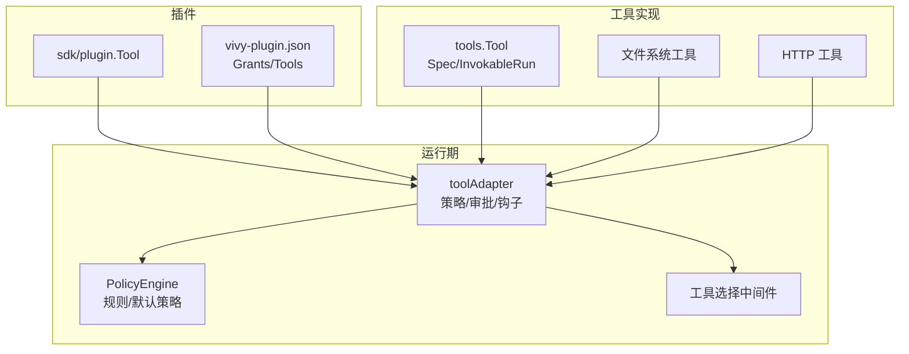
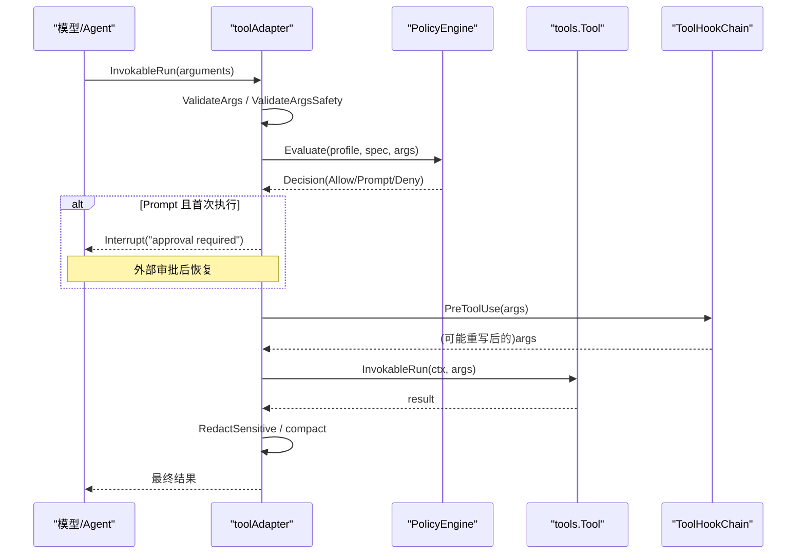
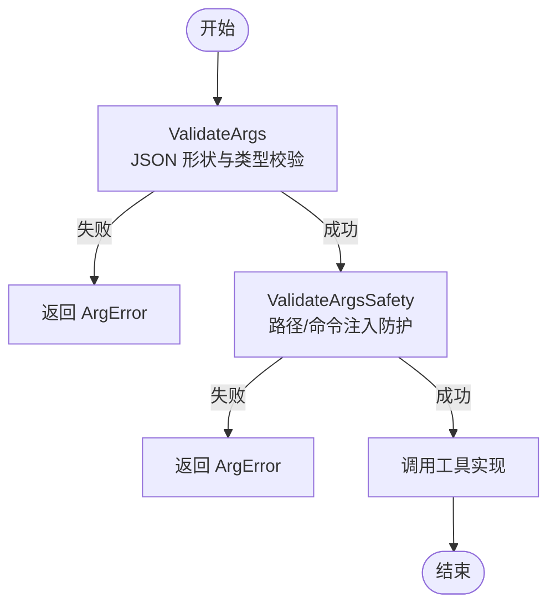
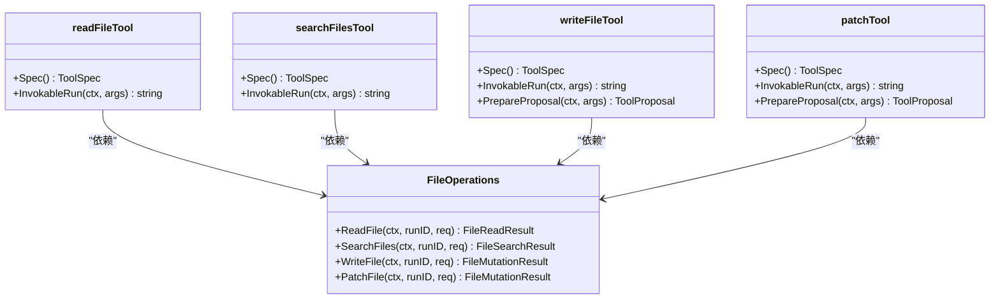
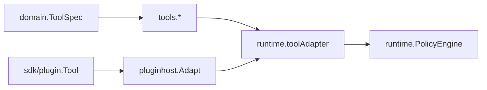

# 工具开发指南

<cite>
**本文引用的文件**
- [internal/tools/tools.go](file://internal/tools/tools.go)
- [internal/tools/filesystem.go](file://internal/tools/filesystem.go)
- [internal/tools/http_request.go](file://internal/tools/http_request.go)
- [internal/tools/context.go](file://internal/tools/context.go)
- [internal/tools/security.go](file://internal/tools/security.go)
- [internal/domain/tool.go](file://internal/domain/tool.go)
- [internal/runtime/tooladapter.go](file://internal/runtime/tooladapter.go)
- [internal/runtime/toolbroker.go](file://internal/runtime/toolbroker.go)
- [internal/runtime/policy.go](file://internal/runtime/policy.go)
- [internal/runtime/toolselection.go](file://internal/runtime/toolselection.go)
- [internal/runtime/toolselection_middleware.go](file://internal/runtime/toolselection_middleware.go)
- [plugins/hello-fs/plugin.go](file://plugins/hello-fs/plugin.go)
- [plugins/hello-fs/vivy-plugin.json](file://plugins/hello-fs/vivy-plugin.json)
- [sdk/plugin/plugin.go](file://sdk/plugin/plugin.go)
- [sdk/internal/manifest.go](file://sdk/internal/manifest.go)
</cite>

## 目录
1. [简介](#简介)
2. [项目结构](#项目结构)
3. [核心组件](#核心组件)
4. [架构总览](#架构总览)
5. [详细组件分析](#详细组件分析)
6. [依赖关系分析](#依赖关系分析)
7. [性能考虑](#性能考虑)
8. [故障排查指南](#故障排查指南)
9. [结论](#结论)
10. [附录](#附录)

## 简介
本指南面向在 Vivy 中开发“工具”的工程师，覆盖从工具设计、参数 Schema 定义、执行逻辑实现到注册与权限声明的全流程。内容基于仓库内现有实现，重点解释：
- 工具接口与规范（Spec、参数校验、安全校验）
- 运行时策略与审批流（Policy、Approval、中断/恢复）
- 插件体系（SDK、Grants、Seam）
- 常见场景示例（文件系统、网络请求、数据处理）
- 调试、测试与性能优化建议
- 最佳实践（安全性、可靠性、可审计性）

## 项目结构
Vivy 的工具系统由三层组成：
- 工具实现层（internal/tools）：定义 Tool 接口、内置工具（文件、HTTP、命令等）、参数与安全校验、上下文传播。
- 运行期适配层（internal/runtime）：将工具接入 Eino，统一执行路径、策略评估、审批门控、结果压缩与脱敏。
- 插件扩展层（sdk/plugin + plugins/*）：用户通过 SDK 暴露工具，声明 Grants，由宿主桥接为 Vivy 工具。

**图示来源**
- [internal/tools/tools.go:17-32](file://internal/tools/tools.go#L17-L32)
- [internal/tools/filesystem.go:82-104](file://internal/tools/filesystem.go#L82-L104)
- [internal/tools/http_request.go:29-49](file://internal/tools/http_request.go#L29-L49)
- [internal/runtime/tooladapter.go:24-43](file://internal/runtime/tooladapter.go#L24-L43)
- [internal/runtime/policy.go:35-84](file://internal/runtime/policy.go#L35-L84)
- [internal/runtime/toolselection_middleware.go:11-21](file://internal/runtime/toolselection_middleware.go#L11-L21)
- [sdk/plugin/plugin.go:61-82](file://sdk/plugin/plugin.go#L61-L82)
- [plugins/hello-fs/vivy-plugin.json:1-21](file://plugins/hello-fs/vivy-plugin.json#L1-L21)

**章节来源**
- [internal/tools/tools.go:17-32](file://internal/tools/tools.go#L17-L32)
- [internal/runtime/tooladapter.go:24-43](file://internal/runtime/tooladapter.go#L24-L43)
- [sdk/plugin/plugin.go:61-82](file://sdk/plugin/plugin.go#L61-L82)

## 核心组件
- 工具契约
  - tools.Tool：提供 Spec() 描述工具元数据与参数；InvokableRun(ctx, args) 执行调用并返回字符串结果。
  - domain.ToolSpec：包含名称、描述、是否只读、参数 Schema、关键词路由、交互类型（如提问）。
- 参数与安全
  - ValidateArgs：按 ToolSpec.Params 做 JSON 类型与必填校验。
  - ValidateArgsSafety：对 path/command 等高危字段做注入与路径穿越防护。
  - RedactSensitive：输出前脱敏敏感信息。
- 运行期适配
  - toolAdapter：统一入口，负责参数校验、策略评估、审批门控、钩子、中断/恢复、结果压缩与脱敏。
  - PolicyEngine：根据 Profile 与规则决定 Allow/Prompt/Deny，并生成快照哈希用于审计。
  - 工具选择中间件：按请求上下文裁剪模型可见的工具集合。
- 插件体系
  - sdk/plugin.Tool：插件侧工具接口，声明 Effect、Schema、Run(env, args)。
  - vivy-plugin.json：声明插件能力（Grants）、工具清单与 Schema。
  - pluginhost：将插件工具适配为 Vivy 的 tools.Tool。

**章节来源**
- [internal/tools/tools.go:17-84](file://internal/tools/tools.go#L17-L84)
- [internal/tools/security.go:38-79](file://internal/tools/security.go#L38-L79)
- [internal/runtime/tooladapter.go:78-163](file://internal/runtime/tooladapter.go#L78-L163)
- [internal/runtime/policy.go:96-169](file://internal/runtime/policy.go#L96-L169)
- [internal/runtime/toolselection_middleware.go:23-40](file://internal/runtime/toolselection_middleware.go#L23-L40)
- [sdk/plugin/plugin.go:61-82](file://sdk/plugin/plugin.go#L61-L82)

## 架构总览
下图展示一次工具调用的端到端流程：Eino 调用 -> 适配器校验 -> 策略评估 -> 审批门控 -> 执行 -> 脱敏/压缩 -> 返回。

**图示来源**
- [internal/runtime/tooladapter.go:78-163](file://internal/runtime/tooladapter.go#L78-L163)
- [internal/runtime/policy.go:96-169](file://internal/runtime/policy.go#L96-L169)
- [internal/tools/security.go:73-79](file://internal/tools/security.go#L73-L79)

## 详细组件分析

### 工具设计与参数 Schema
- 工具必须实现 tools.Tool：
  - Spec()：声明 Name、Description、Readonly、Params、Keywords、Interaction。
  - InvokableRun(ctx, args)：接收 JSON 参数，返回字符串结果或错误。
- 参数 Schema 使用 ToolSpec.Params 描述，支持 string/integer/number/boolean/object/array 等类型，并可声明 Required 与 Enum。
- 运行时先进行 ValidateArgs（形状与类型），再进行 ValidateArgsSafety（安全扫描），最后才进入工具实现。

**图示来源**
- [internal/tools/tools.go:41-84](file://internal/tools/tools.go#L41-L84)
- [internal/tools/security.go:38-71](file://internal/tools/security.go#L38-L71)

**章节来源**
- [internal/tools/tools.go:17-84](file://internal/tools/tools.go#L17-L84)
- [internal/domain/tool.go:27-61](file://internal/domain/tool.go#L27-L61)

### 执行逻辑与上下文处理
- 上下文键：
  - WithRunID/RunIDFromContext：传递持久化的运行 ID，供隔离文件系统使用。
  - WithSessionID/SessionIDFromContext：会话标识。
  - Proposal 相关：WithProposalData/ProposalDataFromContext、WithProposalPrecondition/ProposalPreconditionFromContext、ReportProposalStale。
- 工具实现应仅消费这些上下文值，不直接访问主机资源。

**章节来源**
- [internal/tools/context.go:14-74](file://internal/tools/context.go#L14-L74)

### 错误处理模式
- 参数错误：统一返回 *ArgError，便于在 tool.finished 事件中以结构化形式呈现。
- 策略拒绝：返回 ErrPolicyDenied，并在 Plan/ReadOnly 模式下阻止效果型工具。
- 审批中断：首次执行需要审批时，抛出 Interrupt；恢复后携带决策继续或终止。
- 提案过期：当目标在人类审核期间发生变化，后端可报告提案失效，运行时将其标记为 stale。

**章节来源**
- [internal/tools/tools.go:34-40](file://internal/tools/tools.go#L34-L40)
- [internal/runtime/tooladapter.go:18-28](file://internal/runtime/tooladapter.go#L18-L28)
- [internal/runtime/tooladapter.go:139-163](file://internal/runtime/tooladapter.go#L139-L163)
- [internal/tools/context.go:52-64](file://internal/tools/context.go#L52-L64)

### 环境变量注入与工作区访问
- 插件通过 sdk/plugin.Env 访问工作区：Workspace()、OpenRead(path)、OpenWrite(path)。
- 插件必须声明 Grants（fs.read/fs.write），缺失则失败关闭。
- 工作区路径限制：插件需确保相对路径、禁止绝对路径与穿越。

**章节来源**
- [sdk/plugin/plugin.go:77-82](file://sdk/plugin/plugin.go#L77-L82)
- [plugins/hello-fs/plugin.go:39-64](file://plugins/hello-fs/plugin.go#L39-L64)

### 权限模型与 Grants
- 插件侧：
  - Seam：tool/tool-world/provider。
  - Grants：fs.read/fs.write。
  - Tools：每个工具声明 Effect（read/write）与 Schema。
- 运行期：
  - PolicyEngine 根据 Profile 与规则决定 Allow/Prompt/Deny。
  - 审批策略（ask/never/auto）控制是否需要人工批准。

**章节来源**
- [sdk/plugin/plugin.go:12-59](file://sdk/plugin/plugin.go#L12-L59)
- [internal/runtime/policy.go:47-84](file://internal/runtime/policy.go#L47-L84)
- [internal/runtime/policy.go:217-274](file://internal/runtime/policy.go#L217-L274)

### 工具注册与集成到插件
- 内置工具注册：
  - Registry.NewRegistry 去重注册；Builtin* 系列构造器逐步叠加能力（文件、技能、任务、搜索、HTTP、MCP、顺序思考、命令）。
  - Resolve(enabled) 按配置启用工具名并构建 Selection。
- 插件工具注册：
  - pluginhost.Adapt 将 sdk/plugin.Tool 转为 tools.Tool，读取 vivy-plugin.json 中的 Grants 与 Tools。
  - vivy-plugin.json 声明 apiVersion、name、version、seam、module、grants、tools[]。

**章节来源**
- [internal/tools/tools.go:223-361](file://internal/tools/tools.go#L223-L361)
- [internal/pluginhost/host.go:22-55](file://internal/pluginhost/host.go#L22-L55)
- [plugins/hello-fs/vivy-plugin.json:1-21](file://plugins/hello-fs/vivy-plugin.json#L1-L21)
- [sdk/internal/manifest.go:21-48](file://sdk/internal/manifest.go#L21-L48)

### 常见场景实现

#### 文件系统操作
- 读文件：read_file，支持行范围与最大字节限制，返回结构化结果。
- 搜索文件：search_files，支持查询、路径、glob、大小写等。
- 写文件/补丁：write_file、patch，属于效果型工具，需审批。
- 预览与提案：PrepareProposal 可生成变更预览，便于人类审核。

**图示来源**
- [internal/tools/filesystem.go:82-104](file://internal/tools/filesystem.go#L82-L104)
- [internal/tools/filesystem.go:106-149](file://internal/tools/filesystem.go#L106-L149)
- [internal/tools/filesystem.go:151-200](file://internal/tools/filesystem.go#L151-L200)
- [internal/tools/filesystem.go:202-243](file://internal/tools/filesystem.go#L202-L243)
- [internal/tools/filesystem.go:245-300](file://internal/tools/filesystem.go#L245-L300)

**章节来源**
- [internal/tools/filesystem.go:13-300](file://internal/tools/filesystem.go#L13-L300)

#### 网络请求
- http_request：受限 GET/HEAD，URL 需在白名单，Headers 非敏感，返回状态码、头部、主体与内容类型。
- 通过 HTTPOperations 抽象后端，便于替换与测试。

**章节来源**
- [internal/tools/http_request.go:12-72](file://internal/tools/http_request.go#L12-L72)

#### 数据处理
- 工具结果统一以 JSON 序列化返回，便于下游解析与审计。
- 结果在进入模型上下文前会进行脱敏与长度压缩，避免泄露敏感信息与超出预算。

**章节来源**
- [internal/tools/filesystem.go:333-339](file://internal/tools/filesystem.go#L333-L339)
- [internal/runtime/tooladapter.go:186-202](file://internal/runtime/tooladapter.go#L186-L202)
- [internal/tools/security.go:73-79](file://internal/tools/security.go#L73-L79)

### 自定义工具开发步骤（插件）
- 实现 sdk/plugin.Tool：
  - Name()：工具名。
  - Effect()：read 或 write。
  - Schema()：JSON Schema 描述参数。
  - Run(ctx, env, args)：执行业务逻辑，通过 env 访问工作区。
- 编写 vivy-plugin.json：
  - 声明 seam、grants、tools[]（name/effect/description/schema）。
- 打包与验证：
  - 使用 sdk 提供的 verify/pack 流程进行校验与打包。

**章节来源**
- [plugins/hello-fs/plugin.go:17-64](file://plugins/hello-fs/plugin.go#L17-L64)
- [plugins/hello-fs/vivy-plugin.json:1-21](file://plugins/hello-fs/vivy-plugin.json#L1-L21)
- [sdk/internal/manifest.go:21-48](file://sdk/internal/manifest.go#L21-L48)

## 依赖关系分析
- 工具实现依赖 domain.ToolSpec 与可选后端接口（如 FileOperations、HTTPOperations）。
- 运行期依赖策略引擎与钩子系统，统一执行路径。
- 插件通过 SDK 暴露工具，由宿主适配为 Vivy 工具，再进入运行期管线。

**图示来源**
- [internal/domain/tool.go:27-61](file://internal/domain/tool.go#L27-L61)
- [internal/tools/tools.go:223-361](file://internal/tools/tools.go#L223-L361)
- [internal/runtime/tooladapter.go:24-43](file://internal/runtime/tooladapter.go#L24-L43)
- [internal/runtime/policy.go:35-84](file://internal/runtime/policy.go#L35-L84)
- [internal/pluginhost/host.go:22-55](file://internal/pluginhost/host.go#L22-L55)

**章节来源**
- [internal/tools/tools.go:223-361](file://internal/tools/tools.go#L223-L361)
- [internal/runtime/tooladapter.go:24-43](file://internal/runtime/tooladapter.go#L24-L43)
- [internal/runtime/policy.go:35-84](file://internal/runtime/policy.go#L35-L84)
- [internal/pluginhost/host.go:22-55](file://internal/pluginhost/host.go#L22-L55)

## 性能考虑
- 结果压缩：toolAdapter 对工具输出进行头尾保留与中间截断，防止超大结果影响模型上下文。
- 参数最小化：仅在必要时传递大对象，优先使用分页/范围参数（如 read_file 的行范围）。
- 策略缓存：PolicyEngine 对配置计算哈希，减少重复评估开销。
- 工具选择：通过关键词与请求语义裁剪可用工具集，降低模型负担。

**章节来源**
- [internal/runtime/tooladapter.go:186-202](file://internal/runtime/tooladapter.go#L186-L202)
- [internal/tools/filesystem.go:106-149](file://internal/tools/filesystem.go#L106-L149)
- [internal/runtime/policy.go:71-84](file://internal/runtime/policy.go#L71-L84)
- [internal/tools/tools.go:138-181](file://internal/tools/tools.go#L138-L181)

## 故障排查指南
- 参数错误
  - 现象：工具返回 ArgError。
  - 排查：检查 ToolSpec.Params 与传入 JSON 类型/必填项。
- 策略拒绝
  - 现象：ErrPolicyDenied。
  - 排查：确认当前 PolicyProfile 与规则，必要时调整策略或走审批。
- 审批中断
  - 现象：Interrupt("approval required")。
  - 排查：等待外部审批恢复；若被拒绝，工具不会执行。
- 提案过期
  - 现象：target changed after human review。
  - 排查：重新生成提案并再次审批。
- 插件权限不足
  - 现象：grant denied。
  - 排查：在 vivy-plugin.json 中补充 Grants，并确保插件 seam 正确。

**章节来源**
- [internal/tools/tools.go:34-40](file://internal/tools/tools.go#L34-L40)
- [internal/runtime/tooladapter.go:18-28](file://internal/runtime/tooladapter.go#L18-L28)
- [internal/runtime/tooladapter.go:139-163](file://internal/runtime/tooladapter.go#L139-L163)
- [internal/tools/context.go:52-64](file://internal/tools/context.go#L52-L64)
- [sdk/plugin/plugin.go:84-87](file://sdk/plugin/plugin.go#L84-L87)

## 结论
Vivy 的工具系统以清晰的契约与严格的运行期治理为核心：
- 工具通过 Spec 声明能力与参数，运行期统一校验、策略评估与审批门控。
- 插件通过 SDK 暴露工具，借助 Grants 精确授权，保障安全边界。
- 结合上下文、脱敏、压缩与审计，形成可观测、可回放的完整链路。
遵循本指南可实现安全、可靠、可扩展的工具生态。

## 附录

### 工具开发最佳实践
- 明确 Readonly：只读工具自动执行，效果型工具务必准备 Proposal 预览。
- 严格参数校验：利用 ToolSpec.Params 与 ValidateArgs/ValidateArgsSafety。
- 最小权限原则：插件仅申请所需 Grants，避免过度授权。
- 安全输出：所有结果经 RedactSensitive 后再进入模型上下文。
- 可测试性：通过后端接口（FileOperations、HTTPOperations）注入模拟实现。
- 可审计性：利用 PolicySnapshot 与事件总线记录每次评估与决策。

**章节来源**
- [internal/tools/tools.go:17-32](file://internal/tools/tools.go#L17-L32)
- [internal/tools/security.go:38-79](file://internal/tools/security.go#L38-L79)
- [internal/runtime/policy.go:96-169](file://internal/runtime/policy.go#L96-L169)
- [sdk/plugin/plugin.go:77-82](file://sdk/plugin/plugin.go#L77-L82)