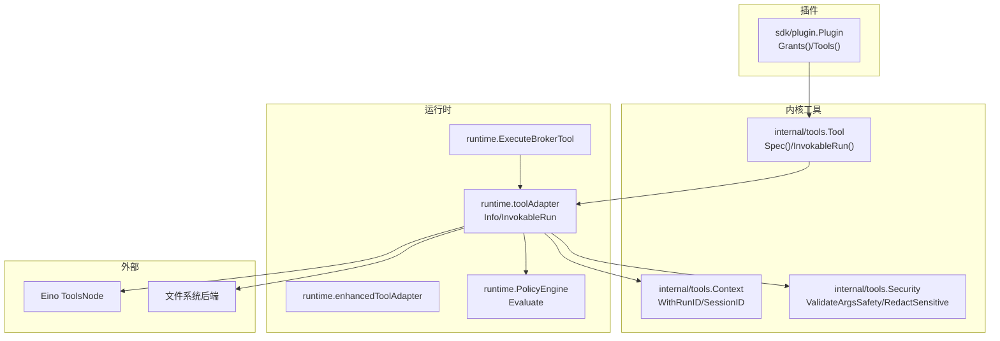
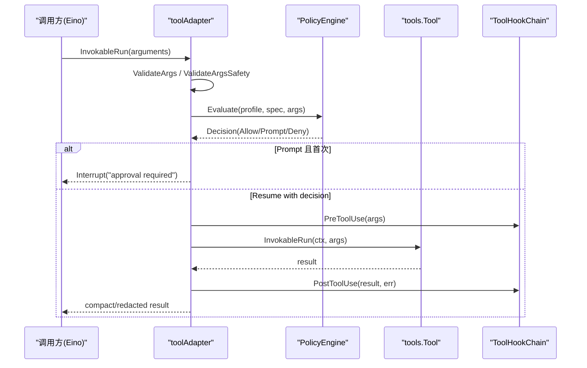
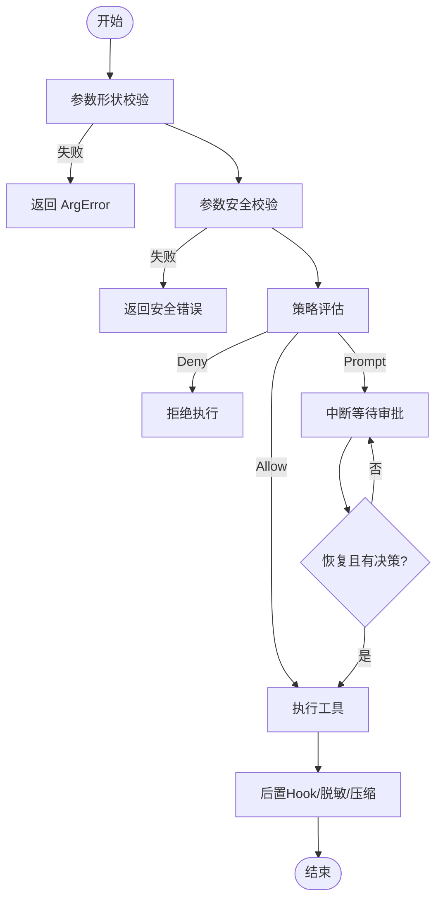
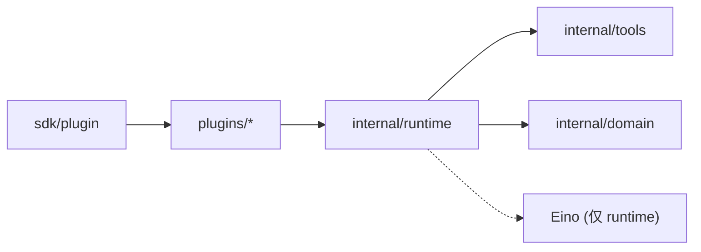

# 工具设计与架构

<cite>
**本文引用的文件**
- [internal/tools/tools.go](file://internal/tools/tools.go)
- [internal/tools/context.go](file://internal/tools/context.go)
- [internal/tools/filesystem.go](file://internal/tools/filesystem.go)
- [internal/tools/security.go](file://internal/tools/security.go)
- [internal/domain/tool.go](file://internal/domain/tool.go)
- [internal/runtime/tooladapter.go](file://internal/runtime/tooladapter.go)
- [internal/runtime/enhanced_tooladapter.go](file://internal/runtime/enhanced_tooladapter.go)
- [internal/runtime/toolbroker.go](file://internal/runtime/toolbroker.go)
- [internal/runtime/policy.go](file://internal/runtime/policy.go)
- [sdk/plugin/plugin.go](file://sdk/plugin/plugin.go)
- [plugins/hello-fs/plugin.go](file://plugins/hello-fs/plugin.go)
- [docs/architecture/VIVY-PLUGIN-SPEC.md](file://docs/architecture/VIVY-PLUGIN-SPEC.md)
</cite>

## 目录
1. [简介](#简介)
2. [项目结构](#项目结构)
3. [核心组件](#核心组件)
4. [架构总览](#架构总览)
5. [详细组件分析](#详细组件分析)
6. [依赖关系分析](#依赖关系分析)
7. [性能考虑](#性能考虑)
8. [故障排查指南](#故障排查指南)
9. [结论](#结论)
10. [附录：工具设计示例与最佳实践](#附录工具设计示例与最佳实践)

## 简介
本文件系统性阐述 Vivy 工具系统的核心设计理念与实现，覆盖工具接口定义、插件架构模式、工具生命周期管理、执行上下文 Env 的提供机制（工作区访问、环境变量注入、权限控制），以及工具与插件的关系和权限声明 Grants()。同时给出工具设计最佳实践与从简单到复杂的完整设计示例路径，帮助读者在遵循安全边界的前提下高效扩展能力。

## 项目结构
Vivy 的工具系统由三层组成：
- 内核工具层 internal/tools：定义 Vivy 自有工具契约 Tool、参数校验、选择器、注册表与安全扫描。
- 运行时适配层 internal/runtime：将内核工具桥接到 Eino 的调用模型，统一策略评估、审批流、钩子、结果脱敏与压缩。
- 插件窗口 sdk/plugin：对外暴露的最小导入面，限定插件只能使用 Env 访问工作区，并通过 Grants() 声明所需权限。

图表来源
- [internal/tools/tools.go:17-32](file://internal/tools/tools.go#L17-L32)
- [internal/runtime/tooladapter.go:24-43](file://internal/runtime/tooladapter.go#L24-L43)
- [internal/runtime/policy.go:35-84](file://internal/runtime/policy.go#L35-L84)
- [sdk/plugin/plugin.go:61-82](file://sdk/plugin/plugin.go#L61-L82)

章节来源
- [internal/tools/tools.go:17-32](file://internal/tools/tools.go#L17-L32)
- [internal/runtime/tooladapter.go:24-43](file://internal/runtime/tooladapter.go#L24-L43)
- [sdk/plugin/plugin.go:61-82](file://sdk/plugin/plugin.go#L61-L82)

## 核心组件
- 工具接口与规范
  - 内核工具契约：Spec() 描述名称、描述、是否只读、参数 Schema、关键词；InvokableRun(ctx, args) 执行一次调用，返回字符串结果或错误。
  - 插件工具契约：Name()、Effect()（read/write）、Schema()（JSON Schema）、Run(ctx, env, args)。
- 参数校验与安全
  - ValidateArgs：按 Spec.Params 进行 JSON 类型与必填校验，保证无效参数不会进入副作用逻辑。
  - ValidateArgsSafety：对 path/command/cmd 等高危字段做 NUL、命令注入、路径穿越等前置拦截。
  - RedactSensitive：对输出中的密钥与邮箱进行脱敏。
- 工具选择与注册
  - Registry：维护工具名到实现的映射，支持 Resolve(enabled) 按配置启用并限制搜索工具范围。
  - Selector：基于请求文本与工具 Keywords 的确定性路由，避免每次调用都触发模型判断。
- 执行上下文
  - WithRunID/RunIDFromContext：为工具注入运行期隔离标识，确保工作区访问绑定到当前 Run。
  - WithSessionID/SessionIDFromContext：会话级上下文。
  - Proposal 相关：携带提案数据、目标哈希、过期报告回调，支撑“人类审批后恢复执行”的幂等与失效保护。
- 运行时适配
  - toolAdapter：实现 Eino InvokableTool，负责策略评估、审批中断/恢复、Hook 前后处理、结果脱敏与压缩。
  - enhancedToolAdapter：适配 EnhancedInvokableTool，支持结构化多部件输出（文本/图片/音视频/文件）。
  - ExecuteBrokerTool：子进程/工作器通过父进程边界执行工具，复用策略、Hook、脱敏与预算裁剪。

章节来源
- [internal/tools/tools.go:17-84](file://internal/tools/tools.go#L17-L84)
- [internal/tools/security.go:38-79](file://internal/tools/security.go#L38-L79)
- [internal/tools/context.go:14-73](file://internal/tools/context.go#L14-L73)
- [internal/runtime/tooladapter.go:78-184](file://internal/runtime/tooladapter.go#L78-L184)
- [internal/runtime/enhanced_tooladapter.go:13-95](file://internal/runtime/enhanced_tooladapter.go#L13-L95)
- [internal/runtime/toolbroker.go:12-93](file://internal/runtime/toolbroker.go#L12-L93)

## 架构总览
工具执行的主流程如下：
1) Eino 调用 Info/InvokableRun，toolAdapter 获取工具 Spec。
2) 校验参数形状与安全（ValidateArgs + ValidateArgsSafety）。
3) 策略引擎 Evaluate 决定 Allow/Prompt/Deny，并记录治理事件。
4) 若需要审批，首次执行中断，等待用户决策；恢复时携带决策继续。
5) 注入运行上下文（RunID/SessionID），调用工具 InvokableRun。
6) 后置 Hook 记录审计，输出经 RedactSensitive 与预算裁剪后返回。

图表来源
- [internal/runtime/tooladapter.go:78-184](file://internal/runtime/tooladapter.go#L78-L184)
- [internal/runtime/policy.go:96-135](file://internal/runtime/policy.go#L96-L135)

章节来源
- [internal/runtime/tooladapter.go:78-184](file://internal/runtime/tooladapter.go#L78-L184)
- [internal/runtime/policy.go:96-135](file://internal/runtime/policy.go#L96-L135)

## 详细组件分析

### 工具接口与生命周期
- 内核工具
  - Spec(): 声明 Name、Description、Readonly、Params、Keywords、Interaction。
  - InvokableRun(ctx, args): 执行一次调用，必须稳定、幂等友好（尤其是写操作需配合提案哈希）。
- 插件工具
  - Name()/Effect()/Schema()/Run(ctx, env, args): 仅通过 Env 访问工作区，禁止直接访问系统 API。
- 生命周期要点
  - 参数校验优先于任何副作用。
  - 策略评估贯穿始终，Hook 重写参数需重新评估。
  - 审批中断/恢复：首次执行中断，恢复时携带决策与提案数据，必要时检查目标变更。

图表来源
- [internal/tools/tools.go:41-84](file://internal/tools/tools.go#L41-L84)
- [internal/tools/security.go:38-71](file://internal/tools/security.go#L38-L71)
- [internal/runtime/tooladapter.go:78-184](file://internal/runtime/tooladapter.go#L78-L184)

章节来源
- [internal/tools/tools.go:17-84](file://internal/tools/tools.go#L17-L84)
- [internal/runtime/tooladapter.go:78-184](file://internal/runtime/tooladapter.go#L78-L184)

### 执行上下文 Env 与权限控制
- 插件侧 Env
  - Workspace(): 返回工作区根路径。
  - OpenRead/OpenWrite: 受 Grants() 控制的受限 I/O 能力。缺失权限会关闭失败。
- 内核侧 Context
  - WithRunID/RunIDFromContext：将运行期隔离 ID 注入到工具上下文，确保所有文件系统访问绑定到当前 Run。
  - WithSessionID/SessionIDFromContext：会话级上下文。
  - Proposal 相关：携带提案数据、目标哈希、过期报告回调，用于“人类审批后恢复执行”的失效保护。
- 权限模型
  - 插件通过 Grants() 声明所需权限（如 fs.read/fs.write），pack 阶段冻结。
  - 运行时根据策略与审批决定是否放行写操作。

章节来源
- [sdk/plugin/plugin.go:61-82](file://sdk/plugin/plugin.go#L61-L82)
- [internal/tools/context.go:14-73](file://internal/tools/context.go#L14-L73)
- [docs/architecture/VIVY-PLUGIN-SPEC.md:47-83](file://docs/architecture/VIVY-PLUGIN-SPEC.md#L47-L83)

### 工具与插件关系
- 插件通过 sdk/plugin.Plugin 暴露 Tools()，每个 Tool 实现 Name/Effect/Schema/Run。
- 插件清单 vivy-plugin.json 声明 seam、grants、tools 列表，pack 生成注册表，内核不直接 import 插件源码。
- 示例 hello-fs 展示了读取工作区文件的插件实现，严格限制路径相对性，避免越权访问。

章节来源
- [docs/architecture/VIVY-PLUGIN-SPEC.md:29-83](file://docs/architecture/VIVY-PLUGIN-SPEC.md#L29-L83)
- [plugins/hello-fs/plugin.go:17-65](file://plugins/hello-fs/plugin.go#L17-L65)

### 文件系统工具族
- 内置文件工具：read_file、search_files、write_file、patch。
- 通过 FileOperations 接口解耦具体实现，便于替换后端（如 Eino filesystem.Backend）。
- 读写分离：读工具 Readonly=true，自动执行；写工具需要审批。

章节来源
- [internal/tools/filesystem.go:13-104](file://internal/tools/filesystem.go#L13-L104)
- [internal/tools/filesystem.go:106-200](file://internal/tools/filesystem.go#L106-L200)

### 增强型工具输出
- enhancedToolAdapter 支持结构化输出（文本、图片、音视频、文件），内部以 envelope 形式组织 parts，并按预算裁剪。

章节来源
- [internal/runtime/enhanced_tooladapter.go:13-95](file://internal/runtime/enhanced_tooladapter.go#L13-L95)

### 子进程/工作器工具执行
- ExecuteBrokerTool/ExecuteApprovedBrokerTool：在工作器中发起工具调用，但策略、Hook、脱敏、预算均由父进程边界完成，防止越权。

章节来源
- [internal/runtime/toolbroker.go:12-93](file://internal/runtime/toolbroker.go#L12-L93)

## 依赖关系分析
- internal/tools 不依赖 Eino，保持内核工具纯 Go 契约。
- internal/runtime 是唯一允许依赖 Eino 的包之一，负责桥接与治理。
- 插件仅能导入 sdk/plugin，无法触及 internal/*。

图表来源
- [internal/runtime/tooladapter.go:1-16](file://internal/runtime/tooladapter.go#L1-L16)
- [internal/tools/tools.go:1-15](file://internal/tools/tools.go#L1-L15)
- [sdk/plugin/plugin.go:1-10](file://sdk/plugin/plugin.go#L1-L10)

章节来源
- [internal/runtime/tooladapter.go:1-16](file://internal/runtime/tooladapter.go#L1-L16)
- [internal/tools/tools.go:1-15](file://internal/tools/tools.go#L1-L15)
- [sdk/plugin/plugin.go:1-10](file://sdk/plugin/plugin.go#L1-L10)

## 性能考虑
- 参数校验前置：避免无效参数进入昂贵副作用。
- 结果压缩：compactToolResult 保留首尾片段，避免大结果污染模型上下文。
- 结构化输出裁剪：enhancedToolAdapter 按预算逐步丢弃 parts。
- 确定性路由：Selector 基于 Keywords 快速缩小工具集，减少后续匹配成本。
- 策略缓存：PolicyEngine 构造时计算快照哈希，避免重复计算。

[本节为通用指导，不直接分析具体文件]

## 故障排查指南
- 参数错误
  - 现象：ArgError，包含字段与原因。
  - 排查：检查 Spec.Params 与传入 JSON 类型、必填项。
  - 参考路径：[internal/tools/tools.go:41-84](file://internal/tools/tools.go#L41-L84)
- 安全拦截
  - 现象：ValidateArgsSafety 报错（NUL、命令注入、路径穿越）。
  - 排查：检查 path/command/cmd 字段值。
  - 参考路径：[internal/tools/security.go:38-71](file://internal/tools/security.go#L38-L71)
- 策略拒绝
  - 现象：ErrPolicyDenied。
  - 排查：查看策略 Profile 与规则，确认是否处于 Plan/ReadOnly 模式。
  - 参考路径：[internal/runtime/policy.go:96-135](file://internal/runtime/policy.go#L96-L135)
- 审批未通过
  - 现象：首次执行中断，恢复时决策为 denied。
  - 排查：确认审批状态与提案数据是否过期/变更。
  - 参考路径：[internal/runtime/tooladapter.go:139-163](file://internal/runtime/tooladapter.go#L139-L163)
- 输出过大
  - 现象：模型收到被截断的结果。
  - 排查：调整 maxResultBytes 或优化工具输出。
  - 参考路径：[internal/runtime/tooladapter.go:186-202](file://internal/runtime/tooladapter.go#L186-L202)

章节来源
- [internal/tools/tools.go:41-84](file://internal/tools/tools.go#L41-L84)
- [internal/tools/security.go:38-71](file://internal/tools/security.go#L38-L71)
- [internal/runtime/policy.go:96-135](file://internal/runtime/policy.go#L96-L135)
- [internal/runtime/tooladapter.go:139-202](file://internal/runtime/tooladapter.go#L139-L202)

## 结论
Vivy 工具系统以最小化、可验证的接口为核心，将工具契约、插件边界、策略审批与执行上下文清晰分层。通过严格的参数校验、安全扫描、策略评估与审批流，既保证了安全性，又提供了可扩展的能力空间。插件通过 sdk/plugin 暴露能力，借助 Grants() 声明权限，结合运行时 Env 的安全访问，形成完整的“声明—校验—执行—审计”闭环。

[本节为总结，不直接分析具体文件]

## 附录：工具设计示例与最佳实践

### 设计原则
- 单一职责：每个工具只做一件事，例如 read_file 仅读取，write_file 仅写入。
- 明确副作用：Readonly=true 的工具自动执行；写工具必须走审批。
- 参数先行：先 Shape 再 Safety，最后业务校验。
- 错误可观测：使用 ArgError 与结构化错误，便于审计与 UI 展示。
- 安全边界：插件仅通过 Env 访问工作区，禁止绕过 Env 的直接系统调用。

### 示例路径
- 简单文件操作（插件）
  - 示例：hello-fs 的 stat 工具，读取工作区文件并返回长度。
  - 参考路径：[plugins/hello-fs/plugin.go:29-65](file://plugins/hello-fs/plugin.go#L29-L65)
- 复杂数据处理（内核工具）
  - 示例：网络搜索、HTTP 请求、MCP 调用、命令执行等工具族，均通过对应 Operations 接口注入后端。
  - 参考路径：
    - [internal/tools/tools.go:243-317](file://internal/tools/tools.go#L243-L317)
    - [internal/tools/filesystem.go:82-104](file://internal/tools/filesystem.go#L82-L104)

### 工具设计清单
- 必做
  - 定义清晰的 Spec：Name、Description、Readonly、Params、Keywords。
  - 实现健壮的参数解析与校验，返回 ArgError。
  - 对敏感输出进行 RedactSensitive。
  - 写操作准备提案（PreconditionHash），并在恢复时校验目标未变更。
- 建议
  - 使用 Selector 的 Keywords 提升路由准确性。
  - 控制输出大小，避免污染模型上下文。
  - 在 Hook 中记录审计信息，但不修改关键参数。
- 避免
  - 在插件中引入 internal/* 或 Eino。
  - 绕过 Env 直接访问文件系统或命令执行。
  - 忽略策略评估结果，擅自放行写操作。

章节来源
- [internal/tools/tools.go:243-317](file://internal/tools/tools.go#L243-L317)
- [internal/tools/filesystem.go:82-104](file://internal/tools/filesystem.go#L82-L104)
- [plugins/hello-fs/plugin.go:29-65](file://plugins/hello-fs/plugin.go#L29-L65)