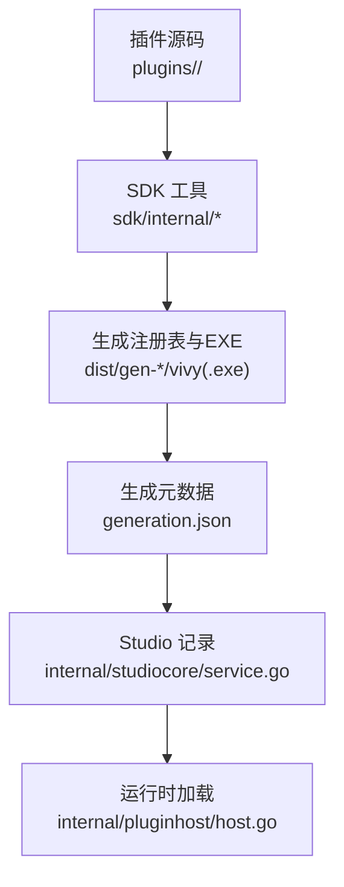
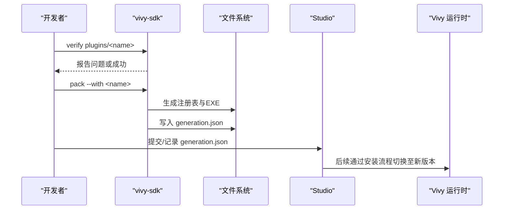
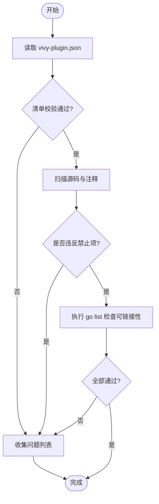
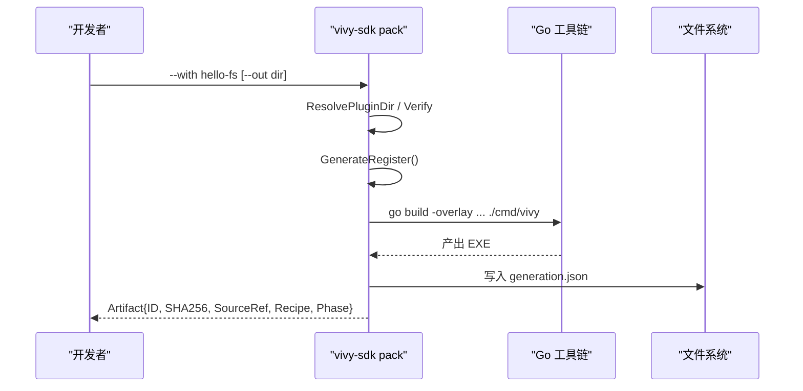
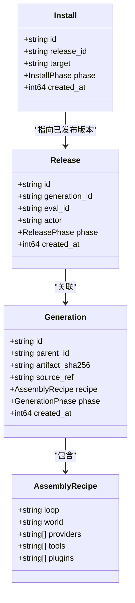
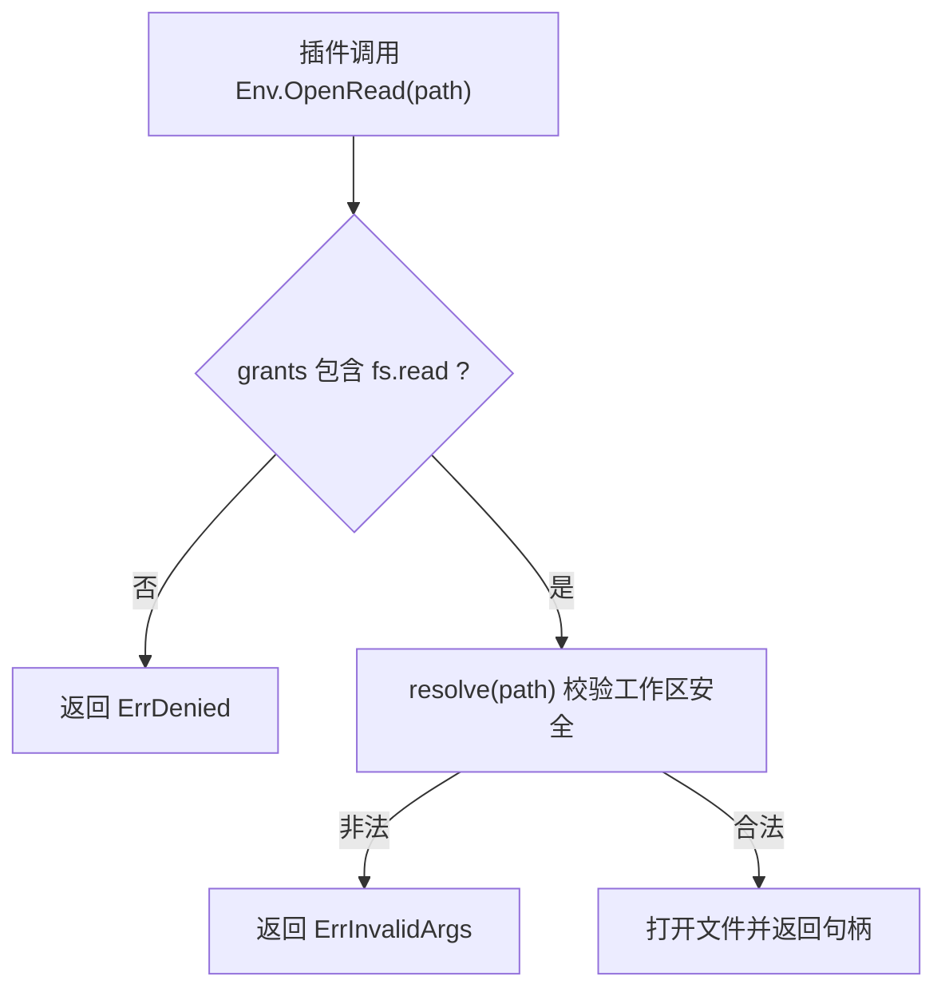
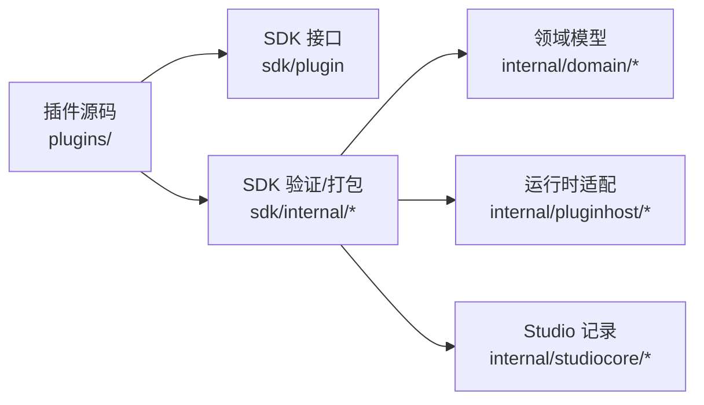

# 插件打包与部署

<cite>
**本文引用的文件**
- [VIVY-PLUGIN-SPEC.md](file://docs/architecture/VIVY-PLUGIN-SPEC.md)
- [vivy-plugin.json](file://plugins/hello-fs/vivy-plugin.json)
- [plugin.go（示例插件）](file://plugins/hello-fs/plugin.go)
- [manifest.go](file://sdk/internal/manifest.go)
- [verify.go](file://sdk/internal/verify.go)
- [pack.go](file://sdk/internal/pack.go)
- [inspect.go](file://sdk/internal/inspect.go)
- [plugin.go（SDK 接口）](file://sdk/plugin/plugin.go)
- [host.go（运行时适配层）](file://internal/pluginhost/host.go)
- [generation.go（领域模型）](file://internal/domain/generation.go)
- [service.go（Studio 记录生成物）](file://internal/studiocore/service.go)
- [main.go（vivy-sdk 入口）](file://sdk/main.go)
</cite>

## 目录
1. [简介](#简介)
2. [项目结构](#项目结构)
3. [核心组件](#核心组件)
4. [架构总览](#架构总览)
5. [详细组件分析](#详细组件分析)
6. [依赖关系分析](#依赖关系分析)
7. [性能与可维护性](#性能与可维护性)
8. [故障排除指南](#故障排除指南)
9. [结论](#结论)
10. [附录：完整工作流与最佳实践](#附录完整工作流与最佳实践)

## 简介
本指南面向插件作者与发布流程负责人，围绕 Vivy 插件的“清单—验证—打包—安装—版本管理”全链路进行说明。重点包括：
- 插件包结构与 vivy-plugin.json 清单字段规范
- 使用 sdk verify 进行正确性与安全性校验
- 使用 sdk pack 将 Go 代码编译为可执行产物并生成配方与哈希
- 通过 Studio 记录 Generation 并完成安装、回滚与发布
- 插件版本管理与兼容性策略
- 从开发到上线的端到端工作流与最佳实践

## 项目结构
插件位于仓库根下的 plugins/<name>/ 目录中，每个插件是一个独立的 Go 包，由 SDK 工具链统一验证与打包。核心相关文件分布如下：
- 插件示例：plugins/hello-fs/
- SDK 工具：sdk/internal/*（清单解析、验证、打包、检查）
- 运行时适配：internal/pluginhost/host.go（将插件工具桥接到内核工具契约）
- 领域模型：internal/domain/generation.go（Generation、Install、Release 等）
- Studio 集成：internal/studiocore/service.go（读取 generation.json 并记录）

图表来源
- [pack.go:67-199](file://sdk/internal/pack.go#L67-L199)
- [service.go:190-225](file://internal/studiocore/service.go#L190-L225)
- [host.go:22-60](file://internal/pluginhost/host.go#L22-L60)

章节来源
- [VIVY-PLUGIN-SPEC.md:29-44](file://docs/architecture/VIVY-PLUGIN-SPEC.md#L29-L44)
- [pack.go:67-199](file://sdk/internal/pack.go#L67-L199)

## 核心组件
- 插件清单：vivy-plugin.json，声明插件身份、能力边界与工具描述
- 验证器：sdk/internal/verify.go + manifest.go + inspect.go，负责清单校验、源码扫描与链接性检查
- 打包器：sdk/internal/pack.go，生成注册表、编译 EXE、输出 generation.json
- 运行时适配：internal/pluginhost/host.go，将插件工具映射为内核工具，并在 Env 中按 Grants 授权访问工作区
- 版本与安装：internal/domain/generation.go 定义 Generation/Install/Release；internal/studiocore/service.go 将打包产物记录为 Generation

章节来源
- [manifest.go:21-96](file://sdk/internal/manifest.go#L21-L96)
- [verify.go:19-48](file://sdk/internal/verify.go#L19-L48)
- [inspect.go:137-183](file://sdk/internal/inspect.go#L137-L183)
- [pack.go:67-199](file://sdk/internal/pack.go#L67-L199)
- [host.go:22-60](file://internal/pluginhost/host.go#L22-L60)
- [generation.go:3-41](file://internal/domain/generation.go#L3-L41)

## 架构总览
插件生命周期分为四个阶段：
1) 开发与验证：在插件目录内编辑代码与清单，运行 vivy-sdk verify 检查清单、导入、行为约束与可链接性
2) 打包与出制品：运行 vivy-sdk pack --with <插件>，生成新一代 EXE 与 generation.json
3) 记录与评估：Studio 读取 generation.json 记录 Generation，进入评估/评审流程
4) 安装与发布：通过 Promotion/Release/Install 流程将新一代 EXE 安装到日常运行位置，支持回滚

图表来源
- [verify.go:19-48](file://sdk/internal/verify.go#L19-L48)
- [pack.go:67-199](file://sdk/internal/pack.go#L67-L199)
- [service.go:190-225](file://internal/studiocore/service.go#L190-L225)

## 详细组件分析

### 清单文件 vivy-plugin.json 格式与必需字段
- apiVersion：当前仅支持 vivy.plugin/v0
- name：必须与目录名一致，且符合小写字母、数字、连字符命名规则
- version：遵循 semver 格式
- seam：仅允许 tool、tool-world、provider；禁止 journal、policy、sdk、studio
- module：相对本目录的 Go 包路径，通常为 .
- grants：申请的能力上限，如 fs.read、fs.write；打包后冻结
- tools：列出对外暴露的工具，包含 name、effect（read/write）、description、schema（JSON Schema 对象）

校验逻辑要点：
- 名称与目录一致性、命名合法性
- 版本号语义化
- seam/grants 白名单校验
- tools 非空、name 唯一、effect 合法、schema 为 JSON 对象

章节来源
- [VIVY-PLUGIN-SPEC.md:47-83](file://docs/architecture/VIVY-PLUGIN-SPEC.md#L47-L83)
- [manifest.go:21-96](file://sdk/internal/manifest.go#L21-L96)
- [vivy-plugin.json:1-21](file://plugins/hello-fs/vivy-plugin.json#L1-L21)

### 插件验证流程（sdk verify）
- 读取并解析 vivy-plugin.json，执行清单校验
- 扫描插件源码，检查是否违反禁止项（例如 import internal、eino、绕过 Env 直接 os.Open/exec.Command、go:embed 二进制等）
- 若清单与源码均通过，尝试 go list 以证明包可链接
- 输出 Report，OK 表示无问题

图表来源
- [verify.go:19-48](file://sdk/internal/verify.go#L19-L48)
- [inspect.go:137-183](file://sdk/internal/inspect.go#L137-L183)
- [manifest.go:50-96](file://sdk/internal/manifest.go#L50-L96)

章节来源
- [verify.go:19-48](file://sdk/internal/verify.go#L19-L48)
- [inspect.go:137-183](file://sdk/internal/inspect.go#L137-L183)

### 插件打包过程（sdk pack）
- 解析参数 --with <插件名或目录> 与可选 --out <输出目录>
- 定位模块根目录（查找 go.mod 中包含 module agent-vivy）
- 对每个指定插件执行 Verify，失败则中止
- 解析插件包名，生成注册表文件（zz_register.go），通过 -overlay 注入到 cmd/vivy 构建流程
- 调用 go build 产出 EXE（Windows 下为 .exe）
- 计算 EXE 的 SHA256，生成 generation.json，包含 ID、ArtifactSHA256、SourceRef、Recipe（loop/world/plugins）、Phase=built、Tools 列表
- 默认输出到 dist/<id>/，也可通过 --out 指定

图表来源
- [pack.go:67-199](file://sdk/internal/pack.go#L67-L199)
- [pack.go:245-279](file://sdk/internal/pack.go#L245-L279)

章节来源
- [pack.go:67-199](file://sdk/internal/pack.go#L67-L199)

### 运行时安装机制
- 打包产物包含 EXE 与 generation.json
- Studio 读取 generation.json 并记录 Generation（phase=built），形成可审计的版本链
- 通过 Promotion/Release/Install 流程将某一代 EXE 安装到日常运行位置；Install 记录当前安装目标与回滚状态
- 运行时通过 pluginhost 将插件工具适配为内核工具，Env 按 Grants 限制能力范围

图表来源
- [generation.go:3-41](file://internal/domain/generation.go#L3-L41)
- [generation.go:105-149](file://internal/domain/generation.go#L105-L149)
- [service.go:190-225](file://internal/studiocore/service.go#L190-L225)

章节来源
- [generation.go:3-41](file://internal/domain/generation.go#L3-L41)
- [generation.go:105-149](file://internal/domain/generation.go#L105-L149)
- [service.go:190-225](file://internal/studiocore/service.go#L190-L225)

### 插件与运行时的能力边界
- 插件仅能通过 sdk/plugin 暴露的 Plugin 与 Tool 接口实现
- Env 提供 Workspace、OpenRead、OpenWrite；缺失权限时返回 ErrDenied
- 路径解析严格限制在工作区内，拒绝绝对路径、穿越父目录、非法字符等
- 工具 effect 决定只读/写属性，影响运行时策略

图表来源
- [host.go:76-142](file://internal/pluginhost/host.go#L76-L142)
- [plugin.go:77-87](file://sdk/plugin/plugin.go#L77-L87)

章节来源
- [host.go:76-142](file://internal/pluginhost/host.go#L76-L142)
- [plugin.go:77-87](file://sdk/plugin/plugin.go#L77-L87)

## 依赖关系分析
- 插件源码仅依赖 sdk/plugin 接口，不直接 import internal/runtime 或 eino
- SDK 工具链依赖内部 domain 模型用于装配配方与阶段标记
- 运行时通过 pluginhost 将插件工具桥接为内核工具，保持内核与插件解耦
- Studio 通过读取 generation.json 建立版本链，驱动安装与发布流程

图表来源
- [pack.go:67-199](file://sdk/internal/pack.go#L67-L199)
- [host.go:22-60](file://internal/pluginhost/host.go#L22-L60)
- [service.go:190-225](file://internal/studiocore/service.go#L190-L225)

章节来源
- [pack.go:67-199](file://sdk/internal/pack.go#L67-L199)
- [host.go:22-60](file://internal/pluginhost/host.go#L22-L60)
- [service.go:190-225](file://internal/studiocore/service.go#L190-L225)

## 性能与可维护性
- 验证阶段只做静态检查与轻量 go list，避免昂贵编译，适合高频迭代
- 打包阶段通过 overlay 注入注册表，减少手工维护 import 列表，降低耦合
- 产物带 SHA256 与 SourceRef，便于溯源与回滚
- 插件能力受 Grants 与工作区隔离保护，降低误用风险

[本节为通用指导，无需特定文件引用]

## 故障排除指南
常见问题与定位方法：
- 清单错误：apiVersion/name/version/seam/grants/tools 不符合规范，查看 verify 报告中的 issues
- 源码违规：import internal/eino、os.Open/exec.Command 绕过 Env、go:embed 二进制等，依据 inspect 检查项修正
- 包不可链接：缺少 go 工具链或语法错误，确保环境可用并修复编译错误
- 打包失败：确认 --with 参数正确、模块根目录存在、go build 成功
- 安装失败：确认 generation.json 存在且完整，Studio 能读取并记录 Generation

章节来源
- [verify.go:19-48](file://sdk/internal/verify.go#L19-L48)
- [inspect.go:137-183](file://sdk/internal/inspect.go#L137-L183)
- [pack.go:67-199](file://sdk/internal/pack.go#L67-L199)

## 结论
Vivy 插件体系通过“清单—验证—打包—记录—安装”的闭环，将用户扩展能力封装为可审计、可回滚、可发布的独立单元。插件作者只需关注插件目录内的代码与清单，SDK 工具链负责安全校验与产物生成，Studio 负责版本管理与发布流程，运行时通过严格的权限控制保障安全。

[本节为总结性内容，无需特定文件引用]

## 附录：完整工作流与最佳实践

### 从代码编写到部署上线的工作流
1) 编写插件
- 在 plugins/<name>/ 下实现 sdk/plugin.Plugin 与 Tool
- 维护 vivy-plugin.json，声明 name、version、seam、grants、tools
2) 验证
- 运行 vivy-sdk verify plugins/<name>，修复所有 issues
3) 打包
- 运行 vivy-sdk pack --with <name>，得到 dist/<id>/vivy(.exe) 与 generation.json
4) 记录与评估
- 通过 Studio 读取 generation.json 记录 Generation，进入评估与审批
5) 安装与发布
- 经 Promotion/Release/Install 流程将新一代 EXE 安装到日常运行位置
- 如需回滚，记录新的 Install 行并将 phase 设为 rolled_back

章节来源
- [VIVY-PLUGIN-SPEC.md:158-183](file://docs/architecture/VIVY-PLUGIN-SPEC.md#L158-L183)
- [pack.go:67-199](file://sdk/internal/pack.go#L67-L199)
- [service.go:190-225](file://internal/studiocore/service.go#L190-L225)
- [generation.go:105-149](file://internal/domain/generation.go#L105-L149)

### 版本管理与更新策略
- 每个插件 version 遵循 semver，进入 Generation 出处，便于追踪
- 每次 pack 生成新 ID 与 SHA256，保证可追溯与可对比
- 通过 Generation 链管理演进，结合 Evaluation/Promotion/Release/Install 实现灰度与回滚
- 插件依赖与兼容性：
  - 插件仅依赖 sdk/plugin 接口，避免引入不稳定依赖
  - 清单冻结 grants，防止运行时权限漂移
  - 升级插件时建议先验证、再评估、最后发布，必要时保留旧版本以便回滚

章节来源
- [manifest.go:21-96](file://sdk/internal/manifest.go#L21-L96)
- [pack.go:67-199](file://sdk/internal/pack.go#L67-L199)
- [generation.go:3-41](file://internal/domain/generation.go#L3-L41)

### 插件发布最佳实践
- 文档编写
  - 在插件目录提供 README，说明用途、输入输出、权限需求与注意事项
  - 在 vivy-plugin.json 的 tools.description 中清晰描述工具行为
- 测试覆盖
  - 插件单元测试聚焦工具逻辑与边界条件
  - 集成测试放在物种测试中，由内核拉取 Register() 进行端到端验证
- 故障排除
  - 优先使用 vivy-sdk verify 定位清单与源码问题
  - 使用 vivy-sdk inspect-artifact 检查 generation.json 完整性
  - 运行时问题通过日志与事件回放定位，注意密钥脱敏

章节来源
- [VIVY-PLUGIN-SPEC.md:29-44](file://docs/architecture/VIVY-PLUGIN-SPEC.md#L29-L44)
- [VIVY-PLUGIN-SPEC.md:141-155](file://docs/architecture/VIVY-PLUGIN-SPEC.md#L141-L155)
- [pack.go:201-214](file://sdk/internal/pack.go#L201-L214)