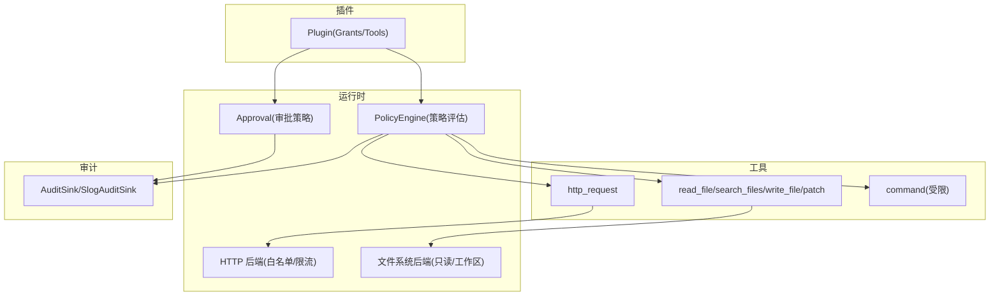
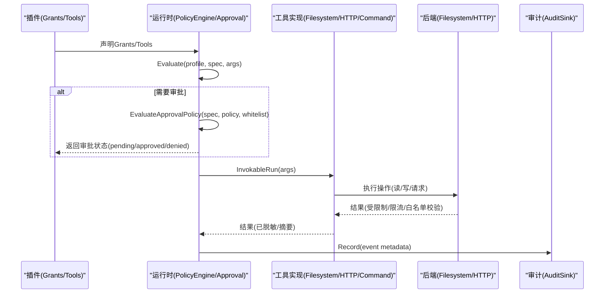
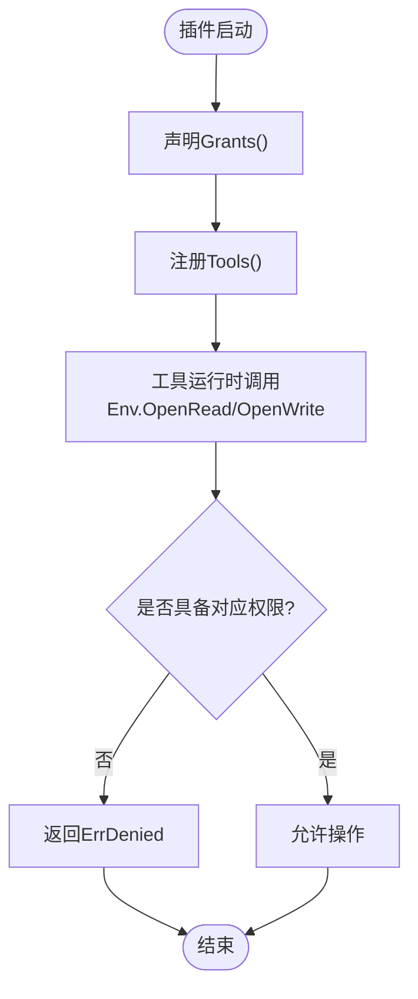
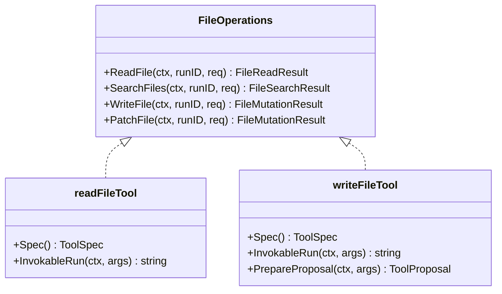
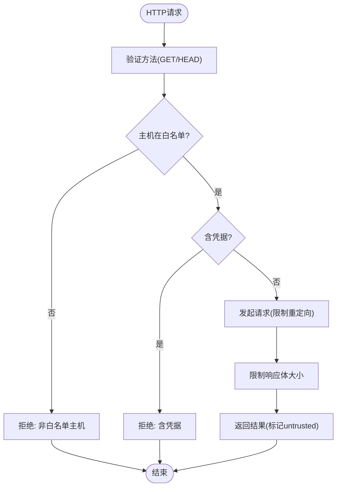
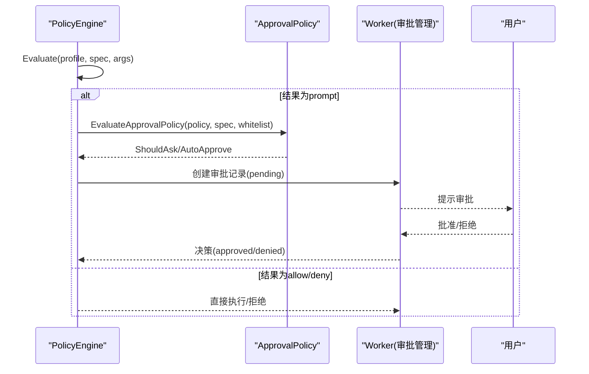
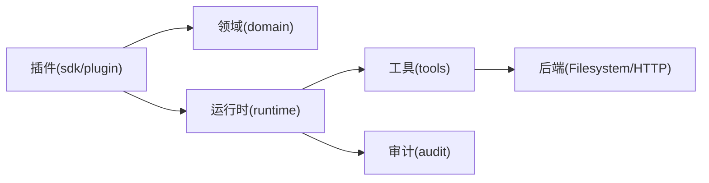

# 权限与授权模型

<cite>
**本文引用的文件**
- [sdk/plugin/plugin.go](file://sdk/plugin/plugin.go)
- [plugins/hello-fs/plugin.go](file://plugins/hello-fs/plugin.go)
- [internal/domain/policy.go](file://internal/domain/policy.go)
- [internal/runtime/policy.go](file://internal/runtime/policy.go)
- [internal/tools/security.go](file://internal/tools/security.go)
- [internal/tools/filesystem.go](file://internal/tools/filesystem.go)
- [internal/tools/http_request.go](file://internal/tools/http_request.go)
- [internal/runtime/http_request.go](file://internal/runtime/http_request.go)
- [internal/runtime/audit.go](file://internal/runtime/audit.go)
- [internal/app/worker.go](file://internal/app/worker.go)
</cite>

## 目录
1. [简介](#简介)
2. [项目结构](#项目结构)
3. [核心组件](#核心组件)
4. [架构总览](#架构总览)
5. [详细组件分析](#详细组件分析)
6. [依赖关系分析](#依赖关系分析)
7. [性能与安全考量](#性能与安全考量)
8. [故障排查指南](#故障排查指南)
9. [结论](#结论)
10. [附录：配置示例与最佳实践](#附录配置示例与最佳实践)

## 简介
本文件系统性阐述 Vivy 的权限与授权模型，覆盖插件侧的权限声明、运行时策略评估、工具调用审批流、以及审计与监控。重点包括：
- 文件系统读取/写入权限、网络访问控制、命令执行限制等安全边界
- Grant 类型定义与使用（如 fs.read、fs.write），以及如何在插件中通过 Grants() 声明所需权限
- 运行时如何校验工具调用的合法性（策略匹配、参数安全扫描、白名单校验）
- 权限最小化原则与不同安全级别的工具实现示例
- 权限审计与监控机制，以及如何诊断常见权限问题

## 项目结构
Vivy 的权限体系由“插件声明 + 运行时策略 + 工具实现 + 审计”四层构成：
- 插件层：通过 sdk/plugin 暴露 Grants() 和 Tool 接口，声明能力范围与副作用
- 领域层：定义策略配置文件、决策结果、工具规格等通用概念
- 运行时层：策略引擎评估、审批策略、HTTP 网络限制、文件系统后端适配
- 工具层：具体工具（文件读写、HTTP 请求、命令等）的安全约束与实现
- 审计层：事件元数据记录，便于追踪与合规审计

图表来源
- [internal/runtime/policy.go:35-135](file://internal/runtime/policy.go#L35-L135)
- [internal/runtime/http_request.go:74-106](file://internal/runtime/http_request.go#L74-L106)
- [internal/tools/filesystem.go:106-300](file://internal/tools/filesystem.go#L106-L300)
- [internal/runtime/audit.go:12-62](file://internal/runtime/audit.go#L12-L62)

章节来源
- [sdk/plugin/plugin.go:29-87](file://sdk/plugin/plugin.go#L29-L87)
- [internal/domain/policy.go:3-46](file://internal/domain/policy.go#L3-L46)
- [internal/runtime/policy.go:35-135](file://internal/runtime/policy.go#L35-L135)

## 核心组件
- 插件权限声明（Grant/Effect）：插件通过 Grants() 声明所需权限，Tool.Effect() 声明副作用（读/写）。缺失权限将导致调用失败（ErrDenied）。
- 策略引擎（PolicyEngine）：根据运行时的策略配置对工具调用进行评估，返回 allow/prompt/deny，并附带原因。
- 审批策略（ApprovalPolicy）：决定是否需要人工审批（ask/never/auto），支持自动放行只读或白名单工具。
- 工具安全校验：参数安全扫描（路径穿越、命令注入）、敏感信息脱敏、HTTP 白名单与重定向保护。
- 审计与监控：事件元数据记录（RunID、Seq、Type、PayloadSHA256），用于追踪与合规审计。

章节来源
- [sdk/plugin/plugin.go:29-87](file://sdk/plugin/plugin.go#L29-L87)
- [internal/runtime/policy.go:35-135](file://internal/runtime/policy.go#L35-L135)
- [internal/runtime/policy.go:217-273](file://internal/runtime/policy.go#L217-L273)
- [internal/tools/security.go:25-79](file://internal/tools/security.go#L25-L79)
- [internal/runtime/audit.go:12-62](file://internal/runtime/audit.go#L12-L62)

## 架构总览
下图展示一次工具调用的完整流程：从插件声明到策略评估、审批、执行与审计。

图表来源
- [internal/runtime/policy.go:96-135](file://internal/runtime/policy.go#L96-L135)
- [internal/runtime/policy.go:217-273](file://internal/runtime/policy.go#L217-L273)
- [internal/tools/filesystem.go:106-300](file://internal/tools/filesystem.go#L106-L300)
- [internal/runtime/http_request.go:74-106](file://internal/runtime/http_request.go#L74-L106)
- [internal/runtime/audit.go:35-62](file://internal/runtime/audit.go#L35-L62)

## 详细组件分析

### 插件权限声明与最小化原则
- 插件通过 Grants() 声明所需权限，当前 SDK 提供：
  - fs.read：允许读取工作区文件
  - fs.write：允许写入工作区文件
- 工具通过 Effect() 声明副作用：
  - read：只读操作
  - write：写操作
- 若插件未声明必要权限，Env 访问将被拒绝（ErrDenied）。这强制了“最小权限”原则：插件仅声明其实际需要的权限。

示例：hello-fs 插件仅声明 fs.read，因此只能读取文件，不能写入。

图表来源
- [sdk/plugin/plugin.go:29-87](file://sdk/plugin/plugin.go#L29-L87)
- [plugins/hello-fs/plugin.go:21-56](file://plugins/hello-fs/plugin.go#L21-L56)

章节来源
- [sdk/plugin/plugin.go:29-87](file://sdk/plugin/plugin.go#L29-L87)
- [plugins/hello-fs/plugin.go:21-56](file://plugins/hello-fs/plugin.go#L21-L56)

### 文件系统权限与工具
- 内置文件工具：
  - read_file：只读，支持行范围与字节限制
  - search_files：只读，支持查询、glob、大小限制
  - write_file：需审批，支持创建父目录
  - patch：需审批，精确字符串替换
- 这些工具的 Spec 明确 Readonly 标志，影响策略默认行为与审批策略。

图表来源
- [internal/tools/filesystem.go:82-104](file://internal/tools/filesystem.go#L82-L104)
- [internal/tools/filesystem.go:106-300](file://internal/tools/filesystem.go#L106-L300)

章节来源
- [internal/tools/filesystem.go:106-300](file://internal/tools/filesystem.go#L106-L300)

### 网络访问控制
- http_request 工具仅允许 GET/HEAD，且目标主机必须在白名单内
- 禁止携带凭据的请求头与查询参数
- 重定向必须保持在白名单且无凭据
- 响应体大小限制，避免资源耗尽

图表来源
- [internal/tools/http_request.go:37-72](file://internal/tools/http_request.go#L37-L72)
- [internal/runtime/http_request.go:74-106](file://internal/runtime/http_request.go#L74-L106)

章节来源
- [internal/tools/http_request.go:37-72](file://internal/tools/http_request.go#L37-L72)
- [internal/runtime/http_request.go:74-106](file://internal/runtime/http_request.go#L74-L106)

### 命令执行限制
- 命令类工具在参数安全层面进行严格检查：
  - 禁止 NUL 字节
  - 禁止命令拼接符号（&&、||、;、|、反引号、$()、powershell、cmd.exe）
  - 禁止路径穿越（../、..\）与 UNC 路径
- 这些检查在工具实现前执行，防止恶意参数进入工具逻辑

章节来源
- [internal/tools/security.go:38-71](file://internal/tools/security.go#L38-L71)

### 策略评估与审批流程
- PolicyEngine.Evaluate：根据策略配置与工具参数，计算 allow/prompt/deny
- ApprovalPolicy：决定是否需要人工审批（ask/never/auto），支持白名单自动放行
- 当结果为 prompt 时，运行时创建审批记录并等待用户决策

图表来源
- [internal/runtime/policy.go:96-135](file://internal/runtime/policy.go#L96-L135)
- [internal/runtime/policy.go:217-273](file://internal/runtime/policy.go#L217-L273)
- [internal/app/worker.go:488-511](file://internal/app/worker.go#L488-L511)

章节来源
- [internal/runtime/policy.go:96-135](file://internal/runtime/policy.go#L96-L135)
- [internal/runtime/policy.go:217-273](file://internal/runtime/policy.go#L217-L273)
- [internal/app/worker.go:488-511](file://internal/app/worker.go#L488-L511)

### 权限审计与监控
- AuditHook 接收生命周期钩子，记录事件元数据（RunID、Seq、Type、PayloadSHA256）
- SlogAuditSink 输出稳定元数据，不泄露负载内容
- 通过事件总线与存储持久化，支持后续审计与分析

章节来源
- [internal/runtime/audit.go:12-62](file://internal/runtime/audit.go#L12-L62)

## 依赖关系分析
- 插件依赖 SDK 提供的 Grant/Tool/Env 接口，不直接访问系统资源
- 运行时依赖领域模型（ToolSpec、PolicyProfile）与工具实现
- 工具实现依赖后端抽象（FileOperations、HTTPOperations），确保可测试性与隔离性
- 审计模块独立于业务逻辑，仅消费事件元数据

图表来源
- [sdk/plugin/plugin.go:29-87](file://sdk/plugin/plugin.go#L29-L87)
- [internal/domain/tool.go:5-112](file://internal/domain/tool.go#L5-L112)
- [internal/runtime/policy.go:35-135](file://internal/runtime/policy.go#L35-L135)
- [internal/runtime/audit.go:12-62](file://internal/runtime/audit.go#L12-L62)

章节来源
- [sdk/plugin/plugin.go:29-87](file://sdk/plugin/plugin.go#L29-L87)
- [internal/domain/tool.go:5-112](file://internal/domain/tool.go#L5-L112)
- [internal/runtime/policy.go:35-135](file://internal/runtime/policy.go#L35-L135)
- [internal/runtime/audit.go:12-62](file://internal/runtime/audit.go#L12-L62)

## 性能与安全考量
- 性能：
  - 策略评估为纯函数，无 I/O，开销低
  - HTTP 请求限制响应体大小，避免内存耗尽
  - 文件系统操作支持行范围与字节限制，减少大文件处理成本
- 安全：
  - 参数安全扫描防止注入与路径穿越
  - HTTP 白名单与重定向保护
  - 敏感信息脱敏（密钥、邮箱）
  - 审批策略确保高风险操作需人工确认

## 故障排查指南
- 插件权限不足：
  - 现象：调用 Env.OpenRead/OpenWrite 返回 ErrDenied
  - 解决：在插件 Grants() 中添加相应权限（fs.read/fs.write）
- 策略拒绝：
  - 现象：PolicyEngine.Evaluate 返回 deny
  - 解决：调整策略配置或选择更宽松的策略配置文件
- 审批超时：
  - 现象：审批记录过期，工具调用被拒绝
  - 解决：重新发起审批或调整审批有效期
- HTTP 请求失败：
  - 现象：主机不在白名单、含凭据、重定向违规
  - 解决：更新白名单、移除凭据、确保重定向安全

章节来源
- [sdk/plugin/plugin.go:84-87](file://sdk/plugin/plugin.go#L84-L87)
- [internal/runtime/policy.go:96-135](file://internal/runtime/policy.go#L96-L135)
- [internal/runtime/http_request.go:74-106](file://internal/runtime/http_request.go#L74-L106)

## 结论
Vivy 的权限与授权模型通过“插件声明 + 策略评估 + 审批流程 + 审计监控”形成闭环，确保工具调用在最小权限原则下安全执行。通过严格的参数校验、网络白名单、文件系统隔离与人工审批，有效防范常见安全风险。建议插件开发者遵循最小权限原则，合理声明权限，并利用策略配置与审批机制平衡安全性与可用性。

## 附录：配置示例与最佳实践

### 插件权限声明示例
- hello-fs 插件仅声明 fs.read，适用于只读场景
- 如需写入，需在 Grants() 中添加 fs.write，并确保工具 Effect() 为 write

章节来源
- [plugins/hello-fs/plugin.go:21-56](file://plugins/hello-fs/plugin.go#L21-L56)
- [sdk/plugin/plugin.go:29-87](file://sdk/plugin/plugin.go#L29-L87)

### 策略配置示例
- default：默认策略，效果型工具需审批
- plan：计划模式，默认拒绝
- read_only：只读模式，默认拒绝
- full_auto：全自动模式，默认允许

章节来源
- [internal/domain/policy.go:3-46](file://internal/domain/policy.go#L3-L46)
- [internal/runtime/policy.go:47-84](file://internal/runtime/policy.go#L47-L84)

### 审批策略示例
- ask：始终要求审批
- never：从不审批，效果型工具被拒绝
- auto：自动放行只读或白名单工具

章节来源
- [internal/runtime/policy.go:217-273](file://internal/runtime/policy.go#L217-L273)

### 安全最佳实践
- 插件仅声明必要权限
- 工具参数进行安全校验
- HTTP 请求使用白名单与凭据过滤
- 启用审计日志进行合规追踪

章节来源
- [internal/tools/security.go:25-79](file://internal/tools/security.go#L25-L79)
- [internal/runtime/http_request.go:74-106](file://internal/runtime/http_request.go#L74-L106)
- [internal/runtime/audit.go:12-62](file://internal/runtime/audit.go#L12-L62)