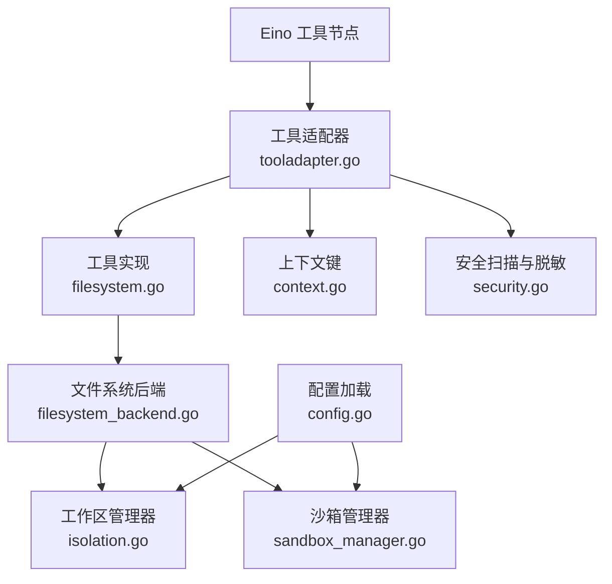
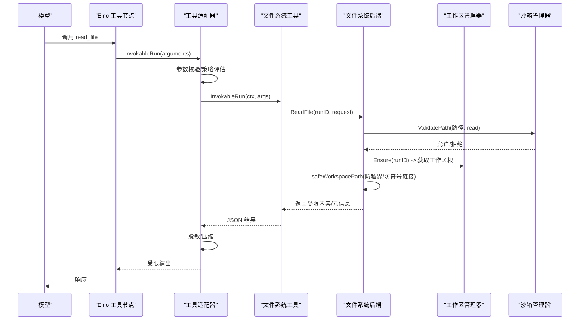
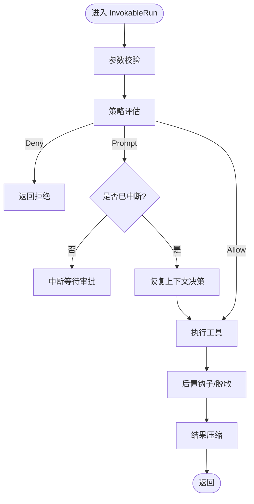
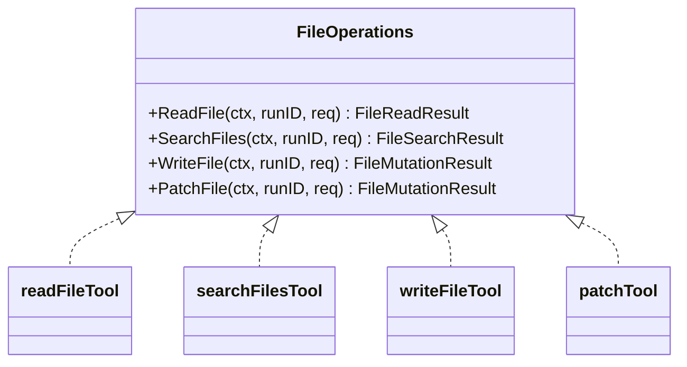
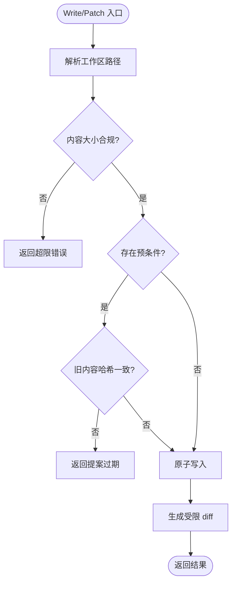
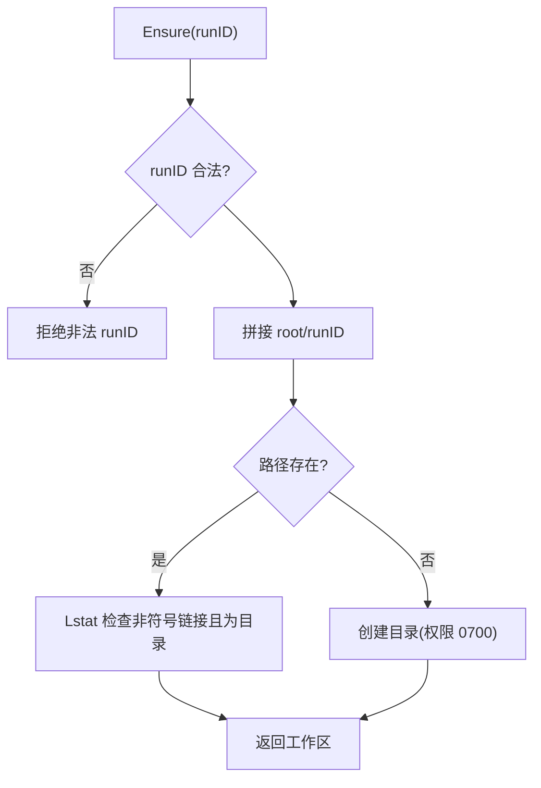
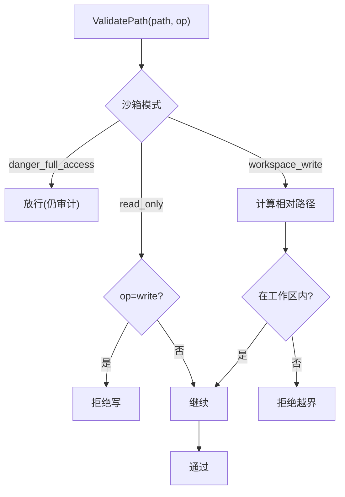
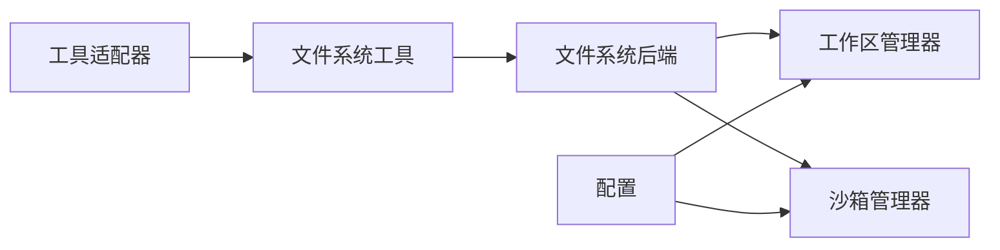

# 环境访问与工作区

<cite>
**本文引用的文件**
- [internal/runtime/tooladapter.go](file://internal/runtime/tooladapter.go)
- [internal/tools/filesystem.go](file://internal/tools/filesystem.go)
- [internal/runtime/filesystem_backend.go](file://internal/runtime/filesystem_backend.go)
- [internal/runtime/isolation.go](file://internal/runtime/isolation.go)
- [internal/runtime/sandbox_manager.go](file://internal/runtime/sandbox_manager.go)
- [internal/domain/sandbox.go](file://internal/domain/sandbox.go)
- [internal/tools/context.go](file://internal/tools/context.go)
- [internal/tools/security.go](file://internal/tools/security.go)
- [internal/config/config.go](file://internal/config/config.go)
</cite>

## 目录
1. [简介](#简介)
2. [项目结构](#项目结构)
3. [核心组件](#核心组件)
4. [架构总览](#架构总览)
5. [详细组件分析](#详细组件分析)
6. [依赖关系分析](#依赖关系分析)
7. [性能考量](#性能考量)
8. [故障排查指南](#故障排查指南)
9. [结论](#结论)
10. [附录：常见用法与最佳实践](#附录：常见用法与最佳实践)

## 简介
本文件面向工具执行环境与工作区管理，系统性说明 Vivy 运行时如何为工具提供受控的文件系统访问、路径校验与沙箱隔离、环境变量注入策略，以及审批与审计机制。文档覆盖从入口到落盘的全链路安全边界，并给出错误处理、资源清理、并发安全的最佳实践与常见模式示例的引用路径。

## 项目结构
围绕“环境访问与工作区”的关键代码分布在以下模块：
- 工具适配与调用链：将 Eino 工具规范与内部工具实现桥接，统一策略评估、参数校验、结果脱敏与压缩。
- 文件系统后端：实现统一的读/写/搜索/补丁能力，绑定工作区根目录与沙箱策略。
- 工作区隔离：按运行实例分配私有目录，严格限制路径与符号链接。
- 沙箱管理器：基于会话级策略对路径、命令、网络进行约束。
- 上下文与上下文键：在工具调用链中传递 RunID、SessionID、提案预条件等元数据。
- 配置与安全：加载配置、强制密钥不落地、默认工作区与权限策略。

**图表来源**
- [internal/runtime/tooladapter.go:78-183](file://internal/runtime/tooladapter.go#L78-L183)
- [internal/tools/filesystem.go:106-300](file://internal/tools/filesystem.go#L106-L300)
- [internal/runtime/filesystem_backend.go:61-352](file://internal/runtime/filesystem_backend.go#L61-L352)
- [internal/runtime/isolation.go:31-108](file://internal/runtime/isolation.go#L31-L108)
- [internal/runtime/sandbox_manager.go:38-147](file://internal/runtime/sandbox_manager.go#L38-L147)
- [internal/tools/context.go:14-73](file://internal/tools/context.go#L14-L73)
- [internal/tools/security.go:38-79](file://internal/tools/security.go#L38-L79)
- [internal/config/config.go:254-314](file://internal/config/config.go#L254-L314)

**章节来源**
- [internal/runtime/tooladapter.go:78-183](file://internal/runtime/tooladapter.go#L78-L183)
- [internal/tools/filesystem.go:106-300](file://internal/tools/filesystem.go#L106-L300)
- [internal/runtime/filesystem_backend.go:61-352](file://internal/runtime/filesystem_backend.go#L61-L352)
- [internal/runtime/isolation.go:31-108](file://internal/runtime/isolation.go#L31-L108)
- [internal/runtime/sandbox_manager.go:38-147](file://internal/runtime/sandbox_manager.go#L38-L147)
- [internal/tools/context.go:14-73](file://internal/tools/context.go#L14-L73)
- [internal/tools/security.go:38-79](file://internal/tools/security.go#L38-L79)
- [internal/config/config.go:254-314](file://internal/config/config.go#L254-L314)

## 核心组件
- 工具适配器（tooladapter）：负责参数校验、策略评估、交互中断、结果脱敏与压缩，确保模型侧不会收到不受控的工具输出。
- 文件系统工具（tools/filesystem）：定义 read_file、search_files、write_file、patch 的契约与入参解析，委托给后端实现。
- 文件系统后端（runtime/filesystem_backend）：实现 Eino 文件系统接口与内部 FileOperations 接口，统一路径解析、大小限制、二进制检测、原子写入与差异摘要。
- 工作区管理器（runtime/isolation）：为每个运行分配私有目录，拒绝符号链接与越界路径。
- 沙箱管理器（runtime/sandbox_manager）：按会话模式（只读/工作区写入/危险全开）校验路径、命令与网络访问。
- 上下文键（tools/context）：在调用链中携带 RunID、SessionID、提案预条件与过期报告器。
- 安全扫描（tools/security）：参数安全校验、提示注入信号检测、敏感信息脱敏。
- 配置（config）：默认工作区根、沙箱模式、审批策略、网络策略与密钥注入方式（仅 env_key）。

**章节来源**
- [internal/runtime/tooladapter.go:78-183](file://internal/runtime/tooladapter.go#L78-L183)
- [internal/tools/filesystem.go:20-89](file://internal/tools/filesystem.go#L20-L89)
- [internal/runtime/filesystem_backend.go:33-59](file://internal/runtime/filesystem_backend.go#L33-L59)
- [internal/runtime/isolation.go:14-27](file://internal/runtime/isolation.go#L14-L27)
- [internal/runtime/sandbox_manager.go:27-36](file://internal/runtime/sandbox_manager.go#L27-L36)
- [internal/tools/context.go:14-73](file://internal/tools/context.go#L14-L73)
- [internal/tools/security.go:12-79](file://internal/tools/security.go#L12-L79)
- [internal/config/config.go:110-153](file://internal/config/config.go#L110-L153)

## 架构总览
下图展示一次“读取工作区文件”的完整调用链，包括策略评估、沙箱校验、路径隔离与结果脱敏。

**图表来源**
- [internal/runtime/tooladapter.go:78-183](file://internal/runtime/tooladapter.go#L78-L183)
- [internal/tools/filesystem.go:119-149](file://internal/tools/filesystem.go#L119-L149)
- [internal/runtime/filesystem_backend.go:61-116](file://internal/runtime/filesystem_backend.go#L61-L116)
- [internal/runtime/isolation.go:43-74](file://internal/runtime/isolation.go#L43-L74)
- [internal/runtime/sandbox_manager.go:85-147](file://internal/runtime/sandbox_manager.go#L85-L147)

## 详细组件分析

### 工具适配器：策略、审批与结果治理
- 职责：参数合法性校验、策略评估、交互中断（提问/审批）、钩子重写后二次评估、结果脱敏与长度压缩。
- 关键点：
  - 计划模式下拒绝效果型工具。
  - 支持 resume 上下文恢复用户回答或审批决策。
  - 结果头部添加不可信标记，并对敏感信息进行脱敏。
  - 通过 UTF-8 安全截断控制进入模型上下文的体积。

**图表来源**
- [internal/runtime/tooladapter.go:78-183](file://internal/runtime/tooladapter.go#L78-L183)

**章节来源**
- [internal/runtime/tooladapter.go:78-183](file://internal/runtime/tooladapter.go#L78-L183)

### 文件系统工具：读/写/搜索/补丁契约
- 读：支持行范围、最大字节、二进制识别与截断。
- 搜索：限定匹配数量与总字节数，忽略大文件或二进制，跳过忽略目录。
- 写：自动创建父目录、原子写入、变更摘要、提案预条件校验。
- 补丁：精确替换，支持全部替换；目标必须为文本且非二进制。

**图表来源**
- [internal/tools/filesystem.go:82-104](file://internal/tools/filesystem.go#L82-L104)
- [internal/tools/filesystem.go:106-300](file://internal/tools/filesystem.go#L106-L300)

**章节来源**
- [internal/tools/filesystem.go:20-89](file://internal/tools/filesystem.go#L20-L89)
- [internal/tools/filesystem.go:106-300](file://internal/tools/filesystem.go#L106-L300)

### 文件系统后端：路径安全、限制与原子性
- 路径安全：
  - 仅接受工作区相对路径，拒绝绝对路径、UNC、NUL、符号链接。
  - 逐步 Lstat 检查每一段是否为目录，防止中间段被替换为文件。
  - 保护路径黑名单（如 .env、keys.txt、.ssh 等）。
- 限制：
  - 文件大小上限、搜索结果条数与总字节上限、diff 长度上限。
  - 二进制文件直接跳过或省略内容。
- 原子写入：
  - 临时文件写入+同步+重命名，失败时清理。
- 提案预条件：
  - 写/补丁前计算旧内容哈希，resume 时若不一致则拒绝，避免“提案过期”。

**图表来源**
- [internal/runtime/filesystem_backend.go:192-240](file://internal/runtime/filesystem_backend.go#L192-L240)
- [internal/runtime/filesystem_backend.go:242-283](file://internal/runtime/filesystem_backend.go#L242-L283)
- [internal/runtime/filesystem_backend.go:520-562](file://internal/runtime/filesystem_backend.go#L520-L562)
- [internal/runtime/filesystem_backend.go:574-606](file://internal/runtime/filesystem_backend.go#L574-L606)

**章节来源**
- [internal/runtime/filesystem_backend.go:61-116](file://internal/runtime/filesystem_backend.go#L61-L116)
- [internal/runtime/filesystem_backend.go:118-190](file://internal/runtime/filesystem_backend.go#L118-L190)
- [internal/runtime/filesystem_backend.go:192-283](file://internal/runtime/filesystem_backend.go#L192-L283)
- [internal/runtime/filesystem_backend.go:520-562](file://internal/runtime/filesystem_backend.go#L520-L562)
- [internal/runtime/filesystem_backend.go:574-606](file://internal/runtime/filesystem_backend.go#L574-L606)

### 工作区隔离：每运行一个私有目录
- 工作区根由配置指定，运行时规范化为绝对路径。
- 每个运行 ID 对应一个子目录，名称白名单限制字符集，拒绝包含 .. 的名称。
- 创建目录时设置严格权限，拒绝符号链接，确保目录存在且为目录。
- 提供 ValidatePath 供未来工具在打开用户可控路径前再次校验。

**图表来源**
- [internal/runtime/isolation.go:31-74](file://internal/runtime/isolation.go#L31-L74)
- [internal/runtime/isolation.go:97-108](file://internal/runtime/isolation.go#L97-L108)

**章节来源**
- [internal/runtime/isolation.go:14-27](file://internal/runtime/isolation.go#L14-L27)
- [internal/runtime/isolation.go:31-74](file://internal/runtime/isolation.go#L31-L74)
- [internal/runtime/isolation.go:76-108](file://internal/runtime/isolation.go#L76-L108)

### 沙箱管理器：会话级权限边界
- 三种模式：
  - 只读：禁止写与命令执行。
  - 工作区写入：路径必须在沙箱工作区内，命令需白名单。
  - 危险全开：绕过限制但仍会拦截明显危险命令。
- 路径校验：解析真实路径，阻止穿越与符号链接逃逸。
- 命令校验：白名单+危险模式兜底。
- 网络校验：仅 HTTP(S)，可选私有 IP 屏蔽与域名白名单。

**图表来源**
- [internal/runtime/sandbox_manager.go:85-147](file://internal/runtime/sandbox_manager.go#L85-L147)

**章节来源**
- [internal/runtime/sandbox_manager.go:27-36](file://internal/runtime/sandbox_manager.go#L27-L36)
- [internal/runtime/sandbox_manager.go:85-147](file://internal/runtime/sandbox_manager.go#L85-L147)
- [internal/runtime/sandbox_manager.go:149-183](file://internal/runtime/sandbox_manager.go#L149-L183)
- [internal/runtime/sandbox_manager.go:185-234](file://internal/runtime/sandbox_manager.go#L185-L234)

### 上下文与上下文键：跨层传递运行元数据
- RunID：绑定工作区与持久化标识，工具仅消费，不持有权威源。
- SessionID：用于后端状态隔离。
- Proposal 预条件：在 resume 时校验目标未变更，避免“提案过期”。
- 提案过期报告器：允许后端在不引入运行时包的情况下上报过期原因。

**章节来源**
- [internal/tools/context.go:14-73](file://internal/tools/context.go#L14-L73)

### 安全扫描与脱敏：参数与输出的双重防护
- 参数安全：
  - 针对 path/filepath/file_path/command/cmd 字段进行 NUL、路径穿越、UNC 与命令注入关键字检查。
- 输出脱敏：
  - 移除常见密钥与邮箱形式，避免泄露至模型上下文或事件负载。

**章节来源**
- [internal/tools/security.go:38-79](file://internal/tools/security.go#L38-L79)

### 配置与环境变量注入：密钥不落地
- 配置项：
  - 默认工作区根、技能根、HTTP 主机白名单、命令白名单、沙箱模式与审批策略、网络策略。
- 密钥注入：
  - Provider 凭据仅以 env_key 形式引用，启动时不读取实际值，请求时再解析环境变量。
  - 存储 DSN 同样通过环境变量名引用，禁止出现在配置文件中。
- 验证：
  - 未知字段硬错误；必填项校验；时间/数值范围校验；路径不允许穿越。

**章节来源**
- [internal/config/config.go:102-108](file://internal/config/config.go#L102-L108)
- [internal/config/config.go:254-314](file://internal/config/config.go#L254-L314)
- [internal/config/config.go:338-528](file://internal/config/config.go#L338-L528)

## 依赖关系分析
- 工具适配器依赖工具实现与策略引擎，并将运行上下文（RunID、SessionID）注入工具调用链。
- 文件系统工具依赖 FileOperations 接口，由运行时后端实现。
- 文件系统后端依赖工作区管理器与沙箱管理器，保证路径与权限边界。
- 沙箱管理器依赖域模型中的沙箱模式与网络策略。
- 配置驱动工作区根、沙箱模式、审批策略与网络策略。

**图表来源**
- [internal/runtime/tooladapter.go:78-183](file://internal/runtime/tooladapter.go#L78-L183)
- [internal/tools/filesystem.go:106-300](file://internal/tools/filesystem.go#L106-L300)
- [internal/runtime/filesystem_backend.go:33-59](file://internal/runtime/filesystem_backend.go#L33-L59)
- [internal/runtime/isolation.go:31-74](file://internal/runtime/isolation.go#L31-L74)
- [internal/runtime/sandbox_manager.go:38-73](file://internal/runtime/sandbox_manager.go#L38-L73)
- [internal/config/config.go:254-314](file://internal/config/config.go#L254-L314)

**章节来源**
- [internal/runtime/tooladapter.go:78-183](file://internal/runtime/tooladapter.go#L78-L183)
- [internal/tools/filesystem.go:106-300](file://internal/tools/filesystem.go#L106-L300)
- [internal/runtime/filesystem_backend.go:33-59](file://internal/runtime/filesystem_backend.go#L33-L59)
- [internal/runtime/isolation.go:31-74](file://internal/runtime/isolation.go#L31-L74)
- [internal/runtime/sandbox_manager.go:38-73](file://internal/runtime/sandbox_manager.go#L38-L73)
- [internal/config/config.go:254-314](file://internal/config/config.go#L254-L314)

## 性能考量
- 结果压缩：工具结果在进入模型上下文前进行头部/尾部保留与中间折叠，避免超大输出影响吞吐。
- 搜索限制：限制匹配条数与总字节数，跳过二进制与大文件，减少 IO 与 CPU。
- 原子写入：临时文件+同步+重命名，降低并发写入时的损坏风险。
- UTF-8 安全截断：避免截断多字节字符导致乱码。
- 建议：
  - 合理设置 MaxBytes、MaxResults、MaxToolResultBytes。
  - 使用行范围读取减少不必要的数据传输。
  - 对高频搜索场景考虑缓存热点目录结构（注意失效策略）。

[本节为通用指导，无需特定文件来源]

## 故障排查指南
- 路径相关错误：
  - “路径逃逸工作区”“无效路径”“路径不存在”“符号链接被拒绝”：检查传入路径是否相对、是否存在、是否包含 .. 或 UNC。
  - 参考路径校验与保护路径逻辑。
- 权限相关错误：
  - “只读模式拒绝写”“命令不在白名单”“访问私有 IP 被拒绝”：确认沙箱模式与策略配置。
- 参数安全错误：
  - “包含 NUL 字节”“路径穿越或 UNC 不被允许”“包含阻塞的命令语法”：修正输入或调整策略。
- 提案过期：
  - “目标在人类审查期间已变更”：重新发起操作或在 resume 时更新预条件。
- 结果过大：
  - 启用结果压缩或缩小查询范围。

**章节来源**
- [internal/runtime/filesystem_backend.go:520-562](file://internal/runtime/filesystem_backend.go#L520-L562)
- [internal/runtime/sandbox_manager.go:85-147](file://internal/runtime/sandbox_manager.go#L85-L147)
- [internal/tools/security.go:38-79](file://internal/tools/security.go#L38-L79)
- [internal/runtime/filesystem_backend.go:192-240](file://internal/runtime/filesystem_backend.go#L192-L240)

## 结论
Vivy 的环境访问与工作区管理通过“工具适配器—文件系统后端—工作区管理器—沙箱管理器”的分层设计，实现了严格的资源隔离、路径校验、权限控制与输出治理。配合配置驱动的默认策略与密钥环境变量注入，既保证了安全性，又提供了灵活的扩展点。遵循本文的最佳实践可显著降低路径遍历、资源泄露与意外破坏的风险。

[本节为总结，无需特定文件来源]

## 附录：常见用法与最佳实践

### 配置文件读取（只读）
- 使用 read_file 工具，指定工作区相对路径与行范围，限制最大字节。
- 后端会自动检测二进制并返回标志位，避免误处理。
- 参考路径：
  - [internal/tools/filesystem.go:106-149](file://internal/tools/filesystem.go#L106-L149)
  - [internal/runtime/filesystem_backend.go:61-116](file://internal/runtime/filesystem_backend.go#L61-L116)

### 日志记录（受限写入）
- 使用 write_file 或 patch 工具在工作区内写入日志文件。
- 利用原子写入与受限 diff，确保并发安全与可审计。
- 参考路径：
  - [internal/tools/filesystem.go:202-243](file://internal/tools/filesystem.go#L202-L243)
  - [internal/runtime/filesystem_backend.go:192-240](file://internal/runtime/filesystem_backend.go#L192-L240)
  - [internal/runtime/filesystem_backend.go:574-606](file://internal/runtime/filesystem_backend.go#L574-L606)

### 临时文件处理
- 在后端内部通过临时文件写入后再重命名，避免部分写入导致的脏数据。
- 参考路径：
  - [internal/runtime/filesystem_backend.go:574-606](file://internal/runtime/filesystem_backend.go#L574-L606)

### 环境变量注入与敏感数据访问
- 通过配置中的 env_key 引用环境变量名，运行时按需读取，避免配置中明文存放密钥。
- 参考路径：
  - [internal/config/config.go:102-108](file://internal/config/config.go#L102-L108)
  - [internal/config/config.go:254-314](file://internal/config/config.go#L254-L314)

### 错误处理与资源清理
- 所有文件操作均返回明确错误类型，便于上层区分“路径非法”“权限拒绝”“提案过期”等。
- 临时文件在失败时会被清理，避免残留。
- 参考路径：
  - [internal/runtime/filesystem_backend.go:574-606](file://internal/runtime/filesystem_backend.go#L574-L606)
  - [internal/runtime/tooladapter.go:165-183](file://internal/runtime/tooladapter.go#L165-L183)

### 并发安全
- 原子写入保证并发下的完整性。
- 工作区目录权限严格，避免其他进程干扰。
- 参考路径：
  - [internal/runtime/filesystem_backend.go:574-606](file://internal/runtime/filesystem_backend.go#L574-L606)
  - [internal/runtime/isolation.go:61-73](file://internal/runtime/isolation.go#L61-L73)