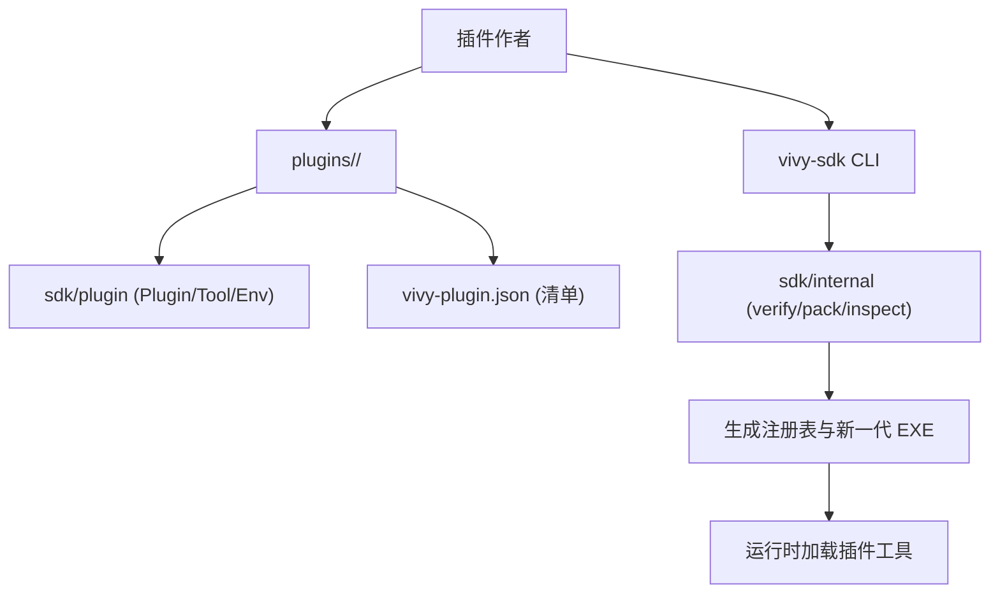
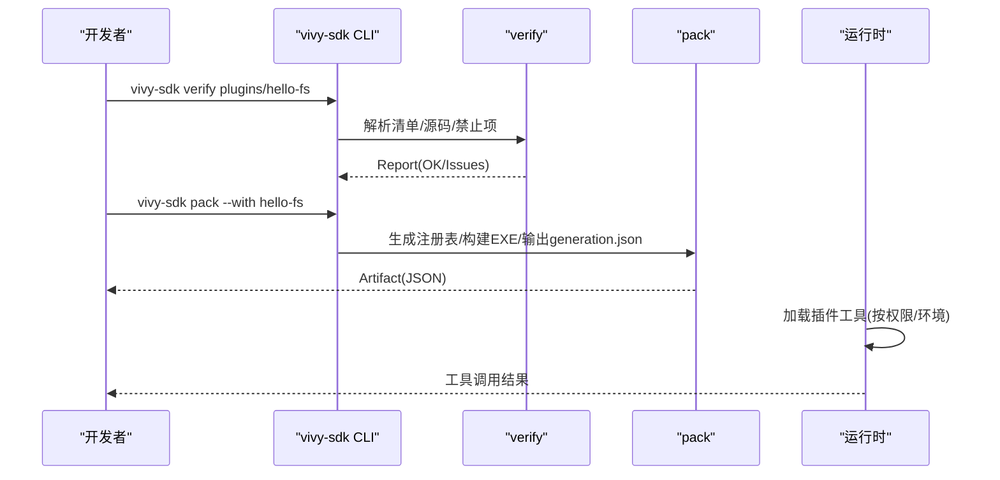
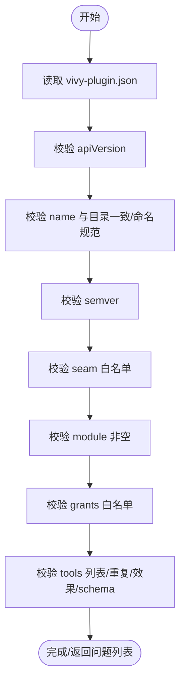
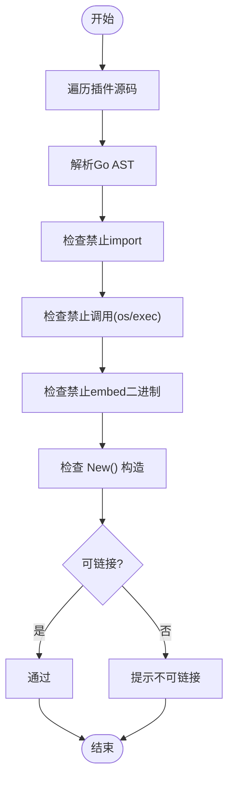
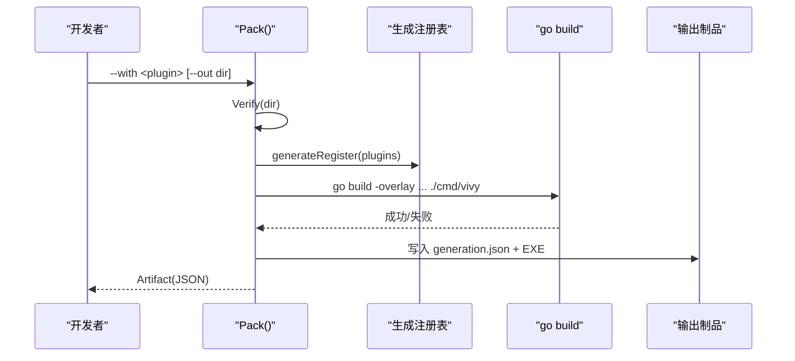
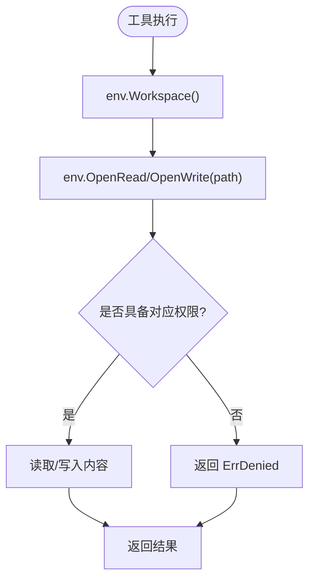
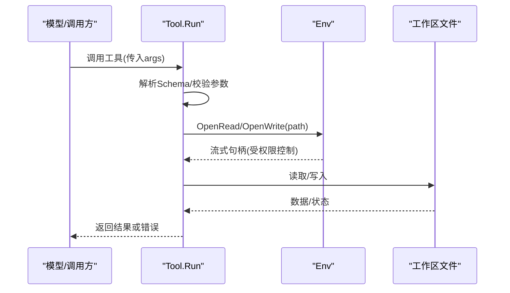
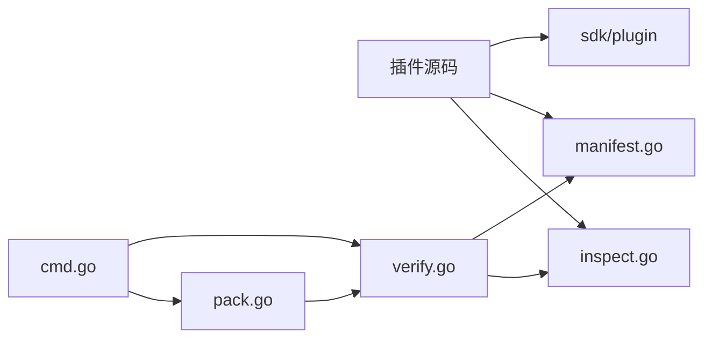
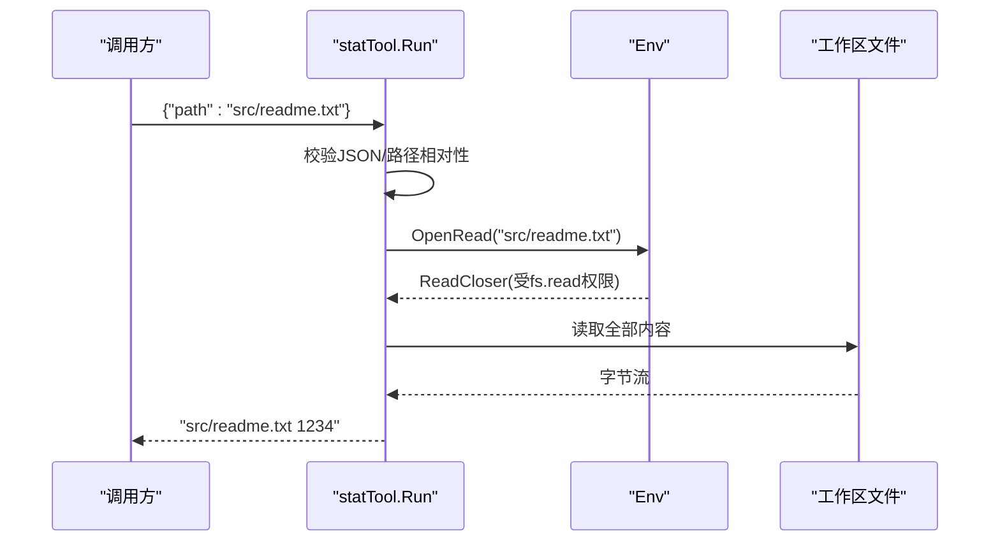

# 插件开发SDK

<cite>
**本文引用的文件**
- [sdk/main.go](file://sdk/main.go)
- [sdk/plugin/plugin.go](file://sdk/plugin/plugin.go)
- [plugins/hello-fs/plugin.go](file://plugins/hello-fs/plugin.go)
- [plugins/hello-fs/vivy-plugin.json](file://plugins/hello-fs/vivy-plugin.json)
- [sdk/internal/cmd.go](file://sdk/internal/cmd.go)
- [sdk/internal/manifest.go](file://sdk/internal/manifest.go)
- [sdk/internal/verify.go](file://sdk/internal/verify.go)
- [sdk/internal/pack.go](file://sdk/internal/pack.go)
- [sdk/internal/inspect.go](file://sdk/internal/inspect.go)
- [internal/tools/filesystem.go](file://internal/tools/filesystem.go)
- [internal/tools/http_request.go](file://internal/tools/http_request.go)
- [docs/architecture/VIVY-PLUGIN-SPEC.md](file://docs/architecture/VIVY-PLUGIN-SPEC.md)
</cite>

## 目录
1. [简介](#简介)
2. [项目结构](#项目结构)
3. [核心组件](#核心组件)
4. [架构总览](#架构总览)
5. [详细组件分析](#详细组件分析)
6. [依赖关系分析](#依赖关系分析)
7. [性能与安全性考量](#性能与安全性考量)
8. [故障排查指南](#故障排查指南)
9. [结论](#结论)
10. [附录：完整工具开发示例](#附录：完整工具开发示例)

## 简介
本指南面向希望基于 Vivy SDK 开发“插件”的开发者。Vivy 插件以纯 Go 代码形式提供能力，通过最小、受控的接口暴露给运行时，并由 SDK 在打包阶段生成注册表并编译进新一代可执行产物。插件作者仅能访问 `sdk/plugin` 提供的有限窗口（如文件系统读取/写入、工作区路径等），并通过清单 `vivy-plugin.json` 声明插件身份、权限与工具契约。

本仓库强调“插件即治理单元”，不鼓励直接修改内核或引入 Eino 类型到非允许包中；所有插件必须经过 `vivy-sdk verify` 与 `pack` 流程，才能成为一代产物的一部分。

**章节来源**
- [docs/architecture/VIVY-PLUGIN-SPEC.md:13-26](file://docs/architecture/VIVY-PLUGIN-SPEC.md#L13-L26)
- [docs/architecture/VIVY-PLUGIN-SPEC.md:141-154](file://docs/architecture/VIVY-PLUGIN-SPEC.md#L141-L154)

## 项目结构
- 插件入口与对外接口定义位于 `sdk/plugin`，是插件作者唯一允许的导入窗口。
- 示例插件位于 `plugins/hello-fs`，演示了如何声明清单、实现 Plugin/Tool 以及安全访问工作区文件。
- SDK 命令行与内部逻辑位于 `sdk/internal`，提供验证、清单校验、源码静态检查、打包与制品检查等功能。
- 内置工具（非插件）位于 `internal/tools`，展示了文件系统与网络请求等常见能力的实现范式，可作为插件参考。



**图示来源**
- [sdk/main.go:1-14](file://sdk/main.go#L1-L14)
- [sdk/internal/cmd.go:10-79](file://sdk/internal/cmd.go#L10-L79)
- [sdk/internal/pack.go:67-199](file://sdk/internal/pack.go#L67-L199)
- [plugins/hello-fs/vivy-plugin.json:1-21](file://plugins/hello-fs/vivy-plugin.json#L1-L21)

**章节来源**
- [sdk/main.go:1-14](file://sdk/main.go#L1-L14)
- [sdk/internal/cmd.go:10-79](file://sdk/internal/cmd.go#L10-L79)
- [plugins/hello-fs/vivy-plugin.json:1-21](file://plugins/hello-fs/vivy-plugin.json#L1-L21)

## 核心组件
本节聚焦 SDK 暴露给插件作者的接口与类型，包括插件、工具、权限与环境。

- 插件接口 `Plugin`：描述插件名称、seam、权限集合与工具列表。
- 工具接口 `Tool`：描述工具名称、效果（读/写）、参数 Schema 与执行函数。
- 权限枚举 `Grant`：当前支持 `fs.read`、`fs.write`，用于限制插件对环境的访问能力。
- 环境接口 `Env`：插件唯一可访问的世界，包含工作区路径与受限的文件读写能力。
- 错误类型：`ErrDenied`（权限不足）、`ErrInvalidArgs`（参数无效）。

```mermaid
classDiagram
class Plugin {
+Name() string
+Seam() Seam
+Grants() []Grant
+Tools() []Tool
}
class Tool {
+Name() string
+Effect() Effect
+Schema() json.RawMessage
+Run(ctx, env, args) (string, error)
}
class Env {
+Workspace() string
+OpenRead(path) ReadCloser
+OpenWrite(path) WriteCloser
}
class Grant {
<<enum>>
"fs.read"
"fs.write"
}
class Effect {
<<enum>>
"read"
"write"
}
Plugin --> Tool : "拥有"
Tool --> Env : "运行期使用"
Plugin --> Grant : "声明权限"
Tool --> Effect : "声明效果"
```

**图示来源**
- [sdk/plugin/plugin.go:61-87](file://sdk/plugin/plugin.go#L61-L87)

**章节来源**
- [sdk/plugin/plugin.go:12-87](file://sdk/plugin/plugin.go#L12-L87)

## 架构总览
插件开发遵循“声明—验证—打包—运行”的流水线：
- 声明：在 `plugins/<name>` 下编写 Go 代码并维护 `vivy-plugin.json`。
- 验证：`vivy-sdk verify` 进行清单校验、源码静态检查与链接性测试。
- 打包：`vivy-sdk pack --with <plugin>` 生成注册表并构建新一代 EXE，输出制品信息。
- 运行：运行时加载插件工具，按权限与环境约束执行。



**图示来源**
- [sdk/internal/cmd.go:10-79](file://sdk/internal/cmd.go#L10-L79)
- [sdk/internal/verify.go:19-70](file://sdk/internal/verify.go#L19-L70)
- [sdk/internal/pack.go:67-199](file://sdk/internal/pack.go#L67-L199)

**章节来源**
- [sdk/internal/cmd.go:10-79](file://sdk/internal/cmd.go#L10-L79)
- [sdk/internal/verify.go:19-70](file://sdk/internal/verify.go#L19-L70)
- [sdk/internal/pack.go:67-199](file://sdk/internal/pack.go#L67-L199)

## 详细组件分析

### 清单与元数据（vivy-plugin.json）
- 字段包括 `apiVersion`、`name`、`version`、`seam`、`module`、`grants`、`tools`。
- 校验规则：版本格式、seam 白名单、模块必填、至少一个工具、工具名全局唯一、effect 合法、schema 为对象。
- 清单是“配方卡”，不是运行时装载器配置；pack 后冻结权限与工具集。



**图示来源**
- [sdk/internal/manifest.go:38-105](file://sdk/internal/manifest.go#L38-L105)

**章节来源**
- [sdk/internal/manifest.go:14-105](file://sdk/internal/manifest.go#L14-L105)
- [plugins/hello-fs/vivy-plugin.json:1-21](file://plugins/hello-fs/vivy-plugin.json#L1-L21)

### 源码静态检查与安全扫描
- 禁止 import `agent-vivy/internal/...`（除 sdk 外）与 `github.com/cloudwego/eino...`。
- 禁止绕过 `Env` 的直接系统调用（如 `os.Open`、`exec.Command`）。
- 禁止嵌入二进制文件（`.exe/.dll/.so/.wasm/.dylib`）。
- 要求存在 `New() plugin.Plugin` 构造函数。
- 若可用，执行 `go list .` 证明包可链接。



**图示来源**
- [sdk/internal/inspect.go:19-184](file://sdk/internal/inspect.go#L19-L184)
- [sdk/internal/verify.go:50-70](file://sdk/internal/verify.go#L50-L70)

**章节来源**
- [sdk/internal/inspect.go:19-184](file://sdk/internal/inspect.go#L19-L184)
- [sdk/internal/verify.go:19-70](file://sdk/internal/verify.go#L19-L70)

### 打包流程与制品
- `pack` 会：
  - 解析并验证插件清单与源码。
  - 生成注册表文件（注入到 `internal/generated/plugins/zz_register.go`）。
  - 使用 `-overlay` 将注册表覆盖到主程序构建过程。
  - 构建新一代 EXE，计算 SHA256，输出 `generation.json` 制品信息。
- 制品包含 ID、SHA256、源引用、装配配方（loop/world/plugins）、阶段与工具清单。



**图示来源**
- [sdk/internal/pack.go:67-199](file://sdk/internal/pack.go#L67-L199)
- [sdk/internal/pack.go:267-279](file://sdk/internal/pack.go#L267-L279)

**章节来源**
- [sdk/internal/pack.go:67-199](file://sdk/internal/pack.go#L67-L199)
- [sdk/internal/pack.go:267-279](file://sdk/internal/pack.go#L267-L279)

### 环境变量与工作区访问
- 插件通过 `Env.Workspace()` 获取工作区根路径。
- 文件访问必须通过 `Env.OpenRead/OpenWrite`，且受 `Grants` 控制：缺少权限时关闭失败。
- 示例插件 `hello-fs` 展示了只读访问工作区内文件的典型模式，并对路径做相对性与防穿越校验。



**图示来源**
- [sdk/plugin/plugin.go:77-87](file://sdk/plugin/plugin.go#L77-L87)
- [plugins/hello-fs/plugin.go:39-64](file://plugins/hello-fs/plugin.go#L39-L64)

**章节来源**
- [sdk/plugin/plugin.go:77-87](file://sdk/plugin/plugin.go#L77-L87)
- [plugins/hello-fs/plugin.go:17-64](file://plugins/hello-fs/plugin.go#L17-L64)

### 工具开发流程（从定义到执行）
- 定义工具：实现 `Tool` 接口的 `Name`、`Effect`、`Schema`、`Run`。
- 设计参数 Schema：使用 JSON Schema 描述输入参数（对象、属性、必需字段）。
- 实现执行逻辑：在 `Run` 中解析参数、调用 `Env` 访问资源、返回字符串结果或错误。
- 声明权限：在插件 `Grants()` 中申请所需权限（如 `fs.read`/`fs.write`）。
- 清单登记：在 `vivy-plugin.json` 的 `tools` 数组中登记工具元数据。



**图示来源**
- [sdk/plugin/plugin.go:69-87](file://sdk/plugin/plugin.go#L69-L87)
- [plugins/hello-fs/plugin.go:29-56](file://plugins/hello-fs/plugin.go#L29-L56)

**章节来源**
- [sdk/plugin/plugin.go:69-87](file://sdk/plugin/plugin.go#L69-L87)
- [plugins/hello-fs/plugin.go:17-64](file://plugins/hello-fs/plugin.go#L17-L64)

### 内置工具参考（文件系统与网络请求）
- 文件系统工具：提供读取、搜索、写入、补丁等操作，封装了参数解析、预览提案与结果序列化。
- 网络请求工具：提供受限的 HTTP 请求能力（方法、URL、头部），返回响应体与元信息。

这些工具虽非插件，但可作为插件实现的参考范式，帮助理解参数校验、错误处理与结果序列化。

**章节来源**
- [internal/tools/filesystem.go:13-340](file://internal/tools/filesystem.go#L13-L340)
- [internal/tools/http_request.go:12-72](file://internal/tools/http_request.go#L12-L72)

## 依赖关系分析
- 插件仅依赖 `sdk/plugin`，不得直接依赖 `internal/*` 或 `eino`。
- SDK 内部依赖：
  - `manifest.go`：清单结构与校验。
  - `inspect.go`：源码静态检查与禁止项检测。
  - `verify.go`：组合清单校验、源码检查与链接性测试。
  - `pack.go`：注册表生成、构建与制品输出。
  - `cmd.go`：CLI 命令路由。



**图示来源**
- [sdk/internal/manifest.go:1-105](file://sdk/internal/manifest.go#L1-L105)
- [sdk/internal/inspect.go:1-184](file://sdk/internal/inspect.go#L1-L184)
- [sdk/internal/verify.go:1-70](file://sdk/internal/verify.go#L1-L70)
- [sdk/internal/pack.go:1-317](file://sdk/internal/pack.go#L1-L317)
- [sdk/internal/cmd.go:1-79](file://sdk/internal/cmd.go#L1-L79)

**章节来源**
- [sdk/internal/manifest.go:1-105](file://sdk/internal/manifest.go#L1-L105)
- [sdk/internal/inspect.go:1-184](file://sdk/internal/inspect.go#L1-L184)
- [sdk/internal/verify.go:1-70](file://sdk/internal/verify.go#L1-L70)
- [sdk/internal/pack.go:1-317](file://sdk/internal/pack.go#L1-L317)
- [sdk/internal/cmd.go:1-79](file://sdk/internal/cmd.go#L1-L79)

## 性能与安全性考量
- 性能
  - 插件执行路径短小，避免阻塞操作；大文件读取建议使用流式接口并设置合理上限。
  - 打包阶段生成注册表与构建 EXE 可能耗时，建议在 CI 中缓存依赖与构建产物。
- 安全性
  - 严格遵循权限模型：未声明 `fs.write` 则无法写入；缺失权限时关闭失败。
  - 禁止绕过 `Env` 的系统调用与进程执行；禁止嵌入二进制。
  - 清单中的 `grants` 在 pack 后冻结，防止运行时提权。
  - 密钥不持久化，日志与事件负载需脱敏。

[本节为通用指导，不直接分析具体文件]

## 故障排查指南
- 常见问题
  - 清单字段错误：apiVersion、name、version、seam、grants、tools 不符合规范。
  - 源码禁止项：import 了 internal 或 eino；调用了 os/exec 的敏感函数；嵌入了二进制。
  - 缺少构造函数：未实现 `New() plugin.Plugin`。
  - 链接失败：插件包不可链接（依赖缺失或语法错误）。
- 诊断步骤
  - 使用 `vivy-sdk verify <plugin-dir>` 查看具体问题列表。
  - 使用 `vivy-sdk inspect-artifact <dir>` 检查制品信息与哈希。
  - 逐步缩小范围：先修复清单，再修复源码，最后验证链接。

**章节来源**
- [sdk/internal/cmd.go:10-79](file://sdk/internal/cmd.go#L10-L79)
- [sdk/internal/verify.go:19-70](file://sdk/internal/verify.go#L19-L70)
- [sdk/internal/inspect.go:19-184](file://sdk/internal/inspect.go#L19-L184)
- [sdk/internal/pack.go:201-214](file://sdk/internal/pack.go#L201-L214)

## 结论
Vivy 插件体系通过最小接口、严格校验与可追溯的打包流程，确保插件能力可控、可审计、可演进。开发者应专注于 `plugins/<name>` 下的纯 Go 实现与清单声明，借助 `vivy-sdk` 完成验证与打包，并在运行时享受权限与环境隔离带来的安全保障。

[本节为总结，不直接分析具体文件]

## 附录：完整工具开发示例
以下示例展示如何从零实现一个“统计工作区文件大小”的工具，涵盖清单、插件实现、参数 Schema、权限与安全路径校验。

- 清单 `vivy-plugin.json`
  - 声明插件名、版本、seam、grants 与工具元数据（含 schema）。
- 插件实现 `plugin.go`
  - 实现 `Plugin` 与 `Tool` 接口。
  - 在 `Run` 中解析参数、校验路径、通过 `Env.OpenRead` 读取文件并返回结果。
  - 使用相对路径校验防止穿越攻击。



**图示来源**
- [plugins/hello-fs/vivy-plugin.json:1-21](file://plugins/hello-fs/vivy-plugin.json#L1-L21)
- [plugins/hello-fs/plugin.go:17-64](file://plugins/hello-fs/plugin.go#L17-L64)

**章节来源**
- [plugins/hello-fs/vivy-plugin.json:1-21](file://plugins/hello-fs/vivy-plugin.json#L1-L21)
- [plugins/hello-fs/plugin.go:17-64](file://plugins/hello-fs/plugin.go#L17-L64)