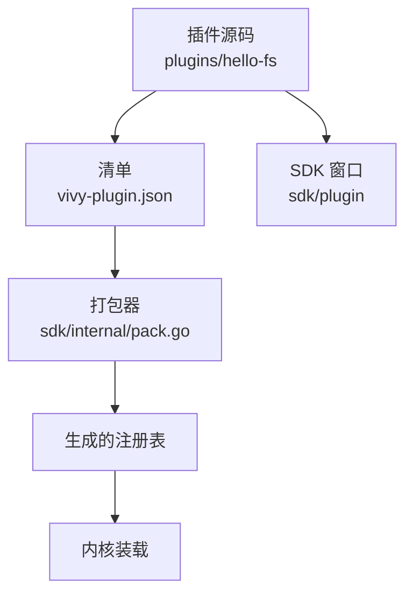
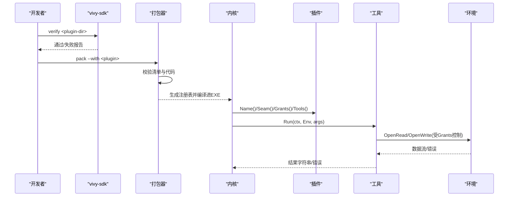
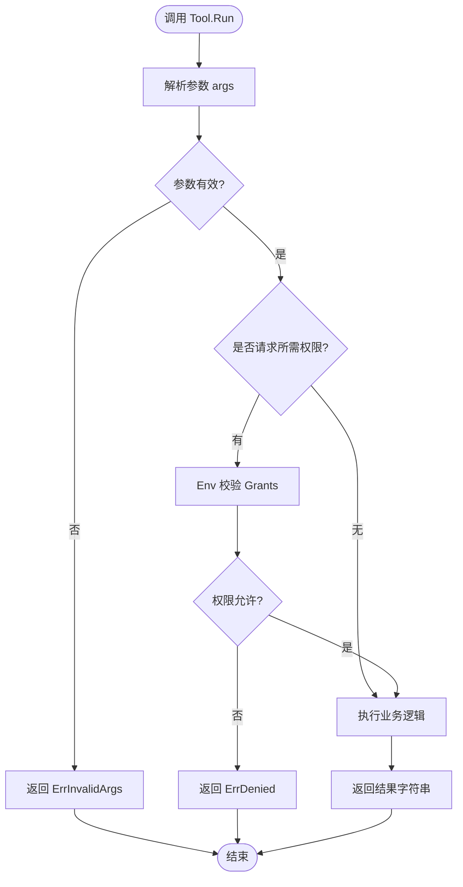
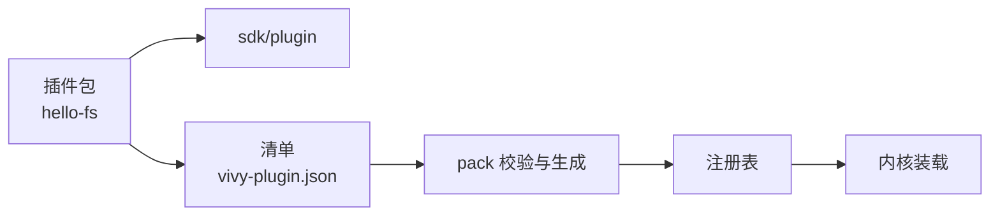

# 插件接口定义

<cite>
**本文引用的文件**
- [sdk/plugin/plugin.go](file://sdk/plugin/plugin.go)
- [plugins/hello-fs/plugin.go](file://plugins/hello-fs/plugin.go)
- [plugins/hello-fs/vivy-plugin.json](file://plugins/hello-fs/vivy-plugin.json)
- [plugins/hello-fs/README.md](file://plugins/hello-fs/README.md)
- [docs/architecture/VIVY-PLUGIN-SPEC.md](file://docs/architecture/VIVY-PLUGIN-SPEC.md)
- [sdk/internal/pack.go](file://sdk/internal/pack.go)
- [sdk/internal/cmd.go](file://sdk/internal/cmd.go)
</cite>

## 目录
1. [简介](#简介)
2. [项目结构](#项目结构)
3. [核心组件](#核心组件)
4. [架构总览](#架构总览)
5. [详细组件分析](#详细组件分析)
6. [依赖关系分析](#依赖关系分析)
7. [性能与安全考量](#性能与安全考量)
8. [故障排查指南](#故障排查指南)
9. [结论](#结论)
10. [附录：完整实现示例与清单](#附录完整实现示例与清单)

## 简介
本文件面向插件作者，系统化说明 Vivy 插件的接口契约与实现要求。重点覆盖：
- Plugin 接口的四个方法：Name、Seam、Grants、Tools
- Tool 接口的四项要求：Name、Effect、Schema、Run
- Env 环境接口的安全访问机制：Workspace、OpenRead、OpenWrite
- Grant 权限枚举（fs.read、fs.write）与 Effect 效果枚举（read、write）的使用场景
- 通过 hello-fs 示例展示如何正确实现以满足 Vivy 运行时要求

## 项目结构
Vivy 插件位于仓库根下的 plugins/<name>/ 目录，每个插件是一个独立的 Go 包，并通过 SDK 提供的最小窗口 sdk/plugin 暴露能力。清单 vivy-plugin.json 描述插件身份、seam、grants 与工具列表；pack 流程会校验并生成注册表，最终被内核装载。

图表来源
- [plugins/hello-fs/plugin.go:17-27](file://plugins/hello-fs/plugin.go#L17-L27)
- [plugins/hello-fs/vivy-plugin.json:1-21](file://plugins/hello-fs/vivy-plugin.json#L1-L21)
- [sdk/internal/pack.go:67-119](file://sdk/internal/pack.go#L67-L119)

章节来源
- [docs/architecture/VIVY-PLUGIN-SPEC.md:29-83](file://docs/architecture/VIVY-PLUGIN-SPEC.md#L29-L83)
- [sdk/internal/cmd.go:10-68](file://sdk/internal/cmd.go#L10-L68)

## 核心组件
本节聚焦三个核心接口与两类枚举：Plugin、Tool、Env，以及 Grant、Effect。

- Plugin
  - Name() string：插件名称，需与清单 name 一致且全局唯一
  - Seam() Seam：插件类型，限定为 tool、tool-world、provider
  - Grants() []Grant：声明该插件可使用的权限上限（如 fs.read、fs.write）
  - Tools() []Tool：对外暴露的工具集合

- Tool
  - Name() string：工具名，需全局唯一
  - Effect() Effect：操作效果，read 或 write
  - Schema() json.RawMessage：参数 JSON Schema 定义
  - Run(ctx, env, args) (string, error)：执行逻辑，仅能通过 Env 访问工作区

- Env
  - Workspace() string：返回当前运行工作区路径
  - OpenRead(path) (io.ReadCloser, error)：读取文件，受 Grants 控制
  - OpenWrite(path) (io.WriteCloser, error)：写入文件，需要 fs.write 权限

- 枚举
  - Seam：tool、tool-world、provider
  - Grant：fs.read、fs.write
  - Effect：read、write

章节来源
- [sdk/plugin/plugin.go:12-87](file://sdk/plugin/plugin.go#L12-L87)
- [docs/architecture/VIVY-PLUGIN-SPEC.md:86-123](file://docs/architecture/VIVY-PLUGIN-SPEC.md#L86-L123)

## 架构总览
插件通过 sdk/plugin 暴露能力，由 vivy-sdk verify 检查约束，再由 pack 将插件编入新一代 EXE。运行时内核调用 Register() 获取插件实例，按 Grants 限制 Env 的能力边界，模型侧仅看到经过包装的 Tool。

图表来源
- [sdk/internal/cmd.go:10-68](file://sdk/internal/cmd.go#L10-L68)
- [sdk/internal/pack.go:67-119](file://sdk/internal/pack.go#L67-L119)
- [docs/architecture/VIVY-PLUGIN-SPEC.md:125-137](file://docs/architecture/VIVY-PLUGIN-SPEC.md#L125-L137)

## 详细组件分析

### Plugin 接口与实现要点
- Name：用于标识插件，必须与清单 name 一致，保证身份稳定
- Seam：决定插件角色
  - tool：仅提供工具
  - tool-world：提供工具并可访问工作区（示例使用）
  - provider：提供外部能力提供者
- Grants：声明权限上限，运行时 Env 据此放行或拒绝
- Tools：返回工具列表，供内核注册到模型侧

章节来源
- [sdk/plugin/plugin.go:61-67](file://sdk/plugin/plugin.go#L61-L67)
- [plugins/hello-fs/plugin.go:17-27](file://plugins/hello-fs/plugin.go#L17-L27)

### Tool 接口与实现要求
- Name：工具名需全局唯一，避免跨插件冲突
- Effect：声明副作用级别
  - read：只读，适合查询、统计等
  - write：写操作，需配合 fs.write 权限
- Schema：JSON Schema 描述参数结构，用于输入校验与提示
- Run：执行逻辑
  - 解析 args 为结构化参数
  - 通过 Env 进行受限的文件/资源访问
  - 返回字符串结果或错误（如 ErrInvalidArgs、ErrDenied）

章节来源
- [sdk/plugin/plugin.go:69-75](file://sdk/plugin/plugin.go#L69-L75)
- [plugins/hello-fs/plugin.go:29-56](file://plugins/hello-fs/plugin.go#L29-L56)

### Env 环境的安全访问机制
- Workspace：返回工作区根路径，插件应基于此相对路径访问文件
- OpenRead：读取文件，若未声明 fs.read 则失败关闭
- OpenWrite：写入文件，若未声明 fs.write 则失败关闭
- 安全策略：缺失权限即拒绝；路径需在工作区内，禁止绝对路径与穿越

章节来源
- [sdk/plugin/plugin.go:77-82](file://sdk/plugin/plugin.go#L77-L82)
- [plugins/hello-fs/plugin.go:39-64](file://plugins/hello-fs/plugin.go#L39-L64)
- [docs/architecture/VIVY-PLUGIN-SPEC.md:115-123](file://docs/architecture/VIVY-PLUGIN-SPEC.md#L115-L123)

### Grant 与 Effect 的使用场景
- Grant.fs.read：允许读取工作区文件，适用于 stat、list、read 类工具
- Grant.fs.write：允许写入工作区文件，适用于 create、update、delete 类工具
- Effect.read：工具只读，便于审批与审计
- Effect.write：工具有副作用，通常需要更严格的审批策略

章节来源
- [sdk/plugin/plugin.go:29-59](file://sdk/plugin/plugin.go#L29-L59)
- [plugins/hello-fs/vivy-plugin.json:1-21](file://plugins/hello-fs/vivy-plugin.json#L1-L21)

### 流程图：工具执行与权限校验

图表来源
- [plugins/hello-fs/plugin.go:39-56](file://plugins/hello-fs/plugin.go#L39-L56)
- [sdk/plugin/plugin.go:77-87](file://sdk/plugin/plugin.go#L77-L87)

## 依赖关系分析
- 插件仅依赖 sdk/plugin，不直接 import internal/runtime 或 eino
- pack 流程读取清单与源码，验证后生成注册表
- 内核通过 Register() 获取插件，按 Grants 限制 Env 能力

图表来源
- [plugins/hello-fs/plugin.go:1-15](file://plugins/hello-fs/plugin.go#L1-L15)
- [plugins/hello-fs/vivy-plugin.json:1-21](file://plugins/hello-fs/vivy-plugin.json#L1-L21)
- [sdk/internal/pack.go:67-119](file://sdk/internal/pack.go#L67-L119)

章节来源
- [docs/architecture/VIVY-PLUGIN-SPEC.md:141-154](file://docs/architecture/VIVY-PLUGIN-SPEC.md#L141-L154)
- [sdk/internal/cmd.go:10-68](file://sdk/internal/cmd.go#L10-L68)

## 性能与安全考量
- 性能
  - 工具应避免大对象拷贝，尽量流式处理文件
  - 合理设置 Schema 以减少无效调用
- 安全
  - 严格遵循 Grants 与 Effect，避免越权
  - 路径校验：拒绝绝对路径与穿越，确保在工作区内
  - 错误处理：区分 ErrInvalidArgs 与 ErrDenied，便于上层策略决策

[本节为通用指导，不直接分析具体文件]

## 故障排查指南
- 常见错误
  - 参数无效：检查 Schema 与 args 解析，返回 ErrInvalidArgs
  - 权限不足：确认 Grants 包含所需权限，否则 Env 会拒绝
  - 路径非法：确保相对路径且不穿越工作区根
- 定位步骤
  - 使用 vivy-sdk verify 检查插件契约与导入限制
  - 使用 vivy-sdk pack 构建新一代 EXE，观察产物信息
  - 在测试中模拟 Env，验证 OpenRead/OpenWrite 行为

章节来源
- [plugins/hello-fs/plugin_test.go:13-54](file://plugins/hello-fs/plugin_test.go#L13-L54)
- [sdk/internal/cmd.go:10-68](file://sdk/internal/cmd.go#L10-L68)

## 结论
Vivy 插件通过最小化的 sdk/plugin 窗口暴露能力，以 Plugin、Tool、Env 三接口为核心，结合 Grant 与 Effect 实现细粒度权限与副作用控制。hello-fs 示例展示了正确的实现方式：声明 seam 与 grants、定义 schema、通过 Env 安全访问工作区。遵循规范与流程，可确保插件在运行时安全、可控地扩展 Vivy 能力。

[本节为总结性内容，不直接分析具体文件]

## 附录：完整实现示例与清单
- 插件实现要点
  - 实现 Plugin：Name、Seam、Grants、Tools
  - 实现 Tool：Name、Effect、Schema、Run
  - 通过 Env 访问工作区，遵循路径与权限约束
- 清单字段
  - apiVersion、name、version、seam、module、grants、tools
- 开发流程
  - verify 检查契约
  - pack 构建新一代 EXE
  - inspect-artifact 查看产物信息

章节来源
- [plugins/hello-fs/plugin.go:17-56](file://plugins/hello-fs/plugin.go#L17-L56)
- [plugins/hello-fs/vivy-plugin.json:1-21](file://plugins/hello-fs/vivy-plugin.json#L1-L21)
- [plugins/hello-fs/README.md:1-15](file://plugins/hello-fs/README.md#L1-L15)
- [docs/architecture/VIVY-PLUGIN-SPEC.md:158-200](file://docs/architecture/VIVY-PLUGIN-SPEC.md#L158-L200)
- [sdk/internal/cmd.go:10-68](file://sdk/internal/cmd.go#L10-L68)
- [sdk/internal/pack.go:67-119](file://sdk/internal/pack.go#L67-L119)