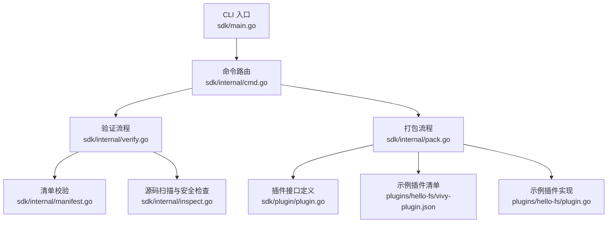
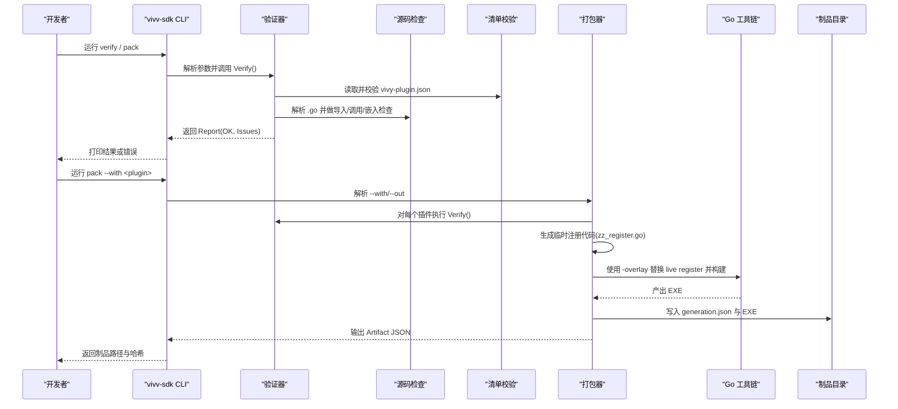
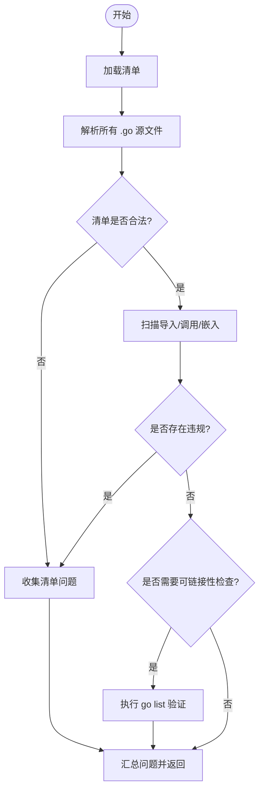
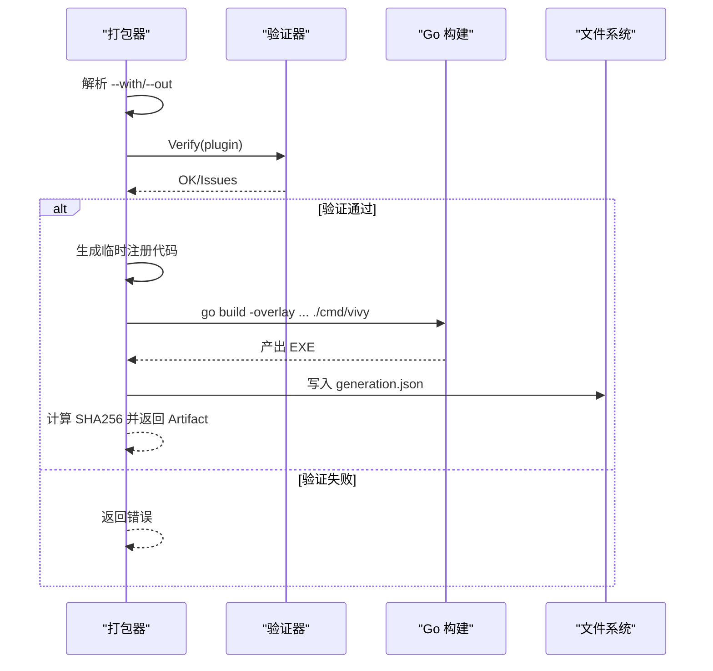
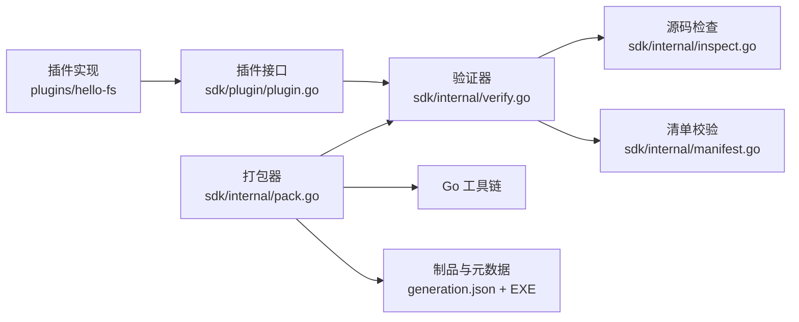

# 验证与打包

<cite>
**本文引用的文件**
- [sdk/main.go](file://sdk/main.go)
- [sdk/internal/cmd.go](file://sdk/internal/cmd.go)
- [sdk/internal/verify.go](file://sdk/internal/verify.go)
- [sdk/internal/inspect.go](file://sdk/internal/inspect.go)
- [sdk/internal/manifest.go](file://sdk/internal/manifest.go)
- [sdk/internal/pack.go](file://sdk/internal/pack.go)
- [sdk/plugin/plugin.go](file://sdk/plugin/plugin.go)
- [plugins/hello-fs/vivy-plugin.json](file://plugins/hello-fs/vivy-plugin.json)
- [plugins/hello-fs/plugin.go](file://plugins/hello-fs/plugin.go)
- [justfile](file://justfile)
</cite>

## 目录
1. [简介](#简介)
2. [项目结构](#项目结构)
3. [核心组件](#核心组件)
4. [架构总览](#架构总览)
5. [详细组件分析](#详细组件分析)
6. [依赖关系分析](#依赖关系分析)
7. [性能考虑](#性能考虑)
8. [故障排查指南](#故障排查指南)
9. [结论](#结论)
10. [附录](#附录)

## 简介
本文件面向插件作者与CI维护者，系统化说明 Vivy 插件的“验证与打包”机制。内容覆盖：
- 静态代码检查、导入白名单/黑名单、权限声明校验、可链接性证明等验证阶段
- 打包流程：生成注册代码、使用 Go -overlay 构建、输出制品与元数据
- 插件包规范：manifest 字段约束、源代码组织、工具能力声明
- CI/CD 集成建议与常见问题排查
- 版本管理与发布最佳实践

## 项目结构
与验证和打包直接相关的代码集中在 sdk 目录：
- CLI 入口：sdk/main.go
- 命令路由：sdk/internal/cmd.go
- 验证器：sdk/internal/verify.go、sdk/internal/inspect.go、sdk/internal/manifest.go
- 打包器：sdk/internal/pack.go
- 插件对外接口：sdk/plugin/plugin.go
- 示例插件：plugins/hello-fs（含 vivy-plugin.json 与实现）
- 构建任务：justfile（提供 sdk 子任务用于构建 vivy-sdk.exe）

图表来源
- [sdk/main.go:1-14](file://sdk/main.go#L1-L14)
- [sdk/internal/cmd.go:10-79](file://sdk/internal/cmd.go#L10-L79)
- [sdk/internal/verify.go:19-48](file://sdk/internal/verify.go#L19-L48)
- [sdk/internal/manifest.go:38-95](file://sdk/internal/manifest.go#L38-L95)
- [sdk/internal/inspect.go:19-79](file://sdk/internal/inspect.go#L19-L79)
- [sdk/internal/pack.go:67-199](file://sdk/internal/pack.go#L67-L199)
- [sdk/plugin/plugin.go:12-88](file://sdk/plugin/plugin.go#L12-L88)
- [plugins/hello-fs/vivy-plugin.json:1-21](file://plugins/hello-fs/vivy-plugin.json#L1-L21)
- [plugins/hello-fs/plugin.go:1-65](file://plugins/hello-fs/plugin.go#L1-L65)

章节来源
- [sdk/main.go:1-14](file://sdk/main.go#L1-L14)
- [sdk/internal/cmd.go:10-79](file://sdk/internal/cmd.go#L10-L79)
- [justfile:63-66](file://justfile#L63-L66)

## 核心组件
- vivy-sdk CLI：提供 verify、pack、inspect-artifact 三个命令，分别用于验证插件、打包制品、查看制品元信息。
- 验证器：读取并校验 vivy-plugin.json；解析并扫描所有 .go 源文件；执行安全与合规检查；必要时调用 go list 证明可链接。
- 打包器：选择插件、生成临时注册代码、通过 Go -overlay 将插件注入主程序、构建产物、计算 SHA256、写入 generation.json。
- 插件接口：定义 Seam、Grant、Effect、Plugin、Tool、Env 等契约，限制插件只能访问受控能力。
- 示例插件：hello-fs 演示最小可用插件结构与 manifest 声明。

章节来源
- [sdk/internal/cmd.go:10-79](file://sdk/internal/cmd.go#L10-L79)
- [sdk/internal/verify.go:19-48](file://sdk/internal/verify.go#L19-L48)
- [sdk/internal/inspect.go:19-79](file://sdk/internal/inspect.go#L19-L79)
- [sdk/internal/manifest.go:38-95](file://sdk/internal/manifest.go#L38-L95)
- [sdk/internal/pack.go:67-199](file://sdk/internal/pack.go#L67-L199)
- [sdk/plugin/plugin.go:12-88](file://sdk/plugin/plugin.go#L12-L88)
- [plugins/hello-fs/vivy-plugin.json:1-21](file://plugins/hello-fs/vivy-plugin.json#L1-L21)
- [plugins/hello-fs/plugin.go:1-65](file://plugins/hello-fs/plugin.go#L1-L65)

## 架构总览
下图展示从 CLI 到验证、再到打包的端到端流程，以及各阶段的输入输出。

图表来源
- [sdk/internal/cmd.go:15-79](file://sdk/internal/cmd.go#L15-L79)
- [sdk/internal/verify.go:19-48](file://sdk/internal/verify.go#L19-L48)
- [sdk/internal/manifest.go:38-95](file://sdk/internal/manifest.go#L38-L95)
- [sdk/internal/inspect.go:19-79](file://sdk/internal/inspect.go#L19-L79)
- [sdk/internal/pack.go:67-199](file://sdk/internal/pack.go#L67-L199)

## 详细组件分析

### 验证器（Verify）
- 职责：对单个插件目录进行静态验证，不生成任何可执行文件。
- 阶段：
  1) 清单加载与校验：apiVersion、name/version/seam/module/grants/tools 等字段合法性。
  2) 源码解析：遍历 .go 文件，跳过 testdata 与隐藏目录。
  3) 安全检查：禁止 package main、禁止导入 internal 与 eino、禁止绕过 Env 的系统调用、禁止嵌入二进制。
  4) 构造器检查：必须导出 New() 返回 plugin.Plugin。
  5) 可链接性证明：在问题为空时调用 go list 确认包可被编译。
- 输出：Report{Dir, OK, Issues}。

图表来源
- [sdk/internal/verify.go:19-48](file://sdk/internal/verify.go#L19-L48)
- [sdk/internal/manifest.go:38-95](file://sdk/internal/manifest.go#L38-L95)
- [sdk/internal/inspect.go:19-79](file://sdk/internal/inspect.go#L19-L79)

章节来源
- [sdk/internal/verify.go:19-48](file://sdk/internal/verify.go#L19-L48)
- [sdk/internal/manifest.go:38-95](file://sdk/internal/manifest.go#L38-L95)
- [sdk/internal/inspect.go:19-79](file://sdk/internal/inspect.go#L19-L79)

### 源码安全检查（Inspect）
- 禁止项：
  - package main：防止插件产生独立可执行文件。
  - 导入 agent-vivy/internal/* 与 github.com/cloudwego/eino：避免越界依赖。
  - 绕过 Env 的系统调用：os.Open/OpenFile/Create/StartProcess、os/exec.Command/CommandContext。
  - 嵌入二进制：go:embed 禁止 .exe/.dll/.so/.wasm/.dylib。
- 强制项：
  - 必须存在 func New() plugin.Plugin。
- 作用：确保插件仅通过 SDK 暴露的能力与环境交互，符合隔离与最小权限原则。

章节来源
- [sdk/internal/inspect.go:53-79](file://sdk/internal/inspect.go#L53-L79)
- [sdk/internal/inspect.go:103-157](file://sdk/internal/inspect.go#L103-L157)
- [sdk/internal/inspect.go:159-175](file://sdk/internal/inspect.go#L159-L175)

### 清单校验（Manifest）
- 字段约束：
  - apiVersion：固定为 vivy.plugin/v0。
  - name：必须与目录名一致且符合小写字母数字与连字符规则。
  - version：语义化版本。
  - seam：必须在允许集合内（tool/tool-world/provider）。
  - module：必填。
  - grants：仅允许 fs.read/fs.write。
  - tools：至少一个；name 唯一；effect 为 read/write；schema 为 JSON 对象。
- 作用：统一插件元数据，驱动运行时权限与工具发现。

章节来源
- [sdk/internal/manifest.go:21-36](file://sdk/internal/manifest.go#L21-L36)
- [sdk/internal/manifest.go:50-95](file://sdk/internal/manifest.go#L50-L95)
- [plugins/hello-fs/vivy-plugin.json:1-21](file://plugins/hello-fs/vivy-plugin.json#L1-L21)

### 打包器（Pack）
- 输入：--with 指定插件名或目录；--out 指定输出目录（可选）。
- 步骤：
  1) 解析模块根目录，定位插件目录。
  2) 对每个插件执行 Verify()，失败即中止。
  3) 读取清单与包名，生成临时 zz_register.go 注册代码。
  4) 通过 Go -overlay 替换内部生成的注册文件，构建主程序。
  5) 计算产物 SHA256，写入 generation.json（包含 ID、SourceRef、Recipe、Phase、Tools）。
  6) 返回 Artifact 供后续流水线使用。
- 关键约束：
  - 不会修改仓库中的 live register 文件（测试保证）。
  - 产物位于 dist/<id>/ 下，默认名称为 vivy（Windows 为 vivy.exe）。

图表来源
- [sdk/internal/pack.go:44-65](file://sdk/internal/pack.go#L44-L65)
- [sdk/internal/pack.go:67-199](file://sdk/internal/pack.go#L67-L199)

章节来源
- [sdk/internal/pack.go:44-65](file://sdk/internal/pack.go#L44-L65)
- [sdk/internal/pack.go:67-199](file://sdk/internal/pack.go#L67-L199)

### 插件接口与示例
- 接口要点：
  - Plugin：Name/Seam/Grants/Tools
  - Tool：Name/Effect/Schema/Run(ctx, env, args)
  - Env：Workspace/OpenRead/OpenWrite
  - Effect：read/write；Grant：fs.read/fs.write；Seam：tool/tool-world/provider
- 示例插件 hello-fs：
  - 清单声明 tool-world 与 fs.read 授权，工具 hello_stat 为只读。
  - 实现遵循最小权限，通过 env.OpenRead 访问工作区文件。

章节来源
- [sdk/plugin/plugin.go:12-88](file://sdk/plugin/plugin.go#L12-L88)
- [plugins/hello-fs/vivy-plugin.json:1-21](file://plugins/hello-fs/vivy-plugin.json#L1-L21)
- [plugins/hello-fs/plugin.go:1-65](file://plugins/hello-fs/plugin.go#L1-L65)

## 依赖关系分析
- 低耦合设计：
  - 插件仅能导入 sdk/plugin 提供的最小接口集，无法触及 internal/runtime、internal/provider 或 eino。
  - 验证器通过 AST 扫描强制该边界，打包器通过 overlay 注入而不改变源码。
- 外部依赖：
  - 依赖 Go 工具链进行可链接性检查与构建。
  - 产物元数据基于 domain 类型（AssemblyRecipe、GenerationPhase），由打包器填充。

图表来源
- [sdk/internal/verify.go:19-48](file://sdk/internal/verify.go#L19-L48)
- [sdk/internal/inspect.go:19-79](file://sdk/internal/inspect.go#L19-L79)
- [sdk/internal/manifest.go:38-95](file://sdk/internal/manifest.go#L38-L95)
- [sdk/internal/pack.go:67-199](file://sdk/internal/pack.go#L67-L199)

章节来源
- [sdk/internal/verify.go:19-48](file://sdk/internal/verify.go#L19-L48)
- [sdk/internal/inspect.go:19-79](file://sdk/internal/inspect.go#L19-L79)
- [sdk/internal/manifest.go:38-95](file://sdk/internal/manifest.go#L38-L95)
- [sdk/internal/pack.go:67-199](file://sdk/internal/pack.go#L67-L199)

## 性能考虑
- 验证阶段：
  - 源码解析与 AST 遍历为 O(N) 规模，N 为插件源文件数；通常极快。
  - go list 仅在无问题时触发，避免不必要的编译开销。
- 打包阶段：
  - 主要耗时在 go build；-overlay 方式无需复制源码，减少 IO。
  - 产物哈希计算为线性扫描，成本可忽略。
- 优化建议：
  - 在 CI 中缓存 Go 模块与构建产物。
  - 并行验证多个插件（当前 CLI 顺序处理，可按需扩展）。

[本节为通用指导，不直接分析具体文件]

## 故障排查指南
- 常见验证失败原因：
  - 清单字段错误：apiVersion 非 v0、name 与目录不一致、version 非语义化版本、seam/grants/tools 非法或缺失。
  - 源码违规：package main、导入 internal/eino、调用 os/os/exec 绕过 Env、嵌入二进制。
  - 缺少构造器：未导出 New() 返回 plugin.Plugin。
  - 不可链接：go list 失败（依赖缺失或语法错误）。
- 常见打包失败原因：
  - 未提供 --with 或插件路径不存在。
  - 验证失败导致打包中止。
  - Go 工具链缺失或环境变量异常。
  - 输出目录创建失败。
- 定位方法：
  - 使用 vivy-sdk verify <dir> 获取详细 Issues。
  - 使用 vivy-sdk inspect-artifact <dir> 查看已打包制品元数据。
  - 检查 vivy-plugin.json 与插件实现是否符合接口约定。

章节来源
- [sdk/internal/cmd.go:15-79](file://sdk/internal/cmd.go#L15-L79)
- [sdk/internal/verify.go:19-48](file://sdk/internal/verify.go#L19-L48)
- [sdk/internal/manifest.go:50-95](file://sdk/internal/manifest.go#L50-L95)
- [sdk/internal/inspect.go:53-79](file://sdk/internal/inspect.go#L53-L79)
- [sdk/internal/pack.go:44-65](file://sdk/internal/pack.go#L44-L65)
- [sdk/internal/pack.go:67-199](file://sdk/internal/pack.go#L67-L199)

## 结论
Vivy 插件系统通过严格的静态验证与安全的打包流程，确保插件仅以最小权限接入运行时，同时保持开发体验与可追溯性。建议在团队内统一采用 vivy-sdk 作为插件开发与发布的唯一入口，并在 CI 中固化 verify 与 pack 步骤，配合制品签名与归档策略，保障交付质量与安全性。

[本节为总结，不直接分析具体文件]

## 附录

### 插件包结构规范
- 必需文件：
  - vivy-plugin.json：清单，声明 API 版本、名称、版本、seam、module、grants、tools。
  - Go 源文件：实现插件与工具，遵守接口约束。
- 推荐组织：
  - 插件目录名与清单 name 一致。
  - 工具按功能拆分文件，便于维护与测试。
  - 避免引入无关依赖，保持最小化。

章节来源
- [plugins/hello-fs/vivy-plugin.json:1-21](file://plugins/hello-fs/vivy-plugin.json#L1-L21)
- [plugins/hello-fs/plugin.go:1-65](file://plugins/hello-fs/plugin.go#L1-L65)
- [sdk/internal/manifest.go:21-36](file://sdk/internal/manifest.go#L21-L36)

### 自动化验证与 CI/CD 集成
- 本地快速构建 SDK：
  - 使用 justfile 的 sdk 任务构建 vivy-sdk.exe。
- 建议流水线步骤：
  1) 安装 Go 与依赖。
  2) 运行 vivy-sdk verify 对所有插件目录。
  3) 运行 vivy-sdk pack --with <plugin> 生成制品与 generation.json。
  4) 上传制品与元数据，记录 artifact_sha256。
  5) 可选：对制品进行签名与完整性校验。

章节来源
- [justfile:63-66](file://justfile#L63-L66)
- [sdk/internal/cmd.go:15-79](file://sdk/internal/cmd.go#L15-L79)
- [sdk/internal/pack.go:67-199](file://sdk/internal/pack.go#L67-L199)

### 版本管理与发布最佳实践
- 清单 version 使用语义化版本，变更遵循向后兼容原则。
- 每次打包生成唯一 ID 与 SHA256，便于回滚与审计。
- 将 generation.json 纳入制品管理，与代码提交关联。
- 在发布前执行完整验证与打包，保留构建日志与产物。

章节来源
- [sdk/internal/manifest.go:50-95](file://sdk/internal/manifest.go#L50-L95)
- [sdk/internal/pack.go:171-199](file://sdk/internal/pack.go#L171-L199)