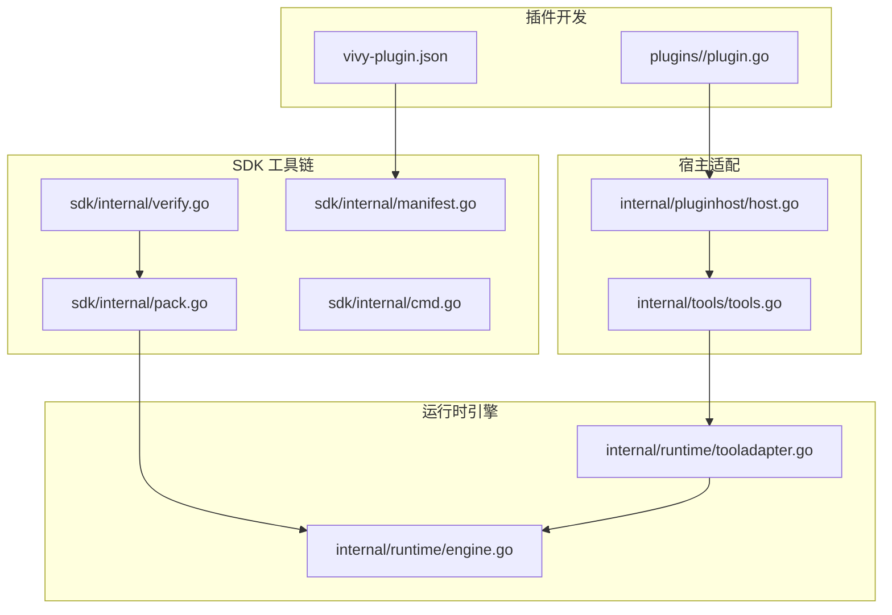
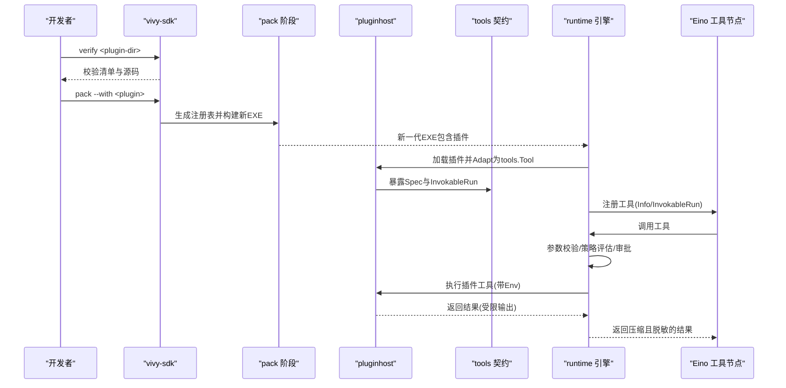
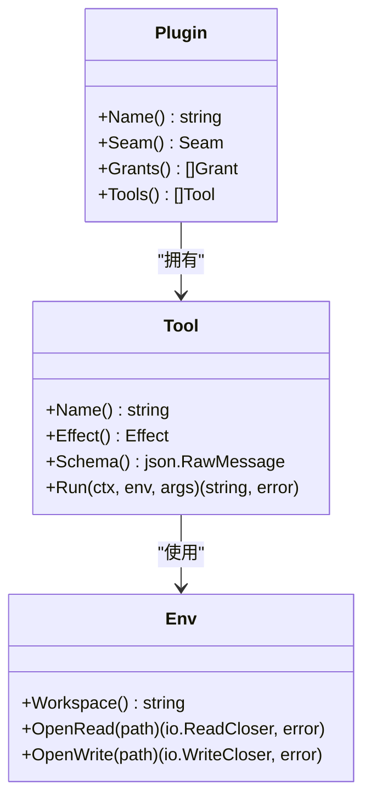
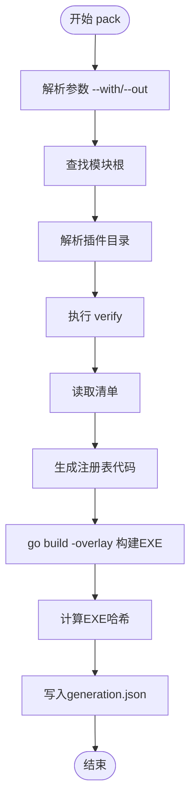
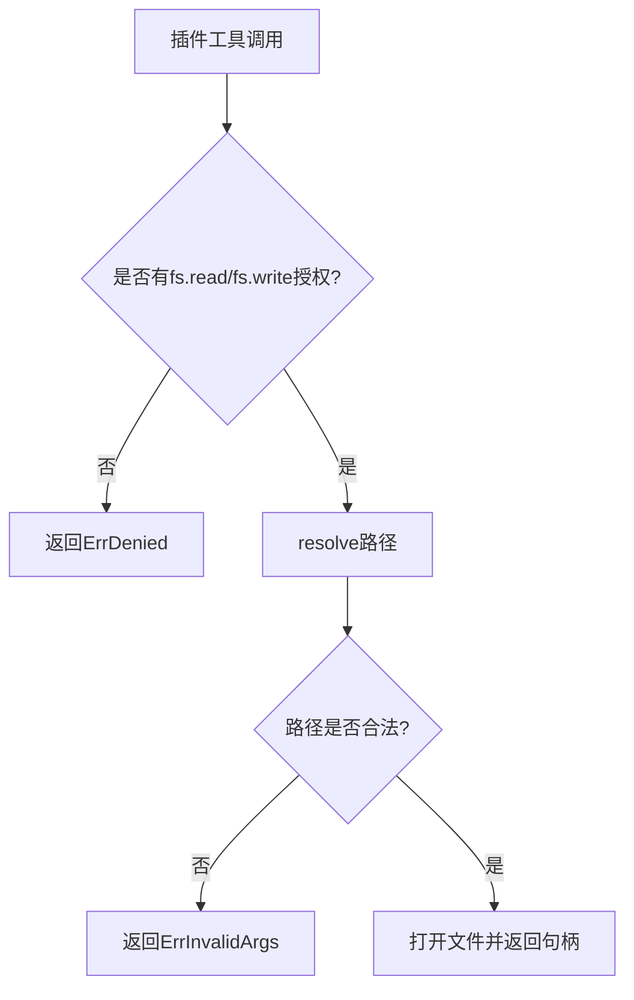
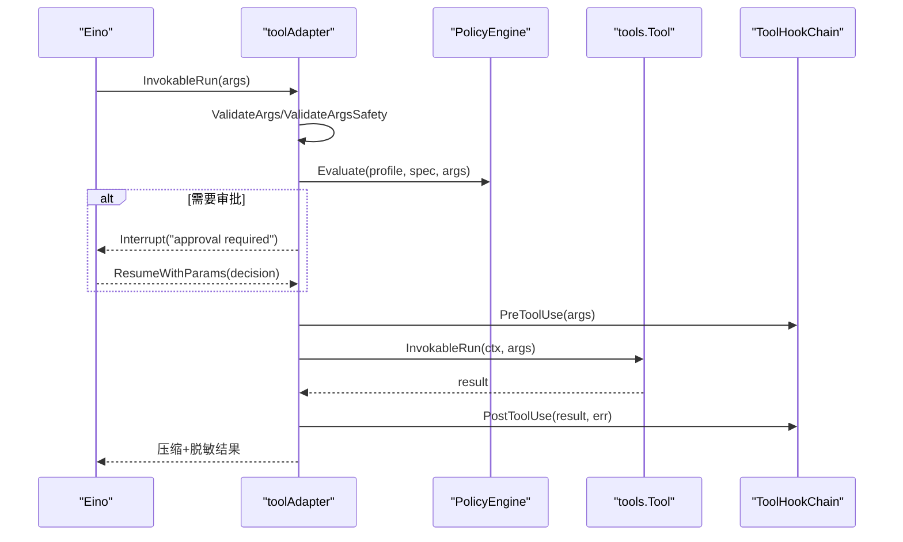

# 插件架构设计

<cite>
**本文引用的文件**
- [sdk/plugin/plugin.go](file://sdk/plugin/plugin.go)
- [plugins/hello-fs/plugin.go](file://plugins/hello-fs/plugin.go)
- [plugins/hello-fs/vivy-plugin.json](file://plugins/hello-fs/vivy-plugin.json)
- [internal/pluginhost/host.go](file://internal/pluginhost/host.go)
- [docs/architecture/VIVY-PLUGIN-SPEC.md](file://docs/architecture/VIVY-PLUGIN-SPEC.md)
- [sdk/internal/manifest.go](file://sdk/internal/manifest.go)
- [sdk/internal/pack.go](file://sdk/internal/pack.go)
- [sdk/internal/verify.go](file://sdk/internal/verify.go)
- [sdk/internal/cmd.go](file://sdk/internal/cmd.go)
- [internal/runtime/tooladapter.go](file://internal/runtime/tooladapter.go)
- [internal/tools/tools.go](file://internal/tools/tools.go)
- [internal/domain/tool.go](file://internal/domain/tool.go)
- [internal/runtime/engine.go](file://internal/runtime/engine.go)
</cite>

## 目录
1. [简介](#简介)
2. [项目结构](#项目结构)
3. [核心组件](#核心组件)
4. [架构总览](#架构总览)
5. [详细组件分析](#详细组件分析)
6. [依赖关系分析](#依赖关系分析)
7. [性能考量](#性能考量)
8. [故障排查指南](#故障排查指南)
9. [结论](#结论)
10. [附录](#附录)

## 简介
本文件系统性阐述 Vivy 插件架构的设计与实现，聚焦以下目标：
- 插件与宿主程序的隔离机制、接口抽象层设计与权限模型、安全边界
- 插件生命周期管理：从加载、初始化到卸载的完整流程
- 工具适配器原理：将 SDK 定义的插件工具转换为 Vivy 内部工具契约
- 工作区查找机制、文件访问控制、路径解析与安全性验证
- 插件发现机制、依赖管理与版本兼容性处理
- 架构图与数据流图：说明插件系统与运行时引擎的集成方式

## 项目结构
Vivy 插件体系由“插件源码 + SDK 校验/打包 + 宿主适配 + 运行时引擎”组成。关键目录与职责如下：
- sdk/plugin：插件作者唯一可导入的窗口，定义 Plugin、Tool、Env 等最小接口与能力（seam/grants/effects）
- plugins/<name>：用户插件源码与清单 vivy-plugin.json；示例 hello-fs 演示只读文件系统访问
- internal/pluginhost：将插件工具适配为 Vivy 内部 tools.Tool 契约，并实现权限检查与工作区路径解析
- internal/tools：Vivy 自有工具契约与注册表、参数校验、路由选择等
- internal/runtime：Eino 集成、策略审批、工具执行包装、结果压缩与安全标记
- sdk/internal：vivy-sdk CLI（verify/pack/inspect-artifact），负责清单校验、生成注册表、构建新一代 EXE
- docs/architecture/VIVY-PLUGIN-SPEC.md：插件规范与治理约束

**图表来源**
- [sdk/internal/pack.go:67-199](file://sdk/internal/pack.go#L67-L199)
- [internal/pluginhost/host.go:22-60](file://internal/pluginhost/host.go#L22-L60)
- [internal/runtime/engine.go:69-117](file://internal/runtime/engine.go#L69-L117)

**章节来源**
- [docs/architecture/VIVY-PLUGIN-SPEC.md:29-83](file://docs/architecture/VIVY-PLUGIN-SPEC.md#L29-L83)
- [sdk/internal/cmd.go:10-79](file://sdk/internal/cmd.go#L10-L79)

## 核心组件
- 插件接口与能力声明（sdk/plugin）
  - Seam：tool / tool-world / provider，限定插件接入面
  - Grant：fs.read / fs.write，限制文件系统能力
  - Effect：read / write，标注工具副作用级别
  - Plugin/Tool/Env：插件必须实现的接口，Env 是插件唯一可触达的世界
- 插件清单（vivy-plugin.json）
  - 声明 apiVersion、name、version、seam、module、grants、tools（含 schema）
  - 由 SDK 校验与打包，禁止手工修改
- 宿主适配器（internal/pluginhost）
  - Adapt：将插件工具转为 Vivy tools.Tool
  - hostedEnv：实现 Workspace/OpenRead/OpenWrite，基于 Grants 进行权限过滤与路径解析
- 运行时工具适配（internal/runtime/tooladapter）
  - 将 tools.Tool 包装为 Eino InvokableTool
  - 参数校验、策略评估、审批中断、结果压缩与安全标记
- 工具契约与注册（internal/tools）
  - Tool 接口、Spec、参数校验、路由选择、注册表
- 引擎集成（internal/runtime/engine）
  - 组装 Eino Agent/Runner，注入工具集，提供 Query/Resume 等运行入口

**章节来源**
- [sdk/plugin/plugin.go:12-87](file://sdk/plugin/plugin.go#L12-L87)
- [plugins/hello-fs/vivy-plugin.json:1-21](file://plugins/hello-fs/vivy-plugin.json#L1-L21)
- [internal/pluginhost/host.go:22-166](file://internal/pluginhost/host.go#L22-L166)
- [internal/runtime/tooladapter.go:24-184](file://internal/runtime/tooladapter.go#L24-L184)
- [internal/tools/tools.go:17-26](file://internal/tools/tools.go#L17-L26)
- [internal/runtime/engine.go:18-117](file://internal/runtime/engine.go#L18-L117)

## 架构总览
下图展示插件从源码到运行的全链路：开发者在 plugins 下编写插件与清单，通过 vivy-sdk verify/pack 生成新一代 EXE；运行时通过 internal/pluginhost 将插件工具适配为 Vivy 工具契约，再由 runtime/tooladapter 包装为 Eino 可调用的工具，受策略与审批控制执行。

**图表来源**
- [sdk/internal/cmd.go:10-79](file://sdk/internal/cmd.go#L10-L79)
- [sdk/internal/pack.go:67-199](file://sdk/internal/pack.go#L67-L199)
- [internal/pluginhost/host.go:22-60](file://internal/pluginhost/host.go#L22-L60)
- [internal/runtime/tooladapter.go:78-184](file://internal/runtime/tooladapter.go#L78-L184)
- [internal/runtime/engine.go:69-117](file://internal/runtime/engine.go#L69-L117)

## 详细组件分析

### 插件接口与权限模型（sdk/plugin）
- 插件通过实现 Plugin 接口暴露 Name、Seam、Grants、Tools
- Tool 接口定义 Name、Effect、Schema、Run，Run 接收 Env 与 JSON 参数
- Env 是插件唯一世界：Workspace()、OpenRead(path)、OpenWrite(path)
- 缺失权限时，OpenRead/OpenWrite 直接失败关闭（ErrDenied）
- 错误类型 ErrInvalidArgs 用于参数或路径不合法

**图表来源**
- [sdk/plugin/plugin.go:61-82](file://sdk/plugin/plugin.go#L61-L82)

**章节来源**
- [sdk/plugin/plugin.go:12-87](file://sdk/plugin/plugin.go#L12-L87)

### 插件清单与校验（sdk/internal/manifest.go）
- 清单字段：apiVersion、name、version、seam、module、grants、tools
- 校验规则：
  - apiVersion 仅允许 vivy.plugin/v0
  - name 必须与目录名一致且符合命名规范
  - version 必须符合 semver
  - seam 必须在允许集合内
  - grants 必须在允许集合内
  - tools 至少一个，name 全局唯一，effect 必须 read/write，schema 必须是对象
- 这些校验在 verify 阶段执行，确保插件契约正确

**章节来源**
- [sdk/internal/manifest.go:21-104](file://sdk/internal/manifest.go#L21-L104)

### 插件打包与生成注册表（sdk/internal/pack.go）
- vivy-sdk pack 流程：
  - 解析 --with/--out 参数
  - 定位模块根与插件目录
  - 对每个插件执行 Verify，读取清单，解析包名
  - 生成临时 zz_register.go，使用 go build -overlay 替换 internal/generated/plugins/zz_register.go
  - 编译得到新一代 EXE，记录 generation.json（ID、SHA256、SourceRef、Recipe、Phase、Tools）
- 生成的 Register() 返回所有插件实例，供运行时加载

**图表来源**
- [sdk/internal/pack.go:67-199](file://sdk/internal/pack.go#L67-L199)

**章节来源**
- [sdk/internal/pack.go:67-199](file://sdk/internal/pack.go#L67-L199)

### 插件发现与加载（internal/pluginhost/host.go）
- Adapt 遍历插件的工具列表，过滤空项与无名称项，封装为 hostedTool
- hostedTool.Spec 映射为 domain.ToolSpec，设置 Readonly、Keywords、Params
- hostedTool.InvokableRun 构造 hostedEnv 并调用插件 Tool.Run
- hostedEnv 实现权限检查与路径解析：
  - OpenRead/OpenWrite 先检查 Grants，再 resolve 路径
  - resolve 拒绝绝对路径、反斜杠、以 / 开头、包含 .. 的路径
  - 最终 Join(root, cleaned) 并二次校验相对路径不越界

**图表来源**
- [internal/pluginhost/host.go:57-142](file://internal/pluginhost/host.go#L57-L142)

**章节来源**
- [internal/pluginhost/host.go:22-166](file://internal/pluginhost/host.go#L22-L166)

### 工具适配器与运行时集成（internal/runtime/tooladapter.go）
- newToolAdapter 将 tools.Tool 包装为 Eino InvokableTool
- Info 方法将 domain.ToolSpec.Params 映射为 Eino ParameterInfo
- InvokableRun 流程：
  - 校验参数形状与安全
  - 策略评估（PolicyEngine），必要时进入审批中断
  - 支持交互型工具（question）中断等待用户回答
  - 执行后 PostHook 审计，结果添加不可信标记并压缩
- compactToolResult 限制结果大小，保留头尾并插入折叠标记

**图表来源**
- [internal/runtime/tooladapter.go:45-184](file://internal/runtime/tooladapter.go#L45-L184)

**章节来源**
- [internal/runtime/tooladapter.go:24-242](file://internal/runtime/tooladapter.go#L24-L242)

### 工具契约与注册表（internal/tools/tools.go）
- Tool 接口：Spec() 与 InvokableRun(ctx, args)
- 参数校验 ValidateArgs：强制 JSON 对象、字段存在性、必填、类型匹配
- 路由选择 Selector：基于关键词与名称分词匹配，确定请求级工具集
- 注册表 Registry：按名称注册，Resolve 启用工具集，避免未知工具

**章节来源**
- [internal/tools/tools.go:17-26](file://internal/tools/tools.go#L17-L26)
- [internal/tools/tools.go:41-84](file://internal/tools/tools.go#L41-L84)
- [internal/tools/tools.go:122-181](file://internal/tools/tools.go#L122-L181)
- [internal/tools/tools.go:223-362](file://internal/tools/tools.go#L223-L362)

### 引擎集成（internal/runtime/engine.go）
- EngineConfig 配置流式缓冲、事件负载上限、最大工具轮次、上下文/历史大小、工具结果上限、检查点、策略、钩子
- NewEngine 将 tools.Tool 包装为 Eino BaseTool，收集 Spec 与 byName 映射
- SelectTools 基于 request 选择工具集
- Query/RunHistory/Resume 提供运行入口，支持检查点恢复

**章节来源**
- [internal/runtime/engine.go:18-117](file://internal/runtime/engine.go#L18-L117)
- [internal/runtime/engine.go:119-166](file://internal/runtime/engine.go#L119-L166)

### 示例插件：hello-fs
- 清单声明 seam=tool-world，grants=[fs.read]，工具 hello_stat 效果 read，参数 path
- 插件实现 statTool：
  - 校验参数与路径合法性（workspaceRel）
  - 通过 env.OpenRead 读取工作区内文件内容并返回长度信息
- 该示例展示了插件如何通过最小窗口访问工作区文件，且不会绕过 Env

**章节来源**
- [plugins/hello-fs/vivy-plugin.json:1-21](file://plugins/hello-fs/vivy-plugin.json#L1-L21)
- [plugins/hello-fs/plugin.go:17-65](file://plugins/hello-fs/plugin.go#L17-L65)

## 依赖关系分析
- 插件只能导入 sdk/plugin，禁止直接 import internal/* 或 eino
- SDK 校验器 enforce 禁止项：import 内核、eino、os.Open/exec.Command 绕过 Env、seam 非法、重复工具名等
- 打包阶段通过 go build -overlay 注入生成的注册表，保证插件以“新一代 EXE”形式集成
- 运行时通过 pluginhost 将插件工具适配为 tools.Tool，再由 runtime/tooladapter 接入 Eino

**图表来源**
- [docs/architecture/VIVY-PLUGIN-SPEC.md:141-154](file://docs/architecture/VIVY-PLUGIN-SPEC.md#L141-L154)
- [sdk/internal/pack.go:141-169](file://sdk/internal/pack.go#L141-L169)
- [internal/runtime/tooladapter.go:24-43](file://internal/runtime/tooladapter.go#L24-L43)

**章节来源**
- [docs/architecture/VIVY-PLUGIN-SPEC.md:141-154](file://docs/architecture/VIVY-PLUGIN-SPEC.md#L141-L154)
- [sdk/internal/pack.go:141-169](file://sdk/internal/pack.go#L141-L169)

## 性能考量
- 工具结果压缩：compactToolResult 限制单次工具结果大小，避免占用模型上下文窗口
- 参数校验前置：ValidateArgs/ValidateArgsSafety 在策略评估前执行，减少无效调用
- 策略评估缓存：PolicyEngine 可结合快照与策略哈希，避免重复计算
- 流式与检查点：EngineConfig 支持流式事件与检查点持久化，提升长任务稳定性
- 工具选择：Selector 基于关键词与名称分词，降低无关工具带来的噪声与开销

[本节为通用指导，无需特定文件引用]

## 故障排查指南
- 插件校验失败
  - 检查 vivy-plugin.json 字段是否符合规范（apiVersion、name、version、seam、grants、tools.schema）
  - 确认插件未 import internal/* 或 eino，未直接使用 os.Open/exec.Command
  - 参考 verify 输出问题列表
- 路径解析错误
  - 插件传入路径必须相对工作区，不能为绝对路径或包含 ..
  - 若出现 ErrInvalidArgs，检查 workspaceRel 与 hostedEnv.resolve 逻辑
- 权限被拒
  - 若 OpenRead/OpenWrite 返回 ErrDenied，确认清单 grants 是否包含所需能力
- 审批中断
  - 当策略要求审批时，工具会中断等待 resume；确认服务侧已提交决策并恢复运行
- 结果过大
  - 若模型上下文受限，注意工具结果会被压缩；可在策略或配置中调整 MaxToolResultBytes

**章节来源**
- [sdk/internal/verify.go:19-48](file://sdk/internal/verify.go#L19-L48)
- [internal/pluginhost/host.go:76-142](file://internal/pluginhost/host.go#L76-L142)
- [internal/runtime/tooladapter.go:78-184](file://internal/runtime/tooladapter.go#L78-L184)

## 结论
Vivy 插件架构通过严格的接口抽象与权限模型，实现了插件与宿主的清晰隔离。插件以纯 Go 源码与清单声明能力，经 SDK 校验与打包生成新一代 EXE，运行时通过 pluginhost 与 runtime/tooladapter 将其无缝接入 Eino 工具生态。策略与审批机制确保副作用工具的安全执行，路径解析与权限检查保障工作区访问的安全性。整体设计兼顾可扩展性与可控性，便于在物种层面演进与治理。

[本节为总结性内容，无需特定文件引用]

## 附录

### 插件生命周期管理
- 开发期：编辑 plugins/<name>/plugin.go 与 vivy-plugin.json
- 校验期：vivy-sdk verify 检查清单与源码合规性
- 打包期：vivy-sdk pack 生成注册表并构建新一代 EXE，输出 generation.json
- 运行期：引擎加载插件，Adapt 为 tools.Tool，包装为 Eino 工具，受策略与审批控制执行
- 卸载：从配方移除插件并重新 pack，新一代 EXE 不再包含该插件

**章节来源**
- [docs/architecture/VIVY-PLUGIN-SPEC.md:158-201](file://docs/architecture/VIVY-PLUGIN-SPEC.md#L158-L201)
- [sdk/internal/cmd.go:10-79](file://sdk/internal/cmd.go#L10-L79)
- [sdk/internal/pack.go:67-199](file://sdk/internal/pack.go#L67-L199)

### 工作区查找机制与文件访问控制
- 工作区查找：hostedEnv.workspace 通过注入的 WorkspaceLookup 获取当前运行工作区根
- 路径解析：resolve 拒绝不安全路径，确保最终路径在工作区内且不越界
- 文件访问：OpenRead/OpenWrite 根据 Grants 决定是否允许，并以严格权限创建文件

**章节来源**
- [internal/pluginhost/host.go:68-142](file://internal/pluginhost/host.go#L68-L142)

### 版本兼容性与出处
- 清单 apiVersion 固定为 vivy.plugin/v0，确保向后兼容
- pack 输出 generation.json 包含 ID、ArtifactSHA256、SourceRef、Recipe、Phase、Tools
- 插件名、版本、seam、grants、源哈希作为 Generation 出处条目，保证可重建与可追溯

**章节来源**
- [sdk/internal/manifest.go:14-19](file://sdk/internal/manifest.go#L14-L19)
- [sdk/internal/pack.go:24-37](file://sdk/internal/pack.go#L24-L37)
- [sdk/internal/pack.go:179-199](file://sdk/internal/pack.go#L179-L199)