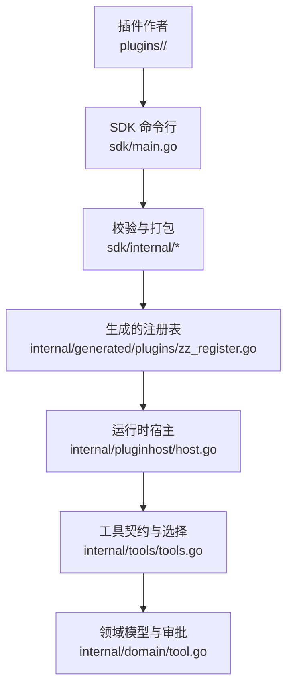
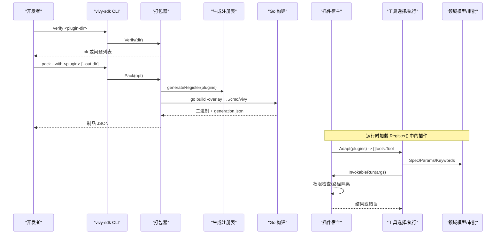
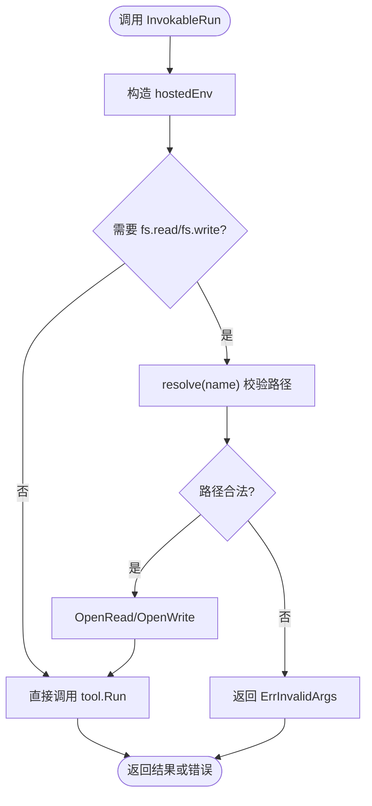
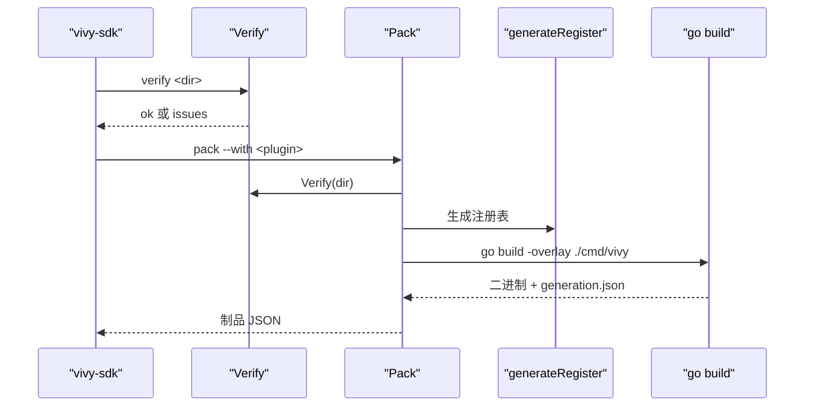
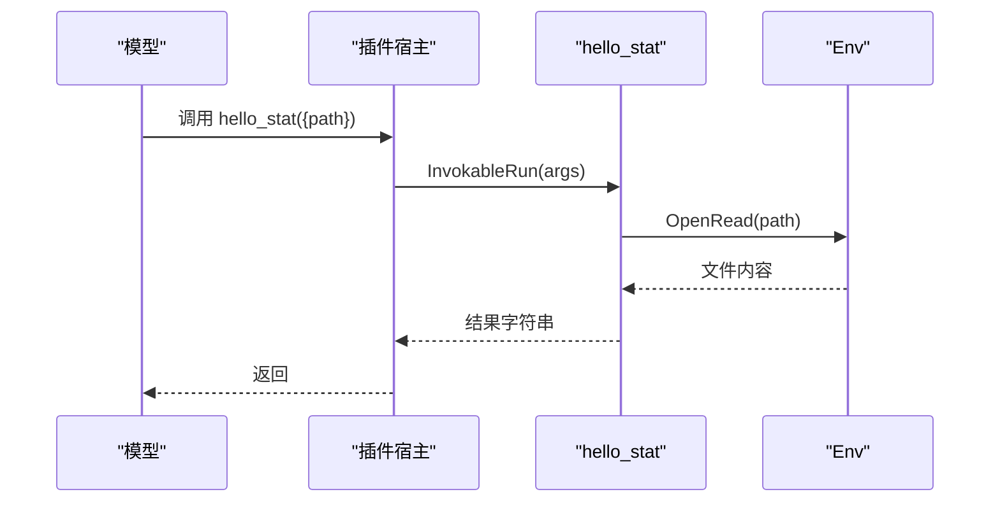
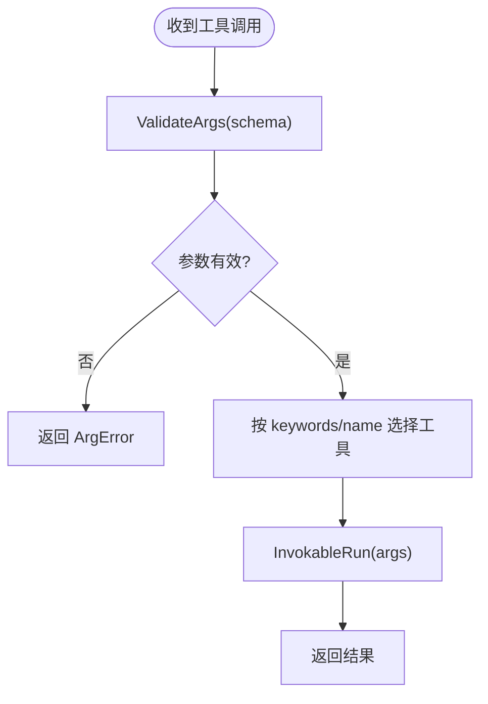
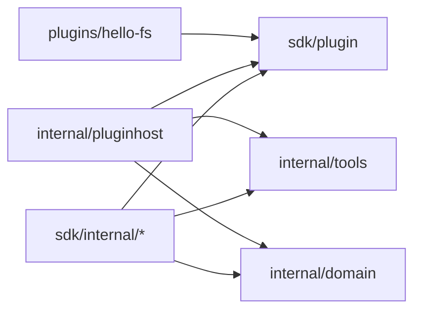

# 插件系统

<cite>
**本文引用的文件**
- [VIVY-PLUGIN-SPEC.md](file://docs/architecture/VIVY-PLUGIN-SPEC.md)
- [plugin.go](file://sdk/plugin/plugin.go)
- [host.go](file://internal/pluginhost/host.go)
- [manifest.go](file://sdk/internal/manifest.go)
- [verify.go](file://sdk/internal/verify.go)
- [pack.go](file://sdk/internal/pack.go)
- [cmd.go](file://sdk/internal/cmd.go)
- [main.go](file://sdk/main.go)
- [tool.go](file://internal/domain/tool.go)
- [tools.go](file://internal/tools/tools.go)
- [plugin.go](file://plugins/hello-fs/plugin.go)
- [vivy-plugin.json](file://plugins/hello-fs/vivy-plugin.json)
- [plugin_test.go](file://plugins/hello-fs/plugin_test.go)
</cite>

## 目录
1. [简介](#简介)
2. [项目结构](#项目结构)
3. [核心组件](#核心组件)
4. [架构总览](#架构总览)
5. [详细组件分析](#详细组件分析)
6. [依赖关系分析](#依赖关系分析)
7. [性能与可扩展性](#性能与可扩展性)
8. [故障排查指南](#故障排查指南)
9. [结论](#结论)
10. [附录：开发、打包、验证、分发与安全](#附录开发打包验证分发与安全)

## 简介
本仓库实现了 Vivy 的插件体系：用户通过纯 Go 代码在 plugins/<name>/ 下扩展能力，仅能访问 sdk/plugin 暴露的最小窗口；内核通过 pluginhost 将插件工具适配为运行时可调用工具；SDK 提供 verify/pack/inspect-artifact 命令完成安全校验、构建新一代 EXE 并生成可审计产物。插件不直接修改 internal/runtime/engine.go，而是以“配方 + 源码”的方式进入 Generation，保证重构与回滚的可追溯性。

## 项目结构
- 插件规范与边界定义位于 docs/architecture/VIVY-PLUGIN-SPEC.md，明确 seam、grants、禁止项与生命周期心智模型。
- 插件作者唯一导入窗口是 sdk/plugin，定义了 Plugin、Tool、Env、Seam、Grant、Effect 等最小接口。
- 运行时桥接层 internal/pluginhost 将插件 Tool 适配为 domain.ToolSpec 与 InvokableRun，实现权限检查、工作区路径隔离与参数 schema 转换。
- SDK 命令行 sdk/main.go 入口，内部 cmd.go 路由到 verify/pack/inspect-artifact；verify 与 pack 分别由 sdk/internal/verify.go、sdk/internal/pack.go 实现；清单解析与校验在 sdk/internal/manifest.go。
- 示例插件 plugins/hello-fs 演示了最小可用插件：声明 vivy-plugin.json，实现 sdk/plugin.Plugin 与 Tool，并通过 Env 读取工作区文件。
- 运行时工具契约 internal/tools/tools.go 与领域模型 internal/domain/tool.go 描述了工具注册、选择、审批流与参数校验。



**图示来源**
- [main.go:1-14](file://sdk/main.go#L1-L14)
- [cmd.go:10-79](file://sdk/internal/cmd.go#L10-L79)
- [pack.go:67-199](file://sdk/internal/pack.go#L67-L199)
- [host.go:22-60](file://internal/pluginhost/host.go#L22-L60)
- [tools.go:17-26](file://internal/tools/tools.go#L17-L26)
- [tool.go:27-42](file://internal/domain/tool.go#L27-L42)

**章节来源**
- [VIVY-PLUGIN-SPEC.md:13-24](file://docs/architecture/VIVY-PLUGIN-SPEC.md#L13-L24)
- [VIVY-PLUGIN-SPEC.md:29-83](file://docs/architecture/VIVY-PLUGIN-SPEC.md#L29-L83)
- [VIVY-PLUGIN-SPEC.md:141-154](file://docs/architecture/VIVY-PLUGIN-SPEC.md#L141-L154)
- [VIVY-PLUGIN-SPEC.md:186-221](file://docs/architecture/VIVY-PLUGIN-SPEC.md#L186-L221)

## 核心组件
- 插件接口与能力边界（sdk/plugin）
  - 暴露 Seam、Grant、Effect、Plugin、Tool、Env 以及错误类型，确保插件只能以最小能力集接入。
- 运行时宿主（internal/pluginhost）
  - 将插件 Tool 转换为 domain.ToolSpec 与 InvokableRun；对 OpenRead/OpenWrite 进行 grants 检查与工作区路径白名单校验。
- SDK 校验与打包（sdk/internal）
  - verify：解析清单、校验字段、扫描源码禁止项、尝试 go list 证明可链接。
  - pack：校验后生成临时注册表，使用 go build -overlay 注入到 cmd/vivy，输出二进制与 generation.json。
  - inspect-artifact：读取 generation.json 并返回制品元信息。
- 工具契约与选择（internal/tools）
  - 统一 Tool 接口、参数校验、关键词路由选择、注册表去重与启用过滤。
- 领域模型（internal/domain）
  - ToolSpec、ToolProposal、Approval 等描述工具能力、变更提案与审批状态，支撑读写工具的审批门禁。

**章节来源**
- [plugin.go:12-88](file://sdk/plugin/plugin.go#L12-L88)
- [host.go:22-166](file://internal/pluginhost/host.go#L22-L166)
- [manifest.go:21-105](file://sdk/internal/manifest.go#L21-L105)
- [verify.go:19-70](file://sdk/internal/verify.go#L19-L70)
- [pack.go:67-199](file://sdk/internal/pack.go#L67-L199)
- [tools.go:17-84](file://internal/tools/tools.go#L17-L84)
- [tool.go:27-112](file://internal/domain/tool.go#L27-L112)

## 架构总览
插件从源码到运行时的完整链路如下：



**图示来源**
- [cmd.go:15-79](file://sdk/internal/cmd.go#L15-L79)
- [verify.go:21-48](file://sdk/internal/verify.go#L21-L48)
- [pack.go:67-199](file://sdk/internal/pack.go#L67-L199)
- [host.go:22-60](file://internal/pluginhost/host.go#L22-L60)
- [tools.go:122-181](file://internal/tools/tools.go#L122-L181)
- [tool.go:27-42](file://internal/domain/tool.go#L27-L42)

## 详细组件分析

### 插件接口与能力边界（sdk/plugin）
- 只允许三种 seam：tool、tool-world、provider；其他 seam 被拒绝。
- 只允许两种 grant：fs.read、fs.write；缺失则关闭。
- Tool 必须声明 name、effect、schema 与 Run；Env 仅提供 Workspace、OpenRead、OpenWrite，屏蔽 Journal、Policy、原始 OS 与 Eino。
- 错误语义清晰：ErrDenied、ErrInvalidArgs 用于权限拒绝与参数非法。

```mermaid
classDiagram
class Plugin {
+Name() string
+Seam() Seam
+Grants() []Grant
+Tools() []Tool
}
class Tool {
+Name() string
+Effect() Effect
+Schema() json.RawMessage
+Run(ctx, env, args) (string, error)
}
class Env {
+Workspace() string
+OpenRead(path) ReadCloser
+OpenWrite(path) WriteCloser
}
class Seam {
<<enum>>
"tool"
"tool-world"
"provider"
}
class Grant {
<<enum>>
"fs.read"
"fs.write"
}
class Effect {
<<enum>>
"read"
"write"
}
Plugin --> Tool : "拥有"
Tool --> Env : "通过"
Plugin --> Seam : "声明"
Plugin --> Grant : "申请"
Tool --> Effect : "标注"
```

**图示来源**
- [plugin.go:12-88](file://sdk/plugin/plugin.go#L12-L88)

**章节来源**
- [plugin.go:12-88](file://sdk/plugin/plugin.go#L12-L88)

### 运行时宿主与权限控制（internal/pluginhost）
- Adapt 遍历插件的工具，包装为 hostedTool，对外暴露 domain.ToolSpec 与 InvokableRun。
- 权限检查：OpenRead/OpenWrite 前检查插件是否声明对应 grant，否则返回 ErrDenied。
- 路径隔离：resolve 严格拒绝绝对路径、反斜杠、../ 逃逸，最终落在当前 run workspace 下。
- Schema 转换：将插件声明的 JSON Schema properties/required 映射为 domain.ToolParam，供运行时发布给模型。



**图示来源**
- [host.go:57-142](file://internal/pluginhost/host.go#L57-L142)

**章节来源**
- [host.go:22-166](file://internal/pluginhost/host.go#L22-L166)

### SDK 校验与打包流程（sdk/internal）
- verify：读取 vivy-plugin.json，校验 apiVersion、name、version、seam、module、grants、tools 列表与 schema；若通过则尝试 go list 证明包可链接。
- pack：校验通过后，解析插件包名与 import path，生成 zz_register.go，使用 go build -overlay 注入到 cmd/vivy，编译出 vivy 二进制与 generation.json。
- inspect-artifact：读取 generation.json 并返回制品 ID、SHA256、SourceRef、Recipe、Phase、Tools。



**图示来源**
- [cmd.go:15-79](file://sdk/internal/cmd.go#L15-L79)
- [verify.go:21-70](file://sdk/internal/verify.go#L21-L70)
- [pack.go:67-199](file://sdk/internal/pack.go#L67-L199)

**章节来源**
- [manifest.go:21-105](file://sdk/internal/manifest.go#L21-L105)
- [verify.go:19-70](file://sdk/internal/verify.go#L19-L70)
- [pack.go:67-199](file://sdk/internal/pack.go#L67-L199)

### 示例插件 hello-fs
- 清单 vivy-plugin.json 声明 seam=tool-world、grants=[fs.read]，并注册一个 read-only 工具 hello_stat。
- 插件实现 sdk/plugin.Plugin 与 Tool，通过 Env.OpenRead 读取工作区内相对路径文件，拒绝绝对路径与越界路径。
- 单元测试通过内存 Env 验证读取行为与路径拒绝逻辑。



**图示来源**
- [plugin.go:17-65](file://plugins/hello-fs/plugin.go#L17-L65)
- [vivy-plugin.json:1-21](file://plugins/hello-fs/vivy-plugin.json#L1-L21)
- [host.go:57-85](file://internal/pluginhost/host.go#L57-L85)

**章节来源**
- [plugin.go:17-65](file://plugins/hello-fs/plugin.go#L17-L65)
- [vivy-plugin.json:1-21](file://plugins/hello-fs/vivy-plugin.json#L1-L21)
- [plugin_test.go:13-55](file://plugins/hello-fs/plugin_test.go#L13-L55)

### 工具契约、选择与审批（internal/tools 与 internal/domain）
- 工具契约：Tool.Spec 描述名称、描述、是否只读、参数 schema、关键词与交互类型；InvokableRun 执行调用。
- 参数校验：ValidateArgs 基于 schema 校验必填、类型与多余字段，避免副作用被触发。
- 选择策略：Selector 根据请求文本与工具 keywords/name 做保守匹配，减少无关工具暴露。
- 审批模型：ToolProposal 与 Approval 支持 effectful 工具的变更预览、风险发现与审批状态流转。



**图示来源**
- [tools.go:17-84](file://internal/tools/tools.go#L17-L84)
- [tools.go:122-181](file://internal/tools/tools.go#L122-L181)
- [tool.go:27-112](file://internal/domain/tool.go#L27-L112)

**章节来源**
- [tools.go:17-362](file://internal/tools/tools.go#L17-L362)
- [tool.go:27-112](file://internal/domain/tool.go#L27-L112)

## 依赖关系分析
- 插件仅依赖 sdk/plugin；不得引入 internal 或 eino。
- 运行时通过 internal/pluginhost 依赖 sdk/plugin 与 internal/tools、internal/domain。
- SDK 命令行依赖 sdk/internal 各模块，不启动网关进程。
- 示例插件依赖 sdk/plugin，测试中用内存 Env 模拟。



**图示来源**
- [plugin.go:1-15](file://plugins/hello-fs/plugin.go#L1-L15)
- [host.go:1-17](file://internal/pluginhost/host.go#L1-L17)
- [tools.go:1-15](file://internal/tools/tools.go#L1-L15)
- [tool.go:1-3](file://internal/domain/tool.go#L1-L3)
- [manifest.go:1-12](file://sdk/internal/manifest.go#L1-L12)

**章节来源**
- [VIVY-PLUGIN-SPEC.md:141-154](file://docs/architecture/VIVY-PLUGIN-SPEC.md#L141-L154)
- [host.go:1-17](file://internal/pluginhost/host.go#L1-L17)

## 性能与可扩展性
- 插件工具数量增长时，Selector 基于 keywords/name 的轻量匹配保持 O(n) 复杂度，适合中等规模工具集。
- 参数校验在调用前完成，避免无效调用进入副作用路径。
- 插件崩溃影响当次运行；隔离策略通过“下一代 EXE”解耦，便于快速回滚与替换。
- 打包阶段 go build -overlay 仅注入一次注册表，构建开销可控。

[本节为通用指导，不直接分析具体文件]

## 故障排查指南
- 校验失败常见原因
  - 清单字段不合法：apiVersion、name、version、seam、module、grants、tools.schema。
  - 重复工具名或 effect 非法。
  - 源码不可链接：缺少依赖或语法错误。
- 运行时权限拒绝
  - 未声明对应 grant 导致 OpenRead/OpenWrite 返回 ErrDenied。
  - 路径包含绝对路径、反斜杠或 ../ 逃逸，返回 ErrInvalidArgs。
- 参数校验失败
  - 非 JSON 对象、多余字段、必填缺失、类型不符会返回结构化 ArgError。
- 制品不可用
  - 检查 generation.json 是否包含 id、artifact_sha256、source_ref；必要时重新 pack。

**章节来源**
- [manifest.go:50-95](file://sdk/internal/manifest.go#L50-L95)
- [verify.go:21-70](file://sdk/internal/verify.go#L21-L70)
- [host.go:76-142](file://internal/pluginhost/host.go#L76-L142)
- [tools.go:41-84](file://internal/tools/tools.go#L41-L84)
- [pack.go:201-214](file://sdk/internal/pack.go#L201-L214)

## 结论
该插件系统以最小接口、强约束清单与生成式注册表为核心，将“插件即治理单元”的理念落地：作者只在 plugins/<name>/ 内工作，SDK 负责校验与打包，运行时通过宿主层实现权限与路径隔离，工具契约与审批模型保障安全性与可审计性。通过“下一代 EXE”的演进方式，插件崩溃与重构风险被有效隔离。

[本节为总结，不直接分析具体文件]

## 附录：开发、打包、验证、分发与安全

### 开发工作流
- 在 plugins/<name>/ 下维护 vivy-plugin.json 与实现 sdk/plugin.Plugin/Tool。
- 使用 vivy-sdk verify 进行本地校验，修复清单与源码问题。
- 使用 vivy-sdk pack --with <plugin> 生成新一代 EXE 与 generation.json。
- 使用 vivy-sdk inspect-artifact <dir> 查看制品元数据。

**章节来源**
- [cmd.go:15-79](file://sdk/internal/cmd.go#L15-L79)
- [pack.go:67-199](file://sdk/internal/pack.go#L67-L199)
- [VIVY-PLUGIN-SPEC.md:158-183](file://docs/architecture/VIVY-PLUGIN-SPEC.md#L158-L183)

### 清单与接口约定
- seam 仅限 tool、tool-world、provider；禁止 journal、policy、sdk、studio。
- grants 限制文件系统能力；Effect 区分 read/write。
- 工具 schema 必须为 JSON 对象，且 required 字段需与实际参数一致。

**章节来源**
- [VIVY-PLUGIN-SPEC.md:47-83](file://docs/architecture/VIVY-PLUGIN-SPEC.md#L47-L83)
- [plugin.go:12-88](file://sdk/plugin/plugin.go#L12-L88)
- [manifest.go:21-105](file://sdk/internal/manifest.go#L21-L105)

### 安全模型与权限控制
- 插件无法直接访问 Journal、Policy、原始 OS 与 Eino；所有资源访问必须通过 Env 与 grants。
- 路径隔离确保插件仅能访问当前 run workspace 下的相对路径，防止越权。
- effectful 工具通过 Approval 机制进行变更预览与审批，降低误操作风险。

**章节来源**
- [VIVY-PLUGIN-SPEC.md:141-154](file://docs/architecture/VIVY-PLUGIN-SPEC.md#L141-L154)
- [host.go:76-142](file://internal/pluginhost/host.go#L76-L142)
- [tool.go:14-25](file://internal/domain/tool.go#L14-L25)
- [tool.go:81-112](file://internal/domain/tool.go#L81-L112)

### 调试与测试建议
- 在插件目录编写单测，使用内存 Env 模拟文件系统，覆盖正常读取与拒绝路径场景。
- 使用 vivy-sdk verify 尽早发现问题；pack 后再用 inspect-artifact 确认制品完整性。
- 运行时关注 ErrDenied 与 ErrInvalidArgs，定位权限与路径问题。

**章节来源**
- [plugin_test.go:13-55](file://plugins/hello-fs/plugin_test.go#L13-L55)
- [verify.go:21-70](file://sdk/internal/verify.go#L21-L70)
- [pack.go:201-214](file://sdk/internal/pack.go#L201-L214)

### 打包、验证与分发
- 验证：vivy-sdk verify <plugin-dir> 检查清单与源码合法性。
- 打包：vivy-sdk pack --with <plugin> [--out dir] 生成二进制与 generation.json。
- 分发：将 dist/<gen_id>/ 下的二进制与 generation.json 作为一代产物交付；可通过 inspect-artifact 回溯来源与哈希。

**章节来源**
- [cmd.go:15-79](file://sdk/internal/cmd.go#L15-L79)
- [pack.go:67-199](file://sdk/internal/pack.go#L67-L199)
- [VIVY-PLUGIN-SPEC.md:186-221](file://docs/architecture/VIVY-PLUGIN-SPEC.md#L186-L221)