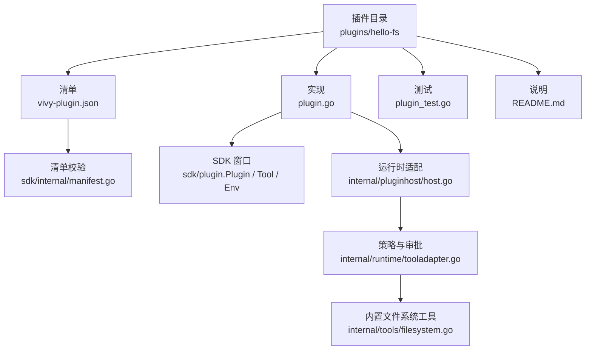
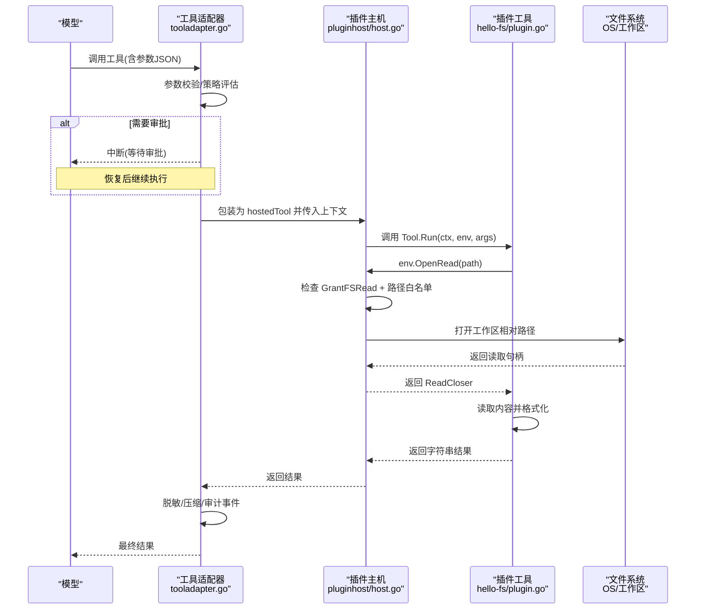
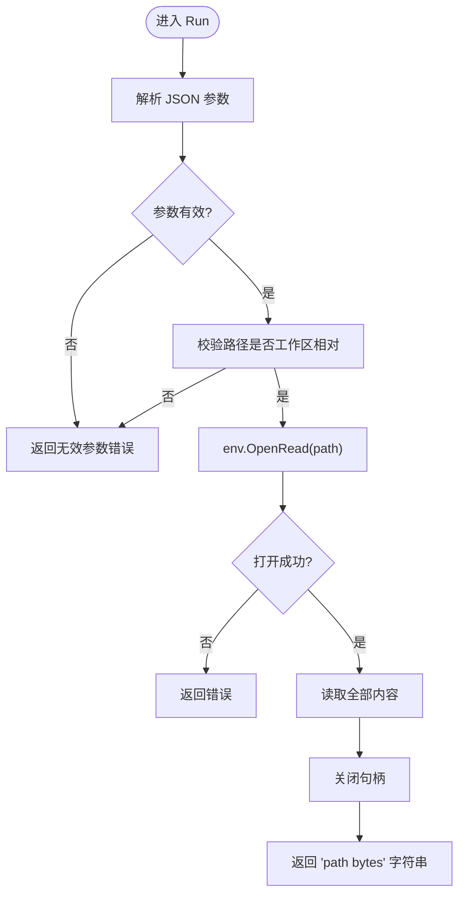
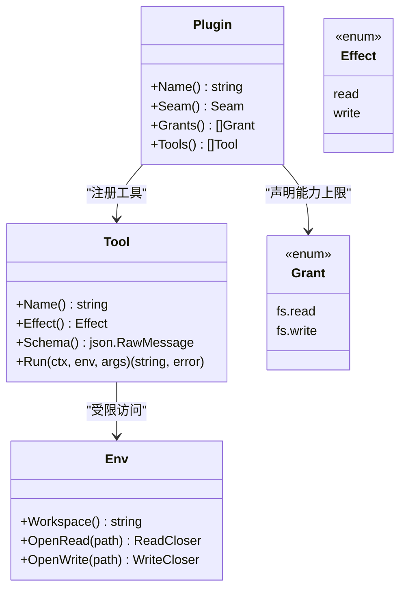
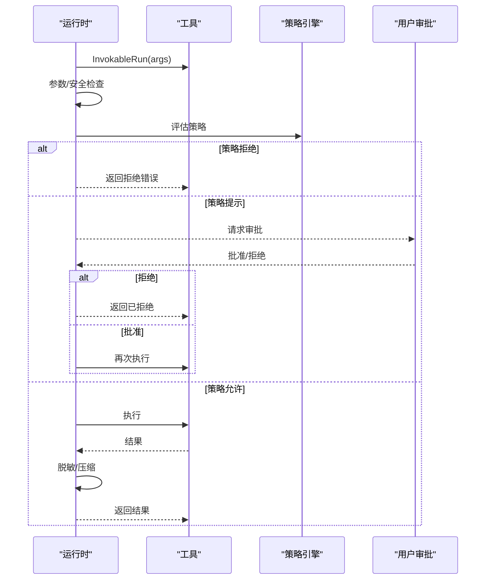
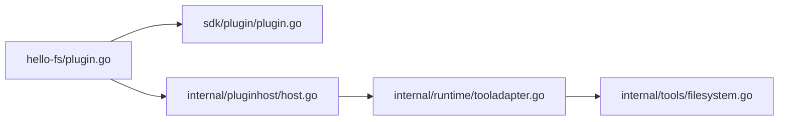

# 示例插件

<cite>
**本文引用的文件**
- [plugins/hello-fs/plugin.go](file://plugins/hello-fs/plugin.go)
- [plugins/hello-fs/vivy-plugin.json](file://plugins/hello-fs/vivy-plugin.json)
- [plugins/hello-fs/README.md](file://plugins/hello-fs/README.md)
- [plugins/hello-fs/plugin_test.go](file://plugins/hello-fs/plugin_test.go)
- [sdk/plugin/plugin.go](file://sdk/plugin/plugin.go)
- [sdk/internal/manifest.go](file://sdk/internal/manifest.go)
- [sdk/internal/pack.go](file://sdk/internal/pack.go)
- [internal/pluginhost/host.go](file://internal/pluginhost/host.go)
- [internal/runtime/tooladapter.go](file://internal/runtime/tooladapter.go)
- [internal/tools/filesystem.go](file://internal/tools/filesystem.go)
- [docs/architecture/VIVY-PLUGIN-SPEC.md](file://docs/architecture/VIVY-PLUGIN-SPEC.md)
</cite>

## 目录
1. [简介](#简介)
2. [项目结构](#项目结构)
3. [核心组件](#核心组件)
4. [架构总览](#架构总览)
5. [详细组件分析](#详细组件分析)
6. [依赖关系分析](#依赖关系分析)
7. [性能与限制](#性能与限制)
8. [故障排查指南](#故障排查指南)
9. [结论](#结论)
10. [附录：安装、启用与配置流程](#附录安装启用与配置流程)

## 简介
本章节以 hello-fs 插件为蓝本，系统讲解 Vivy 插件开发的完整过程。内容涵盖插件结构（主程序入口、工具实现、配置文件）、清单 vivy-plugin.json 的字段含义、文件系统权限控制机制（Grant 枚举）、插件打包与装配流程、调试与测试策略，以及常见问题与优化建议。读者无需深入内核即可理解如何从零开发一个安全、可审计、可版本化的用户插件。

## 项目结构
hello-fs 是一个最小可用的“工具世界”插件，仅暴露一个只读工具 hello_stat，通过 sdk/plugin.Env 在运行工作区内读取文件。其目录组织遵循规范：每个插件位于 plugins/<name>/，包含清单、实现、测试与说明文档。

图表来源
- [plugins/hello-fs/plugin.go:1-65](file://plugins/hello-fs/plugin.go#L1-L65)
- [plugins/hello-fs/vivy-plugin.json:1-21](file://plugins/hello-fs/vivy-plugin.json#L1-L21)
- [sdk/internal/manifest.go:38-95](file://sdk/internal/manifest.go#L38-L95)
- [internal/pluginhost/host.go:22-166](file://internal/pluginhost/host.go#L22-L166)
- [internal/runtime/tooladapter.go:24-184](file://internal/runtime/tooladapter.go#L24-L184)
- [internal/tools/filesystem.go:13-104](file://internal/tools/filesystem.go#L13-L104)

章节来源
- [plugins/hello-fs/README.md:1-15](file://plugins/hello-fs/README.md#L1-L15)
- [docs/architecture/VIVY-PLUGIN-SPEC.md:29-83](file://docs/architecture/VIVY-PLUGIN-SPEC.md#L29-L83)

## 核心组件
- 插件接口与能力边界：由 sdk/plugin 提供 Plugin、Tool、Env、Seam、Grant、Effect 等类型与常量，是插件唯一允许的导入窗口。
- 清单契约：vivy-plugin.json 声明插件身份、seam、grants、tools 及 schema，供 SDK verify/pack 校验与装配。
- 运行时适配：internal/pluginhost 将插件工具桥接到 Vivy 工具体系，并基于 Grants 进行资源访问控制。
- 策略与审批：internal/runtime/tooladapter 负责参数校验、策略评估、计划模式拦截、审批中断与结果压缩。
- 内置文件系统工具：internal/tools/filesystem 提供 read_file、search_files、write_file、patch 等工具，作为对比参考。

章节来源
- [sdk/plugin/plugin.go:12-88](file://sdk/plugin/plugin.go#L12-L88)
- [sdk/internal/manifest.go:21-95](file://sdk/internal/manifest.go#L21-L95)
- [internal/pluginhost/host.go:22-166](file://internal/pluginhost/host.go#L22-L166)
- [internal/runtime/tooladapter.go:24-184](file://internal/runtime/tooladapter.go#L24-L184)
- [internal/tools/filesystem.go:13-104](file://internal/tools/filesystem.go#L13-L104)

## 架构总览
下图展示了从模型调用到插件工具执行的端到端路径，包括策略评估、审批流、权限检查与结果输出。

图表来源
- [internal/runtime/tooladapter.go:78-184](file://internal/runtime/tooladapter.go#L78-L184)
- [internal/pluginhost/host.go:57-142](file://internal/pluginhost/host.go#L57-L142)
- [plugins/hello-fs/plugin.go:39-56](file://plugins/hello-fs/plugin.go#L39-L56)

## 详细组件分析

### 插件实现：hello-fs
- 插件元信息：Name 为 hello-fs；Seam 为 tool-world；Grants 仅申请 fs.read。
- 工具定义：hello_stat，Effect 为 read，Schema 要求 path 为必填字符串。
- 执行逻辑：解析参数 -> 校验路径为工作区相对路径 -> 通过 env.OpenRead 读取 -> 返回路径与字节数。
- 安全约束：workspaceRel 拒绝绝对路径、反斜杠、前缀 “/” 与 “..”，防止越权访问。

图表来源
- [plugins/hello-fs/plugin.go:39-64](file://plugins/hello-fs/plugin.go#L39-L64)

章节来源
- [plugins/hello-fs/plugin.go:17-64](file://plugins/hello-fs/plugin.go#L17-L64)

### 清单文件：vivy-plugin.json
关键字段说明：
- apiVersion：当前固定为 vivy.plugin/v0。
- name：必须与目录名一致，且符合小写字母、数字、连字符命名规则。
- version：语义化版本，用于 Generation 出处记录。
- seam：当前为 tool-world，表示该插件以工具形式暴露给模型。
- module：Go 包路径，通常为 "."。
- grants：插件可申请的能力上限，如 fs.read、fs.write。
- tools：工具列表，每项包含 name、effect、description、schema；name 全局唯一。

校验规则由 SDK 清单校验器实现，包括 API 版本、名称格式、seam 白名单、module 必填、grants 有效性、至少一个工具、effect 合法、schema 为对象等。

章节来源
- [plugins/hello-fs/vivy-plugin.json:1-21](file://plugins/hello-fs/vivy-plugin.json#L1-L21)
- [sdk/internal/manifest.go:38-95](file://sdk/internal/manifest.go#L38-L95)
- [docs/architecture/VIVY-PLUGIN-SPEC.md:47-83](file://docs/architecture/VIVY-PLUGIN-SPEC.md#L47-L83)

### 权限控制：Grant 与 Env
- Grant 枚举：fs.read、fs.write，决定插件对文件系统的能力范围。
- Env 接口：Workspace()、OpenRead(path)、OpenWrite(path)。缺失权限时直接失败关闭。
- 路径解析与隔离：pluginhost 会拒绝绝对路径、反斜杠、前导 “/”、“..” 等危险路径，并将相对路径映射到当前运行工作区根目录下，避免逃逸。

图表来源
- [sdk/plugin/plugin.go:12-88](file://sdk/plugin/plugin.go#L12-L88)
- [internal/pluginhost/host.go:76-142](file://internal/pluginhost/host.go#L76-L142)

章节来源
- [sdk/plugin/plugin.go:29-82](file://sdk/plugin/plugin.go#L29-L82)
- [internal/pluginhost/host.go:76-142](file://internal/pluginhost/host.go#L76-L142)

### 运行时策略与审批
- 参数与安全校验：在工具执行前进行严格校验，防止非法输入。
- 策略评估：根据策略引擎决定是否允许、提示或拒绝。
- 计划模式保护：在 Plan Mode 下拒绝 effectful 工具，避免误改。
- 审批中断：首次执行 effectful 工具时中断，等待人工批准后再恢复执行。
- 结果处理：对工具输出进行脱敏与长度压缩，避免大输出影响模型上下文。

图表来源
- [internal/runtime/tooladapter.go:78-184](file://internal/runtime/tooladapter.go#L78-L184)

章节来源
- [internal/runtime/tooladapter.go:18-184](file://internal/runtime/tooladapter.go#L18-L184)

### 内置文件系统工具（对比参考）
- read_file：按行范围与最大字节限制读取文本文件。
- search_files：在工作区内搜索匹配文本，支持 glob、大小写等选项。
- write_file：写入文件，需审批。
- patch：精确替换文本，需审批。
这些工具通过 FileOperations 接口与后端交互，体现读写分离与审批流程。

章节来源
- [internal/tools/filesystem.go:13-104](file://internal/tools/filesystem.go#L13-L104)
- [internal/tools/filesystem.go:119-300](file://internal/tools/filesystem.go#L119-L300)

## 依赖关系分析
- 插件层：hello-fs 仅依赖 sdk/plugin，不引入 internal 或 eino。
- 适配层：pluginhost 将插件工具转换为 Vivy 工具，并注入工作区查找与权限检查。
- 运行时层：tooladapter 负责策略、审批、结果处理。
- 工具层：filesystem 提供内置工具，作为扩展能力的参考实现。

图表来源
- [plugins/hello-fs/plugin.go:1-65](file://plugins/hello-fs/plugin.go#L1-L65)
- [sdk/plugin/plugin.go:12-88](file://sdk/plugin/plugin.go#L12-L88)
- [internal/pluginhost/host.go:22-166](file://internal/pluginhost/host.go#L22-L166)
- [internal/runtime/tooladapter.go:24-184](file://internal/runtime/tooladapter.go#L24-L184)
- [internal/tools/filesystem.go:13-104](file://internal/tools/filesystem.go#L13-L104)

章节来源
- [docs/architecture/VIVY-PLUGIN-SPEC.md:204-221](file://docs/architecture/VIVY-PLUGIN-SPEC.md#L204-L221)

## 性能与限制
- 结果压缩：工具输出会被截断并保留首尾片段，避免大响应阻塞模型上下文。
- 只读优先：hello-fs 仅申请 fs.read，减少审批与副作用风险。
- 路径白名单：严格的工作区相对路径校验，避免不必要的 I/O 与安全风险。
- 策略前置：在执行前完成参数与策略评估，尽早失败，降低无效计算。

[本节为通用指导，不直接分析具体文件]

## 故障排查指南
- 清单校验失败：检查 apiVersion、name 与目录一致性、version 格式、seam 白名单、grants 合法性、tools 非空与 schema 对象。
- 权限被拒：确认插件 Grants 是否包含所需能力；若使用 OpenWrite，需申请 fs.write。
- 路径非法：确保 path 为工作区相对路径，不包含绝对路径、反斜杠、前导 “/” 或 “..”。
- 策略拒绝：查看策略评估结果与原因；必要时调整策略或参数。
- 计划模式拒绝：effectful 工具在 Plan Mode 下不可执行，切换到执行模式或改为只读操作。
- 结果过大：关注工具输出压缩标记；可在插件侧限制读取大小或分段输出。

章节来源
- [sdk/internal/manifest.go:50-95](file://sdk/internal/manifest.go#L50-L95)
- [internal/pluginhost/host.go:76-142](file://internal/pluginhost/host.go#L76-L142)
- [internal/runtime/tooladapter.go:18-184](file://internal/runtime/tooladapter.go#L18-L184)

## 结论
hello-fs 展示了 Vivy 插件的最小可行形态：通过 sdk/plugin 暴露工具，借助清单声明能力与契约，由运行时进行策略与审批控制，并以工作区隔离保障安全。按照规范进行验证、打包与装配，可实现可审计、可版本化、可回滚的用户能力扩展。

[本节为总结性内容，不直接分析具体文件]

## 附录：安装、启用与配置流程
- 开发验证：在插件目录执行 vivy-sdk verify，检查清单与代码契约。
- 打包生成：使用 vivy-sdk pack --with hello-fs 生成新一代 EXE，产物包含 generation.json 与二进制。
- 检查产物：通过 vivy-sdk inspect-artifact dist/gen-... 查看插件名、版本、seam、grants 与源哈希。
- 运行与观察：启动生成的 EXE，模型可通过工具界面调用 hello_stat；如需写入，需在清单中申请 fs.write 并在工具中实现 OpenWrite。
- 调试方法：
  - 单元测试：在插件目录编写测试，模拟 Env 行为，覆盖正常与异常路径。
  - 集成测试：在物种测试中拉起 Register()，验证策略、审批与结果压缩。
  - 日志与审计：关注策略评估事件与工具调用钩子，定位问题。
- 常见错误：
  - 清单字段不合法：修正 name、version、seam、grants、tools.schema。
  - 路径越界：确保相对路径并通过 workspaceRel 校验。
  - 策略拒绝：调整策略或参数，或在执行模式下运行 effectful 工具。

章节来源
- [plugins/hello-fs/README.md:6-15](file://plugins/hello-fs/README.md#L6-L15)
- [sdk/internal/pack.go:67-199](file://sdk/internal/pack.go#L67-L199)
- [docs/architecture/VIVY-PLUGIN-SPEC.md:158-183](file://docs/architecture/VIVY-PLUGIN-SPEC.md#L158-L183)
- [plugins/hello-fs/plugin_test.go:31-55](file://plugins/hello-fs/plugin_test.go#L31-L55)