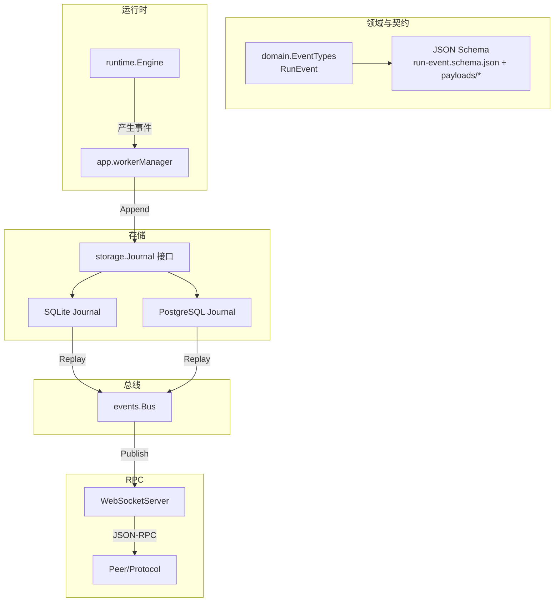
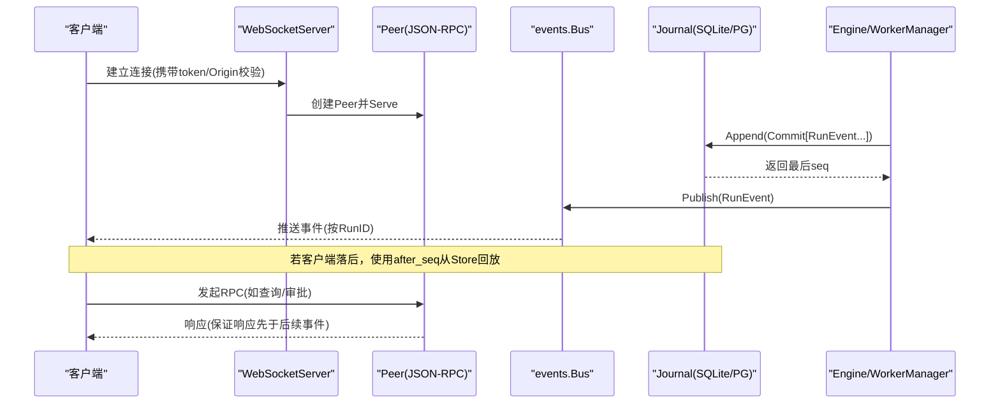
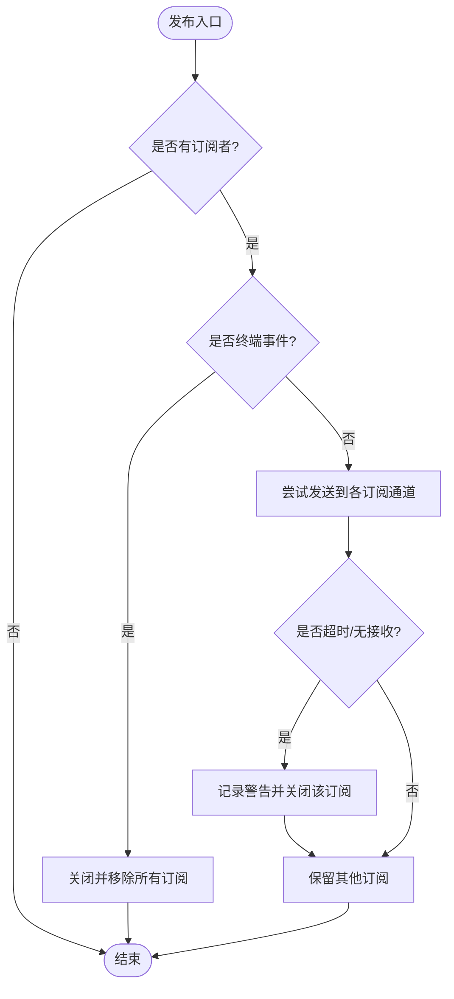
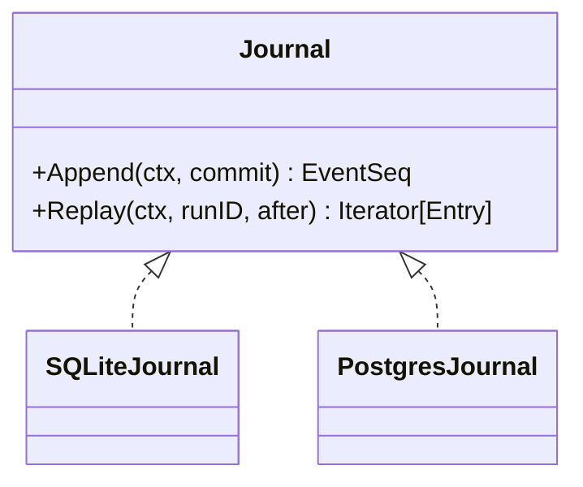
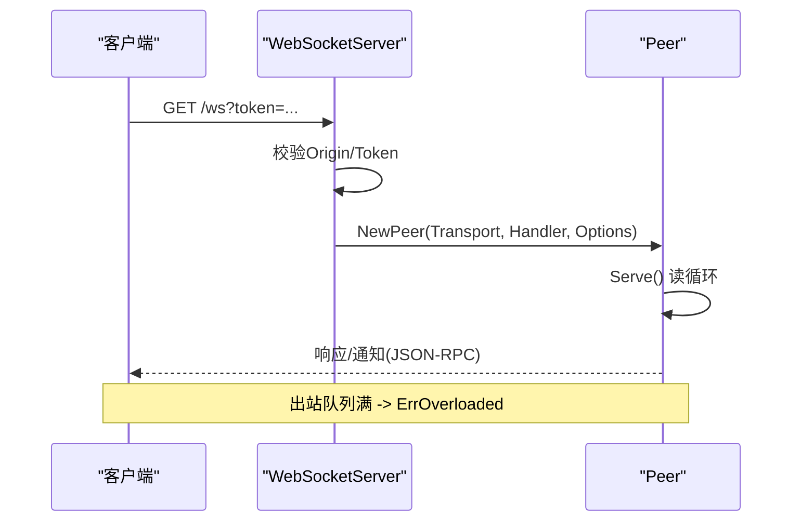
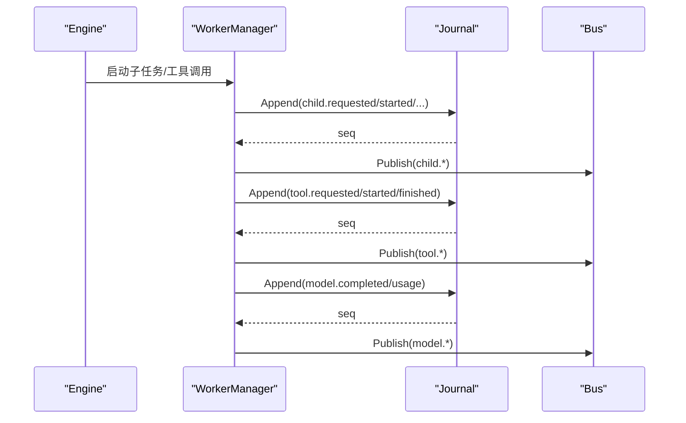
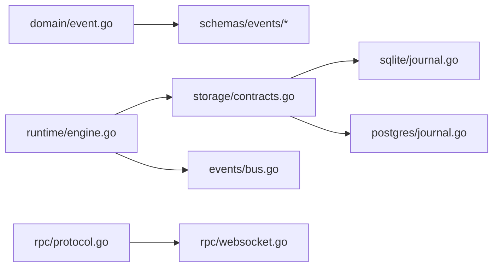

# 事件系统架构

<cite>
**本文引用的文件**
- [internal/events/bus.go](file://internal/events/bus.go)
- [internal/domain/event.go](file://internal/domain/event.go)
- [schemas/events/run-event.schema.json](file://schemas/events/run-event.schema.json)
- [schemas/events/payloads/run.started.json](file://schemas/events/payloads/run.started.json)
- [schemas/events/payloads/model.delta.json](file://schemas/events/payloads/model.delta.json)
- [schemas/events/payloads/tool.requested.json](file://schemas/events/payloads/tool.requested.json)
- [internal/rpc/websocket.go](file://internal/rpc/websocket.go)
- [internal/rpc/protocol.go](file://internal/rpc/protocol.go)
- [internal/storage/contracts.go](file://internal/storage/contracts.go)
- [internal/storage/sqlite/journal.go](file://internal/storage/sqlite/journal.go)
- [internal/storage/postgres/journal.go](file://internal/storage/postgres/journal.go)
- [internal/runtime/engine.go](file://internal/runtime/engine.go)
- [internal/app/worker.go](file://internal/app/worker.go)
</cite>

## 目录
1. [简介](#简介)
2. [项目结构](#项目结构)
3. [核心组件](#核心组件)
4. [架构总览](#架构总览)
5. [详细组件分析](#详细组件分析)
6. [依赖关系分析](#依赖关系分析)
7. [性能考量](#性能考量)
8. [故障排查指南](#故障排查指南)
9. [结论](#结论)
10. [附录](#附录)

## 简介
本文件系统化阐述 Agent-Vivy 的事件系统架构，覆盖事件总线、发布订阅、断线重连与事件回放、事件类型与消息格式、Schema 校验、WebSocket 实时通信、心跳与路由策略、事件溯源与不可变日志、状态重建、事件过滤/聚合/转换、监控调试与性能优化，以及事件驱动编程的最佳实践与常见模式。

## 项目结构
事件系统由以下层次构成：
- 领域层：定义事件类型、终态判定、RunEvent 结构体
- 存储层：Journal 接口与 SQLite/Postgres 实现，提供追加与按游标回放
- 总线层：内存 Bus 将持久化事件广播给在线订阅者
- RPC 层：JSON-RPC 协议与 WebSocket 传输，承载控制面与事件流
- 运行时层：Engine 与 WorkerManager 在运行期产生并记录事件
- 契约层：JSON Schema 规范约束事件信封与负载形状

图表来源
- [internal/domain/event.go:1-129](file://internal/domain/event.go#L1-L129)
- [schemas/events/run-event.schema.json:1-76](file://schemas/events/run-event.schema.json#L1-L76)
- [internal/storage/contracts.go:55-64](file://internal/storage/contracts.go#L55-L64)
- [internal/storage/sqlite/journal.go:14-86](file://internal/storage/sqlite/journal.go#L14-L86)
- [internal/storage/postgres/journal.go:14-90](file://internal/storage/postgres/journal.go#L14-L90)
- [internal/events/bus.go:10-115](file://internal/events/bus.go#L10-L115)
- [internal/rpc/websocket.go:12-56](file://internal/rpc/websocket.go#L12-L56)
- [internal/rpc/protocol.go:18-374](file://internal/rpc/protocol.go#L18-L374)
- [internal/runtime/engine.go:18-166](file://internal/runtime/engine.go#L18-L166)
- [internal/app/worker.go:87-245](file://internal/app/worker.go#L87-L245)

章节来源
- [internal/domain/event.go:1-129](file://internal/domain/event.go#L1-L129)
- [schemas/events/run-event.schema.json:1-76](file://schemas/events/run-event.schema.json#L1-L76)
- [internal/storage/contracts.go:55-64](file://internal/storage/contracts.go#L55-L64)
- [internal/storage/sqlite/journal.go:14-86](file://internal/storage/sqlite/journal.go#L14-L86)
- [internal/storage/postgres/journal.go:14-90](file://internal/storage/postgres/journal.go#L14-L90)
- [internal/events/bus.go:10-115](file://internal/events/bus.go#L10-L115)
- [internal/rpc/websocket.go:12-56](file://internal/rpc/websocket.go#L12-L56)
- [internal/rpc/protocol.go:18-374](file://internal/rpc/protocol.go#L18-L374)
- [internal/runtime/engine.go:18-166](file://internal/runtime/engine.go#L18-L166)
- [internal/app/worker.go:87-245](file://internal/app/worker.go#L87-L245)

## 核心组件
- 事件类型与信封
  - 事件类型集合、终态判定、RunStatus 映射、RunEvent 结构体
  - JSON Schema 定义信封字段与枚举类型，payload 按 type 分文件约定
- 事件总线（Bus）
  - 基于 RunID 的发布订阅；终端事件关闭并清理订阅；慢消费者被丢弃并由回放恢复
- 事件存储（Journal）
  - Append 原子写入并分配连续 seq；严格“每运行恰好一个终态”不变式
  - Replay 支持 after_seq 游标增量回放
- RPC 与 WebSocket
  - WebSocket 鉴权与升级；Peer 实现 JSON-RPC 请求分发、响应排序、背压队列
- 运行时事件生产
  - Engine 暴露 Query/RunHistory/Resume；WorkerManager 在子任务生命周期中记录工具调用、审批、模型完成等事件

章节来源
- [internal/domain/event.go:1-129](file://internal/domain/event.go#L1-L129)
- [schemas/events/run-event.schema.json:1-76](file://schemas/events/run-event.schema.json#L1-L76)
- [internal/events/bus.go:10-115](file://internal/events/bus.go#L10-L115)
- [internal/storage/contracts.go:55-64](file://internal/storage/contracts.go#L55-L64)
- [internal/storage/sqlite/journal.go:14-86](file://internal/storage/sqlite/journal.go#L14-L86)
- [internal/storage/postgres/journal.go:14-90](file://internal/storage/postgres/journal.go#L14-L90)
- [internal/rpc/websocket.go:12-56](file://internal/rpc/websocket.go#L12-L56)
- [internal/rpc/protocol.go:18-374](file://internal/rpc/protocol.go#L18-L374)
- [internal/runtime/engine.go:18-166](file://internal/runtime/engine.go#L18-L166)
- [internal/app/worker.go:87-245](file://internal/app/worker.go#L87-L245)

## 架构总览
事件系统遵循“持久化为唯一事实源”的原则：所有事件先入 Journal，再经 Bus 广播到在线订阅者；离线或掉线的客户端通过 after_seq 回放补齐。

图表来源
- [internal/rpc/websocket.go:27-47](file://internal/rpc/websocket.go#L27-L47)
- [internal/rpc/protocol.go:120-251](file://internal/rpc/protocol.go#L120-L251)
- [internal/storage/sqlite/journal.go:14-86](file://internal/storage/sqlite/journal.go#L14-L86)
- [internal/storage/postgres/journal.go:14-90](file://internal/storage/postgres/journal.go#L14-L90)
- [internal/events/bus.go:42-106](file://internal/events/bus.go#L42-L106)
- [internal/app/worker.go:135-171](file://internal/app/worker.go#L135-L171)

## 详细组件分析

### 事件类型与消息格式
- 事件类型
  - 涵盖 run、provider、model、tool、policy、hook、user、child 等全生命周期事件
  - 终态事件用于标记运行结束，且每个运行必须恰好一个终态
- 消息信封
  - run_id、seq、type、created_at、payload_version、payload
  - payload 按 type 对应 schemas/events/payloads/*.json 的 JSON Schema 约束
- 典型负载示例
  - run.started：包含 provider、model、mode、policy_profile、policy_hash
  - model.delta：增量文本片段
  - tool.requested：tool_call_id、tool_name、args

章节来源
- [internal/domain/event.go:8-129](file://internal/domain/event.go#L8-L129)
- [schemas/events/run-event.schema.json:1-76](file://schemas/events/run-event.schema.json#L1-L76)
- [schemas/events/payloads/run.started.json:1-35](file://schemas/events/payloads/run.started.json#L1-L35)
- [schemas/events/payloads/model.delta.json:1-15](file://schemas/events/payloads/model.delta.json#L1-L15)
- [schemas/events/payloads/tool.requested.json:1-23](file://schemas/events/payloads/tool.requested.json#L1-L23)

### 事件总线与发布订阅
- 订阅
  - Subscribe(runID) 返回通道与取消函数；通道带缓冲，避免瞬时阻塞
- 发布
  - Publish(ev) 向该 run 的所有订阅者发送；遇到终端事件则关闭并移除订阅
  - 慢消费者会被丢弃并记录告警；恢复路径为从 Journal 回放
- 设计要点
  - 总线不拥有历史，仅做实时 fan-out；最终一致性由 Journal 保障

图表来源
- [internal/events/bus.go:42-106](file://internal/events/bus.go#L42-L106)

章节来源
- [internal/events/bus.go:10-115](file://internal/events/bus.go#L10-L115)

### 事件存储与回放（事件溯源）
- 追加
  - Append(commit) 原子写入，分配连续 seq；拒绝空提交与多终态提交；已关闭的运行拒绝追加
- 回放
  - Replay(runID, after) 按 seq 递增顺序流式返回事件，支持增量回放
- 不变式
  - 每运行恰好一个终态；seq 单调连续；payload_version 用于负载版本演进

图表来源
- [internal/storage/contracts.go:55-64](file://internal/storage/contracts.go#L55-L64)
- [internal/storage/sqlite/journal.go:14-86](file://internal/storage/sqlite/journal.go#L14-L86)
- [internal/storage/postgres/journal.go:14-90](file://internal/storage/postgres/journal.go#L14-L90)

章节来源
- [internal/storage/contracts.go:55-64](file://internal/storage/contracts.go#L55-L64)
- [internal/storage/sqlite/journal.go:14-86](file://internal/storage/sqlite/journal.go#L14-L86)
- [internal/storage/postgres/journal.go:14-90](file://internal/storage/postgres/journal.go#L14-L90)

### WebSocket 实时通信与消息路由
- 连接建立
  - Origin 校验、Token 校验（URL 参数或 Authorization: Bearer）
  - 升级为 WebSocket 后创建 Peer 并启动服务循环
- 协议与路由
  - JSON-RPC v2.0；方法/参数/错误统一编码
  - AfterResponse 确保“响应先于后续事件”的顺序性
  - 出站队列有界，满时返回过载错误以保护服务端
- 心跳机制
  - 当前实现未内置应用层心跳；可通过 JSON-RPC Notify 自定义心跳帧

图表来源
- [internal/rpc/websocket.go:27-56](file://internal/rpc/websocket.go#L27-L56)
- [internal/rpc/protocol.go:120-251](file://internal/rpc/protocol.go#L120-L251)

章节来源
- [internal/rpc/websocket.go:27-56](file://internal/rpc/websocket.go#L27-L56)
- [internal/rpc/protocol.go:120-251](file://internal/rpc/protocol.go#L120-L251)

### 事件生产与生命周期（运行时）
- Engine
  - 封装 Eino Runner，启用流式；可配置最大上下文、工具结果大小、检查点桥接等
  - Query/RunHistory/Resume 暴露运行入口
- WorkerManager
  - 管理父子运行树；在子任务生命周期中记录 child.*、tool.*、model.*、approval.* 等事件
  - 审批与问题交互：创建待决审批、等待决策、恢复子任务并记录 resumed/suspended 事件

图表来源
- [internal/runtime/engine.go:61-166](file://internal/runtime/engine.go#L61-L166)
- [internal/app/worker.go:135-245](file://internal/app/worker.go#L135-L245)
- [internal/storage/sqlite/journal.go:14-86](file://internal/storage/sqlite/journal.go#L14-L86)
- [internal/events/bus.go:42-106](file://internal/events/bus.go#L42-L106)

章节来源
- [internal/runtime/engine.go:61-166](file://internal/runtime/engine.go#L61-L166)
- [internal/app/worker.go:135-245](file://internal/app/worker.go#L135-L245)

### 事件过滤、聚合与转换
- 过滤
  - 客户端可按 RunID 订阅；RPC 侧可用 after_seq 过滤历史事件
- 聚合
  - UI/上层可将 model.delta 聚合成完整输出；将 tool.* 与 approval.* 关联为一次工具调用流程
- 转换
  - 根据 payload_version 进行向后兼容转换；对敏感字段脱敏后再转发或落盘

章节来源
- [internal/events/bus.go:42-106](file://internal/events/bus.go#L42-L106)
- [internal/storage/sqlite/journal.go:77-86](file://internal/storage/sqlite/journal.go#L77-L86)
- [schemas/events/run-event.schema.json:63-73](file://schemas/events/run-event.schema.json#L63-L73)

### 断线重连与事件回放
- 断线处理
  - 连接断开后，客户端重新建立 WebSocket；使用上次看到的 seq 调用 Replay 获取增量
- 一致性保证
  - Journal 保证 seq 单调连续；Bus 丢弃慢消费者不影响数据完整性

章节来源
- [internal/storage/sqlite/journal.go:77-86](file://internal/storage/sqlite/journal.go#L77-L86)
- [internal/events/bus.go:62-74](file://internal/events/bus.go#L62-L74)

## 依赖关系分析
- 低耦合
  - 领域类型与 JSON Schema 解耦；存储抽象为接口，SQLite/Postgres 可替换
  - 总线与存储分离，总线只负责实时广播
- 外部依赖
  - RPC 使用 gorilla/websocket；Eino 仅在 runtime 与 provider 内使用（符合架构红线）
- 潜在环
  - 通过接口与包边界避免循环依赖；测试套件验证序列一致性与终态不变式

图表来源
- [internal/domain/event.go:1-129](file://internal/domain/event.go#L1-L129)
- [internal/runtime/engine.go:18-166](file://internal/runtime/engine.go#L18-L166)
- [internal/storage/contracts.go:55-64](file://internal/storage/contracts.go#L55-L64)
- [internal/storage/sqlite/journal.go:14-86](file://internal/storage/sqlite/journal.go#L14-L86)
- [internal/storage/postgres/journal.go:14-90](file://internal/storage/postgres/journal.go#L14-L90)
- [internal/events/bus.go:10-115](file://internal/events/bus.go#L10-L115)
- [internal/rpc/protocol.go:18-374](file://internal/rpc/protocol.go#L18-L374)
- [internal/rpc/websocket.go:12-56](file://internal/rpc/websocket.go#L12-L56)

章节来源
- [internal/storage/contracts.go:55-64](file://internal/storage/contracts.go#L55-L64)
- [internal/rpc/protocol.go:18-374](file://internal/rpc/protocol.go#L18-L374)

## 性能考量
- 背压与缓冲
  - Bus 订阅通道缓冲、Peer 出站队列有界，防止雪崩
  - EngineConfig.StreamBuffer、MaxEventPayloadBytes 限制事件体积与并发度
- I/O 与序列化
  - Journal 批量 Append 减少事务开销；Replay 流式迭代降低内存占用
- 资源隔离
  - 子任务限制深度与并发；工具结果与上下文大小受限，避免上下文溢出

章节来源
- [internal/events/bus.go:34-40](file://internal/events/bus.go#L34-L40)
- [internal/rpc/protocol.go:70-83](file://internal/rpc/protocol.go#L70-L83)
- [internal/runtime/engine.go:18-46](file://internal/runtime/engine.go#L18-L46)
- [internal/storage/sqlite/journal.go:14-86](file://internal/storage/sqlite/journal.go#L14-L86)

## 故障排查指南
- 常见问题
  - 客户端丢失事件：检查 after_seq 是否正确传递；确认 Replay 游标
  - 连接被拒：检查 Origin 与 Token；确认鉴权逻辑
  - 过载错误：关注 ErrOverloaded，适当增大 OutgoingBuffer 或优化消费速度
  - 终态冲突：确保每个运行仅产生一个终态事件
- 诊断建议
  - 观察 Bus.Subscribers 数量变化
  - 查看 Journal 回放序列是否连续
  - 核对 payload_version 与 Schema 兼容性

章节来源
- [internal/events/bus.go:108-115](file://internal/events/bus.go#L108-L115)
- [internal/rpc/websocket.go:27-56](file://internal/rpc/websocket.go#L27-L56)
- [internal/rpc/protocol.go:257-273](file://internal/rpc/protocol.go#L257-L273)
- [internal/storage/sqlite/journal.go:14-86](file://internal/storage/sqlite/journal.go#L14-L86)

## 结论
Vivy 事件系统以“持久化优先、实时为辅”的设计，结合严格的 Schema 与不变式，实现了高可靠的事件溯源与回放能力。Bus 提供高效实时分发，Journal 保证一致性与可恢复性；RPC 层提供稳定可控的传输与路由。配合合理的缓冲与限流策略，可在大规模场景下保持稳健性能。

## 附录
- 最佳实践
  - 始终先写 Journal，再发总线；客户端用 after_seq 回放补齐
  - 对 payload 进行版本化管理与脱敏；对超大负载进行分片或压缩
  - 使用终态事件明确运行边界；避免重复终态
  - 在 RPC 中使用 AfterResponse 保证响应先于事件
- 常见模式
  - 增量同步：订阅 + after_seq 回放
  - 审批流：tool.approval_required → 用户决策 → tool.approval_decided → 继续执行
  - 子任务编排：child.requested/started/resumed/completed/failed/cancelled 串联父级状态