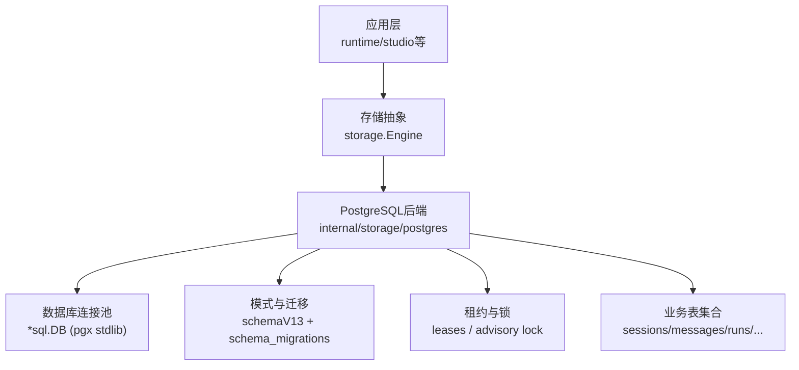
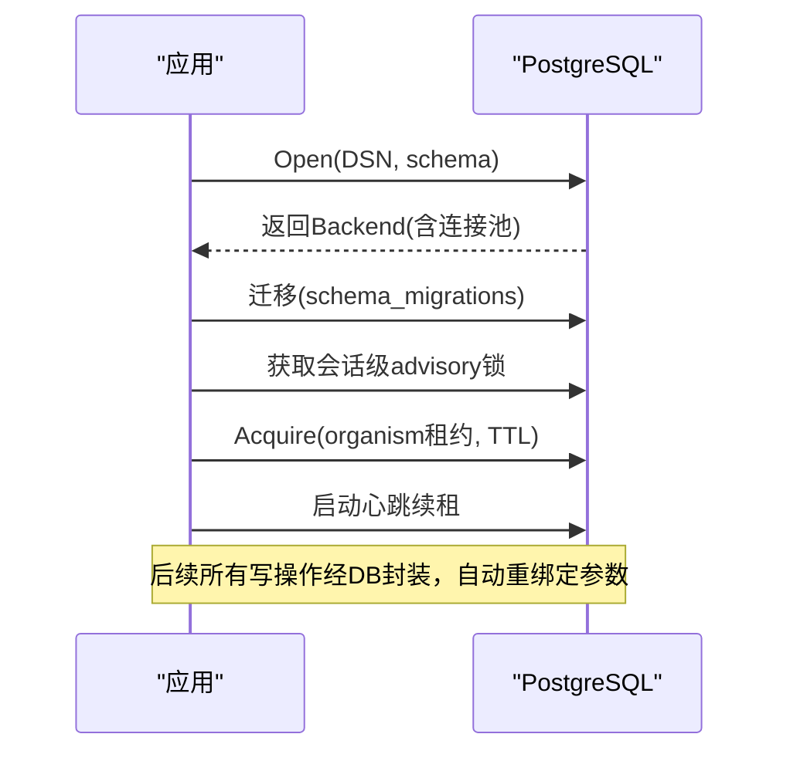
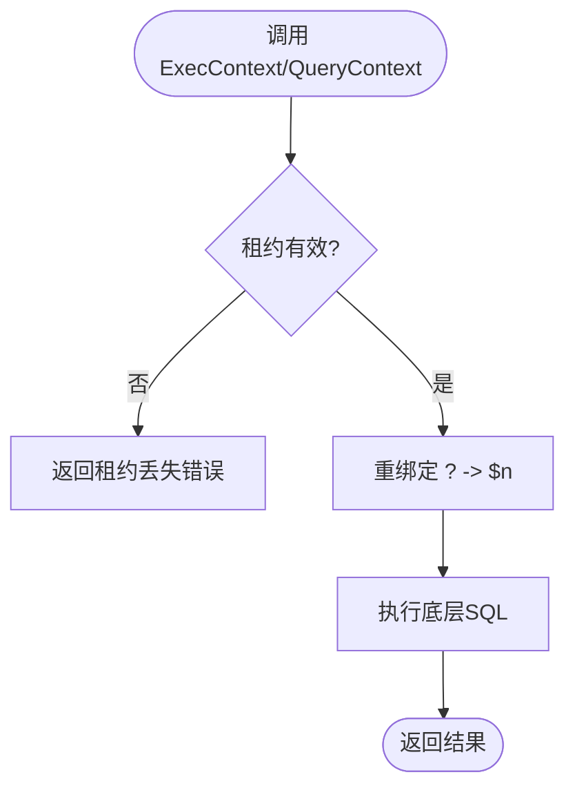
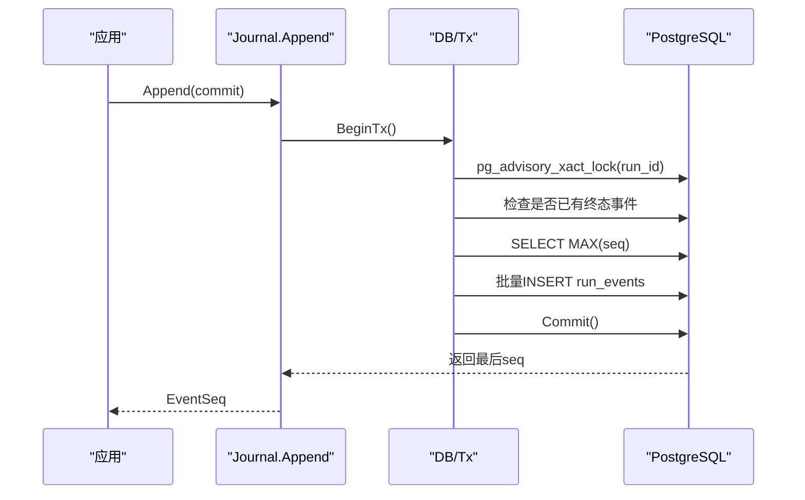
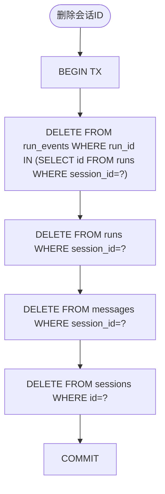
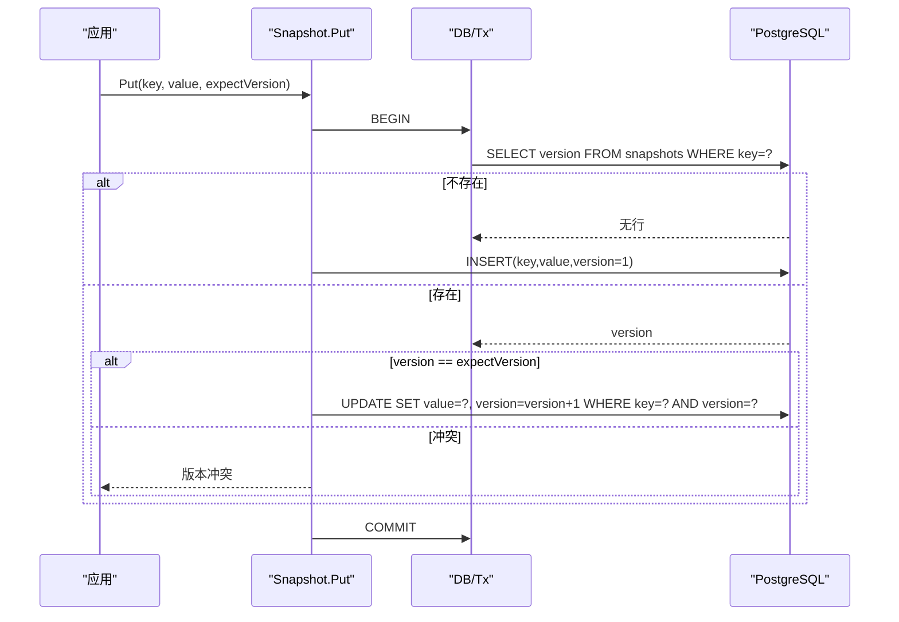
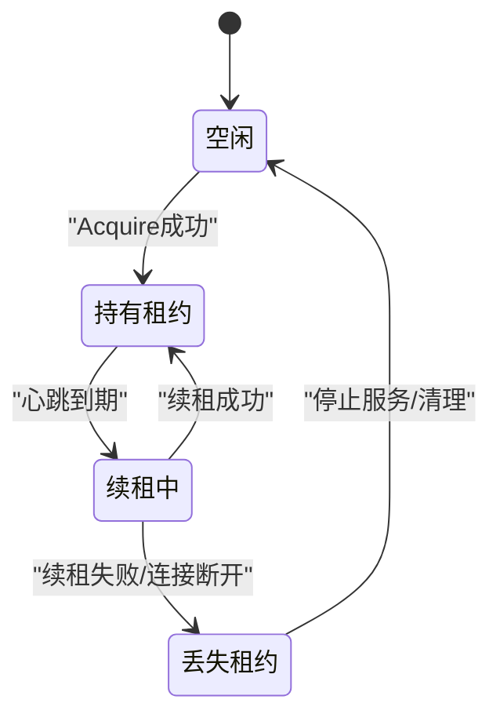
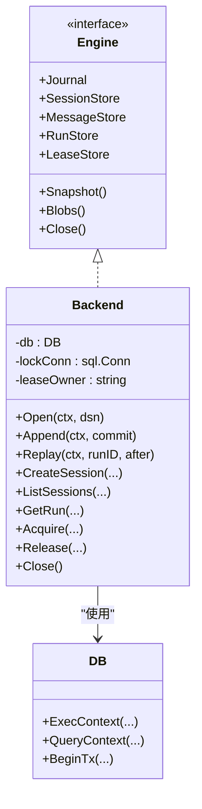

# PostgreSQL后端实现

<cite>
**本文引用的文件**
- [postgres.go](file://internal/storage/postgres/postgres.go)
- [schema.go](file://internal/storage/postgres/schema.go)
- [db.go](file://internal/storage/postgres/db.go)
- [journal.go](file://internal/storage/postgres/journal.go)
- [sessions.go](file://internal/storage/postgres/sessions.go)
- [messages.go](file://internal/storage/postgres/messages.go)
- [runs.go](file://internal/storage/postgres/runs.go)
- [lease.go](file://internal/storage/postgres/lease.go)
- [snapshot.go](file://internal/storage/postgres/snapshot.go)
- [contracts.go](file://internal/storage/contracts.go)
- [config.postgres.yaml](file://docker/config.postgres.yaml)
- [docker-compose.postgres.yml](file://docker-compose.postgres.yml)
</cite>

## 目录
1. [简介](#简介)
2. [项目结构](#项目结构)
3. [核心组件](#核心组件)
4. [架构总览](#架构总览)
5. [详细组件分析](#详细组件分析)
6. [依赖关系分析](#依赖关系分析)
7. [性能与容量规划](#性能与容量规划)
8. [故障排查指南](#故障排查指南)
9. [结论](#结论)

## 简介
本文件面向Agent-Vivy的PostgreSQL后端实现，聚焦生产环境的可靠性、可扩展性与可维护性。文档从连接池与事务隔离、并发控制、表结构与索引优化、事件日志高并发写入、会话查询优化、集群与高可用、以及监控告警与容量规划等方面展开说明，帮助读者理解并正确部署、调优该后端。

## 项目结构
PostgreSQL后端位于 internal/storage/postgres 包，提供统一的存储引擎接口（Engine），并通过 schema 初始化、迁移、租约与锁机制保证单实例独占运行。配置通过 docker/config.postgres.yaml 与 docker-compose.postgres.yml 注入DSN与环境变量。

图表来源
- [postgres.go:46-110](file://internal/storage/postgres/postgres.go#L46-L110)
- [schema.go:1-200](file://internal/storage/postgres/schema.go#L1-L200)
- [db.go:13-58](file://internal/storage/postgres/db.go#L13-L58)

章节来源
- [postgres.go:46-110](file://internal/storage/postgres/postgres.go#L46-L110)
- [config.postgres.yaml:1-19](file://docker/config.postgres.yaml#L1-L19)
- [docker-compose.postgres.yml:1-35](file://docker-compose.postgres.yml#L1-L35)

## 核心组件
- 后端入口与生命周期：Open/OpenSchema 负责解析DSN、创建schema、初始化连接池、执行迁移、获取会话级排他锁、申请organism租约并启动心跳续租；Close释放租约与连接。
- 连接封装：DB/Tx 包装 *sql.DB/*sql.Tx，统一将占位符 ? 重绑定为 $n，并在租约丢失时快速失败。
- 事件日志：Append 在事务内使用行级排他锁确保同一run追加顺序与“恰好一个终态事件”不变式；Replay 按seq流式回放。
- 会话/消息/运行：会话CRUD、消息追加与列表、运行状态机持久化与树形遍历。
- 快照与乐观并发：SnapshotStore 以version字段实现乐观并发更新。
- 租约：leases表+过期时间实现分布式租约；进程级advisory lock用于会话级互斥。

章节来源
- [postgres.go:46-110](file://internal/storage/postgres/postgres.go#L46-L110)
- [db.go:13-108](file://internal/storage/postgres/db.go#L13-L108)
- [journal.go:14-79](file://internal/storage/postgres/journal.go#L14-L79)
- [sessions.go:13-103](file://internal/storage/postgres/sessions.go#L13-L103)
- [messages.go:10-53](file://internal/storage/postgres/messages.go#L10-L53)
- [runs.go:15-127](file://internal/storage/postgres/runs.go#L15-L127)
- [snapshot.go:18-81](file://internal/storage/postgres/snapshot.go#L18-L81)
- [lease.go:9-45](file://internal/storage/postgres/lease.go#L9-L45)
- [contracts.go:11-31](file://internal/storage/contracts.go#L11-L31)

## 架构总览
PostgreSQL作为生产后端的核心优势：
- 连接池管理：基于pgx标准库封装，默认最大连接数可控，支持search_path隔离schema。
- 事务隔离级别：默认使用数据库默认隔离级别；关键路径通过行级锁与唯一约束保障一致性。
- 并发控制：
  - 进程级：advisory lock保证同一时刻仅一个进程持有会话锁。
  - 数据级：pg_advisory_xact_lock对run_id加事务级排他锁，避免并发追加冲突。
  - 租约：leases表+TTL+心跳续租，防止多实例同时成为主节点。

图表来源
- [postgres.go:46-110](file://internal/storage/postgres/postgres.go#L46-L110)
- [postgres.go:168-186](file://internal/storage/postgres/postgres.go#L168-L186)
- [postgres.go:192-220](file://internal/storage/postgres/postgres.go#L192-L220)
- [db.go:93-107](file://internal/storage/postgres/db.go#L93-L107)

## 详细组件分析

### 连接池与事务封装
- 连接池：使用pgx解析DSN，可选设置search_path隔离schema；默认最大连接数为固定值，可按需调整。
- 参数重绑定：DB/Tx在执行前将?替换为$1/$2…，兼容跨数据库驱动差异。
- 租约守卫：若租约丢失（fenced），所有读写直接返回错误，避免在失去主身份后继续写库。

图表来源
- [db.go:19-58](file://internal/storage/postgres/db.go#L19-L58)
- [db.go:93-107](file://internal/storage/postgres/db.go#L93-L107)

章节来源
- [postgres.go:59-80](file://internal/storage/postgres/postgres.go#L59-L80)
- [db.go:13-58](file://internal/storage/postgres/db.go#L13-L58)
- [db.go:93-107](file://internal/storage/postgres/db.go#L93-L107)

### 事件日志的高并发写入
- 追加流程：
  - 校验commit非空且至多一个终态事件。
  - 开启事务，对run_id加事务级排他锁。
  - 检查是否已有终态事件（已关闭则拒绝）。
  - 读取当前最大seq，连续分配新seq并批量插入。
  - 提交事务。
- 回放：按run_id与after游标顺序流式扫描，内存友好。

图表来源
- [journal.go:14-79](file://internal/storage/postgres/journal.go#L14-L79)

章节来源
- [journal.go:14-79](file://internal/storage/postgres/journal.go#L14-L79)
- [contracts.go:11-31](file://internal/storage/contracts.go#L11-L31)

### 会话管理与复杂查询优化
- 会话CRUD：新建、列出（按created_at倒序）、获取、重命名、删除（级联删除消息、运行、事件）。
- 消息追加：只追加不更新，列表按创建时间排序。
- 运行树查询：通过parent_run_id与root_run_id索引加速父子与整棵子树检索。

图表来源
- [sessions.go:70-103](file://internal/storage/postgres/sessions.go#L70-L103)

章节来源
- [sessions.go:13-103](file://internal/storage/postgres/sessions.go#L13-L103)
- [messages.go:10-53](file://internal/storage/postgres/messages.go#L10-L53)
- [runs.go:68-127](file://internal/storage/postgres/runs.go#L68-L127)

### 快照与乐观并发
- Get：读取key对应的value与version。
- Put：读当前version并与期望版本比较，一致则原子递增version并更新value；否则返回版本冲突错误。

图表来源
- [snapshot.go:18-81](file://internal/storage/postgres/snapshot.go#L18-L81)

章节来源
- [snapshot.go:18-81](file://internal/storage/postgres/snapshot.go#L18-L81)
- [contracts.go:11-31](file://internal/storage/contracts.go#L11-L31)

### 租约与会话锁
- 会话锁：使用advisory lock确保同一数据库在同一时刻只有一个进程能打开后端。
- 租约：leases表记录key/owner/expires_at；Acquire尝试更新或插入；心跳定时续租；Close时释放。

图表来源
- [postgres.go:168-220](file://internal/storage/postgres/postgres.go#L168-L220)
- [lease.go:9-45](file://internal/storage/postgres/lease.go#L9-L45)

章节来源
- [postgres.go:168-220](file://internal/storage/postgres/postgres.go#L168-L220)
- [lease.go:9-45](file://internal/storage/postgres/lease.go#L9-L45)

### 表结构与索引策略
- 会话与消息：sessions、messages，按session_id与created_at进行范围查询与排序。
- 运行：runs表包含parent_run_id与root_run_id，配合索引支持父子与整棵树检索。
- 事件日志：run_events以(run_id, seq)为主键，seq单调递增便于回放。
- 审批与问题：approvals、questions按status与expires_at建立复合索引，支撑待处理队列与过期扫描。
- 技能修订与待办：skill_revisions、todos按状态与位置建立索引，提升列表与排序效率。
- 评估与推广：eval_runs、promotions建立必要索引，支持按候选与阶段筛选。
- 工作室事件：studio_events使用自增主键，适合审计与回放。

注意：当前PostgreSQL实现未使用JSONB与GIN索引，而是采用BYTEA承载结构化负载；如需扩展JSON能力，可在未来版本引入JSONB列与GIN索引以提升条件查询性能。

章节来源
- [schema.go:6-199](file://internal/storage/postgres/schema.go#L6-L199)

## 依赖关系分析
- 对外暴露：storage.Engine接口定义统一契约，PostgreSQL后端实现该接口。
- 内部耦合：
  - postgres.Backend 组合 DB（封装sql.DB）与各功能模块（journal/sessions/messages/runs/snapshot/lease）。
  - 通过schema.go中的DDL一次性初始化所有表与索引。
  - 通过contracts.go中的错误类型统一错误语义。

图表来源
- [contracts.go:252-273](file://internal/storage/contracts.go#L252-L273)
- [postgres.go:30-44](file://internal/storage/postgres/postgres.go#L30-L44)
- [db.go:13-58](file://internal/storage/postgres/db.go#L13-L58)

章节来源
- [contracts.go:252-273](file://internal/storage/contracts.go#L252-L273)
- [postgres.go:30-44](file://internal/storage/postgres/postgres.go#L30-L44)
- [db.go:13-58](file://internal/storage/postgres/db.go#L13-L58)

## 性能与容量规划
- 连接池管理
  - 默认最大连接数固定，可根据QPS与CPU核数调整；建议结合pg_stat_statements观察热点语句。
  - 使用search_path隔离schema，便于测试与多租户隔离。
- 事务与并发
  - 事件追加使用事务级排他锁，避免竞态；在高并发场景下，建议合理拆分run_id分布，降低锁竞争。
  - 会话删除采用事务内级联删除，注意大会话删除时的锁持有时间，必要时分片或异步清理。
- 索引优化
  - 充分利用现有复合索引：runs(parent_run_id, created_at, id)、runs(root_run_id, created_at, id)、approvals(decision, expires_at, id)、questions(status, expires_at, id)、skill_revisions(status, created_at, id)、todos(session_id, position, id)。
  - 如引入JSONB字段，可为高频过滤条件建立GIN索引，但需权衡写入放大与空间开销。
- 物化视图与分区
  - 当前未使用物化视图与分区表；对于超大表（如run_events），可按run_id哈希分区或按时间范围分区，减少单表体积，提升维护与查询性能。
  - 物化视图可用于聚合报表（如按会话统计事件量、耗时），定期刷新。
- 集群与高可用
  - 推荐主从复制+只读副本：写主承担事件追加与状态变更，读副本承担列表与回放查询，缓解读压力。
  - 故障转移：使用PgBouncer/HAProxy做连接路由，配合健康检查与自动切换；应用侧需处理短暂断连重试。
  - 备份与恢复：启用WAL归档与时间点恢复（PITR），制定RPO/RTO目标。
- 监控告警
  - 指标：连接数、慢查询、锁等待、死锁、表膨胀、WAL生成率、复制延迟。
  - 工具：pg_stat_activity、pg_stat_statements、pg_stat_bgwriter、pg_replication_slots。
  - 告警阈值：连接池使用率>80%、慢查询占比上升、复制延迟>秒级、WAL积压等。
- 容量规划
  - 估算：会话数×平均消息条数×平均负载大小；事件日志按run维度增长，关注热run的峰值写入。
  - 扩容：垂直扩容（CPU/内存/磁盘I/O）优先，再考虑水平分库分表或分区。
  - 冷热分离：历史会话归档到冷存储，保留近期活跃数据在高性能盘。

[本节为通用指导，不直接分析具体文件]

## 故障排查指南
- 租约丢失
  - 现象：后续写操作返回租约丢失错误；心跳线程检测到连接不可用或续租失败。
  - 排查：检查心跳续租逻辑、数据库连接健康、网络抖动；确认是否有其他进程持有租约。
- 会话锁冲突
  - 现象：第二个进程打开数据库返回“租约被占用”。
  - 排查：确认是否存在多个实例指向同一DSN；清理残留advisory锁。
- 事件追加失败
  - 现象：返回“无效提交”或“运行已关闭”。
  - 排查：检查是否重复写入终态事件；确认run_id是否正确；查看事务锁等待。
- 版本冲突
  - 现象：快照Put返回版本冲突。
  - 排查：并发更新同一key；增加重试或合并更新逻辑。
- 删除会话卡顿
  - 现象：级联删除耗时过长。
  - 排查：检查相关索引是否命中；评估是否需要分批删除或异步任务。

章节来源
- [postgres.go:188-220](file://internal/storage/postgres/postgres.go#L188-L220)
- [postgres.go:228-252](file://internal/storage/postgres/postgres.go#L228-L252)
- [journal.go:14-79](file://internal/storage/postgres/journal.go#L14-L79)
- [snapshot.go:34-81](file://internal/storage/postgres/snapshot.go#L34-L81)
- [sessions.go:70-103](file://internal/storage/postgres/sessions.go#L70-L103)
- [contracts.go:11-31](file://internal/storage/contracts.go#L11-L31)

## 结论
PostgreSQL后端通过严谨的连接池管理、事务与锁机制、以及精心设计的表结构与索引，为Agent-Vivy提供了稳定可靠的生产级存储能力。事件日志的追加与回放、会话与运行的状态管理、快照的乐观并发均具备强一致性与高吞吐特性。建议在大规模部署中结合主从复制、连接池调优、索引与分区策略、以及完善的监控告警体系，进一步提升系统可用性与可维护性。