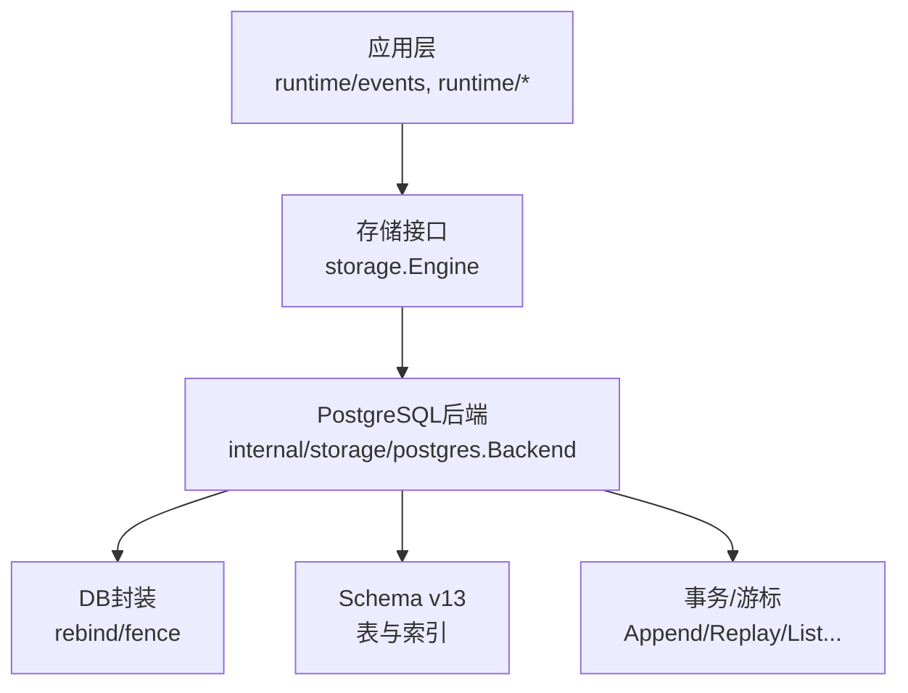
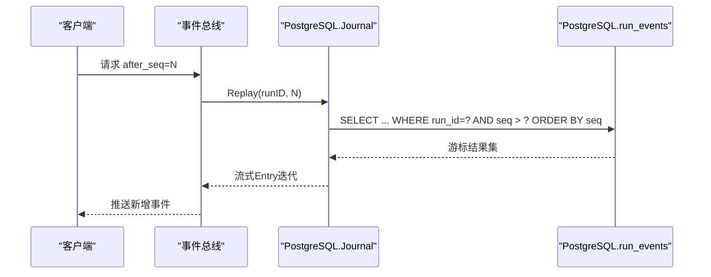
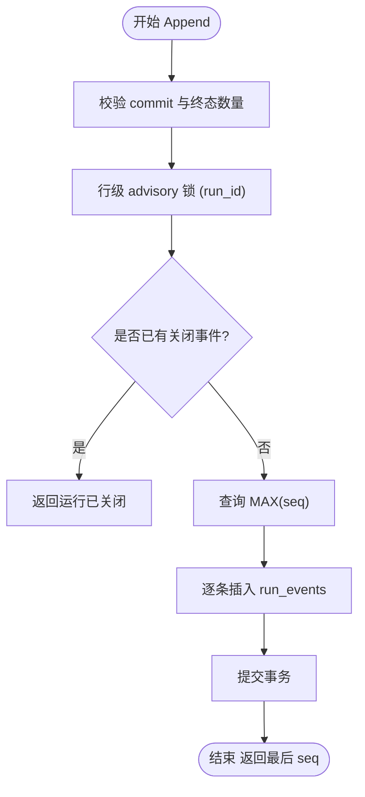
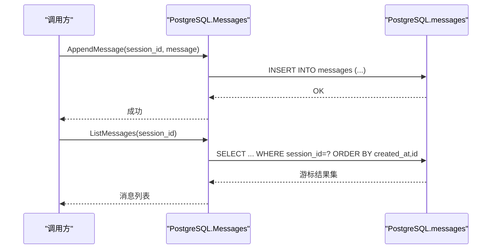
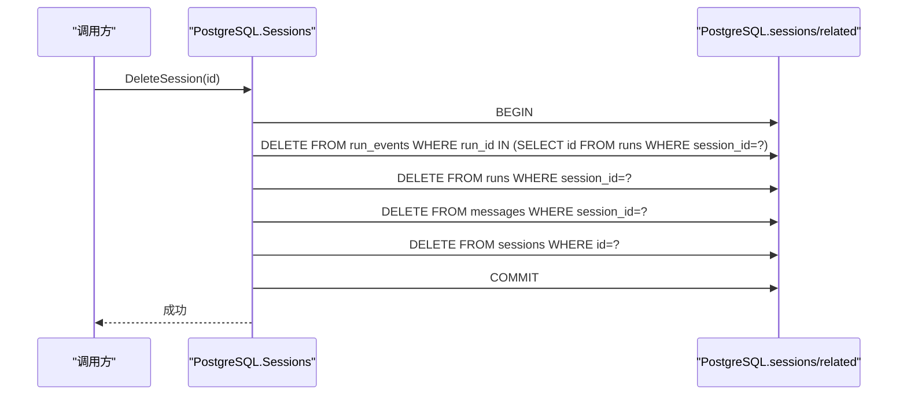
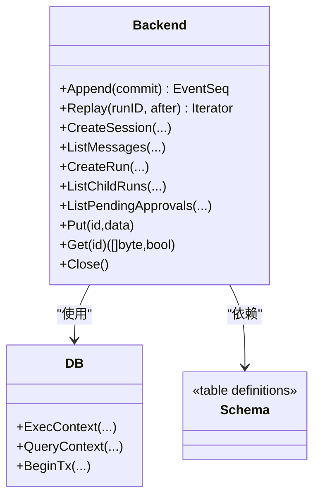

# 查询优化策略

<cite>
**本文引用的文件**
- [postgres.go](file://internal/storage/postgres/postgres.go)
- [journal.go](file://internal/storage/postgres/journal.go)
- [messages.go](file://internal/storage/postgres/messages.go)
- [sessions.go](file://internal/storage/postgres/sessions.go)
- [schema.go](file://internal/storage/postgres/schema.go)
- [blob.go](file://internal/storage/postgres/blob.go)
- [db.go](file://internal/storage/postgres/db.go)
- [runs.go](file://internal/storage/postgres/runs.go)
- [approvals.go](file://internal/storage/postgres/approvals.go)
- [contracts.go](file://internal/storage/contracts.go)
- [doc.go](file://internal/events/doc.go)
</cite>

## 目录
1. [简介](#简介)
2. [项目结构](#项目结构)
3. [核心组件](#核心组件)
4. [架构总览](#架构总览)
5. [详细组件分析](#详细组件分析)
6. [依赖关系分析](#依赖关系分析)
7. [性能考量](#性能考量)
8. [故障排查指南](#故障排查指南)
9. [结论](#结论)
10. [附录](#附录)

## 简介
本文件面向PostgreSQL存储层，围绕Vivy的事件溯源模式与高并发读取场景，系统化阐述复杂查询的执行计划分析、索引选择策略、查询重写技术；重点覆盖事件日志的高效回放、流式查询、内存优化；会话管理的分页查询、全文搜索、聚合统计优化；以及PostgreSQL特有的CTE、窗口函数、物化视图、并行查询等优化手段。同时针对journal表追加写入优化、消息表大对象存储、会话表复杂关联查询进行专项剖析，并提供慢查询诊断、瓶颈识别、查询计划调优方法，以及基准测试、监控与容量规划建议。

## 项目结构
PostgreSQL后端位于 internal/storage/postgres，包含连接管理、迁移、锁与租约、各业务表的读写实现与当前逻辑Schema定义。关键文件职责如下：
- postgres.go：数据库连接池、实例租约（organism lease）、心跳、迁移入口、Backend装配
- schema.go：PostgreSQL逻辑Schema（v13），含sessions、messages、runs、run_events、approvals、checkpoints、checkpoint_generations、notes、questions、skill_revisions、todos、generations、eval_runs、promotions、studio_events等表及索引
- journal.go：事件追加与回放（Append/Replay）
- messages.go：消息追加与列表查询
- sessions.go：会话CRUD与级联删除
- runs.go：运行生命周期与树形遍历
- approvals.go：审批队列、过期清理、首写者胜出
- blob.go：大对象分代存储与指针翻转
- db.go：占位符重绑定（? -> $n）、租约丢失防护（fence）
- contracts.go：存储接口契约与错误语义

图表来源
- [postgres.go:46-111](file://internal/storage/postgres/postgres.go#L46-L111)
- [db.go:13-108](file://internal/storage/postgres/db.go#L13-L108)
- [schema.go:5-199](file://internal/storage/postgres/schema.go#L5-L199)

章节来源
- [postgres.go:46-111](file://internal/storage/postgres/postgres.go#L46-L111)
- [schema.go:5-199](file://internal/storage/postgres/schema.go#L5-L199)

## 核心组件
- 事件日志（Journal）：追加写入保证连续seq与“恰好一个终态事件”不变式；回放使用ORDER BY seq的流式迭代器，避免一次性加载。
- 消息表（Messages）：追加写入，按创建时间顺序列出；工具参数以字节数组存储，适合大对象。
- 会话表（Sessions）：基础CRUD，删除时级联清理相关数据。
- 运行表（Runs）：支持父子树形查询，提供活跃运行列表与子树枚举。
- 审批表（Approvals）：首写者胜出、过期清理、超时扫描。
- 大对象（Blobs）：分代写入+原子指针翻转，读路径JOIN当前指针获取最新版本。
- 连接与租约：进程级独占租约（organism lease）+ advisory lock，心跳保活，失败自动围栏（fence）。

章节来源
- [journal.go:14-89](file://internal/storage/postgres/journal.go#L14-L89)
- [messages.go:10-53](file://internal/storage/postgres/messages.go#L10-L53)
- [sessions.go:13-103](file://internal/storage/postgres/sessions.go#L13-L103)
- [runs.go:15-127](file://internal/storage/postgres/runs.go#L15-L127)
- [approvals.go:15-274](file://internal/storage/postgres/approvals.go#L15-L274)
- [blob.go:18-88](file://internal/storage/postgres/blob.go#L18-L88)
- [postgres.go:46-111](file://internal/storage/postgres/postgres.go#L46-L111)

## 架构总览
Vivy采用事件溯源：所有历史变更持久化为run_events，通过Replay以after_seq游标增量回放，确保无重复、无遗漏。运行时通过events总线将持久化事件广播给订阅者，RPC层基于游标实现断线续传。

图表来源
- [journal.go:81-89](file://internal/storage/postgres/journal.go#L81-L89)
- [doc.go:1-12](file://internal/events/doc.go#L1-L12)

章节来源
- [journal.go:81-89](file://internal/storage/postgres/journal.go#L81-L89)
- [doc.go:1-12](file://internal/events/doc.go#L1-L12)

## 详细组件分析

### 事件日志（Journal）追加与回放
- 追加写入（Append）
  - 校验commit非空且至多一个终态事件，满足D-008。
  - 使用行级advisory锁锁定run_id，防止并发写入冲突。
  - 检查是否已有终态事件，若存在则拒绝后续追加。
  - 计算最大seq并批量插入，返回最后seq。
- 回放（Replay）
  - 使用ORDER BY seq的流式游标，按after_seq过滤，避免全量加载。
  - 迭代器Next/Value/Err/Close遵循标准模式，便于上层消费。

图表来源
- [journal.go:14-79](file://internal/storage/postgres/journal.go#L14-L79)

章节来源
- [journal.go:14-79](file://internal/storage/postgres/journal.go#L14-L79)

### 消息表（Messages）追加与列表
- 追加：单行INSERT，content与tool_args为BYTEA，适合大对象。
- 列表：按session_id过滤，ORDER BY created_at, id，稳定排序。

图表来源
- [messages.go:10-53](file://internal/storage/postgres/messages.go#L10-L53)

章节来源
- [messages.go:10-53](file://internal/storage/postgres/messages.go#L10-L53)

### 会话表（Sessions）与级联删除
- 创建/更新/删除：删除在事务中依次删除run_events、runs、messages、sessions，保证一致性。
- 列表：按created_at DESC, id排序，适合分页。

图表来源
- [sessions.go:70-103](file://internal/storage/postgres/sessions.go#L70-L103)

章节来源
- [sessions.go:70-103](file://internal/storage/postgres/sessions.go#L70-L103)

### 运行表（Runs）树形查询
- 活跃运行：按status IN ('accepted','queued','active')排序。
- 子树：通过parent_run_id或root_run_id过滤并按created_at,id排序。

章节来源
- [runs.go:15-127](file://internal/storage/postgres/runs.go#L15-L127)

### 审批表（Approvals）首写者胜出与过期清理
- 决策：UPDATE ... WHERE decision='pending'，仅首个成功写入生效。
- 过期：后台定时扫描timeout_at<=now的行并置为expired。

章节来源
- [approvals.go:128-274](file://internal/storage/postgres/approvals.go#L128-L274)

### 大对象（Blobs）分代写入与指针翻转
- Put：先插入新generation，再原子UPSERT checkpoints指针指向最新generation。
- Get：JOIN checkpoints与checkpoint_generations获取当前指针对应的blob。
- Delete：删除指针与所有generation。

章节来源
- [blob.go:18-88](file://internal/storage/postgres/blob.go#L18-L88)

### 连接、租约与围栏
- 进程独占：Open时尝试获取organism租约，失败返回lease held；心跳定期续租。
- Fence：一旦租约丢失，DB包装层guard()返回lease lost，阻止后续操作。

章节来源
- [postgres.go:46-111](file://internal/storage/postgres/postgres.go#L46-L111)
- [postgres.go:192-220](file://internal/storage/postgres/postgres.go#L192-L220)
- [db.go:19-24](file://internal/storage/postgres/db.go#L19-L24)

## 依赖关系分析
- Backend依赖DB封装进行SQL执行，DB负责占位符重绑定与租约围栏。
- 各Store（Journal/Messages/Sessions/Runs/Approvals/Blobs）均通过Backend访问同一DB实例。
- Schema v13定义了所有表与索引，支撑上述查询。

图表来源
- [postgres.go:30-111](file://internal/storage/postgres/postgres.go#L30-L111)
- [db.go:13-108](file://internal/storage/postgres/db.go#L13-L108)
- [schema.go:5-199](file://internal/storage/postgres/schema.go#L5-L199)

章节来源
- [postgres.go:30-111](file://internal/storage/postgres/postgres.go#L30-L111)
- [db.go:13-108](file://internal/storage/postgres/db.go#L13-L108)
- [schema.go:5-199](file://internal/storage/postgres/schema.go#L5-L199)

## 性能考量

### 执行计划分析与索引选择策略
- run_events表
  - 主键(run_id, seq)天然支持按run_id范围扫描与有序回放。
  - 回放查询WHERE run_id=? AND seq>? ORDER BY seq可高效走主键索引。
  - 建议：保持主键设计；如需按type过滤，考虑复合索引(type, run_id, seq)以加速筛选+排序。
- messages表
  - 列表查询WHERE session_id=? ORDER BY created_at, id。
  - 建议：创建索引(session_id, created_at, id)以提升排序与范围扫描效率。
- runs表
  - 活跃运行查询WHERE status IN (...) ORDER BY created_at, id。
  - 建议：创建索引(status, created_at, id)以加速过滤与排序。
  - 子树查询WHERE parent_run_id=?/root_run_id=? ORDER BY created_at, id。
  - 建议：创建索引(parent_run_id, created_at, id)与(root_run_id, created_at, id)，已在Schema中定义。
- approvals表
  - 待处理队列WHERE decision='pending' ORDER BY expires_at DESC, id。
  - 建议：创建索引(decision, expires_at, id)，已在Schema中定义。
  - 过期扫描WHERE decision='pending' AND timeout_at<=now ORDER BY timeout_at ASC。
  - 建议：创建索引(timeout_at, decision)以加速过期扫描。
- checkpoints/checkpoint_generations
  - Get JOIN c.id=cg.id AND cg.generation=c.generation。
  - 建议：确保cg(id, generation)为主键，c(id)为主键；必要时对cg(id)建立索引以优化JOIN。

章节来源
- [schema.go:36-38](file://internal/storage/postgres/schema.go#L36-L38)
- [schema.go:73](file://internal/storage/postgres/schema.go#L73)
- [schema.go:121](file://internal/storage/postgres/schema.go#L121)
- [schema.go:157](file://internal/storage/postgres/schema.go#L157)
- [schema.go:178](file://internal/storage/postgres/schema.go#L178)

### 查询重写技术
- 游标回放：Replay使用seq>after过滤，避免OFFSET导致的深翻页问题。
- 分批读取：上层可按固定批次大小循环Replay，控制内存占用。
- 条件下推：在SQL层完成过滤与排序，减少应用层处理。
- 合并写入：Append将多个事件放入一次事务，降低锁竞争与网络往返。

章节来源
- [journal.go:81-89](file://internal/storage/postgres/journal.go#L81-L89)

### 内存优化
- 流式迭代：Replay返回Iterator，逐行消费，不一次性加载全部事件。
- 大对象分离：messages.content与tool_args使用BYTEA，避免污染热点行；必要时结合外部对象存储。
- 分代Blob：checkpoint_generations保留历史版本，checkpoints仅存指针，读路径JOIN一次即可。

章节来源
- [journal.go:92-120](file://internal/storage/postgres/journal.go#L92-L120)
- [blob.go:55-71](file://internal/storage/postgres/blob.go#L55-L71)

### PostgreSQL特有优化
- CTE：可将复杂子查询提取为CTE提升可读性与计划稳定性（例如在复杂会话关联查询中）。
- 窗口函数：用于会话内消息排名、运行树深度计算等场景。
- 物化视图：对高频聚合（如会话统计、运行状态分布）可构建物化视图并定期刷新。
- 并行查询：对大规模扫描（如历史事件回溯）启用并行扫描与聚合，注意与I/O与CPU资源平衡。

[本节为通用指导，不直接分析具体文件]

### 事件溯源模式下的高并发读取优化（Vivy）
- 多消费者共享游标：每个消费者维护独立after_seq，互不干扰。
- 批量化回放：按固定批次拉取，减少网络与序列化开销。
- 缓存热点：对最近N个事件可在应用层做轻量缓存，但需保证一致性边界。
- 背压与限流：下游消费能力不足时，限制回放速率，避免雪崩。

章节来源
- [doc.go:1-12](file://internal/events/doc.go#L1-L12)

## 故障排查指南
- 租约丢失：DB封装guard()返回lease lost，检查心跳与锁连接健康。
- 运行已关闭：Append检测到终态事件后拒绝追加，确认业务状态机。
- 未找到：Get/Update返回NotFound，检查ID是否存在。
- 慢查询定位：对Replay、ListMessages、ListActiveRuns、ListPendingApprovals等关键路径执行EXPLAIN ANALYZE，验证索引命中与排序成本。
- 大对象膨胀：监控messages.content与tool_args大小，必要时拆分或外置存储。

章节来源
- [db.go:19-24](file://internal/storage/postgres/db.go#L19-L24)
- [journal.go:42-50](file://internal/storage/postgres/journal.go#L42-L50)
- [sessions.go:45-58](file://internal/storage/postgres/sessions.go#L45-L58)
- [approvals.go:200-261](file://internal/storage/postgres/approvals.go#L200-L261)

## 结论
本仓库的PostgreSQL存储层围绕事件溯源与高并发读取进行了系统性设计：通过主键与复合索引保障回放与列表查询性能；使用流式迭代与分代Blob控制内存；借助advisory锁与进程租约保证写入一致性与独占性。在此基础上，可进一步引入CTE、窗口函数、物化视图与并行查询，以应对更复杂的会话关联、聚合统计与历史回溯场景。配合合理的索引策略、查询重写与监控诊断，可在Vivy事件溯源模式下实现稳定高效的读取性能。

## 附录

### 慢查询诊断清单
- 回放慢：检查run_events主键命中、seq范围大小、是否缺少(type, run_id, seq)索引。
- 消息列表慢：检查(session_id, created_at, id)索引是否命中。
- 活跃运行慢：检查(status, created_at, id)索引。
- 审批队列慢：检查(decision, expires_at, id)与(timeout_at, decision)索引。
- Blob读取慢：检查checkpoints与checkpoint_generations JOIN是否走主键。

### 基准测试方法
- 回放吞吐：构造单run大量事件，测量不同after_seq下的回放延迟与吞吐。
- 追加写入：并发Append到不同run_id，评估advisory锁竞争与事务提交耗时。
- 列表分页：对messages与sessions进行分页查询，验证索引效果。
- 审批清理：模拟过期审批，评估SweepExpiredApprovals性能。

### 性能监控工具
- EXPLAIN/EXPLAIN ANALYZE：分析关键查询计划与成本。
- pg_stat_statements：统计热点SQL与执行次数。
- pg_stat_user_tables/indexes：观察索引使用率与表增长。
- 系统指标：监控PostgreSQL连接数、I/O、CPU、WAL生成量。

### 容量规划建议
- run_events：按run维度增长，关注单run事件规模与峰值写入；必要时分区（如按run前缀或时间）。
- messages：关注content与tool_args大小，设置合理上限或外置存储。
- checkpoints/checkpoint_generations：控制分代数量与保留策略，定期清理旧版本。
- 连接池：根据并发调整max open connections，避免连接耗尽。