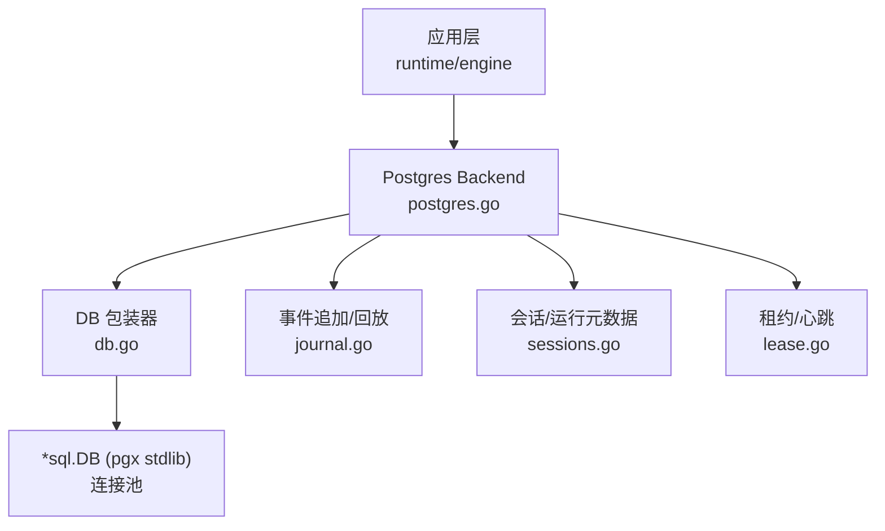
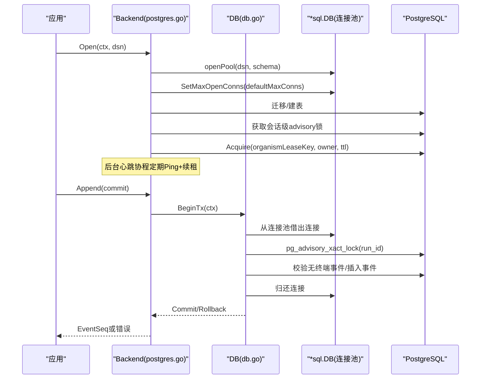
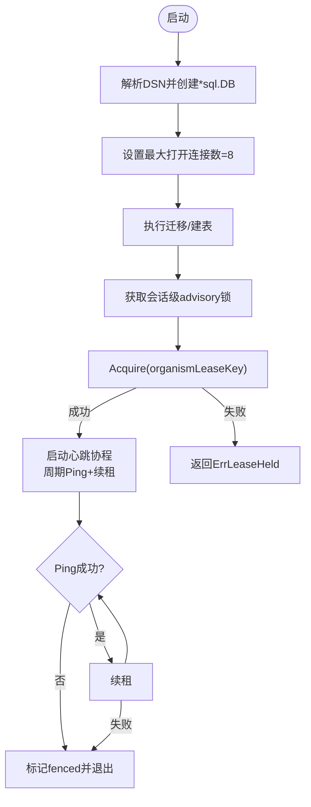
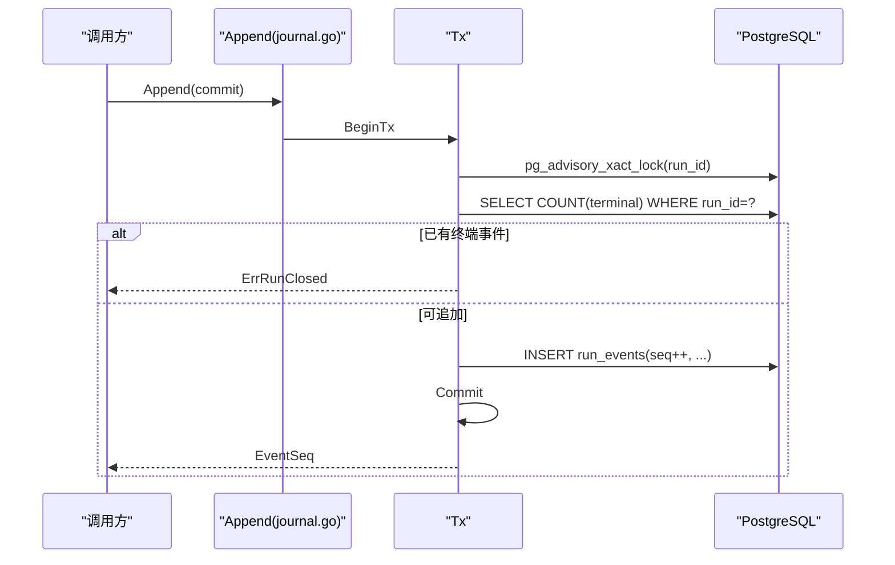
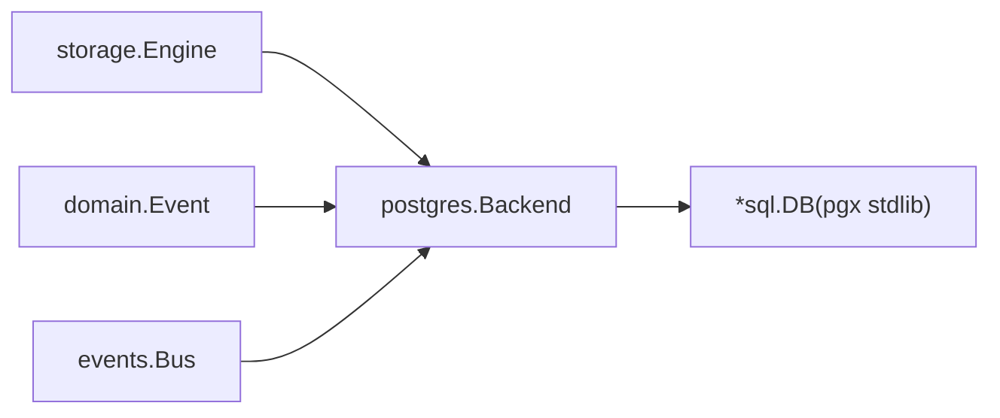
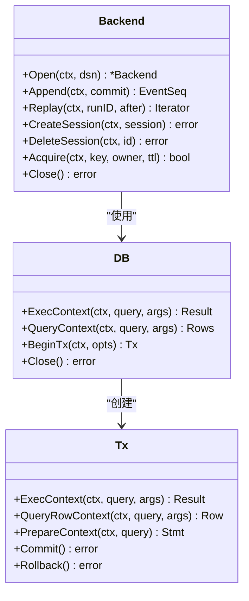

# 连接池管理

<cite>
**本文引用的文件**
- [postgres.go](file://internal/storage/postgres/postgres.go)
- [db.go](file://internal/storage/postgres/db.go)
- [journal.go](file://internal/storage/postgres/journal.go)
- [sessions.go](file://internal/storage/postgres/sessions.go)
- [lease.go](file://internal/storage/postgres/lease.go)
- [config.go](file://internal/config/config.go)
- [config.example.yaml](file://config.example.yaml)
- [config.postgres.yaml](file://docker/config.postgres.yaml)
</cite>

## 目录
1. [简介](#简介)
2. [项目结构](#项目结构)
3. [核心组件](#核心组件)
4. [架构总览](#架构总览)
5. [详细组件分析](#详细组件分析)
6. [依赖关系分析](#依赖关系分析)
7. [性能与调优](#性能与调优)
8. [故障诊断指南](#故障诊断指南)
9. [结论](#结论)
10. [附录：事件溯源与连接池协作](#附录事件溯源与连接池协作)

## 简介
本文面向Vivy项目中PostgreSQL存储后端的连接池管理，围绕pgx驱动、标准库sql.DB的连接池行为、事务生命周期、健康检查与租约机制、以及在高并发写入场景下如何与事件溯源模式配合进行说明。文档同时给出监控指标建议、性能调优参数和故障诊断方法，并总结高并发、负载均衡与多租户隔离的最佳实践。

## 项目结构
Vivy的PostgreSQL后端位于internal/storage/postgres包，负责：
- 解析DSN并创建pgx配置，通过stdlib.OpenDB暴露为*sql.DB
- 设置连接池最大打开连接数
- 执行数据库迁移与schema版本记录
- 获取进程级会话锁（advisory lock）与分布式租约（leases表）
- 提供Append/Replay等事件溯源接口，封装事务与查询

图表来源
- [postgres.go:46-122](file://internal/storage/postgres/postgres.go#L46-L122)
- [db.go:13-58](file://internal/storage/postgres/db.go#L13-L58)
- [journal.go:14-79](file://internal/storage/postgres/journal.go#L14-L79)
- [sessions.go:13-103](file://internal/storage/postgres/sessions.go#L13-L103)
- [lease.go:9-45](file://internal/storage/postgres/lease.go#L9-L45)

章节来源
- [postgres.go:46-122](file://internal/storage/postgres/postgres.go#L46-L122)
- [config.go:70-89](file://internal/config/config.go#L70-L89)
- [config.example.yaml:13-22](file://config.example.yaml#L13-L22)
- [config.postgres.yaml:8-13](file://docker/config.postgres.yaml#L8-L13)

## 核心组件
- 连接池初始化与配置
  - 使用pgx.ParseConfig解析DSN，并通过stdlib.OpenDB返回*sql.DB
  - 设置最大打开连接数为默认值（当前固定为8）
  - 未显式设置最小空闲连接、连接最大存活时间、连接最大空闲时间
- DB包装器
  - 将?占位符重写为$1/$2…以适配Postgres
  - 在fenced模式下拒绝所有读写，防止租约丢失后的误写
- 事件溯源写入
  - Append在单事务内加行级advisory锁，校验终端事件唯一性，分配连续seq并批量插入
- 会话与删除
  - 会话CRUD及级联删除在同一事务中完成
- 租约与心跳
  - 启动时尝试获取organism租约；后台协程周期性Ping+续租，失败则标记fenced并退出

章节来源
- [postgres.go:59-122](file://internal/storage/postgres/postgres.go#L59-L122)
- [db.go:13-58](file://internal/storage/postgres/db.go#L13-L58)
- [journal.go:14-79](file://internal/storage/postgres/journal.go#L14-L79)
- [sessions.go:70-103](file://internal/storage/postgres/sessions.go#L70-L103)
- [lease.go:9-45](file://internal/storage/postgres/lease.go#L9-L45)

## 架构总览
下图展示了从应用到Postgres的连接与事务路径，包括健康检查、租约保护与事件追加流程。

图表来源
- [postgres.go:59-122](file://internal/storage/postgres/postgres.go#L59-L122)
- [postgres.go:170-220](file://internal/storage/postgres/postgres.go#L170-L220)
- [db.go:47-58](file://internal/storage/postgres/db.go#L47-L58)
- [journal.go:32-79](file://internal/storage/postgres/journal.go#L32-L79)

## 详细组件分析

### 连接池配置与健康检查
- 连接池创建
  - 通过pgx.ParseConfig解析DSN，支持search_path切换schema
  - 使用stdlib.OpenDB暴露*sql.DB，由Go标准库管理连接池
- 连接池参数
  - 最大打开连接数：设置为常量defaultMaxConns=8
  - 最小空闲连接、连接最大存活时间、连接最大空闲时间：未显式设置，采用Go sql.DB默认策略
- 健康检查与自动重连
  - 心跳协程每10秒对持有会话锁的连接执行PingContext（超时3秒），失败则标记fenced并退出循环
  - 续租失败或无法续租时同样标记fenced，后续所有写操作将被拒绝
- 连接泄漏防护
  - 所有查询/事务均通过DB包装器发起，确保在fenced模式下统一拒绝
  - 会话锁连接在Close时显式释放；租约在关闭时清理
  - 事件追加使用PrepareContext并defer Close，避免语句句柄泄漏

图表来源
- [postgres.go:59-122](file://internal/storage/postgres/postgres.go#L59-L122)
- [postgres.go:170-220](file://internal/storage/postgres/postgres.go#L170-L220)

章节来源
- [postgres.go:59-122](file://internal/storage/postgres/postgres.go#L59-L122)
- [postgres.go:170-220](file://internal/storage/postgres/postgres.go#L170-L220)
- [db.go:19-58](file://internal/storage/postgres/db.go#L19-L58)

### 事务连接的生命周期管理与上下文传播
- 事务开启
  - 通过DB.BeginTx在包装器上开启事务，内部调用底层*sql.Tx
  - 所有SQL在执行前会进行?到$n的重绑定
- 上下文传播
  - 所有ExecContext/QueryContext/BeginTx均接受context.Context，并在底层传递至pgx/sql
  - 心跳PingContext也携带上下文并设置超时，避免阻塞
- 资源清理
  - 事务提交/回滚后连接归还连接池
  - Prepare语句在Append中defer Close
  - 会话锁连接在Close时显式释放

章节来源
- [db.go:47-58](file://internal/storage/postgres/db.go#L47-L58)
- [journal.go:32-79](file://internal/storage/postgres/journal.go#L32-L79)
- [postgres.go:170-220](file://internal/storage/postgres/postgres.go#L170-L220)

### 事件溯源写入与一致性保障
- 原子追加
  - Append在一个事务内先获取run级别的advisory锁，再检查是否已有终端事件，最后批量插入新事件并递增seq
- 终端事件唯一性
  - 每个commit最多包含一个终端事件；若已存在终端事件，直接拒绝追加
- 回放
  - Replay按seq顺序流式读取，供事件总线消费与客户端增量同步

图表来源
- [journal.go:14-79](file://internal/storage/postgres/journal.go#L14-L79)

章节来源
- [journal.go:14-79](file://internal/storage/postgres/journal.go#L14-L79)

### 多租户与隔离方案
- Schema隔离
  - 支持通过schema参数在openPool时设置search_path，实现逻辑隔离
- 进程级独占
  - 同一DSN仅允许一个进程持有organism租约；第二个实例启动将返回ErrLeaseHeld
- 运行时配置
  - Postgres DSN通过环境变量注入，不在配置文件中明文保存

章节来源
- [postgres.go:59-122](file://internal/storage/postgres/postgres.go#L59-L122)
- [config.go:70-89](file://internal/config/config.go#L70-L89)
- [config.example.yaml:13-22](file://config.example.yaml#L13-L22)
- [config.postgres.yaml:8-13](file://docker/config.postgres.yaml#L8-L13)

## 依赖关系分析
- 外部依赖
  - github.com/jackc/pgx/v5与stdlib桥接用于创建*sql.DB
- 内部依赖
  - internal/storage定义Engine接口，postgres.Backend实现该接口
  - internal/domain提供Event类型与序列号
  - internal/events基于Journal回放事件并广播

图表来源
- [postgres.go:30-44](file://internal/storage/postgres/postgres.go#L30-L44)
- [journal.go:1-12](file://internal/storage/postgres/journal.go#L1-L12)

章节来源
- [postgres.go:30-44](file://internal/storage/postgres/postgres.go#L30-L44)
- [journal.go:1-12](file://internal/storage/postgres/journal.go#L1-L12)

## 性能与调优
- 连接池容量
  - 当前最大打开连接数固定为8，适合单机开发或小规模服务；生产环境应根据并发度与延迟目标评估是否需要提高
- 空闲连接与生命周期
  - 未显式设置最小空闲连接、连接最大存活/空闲时间；可根据业务峰值与长事务比例调整
- 事务粒度
  - Append使用行级advisory锁保证串行化写入，避免竞争；批量插入减少往返
- 上下文与超时
  - 心跳Ping带超时，避免阻塞；建议在调用方为关键路径设置合理请求超时
- 监控指标建议
  - 连接池：活跃连接数、等待获取连接数、空闲连接数、连接创建/销毁速率
  - 事务：平均时长、超时率、重试次数
  - 事件：Append吞吐、回放延迟、终端事件分布
  - 租约：续租成功率、心跳失败次数、fenced切换次数
- 高并发最佳实践
  - 控制单请求事务范围，尽量短事务
  - 使用批处理写入（如事件批量Append）
  - 合理设置连接池上限，避免过多连接导致数据库侧压力
  - 对读多写少场景，考虑只读副本或分库分表
- 负载均衡策略
  - 单实例独占模式（当前实现）：通过租约保证只有一个进程持有写权限
  - 多实例读扩展：可通过只读连接或副本进行回放/查询扩展
- 多租户隔离
  - 使用独立schema或独立数据库实例隔离不同租户
  - 结合search_path与权限控制限制跨schema访问

[本节为通用指导，不直接分析具体代码文件]

## 故障诊断指南
- 启动失败：ErrLeaseHeld
  - 现象：第二个进程打开相同DSN时报错
  - 排查：确认是否有其他进程持有租约；检查leases表与advisory锁占用
  - 参考位置：[postgres.go:94-110](file://internal/storage/postgres/postgres.go#L94-L110)
- 运行时写被拒绝
  - 现象：所有写操作返回租约丢失错误
  - 原因：心跳Ping失败或续租失败，触发fenced
  - 排查：观察心跳日志、网络连通性、数据库负载
  - 参考位置：[postgres.go:192-220](file://internal/storage/postgres/postgres.go#L192-L220), [db.go:19-24](file://internal/storage/postgres/db.go#L19-L24)
- 事件追加失败
  - 现象：Append报错或返回ErrRunClosed
  - 排查：检查是否已有终端事件；查看advisory锁等待与插入耗时
  - 参考位置：[journal.go:32-79](file://internal/storage/postgres/journal.go#L32-L79)
- 连接泄漏风险
  - 现象：连接数持续增长
  - 排查：确认所有Rows/Stmt已Close；事务正确Commit/Rollback
  - 参考位置：[journal.go:59-73](file://internal/storage/postgres/journal.go#L59-L73)

章节来源
- [postgres.go:94-110](file://internal/storage/postgres/postgres.go#L94-L110)
- [postgres.go:192-220](file://internal/storage/postgres/postgres.go#L192-L220)
- [db.go:19-24](file://internal/storage/postgres/db.go#L19-L24)
- [journal.go:32-79](file://internal/storage/postgres/journal.go#L32-L79)

## 结论
Vivy的PostgreSQL连接池基于pgx与标准库sql.DB，采用简单而稳健的策略：固定最大连接数、通过advisory锁与租约保证单写者、心跳检测与fenced机制防止租约丢失后的误写。事件溯源写入在事务内串行化，确保终端事件唯一性与连续seq。当前实现未暴露细粒度的连接池参数，生产环境可根据并发与延迟目标评估是否需要扩展连接池配置与监控能力。

[本节为总结性内容，不直接分析具体代码文件]

## 附录：事件溯源与连接池协作
- 写入路径
  - 调用方构造commit，调用Append；在事务内获取run级advisory锁，校验无终端事件后批量插入事件，提交事务
- 回放路径
  - Replay按seq顺序流式读取，供事件总线分发与客户端增量同步
- 一致性保障
  - 终端事件唯一性、连续seq、事务原子性共同保证数据一致性
- 连接池角色
  - 连接池承载上述事务与查询；心跳与续租确保连接可用；fenced模式在租约丢失时快速拒绝写操作

图表来源
- [postgres.go:30-110](file://internal/storage/postgres/postgres.go#L30-L110)
- [db.go:13-91](file://internal/storage/postgres/db.go#L13-L91)
- [journal.go:14-79](file://internal/storage/postgres/journal.go#L14-L79)
- [sessions.go:13-103](file://internal/storage/postgres/sessions.go#L13-L103)
- [lease.go:9-45](file://internal/storage/postgres/lease.go#L9-L45)

章节来源
- [postgres.go:30-110](file://internal/storage/postgres/postgres.go#L30-L110)
- [db.go:13-91](file://internal/storage/postgres/db.go#L13-L91)
- [journal.go:14-79](file://internal/storage/postgres/journal.go#L14-L79)
- [sessions.go:13-103](file://internal/storage/postgres/sessions.go#L13-L103)
- [lease.go:9-45](file://internal/storage/postgres/lease.go#L9-L45)