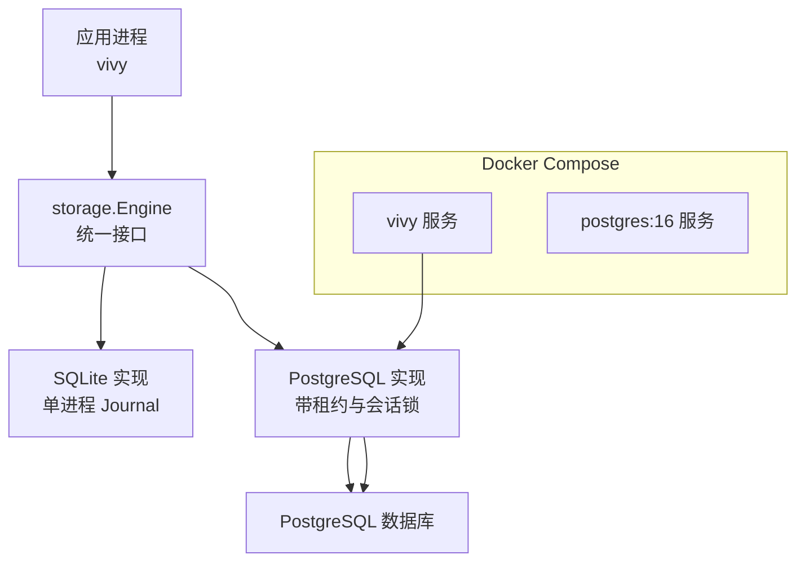
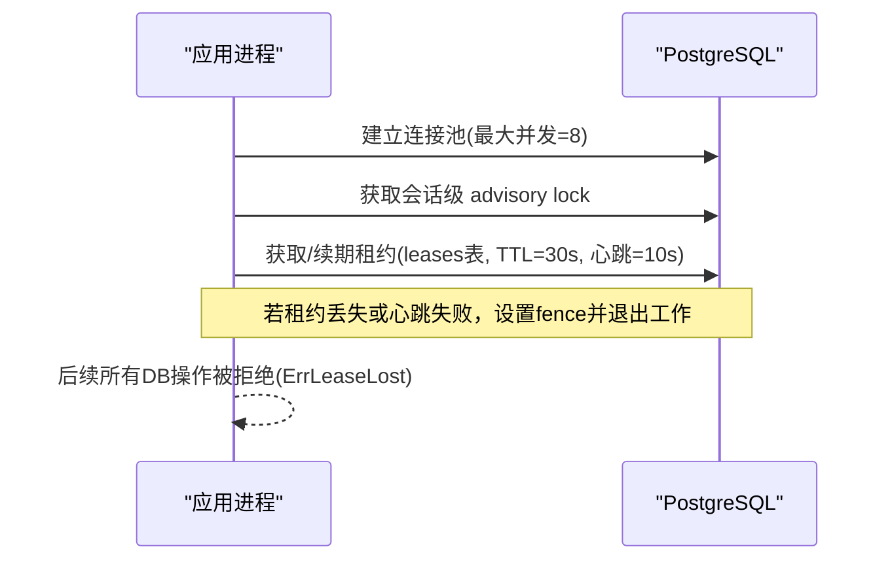
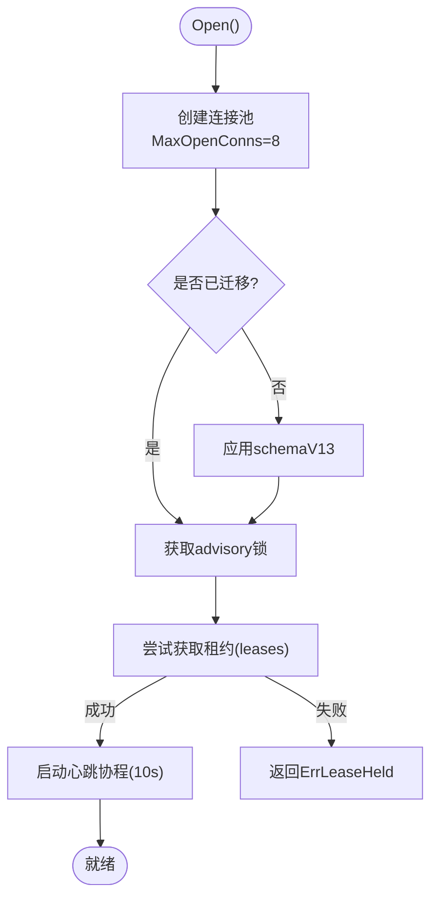
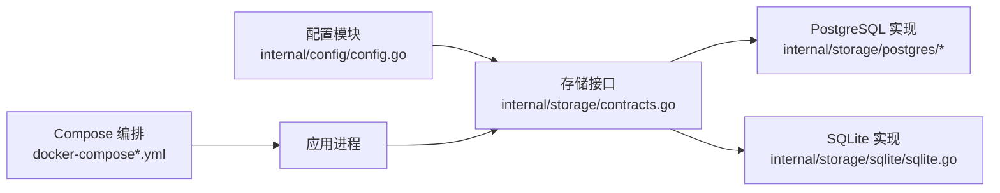

# 集群配置部署

<cite>
**本文引用的文件**
- [docker-compose.yml](file://docker-compose.yml)
- [docker-compose.postgres.yml](file://docker-compose.postgres.yml)
- [docker/config.yaml](file://docker/config.yaml)
- [docker/config.postgres.yaml](file://docker/config.postgres.yaml)
- [config.example.yaml](file://config.example.yaml)
- [internal/config/config.go](file://internal/config/config.go)
- [internal/storage/contracts.go](file://internal/storage/contracts.go)
- [internal/storage/postgres/postgres.go](file://internal/storage/postgres/postgres.go)
- [internal/storage/postgres/db.go](file://internal/storage/postgres/db.go)
- [internal/storage/postgres/schema.go](file://internal/storage/postgres/schema.go)
- [internal/storage/postgres/lease.go](file://internal/storage/postgres/lease.go)
- [internal/storage/sqlite/sqlite.go](file://internal/storage/sqlite/sqlite.go)
</cite>

## 目录
1. [简介](#简介)
2. [项目结构](#项目结构)
3. [核心组件](#核心组件)
4. [架构总览](#架构总览)
5. [详细组件分析](#详细组件分析)
6. [依赖关系分析](#依赖关系分析)
7. [性能考虑](#性能考虑)
8. [故障排查指南](#故障排查指南)
9. [结论](#结论)
10. [附录](#附录)

## 简介
本文件面向生产环境，说明如何在 Vivy 中使用 PostgreSQL 作为后端存储（Journal）进行容器化部署与高可用运行。仓库默认使用 SQLite 单进程 Journal；PostgreSQL 是可选的“服务器端 Journal”实现，通过分布式锁与租约机制保证同一时刻只有一个进程持有独占所有权。文档涵盖：
- 架构与数据一致性：主从复制、读写分离、故障转移在仓库中的实际含义与限制
- Docker 容器化部署：环境变量、配置文件挂载、数据持久化
- 高可用：自动故障检测、VIP 漂移、客户端重试策略建议
- 备份恢复：物理备份、逻辑备份、时间点恢复
- 监控告警、性能调优与安全加固
- 运维手册：扩容升级、迁移策略（SQLite → PostgreSQL）、数据一致性保障

## 项目结构
Vivy 将存储抽象为统一的 storage.Engine 接口，提供 SQLite 与 PostgreSQL 两种实现。运行时通过配置选择后端，PostgreSQL 模式下 DSN 必须来自环境变量，禁止写入配置文件。

图表来源
- [docker-compose.yml:1-33](file://docker-compose.yml#L1-L33)
- [docker-compose.postgres.yml:1-35](file://docker-compose.postgres.yml#L1-L35)
- [internal/storage/contracts.go:252-273](file://internal/storage/contracts.go#L252-L273)
- [internal/storage/postgres/postgres.go:30-111](file://internal/storage/postgres/postgres.go#L30-L111)

章节来源
- [docker-compose.yml:1-33](file://docker-compose.yml#L1-L33)
- [docker-compose.postgres.yml:1-35](file://docker-compose.postgres.yml#L1-L35)
- [internal/storage/contracts.go:252-273](file://internal/storage/contracts.go#L252-L273)

## 核心组件
- 配置加载与校验：严格解析 YAML，强制 secrets 仅以环境变量名引用，禁止明文密钥进入配置或日志
- 存储引擎：
  - SQLite：单写者、无外部依赖、适合单机与开发
  - PostgreSQL：支持多进程共享数据库，通过会话级 advisory lock 与 leases 表实现独占租约与心跳续期
- 事件日志（Journal）：追加有序、每个 Run 恰好一个终态事件，按 after_seq 游标重放
- 快照与 Blob：版本化快照与生成式 Blob 指针，用于检查点等场景

章节来源
- [internal/config/config.go:51-89](file://internal/config/config.go#L51-L89)
- [internal/config/config.go:316-362](file://internal/config/config.go#L316-L362)
- [internal/storage/contracts.go:11-31](file://internal/storage/contracts.go#L11-L31)
- [internal/storage/contracts.go:55-94](file://internal/storage/contracts.go#L55-L94)
- [internal/storage/postgres/postgres.go:20-26](file://internal/storage/postgres/postgres.go#L20-L26)

## 架构总览
Vivy 的 PostgreSQL 模式并非传统的主从复制集群，而是“单一可写实例 + 只读副本”的典型用法：
- 单一可写：通过会话锁与租约确保只有一个进程能写入 Journal
- 只读副本：可通过连接串指向只读副本提升读取吞吐（需自行实现路由）
- 故障转移：当主库不可用或租约丢失，进程会 fence 并停止工作；需要上层编排（如 VIP 漂移、负载均衡器切换）完成流量切换

图表来源
- [internal/storage/postgres/postgres.go:59-111](file://internal/storage/postgres/postgres.go#L59-L111)
- [internal/storage/postgres/postgres.go:168-186](file://internal/storage/postgres/postgres.go#L168-L186)
- [internal/storage/postgres/postgres.go:192-220](file://internal/storage/postgres/postgres.go#L192-L220)
- [internal/storage/postgres/db.go:19-24](file://internal/storage/postgres/db.go#L19-L24)

## 详细组件分析

### 配置与环境变量管理
- 存储后端选择：sqlite 或 postgres
- PostgreSQL 模式要求 dsn_env 指向环境变量名（例如 VIVY_POSTGRES_DSN），DSN 不得出现在配置文件中
- 数据目录 data_dir 决定非 Journal 数据的落盘位置（工作区、技能包等）
- 示例配置与默认值见示例文件

章节来源
- [internal/config/config.go:70-89](file://internal/config/config.go#L70-L89)
- [internal/config/config.go:350-362](file://internal/config/config.go#L350-L362)
- [config.example.yaml:13-22](file://config.example.yaml#L13-L22)
- [docker/config.yaml:9-13](file://docker/config.yaml#L9-L13)
- [docker/config.postgres.yaml:8-13](file://docker/config.postgres.yaml#L8-L13)

### PostgreSQL 启动流程与一致性
- 连接池：默认最大打开连接数为 8
- Schema 迁移：首次启动创建 schema_migrations 并一次性应用当前版本 SQL
- 会话锁：使用 advisory lock 防止多进程同时成为“宿主”
- 租约：写入 leases 表，TTL 30 秒，后台每 10 秒心跳续期；失败则 fence 并返回错误
- 关闭：释放租约、关闭连接池

图表来源
- [internal/storage/postgres/postgres.go:59-111](file://internal/storage/postgres/postgres.go#L59-L111)
- [internal/storage/postgres/postgres.go:133-166](file://internal/storage/postgres/postgres.go#L133-L166)
- [internal/storage/postgres/postgres.go:168-186](file://internal/storage/postgres/postgres.go#L168-L186)
- [internal/storage/postgres/postgres.go:192-220](file://internal/storage/postgres/postgres.go#L192-L220)
- [internal/storage/postgres/schema.go:1-200](file://internal/storage/postgres/schema.go#L1-L200)

章节来源
- [internal/storage/postgres/postgres.go:59-111](file://internal/storage/postgres/postgres.go#L59-L111)
- [internal/storage/postgres/postgres.go:133-166](file://internal/storage/postgres/postgres.go#L133-L166)
- [internal/storage/postgres/postgres.go:168-186](file://internal/storage/postgres/postgres.go#L168-L186)
- [internal/storage/postgres/postgres.go:192-220](file://internal/storage/postgres/postgres.go#L192-L220)
- [internal/storage/postgres/schema.go:1-200](file://internal/storage/postgres/schema.go#L1-L200)

### 租约与会话锁
- 会话锁：通过 advisory lock 保证同一时间只有一个进程持有“宿主”身份
- 租约：基于 leases 表的乐观锁+过期时间，配合心跳续期；释放时仅删除自身记录
- 错误语义：
  - ErrLeaseHeld：已有活着的租约持有者
  - ErrLeaseLost：心跳失败或租约丢失，后续 DB 操作将被 fence

章节来源
- [internal/storage/postgres/postgres.go:168-186](file://internal/storage/postgres/postgres.go#L168-L186)
- [internal/storage/postgres/lease.go:9-45](file://internal/storage/postgres/lease.go#L9-L45)
- [internal/storage/postgres/db.go:19-24](file://internal/storage/postgres/db.go#L19-L24)
- [internal/storage/contracts.go:25-31](file://internal/storage/contracts.go#L25-L31)

### 数据模型与迁移
- PostgreSQL 使用内联 SQL 一次性创建完整 schema（sessions、messages、runs、run_events、approvals、snapshots、checkpoints、leases、notes、questions、skill_revisions、todos、generations、eval_runs、promotions、studio_events）
- SQLite 通过迁移脚本逐步演进，两者保持逻辑一致

章节来源
- [internal/storage/postgres/schema.go:1-200](file://internal/storage/postgres/schema.go#L1-L200)
- [internal/storage/sqlite/sqlite.go:17-36](file://internal/storage/sqlite/sqlite.go#L17-L36)
- [internal/storage/sqlite/sqlite.go:109-147](file://internal/storage/sqlite/sqlite.go#L109-L147)

### Docker 容器化部署
- 基础 compose：vivy 服务暴露 127.0.0.1:8787，数据卷 /data
- Postgres 叠加 compose：定义 postgres:16 服务与健康检查，vivy 依赖其健康状态
- 环境变量：
  - TZ、OPENAI_API_KEY、ANTHROPIC_API_KEY
  - VIVY_CONFIG 指向容器内配置文件路径
  - VIVY_POSTGRES_DSN 指定 PostgreSQL 连接串（不在配置文件中出现）
- 配置文件：
  - SQLite 模式：backend=sqlite，path=/data/vivy.db
  - PostgreSQL 模式：backend=postgres，dsn_env=VIVY_POSTGRES_DSN

章节来源
- [docker-compose.yml:1-33](file://docker-compose.yml#L1-L33)
- [docker-compose.postgres.yml:1-35](file://docker-compose.postgres.yml#L1-L35)
- [docker/config.yaml:1-19](file://docker/config.yaml#L1-L19)
- [docker/config.postgres.yaml:1-19](file://docker/config.postgres.yaml#L1-L19)
- [config.example.yaml:13-22](file://config.example.yaml#L13-L22)

### 高可用与故障转移
- 进程级高可用：同一数据库只能有一个进程持有租约；第二个进程启动即失败（ErrLeaseHeld）
- 故障检测：心跳失败触发 fence，后续请求立即失败；可用于上层快速探测
- VIP 漂移：建议在编排层（Kubernetes Service/Ingress、Keepalived、云厂商 LB）实现虚拟 IP 或域名切换，结合健康检查将流量切到新的主节点
- 客户端重试：对短暂网络抖动或切换窗口，客户端应实现指数退避重试；对 ErrLeaseLost 应立即切换到新主地址

章节来源
- [internal/storage/postgres/postgres.go:94-111](file://internal/storage/postgres/postgres.go#L94-L111)
- [internal/storage/postgres/postgres.go:192-220](file://internal/storage/postgres/postgres.go#L192-L220)
- [internal/storage/postgres/db.go:19-24](file://internal/storage/postgres/db.go#L19-L24)
- [internal/storage/contracts.go:25-31](file://internal/storage/contracts.go#L25-L31)

### 备份与恢复
- 物理备份：对 PostgreSQL 数据卷进行定期快照或 pg_basebackup；适用于快速全量恢复
- 逻辑备份：使用 pg_dump/pg_restore 导出/导入 schema 与数据；便于跨版本迁移与选择性恢复
- 时间点恢复（PITR）：启用 WAL 归档后，可按目标时间点恢复到任意时刻
- 注意：Vivy 的 Journal 是追加型事件流，恢复时应确保 schema 版本与应用版本匹配，避免回滚导致的不兼容

章节来源
- [internal/storage/postgres/schema.go:1-200](file://internal/storage/postgres/schema.go#L1-L200)
- [internal/storage/postgres/postgres.go:133-166](file://internal/storage/postgres/postgres.go#L133-L166)

### 监控与告警
- 健康检查：Compose 中定义 healthcheck，用于编排层判定服务就绪
- 指标建议：
  - 数据库：连接数、慢查询、锁等待、WAL 增长、表膨胀
  - 应用：启动耗时、租约获取成功率、心跳失败次数、fence 触发次数
- 告警阈值：连接池耗尽、租约丢失率突增、心跳连续失败、WAL 积压

章节来源
- [docker-compose.yml:24-29](file://docker-compose.yml#L24-L29)
- [docker-compose.postgres.yml:15-20](file://docker-compose.postgres.yml#L15-L20)
- [internal/storage/postgres/postgres.go:192-220](file://internal/storage/postgres/postgres.go#L192-L220)

### 性能调优参数
- 连接池：默认 MaxOpenConns=8，可根据 QPS 与延迟目标调整
- 事务与索引：PostgreSQL 侧根据查询热点添加合适索引（仓库已内置常用索引）
- WAL 与检查点：根据写入负载调整 checkpoint_completion_target、max_wal_size
- 只读副本：将读流量路由至只读副本，降低主库压力

章节来源
- [internal/storage/postgres/postgres.go:78-79](file://internal/storage/postgres/postgres.go#L78-L79)
- [internal/storage/postgres/schema.go:36-37](file://internal/storage/postgres/schema.go#L36-L37)
- [internal/storage/postgres/schema.go:73](file://internal/storage/postgres/schema.go#L73)
- [internal/storage/postgres/schema.go:121](file://internal/storage/postgres/schema.go#L121)
- [internal/storage/postgres/schema.go:139](file://internal/storage/postgres/schema.go#L139)
- [internal/storage/postgres/schema.go:157](file://internal/storage/postgres/schema.go#L157)
- [internal/storage/postgres/schema.go:178](file://internal/storage/postgres/schema.go#L178)

### 安全加固
- 密钥管理：配置中不出现真实密钥，仅保存环境变量名；运行时按需读取
- 最小权限：数据库账号仅授予必要权限；生产建议使用独立用户与数据库
- 网络隔离：仅监听必要端口；容器间通信走内部网络
- 审计与脱敏：日志与快照中不输出敏感信息

章节来源
- [internal/config/config.go:1-13](file://internal/config/config.go#L1-L13)
- [internal/config/config.go:316-362](file://internal/config/config.go#L316-L362)
- [docker/config.postgres.yaml:1-3](file://docker/config.postgres.yaml#L1-L3)

### 运维手册
- 启动顺序：先启动 PostgreSQL 并确认健康，再启动 vivy
- 配置变更：修改 config.yaml 或环境变量后重启服务
- 扩缩容：
  - 水平扩展：仅允许一个进程持有租约；其他进程启动即失败
  - 垂直扩展：增加数据库资源或连接池大小
- 升级步骤：
  - 停机或滚动升级前备份数据
  - 升级应用镜像与数据库 schema（由应用自动迁移）
  - 验证健康检查与业务功能

章节来源
- [docker-compose.postgres.yml:22-31](file://docker-compose.postgres.yml#L22-L31)
- [internal/storage/postgres/postgres.go:133-166](file://internal/storage/postgres/postgres.go#L133-L166)
- [docker-compose.yml:1-4](file://docker-compose.yml#L1-L4)

### 迁移策略：SQLite → PostgreSQL
- 适用场景：从单机 SQLite 迁移到 PostgreSQL 以获得多进程能力与更高可用性
- 步骤建议：
  1) 准备 PostgreSQL 实例与连接串（环境变量）
  2) 更新配置 backend=postgres，设置 dsn_env
  3) 启动新版本应用，自动创建 schema 并迁移
  4) 数据迁移：使用 pg_dump/pg_restore 或逻辑导出工具将 SQLite 数据导入 PostgreSQL（需遵循 schema 字段类型差异）
  5) 灰度验证：双写或只读比对，确认一致性后再切换流量
- 一致性保障：
  - Journal 追加有序，每个 Run 仅一个终态事件
  - 通过 after_seq 游标重放事件，确保最终一致

章节来源
- [internal/storage/contracts.go:55-64](file://internal/storage/contracts.go#L55-L64)
- [internal/storage/postgres/schema.go:1-200](file://internal/storage/postgres/schema.go#L1-L200)
- [internal/storage/sqlite/sqlite.go:109-147](file://internal/storage/sqlite/sqlite.go#L109-L147)

## 依赖关系分析

图表来源
- [internal/config/config.go:51-89](file://internal/config/config.go#L51-L89)
- [internal/storage/contracts.go:252-273](file://internal/storage/contracts.go#L252-L273)
- [internal/storage/postgres/postgres.go:30-111](file://internal/storage/postgres/postgres.go#L30-L111)
- [internal/storage/sqlite/sqlite.go:17-36](file://internal/storage/sqlite/sqlite.go#L17-L36)
- [docker-compose.yml:1-33](file://docker-compose.yml#L1-L33)
- [docker-compose.postgres.yml:1-35](file://docker-compose.postgres.yml#L1-L35)

章节来源
- [internal/config/config.go:51-89](file://internal/config/config.go#L51-L89)
- [internal/storage/contracts.go:252-273](file://internal/storage/contracts.go#L252-L273)
- [internal/storage/postgres/postgres.go:30-111](file://internal/storage/postgres/postgres.go#L30-L111)
- [internal/storage/sqlite/sqlite.go:17-36](file://internal/storage/sqlite/sqlite.go#L17-L36)
- [docker-compose.yml:1-33](file://docker-compose.yml#L1-L33)
- [docker-compose.postgres.yml:1-35](file://docker-compose.postgres.yml#L1-L35)

## 性能考虑
- 连接池大小：根据并发与延迟目标调整 MaxOpenConns（默认 8）
- 只读副本：将读流量分流至只读副本，减少主库压力
- 索引优化：依据查询热点补充索引（仓库已包含常用索引）
- WAL 与检查点：合理设置以平衡写入吞吐与恢复速度
- 租约心跳：心跳间隔与 TTL 影响故障检测速度与稳定性

章节来源
- [internal/storage/postgres/postgres.go:78-79](file://internal/storage/postgres/postgres.go#L78-L79)
- [internal/storage/postgres/postgres.go:192-220](file://internal/storage/postgres/postgres.go#L192-L220)
- [internal/storage/postgres/schema.go:36-37](file://internal/storage/postgres/schema.go#L36-L37)
- [internal/storage/postgres/schema.go:73](file://internal/storage/postgres/schema.go#L73)
- [internal/storage/postgres/schema.go:121](file://internal/storage/postgres/schema.go#L121)
- [internal/storage/postgres/schema.go:139](file://internal/storage/postgres/schema.go#L139)
- [internal/storage/postgres/schema.go:157](file://internal/storage/postgres/schema.go#L157)
- [internal/storage/postgres/schema.go:178](file://internal/storage/postgres/schema.go#L178)

## 故障排查指南
- 无法启动（ErrLeaseHeld）：检查是否有其他进程已持有租约；确认唯一可写实例
- 频繁 fence：检查心跳失败原因（网络抖动、数据库拥塞、连接池耗尽）
- 连接失败：核对 DSN、网络连通性、鉴权与防火墙策略
- 性能退化：查看慢查询、锁等待、连接池使用情况
- 数据不一致：通过事件重放（after_seq）校验；必要时进行 PITR 恢复

章节来源
- [internal/storage/postgres/postgres.go:94-111](file://internal/storage/postgres/postgres.go#L94-L111)
- [internal/storage/postgres/postgres.go:192-220](file://internal/storage/postgres/postgres.go#L192-L220)
- [internal/storage/postgres/db.go:19-24](file://internal/storage/postgres/db.go#L19-L24)
- [internal/storage/contracts.go:25-31](file://internal/storage/contracts.go#L25-L31)

## 结论
Vivy 的 PostgreSQL 模式通过严格的租约与会话锁机制，确保在同一数据库中只有一个进程可写，从而实现强一致的事件日志。生产环境中建议：
- 使用只读副本提升读取性能
- 通过编排层实现 VIP 漂移与流量切换
- 实施完善的备份恢复策略（物理/逻辑/PITR）
- 强化监控告警与性能调优
- 严格遵循密钥管理与最小权限原则

## 附录
- 环境变量清单：
  - VIVY_CONFIG：配置文件路径
  - VIVY_POSTGRES_DSN：PostgreSQL 连接串
  - OPENAI_API_KEY、ANTHROPIC_API_KEY：模型提供商密钥
  - TZ：时区
- 关键配置项：
  - storage.backend：sqlite 或 postgres
  - storage.postgres.dsn_env：DSN 所在环境变量名
  - runtime.workspace_root、skills_root：工作区与技能包路径

章节来源
- [docker-compose.postgres.yml:22-31](file://docker-compose.postgres.yml#L22-L31)
- [docker/config.postgres.yaml:8-13](file://docker/config.postgres.yaml#L8-L13)
- [config.example.yaml:13-22](file://config.example.yaml#L13-L22)
- [internal/config/config.go:70-89](file://internal/config/config.go#L70-L89)