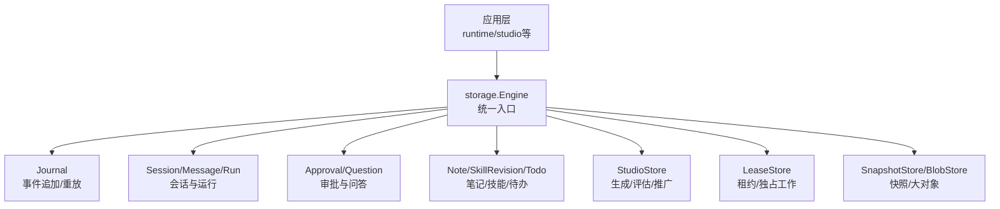
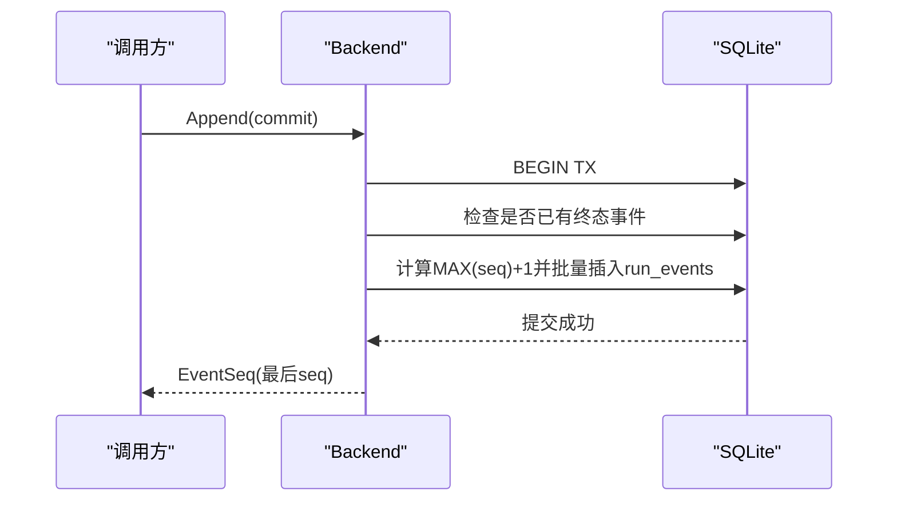
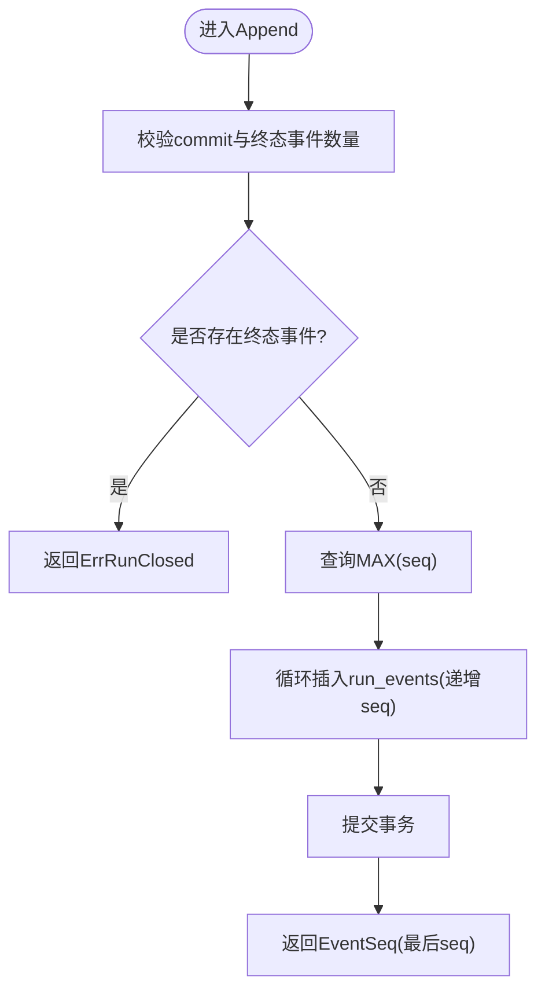
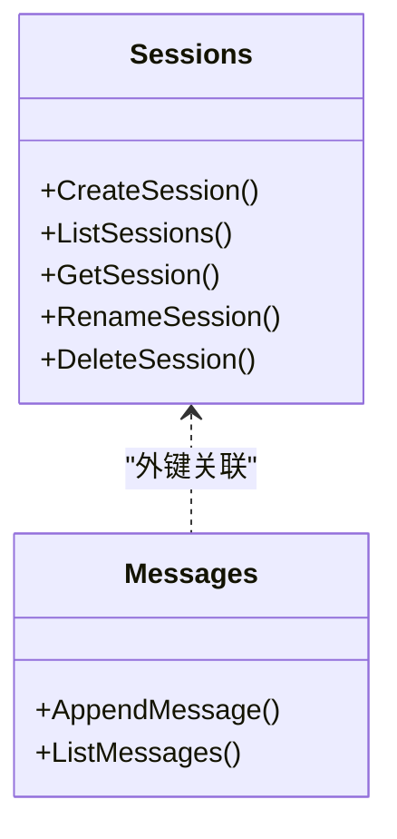
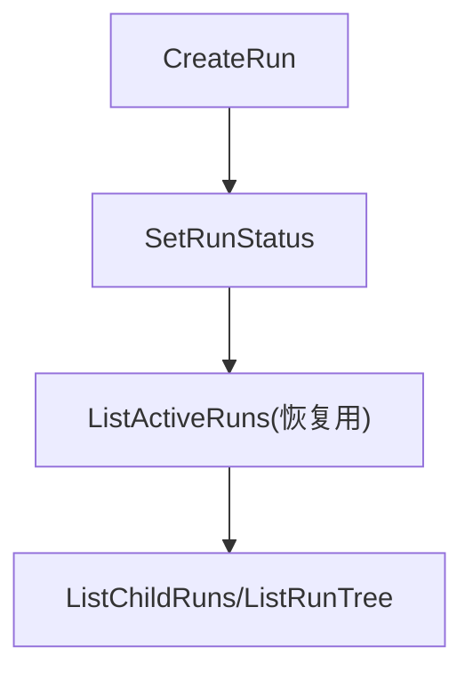
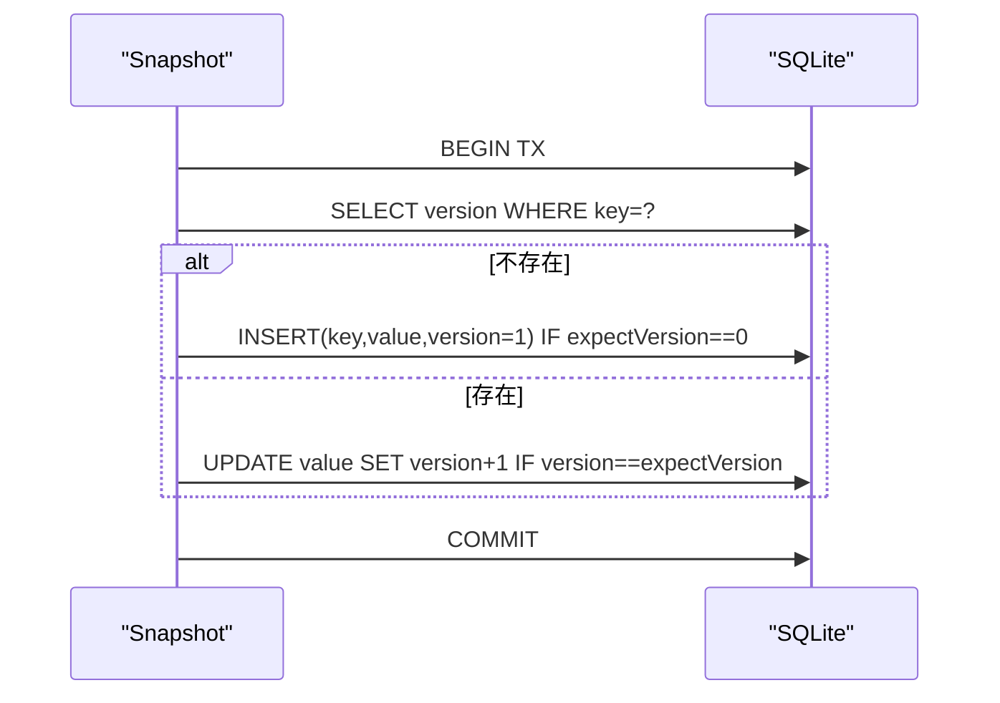
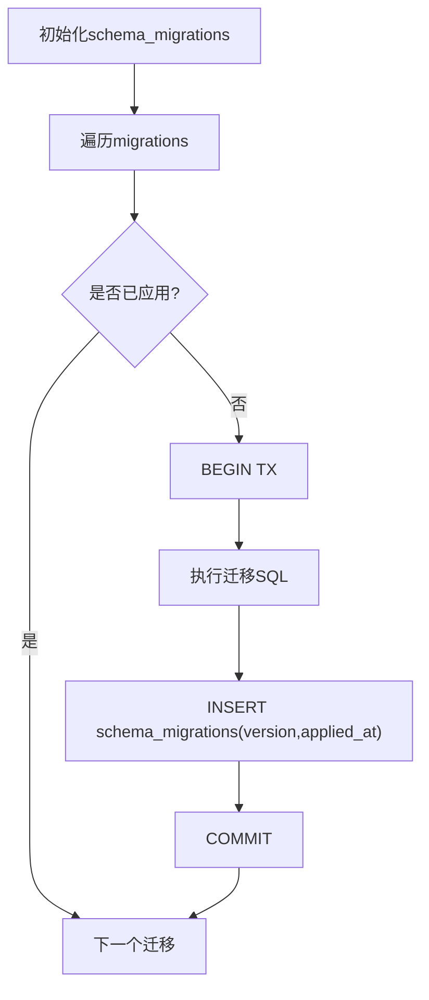
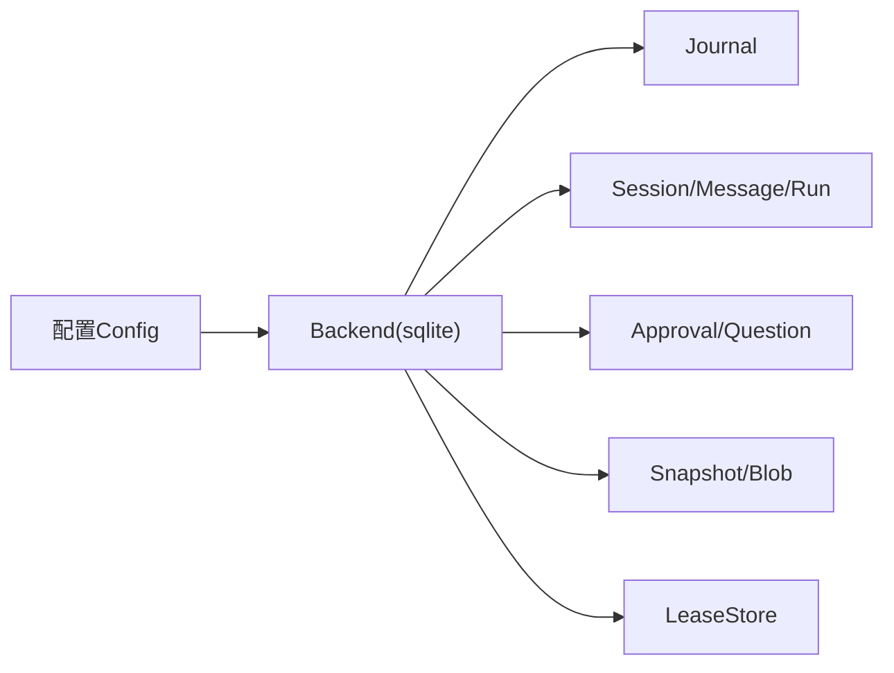

# SQLite后端实现

<cite>
**本文引用的文件**
- [sqlite.go](file://internal/storage/sqlite/sqlite.go)
- [journal.go](file://internal/storage/sqlite/journal.go)
- [messages.go](file://internal/storage/sqlite/messages.go)
- [sessions.go](file://internal/storage/sqlite/sessions.go)
- [runs.go](file://internal/storage/sqlite/runs.go)
- [snapshot.go](file://internal/storage/sqlite/snapshot.go)
- [blob.go](file://internal/storage/sqlite/blob.go)
- [contracts.go](file://internal/storage/contracts.go)
- [doc.go](file://internal/storage/doc.go)
- [config.go](file://internal/config/config.go)
</cite>

## 目录
1. [简介](#简介)
2. [项目结构](#项目结构)
3. [核心组件](#核心组件)
4. [架构总览](#架构总览)
5. [详细组件分析](#详细组件分析)
6. [依赖关系分析](#依赖关系分析)
7. [性能考量](#性能考量)
8. [故障排查指南](#故障排查指南)
9. [结论](#结论)
10. [附录](#附录)

## 简介
本文件面向 Agent-Vivy 的 SQLite 默认存储后端，系统性说明其架构设计、表结构与索引策略、事件日志追加与重放、会话消息存储与查询、迁移机制、备份恢复与数据压缩策略，以及 SQLite 特有的性能监控与故障排查方法。SQLite 作为单文件数据库，具备部署简单、零外部依赖（纯 Go 驱动）、易于备份与版本迁移等优势；本项目通过单一写者模型与事务边界控制，将并发竞争降至最低，同时保证事件顺序性与一致性。

## 项目结构
SQLite 后端位于 internal/storage/sqlite 包，围绕 storage.Engine 接口提供多类存储能力：Journal（事件日志）、SessionStore/MessageStore/RunStore（会话与运行生命周期）、ApprovalStore/QuestionStore（人机交互审批与问答）、NoteStore/SkillRevisionStore/TodoStore（笔记、技能修订、待办）、StudioStore（Studio 对象平面）、LeaseStore（分布式锁/租约）、SnapshotStore/BlobStore（快照与大对象）。所有 SQL 细节被封装在 sqlite 包内，domain 层不感知 SQLite 特性。

图表来源
- [sqlite.go:40-88](file://internal/storage/sqlite/sqlite.go#L40-L88)
- [contracts.go:55-273](file://internal/storage/contracts.go#L55-L273)

章节来源
- [sqlite.go:1-88](file://internal/storage/sqlite/sqlite.go#L1-L88)
- [contracts.go:1-282](file://internal/storage/contracts.go#L1-L282)
- [doc.go:1-18](file://internal/storage/doc.go#L1-L18)

## 核心组件
- 后端初始化与连接池：Open 打开或创建 SQLite 数据库文件，设置最大连接数为 1（单写者），随后执行迁移并返回 Backend。
- 迁移系统：按序执行 migrations，每个迁移在独立事务中应用并记录 schema_migrations，失败即中止启动。
- 事件日志 Journal：Append 原子写入连续 seq 范围，严格保证“恰好一个终态事件”不变式；Replay 支持 after_seq 游标流式重放。
- 会话与消息：Create/List/Get/Rename/Delete Session；AppendMessage 仅追加；ListMessages 按创建时间排序读取。
- 运行生命周期：CreateRun/SetRunStatus/ListActiveRuns/ListChildRuns/ListRunTree，维护父子树与根节点关系。
- 快照与大对象：Snapshot 乐观并发 Put；Blobs 基于 generation 的不可变追加与指针翻转。
- 其他存储：Approval/Question/Note/SkillRevision/Todo/Studio/Lease 等，均通过同一 sql.DB 共享底层存储。

章节来源
- [sqlite.go:40-147](file://internal/storage/sqlite/sqlite.go#L40-L147)
- [journal.go:14-86](file://internal/storage/sqlite/journal.go#L14-L86)
- [messages.go:10-53](file://internal/storage/sqlite/messages.go#L10-L53)
- [sessions.go:13-116](file://internal/storage/sqlite/sessions.go#L13-L116)
- [runs.go:15-127](file://internal/storage/sqlite/runs.go#L15-L127)
- [snapshot.go:12-71](file://internal/storage/sqlite/snapshot.go#L12-L71)
- [blob.go:13-89](file://internal/storage/sqlite/blob.go#L13-L89)

## 架构总览
SQLite 后端以单一 sql.DB 句柄承载所有存储契约，通过事务与约束保障一致性与幂等性。事件日志采用追加写入与有序 seq，会话消息为不可变追加，运行状态变更通过显式更新。快照与大对象分别采用版本号与 generation 指针模式，避免原地修改。

图表来源
- [journal.go:18-75](file://internal/storage/sqlite/journal.go#L18-L75)
- [sqlite.go:109-147](file://internal/storage/sqlite/sqlite.go#L109-L147)

章节来源
- [journal.go:14-86](file://internal/storage/sqlite/journal.go#L14-L86)
- [sqlite.go:40-147](file://internal/storage/sqlite/sqlite.go#L40-L147)

## 详细组件分析

### 事件日志（Journal）
- 追加写入：校验 commit 非空且至多包含一个终态事件；若 run 已存在终态事件则拒绝追加；在事务内获取 MAX(seq) 后连续分配 seq 并插入 run_events。
- 重放：按 run_id 和 after 游标顺序扫描 run_events，使用迭代器逐条返回 Entry。
- 不变式：D-008 确保每个 run 恰有一个终态事件，防止重复完成/失败/取消。

图表来源
- [journal.go:18-75](file://internal/storage/sqlite/journal.go#L18-L75)

章节来源
- [journal.go:14-86](file://internal/storage/sqlite/journal.go#L14-L86)
- [contracts.go:33-64](file://internal/storage/contracts.go#L33-L64)

### 会话与消息（Sessions & Messages）
- 会话：创建、列出、获取、重命名、删除（级联删除消息、运行与事件）。
- 消息：仅追加写入，无更新路径；列表按 created_at,id 排序，便于 UI 展示与分页。
- 外键约束：messages.session_id 引用 sessions.id，保证引用完整性。

图表来源
- [sessions.go:13-116](file://internal/storage/sqlite/sessions.go#L13-L116)
- [messages.go:10-53](file://internal/storage/sqlite/messages.go#L10-L53)
- [sqlite.go:151-174](file://internal/storage/sqlite/sqlite.go#L151-L174)

章节来源
- [sessions.go:13-116](file://internal/storage/sqlite/sessions.go#L13-L116)
- [messages.go:10-53](file://internal/storage/sqlite/messages.go#L10-L53)
- [sqlite.go:151-174](file://internal/storage/sqlite/sqlite.go#L151-L174)

### 运行生命周期（Runs）
- 创建运行：默认 kind=primary，root_run_id 为空时等于 id；维护 parent_run_id、depth 等字段用于树形遍历。
- 状态变更：SetRunStatus 由领域状态机负责合法性，存储层仅持久化。
- 查询：ListActiveRuns 用于重启恢复；ListChildRuns/ListRunTree 支持父子树遍历。

图表来源
- [runs.go:15-127](file://internal/storage/sqlite/runs.go#L15-L127)

章节来源
- [runs.go:15-127](file://internal/storage/sqlite/runs.go#L15-L127)

### 快照与大对象（Snapshot & Blobs）
- Snapshot：Get 返回值与版本；Put 使用乐观并发（expectVersion），不存在时 expectVersion 必须为 0。
- Blobs：Put 先插入新 generation，再原子翻转 checkpoints 指针（ON CONFLICT 更新）；Get 通过 JOIN 当前 generation 读取；Delete 级联删除指针与所有 generation。

图表来源
- [snapshot.go:34-71](file://internal/storage/sqlite/snapshot.go#L34-L71)

章节来源
- [snapshot.go:12-71](file://internal/storage/sqlite/snapshot.go#L12-L71)
- [blob.go:18-89](file://internal/storage/sqlite/blob.go#L18-L89)
- [contracts.go:66-85](file://internal/storage/contracts.go#L66-L85)

### 迁移机制（Migrations）
- 版本化：schema_migrations 记录已应用的迁移版本与时间戳。
- 顺序执行：migrations 数组按版本顺序定义，未应用则在新事务中执行 SQL 并记录。
- 失败处理：任一迁移失败立即回滚并上报错误，启动中止（FR-8）。

图表来源
- [sqlite.go:109-147](file://internal/storage/sqlite/sqlite.go#L109-L147)

章节来源
- [sqlite.go:109-147](file://internal/storage/sqlite/sqlite.go#L109-L147)

## 依赖关系分析
- 接口契约：storage 包定义了 Journal、SnapshotStore、BlobStore、LeaseStore、SessionStore、MessageStore、RunStore、ApprovalStore、QuestionStore、NoteStore、SkillRevisionStore、TodoStore、StudioStore、Engine 等接口，sqlite 包实现这些接口并通过编译期断言验证。
- 配置绑定：config.Storage.Backend 默认 sqlite，SQLite.Path 指定数据库文件位置；DataDir 决定非 Journal 文件的存放目录。
- 单写者模型：sqlite.Open 强制 SetMaxOpenConns(1)，避免 WAL/锁争用复杂化，简化并发模型。

图表来源
- [config.go:70-83](file://internal/config/config.go#L70-L83)
- [sqlite.go:40-88](file://internal/storage/sqlite/sqlite.go#L40-L88)
- [contracts.go:252-273](file://internal/storage/contracts.go#L252-L273)

章节来源
- [config.go:70-83](file://internal/config/config.go#L70-L83)
- [sqlite.go:40-88](file://internal/storage/sqlite/sqlite.go#L40-L88)
- [contracts.go:252-273](file://internal/storage/contracts.go#L252-L273)

## 性能考量
- 单写者与连接池：SetMaxOpenConns(1) 降低锁竞争，适合单机进程内多协程并发读的场景。
- 追加写入优化：事件与消息均为只追加，避免热点行更新；run_events 主键(run_id,seq) 与 messages.created_at,id 排序利于顺序写入与顺序读取。
- 批量插入：Append 使用预编译语句循环插入，减少往返；对高吞吐场景可考虑在应用层合并多个 commit 以减少事务开销。
- WAL 模式：仓库注释表明不通过契约暴露 WAL 相关参数；如需启用 WAL，应在驱动连接字符串或初始化阶段配置，但需遵循 D-027 不泄漏到上层。
- 索引策略：
  - runs.parent_run_id、runs.root_run_id 索引支持父子树查询。
  - approvals.status/expires_at、questions.status/expires_at 索引加速过期清理与队列查询。
  - todos.session_id,position 索引支持会话内任务排序。
  - eval_runs.candidate_id 索引支持评估结果聚合。
- 查询优化：
  - 会话消息分页：建议在上层使用 LIMIT/OFFSET 或基于 created_at,id 的分页键进行高效分页。
  - 事件重放：Replay 使用 ORDER BY seq 顺序扫描，适合增量消费。
- 事务隔离级别：代码中使用默认隔离级别（通常为 READ COMMITTED），满足大多数业务需求；如需更强一致性，可在事务选项中调整，但需评估 SQLite 限制与性能影响。
- 数据压缩：SQLite 原生 VACUUM 可重建数据库并压缩空间；对于 BlobStore 的大对象，建议定期归档或删除旧 generation 以降低体积。

[本节为通用性能指导，不直接分析具体文件]

## 故障排查指南
- 启动失败（迁移失败）：检查 schema_migrations 表与迁移 SQL 语法；确认数据库文件权限与磁盘空间。
- 追加事件失败：
  - ErrRunClosed：目标 run 已存在终态事件，检查上游状态机逻辑。
  - ErrCommitInvalid：commit 为空或包含多于一个终态事件，检查调用方构造。
- 会话删除未生效：检查 DeleteSession 事务是否提交；确认外键约束未被禁用。
- 快照冲突：Put 返回 ErrVersionConflict，表示期望版本与实际不一致；重试或重新获取最新版本。
- 大对象读取失败：Blobs.Get 返回 false 表示不存在；检查 Delete 是否误删；确认 checkpoints 与 checkpoint_generations 的一致性。
- 性能退化：
  - 大量事件导致 run_events 膨胀，考虑归档历史或分库分表。
  - 频繁更新 approvals/questions 过期项，利用现有索引与定时清扫。
  - 使用 EXPLAIN QUERY PLAN 分析慢查询，必要时增加覆盖索引。

章节来源
- [journal.go:18-75](file://internal/storage/sqlite/journal.go#L18-L75)
- [snapshot.go:34-71](file://internal/storage/sqlite/snapshot.go#L34-L71)
- [blob.go:55-89](file://internal/storage/sqlite/blob.go#L55-L89)
- [sessions.go:70-116](file://internal/storage/sqlite/sessions.go#L70-L116)
- [sqlite.go:109-147](file://internal/storage/sqlite/sqlite.go#L109-L147)

## 结论
SQLite 作为默认存储后端，凭借单文件、零 CGO 驱动、简单迁移与强一致事务，为 Agent-Vivy 提供了可靠的数据底座。通过单写者模型、追加写入与有序 seq、外键约束与索引策略，系统在易用性与性能之间取得平衡。未来可根据规模扩展引入 WAL、分区与归档策略，并在保持契约不变的前提下平滑演进。

[本节为总结性内容，不直接分析具体文件]

## 附录

### 表结构设计要点
- sessions：id(主键)、title、created_at、sandbox_mode、approval_policy。
- messages：id(主键)、session_id(外键)、run_id、role、created_at、content(BLOB)、tool_call_id、tool_name、tool_args(BLOB)。
- runs：id(主键)、session_id(外键)、status、created_at、kind、parent_run_id、root_run_id、depth。
- run_events：主键(run_id,seq)、type、created_at、payload_version、payload(BLOB)。
- approvals：id(主键)、run_id、tool_call_id、decision、expires_at、resume_target、action、target、precondition_hash、preview(BLOB)、risk_findings_json(BLOB)、proposal_data(BLOB)、tool_name、created_at、decided_at、actor、decision_reason(BLOB)、stale_reason(BLOB)、sandbox_mode、approval_policy、timeout_at。
- questions：id(主键)、run_id(外键)、tool_call_id、prompt(BLOB)、answer(BLOB)、status、expires_at、resume_target、created_at、answered_at、actor、decision_reason(BLOB)。
- snapshots：key(主键)、value(BLOB)、version。
- checkpoints/checkpoint_generations：指针与不可变 generation 组合，支持原子翻转与回溯。
- leases：key(主键)、owner、expires_at。
- notes：id(主键)、content(BLOB)、created_at。
- skill_revisions：id(主键)、run_id、skill_name、action、target_path、payload(BLOB)、base_hash、content_hash、preview(BLOB)、warnings_json(BLOB)、status、created_at、applied_at、before_payload(BLOB)。
- todos：复合主键(session_id,id)、subject、description、status、blocks_json(BLOB)、blocked_by_json(BLOB)、active_form、owner、metadata_json(BLOB)、position、created_at、updated_at。
- studio 对象：generations、eval_runs、promotions、studio_events。

章节来源
- [sqlite.go:151-405](file://internal/storage/sqlite/sqlite.go#L151-L405)

### 索引策略摘要
- runs.parent_run_id, runs.root_run_id：父子树查询。
- approvals.status,expires_at；questions.status,expires_at：过期清理与队列。
- todos.session_id,position：会话内任务排序。
- eval_runs.candidate_id：评估结果聚合。
- studio_events.seq：自增主键，顺序追加。

章节来源
- [sqlite.go:253-394](file://internal/storage/sqlite/sqlite.go#L253-L394)

### 备份恢复方案
- 冷备份：停止服务后复制 vivy.db 文件；适用于停机窗口。
- 热备份：启用 WAL 模式后，可使用 SQLite 提供的备份 API 或文件系统快照；注意一致性时间点。
- 恢复：替换数据库文件后重启服务，迁移系统自动校验与应用。

[本节为通用操作建议，不直接分析具体文件]

### 数据压缩策略
- VACUUM：重建数据库并回收空闲页，建议在低峰期执行。
- 归档旧 generation：定期清理不再需要的 checkpoint_generations，减少体积。
- 事件与消息归档：将历史 run_events 与 messages 迁移至归档库或冷存储，保留近期数据以提升查询性能。

[本节为通用操作建议，不直接分析具体文件]

### 配置项参考
- storage.backend：选择 "sqlite" 或 "postgres"。
- storage.sqlite.path：SQLite 数据库文件路径。
- storage.data_dir：非 Journal 数据目录，默认取 SQLite 所在目录或 "data"。

章节来源
- [config.go:70-83](file://internal/config/config.go#L70-L83)
- [config.go:254-260](file://internal/config/config.go#L254-L260)