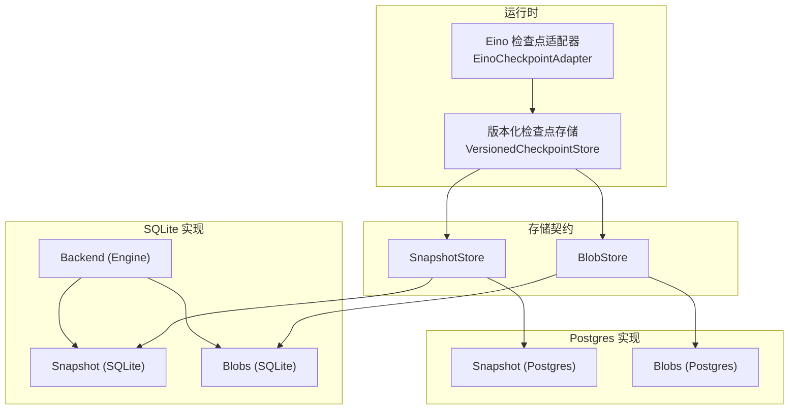
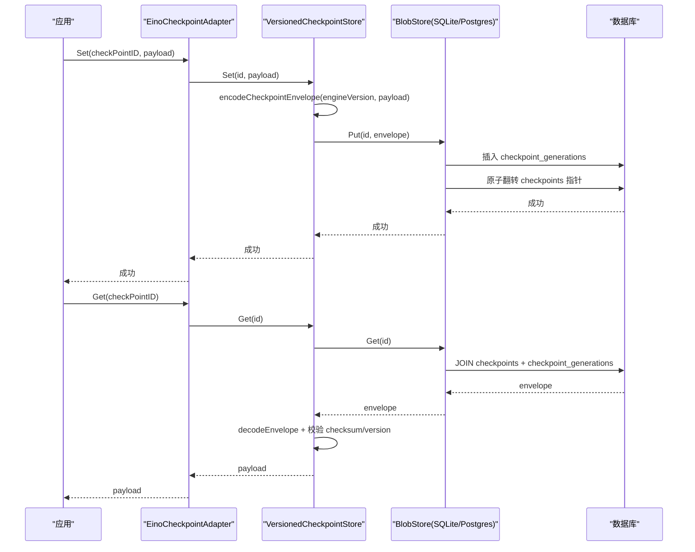
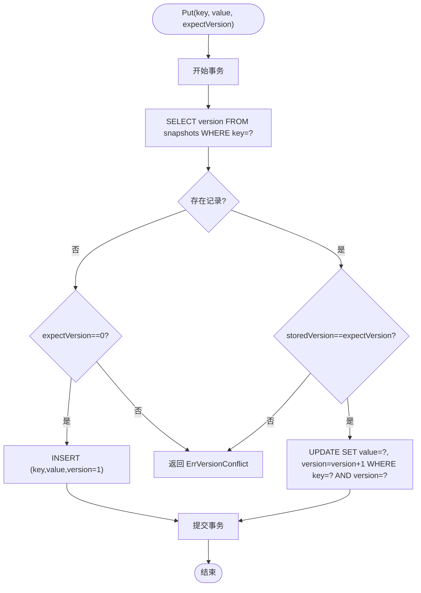
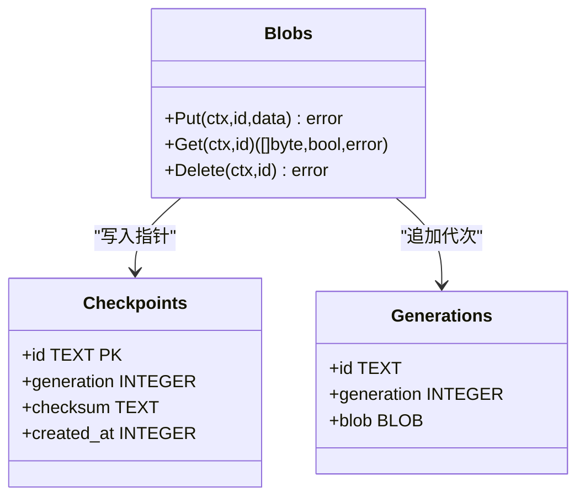
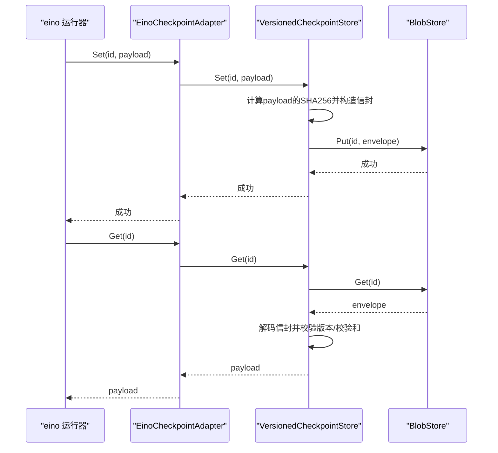
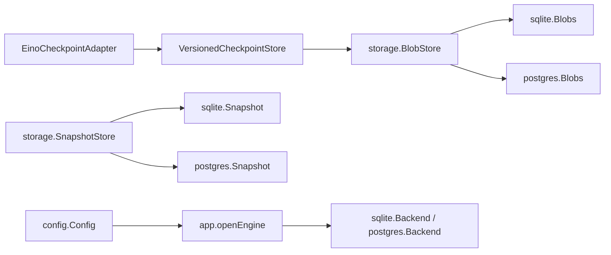

# 快照与二进制存储

<cite>
**本文引用的文件**
- [internal/storage/contracts.go](file://internal/storage/contracts.go)
- [internal/storage/sqlite/snapshot.go](file://internal/storage/sqlite/snapshot.go)
- [internal/storage/sqlite/blob.go](file://internal/storage/sqlite/blob.go)
- [internal/storage/sqlite/sqlite.go](file://internal/storage/sqlite/sqlite.go)
- [internal/storage/postgres/snapshot.go](file://internal/storage/postgres/snapshot.go)
- [internal/storage/postgres/blob.go](file://internal/storage/postgres/blob.go)
- [internal/runtime/checkpoint.go](file://internal/runtime/checkpoint.go)
- [internal/runtime/checkpointadapter.go](file://internal/runtime/checkpointadapter.go)
- [internal/config/config.go](file://internal/config/config.go)
- [internal/app/app.go](file://internal/app/app.go)
</cite>

## 目录
1. [简介](#简介)
2. [项目结构](#项目结构)
3. [核心组件](#核心组件)
4. [架构总览](#架构总览)
5. [详细组件分析](#详细组件分析)
6. [依赖关系分析](#依赖关系分析)
7. [性能考虑](#性能考虑)
8. [故障恢复指南](#故障恢复指南)
9. [结论](#结论)
10. [附录：备份、迁移与清理](#附录备份迁移与清理)

## 简介
本文件聚焦于 Vivy 的“快照”和“二进制存储”能力，围绕以下目标展开：
- SnapshotStore 接口的实现原理：检查点快照的存储格式、版本控制机制、乐观并发控制。
- BlobStore 的二进制数据存储：大对象存储策略、校验与一致性、指针翻转原子性。
- 快照生成与恢复流程、数据一致性保证、存储空间管理。
- 性能调优参数、监控指标、故障恢复策略。
- 快照备份、迁移、清理工具的使用说明（基于现有后端能力）。

本项目默认使用 SQLite 作为持久化引擎，Postgres 为可选的 Journal 后端；两者均通过统一的 storage 契约暴露接口，确保上层运行时与具体存储解耦。

## 项目结构
与快照和二进制存储相关的代码主要分布在以下位置：
- 存储契约定义：internal/storage/contracts.go
- SQLite 实现：internal/storage/sqlite/*（snapshot.go、blob.go、sqlite.go）
- Postgres 实现：internal/storage/postgres/*（snapshot.go、blob.go）
- 运行时检查点封装：internal/runtime/checkpoint.go、checkpointadapter.go
- 配置与启动装配：internal/config/config.go、internal/app/app.go

图表来源
- [internal/runtime/checkpointadapter.go:9-43](file://internal/runtime/checkpointadapter.go#L9-L43)
- [internal/runtime/checkpoint.go:40-102](file://internal/runtime/checkpoint.go#L40-L102)
- [internal/storage/contracts.go:66-85](file://internal/storage/contracts.go#L66-L85)
- [internal/storage/sqlite/sqlite.go:57-88](file://internal/storage/sqlite/sqlite.go#L57-L88)
- [internal/storage/sqlite/snapshot.go:12-70](file://internal/storage/sqlite/snapshot.go#L12-L70)
- [internal/storage/sqlite/blob.go:13-88](file://internal/storage/sqlite/blob.go#L13-L88)
- [internal/storage/postgres/snapshot.go:12-82](file://internal/storage/postgres/snapshot.go#L12-L82)
- [internal/storage/postgres/blob.go:13-88](file://internal/storage/postgres/blob.go#L13-L88)

章节来源
- [internal/storage/contracts.go:66-85](file://internal/storage/contracts.go#L66-L85)
- [internal/storage/sqlite/sqlite.go:57-88](file://internal/storage/sqlite/sqlite.go#L57-L88)
- [internal/runtime/checkpoint.go:40-102](file://internal/runtime/checkpoint.go#L40-L102)
- [internal/runtime/checkpointadapter.go:9-43](file://internal/runtime/checkpointadapter.go#L9-L43)

## 核心组件
- SnapshotStore：按 key 维护最新一致状态，带版本号，Put 采用乐观并发控制（期望版本匹配才写入）。
- BlobStore：以 id 为单位存储二进制对象，写操作追加新代次（generation），并原子翻转指针指向最新代次；读操作返回当前代次的 blob。
- VersionedCheckpointStore：在 BlobStore 之上为 Eino 检查点添加信封（包含引擎版本与 payload 的 SHA-256 校验），读取时进行失败关闭式验证。
- EinoCheckpointAdapter：将 VersionedCheckpointStore 适配到 eino 的 CheckPointStore 接口，使 eino 类型不泄漏到运行时边界之外。

章节来源
- [internal/storage/contracts.go:66-85](file://internal/storage/contracts.go#L66-L85)
- [internal/runtime/checkpoint.go:31-102](file://internal/runtime/checkpoint.go#L31-L102)
- [internal/runtime/checkpointadapter.go:9-43](file://internal/runtime/checkpointadapter.go#L9-L43)

## 架构总览
Vivy 的快照与二进制存储由“契约 + 多后端实现 + 运行时封装”三层组成：
- 契约层：定义 SnapshotStore、BlobStore 等接口及错误语义。
- 实现层：SQLite 与 Postgres 分别实现这些接口，共享数据库事务与约束。
- 运行时代码：通过 VersionedCheckpointStore 对 Eino 检查点进行信封包装与校验，并通过 EinoCheckpointAdapter 注入给 eino 框架。

图表来源
- [internal/runtime/checkpoint.go:64-97](file://internal/runtime/checkpoint.go#L64-L97)
- [internal/runtime/checkpointadapter.go:21-43](file://internal/runtime/checkpointadapter.go#L21-L43)
- [internal/storage/sqlite/blob.go:20-53](file://internal/storage/sqlite/blob.go#L20-L53)
- [internal/storage/postgres/blob.go:20-53](file://internal/storage/postgres/blob.go#L20-L53)

## 详细组件分析

### SnapshotStore 实现原理（SQLite/Postgres）
- 存储格式：
  - snapshots 表包含 key（主键）、value（BLOB）、version（整数）。
  - 不存在 key 时，Get 返回 (nil, 0, nil)。
- 版本控制与乐观并发：
  - Put 在事务中先读取当前 version，若 expectVersion 为 0 且不存在则插入 version=1；否则要求 stored version == expectVersion，更新 value 并将 version+1。
  - 冲突时返回 ErrVersionConflict，调用方可据此重试或降级。
- 一致性：
  - 所有读写在事务内完成，SQLite 单连接避免竞争；Postgres 使用条件更新确保原子性。

图表来源
- [internal/storage/sqlite/snapshot.go:34-70](file://internal/storage/sqlite/snapshot.go#L34-L70)
- [internal/storage/postgres/snapshot.go:34-82](file://internal/storage/postgres/snapshot.go#L34-L82)
- [internal/storage/contracts.go:66-75](file://internal/storage/contracts.go#L66-L75)

章节来源
- [internal/storage/sqlite/snapshot.go:12-70](file://internal/storage/sqlite/snapshot.go#L12-L70)
- [internal/storage/postgres/snapshot.go:12-82](file://internal/storage/postgres/snapshot.go#L12-L82)
- [internal/storage/contracts.go:66-75](file://internal/storage/contracts.go#L66-L75)

### BlobStore 二进制存储（SQLite/Postgres）
- 存储格式：
  - checkpoint_generations：id、generation、blob（不可变历史）。
  - checkpoints：id（主键）、generation（当前指针）、checksum（SHA-256 十六进制字符串）、created_at。
- 写入策略（D-030）：
  - Put 计算 data 的 SHA-256，插入新的 generation 行，然后原子翻转 checkpoints 指针至该 generation，并记录 checksum 与时间戳。
  - 旧代次永不原地修改，支持回滚与审计。
- 读取策略：
  - Get 通过 JOIN checkpoints 与 checkpoint_generations 获取当前 generation 的 blob。
- 删除策略：
  - Delete 同时删除 pointers 与对应 generations，释放空间。

图表来源
- [internal/storage/sqlite/sqlite.go:194-212](file://internal/storage/sqlite/sqlite.go#L194-L212)
- [internal/storage/sqlite/blob.go:20-88](file://internal/storage/sqlite/blob.go#L20-L88)
- [internal/storage/postgres/blob.go:20-88](file://internal/storage/postgres/blob.go#L20-L88)

章节来源
- [internal/storage/sqlite/sqlite.go:194-212](file://internal/storage/sqlite/sqlite.go#L194-L212)
- [internal/storage/sqlite/blob.go:13-88](file://internal/storage/sqlite/blob.go#L13-L88)
- [internal/storage/postgres/blob.go:13-88](file://internal/storage/postgres/blob.go#L13-L88)

### 检查点信封与版本控制（VersionedCheckpointStore）
- 信封格式：
  - 头部：4 字节大端长度 + JSON 头（engine_version、checksum_sha256、created_at）。
  - 负载：原始 eino 检查点字节。
- 写入：
  - 计算 payload 的 SHA-256，构造信封后通过 BlobStore.Put 保存为新代次。
- 读取：
  - 解码信封，校验 engine_version 与当前构建版本一致，校验 checksum 与 payload 匹配；任一失败返回错误（fail-closed）。
- 删除：
  - 委托 BlobStore.Delete 移除指针与全部代次。

图表来源
- [internal/runtime/checkpoint.go:31-102](file://internal/runtime/checkpoint.go#L31-L102)
- [internal/runtime/checkpointadapter.go:21-43](file://internal/runtime/checkpointadapter.go#L21-L43)

章节来源
- [internal/runtime/checkpoint.go:31-102](file://internal/runtime/checkpoint.go#L31-L102)
- [internal/runtime/checkpointadapter.go:9-43](file://internal/runtime/checkpointadapter.go#L9-L43)

### 存储引擎选择与初始化
- 配置项：
  - storage.backend：sqlite（默认）或 postgres。
  - storage.sqlite.path：SQLite 文件路径。
  - storage.postgres.dsn_env：Postgres DSN 的环境变量名（DSN 不落地配置）。
- 启动逻辑：
  - 根据 backend 选择 sqlite.Open 或 postgres.Open；SQLite 会创建目录并设置单连接。
  - 打开后执行迁移脚本，确保 schema 就绪。

章节来源
- [internal/config/config.go:70-89](file://internal/config/config.go#L70-L89)
- [internal/config/config.go:254-314](file://internal/config/config.go#L254-L314)
- [internal/app/app.go:427-454](file://internal/app/app.go#L427-L454)
- [internal/storage/sqlite/sqlite.go:38-55](file://internal/storage/sqlite/sqlite.go#L38-L55)

## 依赖关系分析
- 运行时与存储契约：
  - EinoCheckpointAdapter 依赖 adk.CheckPointStore 接口，内部委托 VersionedCheckpointStore。
  - VersionedCheckpointStore 依赖 storage.BlobStore，不感知底层实现。
- 存储契约与后端：
  - SQLite 与 Postgres 各自实现 SnapshotStore 与 BlobStore，遵循相同语义。
- 配置与装配：
  - config.Config 提供存储后端选择与路径/环境变量。
  - app.openEngine 根据配置打开对应后端，并返回统一 storage.Engine。

图表来源
- [internal/runtime/checkpointadapter.go:9-43](file://internal/runtime/checkpointadapter.go#L9-L43)
- [internal/runtime/checkpoint.go:40-102](file://internal/runtime/checkpoint.go#L40-L102)
- [internal/storage/contracts.go:66-85](file://internal/storage/contracts.go#L66-L85)
- [internal/storage/sqlite/sqlite.go:57-88](file://internal/storage/sqlite/sqlite.go#L57-L88)
- [internal/storage/postgres/blob.go:13-88](file://internal/storage/postgres/blob.go#L13-L88)
- [internal/config/config.go:70-89](file://internal/config/config.go#L70-L89)
- [internal/app/app.go:427-454](file://internal/app/app.go#L427-L454)

章节来源
- [internal/storage/contracts.go:66-85](file://internal/storage/contracts.go#L66-L85)
- [internal/storage/sqlite/sqlite.go:57-88](file://internal/storage/sqlite/sqlite.go#L57-L88)
- [internal/storage/postgres/blob.go:13-88](file://internal/storage/postgres/blob.go#L13-L88)
- [internal/config/config.go:70-89](file://internal/config/config.go#L70-L89)
- [internal/app/app.go:427-454](file://internal/app/app.go#L427-L454)

## 性能考虑
- SQLite 单写者模型：
  - 通过 SetMaxOpenConns(1) 保持单连接，降低 WAL 与锁争用，适合单机场景。
- 事务粒度：
  - Snapshot Put、Blob Put/Delete 均在事务中执行，保证原子性与一致性。
- 索引与查询：
  - checkpoints 与 checkpoint_generations 通过 id/generation 关联，Get 使用 JOIN 定位当前代次。
  - 其他业务表（如 run_events、approvals、questions）有相应索引优化查询。
- 内存与大小限制：
  - 运行时配置限制事件负载、上下文、工具结果等大小，间接影响快照与二进制对象的大小与频率。
- 压缩算法：
  - 当前实现未引入额外压缩；如需压缩可在 VersionedCheckpointStore 层对 payload 进行压缩后再写入，但需权衡 CPU 与体积。
- 分块读取优化：
  - 当前 BlobStore 不支持分块读取；如需优化大对象读取，可考虑在应用层拆分多个 id 或使用外部对象存储。

[本节为通用指导，不直接分析具体文件]

## 故障恢复指南
- 检查点损坏或版本不匹配：
  - VersionedCheckpointStore 在读取时校验 engine_version 与 checksum，任一失败返回错误（fail-closed），不会将损坏数据交给引擎。
- 崩溃恢复钩子（CN-11）：
  - Backend 暴露 DropCheckpointPointer、CountCheckpointGenerations、DeleteCheckpointGenerations 用于清理孤儿指针与代次。
- 乐观并发冲突：
  - Snapshot Put 返回 ErrVersionConflict，调用方应重试或降级处理。
- 日志与脱敏：
  - 密钥不持久化；日志、快照、事件负载需脱敏（遵循 D-010）。

章节来源
- [internal/runtime/checkpoint.go:17-27](file://internal/runtime/checkpoint.go#L17-L27)
- [internal/storage/sqlite/sqlite.go:90-107](file://internal/storage/sqlite/sqlite.go#L90-L107)
- [internal/storage/contracts.go:11-31](file://internal/storage/contracts.go#L11-L31)

## 结论
- SnapshotStore 提供轻量级键值快照与乐观并发控制，适用于快速状态切换与重试。
- BlobStore 以代次追加与指针翻转的方式安全存储二进制对象，结合 VersionedCheckpointStore 的版本与校验，确保检查点的一致性与安全性。
- SQLite 作为默认后端满足单机场景的性能与一致性需求；Postgres 可作为可选扩展。
- 建议在生产环境中结合监控指标（事务耗时、冲突率、代次数量）与定期清理策略，维持系统稳定。

[本节为总结，不直接分析具体文件]

## 附录：备份、迁移与清理

### 备份
- SQLite：
  - 由于 SQLite 是单文件数据库，可直接复制 data/vivy.db 进行备份（建议在空闲时段或短暂停止服务后进行）。
- Postgres：
  - 使用 pg_dump/pg_restore 或云厂商提供的备份方案。

### 迁移
- 启动时自动迁移：
  - SQLite 在 Open 时执行 migrations 列表中的 SQL，逐步升级 schema。
- 手动迁移：
  - 对于 Postgres，可使用迁移脚本或 ORM 工具；注意保持向后兼容。

### 清理
- 删除检查点：
  - 通过 BlobStore.Delete 删除指定 id 的所有代次与指针。
- 清理孤儿指针：
  - 使用 Backend 的 DropCheckpointPointer、CountCheckpointGenerations、DeleteCheckpointGenerations 清理异常状态。
- 快照清理：
  - 目前无内置快照清理接口；可按业务需要编写定时任务删除过期 key。

章节来源
- [internal/storage/sqlite/sqlite.go:109-147](file://internal/storage/sqlite/sqlite.go#L109-L147)
- [internal/storage/sqlite/sqlite.go:90-107](file://internal/storage/sqlite/sqlite.go#L90-L107)
- [internal/storage/sqlite/blob.go:73-88](file://internal/storage/sqlite/blob.go#L73-L88)