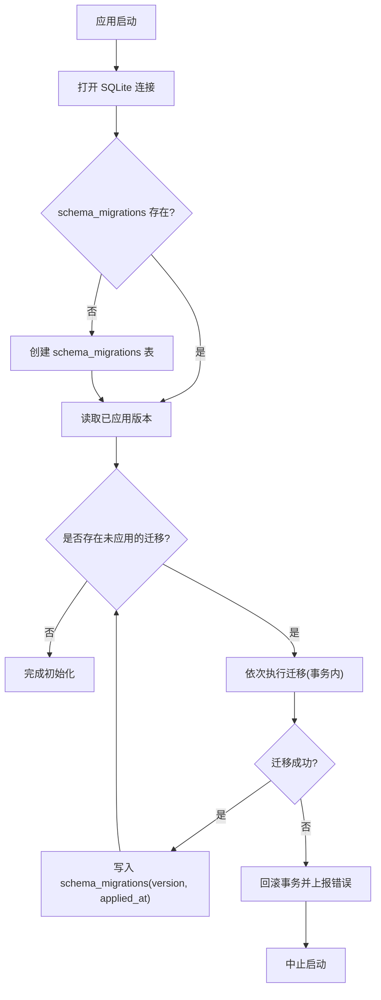
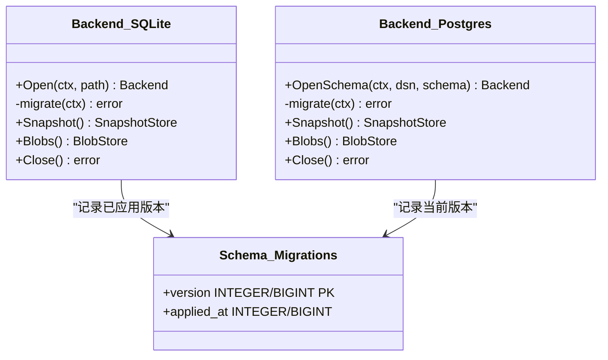
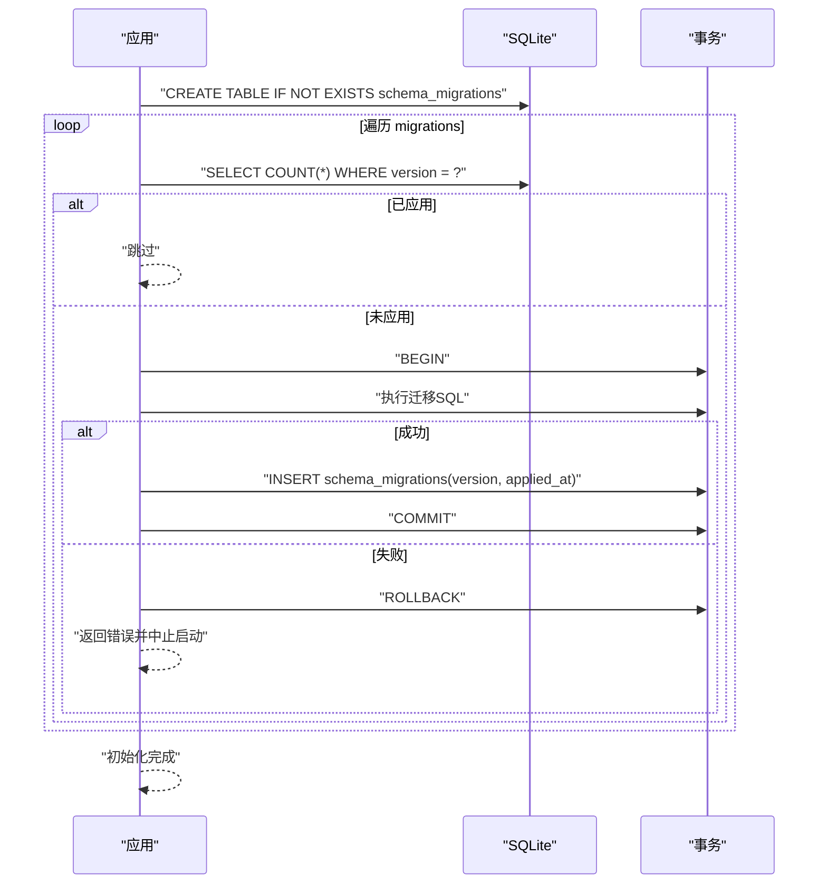
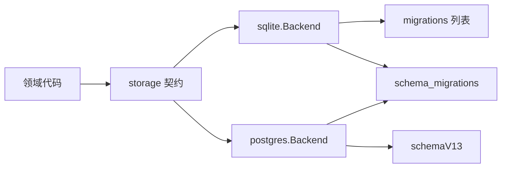

# 数据库迁移系统

<cite>
**本文引用的文件**
- [internal/storage/sqlite/sqlite.go](file://internal/storage/sqlite/sqlite.go)
- [internal/storage/postgres/schema.go](file://internal/storage/postgres/schema.go)
- [internal/storage/postgres/postgres.go](file://internal/storage/postgres/postgres.go)
- [internal/storage/contracts.go](file://internal/storage/contracts.go)
- [internal/storage/doc.go](file://internal/storage/doc.go)
- [internal/storage/sqlite/sqlite_test.go](file://internal/storage/sqlite/sqlite_test.go)
</cite>

## 目录
1. [简介](#简介)
2. [项目结构](#项目结构)
3. [核心组件](#核心组件)
4. [架构总览](#架构总览)
5. [详细组件分析](#详细组件分析)
6. [依赖关系分析](#依赖关系分析)
7. [性能考量](#性能考量)
8. [故障排查指南](#故障排查指南)
9. [结论](#结论)
10. [附录](#附录)

## 简介
本文件系统性说明 Vivy 的 SQLite 数据库迁移机制与版本管理，覆盖 schema_migrations 表设计、迁移顺序执行、事务保证、失败回滚策略、数据兼容性与向后兼容策略。同时梳理从 V0（基础表结构）到 V13（沙箱模式）的完整演进历史，并给出新迁移编写规范、测试方法、部署流程以及迁移监控、版本查询与回滚工具的使用建议。

## 项目结构
Vivy 的持久化层通过统一的存储契约暴露能力，SQLite 作为默认后端实现，Postgres 作为可选后端。迁移逻辑集中在 SQLite 后端的启动阶段：按序检查并应用未执行的迁移，每个迁移在独立事务中执行，成功后记录到 schema_migrations 表；任一迁移失败将中止启动，确保数据库状态一致性。

图表来源
- [internal/storage/sqlite/sqlite.go:109-147](file://internal/storage/sqlite/sqlite.go#L109-L147)

章节来源
- [internal/storage/sqlite/sqlite.go:17-36](file://internal/storage/sqlite/sqlite.go#L17-L36)
- [internal/storage/sqlite/sqlite.go:109-147](file://internal/storage/sqlite/sqlite.go#L109-L147)
- [internal/storage/doc.go:1-18](file://internal/storage/doc.go#L1-L18)

## 核心组件
- 迁移编排器：维护迁移版本号与 SQL 的有序列表，启动时按序扫描并应用缺失的迁移。
- 版本追踪表：schema_migrations(version INTEGER PRIMARY KEY, applied_at INTEGER NOT NULL)，用于幂等判断与审计。
- 事务保障：每个迁移在独立事务中执行，失败自动回滚，避免部分变更。
- 启动失败保护：迁移失败直接返回错误，调用方中止启动，满足“FR-8”要求。
- 多后端一致性：Postgres 使用单步全量建表并在 schema_migrations 记录当前版本，保持与 SQLite 逻辑一致。

章节来源
- [internal/storage/sqlite/sqlite.go:17-36](file://internal/storage/sqlite/sqlite.go#L17-L36)
- [internal/storage/sqlite/sqlite.go:109-147](file://internal/storage/sqlite/sqlite.go#L109-L147)
- [internal/storage/postgres/postgres.go:133-166](file://internal/storage/postgres/postgres.go#L133-L166)
- [internal/storage/postgres/schema.go:1-200](file://internal/storage/postgres/schema.go#L1-L200)
- [internal/storage/doc.go:1-18](file://internal/storage/doc.go#L1-L18)

## 架构总览
SQLite 与 Postgres 共享同一套领域契约，迁移策略如下：
- SQLite：增量迁移，逐条执行，事务隔离，记录版本。
- Postgres：一次性全量建表，记录当前版本，后续版本需同步递增两端。

图表来源
- [internal/storage/sqlite/sqlite.go:109-147](file://internal/storage/sqlite/sqlite.go#L109-L147)
- [internal/storage/postgres/postgres.go:133-166](file://internal/storage/postgres/postgres.go#L133-L166)

## 详细组件分析

### 迁移版本管理机制
- 版本定义：SQLite 通过 migrations 切片声明版本与对应 SQL，按数字升序执行。
- 幂等性：每次迁移前查询 schema_migrations 是否已存在该 version，若存在则跳过。
- 事务边界：每个迁移开启事务，执行 SQL 后插入版本记录，提交事务；任何一步失败均回滚。
- 启动失败：迁移异常会向上抛出，导致 Open 失败，进程退出，符合 FR-8。

图表来源
- [internal/storage/sqlite/sqlite.go:109-147](file://internal/storage/sqlite/sqlite.go#L109-L147)

章节来源
- [internal/storage/sqlite/sqlite.go:17-36](file://internal/storage/sqlite/sqlite.go#L17-L36)
- [internal/storage/sqlite/sqlite.go:109-147](file://internal/storage/sqlite/sqlite.go#L109-L147)

### 迁移失败的回滚机制
- 单迁移事务：每个迁移在独立事务中执行，失败即回滚，不会留下半更新状态。
- 启动中止：迁移失败直接返回错误，调用方应中止启动，避免不一致运行。
- 可观测性：错误信息包含迁移版本号，便于定位问题。

章节来源
- [internal/storage/sqlite/sqlite.go:109-147](file://internal/storage/sqlite/sqlite.go#L109-L147)
- [internal/storage/doc.go:1-18](file://internal/storage/doc.go#L1-L18)

### 数据兼容性与向后兼容策略
- 新增列默认值：所有新增列提供安全默认值，使旧行在新模式下仍可读写。
- 索引与约束：优先添加非破坏性索引，避免影响既有查询语义。
- 双端对齐：Postgres 使用与 SQLite 一致的最终逻辑结构，后续版本需两端同步递增。

章节来源
- [internal/storage/sqlite/sqlite.go:149-405](file://internal/storage/sqlite/sqlite.go#L149-L405)
- [internal/storage/postgres/schema.go:1-200](file://internal/storage/postgres/schema.go#L1-L200)

### 迁移版本演进历史（V0→V13）
- V0（由 V1 迁移构建）：创建 sessions、messages、runs、run_events、approvals、snapshots、checkpoints、checkpoint_generations、leases 等基础表。
- V2：为 approvals 增加 resume_target，支持恢复目标参数传递。
- V3：新增 notes 表，支持笔记持久化。
- V4：新增 questions 表，支持 ask_user 交互的持久化与恢复。
- V5：扩展 runs 表以支持父子运行树（kind、parent_run_id、root_run_id、depth），并为 approvals 增加 kind。
- V6：新增 skill_revisions 表，支持 Skill 的可恢复变更。
- V7：扩展 approvals 以承载可审阅的变更提案字段。
- V8：新增 todos 表，实现会话级任务投影。
- V9：为 skill_revisions 增加 before_payload，支持审批后的精确回滚。
- V10：增强 approvals 与 questions 的元数据与时间戳，提升可观测性与查询能力。
- V11：为 messages 增加 tool_call_id、tool_name、tool_args，支撑模型可见的工具调用日志。
- V12：新增 generations、eval_runs、promotions、studio_events，构成 Studio 对象平面。
- V13：引入沙箱模式与审批策略，为 approvals 与 sessions 增加 sandbox_mode、approval_policy、timeout_at，实现权限边界配置。

章节来源
- [internal/storage/sqlite/sqlite.go:149-405](file://internal/storage/sqlite/sqlite.go#L149-L405)
- [internal/storage/postgres/schema.go:1-200](file://internal/storage/postgres/schema.go#L1-L200)

### 新迁移编写规范
- 命名与排序：新增迁移必须分配严格递增的版本号，并按顺序追加至 migrations 列表。
- 幂等与默认值：新增列必须设置合理默认值，确保旧数据可读；避免破坏性 DDL。
- 事务内执行：迁移 SQL 在事务中执行，失败自动回滚。
- 最小变更：仅引入必要变更，必要时添加索引优化查询。
- 双端同步：若涉及 Postgres，需在 schemaV13 或后续版本中保持一致的结构定义。

章节来源
- [internal/storage/sqlite/sqlite.go:17-36](file://internal/storage/sqlite/sqlite.go#L17-L36)
- [internal/storage/sqlite/sqlite.go:109-147](file://internal/storage/sqlite/sqlite.go#L109-L147)
- [internal/storage/postgres/schema.go:1-200](file://internal/storage/postgres/schema.go#L1-L200)

### 测试方法
- 单元测试：通过 sqlite_test.go 验证 Journal 追加与回放、终端事件唯一性、快照版本冲突、Blob 生成与删除、租约排他性等关键行为。
- 兼容性套件：后端需通过 storage/conformance 套件，确保契约一致性。
- 迁移路径验证：可通过临时数据库反复 Open/Close 验证迁移链路的正确性。

章节来源
- [internal/storage/sqlite/sqlite_test.go:1-200](file://internal/storage/sqlite/sqlite_test.go#L1-L200)
- [internal/storage/doc.go:1-18](file://internal/storage/doc.go#L1-L18)

### 部署流程
- 启动即迁移：应用启动时自动执行 Open，内部调用 migrate，按序应用缺失迁移。
- 失败中止：任一迁移失败将返回错误，进程应中止启动，避免不一致。
- 多实例注意：SQLite 单写者模式（SetMaxOpenConns=1）避免并发竞争；Postgres 通过锁与会话保活确保独占。

章节来源
- [internal/storage/sqlite/sqlite.go:40-55](file://internal/storage/sqlite/sqlite.go#L40-L55)
- [internal/storage/postgres/postgres.go:133-166](file://internal/storage/postgres/postgres.go#L133-L166)

## 依赖关系分析
- 契约解耦：domain 代码不感知具体后端细节，仅依赖 storage 契约。
- 后端实现：SQLite 与 Postgres 分别实现 Engine 接口，迁移策略不同但结果一致。
- 运行时约束：SQLite 单连接限制降低锁争用；Postgres 使用 advisory lock 与心跳保活。

图表来源
- [internal/storage/contracts.go:1-282](file://internal/storage/contracts.go#L1-L282)
- [internal/storage/sqlite/sqlite.go:17-36](file://internal/storage/sqlite/sqlite.go#L17-L36)
- [internal/storage/postgres/postgres.go:133-166](file://internal/storage/postgres/postgres.go#L133-L166)
- [internal/storage/postgres/schema.go:1-200](file://internal/storage/postgres/schema.go#L1-L200)

章节来源
- [internal/storage/contracts.go:1-282](file://internal/storage/contracts.go#L1-L282)
- [internal/storage/sqlite/sqlite.go:17-36](file://internal/storage/sqlite/sqlite.go#L17-L36)
- [internal/storage/postgres/postgres.go:133-166](file://internal/storage/postgres/postgres.go#L133-L166)
- [internal/storage/postgres/schema.go:1-200](file://internal/storage/postgres/schema.go#L1-L200)

## 性能考量
- SQLite 单写者：SetMaxOpenConns=1 减少 WAL 与锁争用，适合单机场景。
- 索引优化：迁移中为高频查询添加复合索引（如 approvals、questions、skill_revisions、todos）。
- 事务粒度：每个迁移独立事务，缩短长事务风险，提高可靠性。
- Postgres 锁与心跳：通过 advisory lock 与心跳保活确保独占与故障检测。

章节来源
- [internal/storage/sqlite/sqlite.go:40-55](file://internal/storage/sqlite/sqlite.go#L40-L55)
- [internal/storage/sqlite/sqlite.go:253-318](file://internal/storage/sqlite/sqlite.go#L253-L318)
- [internal/storage/postgres/postgres.go:168-220](file://internal/storage/postgres/postgres.go#L168-L220)

## 故障排查指南
- 启动失败：检查迁移错误日志中的版本号，定位具体失败的迁移 SQL。
- 版本不一致：确认 schema_migrations 中记录的 version 与代码 migrations 列表一致。
- 数据不可读：检查新增列默认值是否正确，避免旧行缺失必填字段。
- 并发冲突：SQLite 下确保单写者；Postgres 下检查 lease 与 advisory lock 状态。

章节来源
- [internal/storage/sqlite/sqlite.go:109-147](file://internal/storage/sqlite/sqlite.go#L109-L147)
- [internal/storage/postgres/postgres.go:133-166](file://internal/storage/postgres/postgres.go#L133-L166)

## 结论
Vivy 的 SQLite 迁移系统通过有序版本管理、事务隔离与启动失败保护，确保了数据库结构的稳定演进与数据一致性。从 V0 到 V13 的演进体现了对交互、可观测性、Studio 对象平面与沙箱模式的逐步增强。遵循新迁移编写规范与测试方法，可在保证向后兼容的前提下持续迭代。

## 附录

### 迁移监控与版本查询
- 查看已应用版本：查询 schema_migrations 表的 version 与 applied_at，了解最近一次迁移时间与版本。
- 监控迁移过程：在应用日志中捕获迁移开始、执行与提交/回滚的错误信息。
- 健康检查：启动成功后，可定期校验 schema_migrations 的最新版本是否与代码期望一致。

章节来源
- [internal/storage/sqlite/sqlite.go:109-147](file://internal/storage/sqlite/sqlite.go#L109-L147)
- [internal/storage/postgres/postgres.go:133-166](file://internal/storage/postgres/postgres.go#L133-L166)

### 回滚工具使用方法
- 官方不支持自动回滚：由于迁移采用增量 DDL，回滚需手动编写反向 SQL 并谨慎执行。
- 推荐做法：
  - 在发布前进行预演：在测试库执行迁移，验证数据兼容性与查询结果。
  - 保留备份：在执行迁移前对数据库进行快照或导出。
  - 分步回滚：如需回滚，按版本倒序执行反向变更，并确保业务侧无强依赖。
- 注意事项：
  - 避免破坏性操作（如 DROP COLUMN）在生产环境直接执行。
  - 对于新增列，优先通过默认值与视图过渡，再逐步清理。

章节来源
- [internal/storage/sqlite/sqlite.go:149-405](file://internal/storage/sqlite/sqlite.go#L149-L405)
- [internal/storage/postgres/schema.go:1-200](file://internal/storage/postgres/schema.go#L1-L200)