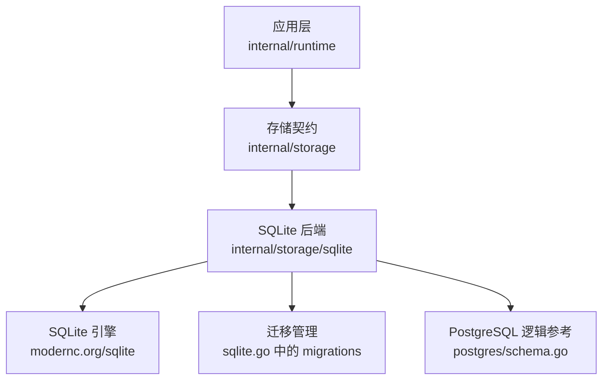
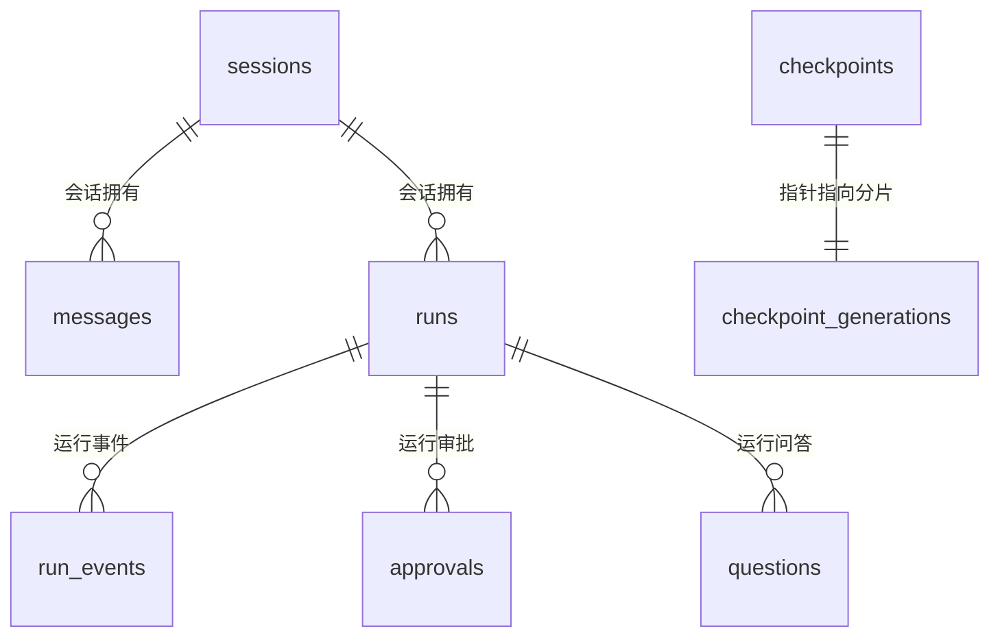
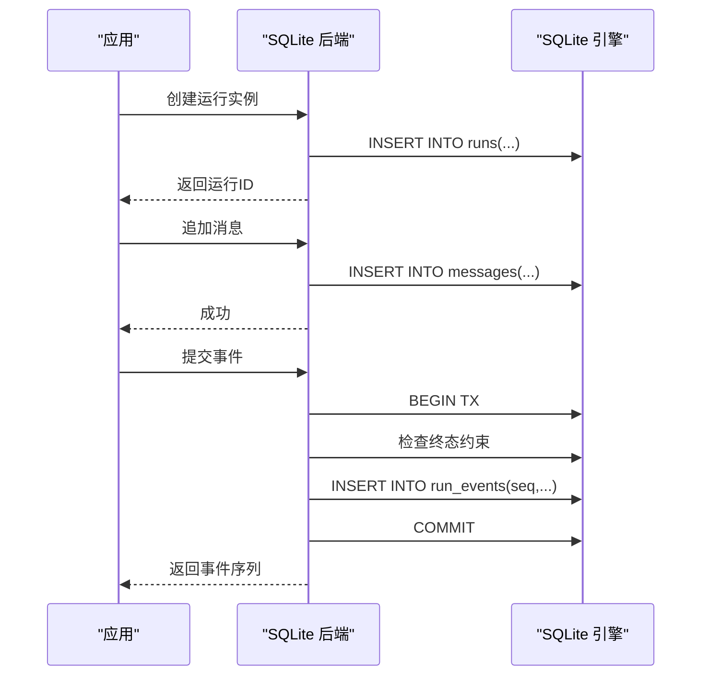

# 核心表结构设计

<cite>
**本文引用的文件**
- [sqlite.go](file://internal/storage/sqlite/sqlite.go)
- [schema.go](file://internal/storage/postgres/schema.go)
- [sessions.go](file://internal/storage/sqlite/sessions.go)
- [messages.go](file://internal/storage/sqlite/messages.go)
- [runs.go](file://internal/storage/sqlite/runs.go)
- [approvals.go](file://internal/storage/sqlite/approvals.go)
- [questions.go](file://internal/storage/sqlite/questions.go)
- [journal.go](file://internal/storage/sqlite/journal.go)
- [blob.go](file://internal/storage/sqlite/blob.go)
- [notes.go](file://internal/storage/sqlite/notes.go)
- [reviews.go](file://internal/storage/sqlite/reviews.go)
- [studio.go](file://internal/storage/sqlite/studio.go)
- [lease.go](file://internal/storage/sqlite/lease.go)
- [skill_revisions.go](file://internal/storage/sqlite/skill_revisions.go)
- [todos.go](file://internal/storage/sqlite/todos.go)
</cite>

## 目录
1. [简介](#简介)
2. [项目结构](#项目结构)
3. [核心组件](#核心组件)
4. [架构总览](#架构总览)
5. [详细组件分析](#详细组件分析)
6. [依赖关系分析](#依赖关系分析)
7. [性能考量](#性能考量)
8. [故障排查指南](#故障排查指南)
9. [结论](#结论)
10. [附录](#附录)

## 简介
本文件聚焦于 SQLite 存储层的核心表结构，围绕会话、消息、运行实例、审批、问答等关键业务表，系统说明字段类型选择、主键设计策略、外键约束与索引优化方案，并解释表间关联关系、数据完整性约束与级联操作规则。同时提供常用表结构查询示例、性能分析与空间统计方法，以及表结构变更的最佳实践与兼容性考虑。

## 项目结构
SQLite 存储实现位于 internal/storage/sqlite，通过迁移脚本在启动时创建或升级数据库；PostgreSQL 的 schema 定义用于对齐逻辑结构与索引策略。核心迁移集中在 sqlite.go 中，按版本顺序应用；postgres/schema.go 提供了当前逻辑版本的完整 DDL，便于理解最终目标形态。

图表来源
- [sqlite.go:17-36](file://internal/storage/sqlite/sqlite.go#L17-L36)
- [schema.go:5-199](file://internal/storage/postgres/schema.go#L5-L199)

章节来源
- [sqlite.go:17-36](file://internal/storage/sqlite/sqlite.go#L17-L36)
- [schema.go:5-199](file://internal/storage/postgres/schema.go#L5-L199)

## 核心组件
- 会话（sessions）：会话元信息、沙箱模式与审批策略。
- 消息（messages）：会话内追加式对话日志，支持工具调用上下文。
- 运行实例（runs）：会话下的运行树，包含父子关系、根节点与深度。
- 事件日志（run_events）：每个运行的有序事件流，保证“恰好一个终态”。
- 审批（approvals）：可超时、可撤销、可标记过期的审批队列。
- 问答（questions）：用户交互请求，具备状态机与审计元数据。
- 快照与分片（checkpoints/checkpoint_generations）：大对象的分代存储与指针。
- 笔记（notes）、技能修订（skill_revisions）、待办（todos）、工作室（generations/eval_runs/promotions/studio_events）、租约（leases）等辅助表。

章节来源
- [sqlite.go:149-404](file://internal/storage/sqlite/sqlite.go#L149-L404)
- [schema.go:5-199](file://internal/storage/postgres/schema.go#L5-L199)

## 架构总览
SQLite 后端以单连接写入避免竞争，所有表通过迁移逐步演进。核心业务表之间的关系如下：

图表来源
- [sqlite.go:149-404](file://internal/storage/sqlite/sqlite.go#L149-L404)
- [schema.go:5-199](file://internal/storage/postgres/schema.go#L5-L199)

## 详细组件分析

### 会话表（sessions）
- 主键：id（TEXT），唯一标识会话。
- 关键字段：title、created_at、sandbox_mode、approval_policy。
- 用途：会话元数据、权限边界与默认审批策略。
- 关联：被 messages、runs、todos 引用。
- 索引：按 created_at 倒序列出最新会话。

章节来源
- [sqlite.go:149-174](file://internal/storage/sqlite/sqlite.go#L149-L174)
- [sqlite.go:396-404](file://internal/storage/sqlite/sqlite.go#L396-L404)
- [sessions.go:13-68](file://internal/storage/sqlite/sessions.go#L13-L68)

### 消息表（messages）
- 主键：id（TEXT）。
- 关键字段：session_id、run_id、role、created_at、content、tool_call_id、tool_name、tool_args。
- 设计要点：追加式不可变日志；tool_args 使用 BLOB 承载结构化参数。
- 关联：session_id 外键到 sessions；run_id 可选关联到 runs。
- 索引：按 session_id + created_at, id 排序读取会话消息。

章节来源
- [sqlite.go:158-166](file://internal/storage/sqlite/sqlite.go#L158-L166)
- [sqlite.go:343-349](file://internal/storage/sqlite/sqlite.go#L343-L349)
- [messages.go:10-53](file://internal/storage/sqlite/messages.go#L10-L53)

### 运行实例表（runs）
- 主键：id（TEXT）。
- 关键字段：session_id、status、created_at、kind、parent_run_id、root_run_id、depth。
- 设计要点：维护运行树；kind 区分 primary/child；root_run_id 标识子树根；depth 表示层级。
- 索引：parent_run_id、root_run_id 复合索引加速父子遍历。
- 关联：session_id 外键到 sessions。

章节来源
- [sqlite.go:168-174](file://internal/storage/sqlite/sqlite.go#L168-L174)
- [sqlite.go:253-264](file://internal/storage/sqlite/sqlite.go#L253-L264)
- [runs.go:15-127](file://internal/storage/sqlite/runs.go#L15-L127)

### 事件日志表（run_events）
- 主键：(run_id, seq)，确保每个运行事件严格有序。
- 关键字段：type、created_at、payload_version、payload。
- 设计要点：追加式事件流；“恰好一个终态”在写入时校验。
- 关联：run_id 外键到 runs。

章节来源
- [sqlite.go:176-184](file://internal/storage/sqlite/sqlite.go#L176-L184)
- [journal.go:14-75](file://internal/storage/sqlite/journal.go#L14-L75)

### 审批表（approvals）
- 主键：id（TEXT）。
- 关键字段：run_id、tool_call_id、decision、expires_at、resume_target、kind、action、target、precondition_hash、preview、risk_findings_json、proposal_data、tool_name、created_at、decided_at、actor、decision_reason、stale_reason、sandbox_mode、approval_policy、timeout_at。
- 设计要点：支持首次写入胜出（first-writer-wins）的状态转移；可超时过期；可标记 stale；保留提案与风险发现；审计 actor 与原因。
- 索引：(decision, expires_at, id) 加速待处理与过期扫描。
- 关联：run_id 外键到 runs。

章节来源
- [sqlite.go:186-192](file://internal/storage/sqlite/sqlite.go#L186-L192)
- [sqlite.go:287-296](file://internal/storage/sqlite/sqlite.go#L287-L296)
- [sqlite.go:326-341](file://internal/storage/sqlite/sqlite.go#L326-L341)
- [sqlite.go:396-404](file://internal/storage/sqlite/sqlite.go#L396-L404)
- [approvals.go:15-274](file://internal/storage/sqlite/approvals.go#L15-L274)

### 问答表（questions）
- 主键：id（TEXT）。
- 关键字段：run_id、tool_call_id、prompt、answer、status、expires_at、resume_target、created_at、answered_at、actor、decision_reason。
- 设计要点：用户交互请求；支持回答、取消、过期；审计元数据。
- 索引：(status, expires_at, id) 加速待处理与过期扫描。
- 关联：run_id 外键到 runs。

章节来源
- [sqlite.go:237-251](file://internal/storage/sqlite/sqlite.go#L237-L251)
- [sqlite.go:326-341](file://internal/storage/sqlite/sqlite.go#L326-L341)
- [questions.go:14-134](file://internal/storage/sqlite/questions.go#L14-L134)

### 快照与分片（checkpoints / checkpoint_generations）
- checkpoints：id 为主键，记录当前指针 generation、checksum、created_at。
- checkpoint_generations：(id, generation) 复合主键，存储实际分片 blob。
- 设计要点：Put 原子写入新分片并翻转指针；Get 通过 JOIN 获取当前分片；Delete 删除指针与全部分片。

章节来源
- [sqlite.go:200-212](file://internal/storage/sqlite/sqlite.go#L200-L212)
- [blob.go:18-89](file://internal/storage/sqlite/blob.go#L18-L89)

### 其他辅助表
- notes：追加式笔记，按 created_at 倒序读取。
- skill_revisions：技能修订的可回滚暂存，含 before_payload。
- todos：会话内任务清单，支持位置排序与依赖。
- generations/eval_runs/promotions/studio_events：Studio 与评估相关对象与事件。
- leases：分布式锁/租约，基于 key 的 TTL 控制。

章节来源
- [sqlite.go:227-235](file://internal/storage/sqlite/sqlite.go#L227-L235)
- [sqlite.go:266-285](file://internal/storage/sqlite/sqlite.go#L266-L285)
- [sqlite.go:298-318](file://internal/storage/sqlite/sqlite.go#L298-L318)
- [sqlite.go:351-394](file://internal/storage/sqlite/sqlite.go#L351-L394)
- [notes.go:13-59](file://internal/storage/sqlite/notes.go#L13-L59)
- [skill_revisions.go:15-85](file://internal/storage/sqlite/skill_revisions.go#L15-L85)
- [todos.go:16-112](file://internal/storage/sqlite/todos.go#L16-L112)
- [lease.go:9-45](file://internal/storage/sqlite/lease.go#L9-L45)

## 依赖关系分析
- 会话是消息与运行的父实体；运行是事件、审批、问答的父实体。
- 消息与事件均为追加式日志，适合时间序列查询。
- 审批与问答共享相似的状态机与过期机制，并通过索引优化待处理队列。
- 快照采用“指针+分片”模式，避免原地更新带来的并发问题。

图表来源
- [runs.go:15-32](file://internal/storage/sqlite/runs.go#L15-L32)
- [messages.go:10-21](file://internal/storage/sqlite/messages.go#L10-L21)
- [journal.go:18-75](file://internal/storage/sqlite/journal.go#L18-L75)

章节来源
- [runs.go:15-127](file://internal/storage/sqlite/runs.go#L15-L127)
- [messages.go:10-53](file://internal/storage/sqlite/messages.go#L10-L53)
- [journal.go:18-75](file://internal/storage/sqlite/journal.go#L18-L75)

## 性能考量
- 单写者模型：SQLite 后端设置最大连接数为 1，避免 WAL 与锁争用。
- 索引策略：
  - runs.parent_run_id、runs.root_run_id 复合索引加速树遍历。
  - approvals.status/expiry、questions.status/expiry 复合索引加速待处理与过期扫描。
  - eval_runs.candidate_idx、skill_revisions.status_idx、todos.session_position_idx 提升特定查询。
- 追加式写入：messages、run_events、notes 等采用不可变追加，减少热点行更新。
- 快照分片：checkpoint_generations 按分代存储，checkpoints 仅维护指针，降低大对象更新成本。
- 查询优化：
  - 列表接口使用 ORDER BY created_at, id 保证稳定排序。
  - 审查视图合并审批与问答，统一排序与限制。

章节来源
- [sqlite.go:40-55](file://internal/storage/sqlite/sqlite.go#L40-L55)
- [sqlite.go:253-264](file://internal/storage/sqlite/sqlite.go#L253-L264)
- [sqlite.go:326-341](file://internal/storage/sqlite/sqlite.go#L326-L341)
- [schema.go:36-37](file://internal/storage/postgres/schema.go#L36-L37)
- [schema.go:73](file://internal/storage/postgres/schema.go#L73)
- [schema.go:121](file://internal/storage/postgres/schema.go#L121)
- [schema.go:139](file://internal/storage/postgres/schema.go#L139)
- [schema.go:157](file://internal/storage/postgres/schema.go#L157)
- [schema.go:178](file://internal/storage/postgres/schema.go#L178)
- [reviews.go:14-44](file://internal/storage/sqlite/reviews.go#L14-L44)

## 故障排查指南
- “运行已关闭”错误：当运行已有终态事件时拒绝追加，需检查运行生命周期。
- “未找到”错误：常见于按 ID 读取不存在记录，需确认上游传入 ID 是否正确。
- 冲突错误：如 promotions 的唯一约束失败，需检查重复提交。
- 超时与过期：approvals/questions 的 timeout_at/expires_at 由后台清理器处理，若堆积请检查调度器。
- 快照一致性：指针与分片不一致可通过 DropCheckpointPointer 与清理分片恢复。

章节来源
- [journal.go:18-46](file://internal/storage/sqlite/journal.go#L18-L46)
- [sqlite.go:90-107](file://internal/storage/sqlite/sqlite.go#L90-L107)
- [studio.go:152-165](file://internal/storage/sqlite/studio.go#L152-L165)
- [approvals.go:200-261](file://internal/storage/sqlite/approvals.go#L200-L261)
- [questions.go:119-134](file://internal/storage/sqlite/questions.go#L119-L134)

## 结论
SQLite 存储层通过严格的迁移管理与追加式日志设计，保证了高一致性与可扩展性。核心表围绕会话、运行、事件、审批、问答构建，配合合理的索引与状态机，满足 Agent 运行时对可靠性与可观测性的要求。未来扩展应遵循向后兼容的迁移策略，保持默认值与空安全，避免破坏既有数据。

## 附录

### 表结构查询示例
- 列出最近会话：
  - SELECT id, title, created_at FROM sessions ORDER BY created_at DESC;
- 列出会话消息：
  - SELECT id, role, created_at FROM messages WHERE session_id = ? ORDER BY created_at, id;
- 列出活跃运行：
  - SELECT id, status, created_at FROM runs WHERE status IN ('accepted','queued','active') ORDER BY created_at, id;
- 列出待处理审批：
  - SELECT id, decision, expires_at FROM approvals WHERE decision = 'pending' ORDER BY expires_at DESC, id;
- 列出待处理问答：
  - SELECT id, status, expires_at FROM questions WHERE status = 'pending' ORDER BY expires_at DESC, id;
- 回放运行事件：
  - SELECT seq, type, created_at FROM run_events WHERE run_id = ? AND seq > ? ORDER BY seq;

章节来源
- [sessions.go:23-43](file://internal/storage/sqlite/sessions.go#L23-L43)
- [messages.go:23-53](file://internal/storage/sqlite/messages.go#L23-L53)
- [runs.go:68-95](file://internal/storage/sqlite/runs.go#L68-L95)
- [approvals.go:83-119](file://internal/storage/sqlite/approvals.go#L83-L119)
- [questions.go:50-73](file://internal/storage/sqlite/questions.go#L50-L73)
- [journal.go:77-86](file://internal/storage/sqlite/journal.go#L77-L86)

### 性能分析与空间统计
- 表大小估算：
  - SELECT name, pagesize*page_count AS size_bytes FROM pragma_table_info('表名');
  - 或使用 PRAGMA page_count; PRAGMA freelist_count; 结合页大小估算。
- 索引使用情况：
  - EXPLAIN QUERY PLAN SELECT ...;
- 慢查询定位：
  - 启用 SQLite 日志或应用层计时，结合 EXPLAIN 分析执行计划。
- 空间回收：
  - VACUUM 释放空闲页；定期清理过期事件与旧分片。

[本节为通用指导，不直接引用具体代码文件]

### 表结构变更最佳实践与兼容性
- 新增列必须带默认值，避免破坏现有读取路径。
- 迁移按版本顺序执行，失败即中止，保证一致性。
- 对只读列或历史数据，优先追加而非修改。
- 对外键与索引变更，先在测试环境验证查询计划与性能。
- 对敏感字段（如密钥）绝不持久化，日志与负载脱敏。

章节来源
- [sqlite.go:109-147](file://internal/storage/sqlite/sqlite.go#L109-L147)
- [sqlite.go:287-296](file://internal/storage/sqlite/sqlite.go#L287-L296)
- [sqlite.go:326-341](file://internal/storage/sqlite/sqlite.go#L326-L341)
- [sqlite.go:396-404](file://internal/storage/sqlite/sqlite.go#L396-L404)