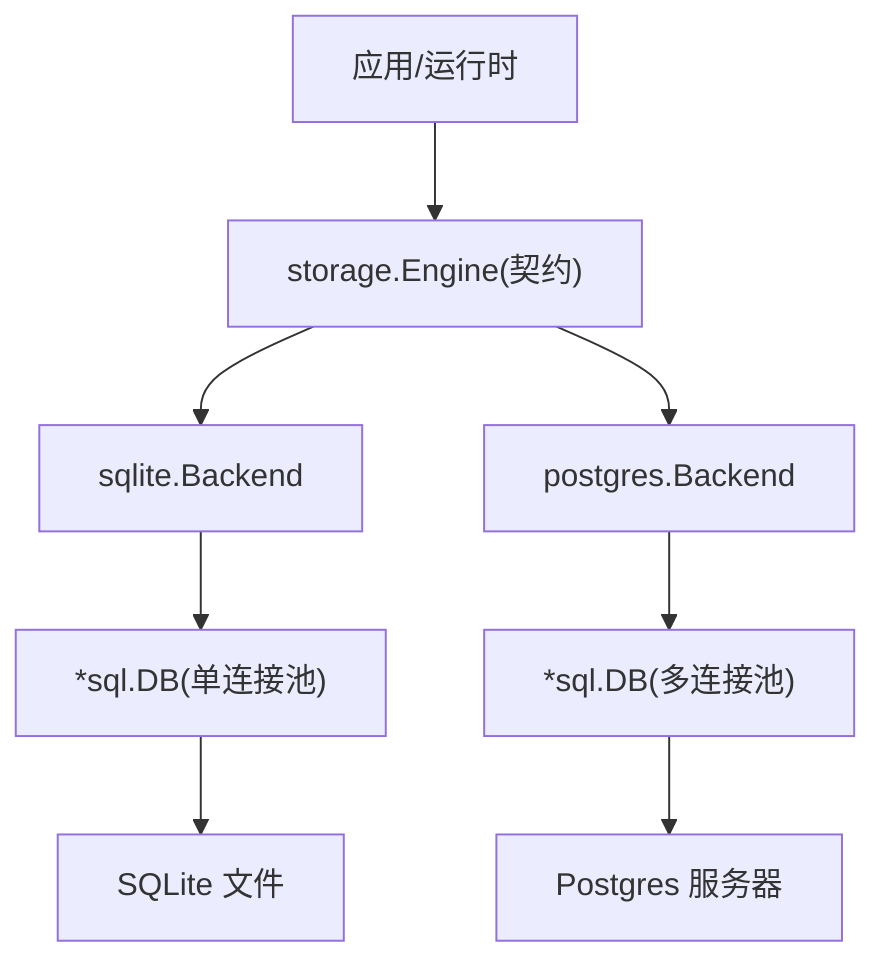
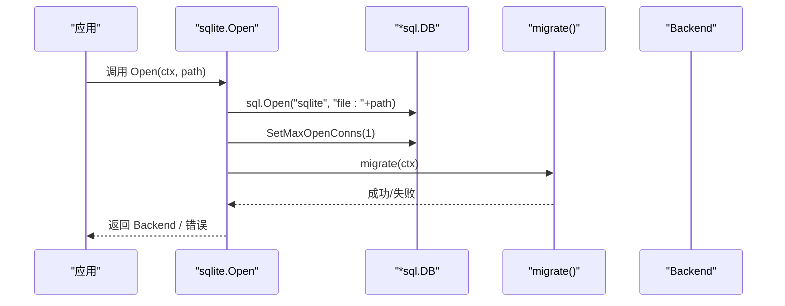
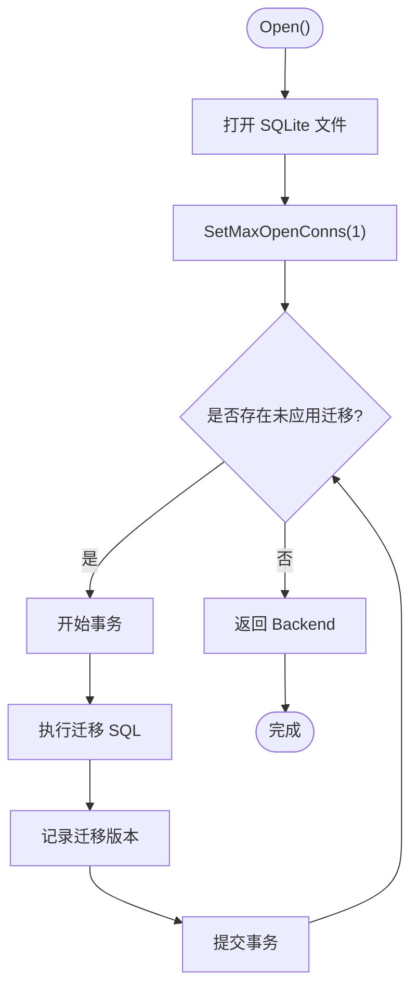
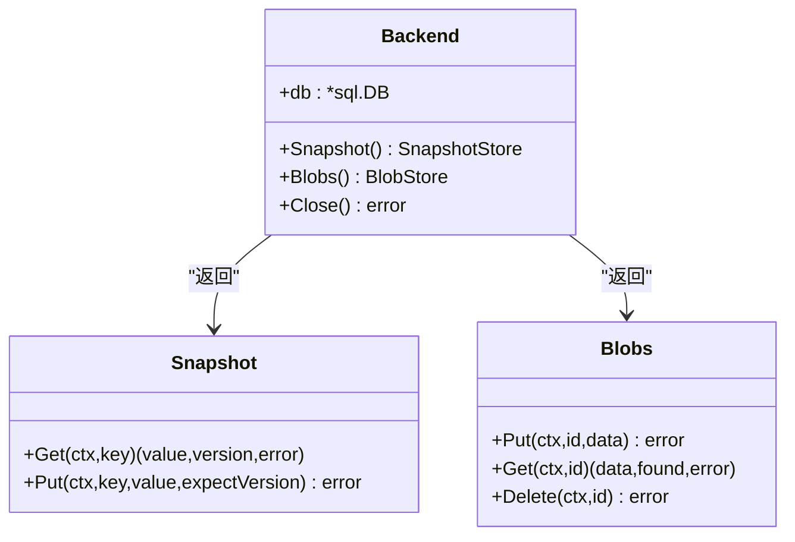
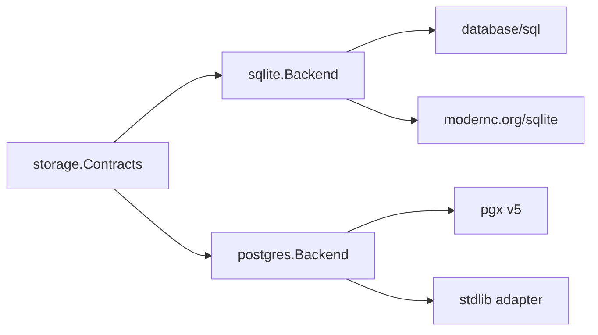

# 连接池与单写者模式

<cite>
**本文引用的文件**
- [sqlite.go](file://internal/storage/sqlite/sqlite.go)
- [snapshot.go](file://internal/storage/sqlite/snapshot.go)
- [blob.go](file://internal/storage/sqlite/blob.go)
- [contracts.go](file://internal/storage/contracts.go)
- [postgres.go](file://internal/storage/postgres/postgres.go)
- [config.go](file://internal/config/config.go)
- [sqlite_test.go](file://internal/storage/sqlite/sqlite_test.go)
</cite>

## 目录
1. [简介](#简介)
2. [项目结构](#项目结构)
3. [核心组件](#核心组件)
4. [架构总览](#架构总览)
5. [详细组件分析](#详细组件分析)
6. [依赖关系分析](#依赖关系分析)
7. [性能考量](#性能考量)
8. [故障排查指南](#故障排查指南)
9. [结论](#结论)
10. [附录](#附录)

## 简介
本文聚焦于 SQLite 存储后端的连接池配置与“单写者”设计，解释为何将最大并发连接数设置为 1，如何避免 WAL 锁竞争与并发冲突，以及该决策对性能、内存和可恢复性的影响。同时给出数据库连接初始化流程、错误处理机制、连接生命周期管理、参数调优建议、监控指标、性能测试方法与常见问题排查指南。

## 项目结构
本仓库的存储层通过统一的 storage 契约暴露 Journal、SnapshotStore、BlobStore、LeaseStore 等能力；SQLite 是默认后端，Postgres 为可选后端。SQLite 实现位于 internal/storage/sqlite，Postgres 实现位于 internal/storage/postgres，统一契约定义在 internal/storage/contracts.go。配置入口在 internal/config/config.go，默认使用 SQLite，路径由配置决定。

图表来源
- [sqlite.go:40-55](file://internal/storage/sqlite/sqlite.go#L40-L55)
- [postgres.go:59-111](file://internal/storage/postgres/postgres.go#L59-L111)
- [contracts.go:252-273](file://internal/storage/contracts.go#L252-L273)

章节来源
- [sqlite.go:1-55](file://internal/storage/sqlite/sqlite.go#L1-L55)
- [postgres.go:1-111](file://internal/storage/postgres/postgres.go#L1-L111)
- [config.go:70-83](file://internal/config/config.go#L70-L83)

## 核心组件
- SQLite 后端：以单一 *sql.DB 实例承载所有读写，强制单写者，避免 WAL 锁争用。
- Snapshot/Blob 访问器：共享同一底层 *sql.DB，分别提供快照版本控制与分代 blob 写入。
- 契约与错误：统一的错误语义（如版本冲突、运行关闭、租约丢失）跨后端一致。
- 配置：默认后端为 sqlite，数据目录与路径由配置驱动。

章节来源
- [sqlite.go:40-88](file://internal/storage/sqlite/sqlite.go#L40-L88)
- [snapshot.go:12-71](file://internal/storage/sqlite/snapshot.go#L12-L71)
- [blob.go:13-89](file://internal/storage/sqlite/blob.go#L13-L89)
- [contracts.go:11-31](file://internal/storage/contracts.go#L11-L31)
- [config.go:254-259](file://internal/config/config.go#L254-L259)

## 架构总览
SQLite 后端在启动时打开数据库并设置最大并发连接数为 1，随后执行迁移并返回 Backend。所有后续操作（Journal、Session、Message、Snapshot、Blobs、Lease 等）都复用该单一连接池，从而保证任意时刻只有一个事务能持有写锁，从根本上消除 WAL 写锁竞争。

图表来源
- [sqlite.go:40-55](file://internal/storage/sqlite/sqlite.go#L40-L55)
- [sqlite.go:109-147](file://internal/storage/sqlite/sqlite.go#L109-L147)

章节来源
- [sqlite.go:40-88](file://internal/storage/sqlite/sqlite.go#L40-L88)

## 详细组件分析

### 为什么选择单写者模式（SetMaxOpenConns(1)）
- 避免 WAL 锁竞争：SQLite 的 WAL 模式下并发写会触发写锁竞争，导致延迟抖动甚至死锁风险。将最大并发连接限制为 1，确保同一时间仅有一个写事务，显著降低锁争用。
- 简化一致性模型：单写者天然串行化写操作，配合事务与迁移脚本，保证 schema 演进与业务写入的一致性。
- 降低复杂性：无需引入外部协调或复杂锁策略，减少出错面。

章节来源
- [sqlite.go:45-47](file://internal/storage/sqlite/sqlite.go#L45-L47)

### 连接初始化与迁移
- 打开数据库：使用 file: 前缀打开 SQLite 文件。
- 设置连接池：立即调用 SetMaxOpenConns(1)。
- 迁移：按顺序检查并执行未应用的迁移，每个迁移在独立事务中提交，失败则中止启动。
- 返回 Backend：包含共享的 *sql.DB 句柄。

图表来源
- [sqlite.go:40-55](file://internal/storage/sqlite/sqlite.go#L40-L55)
- [sqlite.go:109-147](file://internal/storage/sqlite/sqlite.go#L109-L147)

章节来源
- [sqlite.go:40-55](file://internal/storage/sqlite/sqlite.go#L40-L55)
- [sqlite.go:109-147](file://internal/storage/sqlite/sqlite.go#L109-L147)

### 连接生命周期管理
- 创建：Open 时创建 *sql.DB，设置池大小并执行迁移。
- 使用：所有子访问器（Snapshot、Blobs 等）共享同一 *sql.DB。
- 关闭：调用 Close 释放底层连接。

图表来源
- [sqlite.go:57-88](file://internal/storage/sqlite/sqlite.go#L57-L88)
- [snapshot.go:12-71](file://internal/storage/sqlite/snapshot.go#L12-L71)
- [blob.go:13-89](file://internal/storage/sqlite/blob.go#L13-L89)

章节来源
- [sqlite.go:57-88](file://internal/storage/sqlite/sqlite.go#L57-L88)
- [snapshot.go:12-71](file://internal/storage/sqlite/snapshot.go#L12-L71)
- [blob.go:13-89](file://internal/storage/sqlite/blob.go#L13-L89)

### 错误处理机制
- 迁移失败：返回错误并中止启动，确保 schema 一致性。
- 版本冲突：Snapshot.Put 在期望版本不匹配时返回 ErrVersionConflict。
- 运行终止：Journal.Append 在已有终态事件后继续追加返回 ErrRunClosed。
- 无效提交：包含空事件或多终态事件的提交返回 ErrCommitInvalid。
- 租约相关：Postgres 后端在失去租约时返回 ErrLeaseLost；SQLite 端通过 LeaseStore 接口实现会话级独占。

章节来源
- [sqlite.go:109-147](file://internal/storage/sqlite/sqlite.go#L109-L147)
- [snapshot.go:34-71](file://internal/storage/sqlite/snapshot.go#L34-L71)
- [contracts.go:11-31](file://internal/storage/contracts.go#L11-L31)

### 连接池配置与调优
- SQLite：固定 SetMaxOpenConns(1)，不可通过配置调整；这是有意为之的设计约束，避免 WAL 锁竞争。
- Postgres：使用 defaultMaxConns=8，适合高并发读写的服务端场景。
- 数据目录：默认 data/vivy.db；可通过 Storage.DataDir 覆盖。

章节来源
- [sqlite.go:45-47](file://internal/storage/sqlite/sqlite.go#L45-L47)
- [postgres.go:20-26](file://internal/storage/postgres/postgres.go#L20-L26)
- [config.go:70-83](file://internal/config/config.go#L70-L83)
- [config.go:254-259](file://internal/config/config.go#L254-L259)

### 内存使用优化
- 单连接池降低并发连接带来的内存占用峰值。
- 快照与 blob 采用事务与分代写入，避免大对象常驻内存。
- 迁移在事务内执行，失败回滚，避免中间状态占用资源。

章节来源
- [snapshot.go:34-71](file://internal/storage/sqlite/snapshot.go#L34-L71)
- [blob.go:18-53](file://internal/storage/sqlite/blob.go#L18-L53)
- [sqlite.go:109-147](file://internal/storage/sqlite/sqlite.go#L109-L147)

### 故障恢复策略
- 迁移幂等：重复打开不会失败，确保重启安全。
- 租约与心跳：Postgres 后端通过心跳续租，SQLite 通过 LeaseStore 实现会话级独占。
- 分代 blob：同 id 写入追加新世代并原子翻转指针，旧世代保留，便于回滚与一致性读取。

章节来源
- [sqlite_test.go:245-260](file://internal/storage/sqlite/sqlite_test.go#L245-L260)
- [postgres.go:192-220](file://internal/storage/postgres/postgres.go#L192-L220)
- [blob.go:18-53](file://internal/storage/sqlite/blob.go#L18-L53)

## 依赖关系分析
SQLite 后端依赖标准库 database/sql 与 modernc.org/sqlite，并通过 storage 契约向上暴露能力；Postgres 后端依赖 pgx 与 stdlib 适配器。两者均实现 Engine 接口，便于替换与测试。

图表来源
- [contracts.go:252-273](file://internal/storage/contracts.go#L252-L273)
- [sqlite.go:6-15](file://internal/storage/sqlite/sqlite.go#L6-L15)
- [postgres.go:3-18](file://internal/storage/postgres/postgres.go#L3-L18)

章节来源
- [contracts.go:252-273](file://internal/storage/contracts.go#L252-L273)
- [sqlite.go:6-15](file://internal/storage/sqlite/sqlite.go#L6-L15)
- [postgres.go:3-18](file://internal/storage/postgres/postgres.go#L3-L18)

## 性能考量
- 单写者优势：
  - 写路径无锁竞争，延迟稳定，避免 WAL 写锁抖动。
  - 简单可靠，易于推理与维护。
- 适用场景：
  - 单机进程内嵌 SQLite 的典型工作负载（读多写少或中等写）。
  - 需要强一致性与简单部署的场景。
- 不适用场景：
  - 极高并发写需求，应评估 Postgres 或其他分布式存储。
- 吞吐与延迟：
  - 单写者限制了写吞吐上限，但读路径仍可受益于索引与查询优化。
- 扩展性：
  - 通过切换后端到 Postgres 获得更高并发能力，同时保持上层契约不变。

[本节为通用指导，不直接分析具体文件]

## 故障排查指南
- 启动失败（迁移错误）：
  - 检查迁移脚本与 schema_migrations 表，确认版本是否已应用。
  - 参考迁移失败时的错误包装信息定位具体 SQL。
- 版本冲突：
  - Snapshot.Put 返回 ErrVersionConflict 表示并发更新冲突，需重试或合并逻辑。
- 运行已关闭：
  - Journal.Append 在已有终态事件后拒绝追加，检查业务流程是否提前结束。
- 租约问题（Postgres）：
  - ErrLeaseHeld/ErrLeaseLost 指示多实例竞争或心跳失效，检查服务实例与网络连通性。
- 重新打开幂等：
  - 测试用例验证了重复 Open 不会失败，若异常请检查文件权限与磁盘空间。

章节来源
- [sqlite.go:109-147](file://internal/storage/sqlite/sqlite.go#L109-L147)
- [snapshot.go:34-71](file://internal/storage/sqlite/snapshot.go#L34-L71)
- [contracts.go:11-31](file://internal/storage/contracts.go#L11-L31)
- [postgres.go:192-220](file://internal/storage/postgres/postgres.go#L192-L220)
- [sqlite_test.go:245-260](file://internal/storage/sqlite/sqlite_test.go#L245-L260)

## 结论
通过将 SQLite 连接池最大并发设为 1，项目以“单写者”模式消除了 WAL 锁竞争与并发冲突，提升了稳定性与可维护性。该设计在单机进程中表现良好，适用于大多数 Agent 运行时场景。对于高并发写需求，可平滑切换到 Postgres 后端，同时保持上层契约不变。结合迁移幂等、版本冲突与租约机制，系统在故障恢复与一致性方面具备完备保障。

[本节为总结，不直接分析具体文件]

## 附录

### 连接监控指标建议
- 连接池指标：
  - 最大连接数（SQLite 固定为 1；Postgres 可观测 pool 大小）。
  - 活跃连接数、等待队列长度（可通过数据库驱动或中间件采集）。
- 事务指标：
  - 事务提交/回滚次数、平均耗时、P95/P99 延迟。
- 业务指标：
  - Journal Append 速率、Replay 延迟、Snapshot Put 冲突率。
- 健康检查：
  - 定期 Ping 数据库，记录失败次数与恢复时间。

[本节为通用指导，不直接分析具体文件]

### 性能测试方法
- 基准测试：
  - 模拟典型读写比例，测量吞吐与延迟。
  - 对比 SQLite 单写者与 Postgres 多连接池在不同负载下的表现。
- 压力测试：
  - 逐步增加并发写请求，观察锁竞争与错误率变化。
- 回归测试：
  - 使用现有测试套件（如 sqlite_test.go）验证迁移幂等、版本冲突、终端事件约束等。

章节来源
- [sqlite_test.go:29-94](file://internal/storage/sqlite/sqlite_test.go#L29-L94)
- [sqlite_test.go:96-128](file://internal/storage/sqlite/sqlite_test.go#L96-L128)
- [sqlite_test.go:130-157](file://internal/storage/sqlite/sqlite_test.go#L130-L157)
- [sqlite_test.go:159-197](file://internal/storage/sqlite/sqlite_test.go#L159-L197)
- [sqlite_test.go:199-243](file://internal/storage/sqlite/sqlite_test.go#L199-L243)
- [sqlite_test.go:245-260](file://internal/storage/sqlite/sqlite_test.go#L245-L260)