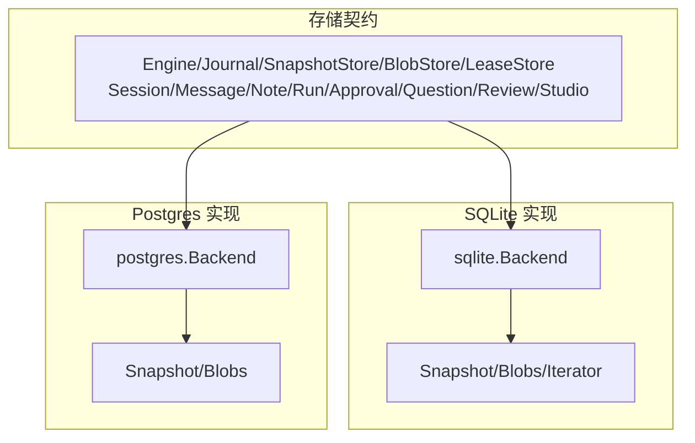
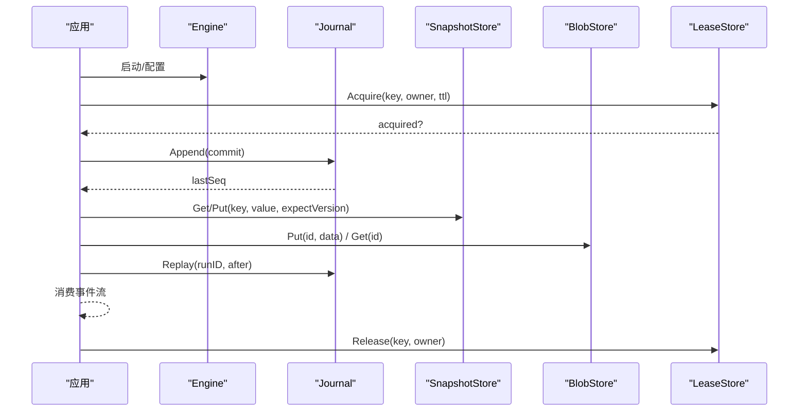
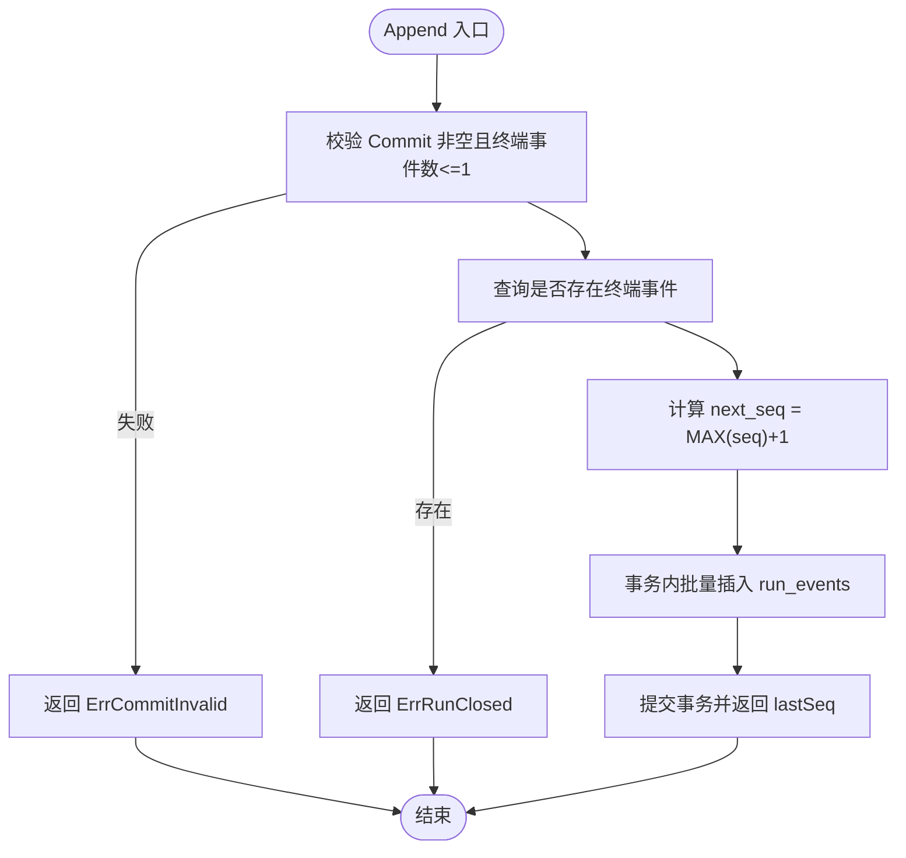
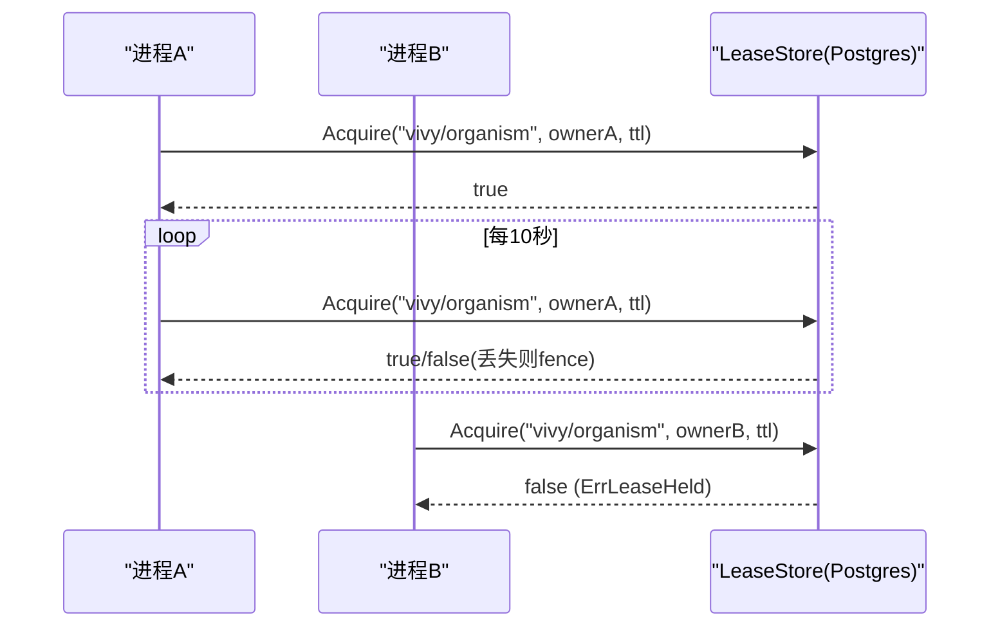
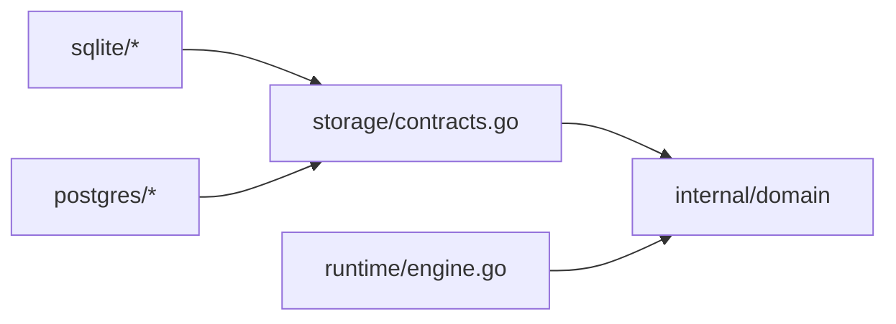

# 存储抽象接口

<cite>
**本文引用的文件**
- [internal/storage/contracts.go](file://internal/storage/contracts.go)
- [internal/storage/sqlite/journal.go](file://internal/storage/sqlite/journal.go)
- [internal/storage/sqlite/snapshot.go](file://internal/storage/sqlite/snapshot.go)
- [internal/storage/sqlite/blob.go](file://internal/storage/sqlite/blob.go)
- [internal/storage/sqlite/lease.go](file://internal/storage/sqlite/lease.go)
- [internal/storage/sqlite/approvals.go](file://internal/storage/sqlite/approvals.go)
- [internal/storage/sqlite/questions.go](file://internal/storage/sqlite/questions.go)
- [internal/storage/sqlite/reviews.go](file://internal/storage/sqlite/reviews.go)
- [internal/storage/sqlite/sessions.go](file://internal/storage/sqlite/sessions.go)
- [internal/storage/sqlite/sqlite.go](file://internal/storage/sqlite/sqlite.go)
- [internal/storage/postgres/postgres.go](file://internal/storage/postgres/postgres.go)
</cite>

## 目录
1. [简介](#简介)
2. [项目结构](#项目结构)
3. [核心组件](#核心组件)
4. [架构总览](#架构总览)
5. [详细组件分析](#详细组件分析)
6. [依赖关系分析](#依赖关系分析)
7. [性能考量](#性能考量)
8. [故障排查指南](#故障排查指南)
9. [结论](#结论)
10. [附录：使用示例与扩展指南](#附录使用示例与扩展指南)

## 简介
本文件系统化梳理 Agent-Vivy 的存储抽象接口，围绕 Engine 统一入口，解释事件溯源 Journal、版本化快照 SnapshotStore、生成式 BlobStore、分布式锁 LeaseStore，以及 ApprovalStore、QuestionStore、ReviewStore 等业务接口的数据一致性保证。文档同时覆盖错误处理约定、并发安全模型、资源管理最佳实践，并提供面向 SQLite 与 Postgres 的实现要点、使用示例与扩展建议。

## 项目结构
存储层以 contracts.go 定义统一接口，sqlite 与 postgres 提供两种后端实现；Engine 聚合所有子存储能力，对外暴露单一入口。SQLite 默认单写进程，Postgres 通过实例租约确保多进程下仅一个“生物体”持有写入权。

图表来源
- [internal/storage/contracts.go:252-273](file://internal/storage/contracts.go#L252-L273)
- [internal/storage/sqlite/sqlite.go:64-88](file://internal/storage/sqlite/sqlite.go#L64-L88)
- [internal/storage/postgres/postgres.go:30-44](file://internal/storage/postgres/postgres.go#L30-L44)

章节来源
- [internal/storage/contracts.go:252-273](file://internal/storage/contracts.go#L252-L273)
- [internal/storage/sqlite/sqlite.go:1-88](file://internal/storage/sqlite/sqlite.go#L1-L88)
- [internal/storage/postgres/postgres.go:1-111](file://internal/storage/postgres/postgres.go#L1-L111)

## 核心组件
- Engine：统一存储引擎，组合 Journal、SessionStore、MessageStore、NoteStore、RunStore、ApprovalStore、QuestionStore、ReviewStore、SkillRevisionStore、TodoStore、StudioStore、LeaseStore，并暴露 Snapshot() 与 Blobs() 访问器及 Close()。
- Journal：追加型有序事件日志，支持 Append（原子提交、序列号分配、终端事件约束）与 Replay（按 after 游标顺序回放）。
- SnapshotStore：键值快照，带乐观并发控制（expectVersion）。
- BlobStore：不透明大对象存储，采用生成式写入（append-only generation + 指针翻转），不可原地修改历史版本。
- LeaseStore：分布式锁，Acquire/Release 用于会话运行锁、恢复等独占场景。
- 业务存储：Session/Message/Note/Run 基础持久化；Approval/Question 人类交互；Review 统一读模型；Studio 工程化流水线；SkillRevision/Todo 辅助能力。

章节来源
- [internal/storage/contracts.go:33-94](file://internal/storage/contracts.go#L33-L94)
- [internal/storage/contracts.go:96-161](file://internal/storage/contracts.go#L96-L161)
- [internal/storage/contracts.go:163-242](file://internal/storage/contracts.go#L163-L242)
- [internal/storage/contracts.go:252-273](file://internal/storage/contracts.go#L252-L273)

## 架构总览
Engine 作为唯一入口，上层应用通过它完成事件追加、会话与消息读写、审批与问答、快照与检查点存取、分布式锁获取与释放。SQLite 适合单机单写；Postgres 通过实例租约与心跳保活，保障多进程环境下的唯一写入者。

图表来源
- [internal/storage/contracts.go:55-94](file://internal/storage/contracts.go#L55-L94)
- [internal/storage/sqlite/journal.go:14-86](file://internal/storage/sqlite/journal.go#L14-L86)
- [internal/storage/sqlite/snapshot.go:18-70](file://internal/storage/sqlite/snapshot.go#L18-L70)
- [internal/storage/sqlite/blob.go:18-88](file://internal/storage/sqlite/blob.go#L18-L88)
- [internal/storage/sqlite/lease.go:9-44](file://internal/storage/sqlite/lease.go#L9-L44)

## 详细组件分析

### Journal：事件溯源与终端事件约束
- 设计目标：持久化、追加型、有序的事件日志；每次提交为原子批；序列号连续单调递增；每个 Run 恰好一个终态事件。
- Append：
  - 校验 Commit 非空且至多包含一个终端事件，否则返回 ErrCommitInvalid。
  - 若 Run 已有终端事件，拒绝后续追加，返回 ErrRunClosed。
  - 在事务中计算 MAX(seq)+1 起始范围，批量插入 run_events，返回最后 seq。
- Replay：
  - 按 run_id 与 after 游标顺序扫描，返回 Iterator[Entry]，逐条读取 payload_version/payload。
- 终端事件集合：run.completed/run.failed/run.cancelled/child.completed/child.failed/child.cancelled。

图表来源
- [internal/storage/sqlite/journal.go:14-75](file://internal/storage/sqlite/journal.go#L14-L75)

章节来源
- [internal/storage/contracts.go:33-64](file://internal/storage/contracts.go#L33-L64)
- [internal/storage/sqlite/journal.go:12-86](file://internal/storage/sqlite/journal.go#L12-L86)

### SnapshotStore：版本控制与乐观并发
- Get：返回 (value, version)，不存在时返回 (nil, 0, nil)。
- Put：当 stored.version == expectVersion 时更新并自增 version；否则返回 ErrVersionConflict。
- 语义：适用于轻量状态快照（如 Eino checkpoint 元信息），配合 BlobStore 的大对象存储。

章节来源
- [internal/storage/contracts.go:66-75](file://internal/storage/contracts.go#L66-L75)
- [internal/storage/sqlite/snapshot.go:18-70](file://internal/storage/sqlite/snapshot.go#L18-L70)

### BlobStore：生成式写入策略
- Put：对同一 id 追加新的 generation，并原子翻转 checkpoints 表中的当前指针行；历史 generation 永不原地修改。
- Get：通过 joins 读取当前 generation 的 blob。
- Delete：删除指针与全部 generations。
- 用途：Eino checkpoint 等大对象持久化，支持无副作用回滚与清理。

章节来源
- [internal/storage/contracts.go:77-85](file://internal/storage/contracts.go#L77-L85)
- [internal/storage/sqlite/blob.go:18-88](file://internal/storage/sqlite/blob.go#L18-L88)

### LeaseStore：分布式锁与生物体租约
- Acquire：若 key 空闲或已过期，或仍由调用者持有，则授予租约；否则返回 acquired=false。
- Release：仅当调用者仍拥有租约时才删除；释放非自身租约为幂等无错。
- Postgres 扩展：Open 时尝试取得 organism 租约并后台心跳续期；若丢失租约则 fence 停止工作。

图表来源
- [internal/storage/postgres/postgres.go:46-111](file://internal/storage/postgres/postgres.go#L46-L111)
- [internal/storage/sqlite/lease.go:9-44](file://internal/storage/sqlite/lease.go#L9-L44)

章节来源
- [internal/storage/contracts.go:87-94](file://internal/storage/contracts.go#L87-L94)
- [internal/storage/sqlite/lease.go:9-44](file://internal/storage/sqlite/lease.go#L9-L44)
- [internal/storage/postgres/postgres.go:46-111](file://internal/storage/postgres/postgres.go#L46-L111)

### ApprovalStore：效果性工具调用的审批
- CreateApproval：创建 pending 审批行，携带动作、预览、风险发现、沙箱模式、策略、超时等元数据。
- DecideApproval：first-writer-wins，将 pending 转为 approved/denied，记录 actor/decision_reason。
- Expire/Cancel/Stale：系统超时、取消、前置条件失效等生命周期转换。
- ListExpiredApprovals/SweepExpiredApprovals：定时清理过期审批。
- 一致性：基于 WHERE decision='pending' 的原子更新保证一次生效。

章节来源
- [internal/storage/contracts.go:163-199](file://internal/storage/contracts.go#L163-L199)
- [internal/storage/sqlite/approvals.go:15-274](file://internal/storage/sqlite/approvals.go#L15-L274)

### QuestionStore：ask_user 暂停与恢复
- CreateQuestion：创建待回答的问题，关联 run/tool_call。
- AnswerQuestion：first-writer-wins，将 pending 转为 answered，记录答案与审计元数据。
- Cancel/Expire：取消或超时。
- 与审批的区别：问题答案仅恢复中断的运行，不授权外部副作用。

章节来源
- [internal/storage/contracts.go:201-217](file://internal/storage/contracts.go#L201-L217)
- [internal/storage/sqlite/questions.go:14-134](file://internal/storage/sqlite/questions.go#L14-L134)

### ReviewStore：统一的审查读模型
- ListReviews：合并 approvals 与 questions 的队列，按优先级与时间排序，支持按 kind/status/session 过滤与 limit。
- GetReview：根据 ID 前缀定位类型并检索。
- 参数脱敏：从 run_events 中还原原始 args 并进行敏感字段脱敏后返回 UI/RPC。

章节来源
- [internal/storage/contracts.go:219-232](file://internal/storage/contracts.go#L219-L232)
- [internal/storage/sqlite/reviews.go:14-330](file://internal/storage/sqlite/reviews.go#L14-L330)

### Session/Message/Note/Run 基础存储
- SessionStore：会话 CRUD，删除会话级联删除 messages/runs/run_events。
- MessageStore：会话消息追加与列表。
- NoteStore：用户笔记本追加与列表，最新优先。
- RunStore：运行生命周期、父子树、活跃运行枚举。

章节来源
- [internal/storage/contracts.go:96-161](file://internal/storage/contracts.go#L96-L161)
- [internal/storage/sqlite/sessions.go:13-116](file://internal/storage/sqlite/sessions.go#L13-L116)

## 依赖关系分析
- 耦合与内聚：Engine 聚合多个高内聚子接口，降低上层复杂度；各 Store 职责清晰，变更影响面小。
- 直接依赖：所有实现依赖 internal/domain 类型；SQLite/Postgres 各自封装数据库细节，不泄漏到契约层。
- 外部依赖：SQLite 使用 modernc.org/sqlite（纯 Go，无 CGO）；Postgres 使用 pgx v5。
- 潜在循环：无循环依赖；契约层位于最底层，被实现与应用共同引用。

图表来源
- [internal/storage/contracts.go:1-9](file://internal/storage/contracts.go#L1-L9)
- [internal/storage/sqlite/sqlite.go:1-15](file://internal/storage/sqlite/sqlite.go#L1-L15)
- [internal/storage/postgres/postgres.go:1-18](file://internal/storage/postgres/postgres.go#L1-L18)

章节来源
- [internal/storage/contracts.go:1-9](file://internal/storage/contracts.go#L1-L9)
- [internal/storage/sqlite/sqlite.go:1-15](file://internal/storage/sqlite/sqlite.go#L1-L15)
- [internal/storage/postgres/postgres.go:1-18](file://internal/storage/postgres/postgres.go#L1-L18)

## 性能考量
- SQLite：
  - 单连接（SetMaxOpenConns=1）避免 WAL/锁争用，适合单机单写。
  - 迁移在启动时按序执行，失败即中止，保证 schema 一致。
  - 事件追加使用预编译语句与事务批量插入，减少 IO。
- Postgres：
  - 连接池默认 8，适合多进程并发。
  - 通过 advisory lock + 租约心跳（TTL 30s，心跳 10s）保证唯一写入者。
  - 索引优化：approvals/questions 的 status+expires_at 索引，reviews 联合查询。
- 通用：
  - 事件负载大小限制由上层配置控制，避免过大 payload 影响回放与网络传输。
  - BlobStore 生成式写入避免热点更新，适合大对象频繁替换。

章节来源
- [internal/storage/sqlite/sqlite.go:38-55](file://internal/storage/sqlite/sqlite.go#L38-L55)
- [internal/storage/sqlite/sqlite.go:109-147](file://internal/storage/sqlite/sqlite.go#L109-L147)
- [internal/storage/postgres/postgres.go:20-26](file://internal/storage/postgres/postgres.go#L20-L26)
- [internal/storage/postgres/postgres.go:192-220](file://internal/storage/postgres/postgres.go#L192-L220)

## 故障排查指南
- 常见错误码与含义：
  - ErrVersionConflict：SnapshotStore.Put 期望版本与实际不符，重试或刷新版本。
  - ErrRunClosed：Run 已有终端事件，禁止继续追加。
  - ErrCommitInvalid：Commit 为空或包含多于一个终端事件。
  - ErrNotFound：会话/消息/运行/审批/问题等实体不存在。
  - ErrLeaseHeld：Postgres 上已有其他进程持有生物体租约。
  - ErrLeaseLost：租约续期失败，需停止工作并退出。
- 排查步骤：
  - 事件回放异常：检查 run_events 的 seq 连续性、payload_version 与 payload 是否完整。
  - 审批/问题卡住：确认是否已过期或被取消，必要时使用 SweepExpiredApprovals/ExpireQuestion。
  - 多进程冲突：Postgres 环境下确认仅一个实例持有租约；其余实例应优雅退出或降级为只读。
  - 资源泄漏：确保 Iterator.Close()、Engine.Close() 被调用；SQLite 单连接关闭；Postgres 连接池释放。

章节来源
- [internal/storage/contracts.go:11-31](file://internal/storage/contracts.go#L11-L31)
- [internal/storage/sqlite/journal.go:18-75](file://internal/storage/sqlite/journal.go#L18-L75)
- [internal/storage/sqlite/approvals.go:149-198](file://internal/storage/sqlite/approvals.go#L149-L198)
- [internal/storage/sqlite/questions.go:119-134](file://internal/storage/sqlite/questions.go#L119-L134)
- [internal/storage/postgres/postgres.go:192-220](file://internal/storage/postgres/postgres.go#L192-L220)

## 结论
Vivy 存储抽象以 Engine 为核心，将事件溯源、版本化快照、生成式大对象存储、分布式锁与业务存储解耦为清晰接口。SQLite 与 Postgres 实现遵循相同契约，前者适合单机单写，后者通过租约机制支撑多进程部署。通过严格的错误约定、乐观并发与 first-writer-wins 策略，系统在一致性、可恢复性与可扩展性之间取得平衡。

## 附录：使用示例与扩展指南

### 使用示例（概念流程）
- 初始化 Engine：
  - SQLite：Open(path) 并应用迁移。
  - Postgres：Open(dsn) 并获取 organism 租约。
- 运行一个 Run：
  - 通过 Journal.Append 提交事件批次，确保至多一个终端事件。
  - 如需暂停等待用户输入，创建 Question；如需外部副作用，创建 Approval。
  - 使用 BlobStore 持久化 Eino checkpoint，使用 SnapshotStore 保存轻量状态。
- 回放与恢复：
  - 使用 Journal.Replay(after) 重放事件，驱动状态机重建。
  - 通过 BlobStore.Get 恢复 checkpoint 字节，结合 Engine.Resume 恢复运行。
- 资源释放：
  - 关闭 Iterator、Engine，Postgres 实例释放租约与连接。

章节来源
- [internal/storage/sqlite/sqlite.go:38-88](file://internal/storage/sqlite/sqlite.go#L38-L88)
- [internal/storage/postgres/postgres.go:46-111](file://internal/storage/postgres/postgres.go#L46-L111)
- [internal/storage/sqlite/journal.go:18-86](file://internal/storage/sqlite/journal.go#L18-L86)
- [internal/storage/sqlite/blob.go:18-88](file://internal/storage/sqlite/blob.go#L18-L88)
- [internal/storage/sqlite/snapshot.go:18-70](file://internal/storage/sqlite/snapshot.go#L18-L70)

### 扩展指南
- 新增后端：
  - 实现 storage.Engine 及其子接口；遵守错误约定与事务边界。
  - 保持 SQLite/Postgres 行为一致：Append 的终端事件约束、Snapshot 的乐观并发、Blob 的生成式写入、Lease 的 Acquire/Release。
- 扩展业务接口：
  - 在 contracts.go 中新增接口，并在 sqlite/postgres 中分别实现；保持向后兼容。
- 迁移与版本：
  - SQLite：在 migrations 数组追加新迁移，确保幂等与回滚友好。
  - Postgres：维护 schema_migrations 与版本号，一次性应用。
- 并发与一致性：
  - 使用事务包裹跨表操作；利用 WHERE decision='pending' 等条件实现 first-writer-wins。
  - Postgres 多进程务必使用租约与心跳；SQLite 保持单写进程。
- 安全与脱敏：
  - 密钥不持久化；UI/RPC 输出进行敏感字段脱敏（参考 reviews 中的脱敏逻辑）。

章节来源
- [internal/storage/sqlite/sqlite.go:17-36](file://internal/storage/sqlite/sqlite.go#L17-L36)
- [internal/storage/postgres/postgres.go:133-166](file://internal/storage/postgres/postgres.go#L133-L166)
- [internal/storage/sqlite/reviews.go:244-304](file://internal/storage/sqlite/reviews.go#L244-L304)