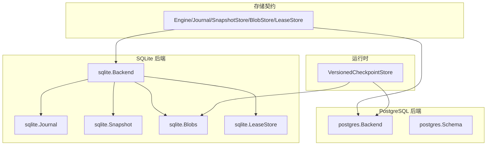
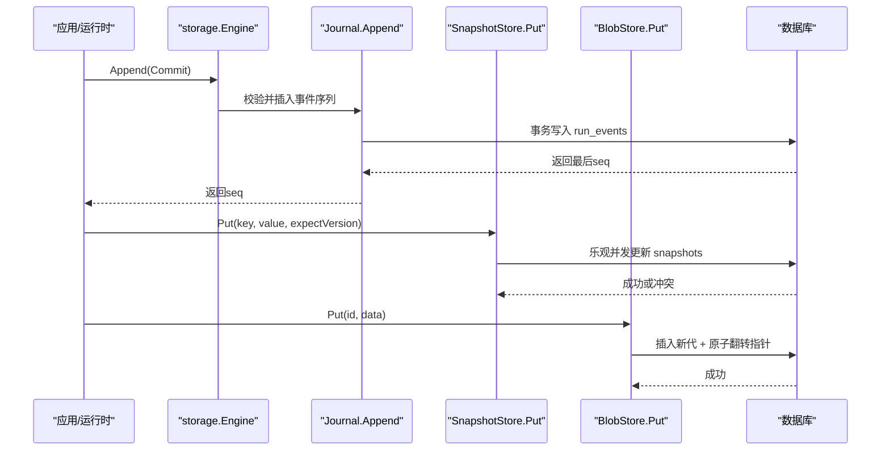
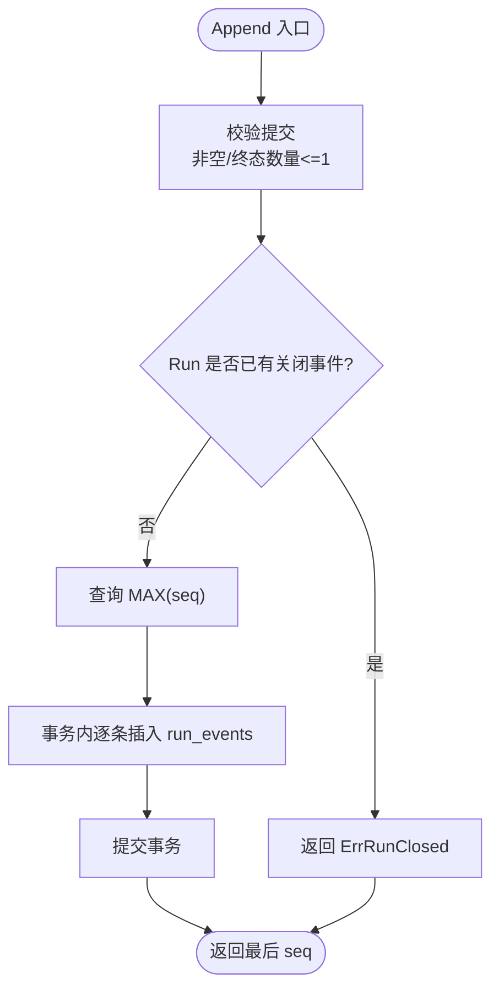
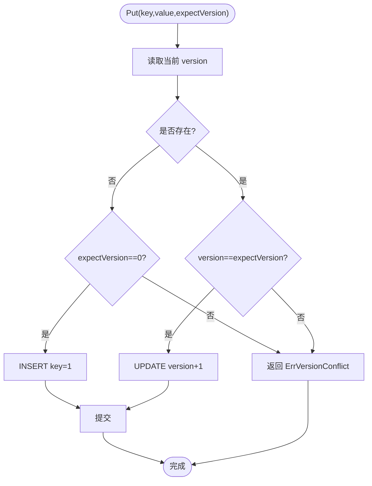
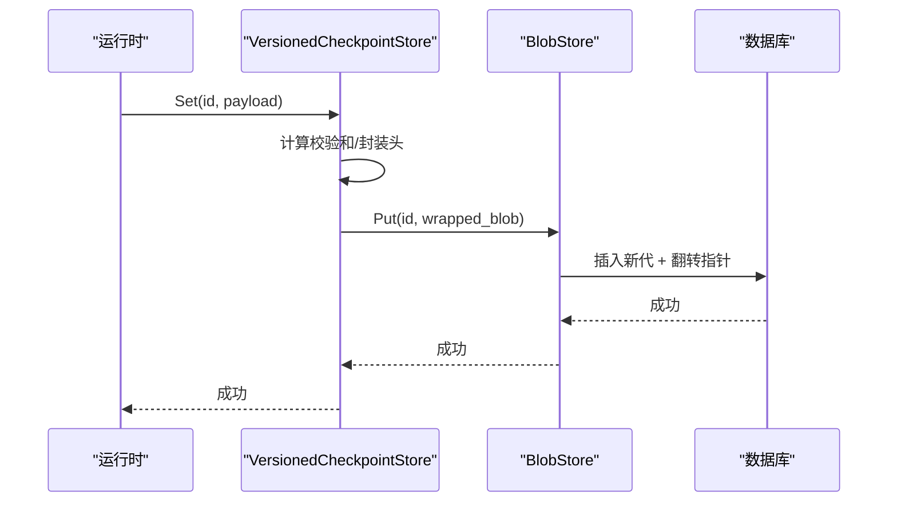
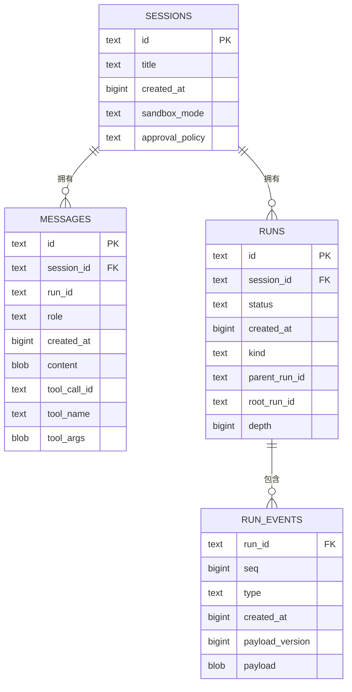
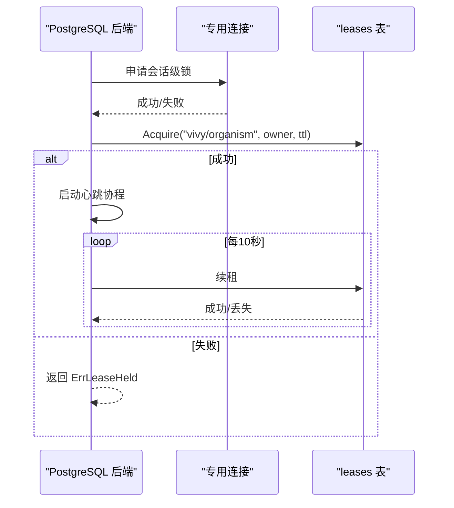
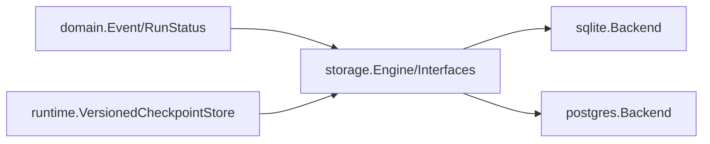

# 存储架构

<cite>
**本文引用的文件**
- [contracts.go](file://internal/storage/contracts.go)
- [doc.go](file://internal/storage/doc.go)
- [sqlite.go](file://internal/storage/sqlite/sqlite.go)
- [journal.go](file://internal/storage/sqlite/journal.go)
- [sessions.go](file://internal/storage/sqlite/sessions.go)
- [messages.go](file://internal/storage/sqlite/messages.go)
- [runs.go](file://internal/storage/sqlite/runs.go)
- [snapshot.go](file://internal/storage/sqlite/snapshot.go)
- [blob.go](file://internal/storage/sqlite/blob.go)
- [lease.go](file://internal/storage/sqlite/lease.go)
- [postgres.go](file://internal/storage/postgres/postgres.go)
- [schema.go](file://internal/storage/postgres/schema.go)
- [suite.go](file://internal/storage/conformance/suite.go)
- [event.go](file://internal/domain/event.go)
- [checkpoint.go](file://internal/runtime/checkpoint.go)
</cite>

## 目录
1. [简介](#简介)
2. [项目结构](#项目结构)
3. [核心组件](#核心组件)
4. [架构总览](#架构总览)
5. [详细组件分析](#详细组件分析)
6. [依赖关系分析](#依赖关系分析)
7. [性能考量](#性能考量)
8. [故障排查指南](#故障排查指南)
9. [结论](#结论)
10. [附录](#附录)

## 简介
本仓库为 Vivy 物种运行时的实现，存储子系统提供统一的持久化契约与双后端实现（SQLite 默认、PostgreSQL 可选）。存储以事件溯源为核心：Journal 是追加式、有序且不可变的事件日志；SnapshotStore 维护键值快照的乐观并发版本；BlobStore 以“代”为单位原子切换指针，用于 Eino 检查点等二进制大对象。Session、Message、Run 等实体通过事务与索引策略保障一致性与查询效率。PostgreSQL 后端通过实例租约与心跳保证单写者独占写入，避免多进程竞争。

## 项目结构
存储子系统位于 internal/storage，包含：
- 抽象契约：Engine、Journal、SnapshotStore、BlobStore、LeaseStore 及各类业务 Store（Session/Message/Run/Approval/Question/Review/SkillRevision/Todo/Studio）
- SQLite 参考后端：纯 Go 驱动，单写者模型，迁移脚本按序执行
- PostgreSQL 后端：连接池、独立 schema、启动时一次性建表、实例租约与心跳
- 一致性测试套件：覆盖 16 项跨后端一致性约束（CN-01..CN-16）
- 领域事件定义：EventType、RunEvent、Terminal 判定等

**图表来源**
- [contracts.go:55-273](file://internal/storage/contracts.go#L55-L273)
- [sqlite.go:40-88](file://internal/storage/sqlite/sqlite.go#L40-L88)
- [postgres.go:47-111](file://internal/storage/postgres/postgres.go#L47-L111)
- [checkpoint.go:40-102](file://internal/runtime/checkpoint.go#L40-L102)

**章节来源**
- [doc.go:1-18](file://internal/storage/doc.go#L1-L18)
- [sqlite.go:17-55](file://internal/storage/sqlite/sqlite.go#L17-L55)
- [postgres.go:20-26](file://internal/storage/postgres/postgres.go#L20-L26)

## 核心组件
- Journal：追加式事件日志，保证单调递增 seq、恰好一个终态事件、支持 after_seq 游标重放
- SnapshotStore：键值快照，带 expectVersion 乐观并发控制
- BlobStore：生成式（generation-based）不可变写入，原子翻转指针
- LeaseStore：分布式锁/租约，支持 TTL 与释放
- 业务 Store：Session/Message/Run/Approval/Question/Review/SkillRevision/Todo/Studio 等，均通过 Engine 暴露

关键不变量与错误：
- 终止事件唯一性：ErrRunClosed、ErrCommitInvalid
- 乐观冲突：ErrVersionConflict
- 未找到：ErrNotFound
- 多进程独占：ErrLeaseHeld、ErrLeaseLost

**章节来源**
- [contracts.go:11-31](file://internal/storage/contracts.go#L11-L31)
- [contracts.go:33-94](file://internal/storage/contracts.go#L33-L94)
- [contracts.go:96-273](file://internal/storage/contracts.go#L96-L273)
- [event.go:93-116](file://internal/domain/event.go#L93-L116)

## 架构总览
Vivy 存储采用“契约 + 多后端”设计：应用层仅依赖 storage.Engine 及其子接口；SQLite 作为默认单机后端，PostgreSQL 作为可插拔服务端后端。运行时对 Eino 检查点使用 VersionedCheckpointStore 包装 BlobStore，增加引擎版本与校验和，确保读取失败关闭（fail-closed）。

**图表来源**
- [journal.go:18-75](file://internal/storage/sqlite/journal.go#L18-L75)
- [snapshot.go:34-70](file://internal/storage/sqlite/snapshot.go#L34-L70)
- [blob.go:18-53](file://internal/storage/sqlite/blob.go#L18-L53)

## 详细组件分析

### 事件溯源与 Journal 实现
- 追加与校验：Append 在事务内检查提交合法性（非空、至多一个终态事件），若 Run 已有终态则拒绝后续追加
- 序列分配：基于 MAX(seq)+1 分配连续单调 seq
- 重放：Replay 使用 after_seq 游标按 seq 顺序流式返回
- 终端事件：由 domain.EventType.Terminal() 判定，保证每个 Run 恰好一个终态

**图表来源**
- [journal.go:18-75](file://internal/storage/sqlite/journal.go#L18-L75)
- [event.go:93-116](file://internal/domain/event.go#L93-L116)

**章节来源**
- [journal.go:18-86](file://internal/storage/sqlite/journal.go#L18-L86)
- [event.go:1-129](file://internal/domain/event.go#L1-L129)

### 快照与乐观并发
- Get：返回 (value, version)，不存在返回 (nil, 0)
- Put：在事务中读取当前 version，与 expectVersion 比较；不存在时 expectVersion 必须为 0；更新时版本号自增
- 冲突：版本不匹配返回 ErrVersionConflict

**图表来源**
- [snapshot.go:34-70](file://internal/storage/sqlite/snapshot.go#L34-L70)

**章节来源**
- [snapshot.go:18-70](file://internal/storage/sqlite/snapshot.go#L18-L70)

### 检查点与 BlobStore（生成式不可变写入）
- Put：为 id 插入新的 generation，并原子翻转 checkpoints 指针（ON CONFLICT 更新）
- Get：通过 joins 获取当前 generation 的 blob
- Delete：删除指针与所有 generations
- 运行时封装：VersionedCheckpointStore 在写入前计算校验和与引擎版本，读取时 fail-closed 验证

**图表来源**
- [blob.go:18-53](file://internal/storage/sqlite/blob.go#L18-L53)
- [checkpoint.go:64-102](file://internal/runtime/checkpoint.go#L64-L102)

**章节来源**
- [blob.go:18-89](file://internal/storage/sqlite/blob.go#L18-L89)
- [checkpoint.go:40-102](file://internal/runtime/checkpoint.go#L40-L102)

### Session、Message、Run 持久化
- Session：创建、列表（最新优先）、改名、删除（级联删除消息、run、事件）
- Message：追加式写入，无更新路径；按 session 创建时间排序列出
- Run：创建（默认 accepted）、状态变更、活跃 Run 枚举、父子树查询（parent/root 索引）

**图表来源**
- [sqlite.go:151-219](file://internal/storage/sqlite/sqlite.go#L151-L219)
- [schema.go:6-47](file://internal/storage/postgres/schema.go#L6-L47)

**章节来源**
- [sessions.go:13-103](file://internal/storage/sqlite/sessions.go#L13-L103)
- [messages.go:10-53](file://internal/storage/sqlite/messages.go#L10-L53)
- [runs.go:15-127](file://internal/storage/sqlite/runs.go#L15-L127)

### 租约与并发控制
- SQLite：单写者（SetMaxOpenConns(1)），避免 WAL/锁细节泄漏到契约层
- PostgreSQL：启动时尝试获取 advisory lock 与 leases 表记录，后台心跳续租；第二进程 Open 返回 ErrLeaseHeld
- 通用 LeaseStore：Acquire/Release 支持 TTL 与幂等释放

**图表来源**
- [postgres.go:47-111](file://internal/storage/postgres/postgres.go#L47-L111)
- [postgres.go:168-220](file://internal/storage/postgres/postgres.go#L168-L220)
- [lease.go:9-45](file://internal/storage/sqlite/lease.go#L9-L45)

**章节来源**
- [sqlite.go:40-48](file://internal/storage/sqlite/sqlite.go#L40-L48)
- [postgres.go:47-111](file://internal/storage/postgres/postgres.go#L47-L111)
- [lease.go:9-45](file://internal/storage/sqlite/lease.go#L9-L45)

### 数据迁移机制
- SQLite：migrations 数组按序执行，每条在一个事务内，成功后写入 schema_migrations；失败中止启动（FR-8）
- PostgreSQL：启动时检查 schema_migrations，若未存在则一次性执行完整 schemaV13 并记录版本

**章节来源**
- [sqlite.go:17-36](file://internal/storage/sqlite/sqlite.go#L17-L36)
- [sqlite.go:109-147](file://internal/storage/sqlite/sqlite.go#L109-L147)
- [postgres.go:133-166](file://internal/storage/postgres/postgres.go#L133-L166)

### 一致性测试套件（事件溯源与并发）
- 覆盖原子追加、单调序列、期望版本冲突、幂等重放、重试分歧拒绝、恰好一个终态、首写获胜审批、重启修复视图、断尾恢复、载荷字节保真、孤儿检查点、杀后决策、双句柄安全、并发写、断开后重放等
- DualOpenMode 区分 SQLite 共享写与 PostgreSQL 独占写行为

**章节来源**
- [suite.go:17-73](file://internal/storage/conformance/suite.go#L17-L73)
- [suite.go:103-549](file://internal/storage/conformance/suite.go#L103-L549)

## 依赖关系分析
- 领域层 internal/domain 仅提供事件类型与状态映射，不包含存储细节
- 存储契约 internal/storage 被 SQLite/PostgreSQL 后端实现，并通过编译期断言确保接口满足
- 运行时 internal/runtime 通过 VersionedCheckpointStore 依赖 BlobStore，不感知后端差异
- 一致性测试 suite 绑定具体后端，验证跨实现一致性

**图表来源**
- [event.go:1-129](file://internal/domain/event.go#L1-L129)
- [contracts.go:252-273](file://internal/storage/contracts.go#L252-L273)
- [sqlite.go:64-79](file://internal/storage/sqlite/sqlite.go#L64-L79)
- [postgres.go:41-44](file://internal/storage/postgres/postgres.go#L41-L44)
- [checkpoint.go:40-102](file://internal/runtime/checkpoint.go#L40-L102)

**章节来源**
- [contracts.go:252-273](file://internal/storage/contracts.go#L252-L273)
- [sqlite.go:64-79](file://internal/storage/sqlite/sqlite.go#L64-L79)
- [postgres.go:41-44](file://internal/storage/postgres/postgres.go#L41-L44)

## 性能考量
- SQLite 单写者：SetMaxOpenConns(1) 降低 WAL/锁争用，适合单机场景
- PostgreSQL 连接池：defaultMaxConns=8，适合高并发读/写分离
- 索引策略：
  - runs.parent_run_id/root_run_id 复合索引加速父子树查询
  - approvals/questions 的 decision/status + expires_at + id 索引加速过期扫描与队列
  - todos.session_id + position + id 索引维持顺序与分页
- 事务边界：Append、Snapshot Put、Blob Put/Delete、Session 删除均在事务内，保证原子性
- 重放优化：Replay 使用 after_seq 游标与 ORDER BY seq，流式迭代减少内存占用

[本节为通用指导，无需特定文件引用]

## 故障排查指南
- 启动失败（FR-8）：迁移失败会中止启动，检查 schema_migrations 与对应迁移 SQL
- 多进程冲突：PostgreSQL 二次 Open 返回 ErrLeaseHeld，确认仅单写者持有租约
- 终止事件重复：Append 返回 ErrRunClosed 或 ErrCommitInvalid，检查提交是否包含多个终态
- 乐观冲突：Snapshot Put 返回 ErrVersionConflict，需重新读取最新版本并重试
- 检查点损坏：VersionedCheckpointStore.Get 返回校验失败或引擎版本不匹配，清理孤儿代并重建
- 审计与载荷保真：CN-13 验证载荷字节不被改写，便于密钥脱敏审计锚点

**章节来源**
- [sqlite.go:109-147](file://internal/storage/sqlite/sqlite.go#L109-L147)
- [postgres.go:84-111](file://internal/storage/postgres/postgres.go#L84-L111)
- [journal.go:18-75](file://internal/storage/sqlite/journal.go#L18-L75)
- [snapshot.go:34-70](file://internal/storage/sqlite/snapshot.go#L34-L70)
- [checkpoint.go:77-97](file://internal/runtime/checkpoint.go#L77-L97)
- [suite.go:423-439](file://internal/storage/conformance/suite.go#L423-L439)

## 结论
Vivy 存储架构通过清晰的契约抽象与双后端实现，将事件溯源、乐观并发、生成式不可变写入与租约并发控制有机结合。SQLite 提供轻量单机能力，PostgreSQL 提供可扩展的服务端能力。迁移机制与一致性测试确保演进安全与跨实现等价。结合合理的索引与事务边界，系统在高可靠与高性能之间取得平衡。

[本节为总结性内容，无需特定文件引用]

## 附录

### 数据库 Schema 与索引要点
- sessions/messages/runs/run_events/approvals/questions/snapshots/checkpoints/leases/notes/skill_revisions/todos/generations/eval_runs/promotions/studio_events
- 关键索引：
  - runs(parent_run_id, created_at, id)、runs(root_run_id, created_at, id)
  - approvals(decision, expires_at, id)、questions(status, expires_at, id)
  - todos(session_id, position, id)
  - eval_runs(candidate_id, created_at, id)
  - promotions(from_id) WHERE phase='accepted'

**章节来源**
- [sqlite.go:151-405](file://internal/storage/sqlite/sqlite.go#L151-L405)
- [schema.go:6-199](file://internal/storage/postgres/schema.go#L6-L199)

### 备份与恢复建议
- SQLite：直接复制文件或使用内置备份 API；注意 WAL 模式下的完整性
- PostgreSQL：使用 pg_dump/pg_restore 或逻辑/物理备份工具；迁移失败会阻止启动，需在升级前备份
- 检查点：定期清理孤儿代，避免膨胀

[本节为通用指导，无需特定文件引用]

### 数据安全与访问控制
- 密钥不持久化：配置仅保存 env_key 名称，日志/快照/事件负载需脱敏
- 审计：approval/question 的 actor/decision_reason 字段支撑审计追踪
- 访问控制：PostgreSQL 可通过 schema 隔离与角色权限控制；SQLite 通过文件系统权限控制

**章节来源**
- [schema.go:49-73](file://internal/storage/postgres/schema.go#L49-L73)
- [sqlite.go:326-341](file://internal/storage/sqlite/sqlite.go#L326-L341)