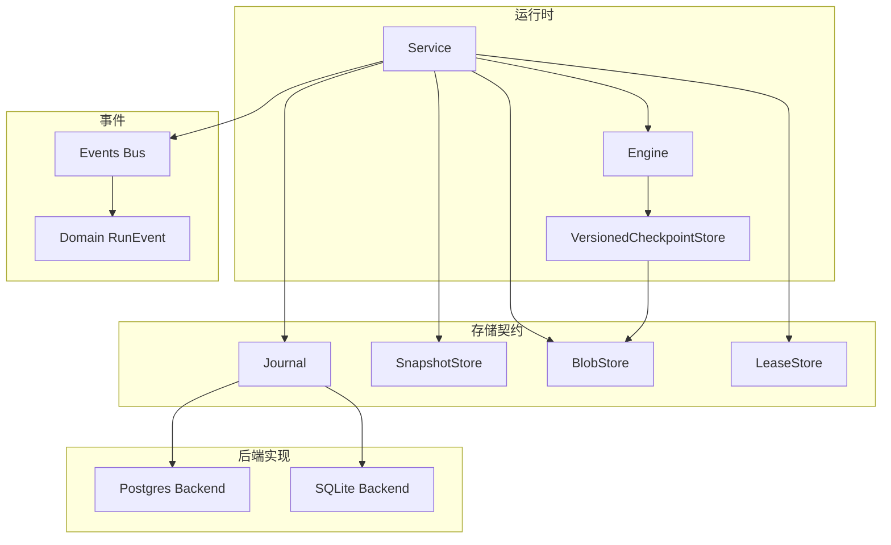
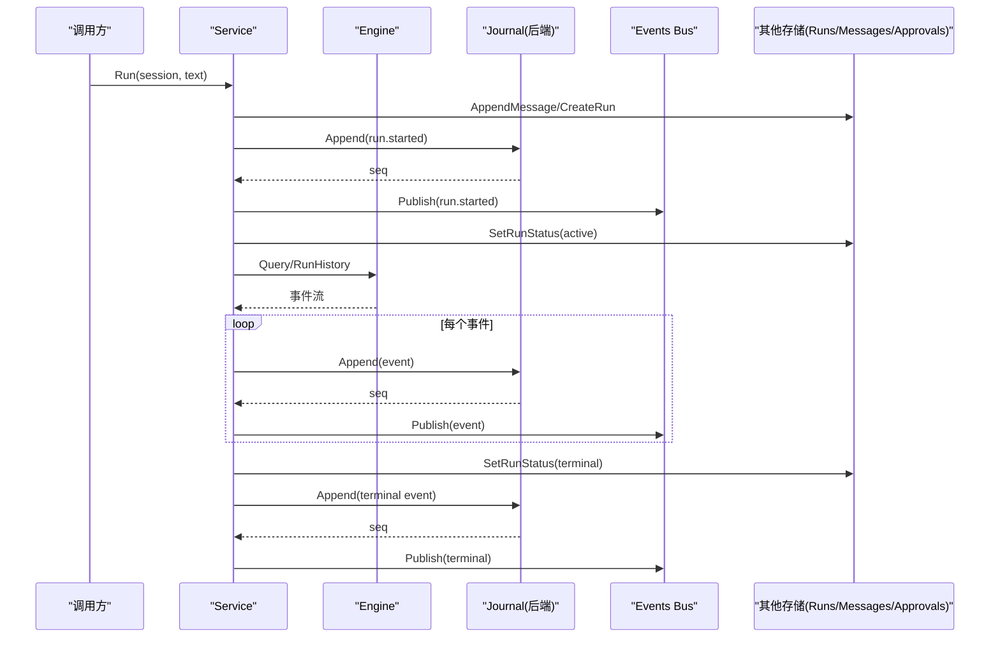
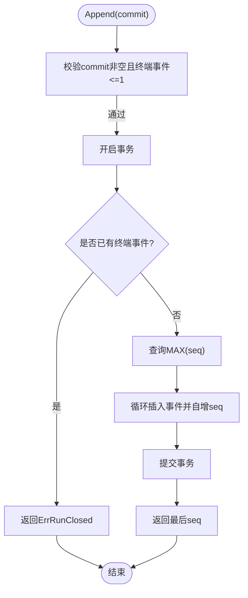
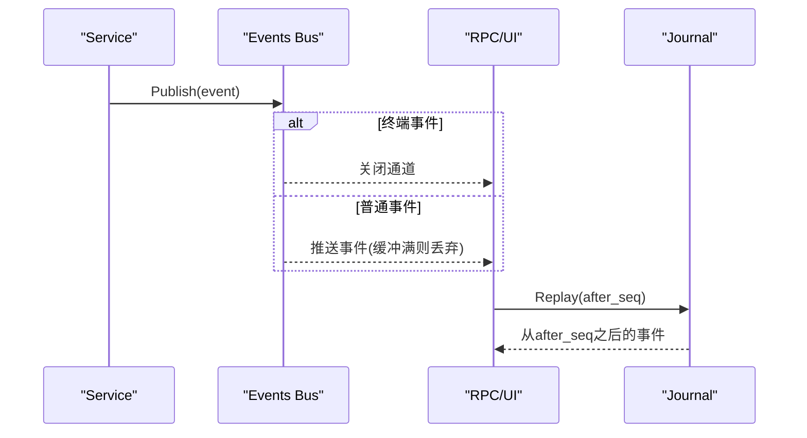
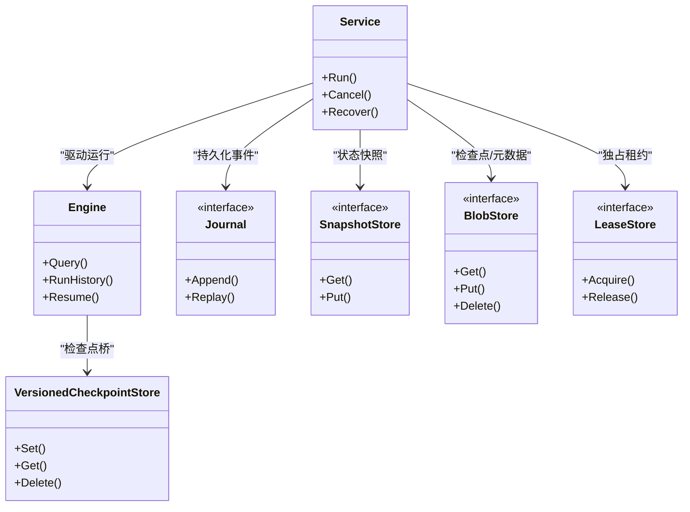

# 数据一致性保障

<cite>
**本文引用的文件**
- [internal/events/bus.go](file://internal/events/bus.go)
- [internal/domain/event.go](file://internal/domain/event.go)
- [internal/storage/contracts.go](file://internal/storage/contracts.go)
- [internal/storage/postgres/journal.go](file://internal/storage/postgres/journal.go)
- [internal/storage/sqlite/journal.go](file://internal/storage/sqlite/journal.go)
- [internal/storage/postgres/db.go](file://internal/storage/postgres/db.go)
- [internal/storage/sqlite/sqlite.go](file://internal/storage/sqlite/sqlite.go)
- [internal/runtime/engine.go](file://internal/runtime/engine.go)
- [internal/runtime/checkpoint.go](file://internal/runtime/checkpoint.go)
- [internal/runtime/service.go](file://internal/runtime/service.go)
- [internal/storage/conformance/suite.go](file://internal/storage/conformance/suite.go)
- [internal/runtime/recovery_test.go](file://internal/runtime/recovery_test.go)
</cite>

## 目录
1. [简介](#简介)
2. [项目结构](#项目结构)
3. [核心组件](#核心组件)
4. [架构总览](#架构总览)
5. [详细组件分析](#详细组件分析)
6. [依赖关系分析](#依赖关系分析)
7. [性能考量](#性能考量)
8. [故障排查指南](#故障排查指南)
9. [结论](#结论)
10. [附录](#附录)

## 简介
本文件围绕 Agent-Vivy 的数据一致性保障进行系统化说明，重点覆盖：
- 事件溯源模式的一致性保证：不可变事件、状态重建、游标管理
- 事务边界设计：跨表事务、分布式事务、补偿机制
- 并发控制策略：乐观锁、悲观锁、CAS 操作
- 数据完整性约束：外键约束、业务规则验证、数据校验
- 容错机制：故障恢复、数据修复、一致性检查
- 一致性测试套件与回归用例
- 故障模拟、混沌工程实践与监控告警建议

## 项目结构
Agent-Vivy 将“运行时”“存储契约”“事件总线”“领域模型”分层解耦。关键路径为：Service 编排运行生命周期，Engine 驱动 Eino Runner，Journal 持久化不可变事件流，Snapshot/Blob/Lease 等存储接口提供状态与元数据能力，SQLite/Postgres 作为具体后端实现。

图表来源
- [internal/runtime/service.go:212-300](file://internal/runtime/service.go#L212-L300)
- [internal/runtime/engine.go:61-117](file://internal/runtime/engine.go#L61-L117)
- [internal/runtime/checkpoint.go:40-97](file://internal/runtime/checkpoint.go#L40-L97)
- [internal/storage/contracts.go:55-94](file://internal/storage/contracts.go#L55-L94)
- [internal/storage/postgres/journal.go:14-79](file://internal/storage/postgres/journal.go#L14-L79)
- [internal/storage/sqlite/journal.go:14-75](file://internal/storage/sqlite/journal.go#L14-L75)
- [internal/events/bus.go:10-75](file://internal/events/bus.go#L10-L75)

章节来源
- [internal/runtime/service.go:212-300](file://internal/runtime/service.go#L212-L300)
- [internal/storage/contracts.go:55-94](file://internal/storage/contracts.go#L55-L94)

## 核心组件
- 事件与类型：RunEvent、EventType、Terminal 判定、RunStatus 映射，构成事件溯源的不可变记录与终态语义。
- 事件总线：按 runID 分发事件，支持订阅者掉队后从 Journal 重放，保证最终可见性。
- 存储契约：Journal（追加有序、唯一终态）、SnapshotStore（版本冲突返回错误）、BlobStore（生成式写入）、LeaseStore（独占租约）。
- 后端实现：SQLite（单写者、迁移脚本）、Postgres（行级锁 + Advisory Lock）。
- 运行时服务：编排消息、运行行、事件、审批/问题、预算与恢复；确保“先持久化再发布”。
- 引擎与检查点：Eino Runner 集成，检查点带版本与校验和，失败关闭读取。

章节来源
- [internal/domain/event.go:3-129](file://internal/domain/event.go#L3-L129)
- [internal/events/bus.go:10-115](file://internal/events/bus.go#L10-L115)
- [internal/storage/contracts.go:11-94](file://internal/storage/contracts.go#L11-L94)
- [internal/storage/postgres/journal.go:14-79](file://internal/storage/postgres/journal.go#L14-L79)
- [internal/storage/sqlite/journal.go:14-75](file://internal/storage/sqlite/journal.go#L14-L75)
- [internal/runtime/engine.go:61-117](file://internal/runtime/engine.go#L61-L117)
- [internal/runtime/checkpoint.go:40-97](file://internal/runtime/checkpoint.go#L40-L97)

## 架构总览
下图展示一次运行的端到端一致性与持久化流程，强调“先持久化、后发布”的顺序以及终态唯一性约束。

图表来源
- [internal/runtime/service.go:212-300](file://internal/runtime/service.go#L212-L300)
- [internal/storage/postgres/journal.go:14-79](file://internal/storage/postgres/journal.go#L14-L79)
- [internal/storage/sqlite/journal.go:14-75](file://internal/storage/sqlite/journal.go#L14-L75)
- [internal/events/bus.go:42-75](file://internal/events/bus.go#L42-L75)

## 详细组件分析

### 事件溯源与一致性保证
- 不可变事件：RunEvent 包含 RunID、单调递增 Seq、Type、CreatedAt、PayloadVersion、Payload，事件一旦写入不可修改。
- 终态唯一：每种 Run 仅允许一个终态事件（completed/failed/cancelled），在 Append 时强制校验，违反则拒绝。
- 状态重建：通过 Replay(after_seq) 顺序回放事件，可重建任意时刻的状态或消费增量。
- 游标管理：Replay 以 after_seq 为起点，支持断线续传与慢消费者追赶。

图表来源
- [internal/storage/postgres/journal.go:14-79](file://internal/storage/postgres/journal.go#L14-L79)
- [internal/storage/sqlite/journal.go:14-75](file://internal/storage/sqlite/journal.go#L14-L75)
- [internal/domain/event.go:93-116](file://internal/domain/event.go#L93-L116)

章节来源
- [internal/domain/event.go:3-129](file://internal/domain/event.go#L3-L129)
- [internal/storage/postgres/journal.go:14-79](file://internal/storage/postgres/journal.go#L14-L79)
- [internal/storage/sqlite/journal.go:14-75](file://internal/storage/sqlite/journal.go#L14-L75)

### 事务边界设计
- 跨表事务：SQLite 使用单写者连接，迁移与应用逻辑均在事务内执行；Postgres 使用显式事务包裹 Append 与相关校验。
- 分布式事务：未引入两阶段提交；通过 LeaseStore 实现进程级独占（服务器数据库模式下第二句柄打开即失败），避免多实例同时写 Journal。
- 补偿机制：服务层对审批/问题超时进行扫描过期并关闭；恢复流程对孤儿运行进行失败收尾；检查点读取失败采用“失败关闭”策略。

章节来源
- [internal/storage/sqlite/sqlite.go:17-55](file://internal/storage/sqlite/sqlite.go#L17-L55)
- [internal/storage/postgres/db.go:13-56](file://internal/storage/postgres/db.go#L13-L56)
- [internal/storage/contracts.go:87-94](file://internal/storage/contracts.go#L87-L94)
- [internal/runtime/service.go:465-576](file://internal/runtime/service.go#L465-L576)

### 并发控制策略
- 乐观锁：SnapshotStore.Put 使用 expectVersion，冲突返回 ErrVersionConflict，用于快照更新。
- 悲观锁：Postgres Append 使用 advisory lock 按 runID 串行化，防止并发写入导致序列错乱。
- CAS 操作：Approval Decide 采用“第一写入者胜”，并发决策只允许一次成功；LeaseStore Acquire/Release 实现租约竞争。

章节来源
- [internal/storage/contracts.go:66-94](file://internal/storage/contracts.go#L66-L94)
- [internal/storage/postgres/journal.go:32-40](file://internal/storage/postgres/journal.go#L32-L40)
- [internal/storage/conformance/suite.go:242-281](file://internal/storage/conformance/suite.go#L242-L281)

### 数据完整性约束
- 外键约束：SQLite schema 定义 sessions/messages/runs/approvements/questions 等表的外键关系，删除会话会级联清理。
- 业务规则验证：EventType.Valid/Terminal/RunStatus 限制事件类型与终态；Service 在创建运行前校验模式与策略。
- 数据校验：事件负载大小上限、检查点版本与校验和、非法负载透传但保持字节保真。

章节来源
- [internal/storage/sqlite/sqlite.go:149-405](file://internal/storage/sqlite/sqlite.go#L149-L405)
- [internal/domain/event.go:83-116](file://internal/domain/event.go#L83-L116)
- [internal/runtime/checkpoint.go:64-97](file://internal/runtime/checkpoint.go#L64-L97)
- [internal/runtime/engine.go:18-46](file://internal/runtime/engine.go#L18-L46)

### 容错机制
- 故障恢复：启动时 Recover 扫描活跃运行，结合待决审批/问题与检查点可读性，重建挂起状态或失败收尾。
- 数据修复：检查点孤儿清理、检查点指针丢弃、过期审批/问题自动清扫。
- 一致性检查：Conformance Suite 覆盖原子追加、单调序列、版本冲突、幂等重放、重试分歧拒绝、唯一终态、首写获胜、重启修复视图、断尾写存活、载荷保真、双句柄安全、并发写、断线后重放等。

章节来源
- [internal/runtime/service.go:465-576](file://internal/runtime/service.go#L465-L576)
- [internal/storage/sqlite/sqlite.go:90-107](file://internal/storage/sqlite/sqlite.go#L90-L107)
- [internal/storage/conformance/suite.go:42-73](file://internal/storage/conformance/suite.go#L42-L73)
- [internal/storage/conformance/suite.go:103-549](file://internal/storage/conformance/suite.go#L103-L549)

### 事件总线与游标重放
- 事件总线按 runID 广播，终端事件关闭订阅；若订阅者掉队，直接丢弃并重放从 last seen seq 开始的事件。
- RPC/UI 消费侧通过 Replay(after_seq) 获取增量，保证不丢事件、不阻塞运行。

图表来源
- [internal/events/bus.go:42-106](file://internal/events/bus.go#L42-L106)
- [internal/storage/postgres/journal.go:81-89](file://internal/storage/postgres/journal.go#L81-L89)
- [internal/storage/sqlite/journal.go:77-86](file://internal/storage/sqlite/journal.go#L77-L86)

章节来源
- [internal/events/bus.go:10-115](file://internal/events/bus.go#L10-L115)
- [internal/storage/postgres/journal.go:81-89](file://internal/storage/postgres/journal.go#L81-L89)
- [internal/storage/sqlite/journal.go:77-86](file://internal/storage/sqlite/journal.go#L77-L86)

### 检查点与版本隔离
- 检查点以“Vivy信封”封装 eino 原始字节，携带引擎版本与 SHA256 校验和，写入 BlobStore 的生成式存储。
- 读取时严格校验版本与校验和，任一不符即拒绝（失败关闭），避免跨版本误用。

章节来源
- [internal/runtime/checkpoint.go:31-97](file://internal/runtime/checkpoint.go#L31-L97)
- [internal/runtime/engine.go:112-116](file://internal/runtime/engine.go#L112-L116)

## 依赖关系分析
- Service 依赖 Engine、Journal、Runs/Messages/Notes/Approvals/Questions、Budget、Workspace、Sink 等，形成强内聚的编排层。
- Engine 仅依赖 Eino 类型并通过适配器暴露工具集，保持内部边界。
- 存储契约抽象了 SQLite/Postgres 差异，上层无需感知后端细节。
- 事件总线与 Journal 分离，Bus 是优化层，Journal 是唯一事实源。

图表来源
- [internal/runtime/service.go:70-130](file://internal/runtime/service.go#L70-L130)
- [internal/runtime/engine.go:48-117](file://internal/runtime/engine.go#L48-L117)
- [internal/runtime/checkpoint.go:40-97](file://internal/runtime/checkpoint.go#L40-L97)
- [internal/storage/contracts.go:55-94](file://internal/storage/contracts.go#L55-L94)

章节来源
- [internal/runtime/service.go:70-130](file://internal/runtime/service.go#L70-L130)
- [internal/runtime/engine.go:48-117](file://internal/runtime/engine.go#L48-L117)
- [internal/storage/contracts.go:55-94](file://internal/storage/contracts.go#L55-L94)

## 性能考量
- SQLite 单写者：SetMaxOpenConns(1) 避免 WAL/锁争用，适合单机场景。
- Postgres Advisory Lock：按 runID 加锁，减少并发写入冲突，提升追加吞吐稳定性。
- 事件缓冲：EngineConfig.StreamBuffer 控制下游扇出缓冲，避免背压传播到上游。
- 事件负载上限：MaxEventPayloadBytes 限制单次事件大小，防止上下文膨胀。
- 预算与历史消息限制：MaxToolTurns、MaxContextBytes、MaxHistoryMessages 控制资源消耗。

章节来源
- [internal/storage/sqlite/sqlite.go:45-48](file://internal/storage/sqlite/sqlite.go#L45-L48)
- [internal/storage/postgres/journal.go:32-40](file://internal/storage/postgres/journal.go#L32-L40)
- [internal/runtime/engine.go:18-46](file://internal/runtime/engine.go#L18-L46)

## 故障排查指南
- 常见错误码：
  - ErrRunClosed：运行已存在终态事件，禁止继续追加。
  - ErrCommitInvalid：commit 为空或包含多个终态事件。
  - ErrVersionConflict：快照版本不一致，需重试或回退。
  - ErrLeaseHeld/ErrLeaseLost：租约被占用或丢失，检查多实例配置。
- 恢复流程：
  - 启动 Recover：列出活跃运行，结合待决审批/问题与检查点可读性，重建挂起或失败收尾。
  - 超时清扫：定期 SweepExpired 处理过期审批/问题。
- 调试要点：
  - 使用 Replay(after_seq) 定位断点后的事件缺失。
  - 检查点读取失败（版本不匹配或校验和不符）应视为严重错误，立即停止恢复。

章节来源
- [internal/storage/contracts.go:11-31](file://internal/storage/contracts.go#L11-L31)
- [internal/runtime/service.go:465-576](file://internal/runtime/service.go#L465-L576)
- [internal/runtime/checkpoint.go:77-97](file://internal/runtime/checkpoint.go#L77-L97)

## 结论
Agent-Vivy 通过事件溯源、严格的终态唯一性、版本化的检查点与租约机制，构建了高可靠的数据一致性保障体系。SQLite/Postgres 两种后端分别适配单机与服务端场景，配合 Conformance Suite 与恢复测试，确保在异常与重启下仍保持一致性与可恢复性。建议在部署中启用租约保护、监控事件积压与检查点健康度，并结合超时清扫与恢复流程，形成闭环的容错体系。

## 附录

### 一致性测试套件与回归用例
- Conformance Suite（CN-01..CN-16）覆盖原子追加、单调序列、版本冲突、幂等重放、重试分歧拒绝、唯一终态、首写获胜、重启修复视图、断尾写存活、载荷保真、双句柄安全、并发写、断线后重放等。
- 恢复测试验证可恢复审批、过期审批失败、孤儿运行失败、无操作恢复等场景。

章节来源
- [internal/storage/conformance/suite.go:42-73](file://internal/storage/conformance/suite.go#L42-L73)
- [internal/storage/conformance/suite.go:103-549](file://internal/storage/conformance/suite.go#L103-L549)
- [internal/runtime/recovery_test.go:92-227](file://internal/runtime/recovery_test.go#L92-L227)

### 故障模拟与混沌工程实践
- 进程重启：关闭后再打开，验证活跃运行与待决审批可见性，检查点可读性决定能否恢复。
- 并发决策：多 goroutine 并发 DecideApproval，仅允许一次成功，验证首写获胜。
- 双句柄安全：共享/独占模式下验证 Journal 追加与重放一致性。
- 断线重放：基于 after_seq 的尾部重放，确保不丢事件。

章节来源
- [internal/storage/conformance/suite.go:283-342](file://internal/storage/conformance/suite.go#L283-L342)
- [internal/storage/conformance/suite.go:441-484](file://internal/storage/conformance/suite.go#L441-L484)
- [internal/storage/conformance/suite.go:527-549](file://internal/storage/conformance/suite.go#L527-L549)

### 监控告警策略建议
- 事件积压：监控 Bus 订阅者数量与事件延迟，超过阈值触发告警。
- 检查点健康：监控检查点读取失败率与版本不匹配次数。
- 租约状态：监控 Lease 持有与丢失事件，识别多实例冲突。
- 恢复指标：统计 Recover 处理的活跃运行数、失败收尾数、重建挂起数。

[本节为通用建议，不直接引用具体代码文件]