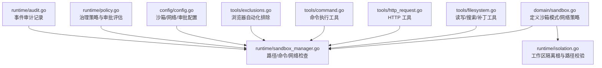
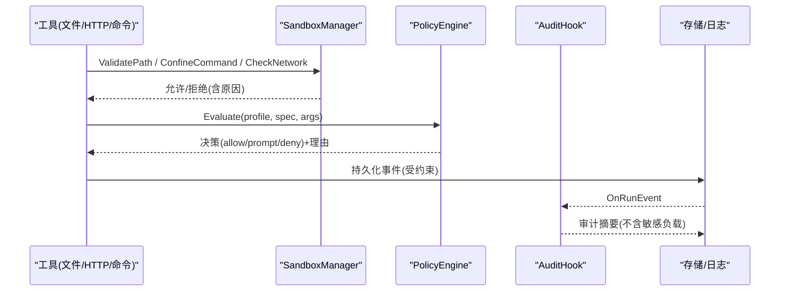
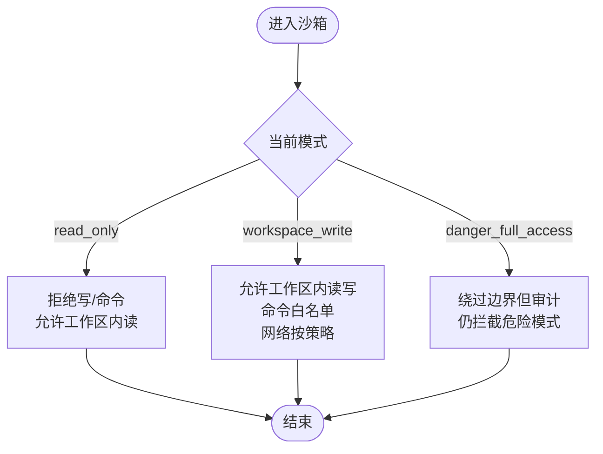
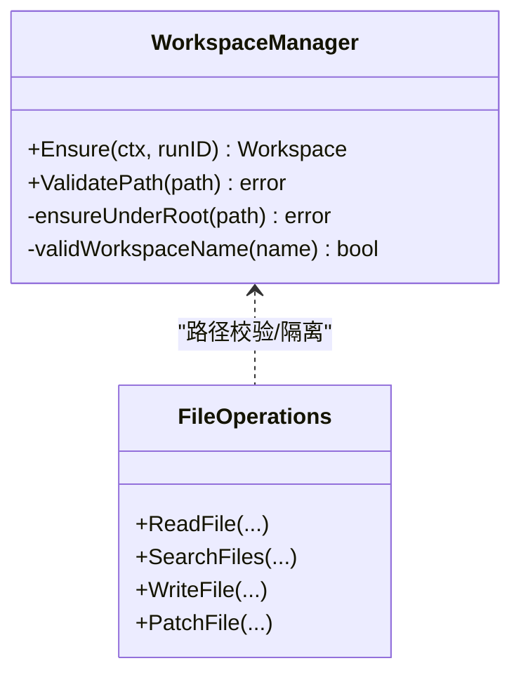
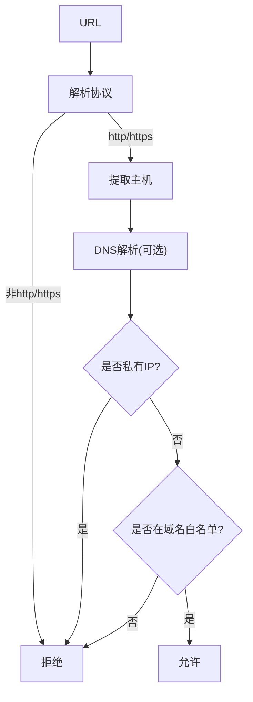
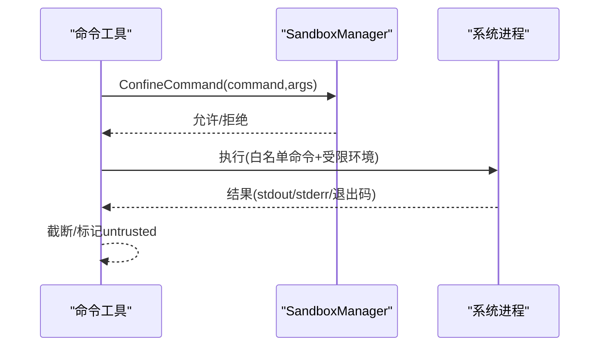
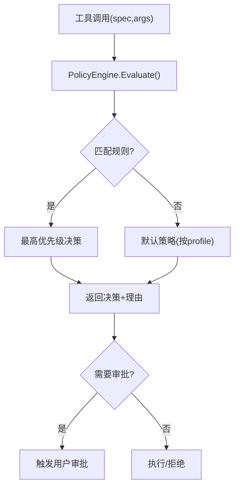
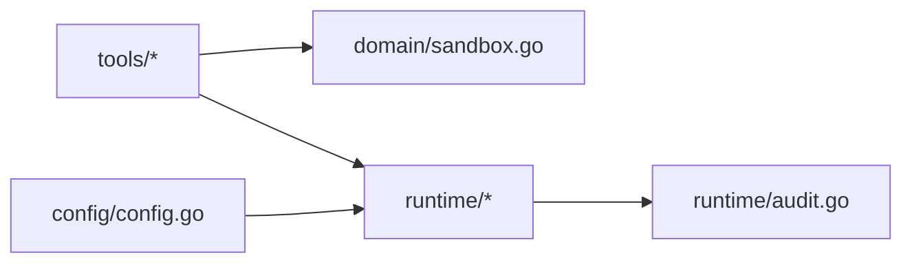

# 安全沙箱模型

<cite>
**本文引用的文件**
- [internal/domain/sandbox.go](file://internal/domain/sandbox.go)
- [internal/runtime/sandbox_manager.go](file://internal/runtime/sandbox_manager.go)
- [internal/runtime/isolation.go](file://internal/runtime/isolation.go)
- [internal/tools/filesystem.go](file://internal/tools/filesystem.go)
- [internal/tools/http_request.go](file://internal/tools/http_request.go)
- [internal/tools/command.go](file://internal/tools/command.go)
- [internal/tools/exclusions.go](file://internal/tools/exclusions.go)
- [internal/config/config.go](file://internal/config/config.go)
- [internal/runtime/policy.go](file://internal/runtime/policy.go)
- [internal/runtime/audit.go](file://internal/runtime/audit.go)
- [docs/dev/sandbox.md](file://docs/dev/sandbox.md)
</cite>

## 目录
1. [简介](#简介)
2. [项目结构](#项目结构)
3. [核心组件](#核心组件)
4. [架构总览](#架构总览)
5. [详细组件分析](#详细组件分析)
6. [依赖关系分析](#依赖关系分析)
7. [性能与资源限制](#性能与资源限制)
8. [故障排查指南](#故障排查指南)
9. [结论](#结论)
10. [附录：配置与安全最佳实践](#附录：配置与安全最佳实践)

## 简介
本文件系统化阐述 Agent-Vivy 的安全沙箱模型，围绕三层权限控制（只读访问、工作区写入、危险全访问）、文件系统隔离、网络访问控制、命令执行沙箱、Exclusions 排除机制、安全策略配置、违规检测与处理，以及安全最佳实践与常见漏洞防护方案进行说明。目标是让非专业读者也能理解并正确使用该沙箱体系。

## 项目结构
Vivy 的安全能力由 domain 层定义、runtime 层实现、tools 层暴露工具契约、config 层集中配置校验，辅以审计与策略引擎形成闭环。关键路径如下：
- 领域模型：internal/domain/sandbox.go
- 运行时沙箱：internal/runtime/sandbox_manager.go、internal/runtime/isolation.go
- 工具契约：internal/tools/filesystem.go、http_request.go、command.go、exclusions.go
- 配置与策略：internal/config/config.go、internal/runtime/policy.go
- 审计：internal/runtime/audit.go
- 设计文档：docs/dev/sandbox.md

图表来源
- [internal/domain/sandbox.go:1-85](file://internal/domain/sandbox.go#L1-L85)
- [internal/runtime/sandbox_manager.go:1-286](file://internal/runtime/sandbox_manager.go#L1-L286)
- [internal/runtime/isolation.go:1-109](file://internal/runtime/isolation.go#L1-L109)
- [internal/tools/filesystem.go:1-340](file://internal/tools/filesystem.go#L1-L340)
- [internal/tools/http_request.go:1-72](file://internal/tools/http_request.go#L1-L72)
- [internal/tools/command.go:1-130](file://internal/tools/command.go#L1-L130)
- [internal/tools/exclusions.go:1-13](file://internal/tools/exclusions.go#L1-L13)
- [internal/config/config.go:1-642](file://internal/config/config.go#L1-L642)
- [internal/runtime/policy.go:1-274](file://internal/runtime/policy.go#L1-L274)
- [internal/runtime/audit.go:1-62](file://internal/runtime/audit.go#L1-L62)

章节来源
- [docs/dev/sandbox.md:1-135](file://docs/dev/sandbox.md#L1-L135)

## 核心组件
- 三层权限模型：read_only、workspace_write、danger_full_access，分别对应“只读”、“工作区内写”、“危险全访问”。
- 工作区隔离：基于受控根目录的独立子目录，拒绝符号链接逃逸与越界路径。
- 网络访问控制：仅允许 HTTP/HTTPS，支持域名白名单、私有 IP 拦截、响应大小上限。
- 命令执行沙箱：白名单可执行名、禁止 shell 语法注入、危险模式拦截、超时与输出截断。
- 策略与审批：治理规则引擎 + 审批策略（ask/never/auto），支持自动批准白名单与过期处理。
- 审计：对运行事件进行摘要化审计记录，不携带敏感负载。

章节来源
- [internal/domain/sandbox.go:1-85](file://internal/domain/sandbox.go#L1-L85)
- [internal/runtime/sandbox_manager.go:1-286](file://internal/runtime/sandbox_manager.go#L1-L286)
- [internal/runtime/isolation.go:1-109](file://internal/runtime/isolation.go#L1-L109)
- [internal/runtime/policy.go:1-274](file://internal/runtime/policy.go#L1-L274)
- [internal/runtime/audit.go:1-62](file://internal/runtime/audit.go#L1-L62)
- [internal/config/config.go:150-192](file://internal/config/config.go#L150-L192)

## 架构总览
下图展示从工具调用到沙箱校验、策略评估与审计的完整流程。

图表来源
- [internal/runtime/sandbox_manager.go:85-234](file://internal/runtime/sandbox_manager.go#L85-L234)
- [internal/runtime/policy.go:96-135](file://internal/runtime/policy.go#L96-L135)
- [internal/runtime/audit.go:35-62](file://internal/runtime/audit.go#L35-L62)

## 详细组件分析

### 三层权限控制模型
- read_only：禁止所有写操作与命令执行；允许在工作区内读取。
- workspace_write：允许在工作区根目录下读写；命令执行需白名单；网络访问按策略控制。
- danger_full_access：绕过沙箱边界，但仍会审计；仍会阻止明显危险命令模式。

图表来源
- [internal/domain/sandbox.go:9-38](file://internal/domain/sandbox.go#L9-L38)
- [internal/runtime/sandbox_manager.go:89-183](file://internal/runtime/sandbox_manager.go#L89-L183)
- [docs/dev/sandbox.md:13-35](file://docs/dev/sandbox.md#L13-L35)

章节来源
- [internal/domain/sandbox.go:1-85](file://internal/domain/sandbox.go#L1-L85)
- [internal/runtime/sandbox_manager.go:85-183](file://internal/runtime/sandbox_manager.go#L85-L183)
- [docs/dev/sandbox.md:13-35](file://docs/dev/sandbox.md#L13-L35)

### 文件系统隔离机制
- 工作区根与路径校验：通过 WorkspaceManager 确保每个 run 拥有独立子目录，拒绝符号链接逃逸与越界路径。
- 工具侧约束：文件工具声明为工作区相对路径，配合后端适配器在运行时做路径归一化与范围检查。
- 操作审计：所有运行事件经审计钩子记录摘要，避免泄露敏感内容。

图表来源
- [internal/runtime/isolation.go:14-109](file://internal/runtime/isolation.go#L14-L109)
- [internal/tools/filesystem.go:82-89](file://internal/tools/filesystem.go#L82-L89)

章节来源
- [internal/runtime/isolation.go:14-109](file://internal/runtime/isolation.go#L14-L109)
- [internal/tools/filesystem.go:106-300](file://internal/tools/filesystem.go#L106-L300)
- [internal/runtime/audit.go:12-62](file://internal/runtime/audit.go#L12-L62)

### 网络访问控制
- 协议限制：仅允许 http/https。
- 域名白名单：可选配置，未配置时默认放行（结合私有 IP 策略）。
- 私有 IP 拦截：默认开启，阻断 RFC1918、回环、链路本地等地址。
- 响应过滤：通过配置项限制单次响应体大小，防止大体积数据进入上下文。

图表来源
- [internal/runtime/sandbox_manager.go:185-234](file://internal/runtime/sandbox_manager.go#L185-L234)
- [internal/config/config.go:186-192](file://internal/config/config.go#L186-L192)

章节来源
- [internal/runtime/sandbox_manager.go:185-234](file://internal/runtime/sandbox_manager.go#L185-L234)
- [internal/config/config.go:186-192](file://internal/config/config.go#L186-L192)

### 命令执行沙箱
- 进程隔离：命令以白名单形式限定可执行名，参数直接传递，不进行 shell 展开。
- 环境变量控制：仅允许非敏感的环境变量覆盖，避免注入密钥。
- 资源限制：支持超时与输出截断，避免长时间占用或过大输出。
- 危险模式拦截：即使在危险全访问模式下，也会阻止格式化、递归强制删除等高危组合。

图表来源
- [internal/tools/command.go:12-130](file://internal/tools/command.go#L12-L130)
- [internal/runtime/sandbox_manager.go:149-183](file://internal/runtime/sandbox_manager.go#L149-L183)

章节来源
- [internal/tools/command.go:12-130](file://internal/tools/command.go#L12-L130)
- [internal/runtime/sandbox_manager.go:149-183](file://internal/runtime/sandbox_manager.go#L149-L183)

### Exclusions 排除机制
- 浏览器自动化排除：针对名称中包含浏览器/Playwright/Puppeteer 的工具进行识别与屏蔽，避免超出 Vivy 范围的自动化行为。
- 该机制作为生产级护栏，确保动态发现的 MCP 名称也不会引入不受控的浏览器自动化能力。

章节来源
- [internal/tools/exclusions.go:1-13](file://internal/tools/exclusions.go#L1-L13)

### 安全策略配置与审批
- 策略引擎：基于 profile 的规则匹配，支持 equals/prefix 字段匹配，决定 allow/prompt/deny。
- 审批策略：ask（始终询问）、never（从不询问且拒绝效果性工具）、auto（只读与白名单工具自动批准）。
- 配置入口：通过 config.yaml 的 runtime.sandbox.* 与 governance.profiles.* 进行声明式配置。

图表来源
- [internal/runtime/policy.go:96-169](file://internal/runtime/policy.go#L96-L169)
- [internal/runtime/policy.go:212-274](file://internal/runtime/policy.go#L212-L274)
- [internal/config/config.go:209-231](file://internal/config/config.go#L209-L231)

章节来源
- [internal/runtime/policy.go:1-274](file://internal/runtime/policy.go#L1-L274)
- [internal/config/config.go:209-231](file://internal/config/config.go#L209-L231)

### 违规检测与处理
- 路径逃逸：检测到 ..、符号链接逃逸、绝对路径越界即拒绝。
- 命令注入：禁止 shell 元字符，仅白名单可执行名。
- 网络越权：非 http/https、私有 IP、不在白名单的域名均被拒绝。
- 危险命令：即使在全访问模式也拦截格式化、递归删除等高危组合。
- 审计追踪：所有运行事件经审计钩子记录摘要，便于事后追溯。

章节来源
- [internal/runtime/sandbox_manager.go:89-286](file://internal/runtime/sandbox_manager.go#L89-L286)
- [internal/runtime/audit.go:12-62](file://internal/runtime/audit.go#L12-L62)

## 依赖关系分析
- 低耦合：tools 仅依赖 domain 契约，具体执行由 runtime 适配；config 提供统一配置入口。
- 明确边界：SandboxManager 负责路径/命令/网络的硬性检查；PolicyEngine 负责策略与审批；AuditHook 负责审计。
- 外部依赖最小化：网络访问仅使用标准库；文件系统访问通过工作区根隔离。

图表来源
- [internal/tools/filesystem.go:1-340](file://internal/tools/filesystem.go#L1-L340)
- [internal/tools/http_request.go:1-72](file://internal/tools/http_request.go#L1-L72)
- [internal/tools/command.go:1-130](file://internal/tools/command.go#L1-L130)
- [internal/runtime/sandbox_manager.go:1-286](file://internal/runtime/sandbox_manager.go#L1-L286)
- [internal/runtime/policy.go:1-274](file://internal/runtime/policy.go#L1-L274)
- [internal/runtime/audit.go:1-62](file://internal/runtime/audit.go#L1-L62)
- [internal/config/config.go:1-642](file://internal/config/config.go#L1-L642)

## 性能与资源限制
- 事件载荷上限：通过配置限制单次事件负载大小，避免内存膨胀。
- 工具结果大小：限制工具结果进入模型上下文的字节数，降低上下文压力。
- 网络响应上限：限制 HTTP 响应体大小，防止恶意大响应。
- 超时与截断：命令执行支持超时与输出截断，避免资源耗尽。
- 工作区隔离：每个 run 独立目录，减少跨任务干扰。

章节来源
- [internal/config/config.go:110-153](file://internal/config/config.go#L110-L153)
- [internal/tools/command.go:17-36](file://internal/tools/command.go#L17-L36)

## 故障排查指南
- 路径相关错误
  - 现象：拒绝访问或“路径逃逸”错误。
  - 排查：确认路径是否包含 ..、是否指向工作区外、是否存在符号链接。
  - 参考：[internal/runtime/sandbox_manager.go:89-147](file://internal/runtime/sandbox_manager.go#L89-L147)、[internal/runtime/isolation.go:76-95](file://internal/runtime/isolation.go#L76-L95)
- 命令执行错误
  - 现象：命令不在白名单或被判定为危险模式。
  - 排查：核对 execute_allowed_commands、命令名规范化、参数中是否包含 shell 元字符。
  - 参考：[internal/runtime/sandbox_manager.go:149-183](file://internal/runtime/sandbox_manager.go#L149-L183)、[internal/tools/command.go:98-112](file://internal/tools/command.go#L98-L112)
- 网络访问错误
  - 现象：URL 被拒绝或私有 IP 被拦截。
  - 排查：确认协议是否为 http/https、域名是否在白名单、是否解析到私有 IP。
  - 参考：[internal/runtime/sandbox_manager.go:185-234](file://internal/runtime/sandbox_manager.go#L185-L234)
- 审批与策略
  - 现象：工具调用被要求审批或直接拒绝。
  - 排查：检查治理 profile、规则匹配、审批策略（ask/never/auto）与自动批准白名单。
  - 参考：[internal/runtime/policy.go:96-169](file://internal/runtime/policy.go#L96-L169)、[internal/runtime/policy.go:212-274](file://internal/runtime/policy.go#L212-L274)
- 审计与回溯
  - 现象：需要定位某次操作的决策与原因。
  - 排查：查看审计摘要中的 RunID、Seq、Type、PayloadSHA256，关联事件回放。
  - 参考：[internal/runtime/audit.go:12-62](file://internal/runtime/audit.go#L12-L62)

## 结论
Vivy 的沙箱模型通过“三层权限 + 工作区隔离 + 白名单命令 + 网络策略 + 策略引擎 + 审计”的组合，提供了从开发到生产的渐进式安全边界。建议在默认场景使用 workspace_write 与 ask 审批，逐步收紧网络与命令白名单，并在 CI/无人值守环境中采用 never 审批与更严格的策略。

## 附录：配置与安全最佳实践
- 默认模式与工作区
  - 将 runtime.workspace_root 设置为受控目录；如需覆盖，使用 runtime.sandbox.workspace_root。
  - 推荐默认模式为 workspace_write，仅在可信环境下使用 danger_full_access。
- 命令白名单
  - 仅启用必要命令（如 go、git、rg），避免引入 shell 解释器或危险命令。
  - 严格禁止 shell 元字符，参数直接传递。
- 网络策略
  - 开启 deny_private_ips；在生产环境配置 allowed_domains 为最小集合。
  - 设置 http_max_response_bytes 限制响应体大小。
- 审批策略
  - 默认使用 ask；CI/自动化使用 never；日常开发可使用 auto 并配置 auto_approve_tools。
  - 合理设置 approval.timeout_seconds，避免长期挂起。
- 审计与合规
  - 启用审计钩子，定期审查审计摘要与事件回放。
  - 遵循密钥不落地原则，仅通过环境变量引用。

章节来源
- [internal/config/config.go:256-314](file://internal/config/config.go#L256-L314)
- [internal/config/config.go:499-528](file://internal/config/config.go#L499-L528)
- [docs/dev/sandbox.md:56-84](file://docs/dev/sandbox.md#L56-L84)