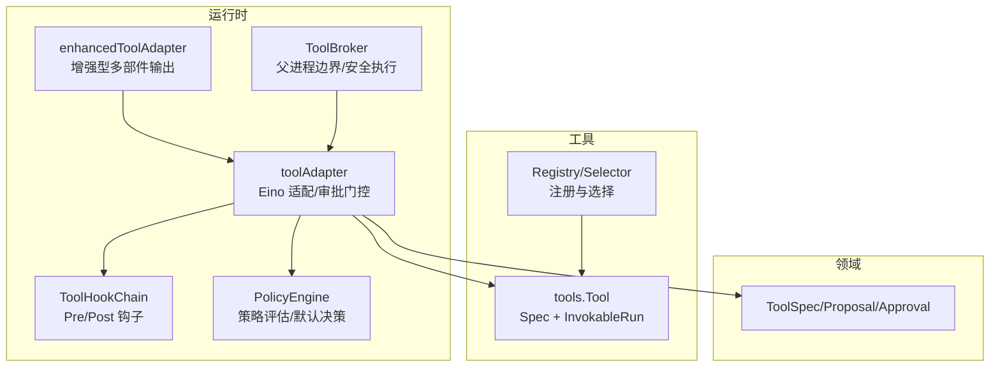
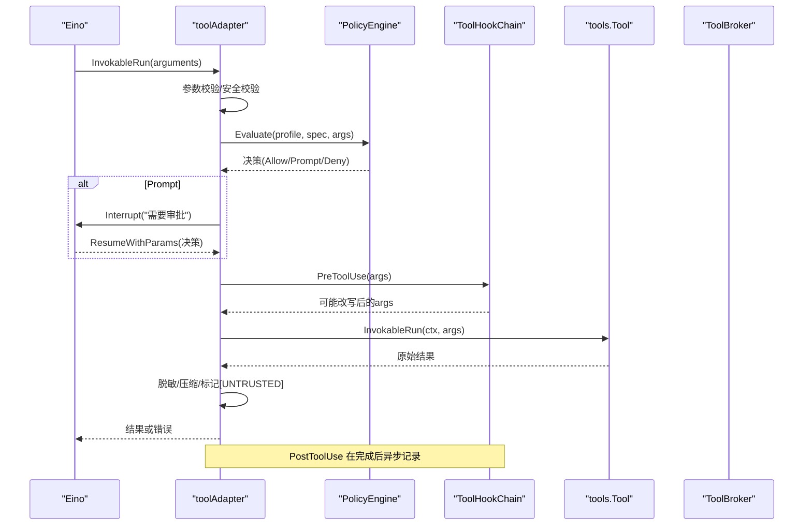
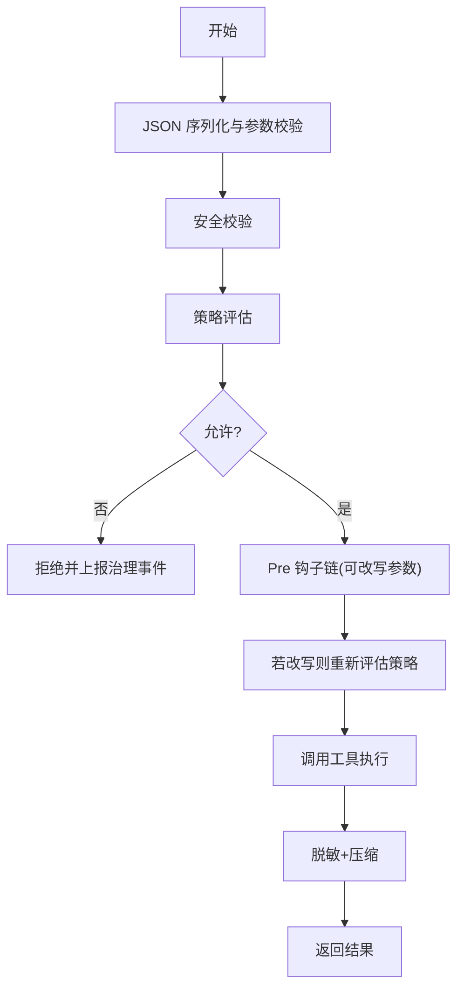
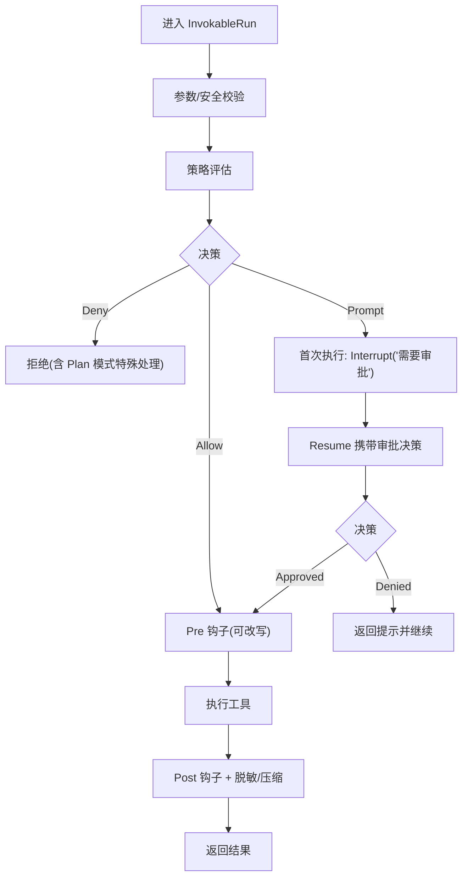
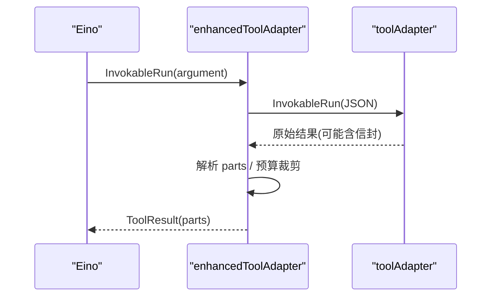
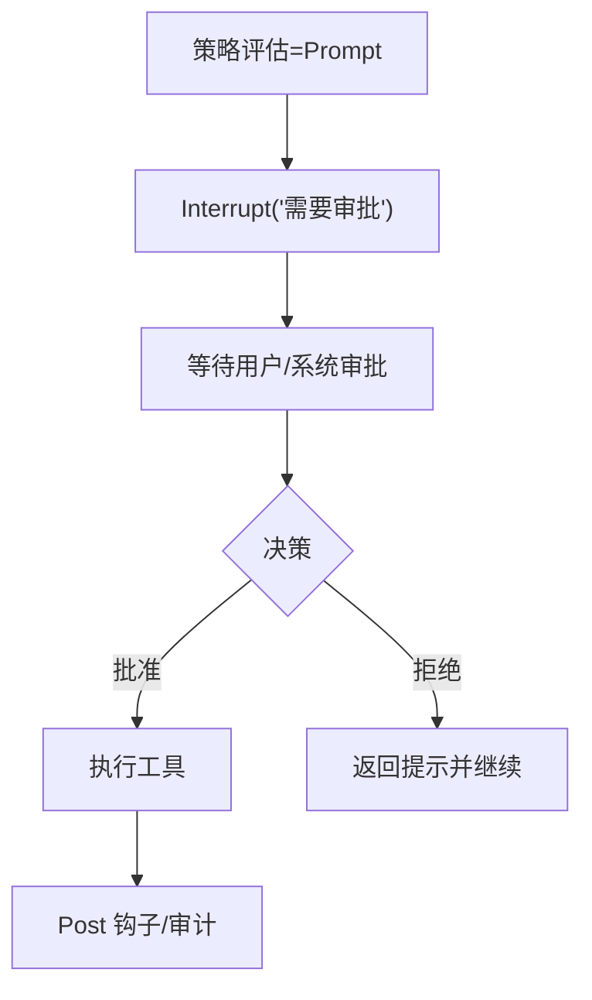
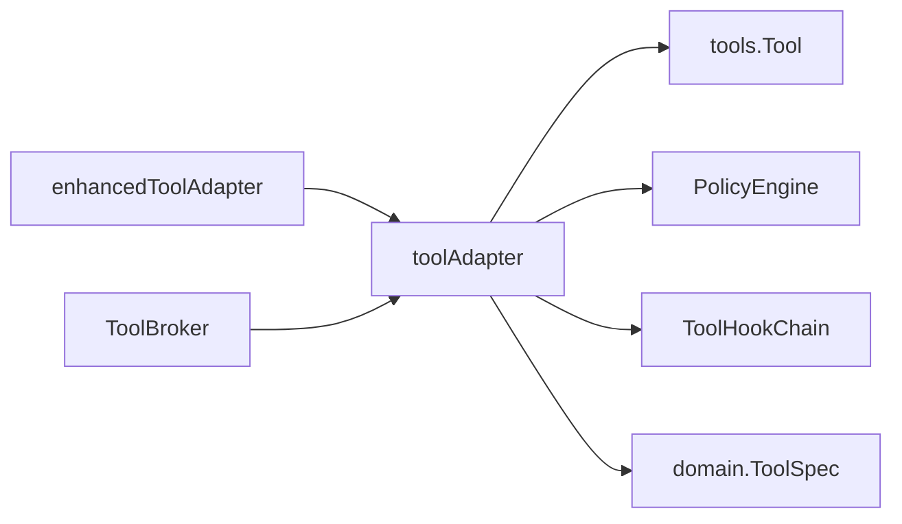
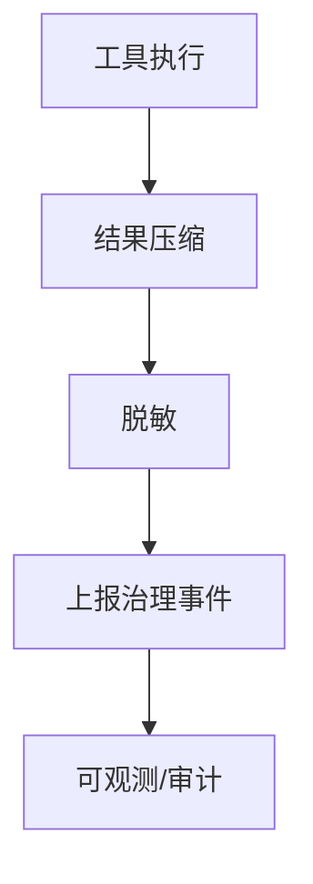

# 工具执行代理

<cite>
**本文引用的文件**
- [internal/runtime/toolbroker.go](file://internal/runtime/toolbroker.go)
- [internal/runtime/enhanced_tooladapter.go](file://internal/runtime/enhanced_tooladapter.go)
- [internal/runtime/tooladapter.go](file://internal/runtime/tooladapter.go)
- [internal/runtime/hooks.go](file://internal/runtime/hooks.go)
- [internal/runtime/policy.go](file://internal/runtime/policy.go)
- [internal/tools/tools.go](file://internal/tools/tools.go)
- [internal/domain/tool.go](file://internal/domain/tool.go)
- [internal/runtimе/observability_test.go](file://internal/runtimе/observability_test.go)
</cite>

## 目录
1. [简介](#简介)
2. [项目结构](#项目结构)
3. [核心组件](#核心组件)
4. [架构总览](#架构总览)
5. [详细组件分析](#详细组件分析)
6. [依赖关系分析](#依赖关系分析)
7. [性能与监控](#性能与监控)
8. [故障排查指南](#故障排查指南)
9. [结论](#结论)

## 简介
本文件面向 Agent-Vivy 的“工具执行代理”，聚焦 ToolBroker、EnhancedToolAdapter、toolAdapter、PolicyEngine、HookChain 以及 ProposalProvider 在工具调用生命周期中的职责与协作。文档覆盖：
- 工具调用编排、错误处理、结果转换
- Vivy 工具到 Eino 可调用工具的适配
- 上下文传递、超时控制、资源清理
- 审批流程（只读 vs 影响性工具）
- 监控、指标、调试日志
- 常见故障定位与修复建议

## 项目结构
围绕工具执行的关键代码集中在 internal/runtime 与 internal/tools，领域模型在 internal/domain。整体分层如下：
- 运行时层（runtime）：负责策略评估、钩子链、Eino 适配、结果压缩与安全边界
- 工具层（tools）：定义工具契约、参数校验、注册表与选择器
- 领域层（domain）：工具规格、审批记录、事件类型等

**图示来源**
- [internal/runtime/tooladapter.go:24-163](file://internal/runtime/tooladapter.go#L24-L163)
- [internal/runtime/enhanced_tooladapter.go:13-37](file://internal/runtime/enhanced_tooladapter.go#L13-L37)
- [internal/runtime/toolbroker.go:12-24](file://internal/runtime/toolbroker.go#L12-L24)
- [internal/runtime/hooks.go:46-103](file://internal/runtime/hooks.go#L46-L103)
- [internal/runtime/policy.go:35-135](file://internal/runtime/policy.go#L35-L135)
- [internal/tools/tools.go:17-26](file://internal/tools/tools.go#L17-L26)
- [internal/domain/tool.go:27-50](file://internal/domain/tool.go#L27-L50)

**章节来源**
- [internal/runtime/tooladapter.go:24-163](file://internal/runtime/tooladapter.go#L24-L163)
- [internal/runtime/toolbroker.go:12-24](file://internal/runtime/toolbroker.go#L12-L24)
- [internal/tools/tools.go:17-26](file://internal/tools/tools.go#L17-L26)
- [internal/domain/tool.go:27-50](file://internal/domain/tool.go#L27-L50)

## 核心组件
- ToolBroker：父进程侧的安全执行边界，负责参数校验、策略评估、钩子重写再评估、结果脱敏与压缩、治理事件上报。提供普通与已批准两种入口。
- toolAdapter：将 Vivy tools.Tool 暴露为 Eino 可调用的 InvokableTool；实现参数校验、策略评估、交互中断（提问）、审批门控、运行与后处理。
- enhancedToolAdapter：在 toolAdapter 之上实现 EnhancedInvokableTool，支持多部件输出（文本/图片/音频/视频/文件），并做预算裁剪。
- PolicyEngine：基于 Profile 与规则进行策略评估，决定 Allow/Prompt/Deny，并提供默认决策逻辑。
- ToolHookChain：串联 Pre/Post 钩子，带超时、失败阻断、结果改写与度量上报。
- ProposalProvider：可选接口，用于在影响性工具执行前生成可审查的提案（预览、风险发现、目标哈希等）。

**章节来源**
- [internal/runtime/toolbroker.go:12-92](file://internal/runtime/toolbroker.go#L12-L92)
- [internal/runtime/tooladapter.go:24-184](file://internal/runtime/tooladapter.go#L24-L184)
- [internal/runtime/enhanced_tooladapter.go:13-94](file://internal/runtime/enhanced_tooladapter.go#L13-L94)
- [internal/runtime/policy.go:35-169](file://internal/runtime/policy.go#L35-L169)
- [internal/runtime/hooks.go:46-129](file://internal/runtime/hooks.go#L46-L129)
- [internal/tools/tools.go:28-32](file://internal/tools/tools.go#L28-L32)
- [internal/domain/tool.go:14-25](file://internal/domain/tool.go#L14-L25)

## 架构总览
下图展示一次工具调用的端到端流程：从 Eino 调用进入 toolAdapter，经过参数校验、策略评估、钩子链、审批门控，最终执行工具并返回结果。ToolBroker 作为父进程边界再次封装执行，确保策略与审计一致性。

**图示来源**
- [internal/runtime/tooladapter.go:78-184](file://internal/runtime/tooladapter.go#L78-L184)
- [internal/runtime/hooks.go:58-103](file://internal/runtime/hooks.go#L58-L103)
- [internal/runtime/policy.go:96-135](file://internal/runtime/policy.go#L96-L135)
- [internal/runtime/toolbroker.go:26-92](file://internal/runtime/toolbroker.go#L26-L92)

## 详细组件分析

### ToolBroker：父进程安全执行边界
- 职责
  - 统一入口：ExecuteBrokerTool 与 ExecuteApprovedBrokerTool
  - 参数序列化与校验、安全校验
  - 策略评估与治理事件上报
  - 钩子链 Pre 阶段重写后再评估
  - 调用底层工具、脱敏、压缩结果
  - 区分是否已批准（跳过初始提示决策，但重写的参数仍需通过策略）
- 关键路径
  - 未批准且策略拒绝：直接拒绝
  - 已批准：仍会执行 Pre 钩子与策略评估，防止权限扩大
  - 结果以不可信头部包裹并限制大小

**图示来源**
- [internal/runtime/toolbroker.go:26-92](file://internal/runtime/toolbroker.go#L26-L92)

**章节来源**
- [internal/runtime/toolbroker.go:12-92](file://internal/runtime/toolbroker.go#L12-L92)

### toolAdapter：Vivy 工具到 Eino 的适配与审批门控
- 职责
  - 暴露 Info 给 Eino（含参数 Schema）
  - 参数校验与安全校验
  - 策略评估与治理事件
  - 交互中断（question 类型）
  - 审批门控：首次执行中断等待审批，恢复时根据决策继续或跳过
  - 执行工具、Post 钩子、结果脱敏与压缩
- 只读与影响性工具路径
  - 只读工具：默认允许，直接执行
  - 影响性工具：默认 Prompt，首次中断，恢复后执行
- 计划模式保护：Plan 模式下拒绝影响性工具

**图示来源**
- [internal/runtime/tooladapter.go:78-184](file://internal/runtime/tooladapter.go#L78-L184)
- [internal/runtime/policy.go:137-169](file://internal/runtime/policy.go#L137-L169)

**章节来源**
- [internal/runtime/tooladapter.go:24-184](file://internal/runtime/tooladapter.go#L24-L184)
- [internal/runtime/policy.go:137-169](file://internal/runtime/policy.go#L137-L169)

### enhancedToolAdapter：多部件输出与预算裁剪
- 职责
  - 实现 EnhancedInvokableTool，委托内部 adapter 执行
  - 解析工具输出的多部件信封（text/image/audio/video/file）
  - 按预算裁剪输出，避免超限
- 数据流
  - 内部返回字符串（可能包含多部件信封）
  - 转换为 Eino 的多部件 ToolResult

**图示来源**
- [internal/runtime/enhanced_tooladapter.go:24-94](file://internal/runtime/enhanced_tooladapter.go#L24-L94)

**章节来源**
- [internal/runtime/enhanced_tooladapter.go:13-94](file://internal/runtime/enhanced_tooladapter.go#L13-L94)

### 审批流程与 ProposalProvider
- 审批触发
  - 策略评估结果为 Prompt 时，首次执行中断，等待外部审批
  - 恢复时读取审批决策：批准则执行，拒绝则跳过
- ProposalProvider
  - 可选接口，供影响性工具在执行前准备可审查的提案（Action/Target/Preview/RiskFindings/Data）
  - 与 Approval 记录关联，便于审计与失效检测（如目标变更导致 stale）
- 只读工具
  - 不要求审批，直接执行
- 影响性工具
  - 默认需要审批（除非策略配置为自动允许）

**图示来源**
- [internal/runtime/tooladapter.go:139-163](file://internal/runtime/tooladapter.go#L139-L163)
- [internal/tools/tools.go:28-32](file://internal/tools/tools.go#L28-L32)
- [internal/domain/tool.go:14-25](file://internal/domain/tool.go#L14-L25)

**章节来源**
- [internal/runtime/tooladapter.go:139-163](file://internal/runtime/tooladapter.go#L139-L163)
- [internal/tools/tools.go:28-32](file://internal/tools/tools.go#L28-L32)
- [internal/domain/tool.go:14-25](file://internal/domain/tool.go#L14-L25)

### 上下文传递、超时控制与资源清理
- 上下文传递
  - RunID、SessionID 注入工具上下文，确保工作区隔离与审计追踪
  - 选择集（selected tool set）通过上下文传播，限制本次请求可用的工具集合
- 超时控制
  - 钩子链每个钩子调用均使用 WithTimeout，防止阻塞
  - 策略评估与参数校验快速失败
- 资源清理
  - 钩子 Post 阶段 fail-open，不影响主流程，仅记录告警与事件
  - 结果压缩与脱敏保证内存与敏感信息可控

**章节来源**
- [internal/runtime/tooladapter.go:165-184](file://internal/runtime/tooladapter.go#L165-L184)
- [internal/runtime/hooks.go:58-129](file://internal/runtime/hooks.go#L58-L129)

## 依赖关系分析
- toolAdapter 依赖
  - tools.Tool：实际工具实现
  - PolicyEngine：策略评估
  - ToolHookChain：前后置钩子
  - domain.ToolSpec/ToolInteraction：工具元信息与交互类型
- ToolBroker 依赖
  - 同上，并在父进程边界重复执行策略与钩子，确保一致性
- enhancedToolAdapter 依赖
  - toolAdapter 与 Eino schema 类型，负责多部件输出转换

**图示来源**
- [internal/runtime/tooladapter.go:24-184](file://internal/runtime/tooladapter.go#L24-L184)
- [internal/runtime/enhanced_tooladapter.go:13-37](file://internal/runtime/enhanced_tooladapter.go#L13-L37)
- [internal/runtime/toolbroker.go:26-92](file://internal/runtime/toolbroker.go#L26-L92)
- [internal/tools/tools.go:17-26](file://internal/tools/tools.go#L17-L26)
- [internal/domain/tool.go:27-50](file://internal/domain/tool.go#L27-L50)

**章节来源**
- [internal/runtime/tooladapter.go:24-184](file://internal/runtime/tooladapter.go#L24-L184)
- [internal/runtime/enhanced_tooladapter.go:13-37](file://internal/runtime/enhanced_tooladapter.go#L13-L37)
- [internal/runtime/toolbroker.go:26-92](file://internal/runtime/toolbroker.go#L26-L92)
- [internal/tools/tools.go:17-26](file://internal/tools/tools.go#L17-L26)
- [internal/domain/tool.go:27-50](file://internal/domain/tool.go#L27-L50)

## 性能与监控
- 结果压缩
  - 对超长工具输出进行头尾保留与中间折叠，避免模型上下文溢出
- 脱敏
  - 所有工具结果在返回前进行敏感信息脱敏
- 治理事件
  - 策略评估、钩子执行、工具完成等关键节点上报治理事件，便于审计与观测
- 指标与调试
  - 钩子链记录耗时、失败原因与阶段
  - 测试用例验证 reasoning/usage/stall 等事件映射正确

**图示来源**
- [internal/runtime/tooladapter.go:186-202](file://internal/runtime/tooladapter.go#L186-L202)
- [internal/runtime/hooks.go:131-159](file://internal/runtime/hooks.go#L131-L159)
- [internal/runtimе/observability_test.go:12-73](file://internal/runtimе/observability_test.go#L12-L73)

**章节来源**
- [internal/runtime/tooladapter.go:186-202](file://internal/runtime/tooladapter.go#L186-L202)
- [internal/runtime/hooks.go:131-159](file://internal/runtime/hooks.go#L131-L159)
- [internal/runtimе/observability_test.go:12-73](file://internal/runtimе/observability_test.go#L12-L73)

## 故障排查指南
- 参数校验失败
  - 现象：返回 ArgError，字段与原因明确
  - 处理：检查工具 Spec 的参数类型与必填项
  - 参考路径：[internal/tools/tools.go:44-84](file://internal/tools/tools.go#L44-L84)
- 策略拒绝
  - 现象：ErrPolicyDenied，附带原因
  - 处理：调整策略 Profile/规则，或确认是否为只读工具
  - 参考路径：[internal/runtime/policy.go:96-135](file://internal/runtime/policy.go#L96-L135)
- 计划模式拒绝影响性工具
  - 现象：ErrPlanModeToolDenied
  - 处理：切换到非 Plan 模式或改为只读操作
  - 参考路径：[internal/runtime/tooladapter.go:100-105](file://internal/runtime/tooladapter.go#L100-L105)
- 审批未通过或被拒绝
  - 现象：中断后恢复携带拒绝决策，工具未执行
  - 处理：修正工具调用意图或参数，重新提交审批
  - 参考路径：[internal/runtime/tooladapter.go:146-163](file://internal/runtime/tooladapter.go#L146-L163)
- 钩子超时或阻断
  - 现象：ErrHookBlocked，附带钩子名称与原因
  - 处理：优化钩子实现，缩短耗时或修正改写逻辑
  - 参考路径：[internal/runtime/hooks.go:58-103](file://internal/runtime/hooks.go#L58-L103)
- 提案过期或目标变更
  - 现象：错误中包含 proposal stale/target changed
  - 处理：重新生成提案并审批
  - 参考路径：[internal/runtime/tooladapter.go:176-180](file://internal/runtime/tooladapter.go#L176-L180)
- 结果过大被压缩
  - 现象：输出包含折叠标记
  - 处理：关注头部与尾部信息，必要时拆分任务
  - 参考路径：[internal/runtime/tooladapter.go:186-202](file://internal/runtime/tooladapter.go#L186-L202)

**章节来源**
- [internal/tools/tools.go:44-84](file://internal/tools/tools.go#L44-L84)
- [internal/runtime/policy.go:96-135](file://internal/runtime/policy.go#L96-L135)
- [internal/runtime/tooladapter.go:100-105](file://internal/runtime/tooladapter.go#L100-L105)
- [internal/runtime/tooladapter.go:146-163](file://internal/runtime/tooladapter.go#L146-L163)
- [internal/runtime/hooks.go:58-103](file://internal/runtime/hooks.go#L58-L103)
- [internal/runtime/tooladapter.go:176-180](file://internal/runtime/tooladapter.go#L176-L180)
- [internal/runtime/tooladapter.go:186-202](file://internal/runtime/tooladapter.go#L186-L202)

## 结论
Agent-Vivy 的工具执行代理通过清晰的层次划分与严格的门控机制，实现了：
- 安全的父进程边界执行（ToolBroker）
- 灵活的 Eino 适配与多部件输出（toolAdapter/EnhancedToolAdapter）
- 可配置的审批与策略引擎（PolicyEngine）
- 可扩展的前后置钩子链（ToolHookChain）
- 完善的监控与审计（治理事件、脱敏、压缩）

这些能力共同保障了工具执行的可靠性、可观测性与安全性，同时为只读与影响性工具提供了差异化执行路径。